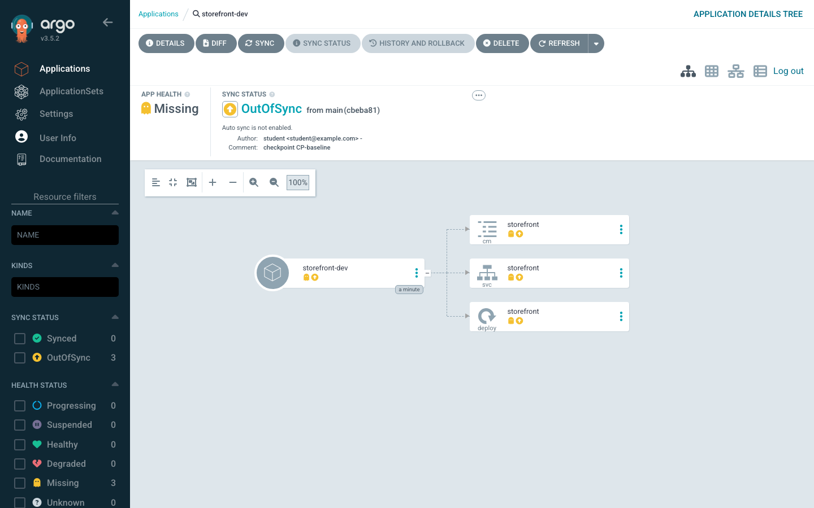
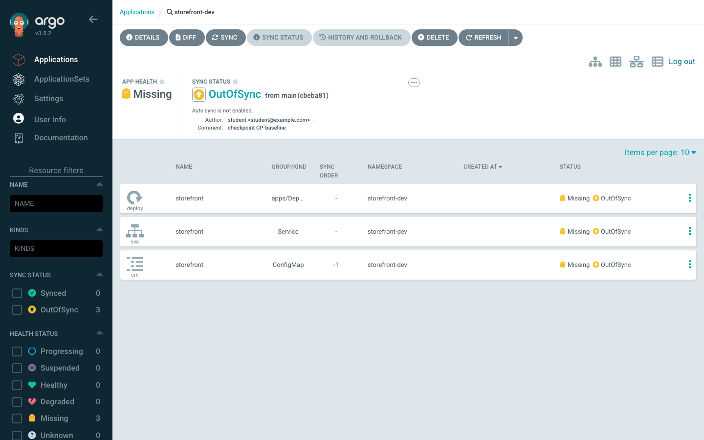
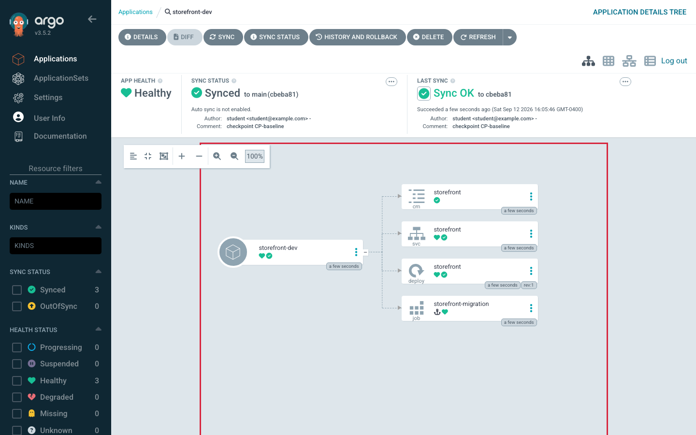
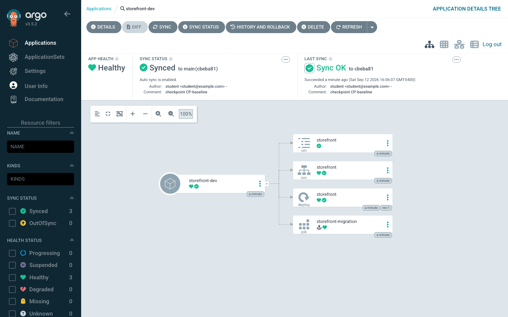

# Helm Deployments, Synchronization, and Promotion

> **Day 1 · Session 4 · Concept guide · ~60 minutes**
> **Argo CD version this course targets: `v3.5.2`** (Helm chart `10.8.4`; the repo-server renders charts with **Helm v4.2.1**).
> **What you need open:** nothing is required — this is a read-and-think session. There is one optional, read-only `helm template` exercise at the end (Section 8) that changes nothing on any cluster. **Lab 3** is where you actually deploy this chart, introduce drift, and recover; this session gives you the mental model that makes Lab 3 make sense.

**Where this sits in the course.** Session 1 gave you the platform's shape. Session 2 named every component and the two status axes (sync = "does it match Git?", health = "is it working?"). Session 3 stood the platform up and onboarded a repository and a cluster. This session answers the question a platform engineer asks next: **once Argo CD is holding a Helm chart, what does it actually _do_ with it — and how do you move a change safely from development to production?** By the end you will be able to explain why `helm rollback` does not work under Argo CD, predict what a sync will and will not delete, read a sync-wave ordering, and describe a promotion as the small, reviewable Git change it really is.

---

## 1. Why this matters

It is a Tuesday afternoon. An engineer is paged: the `storefront` application on the workload cluster is misbehaving after a bad release. They know Helm, so they reach for the tool they trust and run:

```bash
helm rollback storefront
```

Nothing happens. `helm rollback` reports there is **no release history** to roll back to. Confused, they run `helm list` in the namespace — and it is **empty**. There is no Helm release at all, even though a Helm chart is clearly running here.

So they try the other thing they know. They hand-edit the live Deployment on the cluster to the previous image tag with `kubectl edit`. It works — for about a minute. Then, without anyone touching it again, the Deployment **flips back** to the broken image. They edit it again. It reverts again. The cluster appears to be fighting them.

Nothing here is broken. Every one of those surprises comes from a single fact about how Argo CD uses Helm — and once you hold that fact, all three surprises become obvious and predictable:

- There is no Helm release to roll back **because Argo CD never created one.**
- `helm list` is empty **for the same reason.**
- The Deployment reverts **because Argo CD is doing exactly what it was configured to do:** hold the cluster to what Git says.

This session is about not being that engineer. We will make the render-vs-release distinction concrete, then build on it: how values combine, how a sync is ordered, what prune and self-heal really do, and how a change travels from `dev` to `prod` as a one-line diff with a reviewer's name on it.

---

## 2. Plain-language mental model: Argo CD borrows Helm's typewriter, not its filing cabinet

Helm, used on its own, does two very different jobs, and it is easy to think of them as one:

1. **A templating engine.** It takes a chart (templates plus values) and produces finished Kubernetes manifests — plain YAML (YAML Ain't Markup Language, the text format Kubernetes objects are written in). Think of this as a **typewriter**: values go in, finished pages come out.
2. **A release manager.** After it produces those pages, `helm install` and `helm upgrade` *apply* them to the cluster **and record a numbered release** (release 1, release 2, release 3…) in a Secret in the namespace. That history is what `helm rollback` and `helm list` read. Think of this as a **filing cabinet** of every version Helm has ever shipped.

Here is the one idea the whole session hangs on:

> **Argo CD borrows Helm's typewriter and throws away Helm's filing cabinet.**

Concretely: Argo CD runs `helm template` to render the chart into manifests, and then **Argo CD itself** applies those manifests to the cluster, tracking them the same way it tracks any other resource. It does **not** run `helm install` or `helm upgrade`. No numbered release is ever created. No release history exists. The filing cabinet was never installed.

That single design choice explains every surprise from Section 1, and four more consequences besides:

1. **There is no Helm release.** `helm list` in the app's namespace shows nothing, forever. That empty output is not a bug — it is proof the model is working.
2. **`helm rollback` does not exist here.** "Rolling back" means reverting a commit in Git, because Git — not a Helm release Secret — is the record of every version.
3. **Helm hooks are re-interpreted, not run by Helm.** A `helm.sh/hook` annotation is mapped onto Argo CD's own phase model (Section 5.3), not executed by Helm's release machinery.
4. **A chart that renders a fresh random value every time can never settle.** Because Argo CD re-renders and re-compares on a schedule, a template using something like `randAlphaNum` produces a different manifest on every comparison, so the app is permanently `OutOfSync`. The fix is in the chart (set the value explicitly), not in Argo CD.

Hold onto the typewriter-not-filing-cabinet picture. Everything below is a consequence of it.

> **One honest boundary, stated once.** This does **not** mean "Argo CD does not use Helm." It uses Helm heavily — the binary, the templating engine, the values semantics, the `--set` overrides. What it declines is Helm's *release lifecycle*. It is a very specific kind of "throwing away."

---

## 3. Vocabulary, grounded before we use it

Every term below gets a plain-language definition first, then its role. These are the words this file introduces to the rest of the course; later guides use them freely.

- **`helm template` rendering.** Running Helm purely as a typewriter: it reads a chart and its values and prints finished Kubernetes YAML to standard output, applying nothing and recording no release. This is exactly what Argo CD's **repo-server** (repository server, the component that produces manifests) does for a Helm source.

- **chart source / pinned revision.** The *chart source* is where the chart lives (a Git repository and path, or a Helm/OCI registry). The *pinned revision* is **which exact version** of that source Argo CD reads — a branch name, a Git tag, or a commit **SHA** (Secure Hash Algorithm hash — the unique 40-character fingerprint of a commit). A branch name moves over time; a tag or SHA does not. This is the Application's `spec.source.targetRevision`.

- **`valueFiles`.** A list of values files, relative to the chart, that Argo CD passes to Helm at render time (for example `envs/dev/values.yaml`). Later files in the list override earlier ones. This is how one chart produces different manifests per environment.

- **values precedence.** The rule for *which value wins* when the same key is set in more than one place. From lowest priority to highest: the chart's own `values.yaml` default → `valueFiles` → an inline `valuesObject` in the Application → a `parameters` entry (equivalent to Helm's `--set`). The last one wins. Section 6 walks the ladder concretely.

- **prune.** A sync option that lets Argo CD **delete** live resources that have disappeared from the desired state (from Git). With prune **off** (the default), Argo CD flags such a resource but leaves it running. With prune **on**, it removes it.

- **self-heal.** A sync policy that makes Argo CD **re-apply** the desired state whenever the live cluster drifts away from it — for example after a `kubectl edit`. It is *automatic correction of drift*, and it is the reason the Deployment in Section 1 kept reverting.

- **sync option.** One of a set of named switches (like `Prune=false`, `PruneLast=true`, `CreateNamespace=true`) that fine-tune *how* a sync is executed. They are set per-Application or per-resource (via the `argocd.argoproj.io/sync-options` annotation). Section 5.4 has the full reference table.

- **retry.** Argo CD re-attempting a **sync operation** that failed, on a backoff schedule you configure (a limit, an initial delay, a growth factor, a maximum delay). Note the precise scope: retry applies to a sync that *failed while running*, not to producing a new sync when nothing changed (Section 9 corrects the common misconception).

- **sync phase.** One of the ordered stages every sync moves through: **PreSync → Sync → PostSync** (plus **SyncFail** if something fails, and **PostDelete** on deletion). Hooks attach to a phase. Everything in an earlier phase completes before a later phase begins.

- **sync wave.** A number (set with the `argocd.argoproj.io/sync-wave` annotation; default `0`, negatives allowed) that orders resources **within** a phase. Lower waves are created first; Argo CD waits for each wave to become Healthy before starting the next.

- **hook.** A resource (often a `Job`) annotated to run at a specific phase — for example a **PreSync** database migration that must finish before the new code rolls out. Under Argo CD, a hook is scheduled by Argo CD's phase model, not by Helm.

- **rollback vs. roll-forward.** Two ways to recover. *Roll-forward* means commit a fix and move to a new, better state. *Rollback* means return to a previous known-good state. Under GitOps both are Git operations (Section 6.3), which is why the Section 1 `helm rollback` failed — the record it wanted lives in Git, not in Helm.

- **promotion.** Moving a change from a lower environment to a higher one (dev → staging → prod). Under GitOps this is not a pipeline copying artifacts; it is **writing a version pin from one environment's values into the next** — a small, reviewable Git change.

- **HPA (Horizontal Pod Autoscaler).** A Kubernetes object that changes a Deployment's replica count automatically based on load. It appears here because it *also* wants to own `replicas`, which makes it a good example of the ownership trap in Section 5.5.

- **CRD (Custom Resource Definition).** A way to teach Kubernetes a new kind of object; `Application` and `AppProject` are CRDs Argo CD installed. Mentioned here only because rendering can produce CRDs, which often need an early sync wave.

Two more one-word expansions used throughout: **CLI** (command-line interface) and **UI** (user interface).

---

## 4. The one boxed warning to carry into Day 2: Helm's version is part of your desired state

Because Argo CD *is* the thing running Helm, the **Helm version it renders with is part of your desired state** — as real an input as your chart or your values. That has a consequence most teams meet the hard way.

> ### ⚠️ Why an Argo CD upgrade can change your manifests with no Git change
>
> Argo CD `v3.5` moved its bundled chart renderer to **Helm 4** (reported as **`4.2.1`** in the v3.4 → v3.5 upgrade notes) and made it the **only** Helm binary used to render charts. Helm 4 changed how `null`/nil values coalesce during rendering. The practical effect: **the same chart with the same values can render _different_ manifests after you upgrade Argo CD alone** — most visibly for charts with nullable defaults or ones that relied on nulls being dropped.
>
> Picture the failure: you upgrade Argo CD on Monday, touch no chart and no values, and on Tuesday forty applications show a diff nobody committed. Under the old "Argo CD runs Helm" mental model this is inexplicable. Under the typewriter model it is obvious — **you replaced the typewriter, so the pages came out different.**
>
> The cheap, specific practice this motivates: **before upgrading Argo CD, render your real charts with the new version's Helm and `diff` the output.** That is what "test compatibility before an upgrade" actually means, and Session 7 (guide 07) turns it into a rehearsed step. (This course's sample charts sidestep the issue on purpose — the `storefront` chart never uses `null` to delete a default.)
>
> One related gotcha: because Helm 4 is the *only* renderer in `v3.5`, setting `spec.source.helm.version: v3` on an Application has **no effect** — it is ignored. There is no "render this app with Helm 3" switch anymore.

Note the version numbers here are flagged for primary-source confirmation (see the verification note at the end). Your VM's `helm` CLI is pinned to **v4.2.1** specifically so it matches the repo-server — rendering locally gives you the same result Argo CD gets.

---

## 5. Visuals

Five pictures carry this session. Read each one *before* the debrief under it, and try to answer its prediction question in your head first.

### V-14 · The Helm rendering pipeline, and the precedence ladder

**Predict first:** if the chart's `values.yaml` says `replicaCount: 1`, the `dev` values file says `replicaCount: 1`, and the Application passes a `parameter` of `replicaCount=4`, how many replicas end up in the rendered Deployment?

Here is what actually happens to a Helm source, end to end. Notice that Helm's release manager never appears:

```text
   GIT (desired state)                 REPO-SERVER                 APPLICATION CONTROLLER            WORKLOAD CLUSTER
 ┌──────────────────────┐          ┌────────────────────┐        ┌──────────────────────┐        ┌───────────────────┐
 │ chart templates/     │          │ runs:              │        │ compares rendered     │        │ live objects       │
 │ chart values.yaml    │ ──read─▶ │  helm template ... │ ─YAML─▶ │ manifests vs. live    │ ─apply▶│ ConfigMap, Service │
 │ envs/<env>/values    │          │ (NO install,       │        │ then APPLIES them      │        │ Deployment, Job... │
 │ Application params   │          │  NO release)       │        │ itself (kubectl-like) │        │                    │
 └──────────────────────┘          └────────────────────┘        └──────────────────────┘        └───────────────────┘
                                            │
                                            ▼  there is NO `helm install`, NO release Secret, NO `helm rollback`
```

And here is the **precedence ladder** — which value wins when the same key is set in several places. Read it top-to-bottom as "highest priority first":

```text
  ▲ HIGHEST PRIORITY (wins)
  │  1. parameter            spec.source.helm.parameters  (like `helm --set replicaCount=4`)
  │  2. valuesObject         spec.source.helm.valuesObject (inline values in the Application)
  │  3. valueFiles           spec.source.helm.valueFiles   (e.g. envs/dev/values.yaml)
  │  4. chart default        the chart's own values.yaml
  ▼ LOWEST PRIORITY (fallback)
```

**What to notice:**

1. **The typewriter, not the filing cabinet.** The repo-server runs `helm template` and hands finished YAML to the application controller. The controller applies it. No step in this pipeline is `helm install`.
2. **Answer to the prediction:** **4 replicas.** A `parameter` sits at the top of the ladder, so `replicaCount=4` overrides both the values file and the chart default. (You can confirm this yourself in Section 8.)
3. **Environment differences live one rung down.** Almost all day-to-day customization is done with `valueFiles` (rung 3) — one chart, one values file per environment. Parameters (rung 1) are for surgical, per-Application overrides.
4. **The exact ordering between `valuesObject` and `valueFiles` is flagged for confirmation** at v3.5 (verification note at the end); the parameter-wins-over-values-file behavior is confirmed against this course's own Helm v4.2.1.

### V-15 · Repository-layout options (and the one this course uses)

**Predict first:** you run one chart across `dev`, `staging`, and `prod`. Do you keep the three environments in three directories of one repo, three branches of one repo, or three separate repos?

There is a recommended default and two alternatives. Here is the recommended layout — **directory-per-environment**, which is exactly what `storefront-gitops` uses:

```text
storefront-gitops/                 # ONE repo, ONE chart, per-env values in directories
  charts/storefront/               # the chart, rendered for every environment
  envs/
    dev/values.yaml                # replicaCount: 1, UI "storefront DEV"
    staging/values.yaml            # replicaCount: 2, UI "storefront STAGING"
    prod/values.yaml               # replicaCount: 2, UI "storefront PROD"
```

And here is how the three options compare:

| Layout | How environments differ | Strengths | Watch-outs |
|---|---|---|---|
| **Directory-per-env** (this course) | Different values file, same branch | Every environment's config is visible side-by-side; promotion is a one-file diff; one place to review | Everyone shares one branch's history |
| **Branch-per-env** | Different branch of the same repo | Familiar Git-flow feel; per-env access control via branch protection | Promotion becomes a merge; drift between branches is easy to miss |
| **Repo-per-env** | A separate repository per environment | Hard blast-radius and access boundaries | Duplication; keeping the chart in sync across repos is manual work |

**What to notice:**

1. **Directory-per-env makes promotion legible.** Because all three environments' values sit next to each other, "promote dev to staging" is a change you can *see* — a diff between two files, reviewed in one pull request.
2. **The trade is boundary strength vs. friction.** Repo-per-env gives the hardest isolation and the most duplication; directory-per-env gives the least friction and a shared history. Pick for the boundary you actually need.
3. Day 2's ApplicationSet lab (guide `lab-04`) revisits this when one generator fans a single template across all three environments at once.

### V-16 · The sync phase / wave timeline (ordering, and where one failure stops the rest)

**Predict first:** the `storefront` chart has a PreSync migration `Job`, a ConfigMap in wave `-1`, and a Deployment and Service in wave `0`. In what order does Argo CD create them — and if the migration Job fails, which of the others get created?

A sync is not one big `kubectl apply`. It is an **ordered** operation. The order is decided by four keys, checked in this exact priority: **phase → wave → kind → name.**

```text
 PHASE:      PreSync                 │  Sync                                       │  PostSync
             (hooks that must run    │  (your normal resources, ordered by wave)   │  (hooks after
              before anything else)  │                                             │   success)
 ───────────────────────────────────┼─────────────────────────────────────────────┼───────────────
 storefront  ┌───────────────────┐  │  wave -1        wave 0            wave 0      │
 example:    │ Job               │  │  ┌───────────┐  ┌────────────┐   ┌─────────┐  │  (none in this
             │ storefront-       │─▶│  │ ConfigMap │─▶│ Service     │─▶│ Deploy   │ │   chart)
             │ migration         │  │  │ storefront│  │ storefront  │  │ storefront│ │
             └───────────────────┘  │  └───────────┘  └────────────┘   └─────────┘  │
              must SUCCEED first      lower wave first    ~2s wait between waves;
                                                          controller waits for Healthy
```

**What to notice:**

1. **Answer to the prediction — order:** the PreSync `storefront-migration` Job runs **first and alone**; only after it succeeds does the Sync phase begin, creating the wave `-1` ConfigMap, then the wave `0` Service and Deployment. **If the migration Job fails, none of the Sync-phase resources are created at all.** That is the whole point of a PreSync migration: no new code rolls out against an un-migrated database.
2. **Waves build low-to-high — and tear down high-to-low.** During a *sync*, wave `-1` precedes wave `0`. During a *prune/delete*, the order **reverses**: higher waves are removed first, exactly as you would dismantle something you had built up in layers.
3. **Argo CD waits ~2 seconds between waves** (configurable via the `ARGOCD_SYNC_WAVE_DELAY` environment variable) **and waits for each wave to report Healthy before advancing.** This delay and this health-gate are flagged for confirmation at v3.5 (verification note at the end).
4. **A resource with no meaningful health check can make wave ordering ineffective.** If a kind has no health assessment, its wave "completes instantly" regardless of whether it is truly ready — so the next wave starts too early. This is the real reason wave ordering sometimes appears not to work, and it is a direct forward-reference to **custom health checks in guide 07**.

### V-17 · Drift, before and after, with the self-heal loop

**Predict first:** with self-heal **off**, you `kubectl scale` the live Deployment from 1 replica to 5. Which of the two status axes changes — sync, health, both, or neither?

Drift is not *detected* the instant you type; it is *discovered* on the next comparison. Here is the difference self-heal makes:

```text
 SELF-HEAL OFF                                  SELF-HEAL ON
 ─────────────                                  ────────────
 t0  you: kubectl scale --replicas=5            t0  you: kubectl scale --replicas=5
 t1  next compare → OutOfSync (Healthy)         t1  next compare → OutOfSync (Healthy)
 t2  ...stays OutOfSync indefinitely            t2  controller RE-APPLIES desired state
     (Argo CD reports drift, changes nothing)   t3  back to Synced; your change is GONE
                                                    (you did not do anything wrong —
                                                     the policy says Git wins ties)
```

**What to notice:**

1. **Answer to the prediction:** only **sync** changes. It goes `OutOfSync` and — with self-heal off — *stays* there, while health stays `Healthy` (five replicas of a working app are still working). This one observation is the cleanest possible proof that sync and health are independent axes. You will run exactly this in Lab 3.
2. **Drift is discovered, not detected.** There is a window between your edit and the next comparison during which the cluster is "wrong" and Argo CD has not reacted yet. Argo CD is a comparison-on-a-schedule, not an admission controller blocking your change.
3. **Self-heal does not block your edit — it outlives it.** Your `kubectl scale` *succeeds*. Then the next reconciliation undoes it. During an incident this feels like the system fighting you; it is behaving exactly as configured. The escape hatch is not to keep re-editing — it is to disable automated sync on that one Application, stabilize, then commit.

### V-18 · Promotion flow: dev → staging → prod (a number moves, not a chart)

**Predict first:** you want the exact build that has run cleanly in `dev` for a week to go to `staging`. What is the smallest change that accomplishes it?

Promotion under GitOps is not a pipeline shipping artifacts between environments. It is **moving a version pin from one environment's config into the next.** The chart does not move. The image does not move. A number moves — in a pull request, with a reviewer.

```text
   dev/values.yaml            staging/values.yaml          prod/  (config.yaml)
   image.tag: 6.16.0   ──▶    image.tag: 6.16.0    ──▶     targetRevision: storefront-1.0.0
   (tracks main, moves         (promoted after a week        (pinned to an IMMUTABLE Git TAG:
    freely in dev)              of clean dev soak)             prod never tracks a moving branch)

   PROMOTION = a one-line diff:   -  image.tag: 6.15.0
                                  +  image.tag: 6.16.0
```

**What to notice:**

1. **Answer to the prediction — the smallest promotion is a one-line diff.** Write the tag that `dev` has proven into `staging/values.yaml`. That single line, reviewed and merged, *is* the promotion.
2. **Environments differ by their pin, not by their chart.** In this repo, `dev` and `staging` track the `main` branch (their `config.yaml` sets `targetRevision: main`), while `prod` is pinned to the **immutable tag** `storefront-1.0.0`. Production changes only when a human deliberately moves that pin.
3. **This is why directory-per-env (V-15) is recommended.** Promotion is reviewable precisely because both files are visible in one place and the change between them is small.

---

### 📎 Sidebar (3 minutes): where Kustomize complements Helm — and the ownership trap

Some teams render a Helm chart and then apply a small **Kustomize** patch on top of the result (Kustomize is a Kubernetes-native tool that patches finished YAML without templating it). Argo CD supports this combined "render Helm, then Kustomize the output" mode. It is genuinely useful for a **last-mile tweak the chart does not expose** — for example, adding a label to every rendered object.

The risk is **ownership.** Consider a Kustomize patch that sets `replicas: 3` on a Deployment the Helm chart already rendered with `replicas: 1`. Now two tools express intent about the *same field*. A teammate reading the Helm values sees `1`; the cluster runs `3`; the truth is in a Kustomize patch a rung away. When a field has two possible owners, "who owns this field?" — the question that decides where a fix goes — no longer has a clean answer. (It gets worse if an HPA _also_ owns `replicas`; now three things fight.)

The rule this course follows: reach for Kustomize-on-Helm only for tweaks the chart genuinely cannot express, and never let it silently re-own a field the chart already sets. Guardrails against this kind of unclear ownership are covered in **guide 06**. *(No hands-on here — this is a boundary to recognize, not a task.)*

---

## 5.4 Reference table: sync options, retries, and timeouts

You do not need to memorize these. Recognize them, and know where to look. They are set per-Application (in `spec.syncPolicy`) or per-resource (via the `argocd.argoproj.io/sync-options` annotation, comma-separated). Exact spellings are flagged for confirmation at v3.5 (verification note at the end).

| Option / setting | What it does | When you reach for it |
|---|---|---|
| `Prune=false` | Refuses to delete a specific resource even if it leaves Git | Protect a resource you never want auto-deleted |
| `PruneLast=true` | Defers all pruning to a final implicit wave, after everything else is deployed and Healthy | Avoid deleting the old version before the new one is up |
| `ApplyOutOfSyncOnly=true` | Applies only the resources that are actually out of sync, not the whole app | Large apps where re-applying everything is wasteful |
| `CreateNamespace=true` | Creates the destination namespace if it does not exist | First deploy into a brand-new namespace |
| `ServerSideApply=true` | Uses Kubernetes server-side apply instead of client-side | Large manifests, or shared fields with other controllers |
| `Replace=true` | Uses `kubectl replace`/`create` instead of `apply` | Rare — resources that cannot be patched in place |
| `RespectIgnoreDifferences=true` | Honors the app's `ignoreDifferences` rules during sync, not only during comparison | Fields you deliberately let another controller own |
| `retry` (limit, backoff) | Re-attempts a **failed** sync on a backoff schedule: an initial `duration`, a `factor` it grows by, and a `maxDuration` cap | Transient failures (a slow image pull, a brief API hiccup) |
| `ARGOCD_SYNC_WAVE_DELAY` | The pause between sync waves (default ~2s) | Tuning ordering behavior (an operator-level setting) |

> **The two adoption rules worth memorizing.** **Turn on self-heal early; turn on prune late.** Self-heal's worst case is an *argument* (it reverts a manual edit — reversible). Prune's worst case is a *deletion* (someone renames a directory, everything under the old path is now "not in Git," and prune removes it — the 3 a.m. incident). That is why `Prune=false` and `PruneLast=true` exist, and why prune deserves a slower, per-application rollout.

---

## 6. Worked walkthrough

Three short traces turn the visuals into things you have seen happen.

### 6.1 Trace a Helm source from Git to the cluster

This is the real `storefront` chart, rendered with this course's Helm **v4.2.1** and the `dev` values file. Running `helm template` locally does exactly what the repo-server does — it prints finished manifests and applies nothing:

```bash
helm template storefront charts/storefront -f envs/dev/values.yaml
```

Trimmed, real output (four objects, in the order the chart defines them):

```yaml
# Source: storefront/templates/configmap.yaml
apiVersion: v1
kind: ConfigMap
metadata:
  name: storefront
  annotations:
    argocd.argoproj.io/sync-wave: "-1"        # created BEFORE the Deployment
data:
  PODINFO_UI_MESSAGE: "storefront DEV"
  PODINFO_UI_COLOR: "#2da44e"
---
# Source: storefront/templates/service.yaml
apiVersion: v1
kind: Service
metadata:
  name: storefront
  annotations:
    argocd.argoproj.io/sync-wave: "0"
# ...
---
# Source: storefront/templates/deployment.yaml
apiVersion: apps/v1
kind: Deployment
metadata:
  name: storefront
  annotations:
    argocd.argoproj.io/sync-wave: "0"
spec:
  replicas: 1
  # image: stefanprodan/podinfo:6.15.0
# ...
---
# Source: storefront/templates/migration-job.yaml
apiVersion: batch/v1
kind: Job
metadata:
  name: storefront-migration
  annotations:
    argocd.argoproj.io/hook: PreSync           # a HOOK, mapped onto Argo CD's PreSync phase
    argocd.argoproj.io/hook-delete-policy: BeforeHookCreation
# ...
```

Read three things out of this:

1. **This is the desired state Argo CD compares against live.** No release was created; `helm list` on the workload would show nothing. You will confirm exactly that in Lab 3, and explaining the empty output is the point.
2. **The ordering annotations are already here.** The ConfigMap carries `sync-wave: "-1"`, the migration Job carries `hook: PreSync`. Argo CD reads these to build the timeline from V-16 — the *text order* above is not the apply order.
3. **The image tag came from the values file, not the chart.** The chart's `values.yaml` deliberately leaves `image.tag` blank and calls Helm's `required` on it, so an environment that forgets to set a tag **fails rendering** with a readable message rather than silently deploying `latest`. That safety net is real — you can trigger it in Section 8.

### 6.2 Walk the precedence ladder with a real override

Same chart, but now pass a `parameter` (Helm `--set`) for `replicaCount`, which the `dev` values file sets to `1`:

```bash
helm template storefront charts/storefront -f envs/dev/values.yaml --set replicaCount=4 | grep 'replicas:'
```

Real output:

```text
  replicas: 4
```

The values file said `1`; the parameter said `4`; **`4` won.** That is the top rung of the ladder (V-14) beating rung 3, demonstrated on the actual chart. In an Argo CD Application this same override would be written declaratively as a `spec.source.helm.parameters` entry — the mechanism is identical, the source of truth is Git.

### 6.3 Narrate a promotion as a moving pin

Here is what "promote the current dev build to staging" is, as a change:

```diff
  # envs/staging/values.yaml
- image:
-   tag: "6.15.0"
+ image:
+   tag: "6.16.0"     # the tag dev has run cleanly for a week
```

That is the entire promotion. The chart did not change. The image already exists in the registry. A **number** moved from one environment's values into the next, in a pull request a human reviewed.

And recovery is the mirror image, decided by one question — *do I know why it broke?*

- **You know why →** **roll forward.** Commit the fix. Move to a new, better state.
- **You do not know why, and users are affected →** **roll back.** Restore the last known-good desired state — `git revert` the bad commit (not `git reset --hard`), so the recovery is itself an auditable event — then investigate with the pressure off.

Notice what is *not* in either path: `helm rollback`. There is no release to roll back to. The record of every version is the Git history, so recovery is a Git operation — which is exactly why the engineer in Section 1 found an empty filing cabinet.

---

## 7. Quick Checks

Answer each in your head (or on paper) **before** opening the collapsed answer. These are prediction and reasoning questions, not vocabulary quizzes.

### S4-QC1 — Automated sync is on, prune is off. A file is deleted from Git.

An Application has automated sync enabled but **prune disabled** (the default). Someone deletes `service.yaml` from the Git repository. The `Service` is still running live on the cluster. Predict: what does Argo CD do at the next sync, and what does the app's status show?

<details>
<summary>Show answer and rationale</summary>

**Argo CD leaves the live `Service` running and reports the app `OutOfSync`.** The desired state no longer includes the Service, but the live cluster still has it, so the comparison differs — the Service shows as "requires pruning." Because **prune is off**, automated sync will **not** delete it. Nothing disappears; the app sits `OutOfSync` until someone either prunes deliberately or restores the file.

**Rationale:** this is exactly why "turn on prune late" is the rule. Automated sync **applies** desired state aggressively but does **not delete** unless you have explicitly allowed pruning. The default is safe on purpose: a deleted file is far more often a mistake (a renamed directory, a mistyped path) than an intended deletion.
</details>

### S4-QC2 — Order six resources by phase → wave → kind → name

A single sync includes these six resources. Put them in the exact order Argo CD applies them:

- Deployment `web` (Sync phase, wave `0`)
- Job `db-migration` (**PreSync** hook, wave `0`)
- ConfigMap `app-config` (Sync phase, wave `-1`)
- Deployment `api` (Sync phase, wave `0`)
- Service `api` (Sync phase, wave `0`)
- Job `smoke-test` (**PostSync** hook, wave `0`)

<details>
<summary>Show answer and rationale</summary>

**Order:**

1. **`db-migration`** — PreSync phase runs before everything else.
2. **`app-config`** (ConfigMap) — Sync phase, lowest wave (`-1`) first.
3. **`api` Service** — Sync phase, wave `0`; among wave-0 resources, kind order puts Service before Deployment.
4. **`api` Deployment** — Sync phase, wave `0`; Deployment kind; name `api` sorts before `web`.
5. **`web` Deployment** — Sync phase, wave `0`; same kind, name `web` sorts after `api`.
6. **`smoke-test`** — PostSync phase runs last, after the Sync phase is Healthy.

**Rationale:** the four keys are checked strictly in order — **phase first, then wave, then kind, then name.** Phase dominates everything (a PreSync hook precedes even a wave `-1` Sync resource); within a phase, lower waves win; within a wave, a stable kind ordering applies; and name breaks any remaining tie alphabetically.
</details>

### S4-QC3 — Which value wins?

For the key `replicaCount`, the chart's `values.yaml` says `1`, the `dev` values file (`valueFiles`) says `2`, an inline `valuesObject` in the Application says `3`, and a `parameters` entry says `4`. What is the rendered replica count?

<details>
<summary>Show answer and rationale</summary>

**`4`.** The precedence ladder (highest first) is **parameter → valuesObject → valueFiles → chart default.** The `parameters` entry sits at the top, so `4` overrides all three lower sources.

**Rationale:** the same key set in multiple places is resolved by priority, not by proximity or file order. `parameters` (equivalent to Helm's `--set`) is the surgical, highest-priority override; the chart's own default is the last-resort fallback. (The parameter-beats-values-file part is confirmed against this course's Helm v4.2.1; the precise ordering between `valuesObject` and `valueFiles` is flagged for confirmation at v3.5.)
</details>

### S4-QC4 — A Kustomize patch sets `replicas` on Helm's output

A team renders the `storefront` chart (which sets `replicas` from `replicaCount`) and then applies a Kustomize patch that also sets `replicas: 3`. Who owns the `replicas` field on the live Deployment, and why is that risky?

<details>
<summary>Show answer and rationale</summary>

**The Kustomize patch owns `replicas`** — it is applied *after* Helm renders, so it wins over the chart's value. The risk is **unclear ownership.** The Helm values file shows one number; the cluster runs another; the real source of truth is a Kustomize patch a step removed from the chart. When someone needs to change the replica count, "where does this value live?" no longer has an obvious answer, and a well-intentioned edit to the Helm values will appear to do nothing.

**Rationale:** this is the exact "unclear ownership" the outline warns about, and it is why Kustomize-on-Helm should be reserved for tweaks the chart genuinely cannot express. It gets sharper if an **HPA** also manages `replicas`: now the chart, the patch, and the autoscaler all claim the same field, and they will fight. Guardrails for this belong in guide 06.
</details>

### S4-QC5 — Forty applications drift and nobody committed anything

You upgrade Argo CD on Monday. You touch **no chart** and **no values file** — no commits at all. On Tuesday, forty applications show a diff. Predict: what happened, and what one cheap step on the Monday *before* the upgrade would have caught it?

<details>
<summary>Show answer and rationale</summary>

**Argo CD's own bundled Helm version changed, so the same charts rendered different manifests** — most visibly for charts that relied on `null`/nil values being dropped during coalescing, which Helm 4 handles differently. Nobody changed the desired state in Git; you changed the **thing that renders** the desired state. Because Argo CD renders with `helm template` and applies the result itself, **Helm's version is part of your desired state** (insight **I-S4-02**).

The cheap Monday step: **render your real charts with the new version's Helm and `diff` the output before upgrading.** That is what "test compatibility before an upgrade" actually means, and guide 07 turns it into a rehearsed lifecycle step.

**Rationale:** under the wrong "Argo CD runs `helm upgrade`" model this is inexplicable — no release changed, no chart changed. Under the correct render-and-apply model it is obvious: replace the renderer, and the pages come out different.
</details>

---

## 8. Try It Yourself (optional, ~5 minutes, changes nothing on any cluster)

This is a read-only experiment on your VM. It renders the real chart twice and diffs the results. **Predict before you run it.**

**Predict first:** the `dev` and `staging` values files differ in namespace, replica count, and UI message/color. Which of those differences will actually show up in the rendered manifests, and which will not?

Run (clone the repo first if you have not already — the same `git clone` pattern Lab 2 used):

```bash
cd ~
git clone http://lab-gitea:3000/course/storefront-gitops.git 2>/dev/null; cd storefront-gitops
diff \
  <(helm template storefront charts/storefront -f envs/dev/values.yaml) \
  <(helm template storefront charts/storefront -f envs/staging/values.yaml)
```

Representative output (confirm against your VM):

```diff
15,16c15,16
<   PODINFO_UI_MESSAGE: "storefront DEV"
<   PODINFO_UI_COLOR: "#2da44e"
---
>   PODINFO_UI_MESSAGE: "storefront STAGING"
>   PODINFO_UI_COLOR: "#bf8700"
52c52
<   replicas: 1
---
>   replicas: 2
```

**What to make of it:**

- **The UI text/color and the replica count differ** — those are the values each environment overrides, and they land directly in the ConfigMap and the Deployment.
- **The `namespace` value does _not_ appear in the diff.** `helm template` renders object *contents*, not the namespace they get applied *into*; the namespace is decided by the Application's `destination`, not by a field inside these manifests. Noticing this absence is the real lesson — it is a small proof of the render-vs-apply split.
- **Bonus — see the safety net fire.** Try `helm template storefront charts/storefront -f envs/dev/values.yaml --set image.tag=""`. Rendering **fails** with `image.tag is required (set it in envs/<env>/values.yaml)` — the chart refuses to render a blank tag rather than deploy `latest`.

---

## 9. Common misconceptions

**"Argo CD runs `helm upgrade`."** It does not. It runs `helm template` to render manifests and applies them itself. There is **no Helm release** — `helm list` in the app's namespace is empty, there is no release history, and there is nothing for `helm rollback` to act on. This is the single most common source of confused Argo CD tickets; the empty `helm list` is the proof, not a symptom.

**"Self-heal retries a failed sync."** It does not. Self-heal re-applies desired state when the *live cluster drifts*. It does **not** re-attempt a sync that failed for the *same commit and parameters* — if a sync fails and nothing in Git or the parameters changes, Argo CD does not keep hammering it. Automatic re-attempts of a failed sync are the job of the separate **`retry`** setting (Section 5.4), on a backoff schedule you configure. Drift-correction and failed-sync-retry are two different mechanisms.

**"Rollback is always available."** Under Argo CD, the UI/CLI rollback action is **blocked while automated sync is enabled** on that Application — because rolling back to an old revision while auto-sync is on would be undone at the next reconciliation (Git would immediately win). To recover you either revert in Git (roll back the desired state) or first disable automated sync, then roll back. Rollback is not an always-on button; it is conditional on your sync policy.

**"`main` is a version."** Pointing `targetRevision` at `main` (or `HEAD`, or any branch) is **not** pinning a version — it is a **subscription.** Your desired state then changes whenever *anyone else* commits, without anyone deciding that *this* environment should change *now*. For `dev` that is the point. For a higher environment it means the environment has no owner. Two environments both set to `targetRevision: main` differ only by timing and luck; pin a tag or a commit SHA where a human must decide.

---

## 10. Key takeaways

- **Argo CD borrows Helm's templating engine and throws away Helm's release manager.** It runs `helm template` and applies the result itself — no release, no history, nothing for `helm rollback` to find. Recovery is a Git operation.
- **Helm's version is part of your desired state.** Upgrading Argo CD (to Helm 4) can change rendered manifests with no Git change — so diff your rendered charts before an upgrade (guide 07).
- **Values resolve by a ladder:** parameter → valuesObject → valueFiles → chart default, highest first. Environment differences normally live in `valueFiles`.
- **A sync is ordered by phase → wave → kind → name.** PreSync hooks run first; waves build low-to-high and tear down high-to-low; Argo CD waits ~2s and for Healthy between waves — and a resource with no health check makes waves ineffective (guide 07).
- **Prune and self-heal are different risks.** Self-heal argues with you (reversible); prune deletes (not). Turn self-heal on early, prune on late.
- **Promotion is a moving pin, not a moving artifact.** The smallest promotion is a one-line diff with a reviewer's name on it; production is pinned to an immutable tag, never a moving branch.

---

## Screenshots referenced in this session

These four screens make the abstractions above clickable. Each block gives an image reference with alt text, a version-stamped caption, a numbered "what to notice," and a capture specification so the image can be produced consistently. Where an image has not yet been captured from the live course instance, the capture spec is the authoritative description — the guide still works from the numbered notes if the image does not render.

### SS-S4-01 · The sync panel with options expanded



*Argo CD v3.5.2 — the Synchronize panel opened from the `storefront-dev` Application.*

<!-- CAPTURE-SPEC: SS-S4-01 — Argo CD Synchronize panel, options expanded.
Source: live capture only, course Argo CD v3.5.2 at https://localhost:8443, checkpoint CP-lab-03.
Steps: (1) log in as admin; (2) open the storefront-dev Application; (3) click SYNCHRONIZE to open the sync panel; (4) ensure the options section is expanded.
Capture: panel only. Highlight the Prune, Dry Run, Apply Only, and Force checkboxes, and the per-resource sync-options area.
Save to: courseware/assets/screenshots/day-1/s04-01-sync-options.png -->

**What to notice:**
1. **Prune is a deliberate checkbox, not a default.** You must choose to let a manual sync delete resources that left Git — the same "turn prune on late" caution as the reference table.
2. **Dry Run previews without applying.** It renders and compares but changes nothing — the safe way to see what a sync *would* do.
3. **The per-resource options** (for example `Prune=false` on a specific resource) map to the `argocd.argoproj.io/sync-options` annotation from Section 5.4.

### SS-S4-02 · The sync policy: automated sync, prune, and self-heal



*Argo CD v3.5.2 — the Sync Policy controls in the `storefront-dev` Application details.*

<!-- CAPTURE-SPEC: SS-S4-02 — Argo CD App details, Sync Policy section.
Source: live capture only, course Argo CD v3.5.2 at https://localhost:8443, checkpoint CP-lab-03.
Steps: (1) log in as admin; (2) open the storefront-dev Application; (3) open App Details (the "Details" / info panel); (4) scroll to the Sync Policy section.
Capture: panel only. Highlight the ENABLE AUTO-SYNC control and the PRUNE RESOURCES and SELF HEAL toggles.
Save to: courseware/assets/screenshots/day-1/s04-02-sync-policy.png -->

**What to notice:**
1. **Three separate controls, three separate risks.** Automated sync, prune, and self-heal are independent switches — you can enable self-heal without prune, which is exactly the recommended adoption order.
2. **Self-heal is the escape hatch from V-17.** During an incident, this is the toggle you turn *off* to stop Argo CD reverting your manual change.
3. **Prune sits right next to self-heal but carries the heavier consequence** — a deletion, not an argument.

### SS-S4-03 · The PreSync migration hook in the resource tree



*Argo CD v3.5.2 — the `storefront-dev` resource tree after a sync, with the PreSync migration hook visible.*

<!-- CAPTURE-SPEC: SS-S4-03 — storefront-dev resource tree showing the PreSync hook.
Source: live capture only, course Argo CD v3.5.2 at https://localhost:8443, lab-03 E1 state (after a successful sync).
Steps: (1) log in as admin; (2) open the storefront-dev Application; (3) select the tree (network) view.
Capture: full page. Highlight the storefront-migration Job node and its PreSync hook indicator, distinct from the ConfigMap/Service/Deployment nodes.
Save to: courseware/assets/screenshots/day-1/s04-03-presync-hook-in-tree.png -->

**What to notice:**
1. **The migration Job shows as a hook, not a normal resource.** Argo CD renders it distinctly because it belongs to the PreSync phase, not the Sync phase.
2. **It ran before the Deployment.** The tree is the visual confirmation of the V-16 timeline: PreSync completed, then the wave `-1` ConfigMap and wave `0` Deployment/Service appeared.
3. **The `hook-delete-policy: BeforeHookCreation`** means the previous run's Job stays visible until the next sync replaces it — so you can inspect what the last migration did.

### SS-S4-04 · History and rollback



*Argo CD v3.5.2 — the History and Rollback view listing previously synced revisions.*

<!-- CAPTURE-SPEC: SS-S4-04 — History and rollback panel.
Source: live capture only, course Argo CD v3.5.2 at https://localhost:8443, lab-03 E2 state (after at least two synced revisions).
Steps: (1) log in as admin; (2) open the storefront-dev Application; (3) open HISTORY AND ROLLBACK from the top toolbar.
Capture: panel only. Highlight the list of prior revisions and the Rollback action on an older revision. If auto-sync is enabled, capture the disabled/blocked rollback state and note it.
Save to: courseware/assets/screenshots/day-1/s04-04-history-rollback.png -->

**What to notice:**
1. **"History" here is Argo CD's record of synced revisions — Git commits, not Helm releases.** Each entry is a commit Argo CD synced to, reinforcing that the version record lives in Git.
2. **Rollback targets a previous revision, not a Helm release number.** It re-syncs the app to an older commit's desired state.
3. **With automated sync enabled, the rollback action is blocked** — because Git would immediately win it back. This is the SS for the "rollback is not always available" misconception.

---

## Transition — to Lab 3

You now have the model; Lab 3 makes it muscle memory. In **Lab 3 (Deploy, Introduce Drift, and Recover)** you will deploy this exact `storefront` chart to the workload cluster, watch the PreSync migration hook run, then run the drift experiment from V-17 in three deliberate acts — self-heal off, self-heal on, edit-again — predicting each result before you see it. After that you will break the app on purpose (a rendering failure, then an ordering failure) and recover it through Git, using the same evidence trail this guide described. Lab 3 is the first lab that stops re-explaining mechanics you have already mastered and starts asking you to predict and decide — bring the six takeaways above with you.
