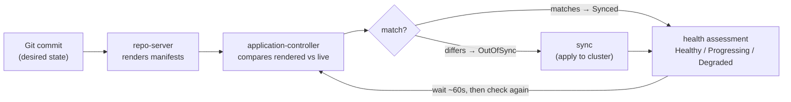
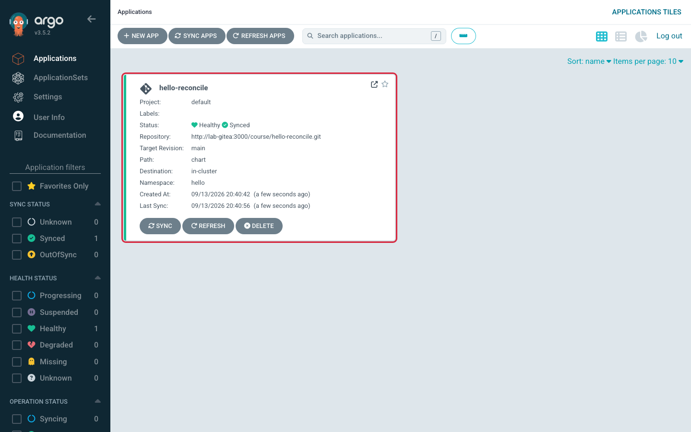
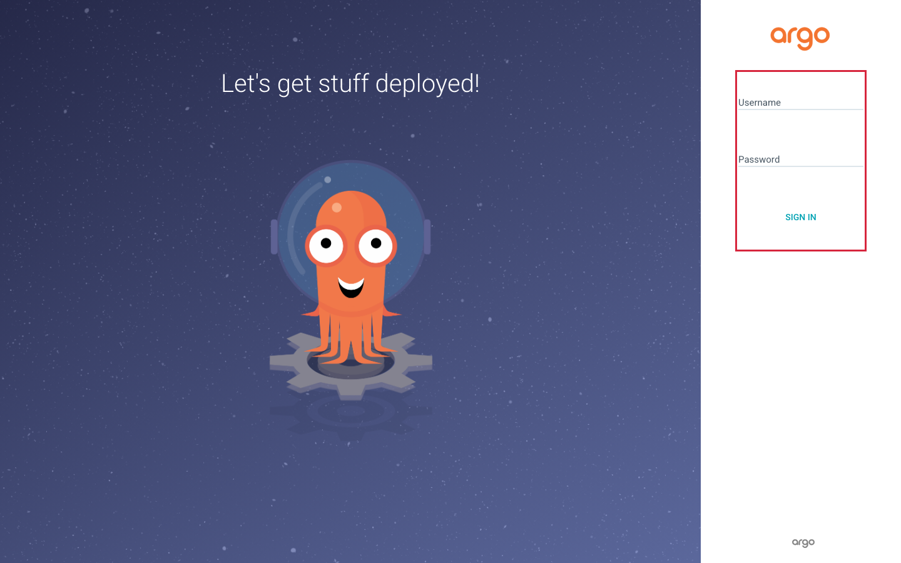
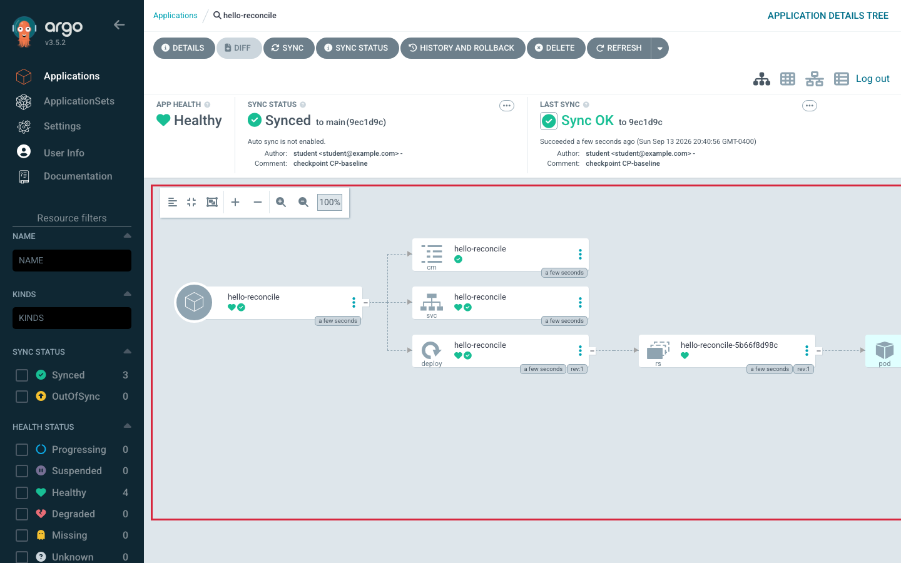
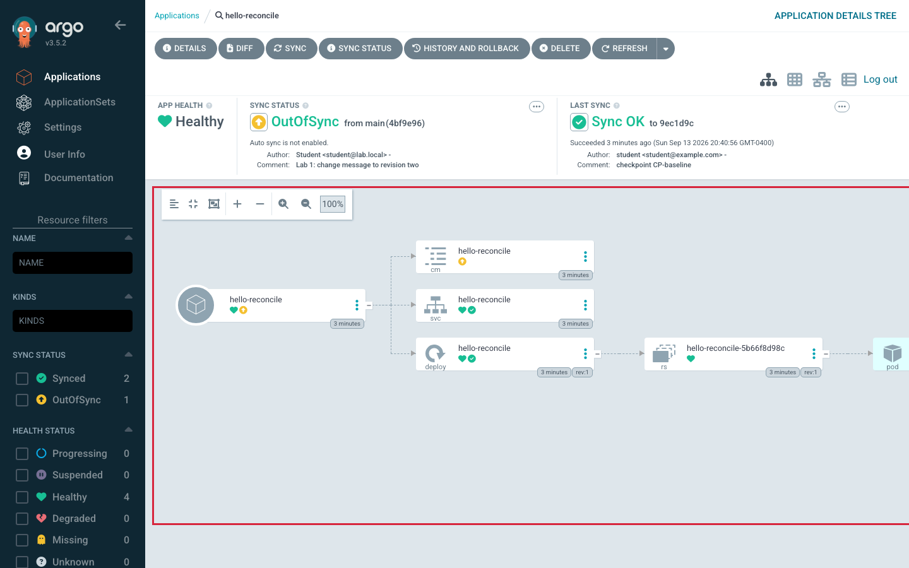
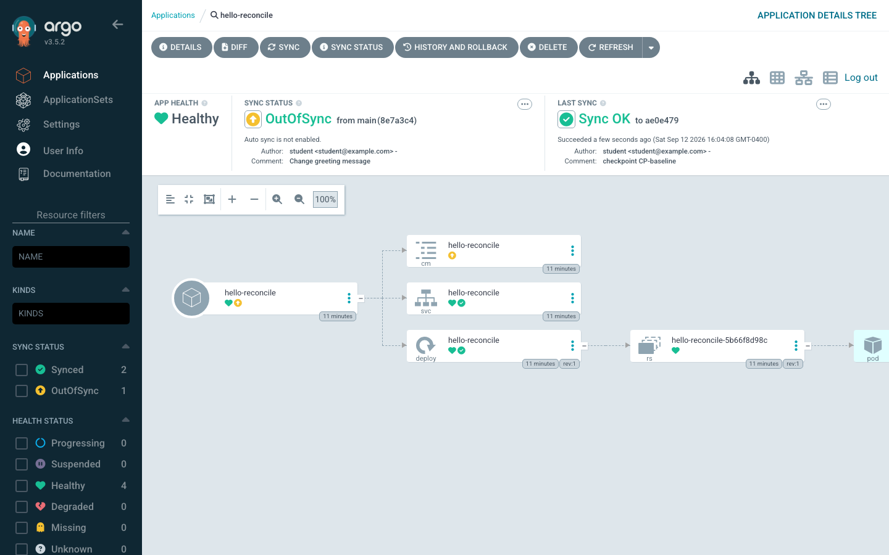
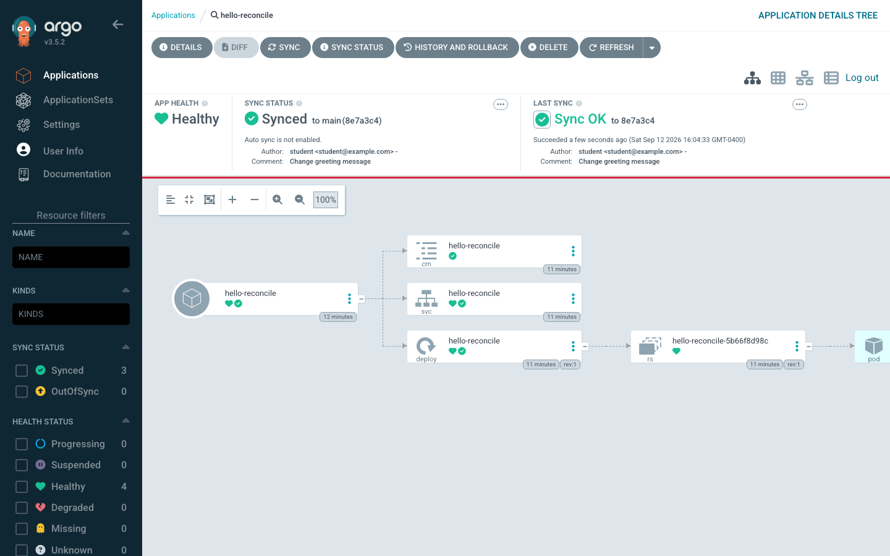
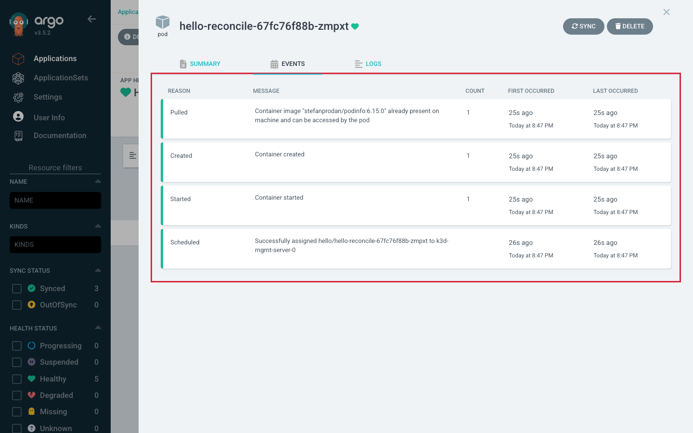
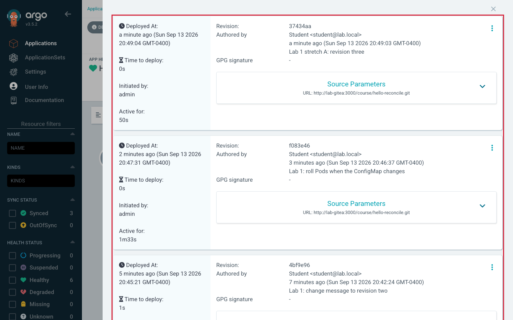

# Lab 1 — Follow an Application Through Reconciliation

> **Day 1 · Lab 1 · Hands-on lab guide · ~45 minutes**
> **Argo CD version this course targets: `v3.5.2`** (Helm chart `10.8.4`, Kubernetes `v1.35`).
> **Scaffolding level: G1 (maximally guided).** Every click, every command, and a screenshot at every meaningful step. Labs later in the course hand you more of the work; this first one holds your hand on purpose.
> **What you need open before you start:** a MATE Terminal window on the VM desktop, and Firefox inside that same desktop with the Argo CD web interface (`https://localhost:8443`) and — for one step — Gitea (`http://localhost:3000`). Because Firefox runs on the VM, `localhost` already means the VM; there is no tunnel to start.
>
> **This lab runs on your pre-provisioned course VM.** If you have not completed **Lab 0 — Prepare Your VM for Lab 1**, do that first: it builds the two clusters, Argo CD, Gitea, and reaches the starting checkpoint.

---

## 1. Why this matters

In Session 1 you met a machine that behaves like a thermostat: it reads a target from Git and keeps nudging the cluster toward it. In Session 2 you named every part of that machine and learned the two status words — **Synced** and **Healthy** — that describe what it sees.

So far, all of that has been *reading*. This lab is where you watch it happen with your own eyes.

You are going to take one real application that is already running, change a single line in its Git repository, and then follow that change all the way through the system: Git notices, Argo CD compares, you approve, the cluster converges, and the running application starts saying something new. You will watch the same event from three different windows — the Argo CD web interface, the Argo CD command line, and raw `kubectl` — and learn that they are three vocabularies for one story.

This is the single most reused skill in the entire course. Every later lab, and the final Capstone incident, is built on the ability to look at an application and answer two questions with evidence: *does it match Git?* and *is it actually working?* Today you build that reflex on an application that is deliberately simple and completely safe to break.

> **A note on where this app lives.** In this lab, Argo CD deploys the sample application to the **management cluster itself** (the same cluster Argo CD runs on). Real production platforms do **not** do this — they deploy workloads to *separate* registered clusters, and mixing the two is a well-known anti-pattern. We do it here on purpose: it lets you learn the reconciliation loop before you have learned how cluster registration works. **Lab 2 fixes this** by registering a real, separate workload cluster and deploying there instead.

---

## 2. Learning objectives

By the end of this lab you will be able to:

1. **Read an Argo CD Application manifest and name every external thing it depends on** — the Git server, the revision, the chart path, the destination, the namespace, the project, and the container image (outline bullet L1.1).
2. **Commit a small change and follow the reconciliation flow end to end** — from an unnoticed commit, through `OutOfSync`, through a manual sync, to a new `Synced`/`Healthy` state and a new message served by the app (L1.2).
3. **Compare the three states of a resource** — desired (what Git says), rendered (the manifest Argo CD produced), and live (what is actually running) — and explain why the differences between rendered and live do *not* count as drift (L1.3).
4. **Locate an application's status and events in three places** — the web interface, the `argocd` command line, and `kubectl` — and decide which one to reach for when another is unavailable (L1.4).

These map to course outcomes **O1** (reconciliation), **O2** (components and where failures live), and **O7** (diagnosing failures along the Git-to-cluster path).

---

## 3. Prerequisites and what earlier guides established

**You should have completed:**

- **Lab 0 — Prepare Your VM for Lab 1** — your VM desktop is ready, Firefox reaches the Argo CD web interface and Gitea, you have logged into the Argo CD web interface once, and your smoke test passed (Argo CD pods `Running`, `hello-reconcile` shown `Synced`/`Healthy`).
- **Guide 01 — GitOps and the Argo CD topology.** From it, recall: Git is the source of truth; Argo CD *pulls* and converges; the only thing that crosses from continuous integration (CI) to continuous delivery (CD) is a **commit**; the **management cluster** runs Argo CD and the **workload cluster** receives applications.
- **Guide 02 — Argo CD architecture and the Application model.** From it, recall the six components and their one-verb jobs (repo-server *renders*, application-controller *compares and applies*, API server *talks*, and so on), and the two independent status axes below.

**Two short refreshers this lab leans on** (this is their home file — later files only remind you):

> **Refresher — kubeconfig contexts and `--context`.** A *kubeconfig* is the file that tells `kubectl` which clusters exist, how to reach them, and who you are. Each cluster entry is called a **context**. Your VM has two: `k3d-mgmt` (the management cluster, where Argo CD runs) and `k3d-workload` (the separate workload cluster you will use from Lab 2 onward). Because there are two, **every `kubectl` command in this course names its context explicitly** with `--context k3d-mgmt`. Running a command against the wrong cluster is the most common self-inflicted mistake in a two-cluster lab, and naming the context every time removes it.

> **Refresher — Git clone, commit, push, and `git log`.** *Clone* copies a repository from the Git server to a folder on your VM. *Commit* records a snapshot of your changes locally, with a message and a unique identifier called a **commit hash** (often shown as a short 7-character **SHA**). *Push* sends your local commits back to the server. `git log` prints the history of commits, newest first. `git rev-parse HEAD` prints the full hash of your most recent commit — you will use it to prove Argo CD deployed exactly the commit you made.

> **Refresher — Helm chart anatomy (minimal).** A **Helm chart** is a folder of templated Kubernetes manifests plus a `values.yaml` file of settings those templates read. `Chart.yaml` names and versions the chart; `values.yaml` holds the default settings (here: a `message`, a `color`, and a `replicaCount`); `templates/` holds the manifests that get filled in from those values. Argo CD uses Helm only to **render** — to turn the chart plus values into plain Kubernetes YAML. It does *not* run `helm install` or create a Helm release. (Guide 04 covers Helm rendering in full; you only need the folder shape today.)

---

## 4. Mental model recap (short)

Two ideas from Session 2 carry this whole lab. They are short on purpose — the concept guide already taught them; here you only need them fresh.

**Two independent questions.** Argo CD reports two statuses, and they answer different questions:

| Status | The question it answers | What it looks at |
|---|---|---|
| **Sync status** (`Synced` / `OutOfSync`) | *Does the cluster match Git?* | Compares the rendered manifests against live state |
| **Health status** (`Healthy` / `Progressing` / `Degraded` / `Missing` / `Unknown`) | *Is the thing actually working?* | Looks only at live state |

A change committed to Git makes an app `OutOfSync` **without making it unhealthy** — the old version keeps serving users perfectly until you sync. Hold onto that; this lab proves it.

**The reconciliation loop.** The loop below runs continuously. Each stage leaves distinct evidence you can look at. Today you will drive it one stage at a time and read the evidence at each step.



> **One number to remember: ~60 seconds.** By default Argo CD checks each repository on a timer set to 3 minutes. **This classroom environment is tuned to 60 seconds** (`timeout.reconciliation: 60s`). So after you push a commit, Argo CD may show nothing at all for up to a minute before it notices. **That silence is normal, not a failure.** You can also press **Refresh** in the interface to make it check right now instead of waiting.

---

## 5. Environment check — confirm you are starting from "healthy"

Before you change anything, prove the environment is in the known-good starting state, called **checkpoint `CP-lab-01`**. This takes about a minute and saves you from debugging a problem you started with.

### 5.1 Run the verifier (it changes nothing)

In a MATE Terminal window on the VM desktop, first load the course environment so the pinned `kubectl`, `helm`, `argocd`, and the course scripts are on your `PATH` (do this in every new VM terminal):

```bash
source ~/argo-lab-env.sh
```

Then run:

```bash
reset-lab.sh CP-lab-01 --verify-only --local
```

The `--verify-only` flag prints a PASS/FAIL table **without changing anything**. `CP-lab-01` is an accepted alias for the baseline checkpoint, so the header of the output says `CP-baseline` — that is expected, not a mismatch.

**Expected output** *(representative — confirm against the live classroom environment):*

```text
▶ Verification for CP-baseline
  PASS  Application hello-reconcile Synced/Healthy
  PASS  Secret in-cluster present
  PASS  workload namespace storefront-prod present
  PASS  workload SA argocd-manager absent (not registered)

PASS CP-baseline is in the expected state.
```

**Read the table:**

1. `hello-reconcile` exists and is both `Synced` and `Healthy` — your starting application is up.
2. The `in-cluster` Secret exists — that is how Argo CD knows about the management cluster it deploys to today.
3. The workload namespaces are pre-created, but the workload cluster is **not registered yet** — that is correct for Lab 1 and is exactly what Lab 2 sets up.

> **If any row says `FAIL`:** run `reset-lab.sh CP-lab-01 --local` (without `--verify-only`) to rebuild the starting state. **Warning:** a full reset **discards any lab work you have in progress** and forces every course repository back to its baseline. On the first run of the day there is nothing to lose, so this is safe now. The command will ask you to type the checkpoint name to confirm.

### 5.2 Look at "healthy" in the web interface

Switch to your browser tab with Argo CD open at `https://localhost:8443`. You should be on the **Applications** page. (If you see the login page, log in as `admin` with the password from `cat ~/course/credentials/argocd-admin.txt` — Section 6.1 covers this.)



*Figure SS-L1-02 — Argo CD v3.5.2 Applications list at checkpoint `CP-lab-01`. This is what "ready to start" looks like.*

**What to notice:**

1. Exactly **one** application tile, named `hello-reconcile`.
2. A green **Synced** badge — the cluster matches Git.
3. A green **Healthy** badge — the running app is working.
4. The project is `default` and the destination namespace is `hello` (visible on the tile).

<!-- CAPTURE-SPEC: SS-L1-02 — Argo CD Applications list, healthy environment check. State: checkpoint CP-lab-01 (reset-lab.sh CP-lab-01), logged in as admin, route /applications. Highlight: the single hello-reconcile tile with green Synced and green Healthy badges. Fidelity: full page. -->

### 5.3 Set up your three windows

You will watch this lab from three surfaces at once. Arrange them now so the layout is familiar before anything moves:

- **Window A — Firefox**, on the Argo CD Applications page (above).
- **Window B — a VM terminal window** for the `argocd` command line (you log in to it in Section 6.2). Run `source ~/argo-lab-env.sh` in it first.
- **Window C — a second VM terminal window** watching the live cluster. Run `source ~/argo-lab-env.sh`, then start the watch now and leave it running:

```bash
kubectl --context k3d-mgmt -n hello get pods -w
```

The `-w` means *watch*: it keeps printing a new line whenever a Pod changes. **Expected** right now — one running Pod that does not change:

```text
NAME                               READY   STATUS    RESTARTS   AGE
hello-reconcile-6d4b9c7f8c-2xkz9   1/1     Running   0          14m
```

*(Your Pod's random suffix and age will differ.)* Leave this window watching for the rest of the lab.

---

## 6. Guided walkthrough

This section teaches the mechanics. Follow it exactly — the commands here are meant to be run and copied, because they build the muscle memory the exercises then test. (The **exercises** in Section 7 are where you make decisions and are *not* given the answers.)

### 6.1 Log in to the web interface

If you are already looking at the Applications list, you are logged in — skip to 6.2. If you see the login page:



*Figure SS-L1-01 — Argo CD v3.5.2 login page.*

**What to do:**

1. If Firefox warns about the certificate, accept it — Argo CD uses a **self-signed certificate** (one it made itself), which is expected and safe on this local lab address. In Firefox: **Advanced → Accept the Risk and Continue**.
2. **Username:** `admin`.
3. **Password:** the value from `cat ~/course/credentials/argocd-admin.txt` in a VM terminal window.
4. Click **Sign In**. You land on the Applications list.

<!-- CAPTURE-SPEC: SS-L1-01 — Argo CD login page. State: logged out, browser at https://localhost:8443/login after accepting the self-signed cert. Highlight: the Username and Password fields and the Sign In button. Fidelity: full page. -->

### 6.2 Log in to the command line

Switch to **Window B** and log the `argocd` command-line tool in. The web interface and the command line talk to the same Argo CD API server, so both show the same truth — you are only choosing which vocabulary to read it in.

```bash
argocd login localhost:8443 \
  --username admin \
  --password "$(cat ~/course/credentials/argocd-admin.txt)" \
  --insecure
```

`--insecure` tells the command line to accept the same self-signed certificate the browser warned about. **Expected output:**

```text
'admin:login' logged in successfully
Context 'localhost:8443' updated
```

Now ask the command line for the application's status:

```bash
argocd app get hello-reconcile
```

**Expected output** *(representative — confirm against the live classroom environment):*

```text
Name:               argocd/hello-reconcile
Project:            default
Server:             https://kubernetes.default.svc
Namespace:          hello
Repo:               http://lab-gitea:3000/course/hello-reconcile.git
Target:             main
Path:               chart
SyncWinow:          <none>
Sync Policy:        Manual
Sync Status:        Synced to main (abc1234)
Health Status:      Healthy

GROUP  KIND        NAMESPACE  NAME             STATUS  HEALTH   HOOK  MESSAGE
       ConfigMap   hello      hello-reconcile  Synced
       Service     hello      hello-reconcile  Synced  Healthy
apps   Deployment  hello      hello-reconcile  Synced  Healthy
```

Read the top block like an address label: **which repo**, **which revision** (`Target: main`, currently at short SHA `abc1234`), **which path**, **which destination** (`Server` + `Namespace`), **which project**, and **what sync policy** (`Manual` — nothing syncs unless you tell it to). The bottom block lists the three Kubernetes resources this app owns.

### 6.3 Open the resource tree

Back in **Window A**, click the `hello-reconcile` tile. You land on the application detail page, showing the **resource tree** — a live picture of everything this application owns and how those pieces relate.



*Figure SS-L1-03 — Argo CD v3.5.2 resource tree for `hello-reconcile`.*

**What to notice:**

1. The **Application** node on the left is the root.
2. It owns a **Service**, a **ConfigMap**, and a **Deployment** — the three resources the chart renders.
3. The **Deployment** owns a **ReplicaSet**, which owns a **Pod**. Argo CD draws these, but **only the Deployment is in Git** — Kubernetes creates the ReplicaSet and Pod on its own.
4. Green rings mean healthy. Hover any node to see its status.

<!-- CAPTURE-SPEC: SS-L1-03 — Argo CD resource tree during the guided walkthrough. State: CP-lab-01, route /applications/hello-reconcile, tree view. Highlight: the Application → Service/ConfigMap/Deployment → ReplicaSet → Pod chain. Fidelity: full page. -->

> **60-second micro-observation — deleting a Pod is not drift.** Try this and predict first: in **Window C**, note the Pod name, then delete it:
> ```bash
> kubectl --context k3d-mgmt -n hello delete pod -l app.kubernetes.io/name=hello-reconcile
> ```
> **Predict:** will Argo CD go `OutOfSync`? Watch **Window C** and the tree. A new Pod appears within seconds, and the app stays **`Synced`**. Why? Because the Pod is **not in Git** — Kubernetes owns it. Delete the *Deployment* and that *would* be drift, because the Deployment *is* in Git. Argo CD only watches what it owns.

### 6.4 Read the Application manifest

Argo CD stores the Application itself as a Kubernetes object. To read it in the interface, open the manifest view: on the application detail page, click the application name node, then the **Manifest** tab (or navigate to the `?tab=manifest` view). You can also read the same object from the command line:

```bash
kubectl --context k3d-mgmt -n argocd get application hello-reconcile -o yaml
```

Note that the kubectl command returns the full live Application object, including information Kubernetes and Argo CD have added.  This is why the manifest in ArgoCD UI is much shorter - its just a manifest as opposed to the REAL, LIVE object.


*Figure SS-L1-04 — Argo CD v3.5.2 Application manifest, showing the addressing fields.*

**What to notice** — the important part of the manifest is a small set of **addressing fields**. There is **no application YAML in here at all**; every field points at something *outside* this object:

1. `spec.source.repoURL` → the Git server and repo.
2. `spec.source.targetRevision` → the branch or tag (`main`).
3. `spec.source.path` → the folder inside the repo (`chart`).
4. `spec.destination.server` and `spec.destination.namespace` → where to deploy.
5. `spec.project` → which AppProject governs it (`default`).
6. `spec.syncPolicy` → manual, with `CreateNamespace=true`.

Every one of those arrows points at a thing that can fail on its own. That is the idea Exercise 1 turns into a checklist.

<!-- CAPTURE-SPEC: SS-L1-04 — Application details, manifest tab. State: CP-lab-01, route /applications/hello-reconcile?tab=manifest. Highlight: the source, destination, project, and syncPolicy blocks. Fidelity: panel. -->

You now have all the mechanics: log in (interface and command line), read status three ways, open the tree, and read the manifest. The exercises put you in the driver's seat.

---

## 7. Exercises

Do these in order — each is a little harder than the last, and E2 builds on E1. Write your answers in a scratch file or notebook; several exercises ask you to record a prediction *before* you act, and comparing your prediction to what happened is where the learning is.

> **Reminder:** the guided walkthrough above showed you the tools. These exercises do **not** show you the answers. Every one has a checkable success criterion you can confirm yourself.

### E1 — List every external dependency

**Difficulty:** Easy · **Time:** ~5 minutes

**Goal (plain language):** Read the `hello-reconcile` Application manifest and produce a table of *every* external thing it depends on — every place where "this could break the app from the outside." This is the exact skill the Capstone grades on Day 2, practiced here where it is safe.

**Starter state:** The manifest is already on screen from Section 6.4 (or run the `kubectl ... get application hello-reconcile -o yaml` command again). You do not need to change anything.

**Input:** The Application manifest fields, plus the chart it points at (`chart/values.yaml`, which names the container image).

**Predict first — before you read the shape below.** Without counting yet, write down a single number: how many external things do you think this one small Application depends on? Most people guess two or three. Hold your number, then build the table and count the rows — being surprised is the point.

**Shape of a correct answer:** a table with one row per external dependency. A complete answer has **around eight rows** and includes: the Git server/repo, the revision, the chart path, the destination server, the destination namespace, the governing project, the repository credentials (note: **none** — this repo is public-read), and the container image registry/repository. Each row should name *what fails if that dependency is unavailable*. Example row shape (fill the rest yourself):

| Dependency | Where it is named | What breaks if it fails |
|---|---|---|
| Git server / repository | `spec.source.repoURL` | Argo CD cannot fetch the desired state; render fails |
| … | … | … |

**Hints (use only if stuck):**
- *Hint 1:* Walk the manifest top to bottom; every field under `spec.source` and `spec.destination` is at least one dependency.
- *Hint 2:* The manifest does not name the container image — that lives in the chart. Open `chart/values.yaml` (or the `image:` block) to find it.
- *Hint 3:* "Credentials" is a dependency even when the answer is "none." Note *why* none are needed here (public-read repo) and predict how Lab 2's private repo will differ.

**Success criterion:** Your table names a dependency for each addressing field in the manifest **plus** the container image, and each row states a concrete failure. If you can point at a manifest field (or the values file) for every row, you are done.

> **Every dependency you just circled is a future incident.** This short list is not busywork — it is a complete map of everything that can break `hello-reconcile` from the outside, and it is *the exact list the Capstone breaks*, one layer at a time (insight **I-L1-01**). A disconnected cluster, a bad revision, a missing chart path, an expired credential: each is one row in your table, arriving unannounced on Day 2.

---

### E2 — Predict, then commit a change and follow reconciliation

**Difficulty:** Core · **Time:** ~10 minutes

**Goal (plain language):** Change one line in the chart's values, push it, and follow that change through the whole loop — noticing, comparing, approving, converging — until the running app serves your new message. You will **predict the statuses before you act**, because predicting the *transient* states is what makes the two-axis model real.

**Starter state:** Clone the repo onto your VM (read access needs no credentials; the push at the end uses your Gitea student login):

```bash
cd ~
git clone http://lab-gitea:3000/course/hello-reconcile.git
cd hello-reconcile
git config user.email "student@lab.local"
git config user.name "Student"
```

**Step A — Predict first.** Before touching anything, fill in this **Predict-Before-You-Sync** table. Write down what you expect at each moment. (You will compare it to reality in Step E.)

| Moment | Sync status? | Health status? |
|---|---|---|
| Right after you `git push` (before Argo CD notices) | ? | ? |
| After Refresh / after ~60s (Argo CD has noticed, before you Sync) | ? | ? |
| **During** the sync, while the new Pod is rolling out | ? | ? |
| **After** the sync completes | ? | ? |

The row most people get wrong is the third one — health *during* the rollout. Commit to an answer before you look.

**Step B — Make the change.** Edit `chart/values.yaml` and change the `message` line to something you will recognize, for example:

```yaml
message: "Hello from Git, revision two"
```

**Step C — Commit and push.**

```bash
git add chart/values.yaml
git commit -m "Lab 1: change message to revision two"
git push
```

When Git asks for credentials, use username `student` and the password from `~/course/credentials/gitea-student.txt`. Then capture the exact commit you made:

```bash
git rev-parse HEAD
```

Copy that full SHA — you will match it against what Argo CD deploys.

**Step D — Watch it move.** Go to **Window A**. For up to ~60 seconds Argo CD may show nothing — that is the reconciliation timer, not a failure. To skip the wait, click **Refresh** on the application. The app flips to **`OutOfSync`**.



*Figure SS-L1-05 — After the push and a Refresh, the app and its ConfigMap show `OutOfSync` (v3.5.2).*

**What to notice:** the app is `OutOfSync` **and still `Healthy`.** Pause here and answer out loud: *right now, who is affected by this `OutOfSync`?* (Answer: nobody — the old message is still being served correctly.)

<!-- CAPTURE-SPEC: SS-L1-05 — Tree after push and Refresh. State: after E2 push + Refresh, route /applications/hello-reconcile. Highlight: OutOfSync badge on the Application and on the ConfigMap node. Fidelity: full page. -->

Now read the diff before you approve it. Click **App Diff** (or run `argocd app diff hello-reconcile` in Window B).

Note that it doesn’t autosync because this lab deliberately configures hello-reconcile with a Manual sync policy.
Argo CD separates detecting changes from applying changes.


*Figure SS-L1-06 — The diff shows exactly one changed line: the ConfigMap's message (v3.5.2).*

**What to notice:** exactly one field changed — the `PODINFO_UI_MESSAGE` value in the ConfigMap. "Read the diff before you sign it" is the cheapest safety habit in Argo CD; it is the same reflex as reading a pull request before approving.

<!-- CAPTURE-SPEC: SS-L1-06 — Diff view. State: after E2 Refresh, before Sync, route /applications/hello-reconcile diff panel. Highlight: the single changed message line. Fidelity: panel. -->

Click **Sync**. In the sync panel, leave **Prune** unchecked and review the resource list.



*Figure SS-L1-07 — The sync panel before you confirm (v3.5.2).*

<!-- CAPTURE-SPEC: SS-L1-07 — Sync panel open, before sync. State: after E2 diff, route /applications/hello-reconcile sync panel. Highlight: Prune unchecked, the dry-run option, and the resource list. Fidelity: panel. -->

Confirm the sync. Watch **Window C** (`kubectl ... get pods -w`): a new Pod appears and rolls out while the old one terminates. During that moment the health passes through **`Progressing`**, then settles on **`Healthy`**.



*Figure SS-L1-08 — After the sync: `Synced`/`Healthy`, last sync `Succeeded`, at the new revision (v3.5.2).*

<!-- CAPTURE-SPEC: SS-L1-08 — After sync. State: after E2 sync completes, route /applications/hello-reconcile. Highlight: last sync Succeeded and the new revision SHA. Fidelity: full page. -->

**Step E — Prove it and compare to your prediction.** Confirm two things:

1. The revision Argo CD deployed matches your commit. In **Window B**:
   ```bash
   argocd app get hello-reconcile | grep -i "sync status"
   ```
   The short SHA shown should match the first 7 characters of your `git rev-parse HEAD`.
2. The running app serves your new message. Port-forward and curl it:
   ```bash
   kubectl --context k3d-mgmt -n hello port-forward svc/hello-reconcile 9898:9898 >/tmp/pf.log 2>&1 &
   curl -s http://localhost:9898/ | grep -o '"message":"[^"]*"'
   ```
   You should see your `revision two` message. (Stop the port-forward afterward with `kill %1`.)

Now compare Steps A's predictions to what happened. Which of the four rows surprised you?

**Shape of a correct result:** after your sync, the app is `Synced`/`Healthy`; the deployed revision equals your `git rev-parse HEAD`; and `curl` returns the exact message you committed. Your prediction table should now be annotated with what actually happened — especially the "during rollout = `Progressing`" moment.

**Hints:**
- *Hint 1:* If nothing changes for a minute, that is the ~60s timer. Click **Refresh** to force an immediate check.
- *Hint 2:* If `git push` is rejected, confirm you are pushing as `student` with the password from `~/course/credentials/gitea-student.txt`.
- *Hint 3:* If `curl` shows the *old* message, confirm the sync actually completed (`Succeeded`, not still `Progressing`) and that the port-forward is pointing at namespace `hello`.

**Success criterion:** `argocd app get hello-reconcile` shows `Synced` at your commit's SHA, and `curl` returns your new message. Both together prove the change traveled Git → render → compare → sync → healthy workload.

---

### E3 — Compare desired, rendered, and live

**Difficulty:** Intermediate · **Time:** ~7 minutes

**Goal (plain language):** Look at the same ConfigMap in three forms — what Git says (**desired**), what Argo CD produced from the chart (**rendered**), and what is actually running in the cluster (**live**) — and explain why the live version has extra fields that do *not* make the app `OutOfSync`.

**Starter state:** Your app is `Synced`/`Healthy` from E2. No changes needed.

**Input — three views of the ConfigMap:**

```bash
# Rendered from Git (what Argo CD would apply, straight from the repo at the current revision):
argocd app manifests hello-reconcile --source git | sed -n '/kind: ConfigMap/,/^---/p'

# Live (what is actually in the cluster right now):
kubectl --context k3d-mgmt -n hello get configmap hello-reconcile -o yaml
```

**Shape of a correct answer:** a short written comparison identifying **at least three fields that appear only in the live object** and are absent from the rendered/Git version, plus one sentence explaining why their presence does not count as drift. A complete answer also locates the **resource-tracking annotation** `argocd.argoproj.io/tracking-id` on the live object and says what it is for (it is how Argo CD marks a resource as one it owns). You are describing *categories* of fields, not memorizing them.

**Hints:**
- *Hint 1:* Kubernetes stamps every object with bookkeeping the moment it is created. Look under `metadata` on the live object for fields that could not possibly have been written by a human in Git.
- *Hint 2:* Argo CD's comparison deliberately ignores server-populated fields — otherwise every object would look "changed" forever. That is *why* these live-only fields do not cause `OutOfSync`.
- *Hint 3:* Search the live object's annotations for `tracking-id`.

**Success criterion:** You can name three live-only fields, each of which is populated by Kubernetes (not by Git), and explain in one sentence why Argo CD's diff ignores them. You have found the `argocd.argoproj.io/tracking-id` annotation on the live object.

---

### E4 — Locate status in three places

**Difficulty:** Intermediate · **Time:** ~4–6 minutes

**Goal (plain language):** Fill a table that shows *where* each piece of status lives across the three surfaces — the web interface, the `argocd` command line, and `kubectl` — then answer a practical incident question: *if the web interface were down, which surface would you use, and could you still get everything you need?*

**Starter state:** App is `Synced`/`Healthy`. Pod events are richest right after E2's rollout, so do this soon after.

**Input:** the three surfaces you have already used. **Do not** fill in the values from memory — go find each one live.

**Shape of a correct answer:** this table, completed with the *place or command* that shows each fact on each surface (not only the value). Leave a cell blank only if a surface genuinely cannot show that fact — and note which cell that is.

| Fact | Web interface (where?) | `argocd` CLI (which command?) | `kubectl` (which command?) |
|---|---|---|---|
| Sync status | | | |
| Health status | | | |
| Last-synced revision | | | |
| Pod events | | | |

Then answer in one or two sentences: **"If the UI were down, which surface would I use, and what (if anything) would be harder to see?"**

**Hints:**
- *Hint 1:* You already ran an `argocd` command that prints sync status, health, and revision in one shot.
- *Hint 2:* For Pod events on `kubectl`, `describe` shows an events section; in the interface, open the Pod node and its events tab.
- *Hint 3:* `kubectl` can read the Application object's `.status` directly with `-o jsonpath` — think about whether "last-synced revision" lives on the Application object or only in the interface.



*Figure SS-L1-09 — The Pod node's events tab in the interface (v3.5.2).*

<!-- CAPTURE-SPEC: SS-L1-09 — Pod node, events tab. State: shortly after E2 rollout, route /applications/hello-reconcile, Pod node selected, events tab. Highlight: event reasons (e.g., Scheduled, Pulled, Started). Fidelity: panel. -->

**Success criterion:** Every row names a concrete location or command for each surface (or is explicitly marked as unavailable there), and the values agree across each row. You have a one-sentence answer to the "UI is down" question backed by the command you would actually run.

---

## 8. Troubleshooting

| Symptom | Likely cause | Fix |
|---|---|---|
| **Nothing happens for up to a minute** after `git push` | The reconciliation timer (tuned to `60s` here) has not fired yet. This is **not** a failure. | Wait, or click **Refresh** on the application to force an immediate check. |
| Commands run against the wrong cluster; resources "missing" | `kubectl` used a different (or default) context. | Always include `--context k3d-mgmt`. Confirm with `kubectl config current-context`. |
| Firefox: "Unable to connect" at `https://localhost:8443` | Firefox is not running inside the VM desktop, or the Argo CD Pods are not ready. | Confirm Firefox is running inside the VM desktop and the Argo CD pods are Running (`kubectl --context k3d-mgmt -n argocd get pods`). |
| Firefox certificate warning | Argo CD's self-signed certificate. Expected. | Accept it (Advanced → Accept the Risk and Continue). It is safe on this local lab address. |
| `git push` rejected / asks repeatedly for a password | Push needs your Gitea write credentials (the repo is public-*read* only). | Use username `student` and the password from `~/course/credentials/gitea-student.txt`. |
| App shows `OutOfSync` but you expected it to deploy on its own | The sync policy is **Manual** on purpose in this lab. | Click **Sync** (or `argocd app sync hello-reconcile`). Automated sync arrives in Lab 3. |
| `curl` returns the **old** message after syncing | The rollout had not finished, or the port-forward is on the wrong namespace. | Confirm `Synced`/`Healthy`, then re-run the port-forward with `-n hello`. |
| App shows `Unknown` health | Argo CD cannot currently read the resource's live state. | Refresh; confirm the management cluster is reachable (`kubectl --context k3d-mgmt get nodes`). |

---

## 9. Checkpoint / validation

You have finished Lab 1 when **all** of the following are true. Check each yourself:

1. **The deployed revision equals your commit.** Run:
   ```bash
   argocd app get hello-reconcile | grep -i "sync status"
   git -C ~/hello-reconcile rev-parse HEAD
   ```
   The short SHA in the first line matches the first 7 characters of the second. *(This is the outline's own Day 1 evidence: live revision equals `git rev-parse HEAD`.)*
2. **The running app serves your message** — a port-forward + `curl` returns the `message` you committed in E2.
3. **Your E1 dependency table** names every addressing field plus the container image.
4. **Your E2 prediction table** is annotated with what actually happened, including health = `Progressing` during the rollout.
5. **Your E4 three-way table** is complete: every fact has a concrete location or command on each surface, and you can say which surface you would use if the interface were down.

If all five hold, you have traced one change through the entire reconciliation loop and located its status three ways — the foundation everything else builds on.

---

## 10. Key takeaways

- **An Application is an address, not an artifact.** It contains no workload YAML — every field points at something external that can fail on its own. Circling those dependencies (E1) is the same list the Capstone breaks.
- **`OutOfSync` is a sentence about Git, not about your users.** A fresh commit makes an app `OutOfSync` while it stays perfectly `Healthy`. `OutOfSync` that will not converge is the real problem — a single `OutOfSync` is not an outage.
- **Read the diff before you sign it.** "Diff, then sync" is the cheapest safety habit in Argo CD, and it is the same reflex as reviewing a pull request.
- **Deleting a Pod is not drift; deleting the Deployment is** — because only one of them is in Git. Argo CD watches what it owns and nothing else.
- **The interface, the command line, and `kubectl` tell one story in three vocabularies.** Fluency in all three is how you will later answer the only question that matters in an incident: *is this Argo CD, or is this Kubernetes?*
- **You already used the first four steps of a method you have not been taught yet.** You checked the Git source and revision, confirmed the repo rendered, compared rendered against live, and read the sync result and events. Those are **steps 1–4 of the six-step troubleshooting method** you will meet formally in Session 7 and use in the Capstone. Steps 5 and 6 (inspect the responsible component; correct declaratively and verify) are the two you will meet on Day 2.

---

## 11. Optional stretch challenge

> **Clearly optional — do this only if you have time. It is not required to complete the lab.**

**Predict the health for `replicaCount: 0`.** The chart has a `replicaCount` value, currently `1`. Before changing anything, **write down your prediction:** if you set `replicaCount: 0`, commit, push, and sync, what will the **sync status** be, and what will the **health status** be?

- Think it through first: a Deployment scaled to zero has no Pods. Is "zero Pods, exactly as requested" *healthy*, *degraded*, or something else? Is the app `Synced`?
- Then test it: change `replicaCount` to `0` in `chart/values.yaml`, commit, push, Refresh, and Sync. Observe both statuses and compare to your prediction.
- **Reset when done:** set `replicaCount` back to `1`, commit, push, and sync so you leave the app running.

*(This deliberately exercises the `Synced` + "is-this-healthy?" edge you met in Session 2. There is no single "gotcha" answer expected — the value is in predicting, then checking, and being able to explain the result.)*

For reference, here is the history/rollback panel you can use to see both revisions you created:



*Figure SS-L1-10 — Deployment history with the revisions from this lab (v3.5.2).*

<!-- CAPTURE-SPEC: SS-L1-10 — History and rollback panel. State: after E2 (and the stretch), route /applications/hello-reconcile history panel. Highlight: two (or more) revisions listed with their SHAs. Fidelity: panel. -->

---

## 12. Transition — what's next

You have watched one change move from Git to a running workload, and you did it on the **management cluster** as a deliberate teaching shortcut. That shortcut is exactly what production platforms avoid.

Next, **Guide 03 — Production-Oriented Configuration** explains how a real platform is shaped: installation choices, declarative onboarding, and — most importantly — how a *separate* workload cluster is registered with least-privilege credentials. Then **Lab 2 — Configure the Platform and Register a Target** has you build that topology yourself: connect a private repository (contrast that with today's public-read one, which needed no credentials), register a real workload cluster, and create an AppProject and Application declaratively.

**Before you move on:** no cleanup is required — the extra commits you made in `hello-reconcile` are harmless. When Lab 2 begins, the instructor (or you) will run `reset-lab.sh CP-lab-02 --local` to hand you Lab 2's exact starting state.
```
