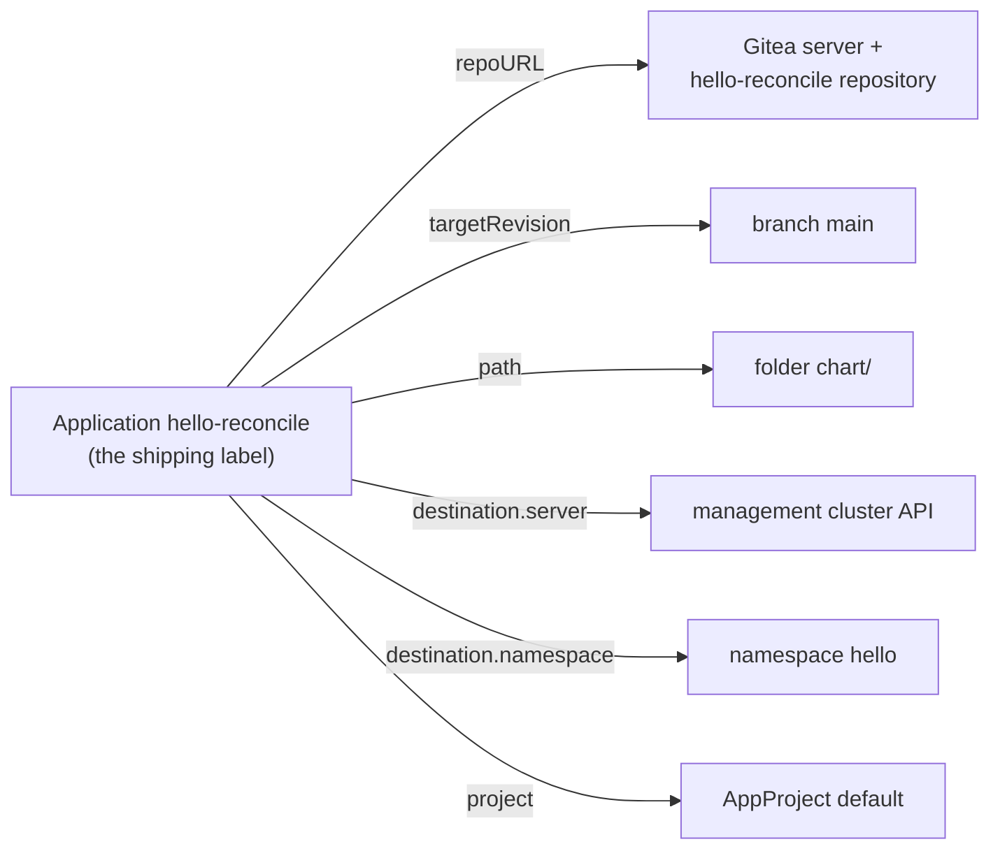

# Lab 1 · Module 1 — Setup and Dependencies

> **Day 1 · Lab 1 · Module 1 of 4 · ~10 minutes**
> **Goal:** confirm the healthy starting state, learn to read status on three surfaces, and map every external dependency of the sample app (**Exercise E1**).

---

> **🗺️ Where this module fits.** Nothing changes in this module. You check that the kitchen is clean and working, set up three ways of watching it, and read the one object that tells Argo CD what to cook and where. Think of it as walking through the restaurant before the dinner rush.

## 1. Environment check — start from "healthy"

> **🧭 What this step is for**
> - **In plain words:** a checkpoint is a known, saved starting point. This command checks that your environment matches it, without changing anything.
> - **Think of it like:** a pilot's pre-flight checklist. If something breaks later, you know it broke during the lab, not before it.

Before changing anything, prove the environment is in the known-good state (**checkpoint `CP-lab-01`**). This saves you from debugging a problem you started with.

**▶ Do this now — load the course environment, then verify (it changes nothing).**

```bash
source ~/argo-lab-env.sh
reset-lab.sh CP-lab-01 --verify-only --local
```

`--verify-only` prints a PASS/FAIL table without changing anything. `CP-lab-01` is an alias for the baseline, so the header says `CP-baseline` — expected.

**Expected output:**

```text
==> Verification for CP-baseline
  PASS  Application hello-reconcile Synced/Healthy
  PASS  Deployment hello-reconcile at rollout revision 1, no Pod-template annotations
  PASS  Application team-a-guestbook absent
  PASS  AppProject team-a absent
  PASS  Secret in-cluster present
  PASS  Repository and cluster Secrets are exactly: in-cluster
  PASS  workload namespace storefront-prod present
  PASS  workload SA argocd-manager absent (not registered)

PASS CP-baseline is in the expected state.
```

Three rows matter most for this lab:

- **`rollout revision 1`** — the sample app has never been changed. A *rollout* is Kubernetes replacing an app's Pods with new ones, and each rollout gets a revision number. Module 3 uses that number as evidence.
- **`Secret in-cluster present` / `Repository and cluster Secrets are exactly: in-cluster`** — Argo CD knows about only one cluster (the management cluster it runs on) and has no stored repository credentials.
- **`workload SA argocd-manager absent`** — the workload cluster is **not registered yet** (an SA, or ServiceAccount, is the identity Argo CD will use there). That is correct for Lab 1; Lab 2 sets it up.

> **If any row says `FAIL`:** run `reset-lab.sh CP-lab-01 --local` (without `--verify-only`) to rebuild the starting state. **Warning:** a full reset discards in-progress lab work and forces every course repo back to baseline. On the first run of the day there is nothing to lose.

---

## 2. Set up your three windows

> **🧭 What this step is for**
> - **In plain words:** the web interface, the `argocd` command, and `kubectl` all show the same events. Opening all three lets you see one change from three angles.
> - **Think of it like:** three camera angles on the same football match. The goal happens once; each camera shows a different part of it. The web interface is the wide shot, `argocd` gives you the scoreboard, and `kubectl` is the close-up on the players (the Pods).

You will watch this lab from three surfaces at once. Arrange them now:

- **Window A — the browser**, on the Argo CD Applications page (`https://localhost:8443`).
- **Window B — a terminal** for the `argocd` command line (`source ~/argo-lab-env.sh` first).
- **Window C — a second terminal** watching the live cluster. Start the watch and leave it running:

```bash
source ~/argo-lab-env.sh
kubectl --context k3d-mgmt -n hello get pods -w
```

The `-w` means *watch* — it prints a new line whenever a Pod changes. Right now, one running Pod that does not change. Leave this window alone; in Module 3 it becomes your best evidence. (A **Pod** is one running copy of the app. In the kitchen picture, it is the cook on shift.)


*Figure SS-L1-02 — Argo CD v3.5.2 Applications list at `CP-lab-01`: one tile, green **Synced**, green **Healthy**, project `default`, namespace `hello`.*

<!-- CAPTURE-SPEC: SS-L1-02 — Argo CD Applications list, healthy environment check. State: checkpoint CP-lab-01, logged in as admin, route /applications. Highlight: the single hello-reconcile tile with green Synced and green Healthy badges. Fidelity: full page. -->

---

## 3. Read status three ways

The web interface and the command line talk to the same Argo CD API server — you are only choosing which vocabulary to read the truth in.

**▶ Do this now — log the CLI in (Window B).**

```bash
argocd login localhost:8443 --username admin \
  --password "$(cat ~/course/credentials/argocd-admin.txt)" --insecure
argocd app get hello-reconcile
```

`--insecure` accepts the same self-signed certificate the browser warned about. **Expected output** *(your commit SHA in brackets will differ)*:

```text
'admin:login' logged in successfully
Context 'localhost:8443' updated
Name:               argocd/hello-reconcile
Project:            default
Server:             https://kubernetes.default.svc
Namespace:          hello
URL:                https://localhost:8443/applications/hello-reconcile
Source:
- Repo:             http://lab-gitea:3000/course/hello-reconcile.git
  Target:           main
  Path:             chart
SyncWindow:         Sync Allowed
Sync Policy:        Manual
Sync Status:        Synced to main (9ec1d9c)
Health Status:      Healthy

GROUP  KIND        NAMESPACE  NAME             STATUS  HEALTH   HOOK  MESSAGE
       ConfigMap   hello      hello-reconcile  Synced                 configmap/hello-reconcile created
       Service     hello      hello-reconcile  Synced  Healthy        service/hello-reconcile created
apps   Deployment  hello      hello-reconcile  Synced  Healthy        deployment.apps/hello-reconcile created
```

Read the top block like an address label: **which repo** (`Repo`), **which revision** (`Target`, and the commit in `Sync Status`), **which path** (`Path`), **which destination** (`Server` and `Namespace`), **which project** (`Project`), and **what sync policy** (`Manual` — nothing syncs unless you tell it to). The bottom block lists the three resources this app owns. Its `MESSAGE` column reports what the *last sync* did to each resource — `created` here, because the environment setup created them.

**▶ Do this now — open the resource tree (Window A).** Click the `hello-reconcile` tile.


*Figure SS-L1-03 — The resource tree: Application → Service, ConfigMap, Deployment → ReplicaSet → Pod.*

**🔍 Notice:** the Application owns a Service, a ConfigMap, and a Deployment (the three the chart renders). The Deployment owns a ReplicaSet, which owns a Pod — but **only the Deployment is in Git**; Kubernetes creates the ReplicaSet and Pod on its own. Green rings mean healthy.

<!-- CAPTURE-SPEC: SS-L1-03 — Argo CD resource tree during walkthrough. State: CP-lab-01, route /applications/hello-reconcile, tree view. Highlight: the Application → Service/ConfigMap/Deployment → ReplicaSet → Pod chain. Fidelity: full page. -->

---

## 4. Read the Application manifest

> **🧭 What this step is for**
> - **In plain words:** an Argo CD **Application** is a small Kubernetes object that says *where* the app's files are and *where* to deploy them. It does not contain the app itself.
> - **Think of it like:** a shipping label, not the parcel. The label says which warehouse to collect from and which address to deliver to. If the warehouse is closed or the address is wrong, the delivery fails, even though the label itself looks fine.

**▶ Do this now — read the live Application object (Window B).**

```bash
kubectl --context k3d-mgmt -n argocd get application hello-reconcile -o yaml
```

**🔍 Notice** the important part is a small set of **addressing fields** — there is **no app YAML in here at all**; every field points at something *outside* this object:

1. `spec.source.repoURL` → the Git server and repo.
2. `spec.source.targetRevision` → the branch or tag (`main`).
3. `spec.source.path` → the folder inside the repo (`chart`).
4. `spec.destination.server` / `spec.destination.namespace` → where to deploy.
5. `spec.project` → which AppProject governs it (`default`).
6. `spec.syncPolicy` → manual, with `CreateNamespace=true`.

*(The `kubectl` output is longer than the UI's Manifest tab because it returns the full **live** object, including status and metadata Kubernetes and Argo CD added. The UI shows the shorter declared manifest.)*



Every one of those arrows points at a thing that can fail on its own. Exercise E1 turns that into a checklist — and adds the things the label does **not** mention.

---

## 5. Exercise E1 — List every external dependency

**Difficulty:** Easy · **Time:** ~4 minutes

> **🧭 What this exercise is for**
> - **In plain words:** you list everything outside the Application that must be working for the app to deploy.
> - **Think of it like:** a restaurant listing its suppliers. The menu can be perfect, but if the vegetable supplier, the gas company, or the landlord lets you down, dinner does not happen. Each supplier is one row.

**Goal:** produce a table of *every* external thing `hello-reconcile` depends on — every place where "this could break the app from the outside." This is the exact skill the Capstone grades on Day 2.

**Predict first:** without counting, write one number — how many external things do you think this one small Application depends on? Most people guess two or three. Hold your number, then build the table and count.

**Shape of a correct answer:** a table with one row per external dependency — around **eight rows** — including: the Git server/repo, the revision, the chart path, the destination server, the destination namespace, the governing project, the repository credentials (here: **none** — public-read repo), and the container image registry/repository. Each row names *what fails if that dependency is unavailable*:

| Dependency | Where it is named | What breaks if it fails |
|---|---|---|
| Git server / repository | `spec.source.repoURL` | Argo CD cannot fetch desired state; render fails |
| … | … | … |

**Hints (only if stuck):**
- *Hint 1:* Walk the manifest top to bottom; every field under `spec.source` and `spec.destination` is at least one dependency.
- *Hint 2:* The manifest does not name the container image — that lives in the chart. Open `chart/values.yaml` (the `image:` block) to find it.
- *Hint 3:* "Credentials" is a dependency even when the answer is "none." Note *why* none are needed here (public-read repo) and predict how Lab 2's private repo will differ.

**Success criterion:** your table names a dependency for each addressing field **plus** the container image, and each row states a concrete failure.

> **Every dependency you just circled is a future incident.** This list is the complete map of everything that can break `hello-reconcile` from the outside — and it is *the exact list the Capstone breaks*, one layer at a time. A disconnected cluster, a bad revision, a missing chart path, an expired credential: each is one row in your table, arriving unannounced on Day 2.

**→ Next:** [02 — Commit a change and sync it](02-commit-and-sync.md)
