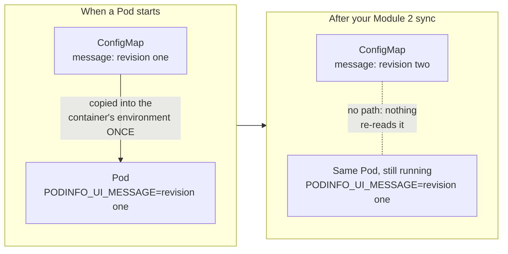
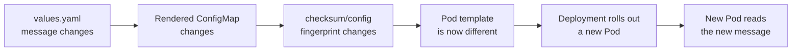
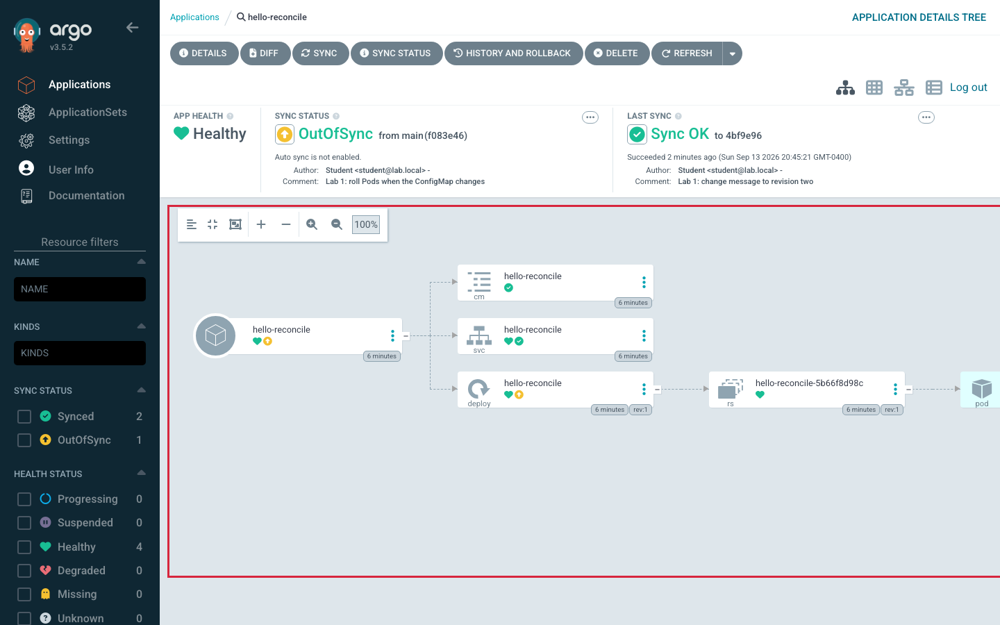
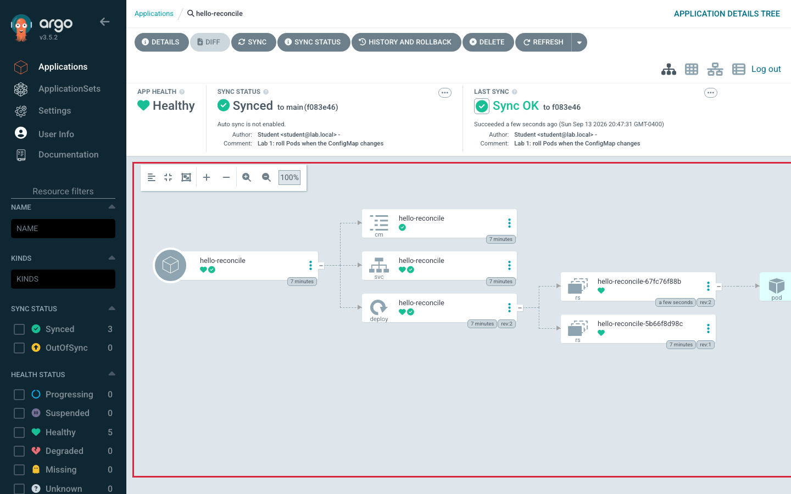

# Lab 1 · Module 3 — Why the App Didn't Change (and Fixing It in Git)

> **Day 1 · Lab 1 · Module 3 of 4 · ~12 minutes**
> **Goal:** gather evidence, explain why a fully-synced change did not reach the running app, then fix the real cause **in Git** and watch a rolling update (**Exercise E2, Parts 2–3**).

Git, the diff, the ConfigMap, and Argo CD all say "revision two" — yet in Module 2 the running app still served "revision one." Do not guess why. Collect evidence.

> **🗺️ Where this module fits.** A detective module. You collect one clue from each layer, explain the mystery, then fix it the GitOps way: with a commit, not a manual restart. By the end you will watch Kubernetes swap the running Pod without ever leaving the app with zero copies.

---

## 1. Step E — Gather evidence before you explain

**▶ Do this now — one piece of evidence per layer (Window B).** Write down what each prints.

```bash
# 1. Which commit Argo CD deployed:
argocd app get hello-reconcile | grep -i "sync status"

# 2. What the ConfigMap in the cluster holds now:
kubectl --context k3d-mgmt -n hello get configmap hello-reconcile -o jsonpath='{.data.PODINFO_UI_MESSAGE}{"\n"}'

# 3. What the running container has in its environment (kubectl exec runs a command inside the container; env prints its variables):
kubectl --context k3d-mgmt -n hello exec deploy/hello-reconcile -- env | grep PODINFO_UI_MESSAGE

# 4. Whether Kubernetes rolled out a new version of the Deployment:
kubectl --context k3d-mgmt -n hello rollout history deploy/hello-reconcile
```

**Expected output** *(your SHA will differ)*:

```text
Sync Status:        Synced to main (17cb57e)
Hello from Git, revision two
PODINFO_UI_MESSAGE=Hello from Git, revision one
deployment.apps/hello-reconcile
REVISION  CHANGE-CAUSE
1         <none>
```

**🔍 The contradiction, laid bare:** the *ConfigMap object* holds "revision two" (evidence 2), but the *running container's environment* still holds "revision one" (evidence 3) — and the Deployment has only **one** rollout revision (evidence 4), meaning **no new Pod was ever started.**

**Explain it** in one or two sentences before moving on. Your explanation must account for all four pieces of evidence — especially the last.

**Hints (only if stuck):**
- *Hint 1:* Is the Pod in Window C the *same* Pod (same name, same age) as before you synced?
- *Hint 2:* Open `chart/templates/deployment.yaml` and find `envFrom:`. That is how the container gets `PODINFO_UI_MESSAGE`: Kubernetes copies the ConfigMap's values into the container's environment **when the container starts**. Does a running program re-read its environment continuously, or once at startup?
- *Hint 3:* A Deployment starts new Pods only when something in its **Pod template** (`spec.template`) changes. Did your commit change anything in the Deployment? Look at the diff from Module 2.

<details>
<summary>Show the explanation (try yours first)</summary>

Environment variables are read **once, at container startup**. Updating the ConfigMap changes the *object*, but the already-running container keeps the environment it was born with. Kubernetes only starts new Pods when the Deployment's **Pod template** changes — and your commit changed only the ConfigMap, not the Deployment's template. So the ConfigMap updated, nothing restarted, and the old Pod kept serving the old message. **`Synced` means the objects match Git — not that every running program has re-read its config.**

**In kitchen terms:** the cook memorised the recipe at the start of their shift. You replaced the recipe card on the wall (the ConfigMap), but the cook never looks at the wall again during the shift. Only a **new** cook, starting a **new** shift, reads the new card.


</details>

---

## 2. Fix it in Git (not with a manual restart)

> **The tempting shortcut, and why we skip it.** Deleting the Pod or running `kubectl rollout restart` would make the new message appear — but both are manual actions outside Git. Nobody reviewed them, history does not show them, and the *next* message change would get stuck the same way. The fix belongs in the chart, so every future change reaches the running Pod on its own.

**Step F — Make the Pod template depend on the ConfigMap.** The standard Helm pattern adds a **checksum annotation** to the Pod template. Cause and effect, one link at a time:

1. You change `message` in `values.yaml`.
2. Helm renders a different ConfigMap, so its fingerprint changes.
3. The fingerprint is written *inside the Pod template*, so the Pod template has changed.
4. A changed Pod template makes the Deployment roll out new Pods.
5. Each new Pod copies the new ConfigMap values into its environment and serves the new message.

> **💡 Analogy — a recipe version number on the shift roster.** Imagine the manager prints the recipe card's version number on the shift roster. When the recipe changes, the number on the roster changes. A changed roster is the manager's signal to bring in a fresh cook, who reads the new card. The `checksum/config` annotation is that version number: Kubernetes does not understand the recipe, but it does notice that the roster (the Pod template) is different.



**Predict before you edit:** (1) after you push and Refresh, which resource(s) show `OutOfSync` — the ConfigMap, the Deployment, or both? (2) During the sync, what will the **sync** and **health** statuses be while the new Pod starts?

**▶ Do this now — edit `chart/templates/deployment.yaml`.** The file has **two** `metadata:` blocks. The first describes the Deployment object; the second is inside `template:` and describes every Pod. Add the two `annotations` lines to the **second** one:

```yaml
  template:
    metadata:
      labels:
        app.kubernetes.io/name: hello-reconcile
      annotations:
        checksum/config: {{ include (print $.Template.BasePath "/configmap.yaml") . | sha256sum }}
    spec:
```

| Piece | What it does |
|---|---|
| `checksum/config:` | The annotation's name — a note for humans; Kubernetes ignores its value. |
| `{{ ... }}` | A Helm template instruction; Helm replaces it with the result. |
| `include (print $.Template.BasePath "/configmap.yaml") .` | Renders this chart's own `configmap.yaml` with the current values. |
| `sha256sum` | Turns that text into a 64-character fingerprint. Any change gives a completely different one. |

> **Indentation matters.** `annotations:` lines up exactly with `labels:` (six spaces); `checksum/config:` sits two spaces further in.

**▶ Do this now — check your edit before pushing.**

```bash
helm template hello-reconcile chart | grep 'checksum/config'
```

**Expected output** *(for the message `Hello from Git, revision two` — any other message gives a different fingerprint)*:

```text
        checksum/config: 1ef56c65fb66d081174eb14dceaeb05c2e1fc624d4c006dca251d1dd7ba4e17b
```

The line is indented **eight** spaces, confirming it landed inside the Pod template. If it prints nothing, the line is missing or misspelled; if `helm` errors, compare character by character with the block above.

**▶ Do this now — commit and push:**

```bash
git add chart/templates/deployment.yaml
git commit -m "Lab 1: roll Pods when the ConfigMap changes"
git push
git rev-parse HEAD
```

---

## 3. Step G — Sync, watch the rollout, and prove it

**▶ Do this now — Refresh and read the diff (Window A / B).** Click **Refresh**, then **Diff** (or `argocd app diff hello-reconcile`). **Expected** diff *(fingerprint depends on your message)*:

```text
===== apps/Deployment hello/hello-reconcile ======
151a152,153
>       annotations:
>         checksum/config: 1ef56c65fb66d081174eb14dceaeb05c2e1fc624d4c006dca251d1dd7ba4e17b
```

Now **only the Deployment** is `OutOfSync` (compare with your prediction). Explain to yourself why the ConfigMap is *not* in this diff — it already matched Git after Module 2's sync.



*Figure SS-L1-11 — After the checksum commit and a Refresh: the yellow `OutOfSync` icon is now on the **Deployment** node, while the ConfigMap node is green. The single ReplicaSet is still `rev:1`.*

<!-- CAPTURE-SPEC: SS-L1-11 — Tree after the E2 Part 3 push and Refresh, before Sync. Highlight: OutOfSync on the Deployment node while the ConfigMap node is Synced. Fidelity: full page. -->

**▶ Do this now — Sync and watch Window C.** Click **Sync**, leave **Prune** unchecked, and click **Synchronize**. Watch **Window C** *(your Pod names and ages will differ, and some lines can print twice)*:

```text
hello-reconcile-67fc76f88b-jgw7c   0/1     Pending             0     0s
hello-reconcile-67fc76f88b-jgw7c   0/1     ContainerCreating   0     0s
hello-reconcile-67fc76f88b-jgw7c   0/1     Running             0     1s
hello-reconcile-67fc76f88b-jgw7c   1/1     Running             0     2s
hello-reconcile-5b66f8d98c-fzsm9   1/1     Terminating         0     3h23m
```

**🔍 Notice the order:** the new Pod is `1/1` Ready **before** the old Pod starts terminating. That is a **rolling update** — at no moment did the app have zero running Pods.

> **💡 Analogy — a shift change.** The new cook arrives, washes up, and is standing at the stove *before* the old cook clocks out. Diners never see an empty kitchen. `1/1` means "ready to cook"; `Terminating` means "clocking out". While the new Pod was starting, the app was `Synced` and **`Progressing`**, then settled on **`Healthy`**. (`Progressing` lasts only until the new Pod passes its readiness check — a few seconds — so it is easy to miss in the UI; Window C's line order is more reliable evidence.)



*Figure SS-L1-12 — After the sync: the Deployment is now `rev:2` and owns **two** ReplicaSets. The new one (`rev:2`) owns the running Pod; the old one (`rev:1`) is scaled to zero and kept so the Deployment can roll back.*

<!-- CAPTURE-SPEC: SS-L1-12 — Tree after the E2 Part 3 sync completes. Highlight: Deployment owns two ReplicaSets, the old one scaled to 0 and a new one with a running Pod. Fidelity: full page. -->

**▶ Do this now — prove the change reached the running app (Window B).**

```bash
argocd app get hello-reconcile | grep -i "sync status"
kubectl --context k3d-mgmt -n hello port-forward svc/hello-reconcile 9898:9898 >/tmp/pf.log 2>&1 &
PF_PID=$!
sleep 2
curl -sS http://localhost:9898/ | grep -o '"message": *"[^"]*"'
kill $PF_PID
```

This is the same tunnel as in Module 2, opened fresh. It has to be fresh: the old Pod you talked to in Module 2 no longer exists. (If `curl` fails, see the port-forward note in Module 2, section 6.)

**Expected output** *(your SHA differs; the message is whatever you committed)*:

```text
Sync Status:        Synced to main (22291a6)
"message": "Hello from Git, revision two"
```

**The change has now traveled the full loop:** Git → render → compare → sync → a healthy workload actually running your change. Which of your predictions — in Step A (Module 2) or Step F — surprised you?

**→ Next:** [04 — Three views and wrap-up](04-three-views-and-wrap-up.md)
