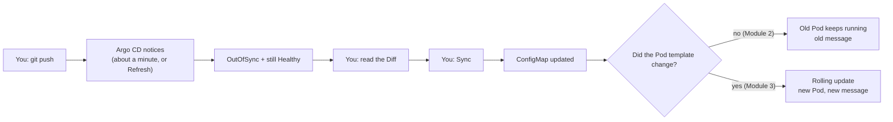

# Lab 1 — Follow an Application Through Reconciliation (modular arc)

> **Day 1 · Lab 1 · Hands-on · ~45 minutes · Scaffolding G1 (maximally guided)**
> **Argo CD version this course targets: `v3.5.2`** (Helm chart `10.8.4`, Kubernetes `v1.35`).
> **Before this:** [Session 1](../session-01/README.md) and [Session 2](../session-02/README.md). You should have the Argo CD web interface open at `https://localhost:8443` and a working terminal on your VM.

---

## Why this matters

In Session 1 you met a thermostat that reads a target from Git and keeps nudging the cluster toward it. In Session 2 you named every part of that machine and the two status words — **Synced** and **Healthy**. So far that has all been *reading*. **This lab is where you watch it happen with your own eyes.**

You will take one real application that is already running, change a single line in its Git repository, and follow that change all the way through the system — Git notices, Argo CD compares, you approve, the cluster converges, and the app starts saying something new. You will watch the same event from three windows (the web interface, the `argocd` command line, and raw `kubectl`) and learn they are three vocabularies for one story.

This is the single most reused skill in the course. Every later lab and the Capstone builds on the ability to look at an application and answer two questions with evidence: *does it match Git?* and *is it actually working?*

> **Where this app lives.** In this lab, Argo CD deploys the sample app to the **management cluster itself** — a teaching shortcut so you can learn the loop before cluster registration exists. Production never does this. **Lab 2 fixes it** by registering a separate workload cluster.

---

## Learning objectives

By the end you will be able to:

1. **Read an Argo CD Application manifest and name every external thing it depends on** (outline bullet **L1.1**).
2. **Commit a small change and follow the reconciliation flow end to end** — from an unnoticed commit, through `OutOfSync`, through a manual sync, to a new `Synced`/`Healthy` state — and explain (then fix in Git) why a synced change had not yet reached the running app (**L1.2**).
3. **Compare the three states of a resource** — desired (Git), rendered (what Argo CD produced), and live (what is running) — and explain why rendered-vs-live differences are not drift (**L1.3**).
4. **Locate an application's status and events in three places** — web interface, `argocd` CLI, and `kubectl` (**L1.4**).

These map to outcomes **O1**, **O2**, and **O7**.

---

## Mental model recap (short — Session 2 taught it)

**Two independent questions.** *Sync status* (`Synced`/`OutOfSync`) asks "does the cluster match Git?" *Health status* (`Healthy`/`Progressing`/`Degraded`/...) asks "is it actually working?" A change committed to Git makes an app `OutOfSync` **without** making it unhealthy — the old version keeps serving until you sync.

**One number: ~60 seconds.** Argo CD re-checks each app on a timer (product default 180s; this classroom `~60s`). After a push, about a minute of "nothing happening" is normal, and it can stretch a little past that. **Refresh** forces an immediate check.

---

## The big picture in plain words

**One analogy to hold onto for this whole lab: a restaurant kitchen.**

In Session 1 you met a thermostat, which is a good picture of *why* Argo CD keeps checking. This lab zooms in on *what happens after a change is approved*, and a kitchen shows that part better.

| In the kitchen… | In this lab… | Module |
|---|---|---|
| The **recipe book** everyone agrees to follow | Git: the `hello-reconcile` repository | 2 |
| The **head chef**, who compares the recipe book with what is being served, about once a minute | Argo CD, reconciling every ~60 seconds | 2 |
| Tapping the head chef on the shoulder: "check the book now" | Clicking **Refresh** | 2 |
| "The recipe changed, but the old dish is still being served perfectly well" | `OutOfSync` **and** `Healthy` at the same time | 2 |
| The head chef showing you the exact line of the recipe that changed, before anyone cooks | **Diff** | 2 |
| "Go ahead, update the kitchen" | **Sync** | 2 |
| The **recipe card pinned on the wall** | The ConfigMap | 2–3 |
| A **cook who memorised the recipe at the start of their shift** | A running Pod, which read its settings once, when it started | 3 |
| A **recipe version number printed on the shift roster** | The `checksum/config` annotation | 3 |
| The new cook arrives and is ready **before** the old cook clocks out | A rolling update | 3 |
| Three ways to check on the kitchen: the head chef's clipboard, the intercom, walking in yourself | The web interface, the `argocd` CLI, and `kubectl` | 1, 4 |

The one surprise to watch for: **changing the card on the wall does not change what the cook on shift is already making.** Module 3 is about that moment.

---

## The four modules

Work them in order — each builds on the last.

| Module | You will... | ~Time |
|---|---|---|
| [01 — Setup and dependencies](01-setup-and-dependencies.md) | Confirm the healthy starting state, learn the three surfaces, and map every dependency (**E1**) | ~10 min |
| [02 — Commit a change and sync it](02-commit-and-sync.md) | Predict, change one line in Git, read the diff, and sync (**E2 Part 1**) | ~12 min |
| [03 — Why the app didn't change](03-why-the-app-didnt-change.md) | Gather evidence, explain the surprise, and fix it *in Git* (**E2 Parts 2–3**) | ~12 min |
| [04 — Three views and wrap-up](04-three-views-and-wrap-up.md) | Compare desired/rendered/live (**E3**), locate status three ways (**E4**), checkpoint, stretch | ~10 min |

**→ Start:** [01 — Setup and dependencies](01-setup-and-dependencies.md)
