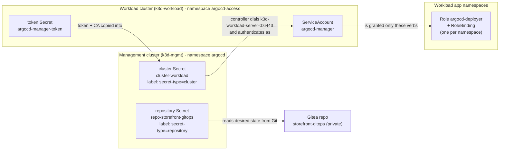

# Lab 2 — Configure the Platform and Register a Target

> **Day 1 · Lab 2 · Hands-on lab guide · ~60 minutes**
> **Argo CD version this course targets: `v3.5.2`** (Helm chart `10.8.4`, Kubernetes `v1.35`).
> **Scaffolding level: G1 (maximally guided).** Exact clicks, exact commands, and a screenshot at every meaningful step. This is the last lab that holds your hand this tightly — from Lab 3 onward you produce more of the work yourself.
> **What you need open before you start:**
> - a MATE Terminal window on the VM desktop (run `source ~/argo-lab-env.sh` in each new one),
> - Firefox inside that same desktop with the Argo CD web interface (`https://localhost:8443`), logged in as `admin` — because Firefox runs on the VM, `localhost` already means the VM and there is no tunnel to start,
> - the `argocd` command line, already logged in as `admin` on your VM (Lab 0 did this; confirm with `argocd account get-user-info`).
>
> **This lab runs on your pre-provisioned course VM.** If you have not completed **Lab 0 — Prepare Your VM for Lab 1**, do that first: it builds the two clusters, Argo CD, Gitea, and reaches the starting checkpoint.

---

## 1. Why this matters

In Lab 1 you watched one change travel from Git to a running application — but you took a deliberate shortcut. Argo CD deployed that application to the **management cluster itself**, the same cluster Argo CD runs on. Real platforms never do that. A production platform keeps Argo CD on a dedicated **management cluster** and deploys to *separate*, registered **workload clusters**, so a mistake in one workload cluster cannot reach the platform that governs all of them.

This lab builds that real topology with your own hands. You will do four things a platform engineer does on their first day running Argo CD for a team:

1. **Connect a private Git repository** so Argo CD can read the storefront application's desired state (Lab 1's repository was public-read and needed no credentials — this one is private and does).
2. **Register a separate workload cluster** with a **least-privilege** identity, so Argo CD can deploy there but cannot do more than the application needs.
3. **Prove** both connections actually work, and prove the identity is genuinely restricted.
4. **Create the first `AppProject` and `Application`** declaratively — the governance fence and the deployment instruction that every later lab builds on.

Everything you configure here is the substrate for the rest of the course. The objects you create are objects you will *read* for the next two days, and one of them is the exact thing the Capstone breaks. Building them slowly now, and understanding what each one *is*, is what lets you diagnose them fast later.

---

## 2. Learning objectives

By the end of this lab you will be able to:

1. **Connect a prepared, private Git repository declaratively**, injecting the credential from a file that is never committed to Git (outline bullet L2.1).
2. **Register a separate workload cluster with least-privilege credentials** — a scoped ServiceAccount, a token, and a cluster Secret that forbids cluster-scoped writes (L2.2).
3. **Verify repository and cluster connectivity**, and prove least privilege with a `kubectl auth can-i` matrix that matches the design on purpose (L2.3).
4. **Create a basic `AppProject` and `Application` declaratively**, commit them, and apply them (L2.4).
5. **Confirm Argo CD can render and compare the target application** — reading `OutOfSync` + `Missing` as the *correct* first result, not a failure (L2.5).
6. **Diagnose two common onboarding failures** — a repository that will not connect and a cluster that will not connect — from the evidence Argo CD shows.

These map to course outcomes **O3** (management/workload configuration), **O4** (the Application model), and **O7** (diagnosing connectivity and onboarding failures).

---

## 3. Prerequisites and what earlier guides established

**You should have completed:**

- **Lab 1 — Follow an Application Through Reconciliation.** You have traced one change through the reconciliation loop and can read the two status axes (sync and health).
- **Guide 01 — GitOps and the Argo CD topology.** Recall: Argo CD *pulls* from Git and converges; the **management cluster** runs Argo CD and is the most security-sensitive cluster you own, because it holds working credentials to every workload cluster it manages.
- **Guide 02 — Argo CD architecture and the Application model.** Recall the one-verb-per-component model: the **repo-server** *renders*, and the **application-controller** *compares and applies* — the controller is the only component that talks to a workload cluster.
- **Guide 03 — Production-Oriented Configuration.** Recall that repositories and clusters are onboarded **declaratively**, and that a workload cluster is registered with **least-privilege** credentials rather than cluster-admin.

**Acronyms this lab uses, expanded once here:**

- **RBAC (Role-Based Access Control):** the Kubernetes system that decides *who* may perform *which action* on *which resource* in *which namespace*.
- **SA (ServiceAccount):** a non-human identity inside a Kubernetes cluster that a program (here, Argo CD) authenticates as.
- **API (Application Programming Interface) server:** the front door of a Kubernetes cluster; every `kubectl` command and every Argo CD action talks to it.
- **TLS (Transport Layer Security) / CA (Certificate Authority):** TLS is the encryption that protects the connection to the API server; the CA certificate is how the client verifies it is talking to the *real* API server and not an impostor.
- **URL (Uniform Resource Locator):** an address, such as `https://k3d-workload-server-0:6443`.
- **HPA (Horizontal Pod Autoscaler):** a Kubernetes object that changes how many Pod replicas run based on load.

**Three short refreshers this lab leans on:**

> **Refresher — kubeconfig contexts and `--context`.** A *kubeconfig* is the file that tells `kubectl` which clusters exist, how to reach them, and who you are. Each cluster entry is a **context**. Your VM has two: `k3d-mgmt` (the management cluster, where Argo CD runs) and `k3d-workload` (the separate workload cluster you register in this lab). Because there are two, **every `kubectl` command in this course names its context explicitly** with `--context k3d-mgmt` or `--context k3d-workload`. In this lab, choosing the wrong context is not a small slip — some steps *must* target the workload cluster and others *must* target the management cluster, and the whole point of the lab is which is which.

> **Refresher — a Kubernetes Secret is a labeled object.** A **Secret** is a namespaced Kubernetes object that holds key/value data. Argo CD does not have a separate database of repositories and clusters — it stores each one as a Secret in its own `argocd` namespace, marked with a **label** so Argo CD knows what kind it is. A *label* is a `key: value` tag on an object. You will see two labels a lot today: `argocd.argoproj.io/secret-type: repository` and `argocd.argoproj.io/secret-type: cluster`.

> **Refresher — `git clone`, `commit`, `push`.** *Clone* copies a repository from the Git server to a folder on your VM. *Commit* records a snapshot locally with a message. *Push* sends your commits back to the server. In this lab you edit files in a repository called `platform-config`, commit them so the change is recorded in Git, and then apply them to the cluster.

---

## 4. Mental model recap (short)

Two ideas carry this whole lab. They are short on purpose — the concept guides already taught them.

**Everything Argo CD knows about your repos and clusters is a labeled Secret in one namespace.** "Connecting a repository" and "registering a cluster" *sound* like features you toggle. They are not. Each one is a single Kubernetes Secret in the `argocd` namespace, distinguished only by a label. Once you believe that, declarative onboarding stops being mysterious: you are *writing* those Secrets instead of clicking a form.

**A credential is only valid from the place that will use it.** Argo CD's application-controller — running in a Pod on the management cluster — is the thing that will actually dial the workload cluster's API server. So the server address and the token you store must work **from inside that Pod**, not from your laptop. This single idea explains the most-copied bug in GitOps (a `127.0.0.1` address that means "me" wherever it is read) and it explains why the workload address you will use is `https://k3d-workload-server-0:6443`, a name that resolves *inside the cluster network*, and not the `localhost` address your own kubeconfig uses.

Here is the trust chain you are about to build. Read it once now; you will build it left to right.



---

## 5. Environment check — confirm you are starting from "healthy"

Before you change anything, prove the environment is in the known-good starting state, called **checkpoint `CP-lab-02`**. This takes about a minute and saves you from debugging a problem you started with.

### 5.1 Run the verifier (it changes nothing)

In a MATE Terminal window on the VM desktop, first run `source ~/argo-lab-env.sh` (do this in every new VM terminal so the pinned `kubectl`, `helm`, `argocd`, and the course scripts are on your `PATH`). Then run:

```bash
reset-lab.sh CP-lab-02 --verify-only --local
```

The `--verify-only` flag prints a PASS/FAIL table **without changing anything**.

**Expected output** *(representative — confirm against the live classroom environment):*

```text
▶ Verification for CP-lab-02
  PASS  Application hello-reconcile Synced/Healthy
  PASS  Secret in-cluster present (management cluster registered)
  PASS  No repository Secret present (storefront-gitops NOT connected)
  PASS  No cluster Secret 'cluster-workload' present (workload NOT registered)
  PASS  workload namespaces present (argocd-access, storefront-dev, storefront-staging, storefront-prod, team-a, platform-system)
  PASS  workload SA argocd-manager absent (RBAC not yet applied)
  PASS  platform-config skeletons present (projects/storefront.yaml, applications/storefront-dev.yaml)

PASS CP-lab-02 is in the expected state.
```

**Read the table — this is the whole starting story:**

1. The **workload cluster is running but not registered**. Argo CD cannot deploy there yet.
2. The **private repository `storefront-gitops` is not connected**. Argo CD cannot read its desired state yet.
3. The **workload namespaces already exist**. The platform team pre-creates them (in a real Rancher/RKE2 platform these map to Rancher Projects that own namespaces). You do **not** create namespaces in this lab.
4. The **skeleton files exist with `TODO` markers** in the `platform-config` repository. You complete them in E4.

> **If any row says `FAIL`:** run `reset-lab.sh CP-lab-02 --local` (without `--verify-only`) to rebuild the starting state. **Warning:** a full reset **discards any lab work in progress** and forces every course repository back to its Lab 2 baseline. On a fresh start there is nothing to lose. The command asks you to type the checkpoint name to confirm.

### 5.2 Look at "empty" in the web interface

Switch to your browser tab with Argo CD open at `https://localhost:8443`. In the left sidebar, open **Settings** (the gear icon), then **Repositories**.


*Figure SS-L2-01 — Argo CD v3.5.2 Settings → Repositories at checkpoint `CP-lab-02`. The private `storefront-gitops` repository is not connected yet. This is what "ready to start" looks like.*

**What to notice:**

1. There is **no `storefront-gitops` entry** — the private repository is not connected.
2. If any rows appear at all, they are unrelated to this lab (for example, a public repo used earlier). Your job in E1 is to add the private one.
3. The page is where the green **connection status** will appear once you connect the repo — you will come back here in E1.

<!-- CAPTURE-SPEC: SS-L2-01 — Argo CD Settings → Repositories, environment check. State: checkpoint CP-lab-02 (reset-lab.sh CP-lab-02), logged in as admin, route /settings/repos. Highlight: absence of a storefront-gitops row. Fidelity: full page. Argo CD v3.5.2. -->

### 5.3 Clone the platform repository you will edit

Several exercises edit files in a repository called `platform-config` and commit them. Clone it onto your VM now so the files are ready:

```bash
cd ~
git clone http://lab-gitea:3000/course/platform-config.git
cd platform-config
git config user.email "student@lab.local"
git config user.name "Student"
```

This repository holds the **templates** and **skeletons** you will fill in:

```text
platform-config/
  repositories/storefront-gitops.secret.template.yaml   # E1: repository Secret template
  clusters/workload.secret.template.yaml                # E2: cluster Secret template
  projects/storefront.yaml                              # E4: AppProject skeleton (TODOs)
  applications/storefront-dev.yaml                      # E4: Application skeleton (TODOs)
```

Two more files live on the VM filesystem (not in Git, because they touch credentials):

- `~/course/credentials/gitea-student.txt` — the Gitea password for user `student` (mode `0600`, never committed).
- `~/course/lab-files/lab-02/workload-rbac.yaml` — the least-privilege RBAC you apply to the workload cluster in E2.

---

## 6. Guided walkthrough — what you are about to build

This section teaches the *concepts and shapes*. The exercises in Section 7 are where **you** produce the commands and manifests. Read this walkthrough first; it makes every exercise faster.

### 6.1 The two-command address book (run this now)

Argo CD's entire knowledge of your repositories and clusters is a set of labeled Secrets in the `argocd` namespace. You can print the whole "address book" with two commands. Run them now, at `CP-lab-02`, **before** you have connected anything:

```bash
kubectl --context k3d-mgmt -n argocd get secret -l argocd.argoproj.io/secret-type=repository
kubectl --context k3d-mgmt -n argocd get secret -l argocd.argoproj.io/secret-type=cluster
```

**Expected now** *(representative — confirm against the live environment):*

```text
# repository Secrets:
No resources found in argocd namespace.

# cluster Secrets:
NAME         TYPE     DATA   AGE
in-cluster   Opaque   3      2d
```

**What this tells you:**

1. There are **no repository Secrets** — matching the empty Repositories page you saw a moment ago.
2. There is **one cluster Secret**, the management cluster (`in-cluster`). The workload cluster is missing.
3. By the end of E2 the second command will return **two** rows. That before/after is the reveal: "registering a cluster" *was* creating a labeled Secret all along.

> **Never print a Secret's decoded contents in this course.** These commands show a Secret's *existence and labels*, never its values. You will inject credentials into Secrets in E1 and E2 without ever displaying them.

### 6.2 What a repository Secret looks like (E1's template)

Open the template you will use in E1:

```bash
cat ~/platform-config/repositories/storefront-gitops.secret.template.yaml
```

```yaml
apiVersion: v1
kind: Secret
metadata:
  name: repo-storefront-gitops
  namespace: argocd
  labels:
    argocd.argoproj.io/secret-type: repository
type: Opaque
stringData:
  type: git
  url: http://lab-gitea:3000/course/storefront-gitops.git
  username: student
  password: <PASSWORD>
```

Read the shape:

- The **label** `argocd.argoproj.io/secret-type: repository` is what makes Argo CD treat this Secret as a repository connection.
- `url`, `username`, and `type` are already filled in. The `url` is the **in-network** Gitea address (`lab-gitea:3000`), which resolves from inside the Argo CD Pods — the same "valid from where it is used" rule as clusters.
- The only placeholder is `<PASSWORD>`. In E1 you inject the real password **from the credential file** so it never appears in the template, in your shell history, or in Git.

### 6.3 What a cluster Secret looks like (E2's template)

Open the cluster template you will use in E2:

```bash
cat ~/platform-config/clusters/workload.secret.template.yaml
```

```yaml
apiVersion: v1
kind: Secret
metadata:
  name: cluster-workload
  namespace: argocd
  labels:
    argocd.argoproj.io/secret-type: cluster
    cluster-role: workload
    region: lab
type: Opaque
stringData:
  name: workload
  server: https://k3d-workload-server-0:6443
  namespaces: storefront-dev,storefront-staging,storefront-prod,team-a,platform-system
  clusterResources: "false"
  config: |
    {
      "bearerToken": "<TOKEN>",
      "tlsClientConfig": {
        "insecure": false,
        "caData": "<CA_DATA>"
      }
    }
```

Read the shape — every field is a design decision:

- The **label** `argocd.argoproj.io/secret-type: cluster` makes this a cluster registration. The extra labels `cluster-role: workload` and `region: lab` are yours to filter on later.
- `server: https://k3d-workload-server-0:6443` is the **in-network** name of the workload API server. This is the single most important line in the lab. Your own kubeconfig reaches the workload cluster over a `localhost` port, but Argo CD's controller Pod cannot use `localhost` to mean the workload cluster — `localhost` inside that Pod means the Pod itself. `k3d-workload-server-0` is a name every Pod on the shared cluster network can resolve.
- `namespaces` + `clusterResources: "false"` are the **least-privilege scope**: Argo CD may act only in these namespaces and may **never** create cluster-scoped resources (such as a `Namespace` or a `ClusterRole`) on this cluster.
- `config` carries the **bearer token** (how Argo CD authenticates) and the **CA data** (how Argo CD verifies the API server). You inject both from the workload cluster in E2. `<TOKEN>` is the *decoded* token; `<CA_DATA>` is *already-base64* CA data placed as-is.

### 6.4 The identity lives on the cluster being managed — not the one managing

Here is the part most people predict wrong. When you register a workload cluster, the **ServiceAccount that Argo CD authenticates as is created on the workload cluster** — the cluster being *managed* — not on the management cluster doing the managing. The management side only stores a *credential for* that ServiceAccount (the cluster Secret).

The file `~/course/lab-files/lab-02/workload-rbac.yaml` builds that identity. It creates, **on the workload cluster**:

- ServiceAccount `argocd-manager` in namespace `argocd-access` (the identity),
- Secret `argocd-manager-token` (a long-lived bearer token for that identity),
- a `Role` named `argocd-deployer` plus a `RoleBinding` in each of `storefront-dev`, `storefront-staging`, `storefront-prod`, and `platform-system` (the full write set the app needs),
- a reduced `Role` named `argocd-deployer-team` plus a `RoleBinding` in `team-a` (the same set **minus** NetworkPolicy, ResourceQuota, and LimitRange writes),
- **no** ClusterRoleBinding with write access anywhere.

That last point plus `clusterResources: "false"` is the whole least-privilege story: Argo CD can deploy the app in named namespaces and can do **nothing** cluster-wide.

### 6.5 The AppProject is a fence you build before you need it

The last thing you create (E4) is an **`AppProject`** — a tenant boundary that answers three questions in advance:

- **Which repositories** may an Application in this project deploy *from*? (`sourceRepos`)
- **Which cluster + namespace destinations** may it deploy *to*? (`destinations`)
- **Which resource kinds** may it create? (`namespaceResourceWhitelist`, and a deliberately empty `clusterResourceWhitelist`)

Creating it now is not paperwork. It is the object Lab 5 will tighten and try to break, and it is the reason a later access request is a small, reviewable diff to a fence rather than an argument.

Finally, the **`Application`** (also E4) is the deployment instruction: render *this* chart at *this* revision from *this* repo, into *this* destination namespace, under *this* project. You will create it with **manual sync on purpose** (no `automated:` block) so that Lab 3 can turn automation on deliberately.

> **What "success" will look like at the end of E4 — and why it is not a failure.** As soon as the Application exists, Argo CD compares desired state (the chart) against live state (an empty namespace) and reports **`OutOfSync`** with health **`Missing`**. Nothing is broken. `OutOfSync` here means "Git describes resources the cluster does not have yet," and `Missing` means "those resources are not deployed yet." You have not synced, on purpose. Reading this correctly is objective L2.5.

---

## 7. Exercises

Do these in order — each builds on the last. Times are targets; the whole set fits in about 45 minutes, leaving room for the checkpoint.

> **Ground rule for every exercise:** the walkthrough above showed you the *shapes and mechanisms*. These exercises do **not** hand you the finished commands or the filled-in fields — you produce them. That is the point. The separate solution guide has the exact answers if your instructor needs them.

---

### E1 — Connect the private repository

**Difficulty:** Core · **Time:** ~10 minutes · **Objective:** L2.1

**Goal (plain language):** Turn the repository template into a real Secret by injecting the Gitea password **from the credential file**, apply it to the management cluster, and confirm the connection shows **Successful**. The password must never appear in the template, in your shell history, or in Git.

**Starter state:** `platform-config` cloned (Section 5.3). Template at `~/platform-config/repositories/storefront-gitops.secret.template.yaml`. Password at `~/course/credentials/gitea-student.txt`.

**Concrete input:** the template from Section 6.2 (only `<PASSWORD>` is a placeholder) and the credential file.

**Shape of a correct result:** a Secret named `repo-storefront-gitops` exists in the `argocd` namespace with the label `argocd.argoproj.io/secret-type: repository`, and both the UI and CLI report the repository connection as **Successful**. You should be able to prove the connection **without ever printing the password**.

**Predict-before-you-verify:** before you run any verification, write down: *after I apply this Secret, will the connection show Successful immediately, or is there a delay?* (Hold your answer; check it against what you observe.)

**Hints (use only if stuck):**
- *Hint 1:* Everything in the template is already correct except `<PASSWORD>`. You do not edit the `url`, `username`, or label.
- *Hint 2:* Do not paste the password into the file and do not `echo` it. A substitution tool such as `envsubst` replaces a placeholder with the value of an environment variable; you can load the credential file into that variable so the password stays out of your history and out of Git.
- *Hint 3:* Render the filled-in Secret to standard output and pipe it straight into `kubectl --context k3d-mgmt apply -f -` so the completed Secret never touches disk. The management cluster is `k3d-mgmt`.
- *Hint 4:* To verify, use the UI Repositories page and the `argocd repo list` command — neither reveals the password.

**Success criterion:** In the browser, Settings → Repositories shows `storefront-gitops` with a green **Successful** connection status, matching the screenshot below. In the CLI, `argocd repo list` shows the same repository with status `Successful`. You did not print or commit the password.


*Figure SS-L2-02 — Settings → Repositories after E1: `storefront-gitops` shows a green **Successful** connection status (v3.5.2).*

<!-- CAPTURE-SPEC: SS-L2-02 — Argo CD Settings → Repositories after E1. State: repository Secret repo-storefront-gitops applied, route /settings/repos. Highlight: storefront-gitops row with green Successful connection status and the http://lab-gitea:3000/course/storefront-gitops.git URL. Fidelity: full page. Argo CD v3.5.2. -->

> **What "Successful" actually means (keep this for the Capstone).** A green connection status is a *measurement taken a moment ago*, not a permanent guarantee. It means "the last check reached the repository." A credential that expires next month shows green today and fails the morning it matters. Every status in Argo CD is a reading with a timestamp.

---

### E2 — Register the workload cluster with least privilege

**Difficulty:** Advanced · **Time:** ~17 minutes · **Objective:** L2.2

**Goal (plain language):** Give Argo CD a scoped identity on the workload cluster, then register the cluster by writing a cluster Secret that carries that identity's token and CA. When you finish, the workload cluster appears as **Successful** in Argo CD, scoped to only its allowed namespaces.

**Starter state:** RBAC file at `~/course/lab-files/lab-02/workload-rbac.yaml`. Cluster template at `~/platform-config/clusters/workload.secret.template.yaml` (Section 6.3). The workload cluster is running but not registered.

**This exercise has three moves. Predict the first one before you act:**

> **Predict-before-you-apply.** The RBAC file creates a ServiceAccount, a token Secret, Roles, and RoleBindings. **Which cluster should receive them — the management cluster (`k3d-mgmt`) or the workload cluster (`k3d-workload`)?** Write your answer down before Move A. (Section 6.4 is the reasoning; commit to an answer first.)

**Move A — create the identity.** Apply `workload-rbac.yaml` to the correct cluster (your prediction above decides the `--context`). This creates `argocd-manager` and its per-namespace Roles.

**Move B — collect the token and CA.** The Secret `argocd-manager-token` (namespace `argocd-access`) holds two fields you need: `token` and `ca.crt`. Read the template's comments in Section 6.3 for exactly which form each one takes.

- The **bearer token** is the *decoded* value of the Secret's `token` field.
- The **CA data** is the Secret's `ca.crt` field used **as-is** (it is already base64-encoded, which is what `caData` expects).

**Move C — render and apply the cluster Secret.** Inject the token and CA into the template's `<TOKEN>` and `<CA_DATA>` placeholders, then apply the result to the **management** cluster's `argocd` namespace.

**Concrete input:** the RBAC file, the token Secret on the workload cluster, and the cluster template. **Shape of a correct result:** a cluster Secret named `cluster-workload` exists in `argocd` on the management cluster with label `argocd.argoproj.io/secret-type: cluster`; the workload cluster shows **Successful** in Settings → Clusters; and its detail panel lists the five scoped namespaces and the `cluster-role`/`region` labels.

**Hints (use only if stuck):**
- *Hint 1:* Re-run the "address book" command from Section 6.1 for cluster Secrets after Move C — it should now return **two** rows.
- *Hint 2:* The token Secret may take a few seconds to be populated after Move A (a controller fills it in). If `token` is empty, wait and re-read it.
- *Hint 3:* To read a single field from a Secret without dumping the whole object, `kubectl get secret ... -o jsonpath='{.data.<field>}'` returns only that field. Remember which field needs decoding (`base64 -d`) and which is used as-is — Section 6.3 told you.
- *Hint 4:* Keep the token and CA out of your shell history and out of Git the same way you kept the password out in E1 (variables + `apply -f -`, never a committed file).
- *Hint 5:* If the cluster registers but then shows `Unknown` or a connection error, re-read the `server:` line — it must be `https://k3d-workload-server-0:6443`, not any `localhost`/`127.0.0.1` address (see Troubleshooting).

**Success criterion:** Settings → Clusters shows a `workload` row with a green **Successful** status and the server URL `https://k3d-workload-server-0:6443` (SS-L2-03), and the cluster detail panel shows the scoped namespaces and labels (SS-L2-04).


*Figure SS-L2-03 — Settings → Clusters after E2: the `workload` cluster shows **Successful** at `https://k3d-workload-server-0:6443` (v3.5.2).*

<!-- CAPTURE-SPEC: SS-L2-03 — Argo CD Settings → Clusters after E2. State: cluster Secret cluster-workload applied, route /settings/clusters. Highlight: workload row with green Successful status and server URL https://k3d-workload-server-0:6443. Fidelity: full page. Argo CD v3.5.2. -->


*Figure SS-L2-04 — The `workload` cluster detail after E2: the namespace scope and the `cluster-role: workload` / `region: lab` labels (v3.5.2).*

<!-- CAPTURE-SPEC: SS-L2-04 — Argo CD cluster detail panel. State: after E2, open the workload cluster detail from /settings/clusters. Highlight: the scoped namespaces list (storefront-dev, storefront-staging, storefront-prod, team-a, platform-system) and the cluster-role/region labels. Fidelity: panel. Argo CD v3.5.2. -->

---

### E3 — Predict, then prove least privilege

**Difficulty:** Intermediate · **Time:** ~8 minutes · **Objective:** L2.3

**Goal (plain language):** Confirm that the identity you created is genuinely restricted by asking Kubernetes directly: *is `argocd-manager` allowed to do X?* You will **predict each answer first**, then check it. The value is in predicting — a matrix you can predict is a matrix you understand.

**Starter state:** E2 complete; `argocd-manager` exists on the workload cluster with its per-namespace Roles.

**Concrete input — the question form.** `kubectl auth can-i` answers "is this identity allowed to do this?" You ask it *as* the ServiceAccount:

```bash
kubectl --context k3d-workload auth can-i <verb> <resource> -n <namespace> \
  --as=system:serviceaccount:argocd-access:argocd-manager
```

For a **cluster-scoped** check (a resource that has no namespace), drop the `-n <namespace>` part.

**Predict-then-observe.** Fill the *Predict* column **before** running anything. Then run each check and fill *Actual*. Each row is a `yes` or `no`.

| # | Check (fill verb/resource/namespace into the command) | Predict | Actual |
|---|---|---|---|
| 1 | Create a `Deployment` in `storefront-dev` | ? | |
| 2 | Create a `Deployment` in `default` (a namespace not in the scope) | ? | |
| 3 | Create a `NetworkPolicy` in `team-a` | ? | |
| 4 | Delete a `Namespace` (cluster-scoped — no `-n`) | ? | |

**Shape of a correct result:** four `yes`/`no` answers that **match the least-privilege design** in Section 6.4. If any answer surprises you, the surprise is the lesson — re-read which namespaces got which Role, and which verbs the `team-a` Role deliberately omits.

**Hints (use only if stuck):**
- *Hint 1:* The RoleBindings exist only in specific namespaces. A namespace with no binding grants nothing, no matter what.
- *Hint 2:* Compare the full `argocd-deployer` Role with the reduced `argocd-deployer-team` Role — one resource kind is present in the first and absent in the second. That difference is row 3.
- *Hint 3:* There is **no** ClusterRoleBinding with write access anywhere. That fact alone decides row 4.

**Success criterion:** Your four observed answers match your understanding of the design, and you can state in one sentence *why* each `no` is a `no` (missing binding, unlisted namespace, or missing cluster-scoped grant). This is the 401-vs-403 muscle you will reuse in Lab 5 and the Capstone.

> **Name the payoff now, because Lab 5 and the Capstone grade it.** Every `no` above is **Kubernetes** deciding authorization — a `403 Forbidden` the API server returns *after* a request reaches the cluster. That is a different fence from **Argo CD's own** authorization, which refuses an action *before* any sync operation reaches Kubernetes at all. The field-usable rule you are building here: **if the sync never started, it was Argo CD that said no; if the sync started and then failed, it was Kubernetes.** You will tell these two apart under pressure in Lab 5 and the Capstone.

---

### E4 — Create the AppProject and Application declaratively

**Difficulty:** Intermediate · **Time:** ~12 minutes · **Objectives:** L2.4, L2.5

**Goal (plain language):** Complete the `TODO` fields in the `AppProject` and `Application` skeletons, commit them to `platform-config`, apply them to the management cluster, and confirm the Application appears as **`OutOfSync`** + **`Missing`** — the correct first result.

**Starter state:** the two skeletons in your cloned repo:
- `~/platform-config/projects/storefront.yaml` (the `AppProject`)
- `~/platform-config/applications/storefront-dev.yaml` (the `Application`)

Each has fields marked `# TODO (Lab 2 E4)`. Open them and read the `TODO` comments — they tell you exactly what each field must contain.

**Concrete input — where each answer comes from (you still have to write it):**
- **`sourceRepos`** (project): must exactly match the repository URL the Application deploys from — visible in the Application skeleton's own `repoURL`.
- **`destinations[].server`** (project) and **`destination.server`** (Application): the same workload API server URL you put in the cluster Secret in E2.
- **`namespaceResourceWhitelist`** (project): the resource kinds the storefront chart actually creates. Inspect `~/platform-config`? No — the chart lives in `storefront-gitops`. Reason from what the chart renders (Deployment, Service, ConfigMap, a migration Job, and an HPA). Confirm by reading the chart templates if you cloned it.
- **`helm.valueFiles`** (Application): the dev values file, expressed **relative to the chart path** `charts/storefront`. Think about how many directories up you must go before descending into `envs/dev`.

**Predict-before-you-apply.** Before you apply, write your prediction:

| Moment | Sync status? | Health status? |
|---|---|---|
| Immediately after `kubectl apply`, before any sync | ? | ? |

**Steps:**
1. Complete the `TODO` fields in both files. Do not add an `automated:` block — manual sync is intentional.
2. Commit them so Git records the change:
   ```bash
   cd ~/platform-config
   git add projects/storefront.yaml applications/storefront-dev.yaml
   git commit -m "Lab 2 E4: storefront AppProject and dev Application"
   git push
   ```
   (Push credentials are `student` + the password from `~/course/credentials/gitea-student.txt`.)
3. Apply both to the management cluster:
   ```bash
   kubectl --context k3d-mgmt apply -f projects/storefront.yaml
   kubectl --context k3d-mgmt apply -f applications/storefront-dev.yaml
   ```
4. Open the Applications list and the `storefront-dev` tree and diff.

**Shape of a correct result:** the `AppProject` `storefront` exists with your source repo, destination, and resource-kind allow list (SS-L2-05); `storefront-dev` appears in the Applications list as **`OutOfSync`** / **`Missing`** (SS-L2-06); its resource tree shows every node as **`Missing`** (SS-L2-07); and the diff shows **desired-only** resources — everything is "new," because nothing is deployed yet (SS-L2-08). In one sentence, be ready to explain why this is correct and not broken.

**Hints (use only if stuck):**
- *Hint 1:* A relative path that starts at `charts/storefront` and needs to reach `envs/dev/values.yaml` has to climb *out* of `charts/storefront` first. Count the `..` segments.
- *Hint 2:* If the Application shows a red **ComparisonError** instead of `OutOfSync`, the `valueFiles` path is almost always wrong — Argo CD could not find the file to render. Fix the relative path, commit, and re-apply.
- *Hint 3:* If the Application is stuck `Unknown`, the destination `server` does not match a registered cluster — it must be byte-for-byte the workload server URL from E2.
- *Hint 4:* The `namespaceResourceWhitelist` must include every kind the chart renders, or a later sync (Lab 3) will be blocked by the project fence. The `TODO` comment lists them.

**Success criterion:** `argocd app get storefront-dev` shows `Sync Status: OutOfSync` and `Health Status: Missing`, and the diff shows all resources as newly added. Your one-sentence explanation says *why* (Git describes resources that are not deployed yet, and sync is manual on purpose).


*Figure SS-L2-05 — The `storefront` AppProject after E4: allowed source repository, allowed destination, and an intentionally empty cluster-resource allow list (v3.5.2).*

<!-- CAPTURE-SPEC: SS-L2-05 — Argo CD Project detail. State: after E4 apply, route /settings/projects/storefront. Highlight: the single allowed source repo, the storefront-dev destination, and the empty clusterResourceWhitelist. Fidelity: full page. Argo CD v3.5.2. -->


*Figure SS-L2-06 — The Applications list after E4: `storefront-dev` is `OutOfSync` / `Missing` — the correct first result (v3.5.2).*

<!-- CAPTURE-SPEC: SS-L2-06 — Argo CD Applications list. State: after E4 apply, route /applications. Highlight: storefront-dev tile with OutOfSync (yellow) and Missing badges. Fidelity: full page. Argo CD v3.5.2. -->


*Figure SS-L2-07 — The `storefront-dev` resource tree: every node is `Missing` because nothing is deployed yet (v3.5.2).*

<!-- CAPTURE-SPEC: SS-L2-07 — Argo CD application tree. State: after E4 apply, route /applications/storefront-dev. Highlight: resource nodes (ConfigMap, Service, Deployment, etc.) all showing Missing. Fidelity: full page. Argo CD v3.5.2. -->


*Figure SS-L2-08 — The diff for `storefront-dev`: all resources are desired-only (new), because live state is empty (v3.5.2).*

<!-- CAPTURE-SPEC: SS-L2-08 — Argo CD diff view. State: after E4 apply, open App Diff on storefront-dev. Highlight: every resource shown as added/desired-only with no live counterpart. Fidelity: panel. Argo CD v3.5.2. -->

---

### E5 — Diagnose two broken onboarding records

**Difficulty:** Intermediate · **Time:** ~8 minutes · **Objective:** O7 (diagnose connectivity failures)
**The second record (the cluster) is optional — do it if you have time.**

**Goal (plain language):** Apply a deliberately broken onboarding Secret, read the symptom Argo CD reports, name the **single wrong field**, and remove the broken Secret. You are practicing the diagnosis reflex, not memorizing a fix.

**Starter state:** two provided broken files (your instructor's environment places them here):
- `~/course/lab-files/lab-02/broken/repo-secret-wrong-url.yaml` (record 1 — required)
- `~/course/lab-files/lab-02/broken/cluster-secret-wrong-server.yaml` (record 2 — optional)

Each is a self-contained Secret with a different `metadata.name` from your working ones, so applying it does **not** overwrite what you built in E1/E2.

**Do them one at a time.** For each record:

1. **Predict first.** Read the file (`cat` it). Predict: *what status will Argo CD show, and on which page?*

   | Record | Predicted symptom (status + page) | Which field looks wrong? |
   |---|---|---|
   | 1 — repo, wrong URL | ? | ? |
   | 2 — cluster, wrong server *(optional)* | ? | ? |

2. **Apply it** to the management cluster:
   ```bash
   kubectl --context k3d-mgmt apply -f ~/course/lab-files/lab-02/broken/repo-secret-wrong-url.yaml
   ```
3. **Observe.** Refresh the relevant Settings page (Repositories for record 1, Clusters for record 2) and read the **Failed** status and its message (SS-L2-09 / SS-L2-10). Compare to your prediction.
4. **Name the wrong field** in one sentence — do not fix it in place.
5. **Remove the broken Secret** so it stops cluttering the page:
   ```bash
   kubectl --context k3d-mgmt -n argocd delete secret <the-broken-secret-name>
   ```

**Shape of a correct result:** for each record, you can point to the **one field** that is wrong and explain the symptom it produced. Record 1 fails because the connection cannot reach the repository at the address given. Record 2 fails because the server address is not reachable *from the controller Pod* — the same "valid only from where it is used" rule as the real registration.

**Hints (use only if stuck):**
- *Hint 1:* The failing field is one you already got *right* in E1/E2. Compare the broken file to the working template line by line.
- *Hint 2:* For record 2, ask the Section 4 question: could a Pod on the cluster network actually reach the address in this file?
- *Hint 3:* Read the failure *message*, not only the red badge — Argo CD usually names what it could not do (resolve a host, connect, authenticate).

**Success criterion:** you named the single wrong field in each record you attempted, and both Settings pages are clean again after you deleted the broken Secrets. Your working E1/E2 connections are untouched (still `Successful`).


*Figure SS-L2-09 — Record 1: a repository Secret with a wrong URL shows a red **Failed** connection with a message (v3.5.2).*

<!-- CAPTURE-SPEC: SS-L2-09 — Argo CD Settings → Repositories, troubleshooting. State: broken/repo-secret-wrong-url.yaml applied, route /settings/repos. Highlight: the Failed status and the connection-error message. Fidelity: full page. Argo CD v3.5.2. -->


*Figure SS-L2-10 — Record 2 (optional): a cluster Secret with an unreachable server shows a **Failed** connection (v3.5.2).*

<!-- CAPTURE-SPEC: SS-L2-10 — Argo CD Settings → Clusters, troubleshooting. State: broken/cluster-secret-wrong-server.yaml applied, route /settings/clusters. Highlight: the Failed connection status and message. Fidelity: full page. Argo CD v3.5.2. -->

---

## 8. Troubleshooting

| Symptom | Likely cause | Fix |
|---|---|---|
| Repository shows **Failed** | Wrong `url`, wrong `username`, or a bad/absent password injection. | Re-check the `url` matches `http://lab-gitea:3000/course/storefront-gitops.git`; confirm the password came from `~/course/credentials/gitea-student.txt`; re-render and re-apply. |
| Repository stuck **Unknown** for a while after apply | The connection check has not run yet. | Give it a moment or reload the Repositories page; a status appears after the next check. |
| Cluster shows **Unknown** or a connection error | The `server:` field is wrong — most often a `localhost`/`127.0.0.1` address copied from a kubeconfig. Inside the controller Pod, `127.0.0.1` means the Pod itself, so it dials nothing. | Set `server: https://k3d-workload-server-0:6443` — the in-network name every Pod can resolve. Re-apply the cluster Secret. |
| Cluster shows a **TLS / certificate** error | `caData` is wrong or empty. | Re-collect `ca.crt` from `argocd-manager-token` and use it **as-is** (already base64). Do not decode it. |
| Cluster authenticates but every action is denied later | The bearer token was taken from the wrong field, or the token Secret was not yet populated when you read it. | The token is the **decoded** `token` field of `argocd-manager-token`; re-read it after the Secret is populated, re-inject, re-apply. |
| `argocd cluster add k3d-workload` **fails here** | That command reads your **kubeconfig's** server URL, which points at a `localhost` port reachable only from your VM — not from the Argo CD Pods. | This lab registers the cluster **declaratively** with the in-network name instead. (The stretch challenge explains this failure in detail.) |
| `kubectl auth can-i` returns `no` for everything | The `--as=` string is wrong, or the RBAC was applied to the wrong cluster. | The identity is `system:serviceaccount:argocd-access:argocd-manager`; the RBAC belongs on `k3d-workload`. |
| `storefront-dev` shows red **ComparisonError** | Argo CD could not render the chart — usually a wrong `valueFiles` relative path. | Fix the relative path from `charts/storefront` to `envs/dev/values.yaml`, commit, re-apply. |
| `storefront-dev` stuck **Unknown** | The Application's `destination.server` does not match the registered cluster URL. | Make it byte-for-byte identical to the cluster Secret's `server`. |

---

## 9. Checkpoint / validation

You have finished Lab 2 when **all** of the following are true. Check each yourself.

1. **The repository is connected.** `argocd repo list` shows `storefront-gitops` with status `Successful`:
   ```bash
   argocd repo list
   ```
   *(Representative shape — confirm against the live environment:)*
   ```text
   TYPE  NAME  REPO                                              INSECURE  ...  STATUS      MESSAGE
   git         http://lab-gitea:3000/course/storefront-gitops.git  false   ...  Successful
   ```
2. **The workload cluster is registered.** `argocd cluster list` shows `workload` with status `Successful` at `https://k3d-workload-server-0:6443`:
   ```bash
   argocd cluster list
   ```
3. **The address book has two cluster Secrets.** The Section 6.1 cluster query now returns both `in-cluster` and `cluster-workload`.
4. **The least-privilege matrix matches the design.** Your E3 table is complete, and every `yes`/`no` matches Section 6.4 (app namespaces allow writes; unlisted namespaces and cluster-scoped deletes do not).
5. **The Application renders and compares.** `argocd app get storefront-dev` shows `Sync Status: OutOfSync` and `Health Status: Missing`, and the diff shows all resources as newly added — proving Argo CD can read the repo, render the chart, and compare it against the (empty) workload namespace. You can explain in one sentence why this is correct, not broken.

If all five hold, you have built the real topology: a private repo connected, a separate cluster registered least-privilege, a governance fence in place, and an Application ready to deploy. This is exactly checkpoint **`CP-lab-03`**, the starting state for the next lab.

---

## 10. Key takeaways

- **Everything Argo CD knows about your repos and clusters is a labeled Secret in one namespace.** Two `kubectl get secret -l ...` commands print the whole address book. "Connect a repo" and "register a cluster" were always "write a labeled Secret."
- **The identity lives on the cluster being managed, not the one doing the managing.** `argocd-manager` is a ServiceAccount on the *workload* cluster; the management cluster only stores a credential *for* it.
- **A credential is only valid from the place that will use it.** The controller Pod dials `k3d-workload-server-0:6443`, not `localhost`. `127.0.0.1` in a kubeconfig is the most-copied bug in GitOps, because it means "me" wherever it is read.
- **Least privilege is two locks, not one.** The per-namespace Roles decide *what* Argo CD may do; `clusterResources: "false"` and the scoped `namespaces` decide *where*. `kubectl auth can-i` lets you prove both before you trust either.
- **`OutOfSync` + `Missing` is the correct first result, not a failure.** It means "Git describes resources the cluster does not have yet," and you have not synced on purpose. Reading status as a *measurement* — including the green "Successful" that is only true until the next check — is the habit that keeps the Capstone from becoming a guessing game.
- **The AppProject is a fence you build before you need it.** It answers "which repos, which destinations, which kinds" in advance, so a later access request is a small diff instead of an argument.

---

## 11. Optional stretch challenge

> **Clearly optional — do this only if you have time. It is not required to complete the lab.** Pick **one**.

**Option A — Explain why `argocd cluster add` fails here (recommended, fully local).**
Run the imperative registration command and read the error, then explain it:

```bash
argocd cluster add k3d-workload
```

Predict first: *will this succeed?* It will not. Read the message, then answer in two sentences: **which server URL did the command try to use, and why can the Argo CD Pods not reach it?** (The command reads your kubeconfig's server address, which is a `localhost`/`0.0.0.0` port reachable only from your VM — not from inside the controller Pod. Your declarative cluster Secret worked precisely because it used the in-network name `k3d-workload-server-0:6443` instead.) This is the cleanest possible proof of the Section 4 rule.

**Option B — Configure a Gitea webhook to remove polling delay (partly verified).**
By default Argo CD notices repository changes on a timer. A **webhook** makes Gitea *tell* Argo CD the instant a push happens. In Gitea, open the `storefront-gitops` repository → Settings → Webhooks → Add Webhook, and point it at your Argo CD webhook endpoint, `https://<your-argocd-host>/api/webhook`. Then push a trivial commit and measure how quickly `storefront-dev` reflects it versus the polling interval.

> **Marked partly verified.** The exact webhook payload/secret handshake between this Gitea version and Argo CD v3.5.2 has not been fully verified for this environment. Treat this as an experiment: if the webhook does not fire, fall back to **Refresh** and note what you observed. Do not spend more than a few minutes here.

**Option C — Watch a healthy cluster go `Unknown` (fully local, fully reversible).**
This rehearses a real incident — a workload cluster Argo CD can no longer reach — a full day before you meet it again in the Capstone. You will break the *connection*, not the cluster.

**Predict first (write it down before you touch anything):** if you make the `cluster-workload` credential invalid so Argo CD can no longer authenticate to the workload cluster, will `storefront-dev` become **`OutOfSync`**, **`Degraded`**, or **`Unknown`**?

Now break the connection by corrupting the bearer token in the cluster Secret (this is reversible — you restore it in the last step):

```bash
kubectl --context k3d-mgmt -n argocd patch secret cluster-workload --type merge \
  -p '{"stringData":{"config":"{\"bearerToken\":\"invalid\",\"tlsClientConfig\":{\"insecure\":true}}"}}'
```

In the Argo CD web interface, open `storefront-dev` and click **Refresh**. Compare what you see against your prediction. The answer is **`Unknown`** — not `OutOfSync` and not `Degraded`. Argo CD is not reporting that the app is broken; it is reporting that it **can no longer observe live state at all**. Absence of evidence renders as `Unknown`, which is the single most misdiagnosed status in Argo CD (insight **I-L2-06**).

Restore the real credential and watch it recover on its own. The cleanest way is to reset this lab's known-good state (the command asks you to type the checkpoint name to confirm):

```bash
reset-lab.sh CP-lab-03 --local
```

(If you would rather restore by hand, re-run your E2 render of the `cluster-workload` Secret so its `config` holds the real token again.) Refresh `storefront-dev` once more: the status returns to `OutOfSync` / `Missing`, because Argo CD can see the cluster again. **`Unknown` was never a statement about the app — it was a statement about Argo CD's eyesight.**

---

## 12. Transition — what's next

You have built the real platform topology: a private repository connected, a separate workload cluster registered with a least-privilege identity, a governance fence (`AppProject`) in place, and an `Application` that renders and compares but has not deployed yet. That last state — `OutOfSync` / `Missing` — is not a loose end. It is the deliberate starting line for the next lab.

Next, **Guide 04 — Helm Deployments, Synchronization, and Promotion** explains how Argo CD uses Helm to *render* manifests (not to run a Helm release), how sync controls and waves order a deployment, and how you promote a change from one environment to the next through Git. Then **Lab 3 — Deploy, Introduce Drift, and Recover** has you finally **sync** `storefront-dev` to the workload cluster you registered today, deliberately introduce drift, turn on safe self-healing, and recover a rendering failure through Git.

**Before you move on:** no cleanup is required — your commits in `platform-config` are the intended Lab 2 output. When Lab 3 begins, the instructor (or you) will run `reset-lab.sh CP-lab-03 --verify-only --local` to confirm today's end state before starting.
