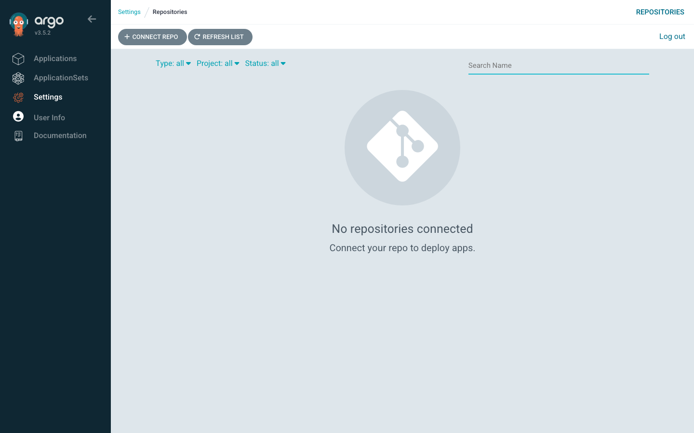

# Lab 2 · Module 1 — Environment and the Address Book

> **Day 1 · Lab 2 · Module 1 of 4 · ~10 minutes**
> **Goal:** confirm the healthy starting state, see that Argo CD's knowledge of repos and clusters is just labeled Secrets, and study the two templates you will fill in.

> **🗺️ Where this module fits.** Nothing gets built in this module. You look around first: what Argo CD knows right now, and the two blank forms you will fill in during Module 2. Think of it as reading the whole recipe before you start cooking.

---

## 1. Environment check — confirm `CP-lab-02`

> **🧭 What this step is for**
> - **In plain words:** before you build anything, you check that your starting point is exactly what this guide expects. `--verify-only` only *looks*; it changes nothing.
> - **Think of it like:** a pilot's pre-flight checklist. If something goes wrong later, you will know it was a step you took, not something that was already broken.
> - **What "expected" means here:** Argo CD knows about **one** cluster (its own, called `in-cluster`) and **zero** private repositories. Adding the rest is this lab's job.

**▶ Do this now — load the environment and verify (changes nothing).**

```bash
source ~/argo-lab-env.sh
reset-lab.sh CP-lab-02 --verify-only --local
```

**Expected output:**

```text
==> Verification for CP-lab-02
  PASS  Application hello-reconcile Synced/Healthy
  PASS  Application team-a-guestbook absent
  PASS  AppProject team-a absent
  PASS  Secret in-cluster present
  PASS  Repository and cluster Secrets are exactly: in-cluster
  PASS  workload namespace storefront-prod present
  PASS  workload SA argocd-manager absent (not registered)

PASS CP-lab-02 is in the expected state.
```

**🔍 How to read these rows, one at a time:**

- `hello-reconcile Synced/Healthy` — your Lab 1 app is still there and still fine.
- `team-a-guestbook absent` / `AppProject team-a absent` — nothing from Day 2 is present yet.
- `Repository and cluster Secrets are exactly: in-cluster` — Argo CD knows about **one** cluster (its own) and **no** repositories. This is the "empty" you will see in the web interface next.
- `workload namespace storefront-prod present` — the workload cluster is running and the platform team already created its namespaces for you. (A *namespace* is a named folder inside a cluster that keeps one team's or one app's objects apart from the rest.)
- `workload SA argocd-manager absent` — the workload cluster has **no** login for Argo CD yet. You create that login in E2.

Skeleton files with `TODO` markers are also waiting in the `platform-config` repository (section 3).

> **If any row says `FAIL`:** run `reset-lab.sh CP-lab-02 --local` (no `--verify-only`) to rebuild. It discards in-progress work and asks you to type the checkpoint name to confirm.

---

## 2. Look at "empty" in the web interface

> **🧭 What this step is for**
> - **In plain words:** you are taking a "before" photo. Later, when a repository appears on this page, you will know *you* made it appear.
> - **Connects to:** [Session 3 · Module 2](../session-03/02-onboarding-repos-and-clusters.md) said "connecting a repo" is really creating a labeled Secret. This page is Argo CD reading those Secrets and drawing them as a list. No Secret, no row.

**▶ Do this now:** in Argo CD, click **Settings** (the gear icon in the left sidebar), then **Repositories**.



*Figure SS-L2-01 — Settings → Repositories at `CP-lab-02`: "No repositories connected".*

**🔍 Notice:** the page says **No repositories connected**. There is no `storefront-gitops` row yet. In E1 you will make that row appear, with a green **Successful** connection status.

> **Already seeing a `storefront-gitops` row, or a `http://lab-gitea:3000/course/` row under "Credentials template URL"?** Then your environment still holds objects from a later lab, and section 1 would have shown a `FAIL` row. Run `reset-lab.sh CP-lab-02 --local`, then refresh this page. This lab only makes sense if you start empty.

<!-- CAPTURE-SPEC: SS-L2-01 — Argo CD Settings → Repositories, environment check. State: CP-lab-02, route /settings/repos. Highlight: "No repositories connected" empty state. Fidelity: full page. Argo CD v3.5.2. -->

---

## 3. Clone the platform repository you will edit

> **🧭 What this step is for**
> - **In plain words:** this course uses **two** Git repositories. `storefront-gitops` describes the *app* (its Helm chart and settings). `platform-config` describes *Argo CD's own setup* (repository and cluster templates, projects, applications). In this lab you edit `platform-config`.
> - **Refresher:** `git clone` copies a repository from the Gitea server onto your VM so you can edit it. Your changes only reach the server when you `git commit` and `git push`.
> - **Why it matters later:** in Lab 3 you will need to know *which* of the two repos holds a fix. Start noticing now.

**▶ Do this now:**

```bash
cd ~
git clone http://lab-gitea:3000/course/platform-config.git
cd platform-config
git config user.email "student@lab.local"
git config user.name "Student"
```

> **If `git clone` says `fatal: destination path 'platform-config' already exists`:** you cloned it on an earlier attempt, so you already have the folder. Run `cd ~/platform-config` and the two `git config` lines. If you ran `reset-lab.sh` since then, the reset has already put that copy back to the starting files.

It holds the templates and skeletons you will fill in (other files omitted):

```text
platform-config/
  repositories/storefront-gitops.secret.template.yaml   # E1: repository Secret template
  clusters/workload.secret.template.yaml                # E2: cluster Secret template
  projects/storefront.yaml                              # E4: AppProject skeleton (TODOs)
  applications/storefront-dev.yaml                      # E4: Application skeleton (TODOs)
```

Two more files live on the VM (not in Git, because they touch credentials): `~/course/credentials/gitea-student.txt` (the Gitea password) and `~/course/lab-files/lab-02/workload-rbac.yaml` (the least-privilege RBAC for E2).

---

## 4. The two-command address book

> **🧭 What this step is for**
> - **In plain words:** Argo CD does not keep its list of repositories and clusters in a hidden database. It keeps them as ordinary Kubernetes Secrets, each with a **label** saying what kind of entry it is. These two commands list them.
> - **Think of it like:** a delivery driver's address book. Each card (Secret) is tagged "repository" or "cluster", and Argo CD reads the cards with the right tag. Right now the book holds one card: the driver's own depot (`in-cluster`).
> - **Connects to:** [Session 3 · Module 2](../session-03/02-onboarding-repos-and-clusters.md), section 2 — "Everything Argo CD knows is a labeled Secret."
> - **Why it matters later:** when a cluster connection breaks in the Capstone, the problem is often one wrong value on one of these cards.

Argo CD's entire knowledge of your repos and clusters is a set of labeled Secrets in the `argocd` namespace. Print the whole "address book" with two commands — **before** you have connected anything.

**▶ Do this now:**

```bash
kubectl --context k3d-mgmt -n argocd get secret -l argocd.argoproj.io/secret-type=repository
kubectl --context k3d-mgmt -n argocd get secret -l argocd.argoproj.io/secret-type=cluster
```

**Expected now** *(representative — your `AGE` differs):*

```text
# repository Secrets:
No resources found in argocd namespace.

# cluster Secrets:
NAME         TYPE     DATA   AGE
in-cluster   Opaque   3      2d
```

**🔍 Notice:** no repository Secrets yet (matching the empty page), and **one** cluster Secret — the management cluster (`in-cluster`). By the end of E2 the second command returns **two** rows. That before/after *is* the reveal: "registering a cluster" was always creating a labeled Secret.

> **Never print a Secret's decoded contents in this course.** These commands show a Secret's *existence and labels*, never its values.

---

## 5. Study the two templates you will fill in

> **🧭 What this step is for**
> - **In plain words:** a *template* here is a Secret with blanks in it (`<PASSWORD>`, `<TOKEN>`, `<CA_DATA>`). The shape is safe to keep in Git. The real values are filled in only at the moment you apply it to the cluster.
> - **Think of it like:** a paper form. You can photocopy and share the blank form. Once you write your password on it, you hand it straight to the clerk and never file a copy.
> - **Connects to:** Session 3's rule **"commit the pointer, never the payload"** — the *pointer* (the shape, the names) goes in Git; the *payload* (the password or token) never does.

**▶ Do this now — read the repository template:**

```bash
cat ~/platform-config/repositories/storefront-gitops.secret.template.yaml
```

**What you see.** The file starts with a few `#` comment lines, left out below. The `# <--` notes on the right are added by this guide; they are not in the file.

```yaml
# ... (comment header)
apiVersion: v1
kind: Secret
metadata:
  name: repo-storefront-gitops
  namespace: argocd
  labels:
    argocd.argoproj.io/secret-type: repository   # <-- this label makes it a repository connection
type: Opaque
stringData:
  type: git
  url: http://lab-gitea:3000/course/storefront-gitops.git   # <-- in-network Gitea address
  username: student
  password: <PASSWORD>                            # <-- the ONLY placeholder; injected in E1
```

**▶ Do this now — read the cluster template:**

```bash
cat ~/platform-config/clusters/workload.secret.template.yaml
```

**What you see** (comment header left out again; `# <--` notes added by this guide):

```yaml
# ... (comment header)
apiVersion: v1
kind: Secret
metadata:
  name: cluster-workload
  namespace: argocd
  labels:
    argocd.argoproj.io/secret-type: cluster       # <-- this label makes it a cluster registration
    cluster-role: workload
    region: lab
type: Opaque
stringData:
  name: workload
  server: https://k3d-workload-server-0:6443      # <-- in-network name, NOT localhost
  # namespaces + clusterResources:false scope Argo CD to only these namespaces
  # and forbid cluster-scoped writes (least privilege).
  namespaces: storefront-dev,storefront-staging,storefront-prod,team-a,platform-system
  clusterResources: "false"                        # <-- forbid cluster-scoped WRITES
  config: |
    {
      "bearerToken": "<TOKEN>",
      "tlsClientConfig": {
        "insecure": false,
        "caData": "<CA_DATA>"
      }
    }
```

**Two blanks in the cluster template, in plain words:**

- `<TOKEN>` — a **bearer token**: a long secret string that works like a password. Whoever holds ("bears") it is treated as a specific identity on the workload cluster.
- `<CA_DATA>` — **CA (Certificate Authority) data**: the certificate Argo CD uses to check it is talking to the *real* workload cluster, not an impostor.

**🔍 The single most important line** is `server: https://k3d-workload-server-0:6443`. Your kubeconfig reaches the workload cluster over a `localhost` port, but Argo CD's controller Pod cannot use `localhost` to mean the workload cluster — inside that Pod, `localhost` means the Pod itself. `k3d-workload-server-0` is a name every Pod on the shared network can resolve. The `namespaces` + `clusterResources: "false"` fields are the least-privilege scope.

> **💡 Analogy for the `localhost` rule:** telling a taxi driver "take me home" gets you to *the driver's* home, not yours. `localhost` always means "the machine I am running on", so an address written on your laptop can point somewhere else entirely when a Pod reads it.

---

## ✅ Key takeaways from this module

- **You start from a known state:** Argo CD knows one cluster (`in-cluster`), no private repositories, and the workload cluster has no Argo CD login yet.
- **Argo CD's list of repositories and clusters is just labeled Secrets** in the `argocd` namespace — its address book. The label decides what each Secret is.
- **The templates in Git hold the shape; passwords and tokens are filled in only when you apply.** Commit the pointer, never the payload.
- **An address only works from the place that uses it.** Argo CD's controller Pod reaches the workload cluster as `k3d-workload-server-0:6443`, not `localhost`.

**→ Next:** [02 — Connect the repo, register the cluster](02-connect-repo-and-register-cluster.md)
