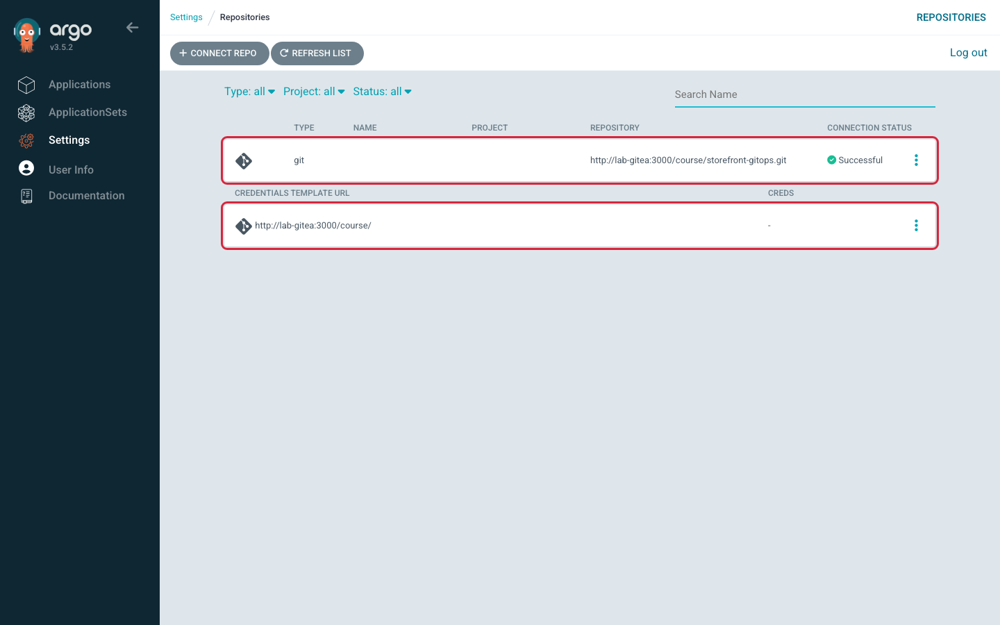
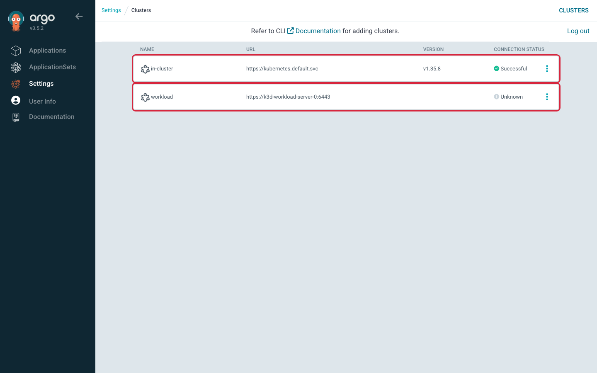
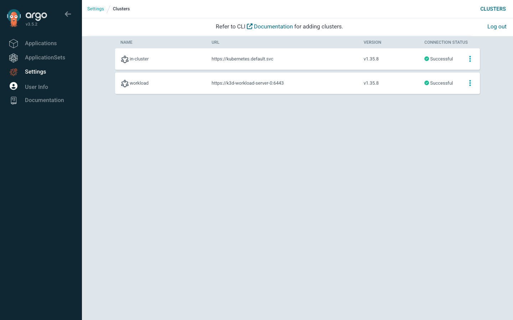

# Lab 2 · Module 2 — Connect the Repo, Register the Cluster

> **Day 1 · Lab 2 · Module 2 of 4 · ~35–45 minutes including setup and discussion**
> **Goal:** give Argo CD access to the private storefront Git repository (**E1**) and permission to deploy into selected namespaces on the workload cluster (**E2**), while keeping real credentials out of Git and terminal output.

> **How this exercise works:** you make the Argo CD configuration decisions. Supplied Python code loads credentials and submits the completed Secrets. Your tasks are to complete the repository configuration, choose the correct clusters, create the workload identity, and verify the results. Memorizing credential-handling syntax is not the goal.

## Start here — what are we setting up?

Argo CD already runs on the **management cluster**. Before it can deploy storefront, it needs answers to two questions:

| Question | What this module gives Argo CD | Exercise |
| --- | --- | --- |
| Where can I read the deployment files, and how do I log in? | The private Git repository URL, username, and password | E1 |
| Which cluster can I deploy to, and what am I allowed to change? | The workload cluster address, an authentication token, certificate information, and a limited management scope | E2 |

**You are configuring access. You are not deploying storefront yet.** In the next module, you test permissions and create an Application that selects the repository path and deployment destination.

### Who fills in the Secrets?

**The supplied helper fills in credentials after you complete the connection settings. Kubernetes stores the completed Secrets. Argo CD reads them.** Argo CD does not discover the password or replace `<TOKEN>` for you.

A template is a blank form kept in Git. A completed Secret contains the real connection data and is submitted to Kubernetes. The label tells Argo CD whether to treat that Secret as a repository connection or a cluster connection.

### Where does everything live?

| Item | Location | Purpose |
| --- | --- | --- |
| Blank Secret templates | `platform-config` repository and your local clone | Reusable configuration with placeholders |
| Storefront deployment files | `storefront-gitops` repository | Describe the application to deploy later |
| Repository Secret | Management cluster → `argocd` | Holds the repository connection and credentials |
| ServiceAccount, token Secret, Roles, and RoleBindings | Workload cluster | Establish the identity and permissions Argo CD will use |
| Cluster connection Secret | Management cluster → `argocd` | Holds credentials **for the workload cluster** |

**Two different Secrets participate in E2:** the workload cluster's token Secret supplies a credential; the management cluster's connection Secret stores a copy for Argo CD to use. They have different names, locations, and purposes.

### Before you begin

Continue in the terminal environment prepared for the course, where the Module 1 files and both Kubernetes contexts are available. If using your Mac, those paths and contexts must exist on your Mac; a file on the course VM is not automatically on your Mac.

A **context** is a named connection configuration used by `kubectl`. These read-only commands show the available contexts and check for the lab's ServiceAccount:

```bash
kubectl config get-contexts
kubectl --context k3d-workload -n argocd-access get serviceaccount argocd-manager
```

Both `k3d-mgmt` and `k3d-workload` should be available. Before E2, a `NotFound` response for the ServiceAccount is expected. A connection or authentication error is different: resolve the environment connection before proceeding.

You also need Python 3, `kubectl`, the Module 1 clone of `platform-config`, the provided credentials and RBAC files, and access to the Argo CD UI. The `argocd` commands below require an authenticated CLI session; use the corresponding UI checks if the CLI is not logged in.

**Credential-file assumption:** `~/course/credentials/gitea-student.txt` must contain only the Gitea password on one line, optionally followed by a newline. A file containing `password=...`, a username/password pair, or explanatory text is not this format. Confirm the format from your environment setup; do not print the file to inspect its password.

**One-time setup:** run the supplied setup block in [Appendix A](#appendix-a--supplied-credential-helper), then return here. It creates a helper script containing no credentials. It uses Python's standard library and `kubectl`; no Python packages or `envsubst` are required.

**Keep using the same terminal session** so your selected context variables remain available. If you open a new terminal, set them again.

**Before every command, ask:** am I changing Argo CD's connection settings on management, or creating its identity and permissions on workload?

### What will count as finished?

- E1: the private repository is listed with **Successful** connection status.
- E2: the workload cluster is listed with the correct address and five namespaces. **Unknown** with “Cluster has no applications and is not being monitored” is expected at this stage.
- Real passwords and tokens have not been printed, committed, or saved in an extra completed YAML file.


---

## E1 — Connect the private repository

**Difficulty:** Core · **Time:** ~12–15 minutes · **Objective:** L2.1

### Why are we doing E1?

The `storefront-gitops` repository is private. Being able to clone it yourself does not give Argo CD access: Argo CD is a separate program with its own credentials.

You will describe the repository connection as a Kubernetes Secret and give it to Argo CD. This teaches you how to configure a connection repeatably, keep the password out of Git, and distinguish **“Kubernetes stored the configuration”** from **“Argo CD successfully accessed the repository.”**

**Connects to:** [Session 3 · Module 2](../session-03/02-onboarding-repos-and-clusters.md) — labeled Secrets and “commit the pointer, never the payload.”

### What you decide, and what the helper does

| You do | The supplied helper does |
| --- | --- |
| Select the namespace, repository label, and URL | Read the password from the credential file |
| Choose which cluster receives the Secret | Insert the password into the completed configuration in memory |
| Explain and verify the result | Submit the Secret with server-side apply, without printing credential values |

The helper does not correct your URL, label, or namespace, and it does not choose the destination cluster. You must check them.

### Step 1 — complete the repository template

Module 1's repository template was already filled in except for the password. **For this exercise, replace its contents with the skeleton below**, then complete the three `TODO` fields in your editor. This change affects only the local template; it does not connect anything yet.

Open the file with your preferred editor, for example:

```bash
nano ~/platform-config/repositories/storefront-gitops.secret.template.yaml
```

Use this skeleton:

```yaml
apiVersion: v1
kind: Secret
metadata:
  name: repo-storefront-gitops
  namespace: TODO
  labels:
    argocd.argoproj.io/secret-type: TODO
type: Opaque
stringData:
  type: git
  url: TODO
  username: student
  password: <PASSWORD>
```

**Your task:** replace all three `TODO` values using these environment facts:

- Argo CD runs in the `argocd` namespace on the management cluster.
- Argo CD recognizes connection labels with the values `repository`, `repo-creds`, and `cluster`. This exercise registers one repository.
- The application deployment repository is `http://lab-gitea:3000/course/storefront-gitops.git`.
- `platform-config` contains platform configuration; it is not the application source repository being connected in E1.

**Keep `<PASSWORD>` unchanged.** Do not enter the real password. Keep `name`, `type`, and `username` as shown. Save the file before proceeding.

**Explain your choices:** which field identifies the repository's address, and which field tells Argo CD what kind of Secret this is?

### Step 2 — choose where to store the connection

Choose `k3d-mgmt` or `k3d-workload`. Replace `TODO_CONTEXT` below with your choice, keeping the quotes:

```bash
LAB_REPO_CONTEXT='TODO_CONTEXT'
```

Before applying anything, answer: **which cluster contains the Argo CD instance that needs to read this connection?**

### Step 3 — run the supplied credential helper

**Predict-before-you-verify:** if Kubernetes accepts the Secret, does that guarantee the repository password and URL work? Will Argo CD necessarily show a new status immediately?

After completing Steps 1 and 2, run:

```bash
python3 ~/course/lab-files/lab-02/module2-connection-helper.py repo \
  --context "$LAB_REPO_CONTEXT"
```

The helper:

1. Checks that no `TODO` values remain and that `<PASSWORD>` is still a placeholder.
2. Uses `kubectl` client dry-run to parse your YAML without storing it.
3. Reads the password from its file and inserts it in memory.
4. Encodes Secret values into Kubernetes' `data` format and submits JSON, which Kubernetes accepts as a manifest.
5. Uses `apply --server-side` to avoid creating a client-side last-applied annotation.

**Expected helper message:**

```text
Secret applied. Now verify its location and connection status.
```

This means Kubernetes accepted the object. It does **not** yet prove that Argo CD can access Git.

No completed local manifest is created. The original credential file and the Kubernetes Secret still contain the password; the exercise avoids extra copies and terminal output. Base64 encoding is not encryption.

### Step 4 — verify storage, then verify access

First check the expected management-cluster location. This prints only the Secret summary:

```bash
kubectl --context k3d-mgmt -n argocd get secret repo-storefront-gitops
```

Then ask Argo CD to perform a fresh repository connection check:

```bash
argocd repo list --refresh hard
```

In the UI, open **Settings → Repositories** and refresh the list. Find the row for the `storefront-gitops.git` URL. Its connection status should be **Successful**. The display may emphasize the URL rather than a separate repository name.

**Answer to the prediction:** accepting a Secret is not a Git login test. Argo CD checks the connection separately, and its displayed status can take time to update or reflect a cached result.

### Step 5 — confirm the credential was not duplicated in an annotation

Print only annotation names, not their values:

```bash
kubectl --context k3d-mgmt -n argocd get secret repo-storefront-gitops \
  -o go-template='{{range $k, $v := .metadata.annotations}}{{$k}}{{"\n"}}{{end}}'
```

For a new Secret created by this helper, no annotation names are expected. Specifically, `kubectl.kubernetes.io/last-applied-configuration` must be absent. Other annotation names do not by themselves indicate a credential copy. Server-side apply does not remove an annotation left by a previous client-side apply; an unexpected old annotation means your starting state differs from the clean exercise.

### Hints — use only if stuck

- **Namespace:** use the namespace where Argo CD reads its connection Secrets.
- **Label:** `repository` registers one repository; `repo-creds` describes reusable credential templates.
- **URL:** connect `storefront-gitops`, not `platform-config`. Keep the lab's internal hostname.
- **Destination:** the Secret belongs with Argo CD, even though it describes a remote repository.
- **Verification:** a missing Secret is a different problem from a present Secret whose connection fails.

### Success criterion

- The Secret exists on management in `argocd`.
- Argo CD reports **Successful** for the storefront repository.
- The local template still contains `<PASSWORD>` and no real credential.
- You can explain what the Kubernetes check proves and what the Argo CD check proves.



*Figure SS-L2-02 — After E1: `storefront-gitops` shows a green **Successful** connection status. It is the only row: no credentials template exists yet.*

<!-- CAPTURE-SPEC: SS-L2-02 — Settings → Repositories after E1. State: repo-storefront-gitops applied, route /settings/repos. Highlight: storefront-gitops row with green Successful status. Fidelity: full page. Argo CD v3.5.2. -->

> **What "Successful" actually means (keep this for the Capstone).** A green status is a *measurement from the last check*, not a permanent guarantee — "the last check reached the repository." Argo CD can cache repository connection results, so the Repositories page can show an old reading; the duration depends on configuration. To make it check again, click **Refresh list** on that page, or run `argocd repo list --refresh hard`. A credential that expires next month shows green today and fails the morning it matters. Treat the displayed connection result as the outcome of a check, not a permanent promise.

### ✅ What you should take away from E1

- Connecting a repository is **one labeled Secret**. The row on the Repositories page appeared because that Secret now exists.
- The helper read the password from a file, held it in memory, and sent the completed manifest to Kubernetes through standard input. It was not printed, committed to Git, saved in an extra local manifest, or copied into a client-side apply annotation. The original credential file and the Kubernetes Secret still contain the credential.
- Compare the page with your Module 1 "before" photo: the empty page now has a row — and you made it.

---

## E2 — Register the workload cluster with least privilege

**Difficulty:** Advanced · **Time:** ~18–22 minutes · **Objective:** L2.2

> **🧭 What this exercise is for**
> - **In plain words:** you create an identity for Argo CD on the **workload** cluster. Its Roles permit selected changes in five namespaces; they do not grant every possible operation in those namespaces. Then you give Argo CD that login's token by writing a **cluster Secret** on the **management** cluster.
> - **Think of it like:** a hotel key card. The card (token) is made at the hotel (the workload cluster) and opens only certain rooms (namespaces). The guest (Argo CD, living on the management cluster) just carries the card in its wallet (the cluster Secret).
> - **Connects to:** [Session 3 · Module 2](../session-03/02-onboarding-repos-and-clusters.md) — the cluster-registration trust chain; and [Session 3 · Module 3](../session-03/03-least-privilege-and-change-detection.md) — least *write* privilege.
> - **Big picture:** real platforms run Argo CD in one place and deploy to many other clusters. If the key card opened every room, one bad commit could damage the whole workload cluster. Limiting the card limits the damage.

**Words you will meet in this exercise:**

- **ServiceAccount** — a Kubernetes login for a *program* rather than a person. Argo CD will use one called `argocd-manager`.
- **RBAC (Role-Based Access Control)** — Kubernetes' permission system. A **Role** lists allowed actions inside one namespace. A **RoleBinding** gives that Role to an identity, in that namespace only. A **ClusterRoleBinding** would grant permissions across the *whole* cluster — this lab creates none that allow writing.
- **base64** — a way of writing any data as plain text characters. It is *encoding*, not encryption: anyone can decode it.

**Goal:** give Argo CD a scoped identity on the workload cluster, then register the cluster by writing a cluster Secret that carries that identity's token and CA. When you finish, Argo CD lists the workload cluster, scoped to only its allowed namespaces. (Its status will say **Unknown** for now — "Shape of a correct result" explains why.)

**The identity lives on the cluster being *managed*.** When you register a workload cluster, the **ServiceAccount Argo CD authenticates as is created on the workload cluster** — not the management cluster. The management side only stores a *credential for* it (the cluster Secret). The file `~/course/lab-files/lab-02/workload-rbac.yaml` builds that identity **on the workload cluster**: a ServiceAccount `argocd-manager` in namespace `argocd-access`, a token Secret, a `Role argocd-deployer` + RoleBinding in each app namespace, a reduced `argocd-deployer-team` Role in `team-a` (same set *minus* NetworkPolicy/ResourceQuota/LimitRange), and **no** ClusterRoleBinding with write access anywhere.

### Understand the identity before creating it

There are three separate questions:

| Question | Kubernetes mechanism | Meaning in this exercise |
| --- | --- | --- |
| Who is making the request? | ServiceAccount and bearer token | Argo CD authenticates as `argocd-manager` from `argocd-access` |
| What may that identity do? | Roles and RoleBindings | The workload API server enforces allowed actions in each namespace |
| How does Argo CD find and trust the server? | `server` and CA data in its connection Secret | Argo CD gets a reachable address and verifies the server certificate |

A ServiceAccount alone does not grant deployment permissions. A token proves identity; it does not grant extra rights. RoleBindings associate that identity with the permissions defined by Roles.

The ServiceAccount lives in `argocd-access`, but RoleBindings in the five application namespaces can give it access there. Its home namespace does not have to be the namespace where it deploys.

The five target namespaces are `storefront-dev`, `storefront-staging`, `storefront-prod`, `team-a`, and `platform-system`. The provided RBAC file defines the precise allowed resources and actions. Inspect its Roles if you need to know whether a particular action is permitted.

**This exercise has three moves.**

> **Predict-before-you-apply.** The RBAC file creates a ServiceAccount, token Secret, Roles, and RoleBindings. **Which cluster should receive them — `k3d-mgmt` or `k3d-workload`?** Write your answer before Move A.

### Move A — create the identity and permissions on the workload cluster

**Your task:** select the context using your prediction. Replace `TODO_CONTEXT`, then run both commands:

```bash
LAB_IDENTITY_CONTEXT='TODO_CONTEXT'
kubectl --context "$LAB_IDENTITY_CONTEXT" apply \
  -f ~/course/lab-files/lab-02/workload-rbac.yaml
```

This applies the provided identity and permission definitions. The token Secret starts without a token value; Kubernetes populates it afterward. You are applying the supplied RBAC manifest, not writing or broadening its permissions.

**Why workload?** The workload API server must recognize the identity and enforce its permissions. Creating these objects only on management would not establish that identity on workload.

**Read-only check after applying your command:**

```bash
kubectl --context k3d-workload -n argocd-access get serviceaccount argocd-manager
kubectl --context k3d-workload -n storefront-dev get roles,rolebindings
```

The first command should find the ServiceAccount. The second should show the resources from the RBAC manifest. These checks establish that the objects exist; the next module tests what the identity can actually do.

### Move B — read the credential from the workload cluster

**Your task:** identify the source of the credential. The Secret `argocd-manager-token` (namespace `argocd-access`) holds two fields the helper needs:

- the **bearer token** = the *decoded* value of the Secret's `token` field.
- the **CA data** = the Secret's `ca.crt` field used **as-is** (already base64-encoded, which is what `caData` expects).

**The supplied helper will read both values into memory in Move C. Do not extract or display them manually.** The token is a secret credential; the CA certificate is public trust information, not a password.

| Source field in the workload Secret | Transformation | Destination in the connection Secret's JSON `config` |
| --- | --- | --- |
| `.data.token` | Decode base64 once | `bearerToken` |
| `.data.ca.crt` | Keep its existing base64 representation | `tlsClientConfig.caData` |

The two fields are handled differently because their destination fields expect different formats. Base64 decoding does not decrypt anything.

**Checkpoint:** which cluster holds this source Secret? The helper's `--source-context` must refer to that cluster. It retrieves the Secret as JSON, so you do not need to write JSONPath expressions or base64 shell commands.

### Move C — store the connection on the management cluster

**Your task:** inspect the existing cluster template, select the destination context, and run the supplied helper. Unlike E1, this template retains the prefilled connection settings from Module 1; your tasks here are to explain the settings and distinguish credential source from connection destination.

Read only the template containing placeholders:

```bash
cat ~/platform-config/clusters/workload.secret.template.yaml
```

Confirm its name is `cluster-workload`, its namespace is `argocd`, its connection label is `cluster`, and it retains `<TOKEN>` and `<CA_DATA>` inside its JSON `config` field. Do not replace these with real values.

Set the destination context after deciding where Argo CD reads connection Secrets:

```bash
LAB_CONNECTION_CONTEXT='TODO_CONTEXT'
```

Replace `TODO_CONTEXT` with your choice before continuing. The following command performs Move B's credential collection and Move C's submission together:

```bash
python3 ~/course/lab-files/lab-02/module2-connection-helper.py cluster \
  --source-context "$LAB_IDENTITY_CONTEXT" \
  --context "$LAB_CONNECTION_CONTEXT"
```

The helper waits briefly for a nonempty token and CA, decodes the token once, keeps the CA's existing base64 format, and fills the configuration in memory. It uses server-side apply and reports only whether the Secret was applied. If the source Secret is missing, it stops; complete Move A before retrying.

**Why management now?** Argo CD runs there and reads connection Secrets from its `argocd` namespace. You are giving it a copy of the workload credential, not creating a second workload identity.

The finished connection Secret has this meaning:

| Field | Question it answers |
| --- | --- |
| Label `argocd.argoproj.io/secret-type: cluster` | How should Argo CD interpret this Secret? |
| `name: workload` | What is the display name of the destination? |
| `server` | Which Kubernetes API endpoint should Argo CD contact? |
| `bearerToken` inside `config` | Which credential should it present? |
| `tlsClientConfig.caData` inside `config` | Which certificate authority should it trust? |
| `namespaces` | Which namespaces should Argo CD manage? |
| `clusterResources: "false"` | With the namespace list set, should it manage cluster-scoped resources? No. |

**The address must work from Argo CD's Pod.** Keep `https://k3d-workload-server-0:6443`. Your local kubeconfig—the file `kubectl` uses for cluster addresses and credentials—may use a localhost port forwarded by Docker. Inside Argo CD's Pod, localhost refers to that Pod, so copying your local address would point at the wrong place. The lab's internal network and DNS must make the server name reachable from Argo CD.

**Management scope and enforced permissions are different.** The Secret tells Argo CD which resources to manage. The workload cluster's RBAC rules enforce what the token holder may actually do. Setting `clusterResources: "false"` does not itself revoke any permissions from a token. [Argo CD cluster configuration](https://argo-cd.readthedocs.io/en/stable/operator-manual/declarative-setup/#clusters)

**Shape of a correct result:** a cluster Secret `cluster-workload` exists in `argocd` on the management cluster. Settings → Clusters lists a `workload` row at `https://k3d-workload-server-0:6443`. Clicking that row opens its detail page, which lists the five scoped namespaces and the `cluster-role`/`region` labels.

> **Why the status says `Unknown`, not `Successful` (this is expected).** In this lab, the application controller does not start monitoring workload resources until an Application targets the cluster. No Application uses `workload` yet, so registration alone has not established that deployment access works. In `argocd cluster list`, the STATUS column may briefly stay blank before the row reads **Unknown**, with the message *"Cluster has no applications and is not being monitored."* That is not a failure — nobody has checked yet. In E4 you create the first Application for this cluster. With working networking, credentials, and permissions, monitoring should then report **Successful**. Allow time for reconciliation; investigate an error rather than assuming registration already proved connectivity.

**Hints (use only if stuck):**

- *Hint 1:* Re-run the cluster "address book" command from Module 1 after Move C — it should now return **two** rows.
- *Hint 2:* The token Secret may take a few seconds to populate after Move A. If the helper reports an empty token, wait briefly and rerun it.
- *Hint 3:* The helper handles decoding. Your job is to explain why the token is decoded but CA data is retained as-is.
- *Hint 4:* Keep the credential placeholders in the template. The helper submits the real values without saving a completed local manifest.
- *Hint 5:* The `Unknown` status cannot tell you yet whether your `server:` line is right, so check it by eye now: it must be `https://k3d-workload-server-0:6443`, not any `localhost` address. A wrong address may surface in E4 when the application controller starts using this destination.

**Verify the stored connection without displaying credentials:**

```bash
kubectl --context k3d-mgmt -n argocd get secret \
  -l argocd.argoproj.io/secret-type=cluster
argocd cluster list
```

From the clean Module 1 state, the Secret list now contains `in-cluster` and `cluster-workload`. The explicitly stored `in-cluster` Secret is part of this lab's setup; not every Argo CD installation needs such a Secret for its local cluster.

**Success criterion:** Settings → Clusters shows a `workload` row at server `https://k3d-workload-server-0:6443` with status **Unknown** (SS-L2-03); its detail page shows the five scoped namespaces and the labels (SS-L2-04); and the Module 1 cluster "address book" command returns two rows.



*Figure SS-L2-03 — After E2: the `workload` cluster is listed at `https://k3d-workload-server-0:6443`. Its status is **Unknown** because no Application uses it yet.*

<!-- CAPTURE-SPEC: SS-L2-03 — Settings → Clusters after E2, before E4. State: cluster-workload applied, no Application targets it, route /settings/clusters. Highlight: workload row, server URL, Unknown status. Fidelity: full page. Argo CD v3.5.2. -->



*Figure SS-L2-04 — The `workload` cluster's detail page (click its row): the five namespaces, the `cluster-role`/`region` labels, and **Connection state** `Unknown` — "Cluster has no applications and is not being monitored."*

<!-- CAPTURE-SPEC: SS-L2-04 — Cluster detail page. State: after E2, before E4; click the workload row on /settings/clusters. Highlight: GENERAL (namespaces, labels) and CONNECTION STATE boxes. Fidelity: full page. Argo CD v3.5.2. -->

### ✅ What you should take away from E2

- **Two clusters, two jobs.** The identity (`argocd-manager`) was created on the **workload** cluster. The management cluster only stores a *copy of its token* in the cluster Secret.
- **Registering a cluster is one more labeled Secret** — the address book now has two cluster cards.
- **The cluster Secret carries three things:** where to go (`server`), who to be (the token), and how to recognise the real cluster (the CA data).
- **The limits are written in two places.** The workload Roles and RoleBindings enforce allowed actions and namespace access. The cluster Secret configures Argo CD’s management scope. Module 3’s E3 tests the enforced permissions.
- **`Unknown` with the no-applications message is expected here.** In this lab, monitoring starts when an Application targets the cluster; registration by itself is not a connectivity test.

---

## If your result is different

| What you see | What it means or what to check |
| --- | --- |
| `kubectl` cannot connect before applying anything | Check the chosen context and whether that lab cluster is running. |
| Helper reports incomplete TODO values | Complete the template and context selections before running again. |
| Helper reports a Kubernetes operation failure | Raw errors are withheld to avoid exposing credentials. Use the read-only existence checks in this lab, confirm the selected context, and inspect only the placeholder template. |
| No repository row after E1 | Check that `repo-storefront-gitops` exists on management in `argocd` and has the repository label. |
| Repository row exists but connection fails | Registration succeeded, but access did not. Check the template URL and credential-loading process without printing the password. Request a fresh connection check. |
| Helper reports an empty token or CA | Kubernetes may still be populating the token Secret. Check Move A and retry; the helper will not submit empty values. |
| No workload row after E2 | Check the cluster Secret's destination namespace, context, and cluster label. |
| Workload is `Unknown` with the no-applications message | Expected here. Continue to the next module; this does not prove the address or token works. |
| A later Application reports connection refused or DNS failure | Check the internal server address and lab networking. A localhost address in the connection Secret is incorrect here. |
| A later request reports `Unauthorized` | Check that a valid, decoded bearer token was supplied. |
| A later request reports `Forbidden` | Check the identity's Roles and RoleBindings for the requested resource, action, and namespace. |

To request a fresh repository connection check:

```bash
argocd repo list --refresh hard
```

This refreshes the cached connection status; it does not deploy an application. [Argo CD command reference](https://argo-cd.readthedocs.io/en/stable/user-guide/commands/argocd_repo_list/)

## Explain what you built

Before moving on, answer these in your own words:

1. Which configuration values did you choose, and which values did the helper supply?
2. Why is the repository Secret stored on management?
3. Why is the ServiceAccount created on workload?
4. Why does the cluster Secret contain a copy of the workload token?
5. Does seeing the workload row prove deployment permissions work?
6. What still needs to be created before Argo CD knows which application files to deploy?

**Check your understanding:** you selected the namespace, label, URL, and contexts; the helper supplied credentials; Argo CD reads connections on management; workload recognizes and authorizes its own ServiceAccount; the copied token lets Argo CD authenticate remotely; registration does not prove deployment access; an Application still needs to select the source and destination.

## ✅ Key takeaways from this module

- **Connecting a repository = applying one labeled Secret.** The helper fills in the password at apply time without printing it, committing it, or creating a client-side apply annotation.
- **A green Successful is a reading from the last check**, not a promise that it will stay green. Connection results can be cached — use `argocd repo list --refresh hard` to request a fresh check.
- **The identity Argo CD uses lives on the cluster being managed.** The management cluster only holds the key card, not the room.
- **Registering a cluster = applying one labeled cluster Secret** with the in-network server address, the token, and the CA data. In the expected starting state, its status is `Unknown` because no Application uses it yet.
- **After this module Argo CD holds the keys to read Git and reach the workload cluster** — the two ends of every deployment in the rest of the course.

## Appendix A — supplied credential helper

**Run this setup once before E1.** Copy the entire block, including the final `PY` line. It creates only Python source code, with no real credentials, at the path used by both exercises. Running setup again replaces this exercise's helper script with the same supplied code.

You do not need to write or memorize this code. Its role is to handle credentials while you focus on connection configuration and verification.

```bash
mkdir -p ~/course/lab-files/lab-02
cat > ~/course/lab-files/lab-02/module2-connection-helper.py <<'PY'
import argparse
import base64
import json
from pathlib import Path
import subprocess
import sys
import time


def stop(message):
    raise SystemExit(message)


def kubectl(arguments, payload=None):
    # Capture output: API errors can echo submitted Secret values.
    result = subprocess.run(
        ['kubectl', '--request-timeout=15s', *arguments],
        input=payload, text=True, capture_output=True,
    )
    if result.returncode:
        stop('Kubernetes operation failed. Check the context, access, and template. '
             'Raw output is withheld because it may contain credentials.')
    return result.stdout


def main():
    parser = argparse.ArgumentParser()
    parser.add_argument('mode', choices=['repo', 'cluster'])
    parser.add_argument('--context', required=True)
    parser.add_argument('--source-context')
    args = parser.parse_args()
    if not args.context or 'TODO' in args.context or (args.source_context and 'TODO' in args.source_context):
        stop('Set explicit context values and replace TODO before running.')
    home = Path.home()
    relative = ('repositories/storefront-gitops.secret.template.yaml'
                if args.mode == 'repo' else 'clusters/workload.secret.template.yaml')
    template = home / 'platform-config' / relative
    raw = template.read_text()
    if 'TODO' in raw:
        stop('Complete all TODO entries in the template first.')

    # Let kubectl parse YAML before adding credentials. Client dry-run stores nothing.
    manifest = json.loads(kubectl([
        '--context', args.context, 'create', '--dry-run=client', '--validate=false',
        '-f', str(template), '-o', 'json',
    ]))
    if manifest.get('kind') != 'Secret' or manifest.get('apiVersion') != 'v1':
        stop('The template must describe one v1 Secret.')
    fields = manifest['stringData']
    metadata = manifest['metadata']
    if not metadata.get('namespace') or not metadata.get('name'):
        stop('Set the Secret namespace and name in the template.')

    if args.mode == 'repo':
        if fields.get('password') != '<PASSWORD>':
            stop('Keep the password field as the literal <PASSWORD> placeholder.')
        # File contract: one password, optionally followed by a newline.
        password = (home / 'course/credentials/gitea-student.txt').read_text().rstrip('\r\n')
        if not password or '\n' in password or '\r' in password:
            stop('Credential file must contain one nonempty password line.')
        fields['password'] = password
    else:
        if not args.source_context:
            stop('Cluster mode also requires --source-context.')
        # Wait briefly for Kubernetes to populate the provided token Secret.
        data = {}
        for attempt in range(11):
            token_secret = json.loads(kubectl([
                '--context', args.source_context, '-n', 'argocd-access',
                'get', 'secret', 'argocd-manager-token', '-o', 'json',
            ]))
            data = token_secret.get('data') or {}
            if data.get('token') and data.get('ca.crt'):
                break
            if attempt < 10:
                time.sleep(2)
        if not data.get('token') or not data.get('ca.crt'):
            stop('Token or CA is still empty. Check Move A, then retry.')
        config = json.loads(fields['config'])
        if (config.get('bearerToken') != '<TOKEN>' or
                config.get('tlsClientConfig', {}).get('caData') != '<CA_DATA>'):
            stop('Keep the original <TOKEN> and <CA_DATA> placeholders.')
        config['bearerToken'] = base64.b64decode(data['token'], validate=True).decode()
        config['tlsClientConfig']['caData'] = data['ca.crt']
        fields['config'] = json.dumps(config)

    # Use data for server-side apply; JSON serialization handles special characters.
    manifest['data'] = {
        key: base64.b64encode(value.encode()).decode()
        for key, value in fields.items()
    }
    del manifest['stringData']
    kubectl([
        '--context', args.context, 'apply', '--server-side',
        '--field-manager=lab2-connections', '-f', '-',
    ], json.dumps(manifest))
    print('Secret applied. Now verify its location and connection status.')


if __name__ == '__main__':
    try:
        main()
    except (OSError, ValueError, KeyError, TypeError):
        stop('Helper stopped: check file paths, template structure, and credential format. '
             'No credential values are displayed.')
PY
```

The helper uses `kubectl` to parse the placeholder YAML, then fills credentials using Python objects rather than text substitution. It sends the completed manifest directly through standard input. It uses `data` for server-side apply, as Kubernetes notes that `stringData` does not work well with server-side apply. [Kubernetes Secret guidance](https://kubernetes.io/docs/concepts/configuration/secret/)

Error output from Kubernetes is captured because an API error can include submitted values. An apply failure is reported without those details. This does not make the password invisible to an administrator of the machine or cluster; it avoids unnecessary output and local manifest copies in the exercise.

The cluster helper uses the ServiceAccount token Secret supplied by this lab. Do not replace it with a short-lived token without also arranging renewal; doing so changes the lifecycle expected by later exercises.

Return to **E1, Step 1** after completing setup.

---

**→ Next:** [03 — Prove least privilege, create the app](03-prove-least-privilege-and-create-app.md)
