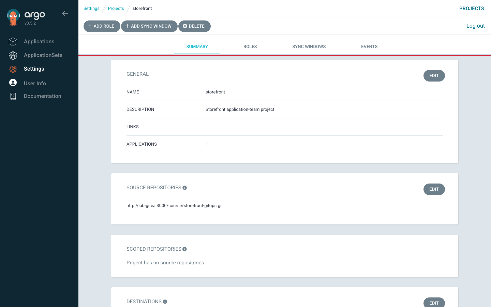
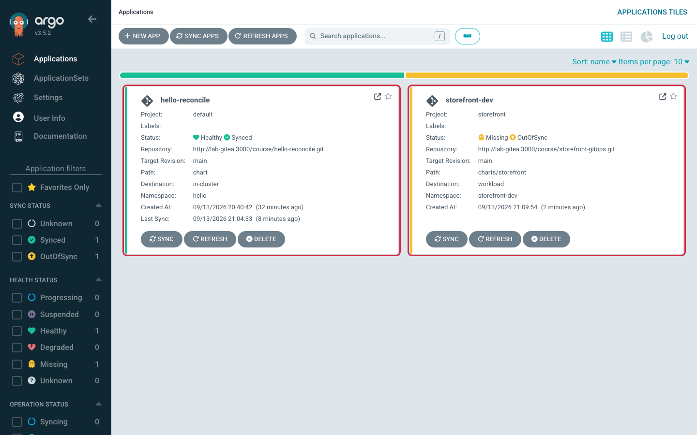
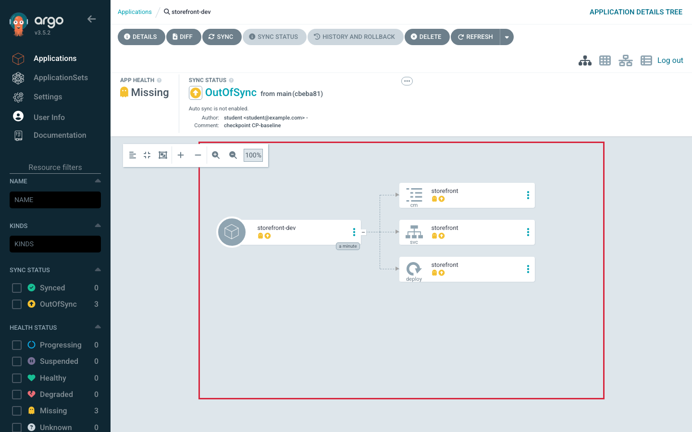
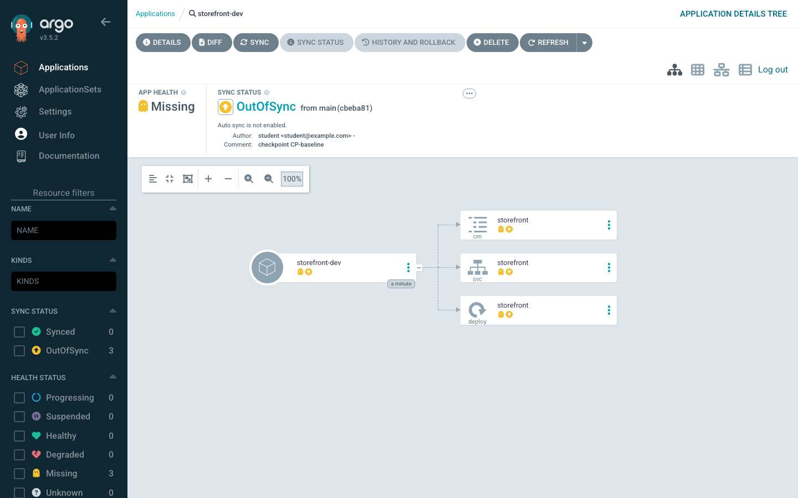

# Lab 2 · Module 3 — Prove Least Privilege, Create the App

> **Day 1 · Lab 2 · Module 3 of 4 · ~20 minutes**
> **Goal:** confirm the identity you built is genuinely restricted (**E3**), then build the governance fence and deployment instruction (**E4**).

> **🗺️ Where this module fits.** Module 2 *built* the connections. This module first *checks* that the workload-cluster login is really limited (E3), then uses everything together for the first time: you write the rules (an AppProject) and one deployment request (an Application), and watch Argo CD read Git and compare it with the workload cluster (E4).

---

## E3 — Predict, then prove least privilege

**Difficulty:** Intermediate · **Time:** ~8 minutes · **Objective:** L2.3

> **🧭 What this exercise is for**
> - **In plain words:** in E2 you *intended* to give `argocd-manager` limited power. Now you *check* it. `kubectl auth can-i` asks Kubernetes "would you allow this identity to do this?" — without actually doing anything.
> - **Think of it like:** trying the hotel key card at each door before you hand it over. You want it to open the rooms you chose, and you want it to **fail** at every other door. A "no" here is good news.
> - **Connects to:** [Session 3 · Module 3](../session-03/03-least-privilege-and-change-detection.md) — "least privilege for Argo CD means least *write* privilege."
> - **Big picture:** a restriction you never tested is only a hope. Lab 5 and the Capstone return to the question this exercise starts: when something is refused, *who* refused it?

**Goal:** confirm the identity is restricted by asking Kubernetes directly: *is `argocd-manager` allowed to do X?* **Predict each answer first**, then check — the value is in predicting.

**The question form** — `kubectl auth can-i` answers "is this identity allowed?", asked *as* the ServiceAccount:

```bash
kubectl --context k3d-workload auth can-i <verb> <resource> -n <namespace> \
  --as=system:serviceaccount:argocd-access:argocd-manager
```

For a **cluster-scoped** check (a resource with no namespace), drop the `-n <namespace>`.

> **Reading the `--as` string:** `system:serviceaccount:argocd-access:argocd-manager` means "the ServiceAccount named `argocd-manager` in the namespace `argocd-access`". `--as` lets you ask the question *as if you were* that identity.

**▶ Do this now — fill the *Predict* column first, then run each check and fill *Actual*.**

| # | Check | Predict | Actual |
|---|---|---|---|
| 1 | Create a `Deployment` in `storefront-dev` | ? | |
| 2 | Create a `Deployment` in `default` (not in scope) | ? | |
| 3 | Create a `NetworkPolicy` in `team-a` | ? | |
| 4 | Delete a `Namespace` (cluster-scoped — no `-n`) | ? | |

**Shape of a correct result:** four `yes`/`no` answers that **match the least-privilege design**. If any surprises you, that is the lesson — re-read which namespaces got which Role, and which verbs the `team-a` Role deliberately omits.

**Hints:**
- *Hint 1:* RoleBindings exist only in specific namespaces; a namespace with no binding grants nothing.
- *Hint 2:* Compare the full `argocd-deployer` Role with the reduced `argocd-deployer-team` Role — one resource kind is present in the first and absent in the second. That difference is row 3.
- *Hint 3:* There is **no** ClusterRoleBinding with write access anywhere. That alone decides row 4.

**Success criterion:** your four observed answers match the design, and you can state in one sentence *why* each `no` is a `no` (missing binding, unlisted namespace, or missing cluster-scoped grant).

> **Name the payoff now, because Lab 5 and the Capstone grade it.** Every `no` above is **Kubernetes** deciding authorization — a `403 Forbidden` the API server returns *after* a request reaches the cluster. That is a different fence from **Argo CD's own** authorization, which refuses an action *before* any sync reaches Kubernetes. The field-usable rule: **if the sync never started, it was Argo CD that said no; if the sync started and then failed, it was Kubernetes.**

### ✅ What you should take away from E3

- `kubectl auth can-i … --as=<identity>` tests a permission **without changing anything** — a safe question you can ask any time.
- A `yes` only appears where you gave a Role through a RoleBinding. Everywhere else the answer is `no`.
- The `team-a` namespace gets a *smaller* Role on purpose: the same login can have different power in different namespaces.
- Every `no` here came from **Kubernetes**. Argo CD has its own, separate "no" — you will meet it in Lab 5.

---

## E4 — Create the AppProject and Application declaratively

**Difficulty:** Intermediate · **Time:** ~12 minutes · **Objectives:** L2.4, L2.5

> **🧭 What this exercise is for**
> - **In plain words:** you write two short YAML files. The **AppProject** is a set of rules: "applications in this project may only use *this* repository, *this* cluster and these namespaces, and *these* kinds of objects." The **Application** is one specific deployment request that must follow those rules.
> - **Think of it like:** the AppProject is the rulebook for one customer (which warehouse, which rooms, which kinds of goods); the Application is one delivery order. An order that breaks the rules is refused before the van leaves.
> - **Connects to:** [Session 2](../session-02/README.md) — the Application object and the two status questions; [Session 3 · Module 3](../session-03/03-least-privilege-and-change-detection.md) — why the built-in `default` project is wide open and you should not rely on it.
> - **Big picture:** this is the first moment everything from today works together: the repository connection (E1), the cluster registration (E2), and the rules (the AppProject). If all three are right, Argo CD can show you what it *would* deploy.

**The AppProject is a fence you build before you need it.** It answers three questions in advance: **which repositories** may an Application deploy from (`sourceRepos`), **which destinations** may it deploy to (`destinations`), and **which resource kinds** may it create (`namespaceResourceWhitelist`, plus a deliberately empty `clusterResourceWhitelist`). The **Application** is the deployment instruction: render *this* chart at *this* revision from *this* repo, into *this* destination, under *this* project — with **manual sync on purpose** so Lab 3 can turn automation on deliberately.

**Goal:** complete the `TODO` fields in both skeletons, commit them, apply them, and confirm `storefront-dev` appears **`OutOfSync`** + **`Missing`** — the correct first result.

**Starter state:** `~/platform-config/projects/storefront.yaml` (AppProject) and `~/platform-config/applications/storefront-dev.yaml` (Application), each with `# TODO (Lab 2 E4)` fields whose comments tell you exactly what to fill.

**Where each answer comes from (you still write it):**
- **`sourceRepos`** (project): must match the Application's `repoURL`.
- **`destinations[].server`** (project) and **`destination.server`** (Application): the workload API server URL from E2.
- **`namespaceResourceWhitelist`** (project): the kinds the chart renders (Deployment, Service, ConfigMap, a migration Job, an HPA).
- **`helm.valueFiles`** (Application): the dev values file **relative to the chart path** `charts/storefront` — count the `..` segments to reach `envs/dev/values.yaml`.

> **Refresher — two terms in that list.** An **HPA (HorizontalPodAutoscaler)** is a Kubernetes object that adds or removes copies of a Pod based on load. A **relative path** is written from where you already are: `..` means "go up one folder", so from `charts/storefront` you must go up before you can go down into `envs/`.

**▶ Predict-before-you-apply.** Immediately after `kubectl apply`, before any sync — what will the sync status and health status be?

**Steps:**
1. Complete the `TODO` fields in both files. Do **not** add an `automated:` block — manual sync is intentional.
2. Commit and push (credentials `student` + `~/course/credentials/gitea-student.txt`):
   ```bash
   cd ~/platform-config
   git add projects/storefront.yaml applications/storefront-dev.yaml
   git commit -m "Lab 2 E4: storefront AppProject and dev Application"
   git push
   ```
3. Apply both to the management cluster:
   ```bash
   kubectl --context k3d-mgmt apply -f projects/storefront.yaml
   kubectl --context k3d-mgmt apply -f applications/storefront-dev.yaml
   ```
4. Open the Applications list and the `storefront-dev` tree and diff.

**Shape of a correct result:** the `storefront` AppProject exists with your source repo/destination/kind allow-list (SS-L2-05); `storefront-dev` appears **`OutOfSync`** / **`Missing`** (SS-L2-06); its tree shows every node **`Missing`** (SS-L2-07); the diff shows **desired-only** resources — everything is "new" because nothing is deployed yet (SS-L2-08).

**Hints:**
- *Hint 1:* A relative path from `charts/storefront` to `envs/dev/values.yaml` must climb *out* of `charts/storefront` first — count the `..` segments.
- *Hint 2:* A red **ComparisonError** instead of `OutOfSync` almost always means a wrong `valueFiles` path. Fix, commit, re-apply.
- *Hint 3:* Stuck **Unknown** means the destination `server` does not match a registered cluster — make it byte-for-byte the E2 workload URL.
- *Hint 4:* The `namespaceResourceWhitelist` must include every kind the chart renders, or Lab 3's sync will be blocked by the fence.

**Success criterion:** `argocd app get storefront-dev` shows `Sync Status: OutOfSync` and `Health Status: Missing`, and the diff shows all resources as newly added. Your one-sentence explanation says *why*: Git describes resources not deployed yet, and sync is manual on purpose.



*Figure SS-L2-05 — The `storefront` AppProject: allowed source repo, allowed destination, empty cluster-resource allow-list.*



*Figure SS-L2-06 — `storefront-dev` is `OutOfSync` / `Missing` — the correct first result.*



*Figure SS-L2-07 — Every node is `Missing` because nothing is deployed yet.*



*Figure SS-L2-08 — The diff: all resources are desired-only (new), because live state is empty.*

<!-- CAPTURE-SPEC: SS-L2-05..08 — Project detail, Applications list, storefront-dev tree (all Missing), and diff (all desired-only). State: after E4 apply. Argo CD v3.5.2. -->

> **💡 Why `OutOfSync` + `Missing` is good news, in plain words.** To show that status, Argo CD had to do three things: read your chart from Git (so E1 works), look at the workload cluster (so E2 works), and allow the Application under the `storefront` project (so your AppProject works). It then found nothing deployed yet. Picture comparing a shopping list with an empty fridge: every item is "missing", and that is exactly right *before* you go shopping. Lab 3 goes shopping.

### ✅ What you should take away from E4

- **The AppProject is the rulebook** (which repo, which cluster and namespaces, which kinds). **The Application is one request** that must obey it.
- **Both are plain YAML files in Git**, applied with `kubectl`. Nothing was clicked together in the UI.
- **`OutOfSync` + `Missing` right after creation is the correct result.** It proves the repo connection, the cluster registration, and the project rules all work — and that nothing has been deployed yet.
- **Manual sync is a choice, not an oversight.** Lab 3 turns automation on deliberately.

---

## ✅ Key takeaways from this module

- **Test a restriction before you trust it.** `kubectl auth can-i … --as=<identity>` checks permissions without changing anything.
- **`yes` only where a RoleBinding grants it; `no` everywhere else** — no binding in a namespace means no power there, and no ClusterRoleBinding means no cluster-wide writes.
- **If Kubernetes says no, the request reached the cluster first.** If Argo CD says no, the request never got that far. (Lab 5 builds on this.)
- **AppProject = the rules; Application = one deployment request that follows them.**
- **`OutOfSync` + `Missing` is Argo CD saying "I can read Git and see the cluster, and nothing is there yet."**

**→ Next:** [04 — Diagnose and wrap-up](04-diagnose-and-wrap-up.md)
