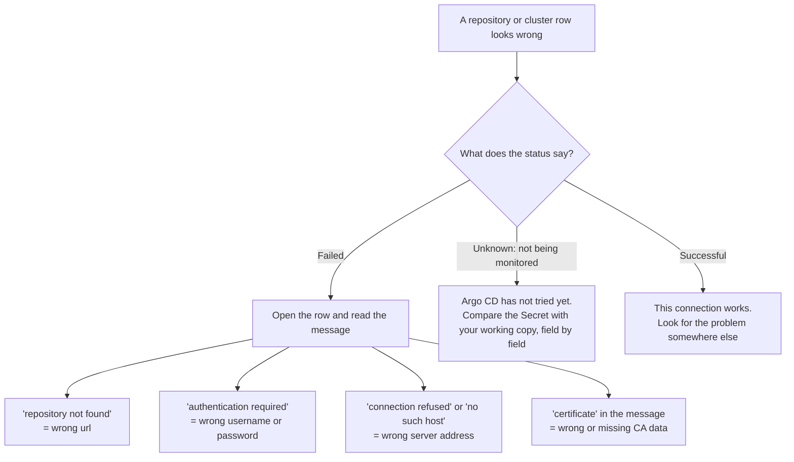
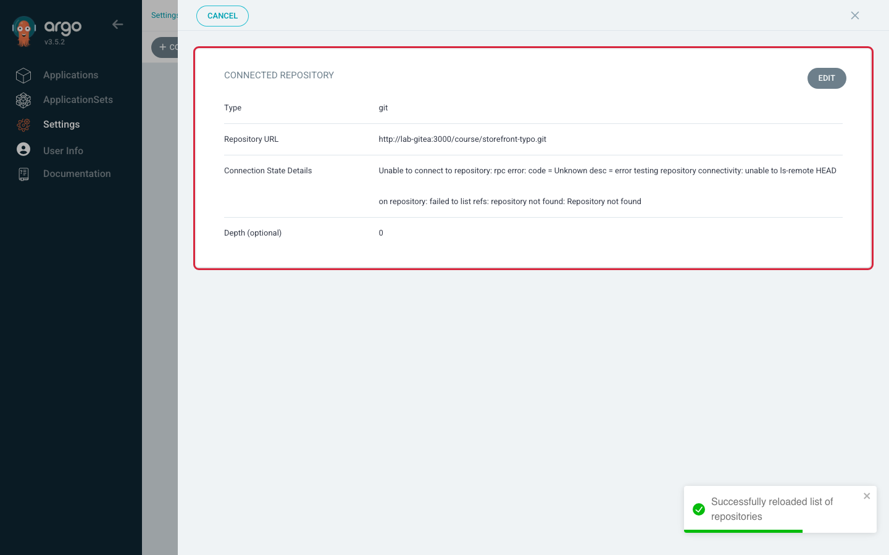
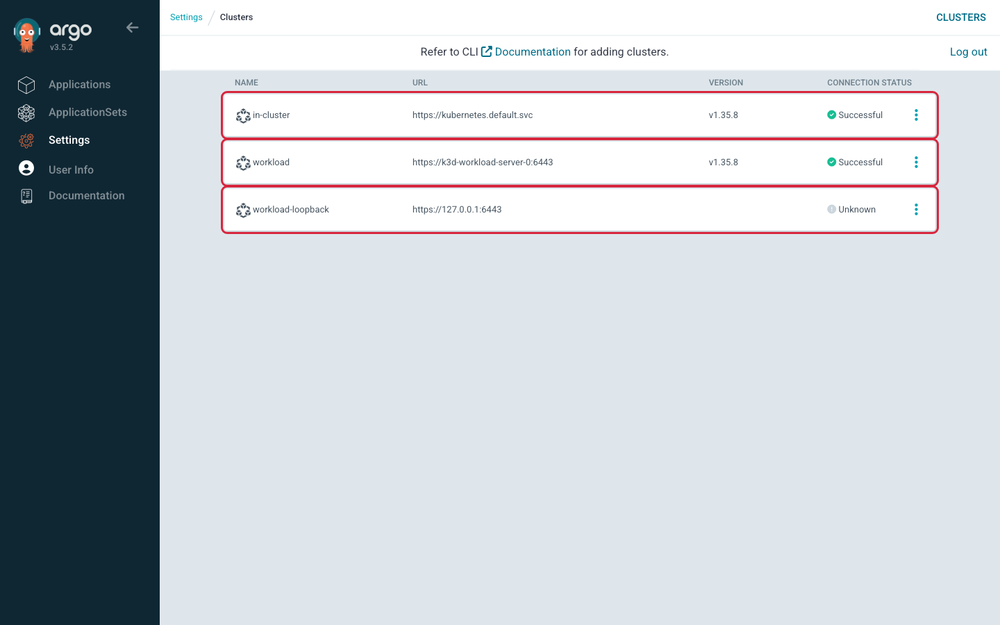

# Lab 2 · Module 4 — Diagnose and Wrap-Up

> **Day 1 · Lab 2 · Module 4 of 4 · ~10 minutes**
> **Goal:** practice the onboarding-diagnosis reflex (**E5**), then confirm your checkpoint.

> **🗺️ Where this module fits.** You built working connections in Modules 2 and 3. Now you see what *broken* ones look like, while the working ones are fresh in your mind to compare against. Then you check off the lab and see how it sets up Lab 3.

---

## E5 — Diagnose two broken onboarding records

**Difficulty:** Intermediate · **Time:** ~8 minutes · **Objective:** O7
**The second record (the cluster) is optional — do it if you have time.**

> **🧭 What this exercise is for**
> - **In plain words:** you apply an onboarding Secret that has one wrong value, read what Argo CD shows, and name the wrong field. You are practising **reading the symptom before changing anything**.
> - **Think of it like:** a delivery order with a wrong address. The driver's note ("address not found", "gate locked") tells you which line on the order to check. Sometimes there is no note at all, because the driver has not tried that address yet — record 2 shows you that case.
> - **Connects to:** Modules 2 and 3. Your working `repo-storefront-gitops` and `cluster-workload` Secrets are your "known good" copies to compare against.
> - **Big picture:** "the repo won't connect" and "the cluster shows a bad status" are among the most common real support tickets for Argo CD, and the Capstone includes this kind of fault.

**Goal:** apply a deliberately broken onboarding Secret, read the symptom, name the **single wrong field**, and remove it. You are practicing the diagnosis reflex, not memorizing a fix.

**Starter state:** two provided broken files (a different `metadata.name` from your working ones, so applying them does **not** overwrite E1/E2):
- `~/course/lab-files/lab-02/broken/repo-secret-wrong-url.yaml` (record 1 — required)
- `~/course/lab-files/lab-02/broken/cluster-secret-wrong-server.yaml` (record 2 — optional)

Each file still has a placeholder, like the templates you used: record 1 contains `<PASSWORD>`, record 2 contains `<TOKEN>`. You fill it with the **same Module 2 helper**, pointed at the broken file with `--file`, so the one deliberate mistake is the only wrong field.

**▶ Do this now — one record at a time:**

1. **Predict first.** `cat` the file. Predict: *what status will Argo CD show, and on which page?*

   | Record | Predicted symptom (status + page) | Which field looks wrong? |
   |---|---|---|
   | 1 — repo, wrong URL | ? | ? |
   | 2 — cluster, wrong server *(optional)* | ? | ? |

2. **Fill the placeholder and apply it** with the Module 2 helper. `--file` names the broken record; the contexts are the same ones you chose in E1 and E2.

   **Record 1** (fills `<PASSWORD>` from `~/course/credentials/gitea-student.txt`):
   ```bash
   python3 ~/course/lab-files/lab-02/module2-connection-helper.py repo \
     --context k3d-mgmt \
     --file ~/course/lab-files/lab-02/broken/repo-secret-wrong-url.yaml
   ```

   **Record 2, optional** (fills `<TOKEN>` only; this file has no `<CA_DATA>`):
   ```bash
   python3 ~/course/lab-files/lab-02/module2-connection-helper.py cluster \
     --source-context k3d-workload --context k3d-mgmt \
     --file ~/course/lab-files/lab-02/broken/cluster-secret-wrong-server.yaml
   ```

   **Expected** for each: `Secret applied. Now verify its location and connection status.` If the helper says it does not recognise `--file`, re-run the Module 2 [Appendix A](02-connect-repo-and-register-cluster.md#appendix-a--supplied-credential-helper) setup block to get the current helper.
   > **Why not apply the file as it is?** Record 1 would then send the literal text `<PASSWORD>` as the password. Argo CD would report a *password* problem (`authentication required`) instead of the problem this record is about, and the file would have two wrong fields.
3. **Observe.**
   - **Record 1:** on Settings → Repositories, click **Refresh list** (a plain page reload can show a result Argo CD remembered from earlier). The new row shows **Failed**. Click the row: the panel's **Connection State Details** holds the message (SS-L2-09). In the terminal, `argocd repo list --refresh hard` shows the same message.
   - **Record 2:** on Settings → Clusters, wait about a minute, then reload the page. Read the new row's status, then click the row and read **Details** under **Connection state** (SS-L2-10).

   Compare both with your prediction.
4. **Name the wrong field** in one sentence — do not fix it in place.
5. **Remove the broken Secret:**
   ```bash
   kubectl --context k3d-mgmt -n argocd delete secret <the-broken-secret-name>
   ```
   Record 1's Secret is named `repo-broken-url`; record 2's is `cluster-broken-server` (the `metadata.name` in each file).

**How to read what you see.** Use this as a map for any onboarding problem, not only these two records:



**Shape of a correct result:** for each record, point to the **one field** that is wrong and explain the symptom. Record 1 fails because Argo CD reaches the Git server but finds no repository at the given address. Record 2 does **not** show Failed: it shows **Unknown**, with the message *"Cluster has no applications and is not being monitored."* No Application uses that cluster, so Argo CD has not tried the address at all. You find its wrong field by comparison instead: ask whether the address would work *from inside the controller Pod* — the same "valid only from where it is used" rule as the real registration.

**Hints:**
- *Hint 1:* The failing field is one you already got *right* in E1/E2. Compare line by line.
- *Hint 2:* For record 2, ask the mental-model question: could a Pod on the cluster network reach the address in this file?
- *Hint 3:* Read the failure *message*, not just the badge — Argo CD usually names what it could not do (resolve a host, connect, authenticate, find the repository). When there is no failure message at all, ask whether Argo CD has tried yet.

**Success criterion:** you named the single wrong field in each record you attempted, both Settings pages are clean again (click **Refresh list** on Repositories), and your E1/E2 connections are untouched (still `Successful`).



*Figure SS-L2-09 — Record 1, after **Refresh list** and a click on the failed row: the panel's **Connection State Details** gives the reason. (The list itself shows only the word Failed.)*



*Figure SS-L2-10 — Record 2 (optional), about a minute after applying: `workload-loopback` shows **Unknown**, not Failed — no Application uses it, so Argo CD never tried to connect. Your real `workload` cluster stays **Successful**.*

<!-- CAPTURE-SPEC: SS-L2-09 — Settings → Repositories, record 1 rendered and applied; click Refresh list, then the storefront-typo row. Highlight: the panel with Connection State Details. Argo CD v3.5.2. -->
<!-- CAPTURE-SPEC: SS-L2-10 — Settings → Clusters, record 2 applied at least 1 minute earlier. Highlight: workload-loopback Unknown beside workload Successful. Argo CD v3.5.2. -->

### ✅ What you should take away from E5

- **Read the message, not only the colour.** The text usually says what failed: finding the host, connecting, logging in, or finding the repository.
- **A broken onboarding Secret usually has one wrong field.** Compare it line by line with a copy you know works.
- **`Unknown` can hide a broken record.** Argo CD tests a cluster only when an Application uses it, so a bad registration can look harmless until the day someone deploys to it.
- **An address that works from your laptop can still fail from inside the Argo CD Pod.** Always ask "where is this address being used from?"
- **Removing the broken Secret removes the broken row.** Your working Secrets were never touched, because their names are different.

---

## Troubleshooting

| Symptom | Likely cause | Fix |
|---|---|---|
| Settings → Repositories **already** shows `storefront-gitops` (or a `http://lab-gitea:3000/course/` credentials template) before E1 | The environment still holds objects from a later lab | `reset-lab.sh CP-lab-02 --local`, then refresh the page |
| Repository shows **Failed** | Wrong `url`/`username`, or bad password injection (for example, the literal text `<PASSWORD>` was sent) | Re-check `url` = `http://lab-gitea:3000/course/storefront-gitops.git`; confirm the password came from the credential file; re-apply; then click **Refresh list** |
| You fixed and re-applied a repository Secret, but the page still shows the old status | Argo CD remembers each repository's last connection result for up to an hour | Click **Refresh list**, or run `argocd repo list --refresh hard` |
| `workload` cluster shows **Unknown** — *"Cluster has no applications and is not being monitored"* — after E2 | Normal: no Application uses the cluster yet | Nothing to fix. It turns **Successful** within seconds of E4 creating `storefront-dev` |
| After E4, `storefront-dev` is not `OutOfSync` and its message mentions the workload cluster | The cluster Secret's `server:` is a `localhost`/`127.0.0.1` address (that means the Pod itself), or does not match `destination.server` | Set `server: https://k3d-workload-server-0:6443`; re-apply |
| Cluster shows a **TLS/certificate** error | `caData` wrong or empty | Re-collect `ca.crt` from `argocd-manager-token`, use **as-is** (already base64) |
| Authenticates but every action denied later | Bearer token taken from the wrong field, or read before the Secret populated | Token = **decoded** `token` field; re-read after populated, re-inject |
| `argocd cluster add k3d-workload` **fails** | It sends your kubeconfig's `127.0.0.1` server address to Argo CD, which cannot reach it from inside its Pods | Register **declaratively** with the in-network name (stretch A explains), and run stretch A's cleanup commands |
| `auth can-i` returns `no` for everything | Wrong `--as=` string, or RBAC applied to the wrong cluster | Identity is `system:serviceaccount:argocd-access:argocd-manager`; RBAC belongs on `k3d-workload` |
| `storefront-dev` red **ComparisonError** | Wrong `valueFiles` relative path | Fix path from `charts/storefront` to `envs/dev/values.yaml`, commit, re-apply |
| E4's dry-run says `resource apps:Deployment is not permitted in project storefront` (or `batch:Job`, `autoscaling:HorizontalPodAutoscaler`) | The kind is in `namespaceResourceWhitelist` with the wrong `group`, or is missing. The app still shows `OutOfSync`/`Missing`, so nothing else warns you until Lab 3's first sync fails | Use the group from E4's table (`apps` for Deployment, `batch` for Job, `autoscaling` for HPA, `""` for ConfigMap and Service), commit, re-apply the project, run the dry-run again |
| `storefront-dev` stuck **Unknown** | `destination.server` doesn't match the registered cluster URL | Make it byte-for-byte identical to the cluster Secret's `server` |
| The annotation-name check (E1 Step 5) prints `kubectl.kubernetes.io/last-applied-configuration` for a repository or cluster Secret | The Secret was applied without `--server-side`, so a copy of the credential is stored on it | `kubectl --context k3d-mgmt -n argocd annotate secret <name> kubectl.kubernetes.io/last-applied-configuration-`, then re-apply with `--server-side` |

---

## Checkpoint / validation

You have finished Lab 2 when **all** of these are true:

1. **Repository connected:** `argocd repo list` shows `storefront-gitops` with status `Successful`.
2. **Workload cluster registered:** `argocd cluster list` shows `workload` `Successful` at `https://k3d-workload-server-0:6443` (it turned `Successful` once `storefront-dev` existed).
3. **Address book has two cluster Secrets:** the Module 1 cluster query now returns `in-cluster` **and** `cluster-workload`.
4. **Least-privilege matrix matches the design:** your E3 table is complete and every `yes`/`no` matches the RBAC (app namespaces allow writes; unlisted namespaces and cluster-scoped deletes do not).
5. **The Application renders and compares:** `argocd app get storefront-dev` shows `OutOfSync` / `Missing`, the diff shows all resources newly added, and `argocd app sync storefront-dev --dry-run` reports `successfully synced (no more tasks)`. You can explain in one sentence why `OutOfSync` / `Missing` is correct, not broken.

If all five hold, you have built the real topology, and `reset-lab.sh CP-lab-03 --verify-only --local` prints `PASS CP-lab-03 is in the expected state.` That checkpoint is the starting state for the next lab. It checks that the objects exist, not every line in them. So it passes on your own work even though Gitea holds your commit rather than the checkpoint's. It also cannot tell whether your project's allowed-resource list is correct — that is why E4 ends with a dry-run check.

---

## ✅ Key takeaways

**From this module (E5):**

- **Diagnose before you fix.** Read the status *and* its message, then find the one wrong field by comparing with a working copy.
- **Most onboarding failures are an address, a credential, or a certificate** — and the message usually tells you which. No message can mean "not checked yet".

**From the whole of Lab 2:**

- **Argo CD's list of repositories and clusters is just labeled Secrets in the `argocd` namespace.** Two `kubectl get secret -l …` commands show the whole address book.
- **The identity lives on the cluster being managed, not the one doing the managing.** `argocd-manager` is a ServiceAccount on the *workload* cluster; the management cluster only stores a credential *for* it.
- **An address only works from the place that uses it.** Argo CD's controller Pod reaches the workload cluster as `k3d-workload-server-0:6443`. Inside that Pod, `localhost` means the Pod itself — the most common copy-paste mistake when registering a cluster.
- **Least privilege has two locks.** The Roles on the workload cluster decide *what* Argo CD may change; the cluster Secret's `namespaces` and `clusterResources: "false"` decide *where*. `kubectl auth can-i` tests the first lock; the second is a setting Argo CD itself enforces.
- **`OutOfSync` + `Missing` is the correct first result, not a failure.** Git describes resources the cluster does not have yet, and you have not synced on purpose.
- **Build the AppProject (the fence) before you need it**, so a later access request is a small reviewed change, not an argument.

---

## Optional stretch challenge

> **Clearly optional — pick one.**

**Option A — Explain why `argocd cluster add` fails here (recommended, fully local).**

> **⚠️ Read before you run it.** Before it fails, this command creates four objects **on the workload cluster**: a ServiceAccount `argocd-manager` in `kube-system`, a ClusterRole `argocd-manager-role` that allows **every action on every resource**, a ClusterRoleBinding that gives it to that ServiceAccount, and a long-lived token Secret. The failure does not remove them, so they quietly undo the least privilege you built in E2. Run the cleanup below as soon as you have read the message.

Run `argocd cluster add k3d-workload` and answer `y` at the warning prompt. Predict first: *will it succeed?* It will not. Read the message, then answer in two sentences: **which server URL did the command try, and why can the Argo CD Pods not reach it?** (It reads your kubeconfig's `localhost` address, reachable only from your VM — not inside the controller Pod. Your declarative Secret worked because it used `k3d-workload-server-0:6443`.)

**Clean up straight away** (the command's own output names these four objects; `reset-lab.sh` also removes them):

```bash
kubectl --context k3d-workload delete clusterrolebinding argocd-manager-role-binding
kubectl --context k3d-workload delete clusterrole argocd-manager-role
kubectl --context k3d-workload -n kube-system delete secret argocd-manager-long-lived-token
kubectl --context k3d-workload -n kube-system delete serviceaccount argocd-manager
```

These delete only the copy in `kube-system`. Your E2 identity lives in `argocd-access` and is not touched.

**Option B — Configure a Gitea webhook to remove polling delay (partly verified).** Point a Gitea webhook at `https://<your-argocd-host>/api/webhook`, push a trivial commit, and measure how fast `storefront-dev` reflects it versus polling. *Marked partly verified — if the webhook does not fire, fall back to Refresh and note what you observed. Do not spend more than a few minutes.*

**Option C — Watch a healthy cluster go `Unknown` (fully local, reversible).** **Predict first:** if you make the `cluster-workload` credential invalid, will `storefront-dev` become `OutOfSync`, `Degraded`, or `Unknown`? Break it (reversible):

```bash
kubectl --context k3d-mgmt -n argocd patch secret cluster-workload --type merge \
  -p '{"stringData":{"config":"{\"bearerToken\":\"invalid\",\"tlsClientConfig\":{\"insecure\":true}}"}}'
```

Refresh `storefront-dev`. The sync status is **`Unknown`** — not `OutOfSync`, not `Degraded`. Argo CD is reporting it **can no longer observe live state at all**; absence of evidence renders as `Unknown`, the single most misdiagnosed status. Two more things to notice. The health badge can read **Healthy** even though nothing is deployed: with no live view, that badge is not a real measurement. And Settings → Clusters can keep saying **Successful** for a short while (15–60 seconds in testing) before it changes to **Failed** with *"the server has asked for the client to provide credentials"*.

Restore it one of two ways. The quick way is to re-run the E2 Move C helper command, which rewrites `cluster-workload` with the real token and CA:

```bash
python3 ~/course/lab-files/lab-02/module2-connection-helper.py cluster \
  --source-context k3d-workload --context k3d-mgmt
```

The slower way is `reset-lab.sh CP-lab-03 --local`, which also replaces your `platform-config` commits with the checkpoint's copy. Refresh again: status returns to `OutOfSync` / `Missing`. **`Unknown` was never a statement about the app — it was a statement about Argo CD's eyesight.**

---

## Transition — what's next

You built the real topology: a private repo connected, a separate workload cluster registered least-privilege, a governance fence, and an Application that renders and compares but has not deployed. That `OutOfSync` / `Missing` state is the deliberate starting line for the next lab.

**In delivery-driver terms:** the address book, the warehouse key, the key card, the rules, and the first delivery order are all in place. Nothing has been delivered yet.

Next, **[Session 4](../session-04/README.md)** explains how Argo CD renders Helm and orders a sync, and **Lab 3** has you finally **sync** `storefront-dev` to the workload cluster you registered today — the first real delivery — then introduce drift, turn on self-healing, and recover a rendering failure through Git.

**Before you move on:** no cleanup required — your `platform-config` commits are the intended output. If you ran stretch A, make sure you ran its four cleanup commands. Lab 3 begins with `reset-lab.sh CP-lab-03 --verify-only --local`.
