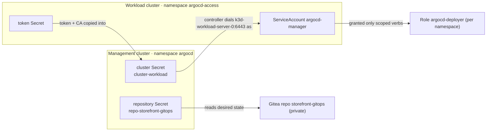

# Lab 2 — Configure the Platform and Register a Target (modular arc)

> **Day 1 · Lab 2 · Hands-on · ~60 minutes · Scaffolding G1 (maximally guided)**
> **Argo CD version this course targets: `v3.5.2`** (Helm chart `10.8.4`, Kubernetes `v1.35`).
> **Before this:** [Session 3](../session-03/README.md). Have the Argo CD UI open at `https://localhost:8443` (logged in as `admin`) and a terminal with `argocd`/`kubectl` ready (`source ~/argo-lab-env.sh` in each new terminal).

---

## Why this matters

In Lab 1 you watched one change travel from Git to a running app — but you took a shortcut: Argo CD deployed to the **management cluster itself**. Real platforms never do that. This lab builds the real topology with your own hands. You will do four things a platform engineer does on day one:

1. **Connect a private Git repository** (Lab 1's was public-read; this one is private and needs a credential).
2. **Register a separate workload cluster** with a **least-privilege** identity.
3. **Prove** both connections work — and prove the identity is genuinely restricted.
4. **Create the first `AppProject` and `Application`** declaratively — the governance fence and deployment instruction every later lab builds on.

Everything you configure here is the substrate for the rest of the course, and one of these objects is the exact thing the Capstone breaks.

---

## Learning objectives

1. Connect a private Git repository declaratively, injecting the credential from a never-committed file (**L2.1**).
2. Register a workload cluster with least-privilege credentials — a scoped ServiceAccount, a token, and a cluster Secret that forbids cluster-scoped writes (**L2.2**).
3. Verify connectivity and prove least privilege with a `kubectl auth can-i` matrix (**L2.3**).
4. Create a basic `AppProject` and `Application` declaratively (**L2.4**).
5. Confirm Argo CD can render and compare the target — reading `OutOfSync` + `Missing` as the *correct* first result (**L2.5**).
6. Diagnose two common onboarding failures (**O7**).

Maps to outcomes **O3**, **O4**, **O7**.

---

## Mental model recap (short — the concept guides taught it)

**Everything Argo CD knows about your repos and clusters is a labeled Secret in one namespace.** "Connecting a repo" / "registering a cluster" is not a feature toggle — it is *writing* a labeled Secret in the `argocd` namespace.

**A credential is only valid from the place that will use it.** The application-controller Pod (on the management cluster) dials the workload API server, so the address and token must work **from inside that Pod** — which is why you use `https://k3d-workload-server-0:6443`, not a `localhost` address.

---

## The big picture in plain words

**Where this lab sits in the course.** In Lab 1, Argo CD deployed an app onto the same cluster it runs on. That was a shortcut for learning. Real platforms keep Argo CD on a **management** cluster and deploy to separate **workload** clusters. This lab builds that real setup. Lab 3 then deploys an app onto it.

**One analogy to hold onto: Argo CD is a delivery driver.** A driver needs an address book, keys to get into places, rules about what may go where, and an order to deliver. This lab gives Argo CD each of those, one at a time:

| In a delivery service… | In this lab… | You build it in… |
|---|---|---|
| The driver's **address book** | The labeled Secrets in the `argocd` namespace | Module 1 (you look at it) |
| A **key to the locked warehouse** where the goods are kept | The repository Secret for the private `storefront-gitops` repo | Module 2 · E1 |
| A **key card** for the customer's building that opens **only some rooms** | The `argocd-manager` identity on the workload cluster, carried in a cluster Secret | Module 2 · E2 |
| **Trying the key card** at every door before trusting it | `kubectl auth can-i` checks | Module 3 · E3 |
| The **rules for this customer**: which warehouse, which rooms, which kinds of goods | The `storefront` AppProject (the course calls it a *fence*) | Module 3 · E4 |
| One **delivery order** | The `storefront-dev` Application | Module 3 · E4 |
| Practising with **wrong addresses** | Two deliberately broken Secrets | Module 4 · E5 |

At the end of this lab the delivery order is written and checked, but **nothing has been delivered yet**. That is on purpose. Delivering (syncing) is Lab 3.

**How this lab connects to the sessions**

| You learned it in… | You use it in… |
|---|---|
| [Session 2](../session-02/README.md) — the Application object, and the two status questions (Synced/OutOfSync, Healthy/Missing) | Module 3 · E4, when you read the first status of `storefront-dev` |
| [Session 3 · Module 2](../session-03/02-onboarding-repos-and-clusters.md) — repos and clusters are labeled Secrets; the cluster trust chain; "commit the pointer, never the payload" | Modules 1 and 2 |
| [Session 3 · Module 3](../session-03/03-least-privilege-and-change-detection.md) — least *write* privilege; the wide-open `default` project | Module 3 |

---

## The four modules

Work them in order.

| Module | You will... | Exercises | ~Time |
|---|---|---|---|
| [01 — Environment and the address book](01-environment-and-address-book.md) | Confirm the start state; read the labeled-Secret "address book"; study the two templates | — | ~10 min |
| [02 — Connect the repo, register the cluster](02-connect-repo-and-register-cluster.md) | Inject a repo credential; create a least-privilege identity and register the cluster | **E1, E2** | ~27 min |
| [03 — Prove least privilege, create the app](03-prove-least-privilege-and-create-app.md) | Prove the identity is restricted; create the `AppProject` and `Application` | **E3, E4** | ~20 min |
| [04 — Diagnose and wrap-up](04-diagnose-and-wrap-up.md) | Diagnose two broken onboarding records; checkpoint and stretch | **E5** | ~10 min |

Each module has short **🧭 What this is for** notes at the start of every section and **✅ Key takeaways** at the end. Read them — they tell you what to notice and why it matters later.

**→ Start:** [01 — Environment and the address book](01-environment-and-address-book.md)
