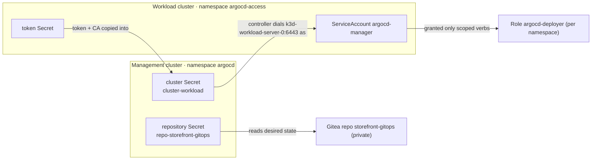

# Lab 2 — Configure the Platform and Register a Target (modular arc)

> **Day 1 · Lab 2 · Hands-on · ~60 minutes · Scaffolding G1 (maximally guided)**
> **Argo CD version this course targets: `v3.5.2`** (Helm chart `10.8.4`, Kubernetes `v1.35`).
> **Before this:** [Session 3](../session-03/README.md). Have the Argo CD UI open at `https://localhost:8443` (logged in as `admin`) and a terminal with `argocd`/`kubectl` ready (`source ~/argo-lab-env.sh` in each new terminal).

---

## Why this matters

In Lab 1 you watched one change travel from Git to a running app — but you took a shortcut: Argo CD deployed to the **management cluster itself**. Real platforms never do that. This lab builds the real topology with your own hands. You will do four things a platform engineer does on day one:

1. **Connect a private Git repository** (Lab 1's was public-read; this one is private and needs a credential).
2. **Register a separate workload cluster** with a **least-privilege** identity.
3. **Prove** both connections work — and prove the identity is genuinely restricted.
4. **Create the first `AppProject` and `Application`** declaratively — the governance fence and deployment instruction every later lab builds on.

Everything you configure here is the substrate for the rest of the course, and one of these objects is the exact thing the Capstone breaks.

---

## Learning objectives

1. Connect a private Git repository declaratively, injecting the credential from a never-committed file (**L2.1**).
2. Register a workload cluster with least-privilege credentials — a scoped ServiceAccount, a token, and a cluster Secret that forbids cluster-scoped writes (**L2.2**).
3. Verify connectivity and prove least privilege with a `kubectl auth can-i` matrix (**L2.3**).
4. Create a basic `AppProject` and `Application` declaratively (**L2.4**).
5. Confirm Argo CD can render and compare the target — reading `OutOfSync` + `Missing` as the *correct* first result (**L2.5**).
6. Diagnose two common onboarding failures (**O7**).

Maps to outcomes **O3**, **O4**, **O7**.

---

## Mental model recap (short — the concept guides taught it)

**Everything Argo CD knows about your repos and clusters is a labeled Secret in one namespace.** "Connecting a repo" / "registering a cluster" is not a feature toggle — it is *writing* a labeled Secret in the `argocd` namespace.

**A credential is only valid from the place that will use it.** The application-controller Pod (on the management cluster) dials the workload API server, so the address and token must work **from inside that Pod** — which is why you use `https://k3d-workload-server-0:6443`, not a `localhost` address.

---

## The four modules

Work them in order.

| Module | You will... | Exercises | ~Time |
|---|---|---|---|
| [01 — Environment and the address book](01-environment-and-address-book.md) | Confirm the start state; read the labeled-Secret "address book"; study the two templates | — | ~10 min |
| [02 — Connect the repo, register the cluster](02-connect-repo-and-register-cluster.md) | Inject a repo credential; create a least-privilege identity and register the cluster | **E1, E2** | ~27 min |
| [03 — Prove least privilege, create the app](03-prove-least-privilege-and-create-app.md) | Prove the identity is restricted; create the `AppProject` and `Application` | **E3, E4** | ~20 min |
| [04 — Diagnose and wrap-up](04-diagnose-and-wrap-up.md) | Diagnose two broken onboarding records; checkpoint and stretch | **E5** | ~10 min |

**→ Start:** [01 — Environment and the address book](01-environment-and-address-book.md)
