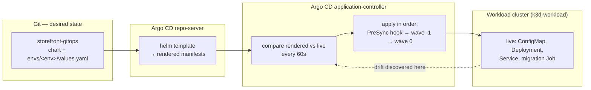

# Lab 3 — Deploy, Introduce Drift, and Recover

> **Day 1 · Lab 3 · Hands-on lab guide · ~60 minutes**
> **Argo CD version this course targets: `v3.5.2`** (Helm chart `10.8.4`, Kubernetes `v1.35`; the repo-server renders charts with **Helm v4.2.1**).
> **Scaffolding level: G2 (reduced).** Every *new* idea in this lab — sync waves, self-heal, rendering-versus-ordering failures, promotion — is still explained in full **before** you use it. What is *no longer* re-explained is the mechanics you already own from Labs 1 and 2: logging in, finding an Application, reading a diff, running `argocd` and `kubectl`. From here on you will often be asked to write a command or a manifest change **yourself** before the guide shows one way to do it.
> **What you need open before you start:**
> - a MATE Terminal window on the VM desktop (run `source ~/argo-lab-env.sh` in each new one),
> - Firefox inside that same desktop with the Argo CD web interface (`https://localhost:8443`), logged in as `admin` — because Firefox runs on the VM, `localhost` already means the VM and there is no tunnel to start,
> - the `argocd` command line, already logged in as `admin` (confirm with `argocd account get-user-info`),
> - a VM terminal window where you can `git` against your own clone of the `storefront-gitops` and `platform-config` repositories (Lab 2 set these up).
>
> **This lab runs on your pre-provisioned course VM.** If you have not completed **Lab 0 — Prepare Your VM for Lab 1**, do that first: it builds the two clusters, Argo CD, Gitea, and reaches the starting checkpoint.

---

## 1. Why this matters

This is the lab where Day 1 pays off. By the end of it you will have taken one Helm application from a Git commit all the way to a running workload on a *separate* cluster, deliberately broken it two different ways, and brought it back — every time through Git, never by hand-fixing the cluster.

That is not a drill. It is the exact loop an on-call platform engineer runs during a real incident:

- A deployment looks wrong. **Is it drift, a rendering failure, or an ordering failure?** Those three look equally red in the UI and live in completely different places.
- Someone "fixes" a production Deployment with `kubectl edit` and it silently reverts a minute later. **Is that a bug, or is that the platform doing its job?**
- A change has to be undone right now. **Do you revert, or roll forward?** And which one leaves a record a reviewer can read tomorrow?

Every one of those questions has a clean, teachable answer, and you will produce the evidence for each answer with your own hands. The muscle you build here — *find the layer before you touch anything* — is the exact skill the Day 2 Capstone grades.

---

## 2. Learning objectives

By the end of this lab you will be able to:

1. **Deploy a Helm-based application to the registered workload cluster** by syncing an Application, and prove that Argo CD renders manifests rather than creating a Helm release (outline bullet **L3.1**).
2. **Apply an environment-specific values file** by authoring a second Application for `staging`, and **promote a version pin** from one environment to another as a single reviewable Git change (**L3.2**).
3. **Introduce live drift and read Argo CD's response** — predicting correctly *which* of the two status axes changes, and why nothing reverts on its own under manual sync (**L3.3**).
4. **Configure safe automated synchronization and self-healing** with pruning deliberately left off, and observe self-heal outlive a manual edit (**L3.4**).
5. **Introduce a rendering failure and an ordering failure, tell them apart by where the evidence appears, and recover both through Git** — justifying revert versus roll-forward (**L3.5**).

These map to course outcomes **O5** (deploy Helm and manage environment configuration), **O6** (synchronization, promotion, and guardrails), **O7** (diagnose rendering, synchronization, and health failures), and **O1** (reconciliation). Meeting them *is* the **Day 1 outcome**: a working Git-to-Argo-CD-to-workload-cluster deployment and a repeatable method for finding failures along that path.

---

## 3. Prerequisites and what earlier guides established

**You should have completed:**

- **Lab 1 — Follow an Application Through Reconciliation.** You can read the two status axes and trace a change through the reconciliation loop.
- **Lab 2 — Configure the Platform and Register a Target.** You connected the private `storefront-gitops` repository, registered the `workload` cluster with least-privilege credentials, and created the `storefront` AppProject and the `storefront-dev` Application (which is sitting at `OutOfSync` / `Missing` on purpose — manual sync, nothing deployed yet).
- **Guide 02 — Architecture and the Application model.** Recall the **one-verb-per-component** model: the **repo-server** *renders*, and the **application-controller** *compares and applies*. Naming the verb names the suspect.
- **Guide 04 — Helm Deployments, Synchronization, and Promotion.** This lab is where that concept guide becomes muscle memory. Recall its central claim: **Argo CD borrows Helm's typewriter and throws away Helm's filing cabinet** — it runs `helm template` to render manifests and applies them itself, so there is no Helm *release* to list or roll back.

**Acronyms this lab uses, expanded once here:**

- **CD (Continuous Delivery):** the half of the pipeline that gets a validated change running in an environment. Argo CD is the CD tool; it starts where CI stops — at a Git commit.
- **CRD (Custom Resource Definition):** a Kubernetes object type added by an extension. `Application` and `AppProject` are CRDs that Argo CD installed.
- **HPA (Horizontal Pod Autoscaler):** a Kubernetes object that changes how many Pod replicas run based on load. It is off in this lab; you will meet it on Day 2.
- **YAML (YAML Ain't Markup Language):** the text format Kubernetes objects and Helm values are written in.
- **UI (User Interface):** the Argo CD web console at `https://localhost:8443`.

**Two short refreshers this lab leans on:**

> **Refresher — two clusters, always name the context.** Your VM runs two Kubernetes clusters. `k3d-mgmt` is the **management cluster** where Argo CD itself runs (its objects live in the `argocd` namespace). `k3d-workload` is the **separate workload cluster** where the storefront application is deployed. Because there are two, **every `kubectl` command in this lab names its context explicitly** with `--context k3d-mgmt` or `--context k3d-workload`. Running a command against the wrong cluster is the single most common self-inflicted failure in this lab — when a result surprises you, check the context first.

> **Refresher — `git revert` versus `git reset`.** *`git revert <commit>`* creates a **new** commit that undoes an earlier one; the history keeps both, so the undo is itself an auditable event. *`git reset --hard`* rewinds history and erases what was there, leaving no record. In this lab, when you recover "through Git," prefer `git revert` — the recovery should be as reviewable as the change that caused the problem.

---

## 4. Mental model recap (short)

Four ideas from Guide 04 carry this whole lab. They are short on purpose — the concept guide already taught them.

**Sync and health are two independent questions.** *Sync* asks "does the live cluster match Git?" *Health* asks "is the workload actually working?" A resource can be `Synced` and `Degraded` (matches Git, but crashing), or `OutOfSync` and `Healthy` (working fine, but no longer matches Git). Watching *which* axis moves is how you tell drift from a real outage.

**Three states, in order: desired → rendered → live.** Git holds the **desired** state (chart plus values). The repo-server **renders** it into finished manifests. The controller applies those to produce **live** state on the workload cluster. A failure at each stage shows up in a different place, which is the entire point of the second half of this lab.

**Waves and hooks order a sync.** Inside a single sync, Argo CD applies resources in stages. A **PreSync hook** (here, a short "database migration" Job) must succeed *before* the main resources are applied. Then **sync waves** order the rest: this chart puts the `ConfigMap` in wave `-1` (applied first) and the `Deployment` and `Service` in wave `0`. **If an earlier stage fails, the later stages never run.** Hold onto that — it is exactly how the ordering failure in Exercise 5 behaves.

**Self-heal is a policy about who wins ties, not a safety net.** With self-heal on, Argo CD re-applies Git's desired state whenever the cluster drifts. A `kubectl edit` still *works* — for a moment — and is then undone at the next comparison. The durable change under self-heal is a commit, not an edit.



---

## 5. Environment check — confirm you are starting from "healthy"

Before you change anything, prove the environment is in the known-good starting state, checkpoint **`CP-lab-03`**. This takes about a minute and saves you from debugging a problem you inherited.

### 5.1 Run the verifier (it changes nothing)

In a MATE Terminal window on the VM desktop, first run `source ~/argo-lab-env.sh` (do this in every new VM terminal so the pinned `kubectl`, `helm`, `argocd`, and the course scripts are on your `PATH`). Then run:

```bash
reset-lab.sh CP-lab-03 --verify-only --local
```

The `--verify-only` flag prints a PASS/FAIL table **without changing anything**.

**Expected output** *(representative — confirm against the live classroom environment):*

```text
▶ Verification for CP-lab-03
  PASS  Application hello-reconcile Synced/Healthy
  PASS  Application storefront-dev present (manual)
  PASS  AppProject storefront present
  PASS  Secret in-cluster present
  PASS  Secret repo-storefront-gitops present
  PASS  Secret cluster-workload present
  PASS  workload namespace storefront-prod present
  PASS  workload SA argocd-manager present

PASS CP-lab-03 is in the expected state.
```

If any row says **FAIL**, run `reset-lab.sh CP-lab-03 --local` (without `--verify-only`) to restore the checkpoint. **Warning:** a full reset discards any lab work you have not committed and pushed.

### 5.2 Confirm the starting picture in the UI

Open the Argo CD UI and look at the Applications list. `storefront-dev` should be **`OutOfSync`** and **`Missing`** — the correct starting state, not a failure. It means "Argo CD can render and compare this application, and nothing is deployed yet."


*Figure SS-L3-01 — Argo CD v3.5.2 Applications view at checkpoint `CP-lab-03`. `storefront-dev` is `OutOfSync` / `Missing`: rendered and comparable, but not yet deployed.*

**What to notice:**
1. The `storefront-dev` tile shows a yellow **`OutOfSync`** badge and a **`Missing`** health badge.
2. There is **no** `storefront-staging` tile yet — you create that in Exercise 2.
3. The `hello-reconcile` application from Lab 1 is still `Synced` / `Healthy` and can be ignored for this lab.

<!-- CAPTURE-SPEC: SS-L3-01 — Argo CD Applications list, environment check. State: checkpoint CP-lab-03 (reset-lab.sh CP-lab-03), logged in as admin, route /applications. Highlight: storefront-dev tile with OutOfSync (yellow) + Missing badges; absence of a storefront-staging tile. Fidelity: full page. Argo CD v3.5.2. -->

---

## 6. Guided walkthrough (read this before the exercises)

The exercises below ask you to produce commands and manifest changes yourself. This short walkthrough gives you the two *new* mechanics you have not performed before — everything else you already did in Labs 1 and 2.

### 6.1 New mechanic: reaching a workload that has no public address

The storefront application listens on port **9898** (it is `podinfo`, a small demo web server that returns a JSON body and displays a configurable message). It has a `ClusterIP` Service named `storefront`, which is reachable *inside* the workload cluster but not from your VM's shell. To read it, you open a temporary tunnel with `kubectl port-forward` and then `curl` through the tunnel:

```bash
# Terminal A — open the tunnel (leave it running; Ctrl-C stops it):
kubectl --context k3d-workload -n storefront-dev port-forward svc/storefront 9898:9898
```

```bash
# Terminal B — read the app through the tunnel:
curl -s localhost:9898 | grep -o '"message": *"[^"]*"'
```

**Expected shape** *(representative — confirm live):*

```text
"message": "storefront DEV"
```

The message text comes from the environment's values file, so a change in Git becomes visible here. That is your ground-truth check that a deploy or a promotion actually landed.

### 6.2 New mechanic: promotion is moving a version pin, not copying artifacts

"Promoting" a change from `dev` to `staging` is **not** a pipeline that copies images between environments. In GitOps it is a **one-line edit to a values file, in a commit, with a reviewer**. The chart does not move. The image does not move. A *number* moves.

The storefront repository is laid out for exactly this. Each environment has its own values file that overrides only what differs:

```text
storefront-gitops/
  charts/storefront/            # one chart, rendered for every environment
  envs/dev/values.yaml          # image.tag, ui.message, replicaCount for DEV
  envs/staging/values.yaml      # …for STAGING
  envs/prod/values.yaml         # …for PROD (pinned to a Git tag, not a branch)
```

Promoting the image tag that `dev` has been running into `staging` is therefore a single changed line in `envs/staging/values.yaml`, committed and pushed. You will do this in Exercise 2.

### 6.3 New mechanic: everything you change lives in one of two Git repositories

Keep these straight — the second half of the lab depends on it:

| You want to change… | Edit this repo | How Argo CD sees it |
|---|---|---|
| The **Application** itself (its sync policy, which values file it reads, its destination) | `platform-config` | You `git commit`, then `kubectl --context k3d-mgmt -n argocd apply -f …` the Application manifest |
| The **application's desired state** (chart, `envs/<env>/values.yaml`) | `storefront-gitops` | You `git commit` **and push**; Argo CD reads the repo on its next refresh |

A rendering failure and an ordering failure in Exercise 5 live in *different* repos for this reason. Noticing which repo owns a change is half of finding a failure fast.

---

## 7. Exercises

Work them in order — each leaves state the next one uses. Times are targets; the whole set fits in about 55 minutes, leaving the checkpoint for last. The optional stretch work in Section 10 is **outside** the timebox.

Throughout, **predict before you observe.** Fill your prediction in first, then run the step, then compare. The gap between the two is where the learning is.

---

### Exercise 1 — Deploy dev and prove "render, not release"

**Goal (plain language):** Sync the `storefront-dev` Application so the storefront app actually runs on the workload cluster, watch the PreSync hook and the sync waves go by in order, and then prove — with evidence — that Argo CD did **not** create a Helm release.

**Difficulty / time:** Straightforward · ~10 minutes.

**Starter state:** `storefront-dev` is `OutOfSync` / `Missing` (from the environment check). It uses **manual** sync, so nothing happens until you ask.

**Predict first — the three states.** Before you sync, write down what you expect at each stage:

| Stage | Desired (Git) | Rendered (manifests) | Live (workload cluster) |
|---|---|---|---|
| Right now (before sync) | chart + dev values | *your prediction* | *your prediction* |
| Immediately after you click Sync | chart + dev values | *your prediction* | *your prediction* |

**Do it:**

1. Sync `storefront-dev` (UI **Sync**, or `argocd app sync storefront-dev`). Watch the resource tree as it applies.
2. Observe the order: the **PreSync** migration Job runs first and must succeed; then the `ConfigMap` (wave `-1`); then the `Deployment` and `Service` (wave `0`). The Deployment goes `Progressing` → `Healthy` as its Pod passes its readiness probe.
3. **Predict, then run** the release check. Write your prediction for the output first:

   ```bash
   helm list -A --kube-context k3d-workload
   ```

4. Verify the app is actually serving, using the port-forward + `curl` from Section 6.1.


*Figure SS-L3-02 — `storefront-dev` after Exercise 1: the PreSync migration Job has completed, and the Deployment is Synced / Healthy (v3.5.2).*

**What to notice:**
1. The **migration Job** node appears as a completed **PreSync** hook, separate from the main resource tree.
2. The `ConfigMap`, `Deployment`, and `Service` are all `Synced`; the `Deployment` is `Healthy`.
3. The application header now reads **`Synced`** / **`Healthy`**.

<!-- CAPTURE-SPEC: SS-L3-02 — Argo CD application tree after first sync. State: after Exercise 1 `argocd app sync storefront-dev`, route /applications/storefront-dev. Highlight: completed PreSync migration Job node; ConfigMap/Deployment/Service Synced; Deployment Healthy; app header Synced/Healthy. Fidelity: full page. Argo CD v3.5.2. -->

**Success criterion (checkable without the answer):**
- `argocd app get storefront-dev` shows **`Sync Status: Synced`** and **`Health Status: Healthy`**.
- `helm list -A --kube-context k3d-workload` returns **no storefront release** (the header row and nothing else, or only unrelated releases). You should be able to say, in one sentence, *why* that empty result is proof the model is working.
- `curl` through the port-forward returns a message containing **`storefront DEV`**.

**Hints (use only if stuck):**
- *Hint 1:* If Sync does nothing, confirm you are looking at `storefront-dev` and that its sync is manual — manual sync waits for you.
- *Hint 2:* If the Deployment stays `Progressing`, check the Pod on the **workload** cluster: `kubectl --context k3d-workload -n storefront-dev get pods`. Wrong context is the usual cause of "nothing is there."
- *Hint 3:* The reason `helm list` is empty is the one-sentence thesis of Guide 04 — Argo CD ran `helm template`, not `helm install`.

---

### Exercise 2 — Deploy staging from its own values file, then promote a tag

**Goal (plain language):** Author a **second** Application, `storefront-staging`, that renders the *same* chart with the *staging* values file, so it deploys to the `storefront-staging` namespace with staging's settings. Then perform a **promotion**: move the image tag that `dev` has been running into the staging values as a single reviewable commit.

**Difficulty / time:** Moderate · ~10 minutes.

**Starter state:** `storefront-dev` is `Synced` / `Healthy`. The `storefront-staging` Application does **not** exist yet. Your reference is the working `storefront-dev` Application manifest in `platform-config/applications/storefront-dev.yaml`.

**What "correct" looks like (a described shape, not the answer):** a new `storefront-staging` Application that
- reads `envs/staging/values.yaml` instead of `envs/dev/values.yaml`,
- deploys to the `storefront-staging` namespace on the workload cluster,
- and reaches `Synced` / `Healthy` with **2** replicas and a UI message of **`storefront STAGING`** (staging's values differ from dev's here).

**Predict first — rendered differences.** Compare `envs/dev/values.yaml` and `envs/staging/values.yaml`. Before you deploy, predict which of these will differ between the two environments: namespace, replica count, UI message, UI color, image tag.

**Do it (produce the manifest yourself):**

1. Create `platform-config/applications/storefront-staging.yaml`, modeled on the dev Application. Change what has to change for staging — no more.
2. **The guardrail step (do not skip):** the `storefront` AppProject you built in Lab 2 permits **only** the `storefront-dev` destination. A project allows exactly what it is told to allow, so you must widen `platform-config/projects/storefront.yaml` to also permit the `storefront-staging` namespace on the workload cluster. If you skip this, Argo CD will *reject* the new Application with a project-permission error (see Troubleshooting).
3. Commit both files, then apply them from the **management** cluster:

   ```bash
   kubectl --context k3d-mgmt -n argocd apply -f platform-config/projects/storefront.yaml
   kubectl --context k3d-mgmt -n argocd apply -f platform-config/applications/storefront-staging.yaml
   ```

4. Sync `storefront-staging` and verify it comes up with staging's settings (port-forward to the `storefront-staging` namespace this time, or read the UI).

**Now promote a tag.** A newer podinfo release, **`6.16.0`**, has been validated in `dev`. Promote it to `staging`:

1. In `storefront-gitops`, edit `envs/dev/values.yaml` to set `image.tag: "6.16.0"`, commit and push, and sync `storefront-dev`. Confirm dev now serves the new version (`curl … | grep version`).
2. **Promote** by making the *same* one-line change to `envs/staging/values.yaml`, commit and push. Before syncing, render the change locally to see it is a one-line diff and nothing else moved:

   ```bash
   # Render-only, changes nothing on any cluster:
   helm template storefront charts/storefront -f envs/staging/values.yaml | grep 'image:'
   ```

3. Sync `storefront-staging`.

> **Environment note (read this):** promoting a *new* image tag pulls a new container image on the workload cluster. Your classroom pre-loads `stefanprodan/podinfo:6.16.0`. If your environment is offline and that tag is unavailable, the Deployment will stall on `ImagePullBackOff` — the recovery is in Troubleshooting, and it is itself a small lesson in revert-versus-roll-forward.


*Figure SS-L3-03 — `storefront-staging` after Exercise 2: the App Details show the `envs/staging/values.yaml` values file driving this environment (v3.5.2).*

**What to notice:**
1. The **Helm** section of App Details lists the **staging** values file, not the dev one.
2. The rendered `Deployment` has **2** replicas, matching `envs/staging/values.yaml`.
3. The two Applications share one chart but produce different live results — that is the whole reason for per-environment values files.

<!-- CAPTURE-SPEC: SS-L3-03 — Argo CD App Details, Helm parameters/values-files. State: after Exercise 2 apply+sync of storefront-staging, route /applications/storefront-staging, App Details → Parameters. Highlight: the valueFiles entry pointing at envs/staging/values.yaml; replica/UI values reflecting staging. Fidelity: panel. Argo CD v3.5.2. -->

**Success criterion:**
- `argocd app list` shows **both** `storefront-dev` and `storefront-staging` as `Synced` / `Healthy`.
- A `curl` against the staging app returns **`storefront STAGING`**, and the staging namespace runs **2** replicas: `kubectl --context k3d-workload -n storefront-staging get deploy storefront` shows `2/2`.
- The staging values file's `image.tag` line matches dev's after the promotion, and your `git log` on `storefront-gitops` shows the promotion as its own commit.

**Hints (use only if stuck):**
- *Hint 1:* The dev Application's `helm.valueFiles` path is *relative to the chart path* (`charts/storefront`). Staging's file is the sibling env directory — count the `../` carefully.
- *Hint 2:* If the new Application appears but immediately errors about the project, you skipped the AppProject destination step — a project denies any destination it does not list.
- *Hint 3:* "Promote a number" literally means: the *only* line that changes in `envs/staging/values.yaml` is the `image.tag` value.

---

### Exercise 3 — Introduce live drift under manual sync

**Goal (plain language):** Change the running cluster *directly* (behind Argo CD's back) and predict, before you look, **which** of the two status axes moves — and confirm that under manual sync, nothing reverts on its own.

**Difficulty / time:** Straightforward · ~8 minutes.

**Starter state:** `storefront-dev` is `Synced` / `Healthy` and still on **manual** sync (you have not turned automation on yet).

**Predict first — which status changes?**

| After you scale the Deployment on the cluster… | Sync status | Health status | Does it revert on its own? |
|---|---|---|---|
| *your prediction* | `Synced` or `OutOfSync`? | `Healthy` or `Degraded`? | yes / no |

**Do it:**

1. Scale the live Deployment on the **workload** cluster — a classic bit of drift:

   ```bash
   kubectl --context k3d-workload -n storefront-dev scale deploy/storefront --replicas=3
   ```

2. In the UI, refresh `storefront-dev` and read both badges. Open the **diff** to see exactly what changed.
3. Wait through a reconciliation interval (this environment reconciles every **60 seconds**). Watch whether Argo CD does anything about the drift.


*Figure SS-L3-04 — `storefront-dev` after Exercise 3: the Deployment is `OutOfSync` because the live replica count no longer matches Git — but it is still `Healthy` (v3.5.2).*

**What to notice:**
1. The `Deployment` node carries an **`OutOfSync`** badge; the app header flips to `OutOfSync`.
2. The health badge stays **`Healthy`** — three replicas is a perfectly working app, just not the *desired* one.
3. Nothing changes over the next minute. Manual sync reports drift; it does not correct it.

<!-- CAPTURE-SPEC: SS-L3-04 — Argo CD application tree after drift. State: after `kubectl --context k3d-workload -n storefront-dev scale deploy/storefront --replicas=3`, route /applications/storefront-dev, Refresh. Highlight: Deployment node OutOfSync; app header OutOfSync; health still Healthy. Fidelity: full page. Argo CD v3.5.2. -->


*Figure SS-L3-05 — The diff for `storefront-dev`: live `spec.replicas: 3` versus desired `1`. This is the exact field Argo CD sees as drift (v3.5.2).*

**What to notice:**
1. The diff highlights **`spec.replicas`** as the only differing field.
2. The "desired" side (`1`) comes from `envs/dev/values.yaml`; the "live" side (`3`) is your manual edit.
3. Everything else matches — drift is specific, not a whole-object mismatch.

<!-- CAPTURE-SPEC: SS-L3-05 — Argo CD diff view. State: after Exercise 3 drift, open App Diff on storefront-dev's Deployment. Highlight: spec.replicas desired 1 vs live 3, all other fields equal. Fidelity: panel. Argo CD v3.5.2. -->

**Success criterion:**
- `argocd app get storefront-dev` shows **`OutOfSync`** but **`Healthy`**, and it *stays* that way across at least one 60-second interval.
- You can state, in one sentence, why the health axis did **not** move.

**Hints (use only if stuck):**
- *Hint 1:* If the badge still says `Synced`, click **Refresh** — drift is *discovered* on comparison, not the instant you type.
- *Hint 2:* If you see no live Pods at all, you scaled the wrong context. Confirm with `kubectl --context k3d-workload -n storefront-dev get deploy storefront`.

---

### Exercise 4 — Configure safe automated sync and self-healing

**Goal (plain language):** Turn on automated sync with **self-heal** so the cluster is held to Git — but leave **prune off**, deliberately. Then repeat the drift from Exercise 3 and watch self-heal outlive your edit. Finally, protect one resource from any *future* pruning and justify it in a sentence.

**Difficulty / time:** Moderate · ~12 minutes.

**Starter state:** `storefront-dev` is `OutOfSync` / `Healthy` (three replicas from Exercise 3), manual sync. Before you start, sync it once by hand to return it to `1` replica and `Synced`.

**Why prune stays off.** Self-heal's worst case is an *argument* — it re-applies desired state, which is reversible. Prune's worst case is a *deletion* — it removes anything that leaves Git, which is what happens when someone renames a directory or ships a template that suddenly renders nothing. So the safe adoption order is **self-heal early, prune late.** This lab turns on self-heal and leaves prune off on purpose.

**Do it (produce the change yourself):**

1. Edit the `storefront-dev` Application in `platform-config` to add an automated sync policy that has **self-heal on** and **prune off**. This is a `syncPolicy.automated` block; you decide the two boolean fields.
2. Commit, then apply from the management cluster:

   ```bash
   kubectl --context k3d-mgmt -n argocd apply -f platform-config/applications/storefront-dev.yaml
   ```

3. Repeat the drift from Exercise 3 (`kubectl … scale … --replicas=3`). This time, **predict how long** until it reverts, then watch. Self-heal re-applies desired state after a short debounce (default **5 seconds**) once the next comparison discovers the drift — so expect the revert within roughly one 60-second interval, and sooner if you click **Refresh**.
4. Try the edit a second time. Watch it be undone again. Then state the rule in your own words.

**Then protect one resource from future pruning.** In the chart (`storefront-gitops/charts/storefront/templates/`), add the annotation `argocd.argoproj.io/sync-options: Prune=false` to **one** resource of your choice. Render with `helm template` to confirm the annotation appears, commit, and push. Write one sentence explaining *why* you would protect a specific resource even though app-wide prune is already off.


*Figure SS-L3-06 — `storefront-dev` after Exercise 4: automated sync and self-heal are on; prune is off, on purpose (v3.5.2).*

**What to notice:**
1. The **Sync Policy** shows **Automated** enabled with **Self Heal** on.
2. **Prune** is **off** — the safe default this lab keeps.
3. The Application will now correct drift without you clicking anything.

<!-- CAPTURE-SPEC: SS-L3-06 — Argo CD App Details, sync policy section. State: after Exercise 4 apply of the automated policy, route /applications/storefront-dev, App Details. Highlight: Automated + Self Heal enabled, Prune disabled. Fidelity: panel. Argo CD v3.5.2. -->


*Figure SS-L3-07 — After re-introducing drift: the sync that reverted it was **initiated by the automated sync policy**, not by you (v3.5.2).*

**What to notice:**
1. The last operation is marked as started by the **automated sync policy**, not a user.
2. The Deployment returns to **1** replica without any manual sync.
3. The health axis never moved — self-heal fixed a *sync* difference, not an outage.

<!-- CAPTURE-SPEC: SS-L3-07 — Argo CD operation/sync status. State: after re-introducing drift under self-heal, route /applications/storefront-dev, open the latest Sync operation. Highlight: "initiated by automated sync policy"; replicas restored to 1. Fidelity: panel. Argo CD v3.5.2. -->

**Success criterion:**
- After you scale to `3`, the Deployment returns to **1** replica on its own, and the operation history attributes the sync to the **automated policy**, not to you.
- The Application's sync policy shows **automated + self-heal on, prune off**.
- Your `Prune=false` annotation appears in `helm template` output on exactly one resource, and you have a one-sentence justification.

**Hints (use only if stuck):**
- *Hint 1:* The two fields you need live under `spec.syncPolicy.automated`. Their names are the two behaviors described in Guide 04 — one re-applies drift, one deletes what left Git.
- *Hint 2:* If self-heal seems not to fire, click **Refresh** — the debounce timer starts *after* the comparison discovers the drift, and the comparison is on the 60-second loop.
- *Hint 3:* A good reason to set per-resource `Prune=false` is defense-in-depth: it keeps that one resource safe even if someone enables app-wide prune later.

**Debrief — a decision, not a rule.** You have now watched self-heal undo a manual edit twice. Before moving on, work this scenario with a partner or in your notes:

> *It is 2 a.m. Production needs **10 replicas right now** to survive a traffic spike, and self-heal is on. You scale the Deployment — and 30 seconds later it snaps back to 1. What do you actually do?*

Write your answer before reading further. The wrong answer is to keep scaling and fight the loop. Two answers are defensible: **disable automated sync on that one Application, stabilize, then commit the real number to Git** — or **commit `replicas: 10` first and let the sync carry it.** The point of the exercise is *why*: **Git wins because a human turned on a switch that says Git wins.** Self-heal is a policy about who wins ties, not a safety feature (insight **I-L3-02**). Naming it that way is what lets you make the right call at 2 a.m. instead of scaling five times.

---

### Exercise 5 — Break it two ways, and recover through Git

This is the heart of the lab. You will introduce **two different failures** and, crucially, notice that they surface in **two different places**. Then you recover each one through Git and justify how you chose to recover.

**Difficulty / time:** Challenging · ~15 minutes.

> **The one distinction to hold onto:** a **rendering** failure means the repo-server could not turn your Git into manifests at all (it shows up as an Application **condition / comparison error** — nothing gets applied). A **sync/ordering** failure means the manifests rendered fine but something went wrong *while applying them* (it shows up inside the **sync result** — a hook or a wave failed). Same redness, different owner, different fix.

#### Part A — a rendering failure (break the *reference*, not the YAML)

**Do it:** In `platform-config`, edit the `storefront-staging` Application so its `helm.valueFiles` points at a file that **does not exist** (for example, append `-DOESNOTEXIST` to the staging values filename). Commit, then apply it to the management cluster. Refresh `storefront-staging`.

**Predict first:** Will this show up as a *comparison/condition* error on the Application, or as a *failed sync*? Which component — repo-server or controller — is the one that failed?


*Figure SS-L3-08 — `storefront-staging` after Part A: a **ComparisonError** condition. The repo-server could not render because the referenced values file is missing (v3.5.2).*

**What to notice:**
1. The error is an Application **condition** (`ComparisonError`), shown at the app level — **not** inside a sync result.
2. The message names the **missing values file** — the repo-server is telling you it never produced manifests.
3. Nothing on the cluster changed: with no rendered manifests, there was nothing to apply. Live state is untouched.

<!-- CAPTURE-SPEC: SS-L3-08 — Argo CD Application with error condition. State: after Part A commit+apply of the broken valueFiles reference, route /applications/storefront-staging. Highlight: ComparisonError condition banner with the Helm "file not found" message; no sync result changes. Fidelity: full page. Argo CD v3.5.2. -->

**Recover:** Restore the correct `valueFiles` reference **through Git** (a `git revert` of the breaking commit is the cleanest option), then apply and refresh. Confirm the `ComparisonError` clears.

#### Part B — an ordering failure (a gate that never opens)

The storefront chart ships a **PreSync** "database migration" Job. When its value `migration.shouldFail` is `true`, the Job runs `exit 1` and, because its `backoffLimit` is `0`, it fails immediately and permanently. Since it is a **PreSync** hook, the **Sync** phase after it — your `ConfigMap`, `Deployment`, and `Service` — **never runs**.

**Do it:** In `storefront-gitops`, edit `envs/dev/values.yaml` to set `migration.shouldFail: true`. Commit and push. Because `storefront-dev` now has automated sync on, Argo CD will attempt the sync on its own.

**Predict first — is this a Job problem, a Secret problem, or a wave problem?**

| Symptom you see | Your hypothesis (Job / Secret / wave) | Where is the evidence? (hook result / diff / events) |
|---|---|---|
| The sync operation is **Failed** | *your prediction* | *your prediction* |
| The Deployment did **not** update | *your prediction* | *your prediction* |


*Figure SS-L3-09 — `storefront-dev` after Part B: the PreSync migration Job **failed**, the sync **operation Failed**, and the later Sync-phase resources were never applied (v3.5.2).*

**What to notice:**
1. The **PreSync migration Job** node is red/failed — the loudest evidence points straight at the Job.
2. The **sync operation** is marked **Failed**, inside the sync result (not an app-level condition).
3. The `Deployment` and `Service` did **not** change: the gate never opened, so the later phase never ran. The Job is doing exactly what its value told it to.

<!-- CAPTURE-SPEC: SS-L3-09 — Argo CD failed sync with PreSync hook. State: after Part B push of migration.shouldFail: true and an auto-sync attempt, route /applications/storefront-dev, open the failed Sync operation. Highlight: failed PreSync migration Job; operation Failed; Sync-phase resources not applied. Fidelity: full page. Argo CD v3.5.2. -->

**Recover:** Set `migration.shouldFail` back to `false` **through Git** and push. Because a failed sync of the *same* commit is not retried automatically, your *new* commit is what lets Argo CD sync cleanly. Watch the PreSync Job succeed and the later waves apply in order.

**Then justify your choice — revert versus roll forward.** For each of Part A and Part B, write one line: did you **revert** (restore the last known-good desired state because you were not yet sure) or **roll forward** (commit a fix because you understood the failure)? The rule: revert when you do not know why; roll forward when you do — and `git revert` leaves a reviewable receipt either way.


*Figure SS-L3-10 — After Exercise 5: both `storefront-dev` and `storefront-staging` are back to `Synced` / `Healthy` at your latest commit (v3.5.2).*

**What to notice:**
1. Both Application tiles show green **`Synced`** / **`Healthy`**.
2. The recovery commits are visible in each repo's `git log` — the incident left an audit trail.
3. You reached this state by changing Git, not by hand-editing the cluster.

<!-- CAPTURE-SPEC: SS-L3-10 — Argo CD Applications list, recovered. State: after Exercise 5 recovery of both faults, route /applications. Highlight: storefront-dev and storefront-staging both Synced (green) + Healthy. Fidelity: full page. Argo CD v3.5.2. -->

**Success criterion:**
- After Part A recovery, `storefront-staging` has **no** `ComparisonError` condition and returns to `Synced` / `Healthy`.
- After Part B recovery, `storefront-dev`'s PreSync Job **succeeds** and the app is `Synced` / `Healthy`, and `argocd app history storefront-dev` shows the recovery as a new revision.
- You can name, for each part, **which component** owned the failure and **which repo** held the fix.

**Hints (use only if stuck):**
- *Hint 1:* For Part A, do not read the sync result — read the Application's **conditions**. A rendering failure never reaches the sync result.
- *Hint 2:* For Part B, the failing thing is a Job, but the *cause* is that a PreSync gate blocked everything after it. Ask "what did this Job stop from running?"
- *Hint 3:* If Part B seems stuck even after you fix the value, confirm you **pushed** a *new* commit — Argo CD will not re-attempt the identical failed commit on its own.

---

## 8. Troubleshooting

| Symptom | Likely cause | Fix |
|---|---|---|
| A `kubectl` command shows "nothing there" — no Pods, no Deployment | Wrong `--context`. You looked at the management cluster, or acted on it. | Re-run with `--context k3d-workload` for workload resources, `--context k3d-mgmt` for Argo CD's own objects. This is the top self-inflicted failure in the lab. |
| New `storefront-staging` Application is rejected: *"application destination … is not permitted in project 'storefront'"* | The AppProject still permits only `storefront-dev` (Exercise 2, step 2 skipped). | Add the `storefront-staging` destination to `projects/storefront.yaml`, commit, and re-apply the project — a project allows only what it lists. |
| You see a **`ComparisonError`** condition and no sync result | A **rendering** failure — the repo-server could not produce manifests (a missing `valueFiles` reference, a missing required value). Owner: **repo-server**. | Fix the reference/value in the repo it lives in and refresh. Nothing was applied to the cluster, so there is nothing to clean up. |
| You see a **failed sync operation** with a red hook or resource | A **sync/ordering** failure — manifests rendered, but a hook or wave failed while applying. Owner: **application-controller**. | Read the sync result and the hook/Pod logs; fix the desired state in Git and push a **new** commit. |
| You turned self-heal on, edited the cluster, and it "won't stay" | Working as configured. Self-heal re-applies Git after each comparison; your edit is undone within ~60 s. | The durable change is a **commit**. During a real incident, disable automated sync on that one Application, stabilize, then commit — do not fight the loop. |
| Drift or a fix seems to "take a while" (up to ~60 s) | Argo CD *discovers* differences on its comparison loop (every **60 s** here), not the instant you type. | Click **Refresh** to force an immediate comparison; use **Hard Refresh** to also re-render from Git. |
| After promoting to `6.16.0`, the Deployment is `Degraded` with `ImagePullBackOff` | The classroom is offline and that image tag is not pre-loaded. | Recover through Git: `git revert` the promotion so the tag returns to the known-good `6.15.0`, push, and sync. (This is a real roll-forward-failed → revert moment.) |
| Part B: you fixed `migration.shouldFail` but the sync stays failed | Argo CD does not re-attempt the identical failed commit. | Ensure your fix is a **new** commit that was pushed; a `git revert` produces exactly that. |

---

## 9. Checkpoint / validation — the Day 1 outcome

You have met the Day 1 outcome when **both** environments are healthy at your latest commit **and** you can say, in three lines each, where you would look first for the four failure classes you have now seen. Both halves are self-checkable.

### 9.1 Both environments green at the latest commit

Run these and read the output yourself — you do not need the solution file to grade this:

```bash
argocd app list -o wide
```

**A passing result looks like this shape** *(representative — confirm live):*

```text
NAME                 SYNC STATUS  HEALTH STATUS  REVISION
argocd/storefront-dev      Synced       Healthy       <your latest storefront-gitops SHA>
argocd/storefront-staging  Synced       Healthy       <your latest storefront-gitops SHA>
```

Cross-check three things:
1. **Both** `storefront-dev` and `storefront-staging` are `Synced` / `Healthy`.
2. The revision each app is synced to equals your latest pushed commit: compare against `git -C storefront-gitops rev-parse HEAD`.
3. Each app actually serves: `curl` through a port-forward returns `storefront DEV` and `storefront STAGING` respectively.

### 9.2 The four "where I would look first" notes

Write a **three-line** note for each failure class below — this is the "repeatable method" half of the Day 1 outcome. A good note answers, in order: **(a)** the first place you would look, **(b)** which Argo CD component owns that layer, **(c)** which repo or object holds the fix. Grade yourself against that rubric; the notes are yours, not an answer key.

| Failure class | You experienced it in… | Your three-line note |
|---|---|---|
| **Repository / access** | Lab 2 (repo would not connect) | *(a) … (b) … (c) …* |
| **Rendering** | Exercise 5 Part A (`ComparisonError`) | *(a) … (b) … (c) …* |
| **Synchronization / ordering** | Exercise 5 Part B (failed PreSync hook) | *(a) … (b) … (c) …* |
| **Health** | Exercise 1/3 (Deployment health vs sync) | *(a) … (b) … (c) …* |

If you can produce those four notes without looking anything up, you have the diagnostic method Day 2 assumes.

> **You just used the troubleshooting method's first four steps.** Without naming them, you: validated the Git source and revision; validated repository access and rendering; compared rendered state against live state; and inspected synchronization results, hooks, and events. Session 7 will name these steps and add two more. Lab 1 rehearsed them on a change you *made*; this lab rehearsed them on failures you had to *find*.

---

## 10. Key takeaways

- **`helm list` is empty and that is correct.** Argo CD borrows Helm's typewriter (`helm template`) and throws away Helm's filing cabinet (releases). There is no release to roll back — only a commit to revert.
- **Drift is discovered, not detected.** It appears on the next comparison (every ~60 s here), so there is always a window in which the cluster was wrong. Refresh forces the comparison early.
- **Sync and health are independent.** Scaling a Deployment made it `OutOfSync` but left it `Healthy`. Watching which axis moves is how you tell drift from an outage.
- **Self-heal outlives your edit.** With self-heal on, `kubectl edit` becomes a suggestion. Git wins because someone chose that Git should win — it is a policy about who wins ties, not a safety feature.
- **A rendering failure and an ordering failure are equally red and live in different places.** Rendering fails at the repo-server (an Application condition / `ComparisonError`, nothing applied). Ordering fails at the controller (a failed sync result, later phases blocked). Telling them apart is most of troubleshooting.
- **Recover through Git, and prefer `git revert`.** Revert when you do not know why; roll forward when you do. Either way the recovery leaves a receipt a reviewer can read.

---

## 11. Optional stretch challenges (outside the 60-minute timebox)

Clearly optional. Do these only if you finished early and want to push further.

1. **Rollback is blocked under auto-sync — see it, then explain it.** With automated sync still on for `storefront-dev`, open **History and Rollback** in the UI and try to roll back to an earlier revision. Predict what happens first. You will find the rollback action is **blocked while automated sync is enabled** — Argo CD would immediately re-sync forward to Git and undo the rollback, so it refuses. Write two sentences: *why* is this refusal the correct behavior, and what is the GitOps-consistent way to "roll back" instead? (Answer shape: a rollback is a cluster action; the desired state still says "go forward." The consistent move is to `git revert` in the source repo.)

2. **Add retry with backoff and watch it.** Give `storefront-dev` a `syncPolicy.retry` block with a small `limit` and a `backoff` (initial duration, factor, max duration). Re-introduce the Part B ordering failure and watch Argo CD **re-attempt the same failing sync** on the backoff schedule — and note the precise scope: retry re-runs a sync that *failed while executing*; it does **not** invent a new sync when nothing in Git changed. Remove the retry block when you are done so later labs start clean.

> **Not included on purpose:** the "an app that can never reach `Synced`" puzzle (a chart that renders a fresh random value every comparison) is a great stretch, but the storefront chart is deliberately deterministic — it uses no `randAlphaNum`-style values — so there is no honest way to run it here. If you meet a permanently `OutOfSync` app in the wild, remember the principle: **a desired state that is not deterministic can never be reconciled**, and the fix is in the chart, not in Argo CD.

---

## 12. Transition — what's next

You have finished Day 1. You built one Git-to-cluster deployment, ran it across two environments, and recovered it from two different classes of failure without ever hand-fixing the cluster. That is the whole Day 1 outcome, and it is the foundation everything on Day 2 stands on.

Tomorrow the question changes from *"how do I deploy one application safely?"* to *"how do I deploy fifty without multiplying my blast radius fifty times?"* Day 2 opens with **Session 5 — ApplicationSets and App-of-Apps** (`../day-2/05-applicationsets-and-app-of-apps.md`), where the same chart and the same environments you just used get *generated* instead of hand-written — and where a single template change can touch every environment at once. The reconciliation loop, the two status axes, and the render-versus-sync distinction you drilled today are exactly the tools you will use to keep that power under control.

> **Note on reset:** the Day 2 environment removes today's hand-made storefront Applications on purpose (the Day 2 recap explains why). Your instructor runs `reset-lab.sh CP-lab-04 --local` between the days — you do not need to preserve today's Applications.
