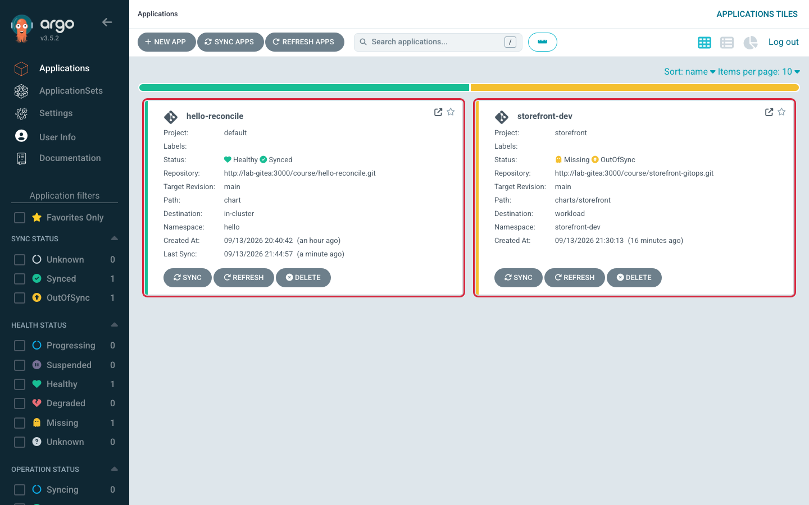

# Lab 3 · Module 1 — Get Ready to Deploy Storefront

> **Day 1 · Lab 3 · Module 1 of 4 · ~8 minutes**
> **Goal:** verify that Argo CD is ready to deploy storefront, understand why the app is not running yet, and know where to make the changes that follow.

## Before you begin — the deployment is ready, but waiting

Imagine opening Argo CD and seeing a storefront Application—but there is no storefront to visit. Is something broken?

**At this point in the lab, that is exactly what you should see.** In Lab 2, you connected the repository, registered the workload cluster, and created the instructions Argo CD needs. You have not yet told it to deploy storefront.

There are two different things to keep straight:

| Thing | What it is | Where it lives | Exists now? |
|---|---|---|---|
| **`storefront-dev` Application** | Instructions telling Argo CD what to read from Git and where to deploy it | Management cluster, in the `argocd` namespace | Yes |
| **Running storefront workload** | The Pods that run the app and the Service used to reach them | Workload cluster, in the `storefront-dev` namespace | No—Module 2 deploys these |

**This module is your preflight check.** You will verify the setup, locate the two repositories, and understand the release you will make next. Keep storefront unsynced for now: the first deployment belongs to Module 2.

Across Lab 3, you will deploy dev, create staging, try an updated app version in dev, and promote that version to staging. Later, you will explore drift and recover from failures. First, make sure everyone is starting from the same place.

---

## 1. Verify the starting checkpoint

`CP-lab-03` is the setup Lab 2 ended with. The check below confirms that Argo CD has its repository connection, workload cluster registration, `storefront` AppProject, and `storefront-dev` Application.

The **AppProject** contains Argo CD's rules for which sources and destinations this group of Applications may use. The **Application** selects the particular source and destination for dev.

**▶ Run this in your lab terminal:**

```bash
source ~/argo-lab-env.sh
reset-lab.sh CP-lab-03 --verify-only --local
```

`--verify-only` checks the setup without resetting it.

**Expected output:**

```text
==> Verification for CP-lab-03
  PASS  Application hello-reconcile Synced/Healthy
  PASS  Application storefront-dev present (manual)
  PASS  Application team-a-guestbook absent
  PASS  AppProject team-a absent
  PASS  AppProject storefront present
  PASS  Secret in-cluster present
  PASS  Secret repo-storefront-gitops present
  PASS  Secret cluster-workload present
  PASS  Repository and cluster Secrets are exactly: in-cluster, repo-storefront-gitops, cluster-workload
  PASS  workload namespace storefront-prod present
  PASS  workload SA argocd-manager present
  PASS  workload RoleBinding argocd-deployer (storefront-prod) present

PASS CP-lab-03 is in the expected state.
```

**What to notice:** `Application storefront-dev present (manual)` means the deployment instructions exist and syncing requires your action. It does **not** mean the storefront Pods are running. The production namespace and permissions shown here are part of the prepared setup; you will work with dev and staging next.

If any row says **FAIL**, restore the checkpoint:

```bash
reset-lab.sh CP-lab-03 --local
```

**A full reset discards uncommitted lab work.** Save any work you want to keep before running it. Then rerun the verification command and confirm it passes.

---

## 2. Check the UI — why “Missing” is correct

**▶ Open the Argo CD Applications page. Do not click Sync yet.**

You should see:

| Application | Expected state | What it tells you |
|---|---|---|
| `hello-reconcile` | `Synced` / `Healthy` | The app from Lab 1 is still running as expected. |
| `storefront-dev` | `OutOfSync` / `Missing` | Argo CD has a desired deployment, but its workload resources have not been created yet. |
| `storefront-staging` | No tile | You will create this Application in Module 2. |

For storefront, the two status labels answer different questions:

- **`OutOfSync`: does the live cluster match the desired resources?** Not yet. Git describes resources that still need to be deployed.
- **`Missing`: are the expected workload resources present?** Not yet. The Application exists, but its workload has not been created.

Manual sync is the reason Argo CD is waiting. **Creating an Application gives Argo CD instructions; syncing tells it to apply those instructions to the destination cluster.**



*Figure SS-L3-01 — At `CP-lab-03`: `storefront-dev` is `OutOfSync` / `Missing`; no `storefront-staging` tile yet; `hello-reconcile` from Lab 1 still `Synced`/`Healthy`.*

<!-- CAPTURE-SPEC: SS-L3-01 — Applications list, environment check. State: CP-lab-03, route /applications. Highlight: storefront-dev OutOfSync+Missing; no storefront-staging tile. Argo CD v3.5.2. -->

**There is no running storefront to connect to yet.** Port-forwarding will not work at this checkpoint because the storefront Service and Pods do not exist. Module 2 provides the port-forward and `curl` commands immediately after the first successful deployment.

---

## 3. Find the two repositories — which file controls what?

You will make two kinds of change in this lab: change the instructions **Argo CD follows**, or change the **workload it deploys**. Each belongs in a different repository.

**▶ Confirm both repositories are in your home directory:**

```bash
cd ~
ls -d platform-config storefront-gitops
```

Lab 2 used `platform-config`. Session 4's optional Try It used `storefront-gitops`, so that second clone may still be missing.

**If `storefront-gitops` is missing, clone it:**

```bash
cd ~
git clone http://lab-gitea:3000/course/storefront-gitops.git
```

If `platform-config` is missing, return to Lab 2's clone/setup instructions and restore that working copy before continuing.

**Use this table when deciding where to edit:**

| You want to change… | Edit this repository | How the change takes effect in this lab |
|---|---|---|
| Which values file an Application uses, its destination, or its sync policy | `platform-config` | Commit, then apply the Application manifest to the management cluster with `kubectl`. |
| Which destinations the `storefront` AppProject allows | `platform-config` | Commit, then apply the AppProject manifest to the management cluster with `kubectl`. |
| The app's image version, message, replica count, or chart templates | `storefront-gitops` | Commit and push. Argo CD reads the new commit on refresh; sync to deploy it. |

**Why the different commands?** In this lab, you apply the `platform-config` manifests yourself. The storefront Application reads its chart and values from `storefront-gitops`, so those changes must be pushed for Argo CD to see them. A local commit alone does not update the running app.

**Where to run commands:**

- Commands using paths such as `platform-config/applications/…` run from your home directory (`~`).
- Git commands run inside the repository you are changing.
- The `helm template` command in Module 2 runs from `~/storefront-gitops`.

**Quick check:** where would you change the image version? Where would you enable automatic sync?

*Answer: the image version goes in `storefront-gitops`; the Application's sync policy goes in `platform-config`.*

---

## 4. Understand the next release — dev first, then staging

Suppose dev is running a new version successfully. How do you ask staging to run that same version?

In this lab, **promotion means changing staging's image tag to the version you checked in dev**, then committing, pushing, and syncing. An **image tag** identifies the container image version to run, such as `6.15.0`.

Both environments use one **Helm chart**: templates for the Kubernetes resources. Each environment supplies its own **values file**: settings used to fill in those templates.

```text
storefront-gitops/
  charts/storefront/            # shared Kubernetes resource templates
  envs/dev/values.yaml          # dev's image tag, message, replica count
  envs/staging/values.yaml      # staging's image tag, message, replica count
  envs/prod/values.yaml         # production settings; not changed in Module 2
```

Here is the sequence you will carry out in Module 2:

| Stage | Dev image tag | Staging image tag |
|---|---|---|
| After the initial deployments | `6.14.1` | `6.14.1` |
| Try the update in dev | `6.15.0` | `6.14.1` |
| Promote the checked version to staging | `6.15.0` | `6.15.0` |

Staging keeps its own message and replica count. You change only its `image.tag` to select the same app version as dev. **You can promote the version without making every setting identical.**

The promotion commit records which version staging should run and can be reviewed or reverted. Argo CD then applies the updated desired state when you sync.

This is the concrete example behind [Session 4 · Module 3](../session-04/03-promotion-and-recovery.md)'s phrase “promotion is a moving pin, not a moving artifact.” No edits are needed in this section yet.

---

## ✅ Ready for Module 2?

You are ready when:

- The `CP-lab-03` verification passes.
- `storefront-dev` is `OutOfSync` / `Missing` with manual sync, and there is no staging Application yet.
- Both repositories are available in your home directory.
- You know that `platform-config` holds Argo CD's instructions and rules, while `storefront-gitops` holds the chart and environment settings.

**Next, you will press Sync and turn the existing deployment instructions into a running storefront.** Then you will check the app's response, create staging, and promote an updated version.

**→ Next:** [02 — Deploy and promote](02-deploy-and-promote.md)
