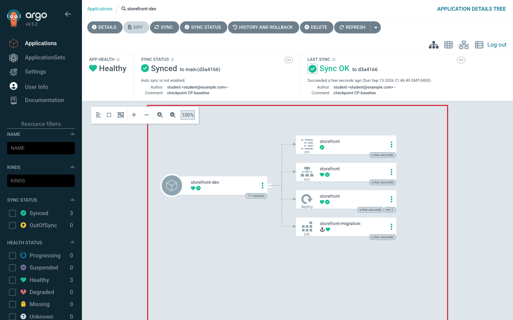
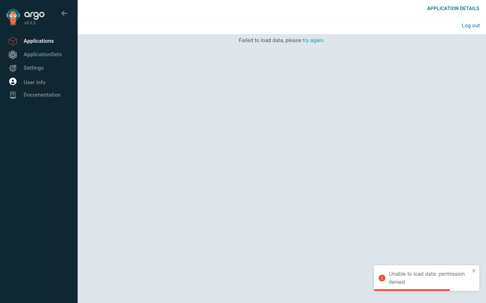

# Lab 3 · Module 2 — Deploy and Promote

> **Day 1 · Lab 3 · Module 2 of 4 · ~20 minutes**
> **Goal:** get storefront running in dev, create a separate staging environment, and deploy the same updated app version to both.

## Before you begin — what you are building

**What you already have**

In Lab 2, you gave Argo CD access to the Git repository and workload cluster. You also created an **Application** named `storefront-dev`: a Kubernetes object that tells Argo CD which chart and settings to read, and where to deploy them.

**The Application exists, but the storefront workload is not running yet.** Automatic sync is off, so Argo CD is waiting for you to press **Sync**. That is why you see `OutOfSync` / `Missing`.

**What you will build**

You will run two separate copies of storefront:

| Environment | Where the app runs | Settings used |
|---|---|---|
| Dev | `storefront-dev` namespace in the workload cluster | `envs/dev/values.yaml` |
| Staging | `storefront-staging` namespace in the workload cluster | `envs/staging/values.yaml` |

Dev is where you try an update first. Staging is a separate environment where you check that version before production. **In this lab, both environments share one workload cluster.** Each has its own namespace, running Pods, and Argo CD Application. Production is outside this module.

The Argo CD **Application objects live in the management cluster**; the storefront **Pods and Services live in the workload cluster**.

**The sequence**

1. **Deploy dev.** Sync the existing Application, then ask the running app for its message using `curl`.
2. **Create staging.** Create another Application using the same Helm chart with staging’s settings, then sync it.
3. **Try an update in dev.** Change dev’s image tag from `6.14.1` to `6.15.0`, push the Git change, and sync.
4. **Promote the update to staging.** Set staging’s image tag to the same `6.15.0`, push, and sync. Staging keeps its own message and replica count.

Along the way, you will see how Argo CD uses Helm to generate Kubernetes YAML and controls the order in which resources are deployed.

**Remember the two repositories**

| What you change | Repository | How the change takes effect in this lab |
|---|---|---|
| Argo CD’s Application or project rules | `platform-config` | Commit the changes, then apply those manifests to the management cluster with `kubectl`. |
| The chart or environment settings | `storefront-gitops` | Commit and push, then sync the Application after Argo CD sees the new commit. |

Run Git commands from inside the repository you are changing. Run commands using `platform-config/…` paths from your home directory (`~`). Run the local `helm template` command from `~/storefront-gitops`.

**Terminal setup:** use one terminal for commands. After deploying dev, open a second terminal for its port-forward; after deploying staging, open a third for staging’s port-forward. Run all terminals on the same machine. If you use a lab VM, connect each terminal to that same VM, because `localhost` means the machine where the command runs.

Throughout, **predict before you observe** — fill your prediction first, then run the step, then compare.

---

## Exercise 1 — Deploy dev and check how Argo CD uses Helm

> **🧭 What this exercise is for**
> - **In plain words:** you press **Sync** and watch Argo CD create the app on the workload cluster, in a set order. Then you prove that Argo CD used Helm only to *produce* the YAML — it did not run `helm install`, so Helm has no record of it.
> - **Think of it like:** Helm has a typewriter (it turns a chart plus values into finished YAML) and a filing cabinet (it records every install as a "release"). Argo CD uses the typewriter and delivers the pages itself. It never files anything in Helm's cabinet.
> - **Connects to:** [Session 4 · Module 1](../session-04/01-render-not-release.md) (render, not release) and [Session 4 · Module 2](../session-04/02-sync-ordering-and-drift.md) (a sync runs in order: PreSync hook, then waves).
> - **Big picture:** because there is no Helm release, `helm rollback` cannot help you under Argo CD. In this lab, you undo a change by updating Git and syncing again. Module 4 relies on this.

**Goal:** sync `storefront-dev` so the app runs on the workload cluster, watch the PreSync hook and sync waves go by in order, then prove — with evidence — that Argo CD did **not** create a Helm release.

**Difficulty / time:** Straightforward · ~10 minutes. **Starter state:** `storefront-dev` is `OutOfSync` / `Missing`, **manual** sync.

**▶ Predict first — the three states:**

| Stage | Desired (Git) | Rendered (manifests) | Live (workload cluster) |
|---|---|---|---|
| Right now (before sync) | chart + dev values | *?* | *?* |
| After Sync completes successfully | chart + dev values | *?* | *?* |

**Do it:**

1. Sync `storefront-dev` (UI **Sync**, or `argocd app sync storefront-dev`). Watch the resource tree apply.
2. Observe the order: the **PreSync** migration Job is a task that must finish successfully before the main resources are applied. **Sync waves** are numbered groups; lower numbers run first. After the Job succeeds, Argo CD applies the `ConfigMap` (wave `-1`), then the `Deployment` and `Service` (wave `0`). The Deployment goes `Progressing` → `Healthy`.
3. **▶ Predict, then run** the release check. A **Helm release** is Helm’s record of an installation. Argo CD uses Helm to generate YAML, then applies the resources itself—this is what **“render, not release”** means. Predict whether Helm will list a storefront release, then run:
   ```bash
   helm list -A --kube-context k3d-workload
   ```
4. **Verify the running app.** Wait until `storefront-dev` shows **`Synced` / `Healthy`**. The Service now exists, so you can open the temporary tunnel introduced in Module 1.

   **Terminal A — run this and leave it running:**

   ```bash
   kubectl --context k3d-workload -n storefront-dev port-forward svc/storefront 9898:9898
   ```

   Wait for `Forwarding from 127.0.0.1:9898`.

   **Terminal B — use your command terminal (or another tab on the same machine) and run:**

   ```bash
   curl -s localhost:9898 | grep -o '"message": *"[^"]*"'
   ```

   **Expected:**

   ```text
   "message": "storefront DEV"
   ```

   Your request goes through the tunnel to the storefront app in the **workload cluster**. This confirms that the running app serves the expected dev message.

   Keep Terminal A open for later checks. **Ctrl-C** stops the tunnel. If a later deployment replaces the Pod and the tunnel stops working, rerun the port-forward command before using `curl` again.




*Figure SS-L3-02 — After E1: the PreSync migration Job completed; the Deployment is Synced / Healthy.*

**🔍 Notice:** the migration Job appears as a completed **PreSync** hook, separate from the main tree; ConfigMap/Deployment/Service are `Synced`; the app header reads **`Synced`** / **`Healthy`**.

<!-- CAPTURE-SPEC: SS-L3-02 — Application tree after first sync. State: after E1 sync. Highlight: completed PreSync Job; app Synced/Healthy. Argo CD v3.5.2. -->

**Success criterion:**

- `argocd app get storefront-dev` shows **`Synced`** / **`Healthy`**.
- `helm list -A --kube-context k3d-workload` returns **no storefront release** — and you can say in one sentence *why* that empty result is proof the model works (Argo CD ran `helm template`, not `helm install`).
- `curl` through the port-forward returns a message containing **`storefront DEV`**.

**Hints:**

- *Hint 1:* If Sync does nothing, confirm you are on `storefront-dev` and its sync is manual (it waits for you).
- *Hint 2:* If the Deployment stays `Progressing`, check `kubectl --context k3d-workload -n storefront-dev get pods` — wrong context is the usual cause of "nothing is there."
- *Hint 3:* The empty `helm list` is Session 4's one-sentence thesis.

### ✅ What you should take away from E1

- **A sync is ordered.** The PreSync hook (the migration Job) runs first, then lower waves before higher ones.
- **An empty `helm list` is proof, not a problem.** Argo CD rendered the chart with Helm and applied the result itself, so no Helm release exists.
- **`Synced` + `Healthy` + the right `curl` answer** is the full evidence that a deployment really worked: matches Git, is running, and serves the expected message.

---

## Exercise 2 — Deploy staging from its own values file, then promote a tag

> **🧭 What this exercise is for**
> - **In plain words:** you create a second Application, `storefront-staging`, that uses the **same chart** with **staging's values file**. Then you "promote" a version: write the image tag dev is running into staging's values file and sync.
> - **Think of it like:** one recipe (the chart), two kitchens (dev and staging), and a separate recipe card for each kitchen (the values files). Promotion is copying one line from the dev card to the staging card.
> - **Connects to:** [Session 4 · Module 3](../session-04/03-promotion-and-recovery.md) — directory-per-environment layout and "promotion is a moving pin." It also reuses the AppProject rules you wrote in Lab 2.
> - **Big picture:** the promotion is **one small commit** that anyone can read, review, and revert. That is the whole reason GitOps teams can move fast without losing track of what changed.

**Goal:** author a **second** Application, `storefront-staging`, that renders the *same* chart with the *staging* values file; then **promote** the image tag `dev` has been running into staging as a single reviewable commit.

**Difficulty / time:** Moderate · ~10 minutes. **Starter state:** `storefront-dev` `Synced`/`Healthy`; no `storefront-staging` yet; reference is `platform-config/applications/storefront-dev.yaml`.

**What "correct" looks like:** a new `storefront-staging` Application that reads `envs/staging/values.yaml`, deploys to the `storefront-staging` namespace, and reaches `Synced`/`Healthy` with **2** replicas and UI message **`storefront STAGING`**.

**▶ Predict first — rendered differences.** Compare dev’s values file with staging’s values file, and compare the Applications’ destinations. Predict which differ: namespace, replica count, UI message, UI color, image tag.

**Do it (produce the manifest yourself):**

1. Create `platform-config/applications/storefront-staging.yaml`, modeled on dev. Change only what must change for staging.
2. **The guardrail step (do not skip):** the `storefront` AppProject permits **only** `storefront-dev`. Widen `platform-config/projects/storefront.yaml` to also permit the `storefront-staging` namespace. If you apply the Application first, `kubectl` still prints `created` — but Argo CD refuses to work with it: the app shows `Unknown` / `Unknown` with an `InvalidSpecError` condition (see Troubleshooting).
3. Commit both files, then apply to the **management** cluster (run these from your home directory, where both clones live):
   ```bash
   kubectl --context k3d-mgmt -n argocd apply -f platform-config/projects/storefront.yaml
   kubectl --context k3d-mgmt -n argocd apply -f platform-config/applications/storefront-staging.yaml
   ```
4. Sync `storefront-staging` and wait for **`Synced` / `Healthy`**. Open **Terminal C** on the same machine and leave this staging tunnel running:

   ```bash
   kubectl --context k3d-workload -n storefront-staging port-forward svc/storefront 9899:9898
   ```

   Local port **9899** reaches staging; local port **9898** still reaches dev. Both apps listen on port **9898** inside their respective Pods.

   From your command terminal, check staging:

   ```bash
   curl -s localhost:9899 | grep -o '"message": *"[^"]*"'
   ```

   **Expected:**

   ```text
   "message": "storefront STAGING"
   ```

   Verify the replica count:

   ```bash
   kubectl --context k3d-workload -n storefront-staging get deploy storefront
   ```

   **Expected:** the `READY` column shows `2/2`.


> **💡 Why the guardrail step exists.** In Lab 2 you wrote the AppProject to allow exactly one namespace. A new environment is a new destination, so the rules must be widened on purpose, in a commit. A fence that grows only by reviewed changes is the point of having one.

**Now promote a tag.** Both environments start on podinfo **`6.14.1`**. The next release, **`6.15.0`**, is ready to be validated in `dev`:

1. In `storefront-gitops`, set `image.tag: "6.15.0"` in `envs/dev/values.yaml`, commit, push, and sync `storefront-dev`. Wait for **`Synced` / `Healthy`**. Restart dev’s port-forward if it stopped working when the Pod was replaced, then confirm the new version:
   ```bash
   curl -s localhost:9898 | grep version
   ```
   **Expected:**
   ```text
     "version": "6.15.0",
   ```
2. **Promote** by making the *same* one-line change to `envs/staging/values.yaml`, commit, push. Before syncing, render locally to see the new tag:
   ```bash
   helm template storefront charts/storefront -f envs/staging/values.yaml | grep 'image:'
   ```
   **Expected** (the second image belongs to the migration Job, which does not change):
   ```text
             image: "stefanprodan/podinfo:6.15.0"
             image: busybox:1.37.0
   ```
3. Sync `storefront-staging` and wait for **`Synced` / `Healthy`**. Restart staging’s port-forward if it stopped working when the Pod was replaced, then check the running version:

   ```bash
   curl -s localhost:9899 | grep version
   ```

   **Expected:** `"version": "6.15.0"`.


> **Environment note:** a new tag means a new container image on the workload cluster. Your classroom pre-loads both `stefanprodan/podinfo:6.14.1` and `stefanprodan/podinfo:6.15.0`, so this promotion downloads nothing. If a new Pod sits in `ImagePullBackOff`, the tag is mistyped or was never pre-loaded. Recovery is in Troubleshooting, and it is itself a revert-vs-roll-forward lesson.



*Figure SS-L3-03 — After E2: `storefront-staging` → **Details** → **Parameters**. VALUES FILES is `../../envs/staging/values.yaml`; `image.tag` is `6.15.0` after the promotion; `replicaCount` is `2`; `ui.message` is `storefront STAGING`.*

<!-- CAPTURE-SPEC: SS-L3-03 — storefront-staging Details → PARAMETERS. State: after E2 promotion and staging sync. Highlight: VALUES FILES ../../envs/staging/values.yaml; image.tag 6.15.0; replicaCount 2. Argo CD v3.5.2. -->

**Success criterion:**

- `argocd app list` shows **both** apps `Synced` / `Healthy`.
- `curl` against staging returns **`storefront STAGING`** and version **`6.15.0`**, and `kubectl --context k3d-workload -n storefront-staging get deploy storefront` shows `2/2`.
- Staging's `image.tag` matches dev's (`6.15.0`), and `git log --oneline` on `storefront-gitops` shows the dev change and the promotion as two separate commits.

**Hints:**

- *Hint 1:* The `helm.valueFiles` path is *relative to the chart path* (`charts/storefront`) — count the `../` to the sibling env directory.
- *Hint 2:* A project error on the new Application means you skipped the AppProject destination step.
- *Hint 3:* "Promote a number" literally: the *only* changed line in `envs/staging/values.yaml` is the `image.tag`.

### ✅ What you should take away from E2

- **One chart, many environments.** Environments differ only by their values file (and the Application that points at it).
- **A new environment needs the AppProject's permission first.** The fence from Lab 2 blocks anything you did not allow.
- **Promotion is a one-line commit** that moves a version number into the next environment. You can see it in `git log`, review it, and revert it.

---

## ✅ Key takeaways from this module

- **Syncing runs in order:** PreSync hook first, then waves from low to high.
- **Argo CD renders Helm charts but never creates Helm releases** — so `helm list` is empty and `helm rollback` has nothing to roll back.
- **A second environment is a second Application using the same chart with a different values file**, and the AppProject must allow its namespace.
- **Promotion is a small, reviewable Git change to a version number** — not a copy of files between servers.

**→ Next:** [03 — Drift and self-heal](03-drift-and-self-heal.md)
