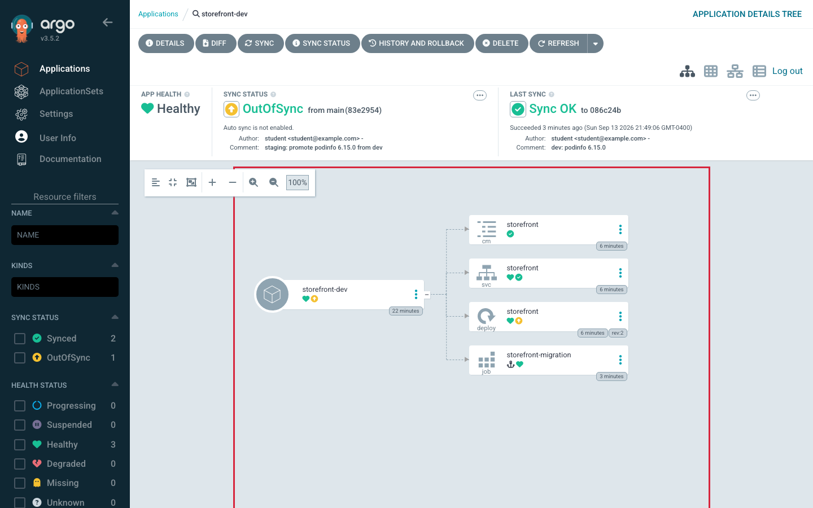
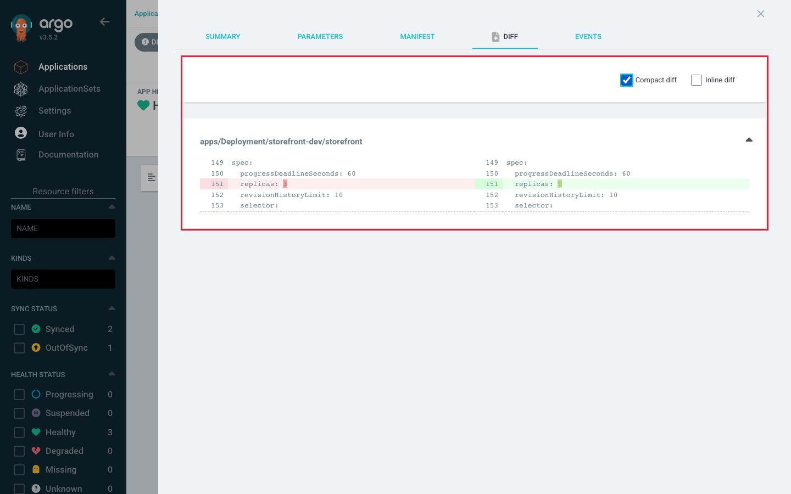
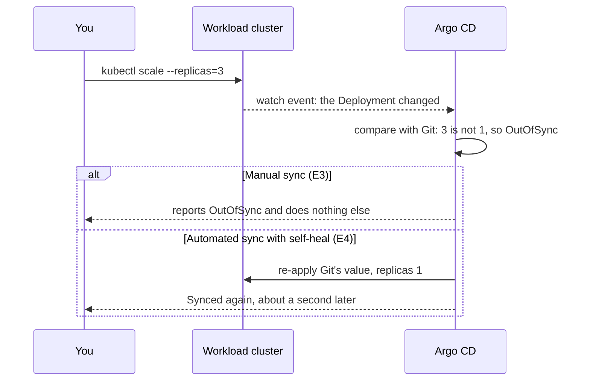
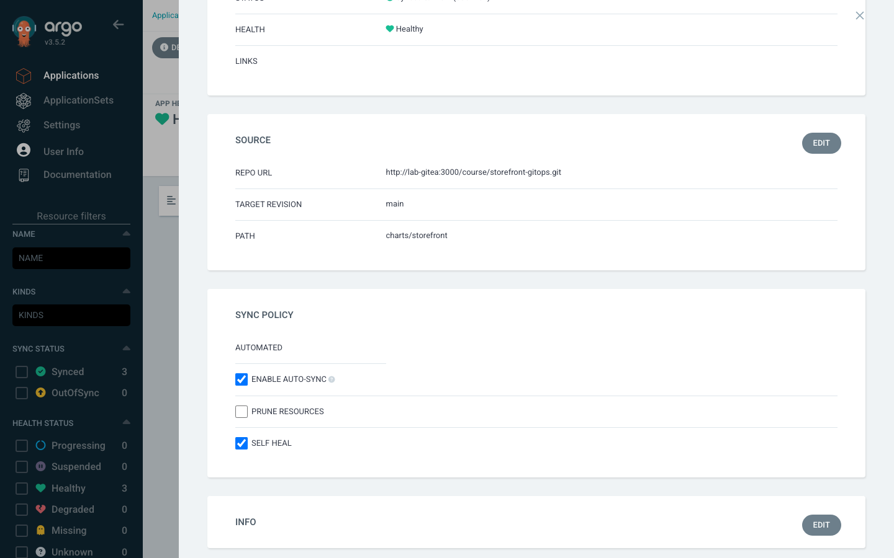
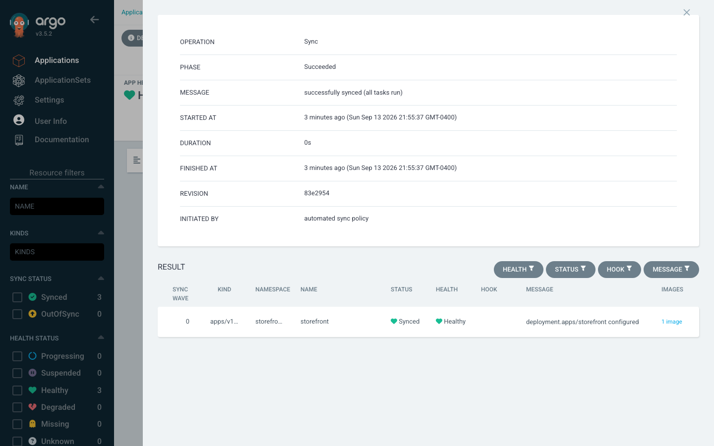

# Lab 3 · Module 3 — Drift and Self-Heal

> **Day 1 · Lab 3 · Module 3 of 4 · ~20 minutes**
> **Goal:** introduce live drift under manual sync and predict which axis moves (**E3**); then turn on safe automated sync + self-heal and watch it outlive an edit (**E4**).

> **🗺️ Where this module fits.** Your app is deployed and matches Git. Now someone changes the cluster by hand. E3 shows what Argo CD does about that when sync is manual (it tells you, and does nothing). E4 turns on automatic correction and shows what "Git wins" feels like — including why that can surprise you during an incident.

---

## Exercise 3 — Introduce live drift under manual sync

> **🧭 What this exercise is for**
> - **In plain words:** **drift** means the live cluster no longer matches Git because someone changed it directly. You create drift on purpose (scale the app by hand), then check which of Argo CD's two statuses changes.
> - **Think of it like:** a thermostat set to 20°. Someone opens a window. The display now shows the room is not at 20° — but in manual mode, the thermostat does not turn the heating on. It reports; it does not act.
> - **Connects to:** [Session 2 · Module 3](../session-02/03-sync-vs-health.md) — sync ("does it match Git?") and health ("is it working?") are separate questions; and [Session 4 · Module 2](../session-04/02-sync-ordering-and-drift.md) — "drift is discovered, not prevented": your edit goes through, and Argo CD notices it a moment later.
> - **Big picture:** in a real incident you need to tell "someone changed it" from "it is broken". Which status moved tells you which one you have.

**Goal:** change the running cluster *directly* (behind Argo CD's back) and predict, before you look, **which** status axis moves — and confirm that under manual sync, nothing reverts on its own.

**Difficulty / time:** Straightforward · ~8 minutes. **Starter state:** `storefront-dev` `Synced`/`Healthy`, still **manual** sync.

**▶ Predict first:**

| After you scale the Deployment on the cluster… | Sync status | Health status | Reverts on its own? |
|---|---|---|---|
| *your prediction* | `Synced` or `OutOfSync`? | `Healthy` or `Degraded`? | yes / no |

**Do it:**

1. Scale the live Deployment on the **workload** cluster:
   ```bash
   kubectl --context k3d-workload -n storefront-dev scale deploy/storefront --replicas=3
   ```
2. In the UI, open `storefront-dev` and read both badges. Click **Diff**, then tick **Compact diff** so the panel shows only the lines that differ (the full view starts at the top of the manifest, far above the changed field).
3. Wait through a reconciliation interval (this environment checks Git every **60 seconds**). Watch whether Argo CD does anything about the extra replicas.



*Figure SS-L3-04 — After E3: the Deployment is `OutOfSync` (live replicas ≠ Git) but still `Healthy`.*



*Figure SS-L3-05 — **Diff** with **Compact diff** ticked: the Deployment's live `replicas: 3` (left) against the desired `replicas: 1` (right). That one field is all Argo CD sees as drift.*

**🔍 Notice:** the app header shows `OutOfSync` within a second or two. Argo CD keeps a live watch on every object it manages, so a hand edit is noticed almost at once; the 60-second timer is for checking *Git* for new commits. Health may read `Progressing` for a few seconds while the two extra Pods start, then settles on **`Healthy`**: three replicas is a working app, just not the *desired* one. Nothing changes over the next minute: manual sync reports drift, it does not correct it.

<!-- CAPTURE-SPEC: SS-L3-04/05 — Tree + diff after drift. State: after scaling replicas=3. Highlight: Deployment OutOfSync, health Healthy; Diff with Compact diff ticked, replicas 3 vs 1. Argo CD v3.5.2. -->

**Success criterion:**
- `argocd app get storefront-dev` shows **`OutOfSync`** but **`Healthy`**, and *stays* that way across at least one 60-second interval.
- You can state in one sentence why the health axis did **not** move.

**Hints:**
- *Hint 1:* The badge normally changes within a second or two. If it still says `Synced`, click **Refresh**, which makes Argo CD compare again right now.
- *Hint 2:* If you see no live Pods, you scaled the wrong context. Confirm with `kubectl --context k3d-workload -n storefront-dev get deploy storefront`.

### ✅ What you should take away from E3

- **Drift changes the sync status, not the health status.** Three working replicas are still healthy — they just are not what Git asked for.
- **The diff shows exactly which field drifted** (`spec.replicas`), and nothing else.
- **With manual sync, Argo CD reports drift but leaves it alone.** Someone has to decide to sync.

---

## Exercise 4 — Configure safe automated sync and self-healing

> **🧭 What this exercise is for**
> - **In plain words:** you switch `storefront-dev` to **automated sync with self-heal**. Now when someone changes the cluster by hand, Argo CD puts it back to match Git. You leave **prune** off on purpose, because prune *deletes* things.
> - **Think of it like:** switching the thermostat to automatic. Open the window and it turns the heating on until the room is back at 20°. If you want 22°, you change the setting (Git) — fighting the thermostat by opening more windows does not work.
> - **Connects to:** [Session 4 · Module 2](../session-04/02-sync-ordering-and-drift.md) — "turn on self-heal early; turn on prune late."
> - **Big picture:** once self-heal is on, **Git is the only lasting way to change the app.** That is great for consistency and surprising at 2 a.m. The debrief at the end of this exercise is about exactly that moment.

**Goal:** turn on automated sync with **self-heal** so the cluster is held to Git — but leave **prune off**, deliberately. Then repeat the drift and watch self-heal outlive your edit. Finally, protect one resource from future pruning.

**Difficulty / time:** Moderate · ~12 minutes. **Starter state:** `storefront-dev` `OutOfSync`/`Healthy` (3 replicas), manual sync. First sync it by hand to return to `1` replica and `Synced`.

**The same hand edit under the two policies:**



**Why prune stays off.** Self-heal's worst case is an *argument* (re-applies desired state — reversible). Prune's worst case is a *deletion* (removes anything that leaves Git — a renamed directory, a template that renders nothing). Safe adoption order: **self-heal early, prune late.**

**Do it (produce the change yourself):**

1. Edit the `storefront-dev` Application in `platform-config` to add a `syncPolicy.automated` block with **self-heal on** and **prune off** (you decide the two boolean fields).
2. Commit, then apply:
   ```bash
   kubectl --context k3d-mgmt -n argocd apply -f platform-config/applications/storefront-dev.yaml
   ```
3. Repeat the drift (`kubectl … scale … --replicas=3`). **▶ Predict how long** until it reverts — think back to how quickly E3's scale showed up as `OutOfSync` — then watch `kubectl --context k3d-workload -n storefront-dev get deploy storefront`.
4. Try the edit a second time. Watch it be undone again. Then click **Sync Status** in the application's toolbar to see who started the sync that undid it. State the rule in your own words.

**Then protect one resource from future pruning.** In the chart templates, add the annotation `argocd.argoproj.io/sync-options: Prune=false` to **one** resource. Render with `helm template` to confirm it appears, commit, and push. Write one sentence explaining *why* you would protect a specific resource even though app-wide prune is already off.

> **Expect staging to go `OutOfSync` now.** Both Applications render the same chart, so your annotation changes the desired state for dev *and* staging. Dev has auto-sync on and applies it within seconds. Staging is still manual, so it shows `OutOfSync` on the resource you annotated until you sync it. That is correct; you can sync `storefront-staging` now, or leave it for Module 4.



*Figure SS-L3-06 — After E4: `storefront-dev` → **Details** → **Summary** → **SYNC POLICY**. **ENABLE AUTO-SYNC** and **SELF HEAL** are ticked; **PRUNE RESOURCES** is not, on purpose.*



*Figure SS-L3-07 — After re-introducing drift, the **Sync Status** panel: **INITIATED BY** reads **automated sync policy**, not you. **RESULT** lists only the Deployment, the one object that drifted.*

**🔍 Notice:** the revert takes about a second, not a minute. Argo CD watches the live objects it manages, so it notices your scale at once, and self-heal puts Git's value back right away. The 60-second interval is how often Argo CD checks **Git** for new commits; it has nothing to do with how fast self-heal answers a hand edit. Self-heal re-applied only the object that drifted: the migration hook did not run again.

<!-- CAPTURE-SPEC: SS-L3-06/07 — SYNC POLICY box + Sync Status panel. State: after E4's apply and a reverted scale, before the Prune=false commit. Highlight: ENABLE AUTO-SYNC and SELF HEAL ticked, PRUNE RESOURCES unticked; INITIATED BY automated sync policy. Argo CD v3.5.2. -->

**Success criterion:**
- After you scale to `3`, the Deployment returns to **1** on its own, attributed to the **automated policy**.
- The sync policy shows **automated + self-heal on, prune off**.
- Your `Prune=false` annotation appears in `helm template` output on exactly one resource, with a one-sentence justification.

**Hints:**
- *Hint 1:* The two fields live under `spec.syncPolicy.automated` — one re-applies drift, one deletes what left Git.
- *Hint 2:* If self-heal seems not to fire, check that your change reached Argo CD: `argocd app get storefront-dev | grep "Sync Policy"` should print `Sync Policy:        Automated`. If it prints `Manual`, you committed the file but did not apply it with `kubectl`.
- *Hint 3:* A good reason for per-resource `Prune=false` is defense-in-depth — it keeps that resource safe even if someone enables app-wide prune later.

**Debrief — a decision, not a rule.** You have watched self-heal undo a manual edit twice. Work this scenario:

> *It is 2 a.m. Production needs **10 replicas right now**, and self-heal is on. You scale — and a second later it snaps back to 1. What do you do?*

Write your answer before reading on. The wrong answer is to keep scaling and fight the loop. Two are defensible: **disable automated sync on that one Application, stabilize, then commit the real number** — or **commit `replicas: 10` first and let the sync carry it.** The point is *why*: **Git wins because a human turned on a switch that says Git wins.** Self-heal is a policy about who wins ties, not a safety feature — naming it that way lets you make the right call at 2 a.m. instead of scaling five times.

### ✅ What you should take away from E4

- **Self-heal undoes hand edits.** Your `kubectl scale` worked for a moment, then Argo CD put the cluster back to match Git.
- **The reverting sync is labelled as started by the automated policy**, so you can always tell who changed it back.
- **Prune stays off until you trust it**, because prune deletes. `Prune=false` on one resource protects it even if someone turns prune on later.
- **With self-heal on, change Git — not the cluster.** In an emergency, turn automation off for that one app first, or commit the change.

---

## ✅ Key takeaways from this module

- **Drift = the cluster no longer matches Git because someone changed it directly.** It shows up as `OutOfSync`, while health can stay `Healthy`.
- **Manual sync reports drift; automated sync with self-heal corrects it.**
- **Self-heal early, prune late.** Self-heal's worst case can be undone; prune's worst case is a deletion.
- **Git wins because someone chose that Git should win.** When self-heal is on, the lasting fix is always a commit.

**→ Next:** [04 — Break it two ways and recover](04-break-and-recover.md)
