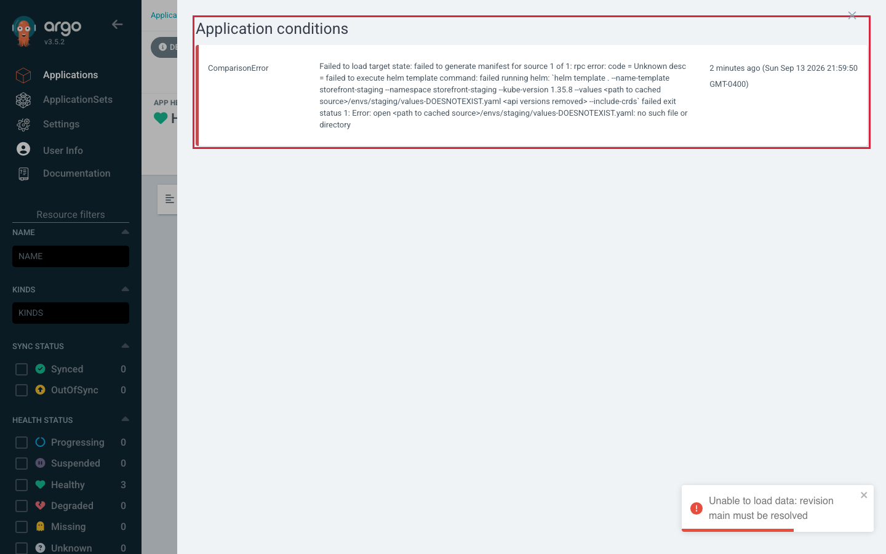
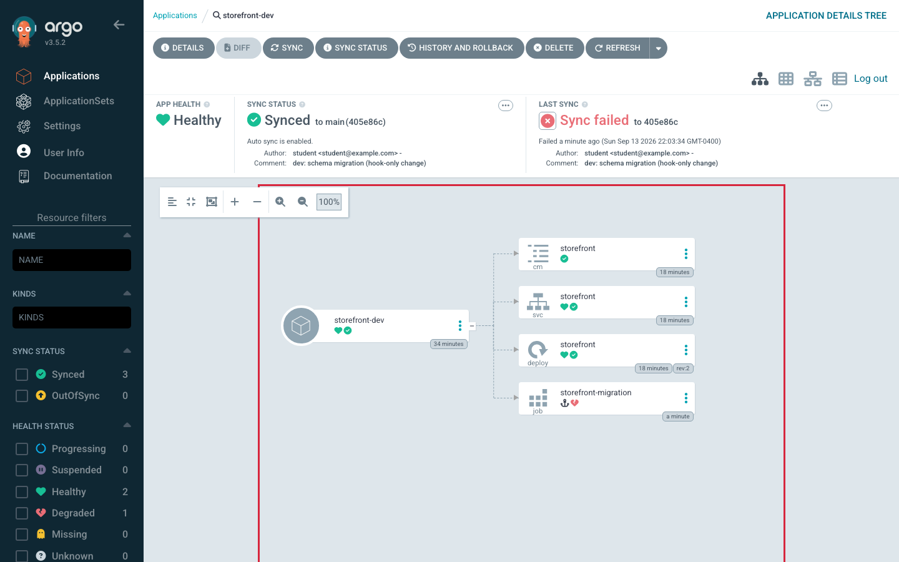
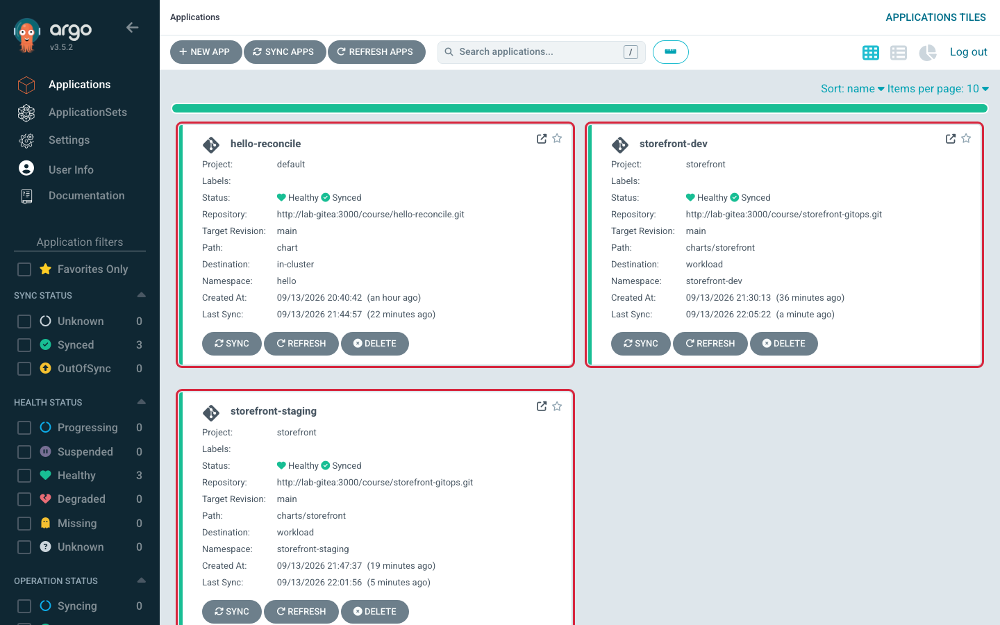

# Lab 3 · Module 4 — Break It Two Ways and Recover

> **Day 1 · Lab 3 · Module 4 of 4 · ~15 minutes**
> **Goal:** introduce a rendering failure and an ordering failure, notice they surface in **different places**, recover both through Git (**E5**), then confirm the Day 1 outcome.

> **🗺️ Where this module fits.** So far every change worked. Now you make two changes that fail in two *different* ways, learn where each one shows its evidence, and fix both through Git. This is the core on-call skill the Day 2 Capstone tests: **find the layer that failed before you touch anything.**

---

## Exercise 5 — Break it two ways, and recover through Git

**Difficulty / time:** Challenging · ~15 minutes.

> **🧭 What this exercise is for**
> - **In plain words:** there are two very different ways a deployment can fail. **Rendering failure:** Argo CD cannot even produce the YAML from Git, so nothing is sent to the cluster. **Ordering (sync) failure:** the YAML is fine, but a step fails while it is being applied, so the later steps never run.
> - **Think of it like:** a recipe you cannot read (a page is missing — the kitchen never starts cooking) versus a recipe you can read but whose first step fails (the oven will not heat — so nothing that comes after gets cooked).
> - **Connects to:** [Session 4 · Module 2](../session-04/02-sync-ordering-and-drift.md) (a PreSync hook must succeed before anything else runs) and [Session 4 · Module 3](../session-04/03-promotion-and-recovery.md) (roll forward or revert — always through Git).
> - **Big picture:** both failures look "red" in the UI. Knowing *where* to look — the Application's **conditions** or the **sync result** — tells you which component failed and which repo holds the fix.

> **The one distinction to hold onto:** a **rendering** failure means the repo-server could not turn Git into manifests at all (it shows as an Application **condition / `ComparisonError`** — nothing gets applied). A **sync/ordering** failure means the manifests rendered fine but something failed *while applying* (it shows inside the **sync result** — a hook or wave failed). Same redness, different owner, different fix.

### Part A — a rendering failure (break the *reference*, not the YAML)

**Do it:** in `platform-config`, edit the `storefront-staging` Application so its `helm.valueFiles` points at a file that **does not exist** (e.g. append `-DOESNOTEXIST` to the filename). Commit, apply to the management cluster, refresh `storefront-staging`.

**▶ Predict first:** will this show as a *comparison/condition* error on the Application, or a *failed sync*? Which component — repo-server or controller — failed?



*Figure SS-L3-08 — After Part A: the **Application conditions** panel (click **APP CONDITIONS — 1 Error** in the header) shows a **ComparisonError**. The repo-server could not render because the referenced values file is missing.*

**🔍 Notice:** the header shows **APP CONDITIONS — 1 Error**; click it to read the condition. The error is an Application **condition** (`ComparisonError`) at the app level — **not** inside a sync result. The message ends by naming the **missing values file**: `open <path to cached source>/envs/staging/values-DOESNOTEXIST.yaml: no such file or directory`. Sync status turns `Unknown` (with nothing rendered, there is nothing to compare), while health stays `Healthy`: nothing on the cluster changed, because there was nothing to apply. A pop-up saying `Unable to load data: revision main must be resolved` may also appear; it is the same rendering failure, seen by the UI.

<!-- CAPTURE-SPEC: SS-L3-08 — APP CONDITIONS panel. State: after Part A broken valueFiles, applied, refreshed. Highlight: ComparisonError row naming the missing values file. Argo CD v3.5.2. -->

**Recover:** restore the correct `valueFiles` reference **through Git** (a `git revert` of the breaking commit is cleanest), apply, refresh. Confirm the `ComparisonError` clears. If `storefront-staging` then shows `OutOfSync` on its Service, that is your E4 `Prune=false` commit, which staging (still manual sync) has not applied yet: sync `storefront-staging` to finish.

> **✅ Part A in one line:** the Application pointed at a file that is not there, so the **repo-server** could not render anything. The evidence is an Application **condition**, the cluster was never touched, and the fix lived in **`platform-config`**.

### Part B — an ordering failure (a gate that never opens)

The chart ships a **PreSync** "database migration" Job. When `migration.shouldFail` is `true`, the Job runs `exit 1` and, with `backoffLimit: 0`, fails immediately and permanently. Since it is a **PreSync** hook, the **Sync** phase after it — your `ConfigMap`, `Deployment`, `Service` — **never runs**.

**One fact you need first: a hook is not one of the resources Argo CD compares.** Argo CD runs the migration Job *during* a sync, but it leaves the Job out when it asks "does the cluster match Git?". So a commit that changes only the hook leaves the app `Synced` — and automated sync starts only when an app is `OutOfSync`. To run this migration, you start the sync yourself.

**Do it:**

1. In `storefront-gitops`, add this block to the end of `envs/dev/values.yaml`, then commit and push:
   ```yaml
   migration:
     shouldFail: true
   ```
2. **▶ Predict first:** `storefront-dev` has auto-sync on. Will Argo CD run this commit on its own? Then check:
   ```bash
   argocd app get storefront-dev --refresh | grep -E "Sync Status|Health Status"
   ```
   **Expected** (your commit ID will differ), and it stays this way:
   ```text
   Sync Status:        Synced to main (405e86c)
   Health Status:      Healthy
   ```

**▶ Predict first — before you start the sync: Job, Secret, or wave problem?**

| Symptom you are about to see | Hypothesis (Job / Secret / wave) | Where is the evidence? (hook result / diff / events) |
|---|---|---|
| The sync operation is **Failed** | *?* | *?* |
| The `ConfigMap`, `Service`, and `Deployment` rows have an **empty MESSAGE** (nothing was applied to them) | *?* | *?* |

3. Start the sync explicitly (UI **Sync**, or the CLI):
   ```bash
   argocd app sync storefront-dev
   ```
   **Expected** (trimmed; it finishes in about 6 seconds):
   ```text
   Operation:          Sync
   Sync Revision:      405e86c4066bd8bfa10de7e3065dffce009c33a5
   Phase:              Failed
   ...
   Message:            one or more synchronization tasks completed unsuccessfully

   GROUP  KIND        NAMESPACE       NAME                  STATUS  HEALTH   HOOK     MESSAGE
   batch  Job         storefront-dev  storefront-migration  Failed  Synced   PreSync  Job has reached the specified backoff limit
          ConfigMap   storefront-dev  storefront            Synced
          Service     storefront-dev  storefront            Synced  Healthy
   apps   Deployment  storefront-dev  storefront            Synced  Healthy
   {"level":"fatal","msg":"Operation has completed with phase: Failed",...}
   ```
   The last line is the CLI reporting the failed operation and exiting with an error; nothing crashed. To read the Job's own words: `kubectl --context k3d-workload -n storefront-dev logs job/storefront-migration`.



*Figure SS-L3-09 — After Part B's explicit sync: **LAST SYNC** reads **Sync failed**, the PreSync `storefront-migration` Job is red, and the app is still `Synced` / `Healthy`. This sync never touched the `ConfigMap`, `Service`, or `Deployment`.*

**🔍 Notice:** the PreSync Job node is red and **LAST SYNC** says **Sync failed** — the evidence is inside the **sync result**. There is no **APP CONDITIONS** error, unlike Part A. The app stays `Synced` / `Healthy`: nothing Argo CD compares has changed, and a failed hook does not count toward the app's health. The Sync-phase rows have no message because this sync never reached them — the gate never opened.

<!-- CAPTURE-SPEC: SS-L3-09 — storefront-dev tree after the explicit sync with shouldFail=true. Highlight: red PreSync Job; LAST SYNC Sync failed; app Synced/Healthy. Argo CD v3.5.2. -->

**Recover:** set `migration.shouldFail` back to `false` **through Git** (edit the line, or `git revert` your breaking commit), commit, and push. The fix is also a hook-only change, so the app stays `Synced` and nothing runs on its own. Run `argocd app sync storefront-dev` again, and watch the PreSync Job succeed and the waves apply in order.

> **In a real pipeline, the migration usually ships *with* a visible change** (a new image or setting). Then the app does go `OutOfSync`, and automated sync starts the failing sync for you. Three things surprise people at that point, and optional **Stretch 2** lets you see them: Argo CD **retries** a failed automated sync (up to 5 times by default); the retries keep using the **same commit**, even after you push a fix; and when it stops, the app shows a `SyncError` condition. `argocd app terminate-op storefront-dev` stops a sync that is still retrying.

> **✅ Part B in one line:** the chart rendered fine, but the **first step of the sync** (the PreSync Job) failed, so the steps after it never ran. The evidence is in the **sync result**, the owner is the **application-controller** running the sync, and the fix lived in **`storefront-gitops`**. A change that touches only a hook needs an explicit sync, because hooks are not compared.

**Then justify your choice — revert vs roll forward.** For each part, write one line: did you **revert** (restore last known-good because you were not yet sure) or **roll forward** (commit a fix because you understood it)? Rule: revert when you do not know why; roll forward when you do — and `git revert` leaves a reviewable receipt either way.



*Figure SS-L3-10 — After E5: the Applications list shows `storefront-dev` and `storefront-staging` back to `Synced` / `Healthy`, beside `hello-reconcile` from Lab 1. Your recovery commits are in each repo's `git log`, not on this screen.*

<!-- CAPTURE-SPEC: SS-L3-10 — Applications list, recovered. State: after E5 recovery. Highlight: dev and staging tiles Synced+Healthy. Argo CD v3.5.2. -->

**Success criterion:**
- After Part A, `storefront-staging` has **no** `ComparisonError` and is `Synced`/`Healthy`.
- After Part B, your explicit sync of the fix **succeeds** (the PreSync Job shows `Succeeded`), the app is `Synced`/`Healthy`, and `argocd app history storefront-dev` lists your fix commit as a new entry. (History records successful syncs only, so the failed attempt is not listed.)
- You can name, for each part, **which component** owned the failure and **which repo** held the fix.

**Hints:**
- *Hint 1:* Part A — read the Application's **conditions**, not the sync result. A rendering failure never reaches the sync result.
- *Hint 2:* Part B — the failing thing is a Job, but the *cause* is a PreSync gate blocking everything after it. Ask "what did this Job stop from running?"
- *Hint 3:* Part B — if nothing happens after you push, that is expected: a hook-only change leaves the app `Synced`, so start the sync yourself. If the CLI answers `another operation is already in progress`, an automated sync is still running or retrying (see Troubleshooting).

---

## Troubleshooting

| Symptom | Likely cause | Fix |
|---|---|---|
| `kubectl` shows "nothing there" | Wrong `--context` | `--context k3d-workload` for workload resources, `k3d-mgmt` for Argo CD's objects — the top self-inflicted failure |
| `storefront-staging` shows `Unknown` / `Unknown` with *`InvalidSpecError … do not match any of the allowed destinations in project 'storefront'`* (even though `kubectl apply` said `created`) | AppProject still permits only `storefront-dev` | Add the `storefront-staging` destination to `projects/storefront.yaml`, commit, re-apply the project |
| **`ComparisonError`** condition, no sync result | A **rendering** failure (missing `valueFiles`/required value). Owner: repo-server | Fix the reference in its repo, refresh; nothing was applied |
| **Failed sync operation** with a red hook | A **sync/ordering** failure. Owner: application-controller | Read the sync result and the hook's logs; fix desired state in Git, push, then sync (a hook-only fix does not start auto-sync) |
| Self-heal "won't stay" after a manual edit | Working as configured | The durable change is a commit; during an incident disable auto-sync on that app, stabilize, then commit |
| A new **commit** takes up to a minute to show | Argo CD checks Git every 60 seconds | **Refresh** makes it check Git now; **Hard Refresh** also re-renders the manifests |
| A **hand edit** shows `OutOfSync` within seconds | Argo CD watches the live objects it manages | Nothing to fix; that is how drift is noticed. With self-heal on, it is reverted just as fast |
| After promoting, a new Pod is in `ImagePullBackOff` and the Deployment turns `Degraded` | The tag is mistyped, or that image was never pre-loaded (the classroom pre-loads `6.14.1` and `6.15.0`) | `git revert` the promotion, push, sync (the old Pod keeps serving meanwhile); then fix the tag |
| Part B: you pushed, and nothing happened | A change to a hook alone does not make the app `OutOfSync`, so automated sync never starts | Run `argocd app sync storefront-dev` |
| The operation shows `Running` with `Retrying attempt #N`, your pushed fix is ignored, and a manual sync says `another operation is already in progress` | An **automated** sync failed and is retrying the **same** commit (5 retries by default) | `argocd app terminate-op storefront-dev`; automated sync then picks up your newest commit |
| A `SyncError` condition: `Failed last sync attempt to [<commit>] …` | An automated sync failed or was terminated; Argo CD will not try that exact commit again | Push a fix (a new commit); automated sync runs it |

---

## Checkpoint / validation — the Day 1 outcome

You have met the Day 1 outcome when **both** environments are healthy at your latest commit **and** you can say where you would look first for the four failure classes.

**▶ Do this now** (from your home directory):

```bash
argocd app list
kubectl --context k3d-mgmt -n argocd get applications storefront-dev storefront-staging \
  -o custom-columns='NAME:.metadata.name,SYNC:.status.sync.status,HEALTH:.status.health.status,REVISION:.status.sync.revision'
git -C storefront-gitops rev-parse HEAD
```

**Expected shape** of the last two commands (your commit IDs will differ):

```text
NAME                 SYNC     HEALTH    REVISION
storefront-dev       Synced   Healthy   a4963fa5a7232fae2d37bd6a93213376ff57ff91
storefront-staging   Synced   Healthy   a4963fa5a7232fae2d37bd6a93213376ff57ff91
a4963fa5a7232fae2d37bd6a93213376ff57ff91
```

`argocd app list` has no revision column: its `TARGET` column shows the branch (`main`). That is why the second command reads each Application's `status.sync.revision`, the commit Argo CD compared the app against.

Cross-check: (1) both `storefront-dev` and `storefront-staging` are `Synced`/`Healthy`; (2) both REVISION values equal the `git rev-parse HEAD` line; (3) each serves (`curl` returns `storefront DEV` / `storefront STAGING`).

**Then write a three-line note** for each failure class — *(a)* first place you'd look, *(b)* which component owns that layer, *(c)* which repo/object holds the fix:

| Failure class | You experienced it in… | Your three-line note |
|---|---|---|
| **Repository / access** | Lab 2 (repo would not connect) | *(a) … (b) … (c) …* |
| **Rendering** | E5 Part A (`ComparisonError`) | *(a) … (b) … (c) …* |
| **Synchronization / ordering** | E5 Part B (failed PreSync hook) | *(a) … (b) … (c) …* |
| **Health** | E1/E3 (health vs sync) | *(a) … (b) … (c) …* |

If you can produce those four notes without looking anything up, you have the diagnostic method Day 2 assumes.

> **You just used the troubleshooting method's first four steps** — validated the Git source/revision, validated access and rendering, compared rendered vs live, and inspected sync results/hooks/events. Session 7 names these and adds two more.

---

## ✅ Key takeaways

**From this module (E5):**

- **Two kinds of red, two places to look.** A **rendering** failure shows as an Application **condition** (`ComparisonError`) and nothing is applied. An **ordering** failure shows in the **sync result**, and later steps never run.
- **Find the owner before you fix.** Rendering belongs to the repo-server; applying belongs to the application-controller. The fix lives in whichever repo holds the broken input.
- **Recover through Git.** Revert when you do not yet know why; roll forward when you do. Both leave a record.
- **A change to a hook alone does not make an app `OutOfSync`,** so automated sync will not run it. Start that sync yourself.

**From the whole of Lab 3:**

- **`helm list` is empty and that is correct.** Argo CD uses Helm to produce YAML and applies it itself — there is no release to roll back, only a commit to revert.
- **Argo CD notices a hand edit within seconds, and a new commit within a minute.** It watches the live objects it manages, and it checks Git every 60 seconds here. **Refresh** makes it check Git now.
- **Sync and health are independent.** Scaling made the app `OutOfSync` but still `Healthy`. Which status moves tells you "changed" from "broken".
- **Self-heal outlives your hand edit.** Git wins because someone chose that Git should win.
- **Promotion is a one-line commit** that moves a version number to the next environment.
- **Find the layer, then fix it in Git** — never by hand-editing the cluster.

---

## Optional stretch challenges (outside the timebox)

1. **Rollback under auto-sync — predict, try it, explain it.** `storefront-dev` has auto-sync on. Predict first: will Argo CD let you roll it back to an older entry? Then try it, either in the UI (**History and Rollback** → the **⋮** menu on an older entry → **Rollback**) or with the CLI, using an ID from `argocd app history storefront-dev`:
   ```bash
   argocd app rollback storefront-dev <ID>
   ```
   Write two sentences: *why* is Argo CD's answer correct, and what is the GitOps-consistent way to "roll back"?

2. **Watch automated retries — and what they will not do.** Part B used a manual sync, which never retries. Automated syncs do. Predict first: when an automated sync fails, how many more times will Argo CD try, and with which commit?
   1. Add a `retry` block under `spec.syncPolicy` in `platform-config/applications/storefront-dev.yaml` (`limit: 2`, plus a `backoff` with `duration: 5s`, `factor: 2`, `maxDuration: 1m`). Commit it and apply it.
   2. Re-introduce the Part B failure **together with a visible change**, such as a new `ui.message`, so the app goes `OutOfSync` and automated sync starts on its own. Push, then refresh.
   3. Every few seconds, run `argocd app get storefront-dev --show-operation` and read the `Phase` and `Message` lines. When it stops, run `argocd app get storefront-dev` again and look for a condition.
   4. Push the fix (keep the new message). Do you need to do anything else?
   5. Now `git revert` the `retry` commit and apply the file again, so automated sync goes back to its default (up to 5 retries). Break it the same way again, and push the fix *while* the operation still says `Retrying`: which commit do the retries use? What does `argocd app terminate-op storefront-dev` change?
   6. Clean up: make sure the fix is pushed and synced, and restore the original `ui.message`.

   Note the scope as you watch: a retry re-runs a sync that *failed while executing*; it does **not** start a new sync when nothing in Git changed.

> **Not included on purpose:** the "app that can never reach `Synced`" puzzle (a chart rendering a fresh random value each comparison) — the storefront chart is deliberately deterministic. The principle still holds: **a non-deterministic desired state can never be reconciled**, and the fix is in the chart, not Argo CD.

---

## Transition — what's next

You have finished Day 1: one Git-to-cluster deployment, run across two environments, recovered from two classes of failure without ever hand-fixing the cluster. Tomorrow the question changes from *"how do I deploy one application safely?"* to *"how do I deploy fifty without multiplying my blast radius fifty times?"*

**The big picture so far:** Lab 1 taught the loop, Lab 2 built the real two-cluster setup, and Lab 3 ran the full cycle on it — deploy, drift, break, recover. Day 2 keeps every one of those ideas and adds scale and guardrails.

Day 2 opens with **[Session 5 — ApplicationSets and App-of-Apps](../../day-2/05-applicationsets-and-app-of-apps.md)**, where the same chart and environments get *generated* instead of hand-written — and where a single template change can touch every environment at once.

> **Note on reset:** the Day 2 environment removes today's hand-made storefront Applications on purpose. Your instructor runs `reset-lab.sh CP-lab-04 --local` between the days.
