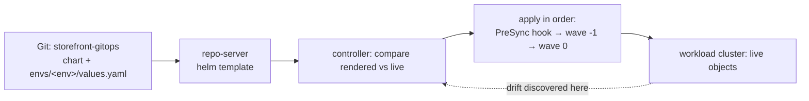

# Lab 3 — Deploy, Introduce Drift, and Recover (modular arc)

> **Day 1 · Lab 3 · Hands-on · ~60 minutes · Scaffolding G2 (reduced)**
> **Argo CD version this course targets: `v3.5.2`** (Helm chart `10.8.4`, Kubernetes `v1.35`; repo-server renders with **Helm v4.2.1**).
> **Before this:** [Session 4](../session-04/README.md) and Lab 2. Every *new* idea here is still explained in full before you use it; the mechanics you already own (logging in, reading a diff, running `argocd`/`kubectl`) are not re-explained — you will often write a command yourself before the guide shows one way.
> **Open:** the Argo CD UI (`https://localhost:8443`, logged in as `admin`), a terminal with `argocd`/`kubectl` (`source ~/argo-lab-env.sh`), and your clones of `storefront-gitops` and `platform-config`.

---

## Why this matters

This is the lab where Day 1 pays off. You will take one Helm application from a Git commit all the way to a running workload on a *separate* cluster, deliberately break it two different ways, and bring it back — every time through Git, never by hand-fixing the cluster. That is the exact loop an on-call engineer runs during a real incident:

- A deployment looks wrong. **Is it drift, a rendering failure, or an ordering failure?** They look equally red and live in different places.
- Someone "fixes" production with `kubectl edit` and it silently reverts. **Bug, or the platform doing its job?**
- A change must be undone now. **Revert, or roll forward?**

The muscle you build here — *find the layer before you touch anything* — is exactly what the Day 2 Capstone grades.

---

## Learning objectives

1. Deploy a Helm app to the registered workload cluster and prove Argo CD renders rather than creating a Helm release (**L3.1**).
2. Apply an environment-specific values file (author a `staging` Application) and **promote a version pin** as a single reviewable Git change (**L3.2**).
3. Introduce live drift and read Argo CD's response — predicting *which* axis changes and why nothing reverts under manual sync (**L3.3**).
4. Configure safe automated sync + self-heal with pruning deliberately off (**L3.4**).
5. Introduce a rendering failure and an ordering failure, tell them apart by where the evidence appears, and recover both through Git (**L3.5**).

Maps to outcomes **O5, O6, O7, O1**. Meeting them *is* the **Day 1 outcome**.

---

## Mental model recap (short)

- **Sync and health are independent** — sync asks "matches Git?", health asks "actually working?". Watching *which* axis moves tells drift from an outage.
- **Three states: desired → rendered → live.** A failure at each stage shows in a different place.
- **Waves and hooks order a sync.** A PreSync migration Job must succeed *before* the main resources; the ConfigMap is wave `-1`, the Deployment/Service wave `0`. **If an earlier stage fails, later stages never run.**
- **Self-heal is a policy about who wins ties, not a safety net.** A `kubectl edit` works for a moment, then is undone. The durable change is a commit.

---

## The big picture in plain words

**Where this lab sits in the course.** Lab 1 taught you the loop on one small app. Lab 2 connected a real repository and a real workload cluster, and wrote the first deployment request — but deployed nothing. **Lab 3 finally deploys**, then does what happens in real life: someone changes the cluster by hand, a bad commit breaks the app, and you bring it back. This is the end of Day 1.

**One analogy to hold onto: a thermostat** (you met it in [Session 1](../session-01/01-why-gitops-thermostat.md)). Git holds the temperature you *want*. The cluster is the room. Argo CD is the thermostat that compares them.

| In the thermostat picture… | In this lab… | Module |
|---|---|---|
| Setting the temperature for the first time and turning the heat on | Syncing `storefront-dev` for the first time | 2 · E1 |
| Using the same thermostat design in a second room with its own setting | A `storefront-staging` Application with its own values file | 2 · E2 |
| Someone opens a window. The display shows the room is off, but the heating stays off | Manual scaling = **drift**; with manual sync, Argo CD reports it and does nothing | 3 · E3 |
| Switching the thermostat to automatic, so it puts the temperature back by itself | **Automated sync + self-heal** | 3 · E4 |
| A setting the thermostat cannot read at all, versus one it reads but fails to reach | A **rendering** failure versus an **ordering** (sync) failure | 4 · E5 |

To change the temperature for good, you change the setting (a Git commit) — not the window.

**How this lab connects to the sessions**

| You learned it in… | You use it in… |
|---|---|
| [Session 2 · Module 3 — sync vs health](../session-02/03-sync-vs-health.md) | Module 3 · E3, where only one of the two statuses moves |
| [Session 4 · Module 1 — render, not release](../session-04/01-render-not-release.md) | Module 2 · E1, the empty `helm list` |
| [Session 4 · Module 2 — sync ordering and drift](../session-04/02-sync-ordering-and-drift.md) | Module 2 · E1 (hook and waves), Module 3 (drift, self-heal, prune), Module 4 · E5 Part B |
| [Session 4 · Module 3 — promotion and recovery](../session-04/03-promotion-and-recovery.md) | Module 2 · E2 (promotion) and Module 4 · E5 (revert vs roll forward) |
| Lab 2 — the repository connection, the cluster registration, and the `storefront` AppProject | Every module: without them nothing in this lab can deploy |

---

## The four modules

| Module | You will... | Exercises | ~Time |
|---|---|---|---|
| [01 — Environment and new mechanics](01-environment-and-mechanics.md) | Confirm the start state; learn to reach the workload app and where each change lives | — | ~8 min |
| [02 — Deploy and promote](02-deploy-and-promote.md) | Sync dev (prove render-not-release); author staging; promote a tag | **E1, E2** | ~20 min |
| [03 — Drift and self-heal](03-drift-and-self-heal.md) | Introduce drift under manual sync; turn on safe self-heal | **E3, E4** | ~20 min |
| [04 — Break it two ways and recover](04-break-and-recover.md) | Rendering vs ordering failure; recover through Git; the Day 1 checkpoint | **E5** | ~15 min |

Each module has short **🧭 What this is for** notes at the start of every section and **✅ Key takeaways** at the end.

**→ Start:** [01 — Environment and new mechanics](01-environment-and-mechanics.md)
