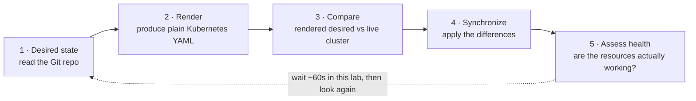

# Session 1 · Module 3 — The Reconciliation Loop

> **Day 1 · Session 1 · Module 3 of 3 · ~15 minutes · concept + hands-on**
> **Goal:** learn the continuous loop Argo CD runs, the evidence each stage leaves, and prove with your own hands that "deleting a Pod is not drift."

---

## 1. The loop that never ends

This is the single most important diagram in the course. You will walk it live in Lab 1 and use it to hunt failures in Session 7 and the Capstone.



This is the thermostat loop from Module 1, now wearing Argo CD's real labels. Read desired (Git), render it, compare against live, synchronize the difference, assess health — then wait and repeat.

Three things to hold onto:
1. **Each stage leaves distinct evidence.** A change can pass stage 1 but stall at stage 2 (bad chart), stage 3 (nothing to do), stage 4 (apply rejected), or stage 5 (applied but crashing). Naming the stage that failed *is* troubleshooting — this loop is your map.
2. **The loop never ends.** Even when everything matches, Argo CD keeps checking. That is why the 2 a.m. hotfix reverted.
3. **It is not instant.** Argo CD's product default re-check is **180 seconds**; this classroom is tuned to **~60 seconds**. A short stretch of "nothing happening" after a push is **normal** — the loop is waiting for its next pass. Clicking **Refresh** forces an immediate pass.

---

## 2. Two words for two different questions

Argo CD reports **two** statuses, and confusing them is the most common beginner mistake:

| Status | Answers the question | Looks at |
|---|---|---|
| **Sync status** (`Synced` / `OutOfSync`) | *Does the cluster match Git?* | rendered manifests vs live state |
| **Health status** (`Healthy` / `Progressing` / `Degraded` / ...) | *Is the thing actually working?* | live state only |

A fresh commit makes an app **`OutOfSync`** while it stays perfectly **`Healthy`** — the old version keeps serving users until you sync. **`OutOfSync` does not mean broken.** It means "these two do not match *yet*." Session 2 makes this split its centerpiece; Lab 1 makes you feel it.

---

## 3. Prove it: deleting a Pod is *not* drift

Here is a hands-on experiment that sharpens exactly what Argo CD watches. Predict first, then run it.

**Predict:** if you delete the running Pod, will the app go `OutOfSync`?

**▶ Do this now — delete the Pod and watch.**

```bash
# Note the current Pod name, then delete it:
kubectl --context k3d-mgmt -n hello get pod -l app.kubernetes.io/name=hello-reconcile
kubectl --context k3d-mgmt -n hello delete pod -l app.kubernetes.io/name=hello-reconcile
# A new Pod appears within seconds:
kubectl --context k3d-mgmt -n hello get pod -l app.kubernetes.io/name=hello-reconcile
# Ask Argo CD if it considers this drift:
argocd app get hello-reconcile | grep -iE 'Sync Status|Health Status'
```

**Expected output** (a *new* Pod name, and the app is still `Synced`):

```text
NAME                               READY   STATUS    RESTARTS   AGE
hello-reconcile-5b66f8d98c-9ndjj   0/1     Running   0          6s
Sync Status:        Synced to main (...)
Health Status:      Progressing
```

Within a few more seconds the health returns to `Healthy`.

**🔍 Why did the app stay `Synced`?** Because the **Pod is not in Git** — Kubernetes owns it. The Deployment *is* in Git, and it immediately recreated the Pod. Argo CD only compares what it owns (the Deployment, Service, and ConfigMap the chart renders) against Git. Delete the *Deployment* and that *would* be drift, because the Deployment is in Git.

> **The one-line lesson:** Argo CD watches **what is declared in Git**, not every object that happens to exist. This is why you can safely `kubectl delete pod` to force a restart, but must never hand-edit a Deployment you expect Argo CD to keep.

---

## 4. Argo CD vs Argo Workflows (the one comparison you need)

The Argo project has several similarly named tools. You only need to place **one** relative to Argo CD:

| | **Argo CD** (this course) | **Argo Workflows** (not this course) |
|---|---|---|
| **What it manages** | A *state*: "the cluster should look like this repo" | A *sequence of steps*: "run these tasks in order" |
| **When it finishes** | Never — it keeps converging | When the last step completes |
| **Mental model** | A **state engine** (a thermostat) | A **step engine** (a recipe) |

**The tell is the finish line.** If the task is "hold this true forever," it is Argo CD–shaped. If it is "run these steps and be done," it is Workflows-shaped. That is the entire distinction, and we will not mention Workflows again.

---

## 5. Quick Check

**S1-QC2 — Order the loop and name one piece of evidence per stage.** Put these five stages in order and say what evidence each leaves: *compare*, *assess health*, *read desired state (Git)*, *synchronize*, *render*.

<details>
<summary>Show answer</summary>

1. **Read desired state (Git)** — evidence: the target revision / commit SHA on `main`.
2. **Render** — evidence: the produced plain Kubernetes YAML; a failure shows as a rendering/`ComparisonError`.
3. **Compare** — evidence: the **sync status** (`Synced`/`OutOfSync`) and a **diff**.
4. **Synchronize** — evidence: a sync result (`Succeeded`/`Failed`) and a new revision in history.
5. **Assess health** — evidence: the **health status** and the underlying Pod events.

Each stage leaves a *different* signal — which turns troubleshooting into a lookup: "OutOfSync but never syncing" → stage 4; "rendering error" → stage 2; "Synced but Degraded" → stage 5.
</details>

---

## 6. Common misconceptions

- **"Argo CD is a CI tool."** No — it is **CD**. It never builds images or runs tests. CI builds the artifact; Argo CD makes the cluster match the approved answer. The only thing crossing between them is a commit.
- **"GitOps means the pipeline pushes to the cluster."** That is the *opposite* — the older push model. GitOps is a **pull** model: everybody commits to Git; the cluster pulls the change.
- **"`OutOfSync` means broken."** No — it means "cluster and Git do not match yet." An `OutOfSync` app can be perfectly `Healthy`.

---

## 7. Key takeaways

- The reconciliation loop runs **continuously**; each stage leaves **distinct evidence** that is your troubleshooting map.
- **Sync status** answers "does it match Git?"; **health status** answers "is it working?" — two independent questions.
- Argo CD watches **what is in Git**, so **deleting a Pod is not drift** but deleting the Deployment is.
- Argo CD is a **state engine** (thermostat); Argo Workflows is a **step engine** (recipe).

---

## 8. Transition — what's next

You now have the *purpose, boundaries, and topology*, and you have driven the loop's edges with your own hands. What you do **not** yet have is the *machinery*: which internal components render, compare, and apply, and the precise split between **sync status** and **health status**.

That is **Session 2 — Argo CD Architecture and the Application Model**, which opens the thermostat and names every part. After it, **Lab 1** has you follow one real change through the entire loop.

**→ Next:** [Session 2 — Architecture and the Application model](../session-02/README.md)
