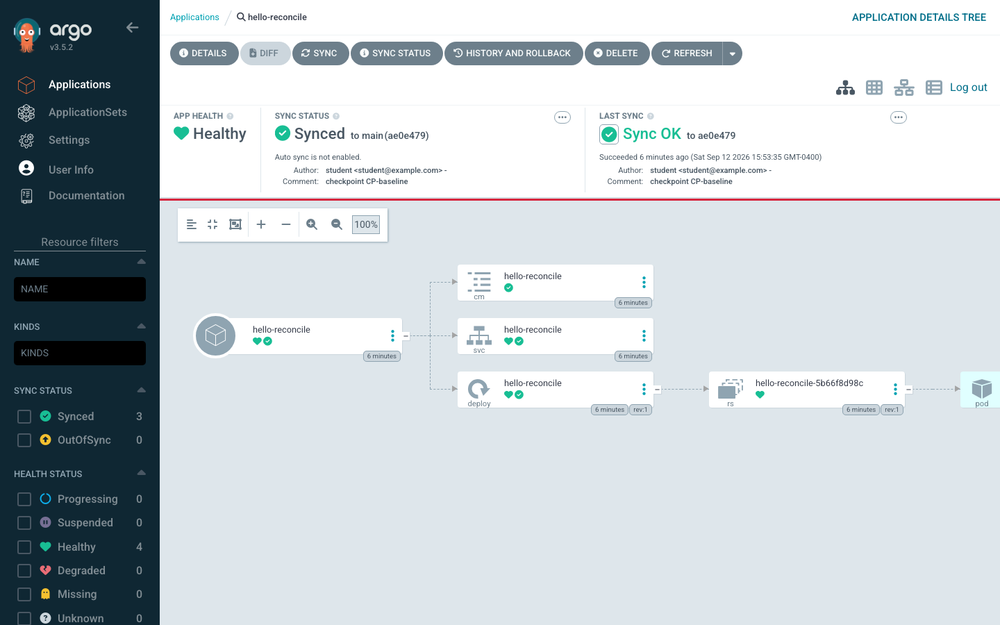
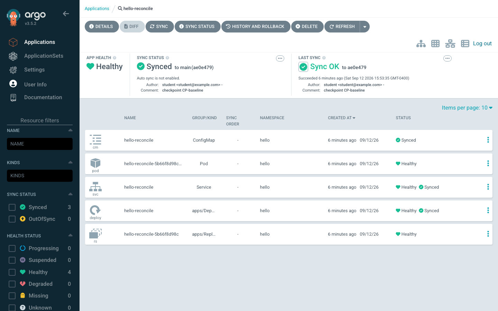

# Session 2 · Module 2.5 — The Application Deployment Contract

> **Day 1 · Session 2 · Module 2.5 of 4 · ~25 minutes · concept + hands-on**  
> **Goal:** understand exactly what an Argo CD Application tells Argo CD to do, where the Application lives, what it points to, and what happens after you apply it.

An Application is not the Deployment, Service, or Pod. It is the **deployment contract** that tells Argo CD which source to render, which destination to manage, which policy boundary applies, and how synchronization should behave.

## 1. The contract in one picture

~~~mermaid
flowchart LR
    G["Git repository chart + values"] --> A["Application deployment contract"]
    A --> R["repo-server render"]
    R --> C["application-controller compare and sync"]
    C --> K["Kubernetes API destination cluster"]
    K --> W["live workload Deployment + Pods"]
~~~

The Application connects:

- **Source:** repository, revision, and path or chart.
- **Destination:** cluster API server and namespace.
- **Policy:** AppProject and sync settings.
- **Result:** rendered Kubernetes resources that Argo CD compares and, when authorized, applies.

> **A useful surprise:** two Applications can point to the same Git path but deploy it to different clusters or namespaces.

## 2. See the Application in the UI

Open **hello-reconcile** in the Argo CD UI and compare it with these real course screenshots.

The tree is a view of the Application’s managed resource graph. It is not the Application manifest itself.

The details panel exposes the contract’s repository, revision, path, destination, project, and synchronization behavior.

The tracking annotation connects a top-level live object back to the Application that manages it.

## 3. Read the contract from Kubernetes

Run:

~~~bash
kubectl --context k3d-mgmt -n argocd \
  get application hello-reconcile -o yaml
~~~

Find these fields:

~~~yaml
metadata:
  name: hello-reconcile
  namespace: argocd

spec:
  project: default
  source:
    repoURL: http://lab-gitea:3000/course/hello-reconcile.git
    targetRevision: main
    path: chart
  destination:
    server: https://kubernetes.default.svc
    namespace: hello
~~~

Now print the important pointers:

~~~bash
kubectl --context k3d-mgmt -n argocd get application hello-reconcile \
  -o jsonpath='repoURL={.spec.source.repoURL}{"\n"}revision={.spec.source.targetRevision}{"\n"}path={.spec.source.path}{"\n"}destination={.spec.destination.server}{"\n"}namespace={.spec.destination.namespace}{"\n"}project={.spec.project}{"\n"}'
~~~

Expected values include:

~~~text
repoURL=http://lab-gitea:3000/course/hello-reconcile.git
revision=main
path=chart
destination=https://kubernetes.default.svc
namespace=hello
project=default
~~~

The destination server is the in-cluster Kubernetes API because this first Application runs on the same cluster as Argo CD. In Lab 2, the destination changes to the registered workload cluster.

## 4. Where the object lives versus where the workload goes

| Field | Answers |
|---|---|
| metadata.namespace: argocd | Where Kubernetes stores the Argo CD Application object |
| spec.destination.namespace: hello | Where Argo CD puts the namespaced workload |
| spec.destination.server | Which Kubernetes API server receives the resources |

Check both objects:

~~~bash
kubectl --context k3d-mgmt -n argocd get application hello-reconcile
kubectl --context k3d-mgmt -n hello get deployment hello-reconcile
~~~

> **Operator shortcut:** when a page says “the Application is missing,” ask whether the Application object is missing in argocd, or whether a workload resource is missing in hello. Those are different failures.

## 5. What happens after you apply an Application

An Application is a Kubernetes object:

~~~bash
kubectl --context k3d-mgmt api-resources | grep -i application
kubectl --context k3d-mgmt explain applications.spec
~~~

The CRD teaches Kubernetes the schema; the Argo CD application-controller supplies the behavior.

The sequence is:

1. Kubernetes stores the Application object in etcd.
2. The application-controller notices the new or changed object.
3. The repo-server fetches the selected Git revision.
4. The repo-server renders the chart into Kubernetes YAML.
5. The controller compares rendered resources with live resources.
6. A sync operation applies the difference to the destination cluster.

Applying an Application creates a **request for reconciliation**. It does not directly create a Deployment in the same shell command.

## 6. Three details that surprise experienced Kubernetes users

### Status is controller-owned

The spec is the requested deployment contract. The status is Argo CD’s observation:

~~~bash
kubectl --context k3d-mgmt -n argocd get application hello-reconcile \
  -o jsonpath='generation={.metadata.generation}{"\n"}sync={.status.sync.status}{"\n"}health={.status.health.status}{"\n"}reconciledAt={.status.reconciledAt}{"\n"}'
~~~

Do not edit status to fix an Application. Change the source, destination, policy, or live resource that caused the observed result.

### Argo CD tracks resources while Kubernetes owns children

Argo CD places a tracking annotation on top-level resources such as the Deployment. Kubernetes uses owner references for the Deployment → ReplicaSet → Pod chain. That is why deleting a Pod is usually repaired by Kubernetes, while deleting a tracked Deployment is drift Argo CD can detect.

### Deleting an Application can delete its resources

Applications can carry an Argo CD resources finalizer when cascading deletion is enabled. Inspect the finalizers without deleting anything:

~~~bash
kubectl --context k3d-mgmt -n argocd get application hello-reconcile \
  -o jsonpath='{.metadata.finalizers}{"\n"}'
~~~

Lab 5 returns to deletion protection at the governance layer.

## 7. Prediction challenge

| Change | What should change |
|---|---|
| Change targetRevision from main to a tag | The Git revision rendered by Argo CD |
| Change path | The directory or chart Argo CD renders |
| Change destination.namespace | The workload destination |
| Change a Helm value in Git | Rendered resources, but not the Application’s source address |
| Change spec.project | The policy boundary that validates the Application |

A source can render correctly while a project or destination policy still rejects it. Source validity and authorization are separate checks.

## 8. Quick Check

Which object would you inspect first?

- Git has a new commit, but the Application still says Synced.
- The Application says Synced, but the Deployment has zero available replicas.
- The Application says Unknown and the repository cannot be reached.
- The Application is missing from the Argo CD UI, but the Deployment still exists.

Show answer

- New commit but still Synced: inspect refresh, reconciliation, and the Application’s source revision.
- Synced with zero replicas: inspect live Deployment and Pod health; Git may describe a broken rollout.
- Unknown with an unreachable repository: inspect repo-server access and repository credentials or URL.
- Missing Application but a Deployment remains: inspect the Application namespace and ownership/tracking; a live child does not prove the parent still exists.

## Key takeaways

- An Application is Argo CD’s **deployment contract**, not workload YAML.
- metadata.namespace is where the Application object lives; spec.destination is where its resources go.
- The CRD gives Kubernetes the schema; the Argo CD controller gives the object its behavior.
- spec is the requested contract. status is the controller’s observation.
- A source can render successfully while a project or destination policy rejects it.

**→ Next:** [03 — Sync versus health](03-sync-vs-health.md)

