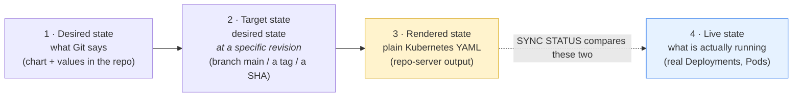
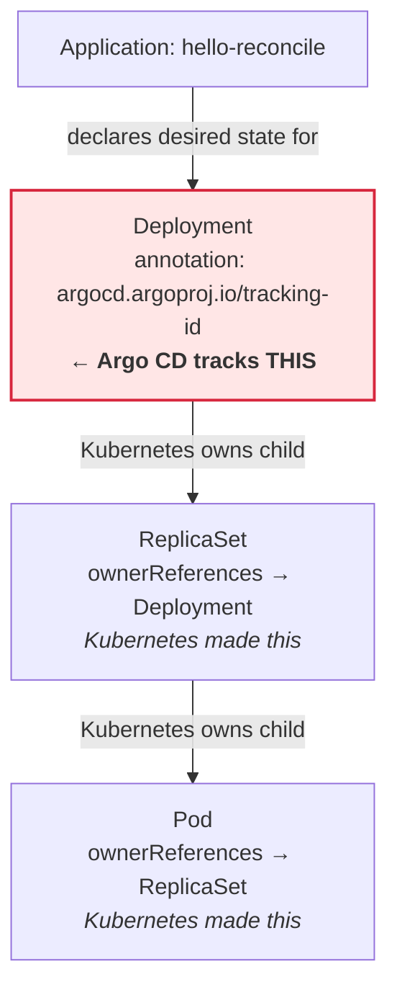

# Session 2 · Module 2 — Four States and the Application

> **Day 1 · Session 2 · Module 2 of 3 · ~20 minutes · concept + hands-on**
> **Goal:** learn the four states Argo CD juggles (desired → target → rendered → live), understand that an Application is an *address* not an *artifact*, and see Argo CD's ownership stamp on a live object.

---

## 1. Vocabulary, grounded before we use it

- **CRD (Custom Resource Definition).** A way to teach Kubernetes a brand-new kind of object beyond its built-ins. Argo CD installs CRDs so the cluster understands `Application`, `AppProject`, and `ApplicationSet`. Once a CRD exists, you create those objects with `kubectl` like any native resource.
- **controller.** A program running a never-ending loop: read desired state, look at the real world, act to close the gap. Argo CD's application controller is one, specialized for Applications.
- **Application.** The core Argo CD object: a small manifest naming *which* repo, revision, path/chart, destination cluster+namespace, project, and sync policy. It contains **no workload YAML** — it is a set of pointers (an address), not the artifact.
- **AppProject** *(taught fully in Session 6).* A guardrail object grouping Applications and limiting what they may do — which repos, clusters, namespaces, and resource kinds. Every Application belongs to exactly one; `hello-reconcile` belongs to `default`.
- **resource tracking (the tracking-id annotation).** How Argo CD remembers which live resources it owns: an annotation `argocd.argoproj.io/tracking-id` stamped onto every top-level resource it manages. A resource without that stamp is invisible to Argo CD.

---

## 2. The four states



- **Desired state** = what Git says (chart + values in the repo).
- **Target state** = desired state pinned to a *specific revision* (branch `main`, a tag, or a commit SHA). Pointing an Application at `main` vs a fixed tag changes *which* commit becomes the target.
- **Rendered state** = the plain Kubernetes YAML the repo-server produces from the source (desired state *after* templating).
- **Live state** = what is actually running now.

**The key fact:** **sync status compares rendered (3) against live (4).** It does *not* compare raw Git text against the cluster, and it does *not* compare the target revision directly. The comparison happens *after* templating, because templating is where a Helm chart becomes concrete YAML a cluster can run. Consequence: two different commits that render to *identical* YAML produce **no** sync difference.

---

## 3. The Application, annotated — every field is an external dependency

Here is the real `hello-reconcile` Application. Read each comment as an **arrow pointing out** at something that lives elsewhere and can fail on its own.

```yaml
apiVersion: argoproj.io/v1alpha1
kind: Application                       # a CRD Argo CD installed
metadata:
  name: hello-reconcile
  namespace: argocd                     # Applications live in Argo CD's namespace,
                                        #   NOT the namespace they deploy to
spec:
  project: default                      # -> depends on an AppProject's guardrails
  source:
    repoURL: http://lab-gitea:3000/course/hello-reconcile.git
                                        # -> depends on a Git repo being reachable
                                        #    (private repos also need a REPOSITORY CREDENTIAL)
    targetRevision: main                # -> depends on this branch/tag/SHA existing
    path: chart                         # -> depends on this folder holding a valid chart
  destination:
    server: https://kubernetes.default.svc
                                        # -> depends on a CLUSTER CREDENTIAL for this target
    namespace: hello                    # -> depends on this namespace
  syncPolicy:
    syncOptions:
      - CreateNamespace=true            # make 'hello' if missing
    # No 'automated:' block -> sync is MANUAL.
```

**Notice:** there is **no workload YAML here at all** — no Deployment, no Service, no image. Every meaningful line is a *pointer*. Reading an Application is reading a list of things that can each break independently. (Two pointers are credentials — repo and cluster; Session 3 and Lab 2 cover their format and least-privilege scoping.)

**▶ Do this now — read those pointers off the live object.**

```bash
kubectl --context k3d-mgmt -n argocd get application hello-reconcile \
  -o jsonpath='repoURL={.spec.source.repoURL}{"\n"}revision={.spec.source.targetRevision}{"\n"}path={.spec.source.path}{"\n"}dest={.spec.destination.server}{"\n"}ns={.spec.destination.namespace}{"\n"}project={.spec.project}{"\n"}'
```

**Expected:**

```text
repoURL=http://lab-gitea:3000/course/hello-reconcile.git
revision=main
path=chart
dest=https://kubernetes.default.svc
ns=hello
project=default
```

**🔍 Notice:** every value points *outside* the Application. That is why an Application is **an address, not an artifact** — the artifact lives in the repo the address points at.

---

## 4. Who owns which node: tracking vs ownerReferences

Argo CD and Kubernetes each own a *different part* of the resource tree, by a *different mechanism*.



- **Argo CD directly tracks only the top-level resource** — the Deployment — by stamping the `argocd.argoproj.io/tracking-id` annotation on it.
- **Kubernetes owns everything below** via `ownerReferences`: the Deployment makes and owns the ReplicaSet, which makes and owns the Pods.
- **This is why deleting a Pod is not drift** (you proved it in Session 1): the Pod is not in Git and carries no tracking-id, so Kubernetes just recreates it. Deleting the *Deployment* *is* drift.

**▶ Do this now — see the stamp on the Deployment, and its absence on the Pod.**

```bash
kubectl --context k3d-mgmt -n hello get deploy hello-reconcile \
  -o jsonpath='{.metadata.annotations.argocd\.argoproj\.io/tracking-id}{"\n"}'
kubectl --context k3d-mgmt -n hello get pod -l app.kubernetes.io/name=hello-reconcile \
  -o jsonpath='{.items[0].metadata.annotations.argocd\.argoproj\.io/tracking-id}{"(no stamp)\n"}'
```

**Expected output:**

```text
hello-reconcile:apps/Deployment:hello/hello-reconcile
(no stamp)
```

**🔍 Notice:** the Deployment carries Argo CD's ownership stamp; the Pod does not. Argo CD tracks exactly **one** node here — the Deployment. The ReplicaSet and Pod are Kubernetes-owned children it merely *displays*.

---

## 5. Quick Check

**S2-QC2 — How many lines of workload YAML live inside an Application?**

<details>
<summary>Show answer</summary>

**Zero.** An Application is an address, not an artifact — the artifact (Deployment, Service, ConfigMap) lives in the Git repo the address points at. Every field in the Application is a pointer to an external thing that can fail on its own.
</details>

---

## 6. Key takeaways

- The four states flow **desired → target → rendered → live**; **sync status compares rendered vs live** (after templating), never raw Git vs cluster.
- **An Application is an address, not an artifact** — every field is an external dependency.
- Argo CD tracks only the **top-level** resource via the `tracking-id` annotation; Kubernetes owns the children via `ownerReferences`. That is why a deleted Pod is not drift.

**→ Next:** [03 — Sync vs health](03-sync-vs-health.md)
