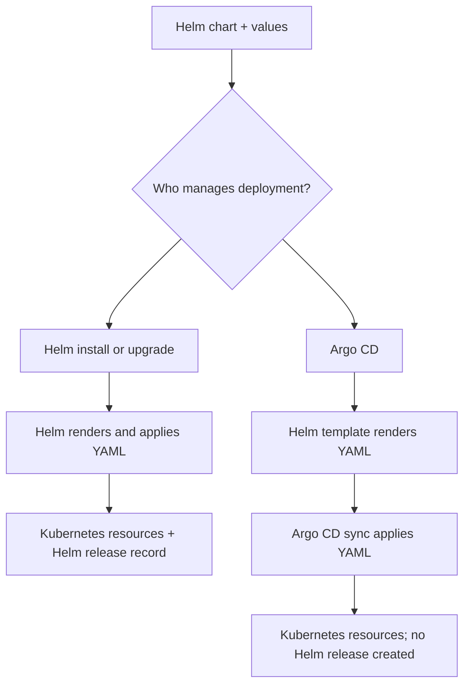

# Session 4 · Module 1 — The App Is Running. Where Is the Helm Release?

> **Day 1 · Session 4 · Module 1 of 3 · ~20 minutes · concept + hands-on**
>
> **Your mission:** explain why a running application can be missing from `helm list`, then predict which configuration value Helm will use.
>
> **What you will do:** inspect an existing application, render a chart locally, and see an override win. The commands in this module do not deploy changes.

By the end, you should be able to answer two practical questions:

- **Who deployed this application: Helm or Argo CD?** This determines which release-management tools apply.
- **Where did this configuration value come from?** This determines what you must change to get the result you want.

---

## 1. The mystery: Helm cannot find the running application

The `storefront` application starts failing after an image update.

An engineer tries `helm rollback` to restore the previous version. Helm cannot find the release.

“But we deployed a Helm chart!”

They check `helm list`. No `storefront` release appears.

> **Pause and predict:** does this mean the application was never deployed—or that something else deployed it?

Keep that question in mind. First, collect the evidence using the application already running in your lab.

## 2. Collect the evidence: Kubernetes sees it, Helm does not

**Purpose:** show that running Kubernetes resources and a Helm release record are different things.

Reminder: this application comes from a Helm chart. In the hello-reconcile repository, the chart/ folder contains the templates and values used to generate the application’s Kubernetes resources. The Argo CD Application points to that folder.

Argo CD uses Helm to turn those templates into Kubernetes YAML, then deploys the resulting resources itself.

Now investigate: the application uses a Helm chart and its Pods are running—so will Helm show a release for it?

Use the terminal configured for your lab, with access to the `k3d-mgmt` context. These commands inspect the existing `hello-reconcile` application in the `hello` namespace.

### How does Argo even know to use Helm?

First, display the Argo CD Application object—the configuration that tells Argo CD where to find the application and where to deploy it:

```bash
kubectl --context k3d-mgmt -n argocd \
  get application hello-reconcile -o yaml
```

The output is long. Focus on **`spec.source`**:

```yaml
spec:
  source:
    repoURL: http://lab-gitea:3000/course/hello-reconcile.git
    targetRevision: main
    path: chart
```

Read this as: **“Open this Git repository, use the `main` branch, and look in the `chart/` directory.”**

Now open that directory in the repository:

| File or folder      | Purpose                                     |
| ------------------- | ------------------------------------------- |
| `chart/Chart.yaml`  | Identifies the directory as a Helm chart.   |
| `chart/values.yaml` | Supplies default configuration values.      |
| `chart/templates/`  | Contains the Kubernetes resource templates. |

**Finding `Chart.yaml` tells Argo CD to use Helm**, unless another tool is explicitly configured. The directory name `chart` is just a name; `Chart.yaml` is the detection signal. [Argo CD tool detection](https://argo-cd.readthedocs.io/en/stable/user-guide/tool_detection/)

> **Now the puzzle:** Argo CD knows this is a Helm chart, and the application is running. Does that mean Helm has a release record for it? Let’s check.


### Step A — Ask Kubernetes what is running

```bash
kubectl --context k3d-mgmt -n hello get deployments,pods
```

**Look for:** the `hello-reconcile` Deployment and its running Pod. The Pod's generated name will vary.

The Deployment describes the workload Kubernetes should maintain; the Pod is where its container runs.

### Step B — Ask Helm for its release records

Check the **same cluster and namespace**:

```bash
helm list --kube-context k3d-mgmt -n hello
```

**Expected lab output:** column headings with no release rows.

```text
NAME    NAMESPACE    REVISION    UPDATED    STATUS    CHART    APP VERSION
```

### Step C — Explain the apparent contradiction

| Evidence | What it tells you |
| --- | --- |
| Kubernetes shows a Deployment and Pod. | The application's resources exist. |
| Helm lists no release for the application. | Helm has no listed release record for it. |

**The missing release is the clue:** Argo CD created these resources without creating a Helm release.

This is the expected result for this lab. Other applications installed directly with Helm could have release records in the same namespace. An empty list by itself does not prove who deployed an arbitrary workload; here, you already know Argo CD manages `hello-reconcile`.

## 3. The explanation: rendering and deploying are separate jobs

A **Helm chart** is a package containing Kubernetes templates and default values. A template has placeholders; values provide the choices to fill them in.

For example, a Deployment template might contain:

```yaml
spec:
  replicas: {{ .Values.replicaCount }}
```

If the supplied value is:

```yaml
replicaCount: 4
```

Helm produces:

```yaml
spec:
  replicas: 4
```

**Rendering means producing that final YAML.** Rendering alone has not created a Deployment or started any Pods.

Helm can also install the rendered resources and maintain a **release**: a named installation with revision records used by Helm's management commands.

Argo CD uses Helm to render the chart with `helm template`. Argo CD then manages synchronization of the rendered resources itself. It does not run `helm install` or `helm upgrade` for the application. [Argo CD Helm integration](https://argo-cd.readthedocs.io/en/latest/user-guide/helm/)



| Question | Installed directly with Helm | Deployed by Argo CD from a Helm chart |
| --- | --- | --- |
| What renders the templates? | Helm | Helm, invoked by Argo CD |
| What manages application of the resources? | Helm | Argo CD |
| Is a Helm release created? | Yes | No |
| Can Helm roll back that installation? | Using its available release history | No Helm release exists for it to roll back |

> **Remember:** “Uses a Helm chart” tells you how YAML is generated. You still need to know who manages deployment.

### Find the two jobs in Argo CD's architecture


*Graphic source: [Argo CD architectural overview](https://argo-cd.readthedocs.io/en/stable/operator-manual/architecture/). The image loads from the official documentation and requires internet access.*

**Your task:** find **Repo Server** and **Application Controller** in the graphic.

- **Repo Server:** retrieves the source and generates the Kubernetes manifests, including rendering Helm charts.
- **Application Controller:** compares desired resources with live resources and manages synchronization.

The first produces the instructions; the second manages bringing the cluster into agreement with them.

## 4. Try it: render four replicas without deploying four Pods

**Purpose:** experience the boundary between generating YAML and changing a cluster.

### Step A — Open the repository

If you already have the lab checkout:

```bash
cd ~/storefront-gitops
```

If you have not cloned it yet, use these commands instead:

```bash
git clone http://lab-gitea:3000/course/storefront-gitops.git ~/storefront-gitops
cd ~/storefront-gitops
```

> **Where to run this:** use the lab terminal where `lab-gitea` resolves. It is a lab hostname, not a public Git host. If your Mac reports `Could not resolve host: lab-gitea`, use the configured lab terminal or the Git address supplied by your Mac setup instructions. Do not continue until you can open the repository.

### Step B — Render the development configuration

```bash
helm template storefront charts/storefront \
  -f envs/dev/values.yaml |
  grep 'replicas:'
```

| Command part | Meaning |
| --- | --- |
| `helm template` | Generate Kubernetes YAML locally. |
| `storefront` | Supply the name used during rendering; this does not create a release. |
| `charts/storefront` | Read this chart directory. |
| `-f envs/dev/values.yaml` | Use the development values file, with the path relative to your current directory. |
| `grep 'replicas:'` | Display only matching lines from the generated YAML. |

**Expected for the supplied development configuration:**

```yaml
  replicas: 1
```

If your checkout has already been edited, its value may differ. Inspect `envs/dev/values.yaml` before proceeding.

### Step C — Predict, then add an override

The development file supplies `replicaCount: 1`. The next command also supplies `replicaCount=4`.

**Predict:** will the output contain `1` or `4`?

```bash
helm template storefront charts/storefront \
  -f envs/dev/values.yaml \
  --set replicaCount=4 |
  grep 'replicas:'
```

**Expected:**

```yaml
  replicas: 4
```

**What happened:** the explicit override won over the values file.

**What did you change in Kubernetes?** Nothing. You generated text containing `replicas: 4`; you did not submit that text to Kubernetes.

You also did not edit the values file. Run the Step B command again and the original result returns.

> **Checkpoint:** rendering produces a proposed configuration. Synchronization is the later step that applies it.

## 5. The second mystery: “I changed the values file. Why is it still four?”

Suppose you edit the development values file, but Argo CD continues rendering four replicas.

Before editing the file again, check for a higher-priority override in the Application.

### Which source wins?

For a conflicting key, read this table from highest to lowest priority:

| Priority | Source | Where it appears |
| --- | --- | --- |
| **1 — highest** | Parameters | `spec.source.helm.parameters` |
| 2 | Inline YAML object | `spec.source.helm.valuesObject` |
| 3 | Inline YAML text | `spec.source.helm.values` |
| 4 | Values files | `spec.source.helm.valueFiles` |
| **5 — lowest** | Chart defaults | The chart's own `values.yaml` |

For multiple explicitly listed values files, later files take precedence over earlier ones when their keys conflict. [Argo CD value precedence](https://argo-cd.readthedocs.io/en/latest/user-guide/helm/#helm-value-precedence)

### Connect your command to an Argo CD Application

Your local `--set replicaCount=4` override corresponds to a parameter in an Application manifest:

```yaml
# Application fragment: illustrates an override; do not apply this fragment.
spec:
  source:
    helm:
      parameters:
        - name: replicaCount
          value: "4"
```

If this parameter is present, changing `replicaCount` in a lower-priority values file will not change the rendered replica count. Update or remove the overriding parameter in the configuration that owns the Application.

For this course, keep routine environment choices in environment values files. Use Application parameters when you deliberately need a higher-priority override, and keep those declarative settings in Git.

> **Troubleshooting habit:** when a values-file edit appears to do nothing, inspect the Application's Helm settings before changing the chart.

## 6. Return to the incident: make the recovery stick

The engineer now understands why Helm cannot roll back `storefront`: Argo CD never created a Helm release for it.

They manually edit the live Deployment to use the previous image. The application recovers—then the broken image returns.

**For this scenario, automated sync and self-heal are enabled.** Git still specifies the broken image, so Argo CD restores that configuration. Without self-heal, detecting a live edit alone does not normally trigger an automatic correction; a later sync can still overwrite it. [Argo CD automatic self-healing](https://argo-cd.readthedocs.io/en/stable/user-guide/auto_sync/#automatic-self-healing)

| Location | Image after the manual edit |
| --- | --- |
| Desired configuration in Git | Broken image |
| Live Deployment | Previous working image |

The edit changed the cluster, but left the desired configuration unchanged.

### The durable recovery for this Git-managed application

1. Revert the bad image change in Git, or commit the previous working image reference.
2. Push the correction to the branch the Application tracks.
3. Let automated synchronization apply it, or trigger a manual sync if required.
4. Verify Argo CD's status and the application's actual behavior.

This is a recovery explanation, not an instruction to break or roll back your lab application now.

Argo CD also maintains its own deployment history and offers rollback capabilities, subject to its sync settings. That history is separate from Helm release history. For the Git-driven workflow here, correcting Git keeps the recovery consistent with future synchronization.

## 7. One upgrade habit to carry forward

**The rendering toolchain helps determine the manifests you deploy.** An Argo CD upgrade can change its bundled Helm version, so unchanged charts and values do not guarantee identical generated output across tool versions.

Before upgrading Argo CD:

1. Render your real charts with the current and proposed tool versions, using equivalent values and rendering inputs.
2. Compare the generated manifests.
3. Investigate unexpected differences and test with the proposed Argo CD version before upgrading production.

For example, the Argo CD 3.5 upgrade guide documents the move to Helm 4 and states that `spec.source.helm.version: v3` is ignored. The detailed compatibility checks belong in the upgrade session. [Argo CD 3.5 upgrade guide](https://argo-cd.readthedocs.io/en/latest/operator-manual/upgrading/3.4-3.5/)

Do not assume the `helm` binary in your terminal matches the binary inside Argo CD's repo-server. Matching the renderer is one part of making a local preview representative.

## 8. Quick checks — explain the evidence

Try answering before reading the answer table.

### S4-QC1 — The invisible release

Kubernetes shows the application's Pods. Helm lists no release for it. You know Argo CD deployed it from a chart. How can all three facts be true?

### S4-QC2 — Four replicas on screen

You run `helm template ... --set replicaCount=4`, and the output contains `replicas: 4`. How many Pods did this command create?

### S4-QC3 — Which value wins?

The chart default is `1`, the values file supplies `2`, inline `values` supplies `3`, `valuesObject` supplies `4`, and a parameter supplies `5`. What is the rendered replica count?

### S4-QC4 — The fix that disappears

With automated sync and self-heal enabled, a manual image edit is reversed. Where should you record the previous working image to make the Git-managed recovery persist?

### Answers

| Check | Answer |
| --- | --- |
| **S4-QC1** | Argo CD used Helm to render YAML, then deployed the resources itself. It created no Helm release for the application. |
| **S4-QC2** | **Zero.** Rendering generated YAML only. |
| **S4-QC3** | **5.** The parameter has the highest priority. |
| **S4-QC4** | In the Git configuration that determines the image, followed by synchronization and verification. |

## 9. What to remember

- **Rendering creates YAML. Synchronization applies it.**
- **Argo CD uses Helm's templates without creating a Helm release for the application.**
- **When a value surprises you, check higher-priority overrides.**
- **For this Git-managed workflow, record recovery changes in Git so future syncs preserve them.**

**Next:** [Module 2 — Sync ordering and drift](02-sync-ordering-and-drift.md). You now know where the YAML comes from; next, follow what happens when Argo CD applies it.
