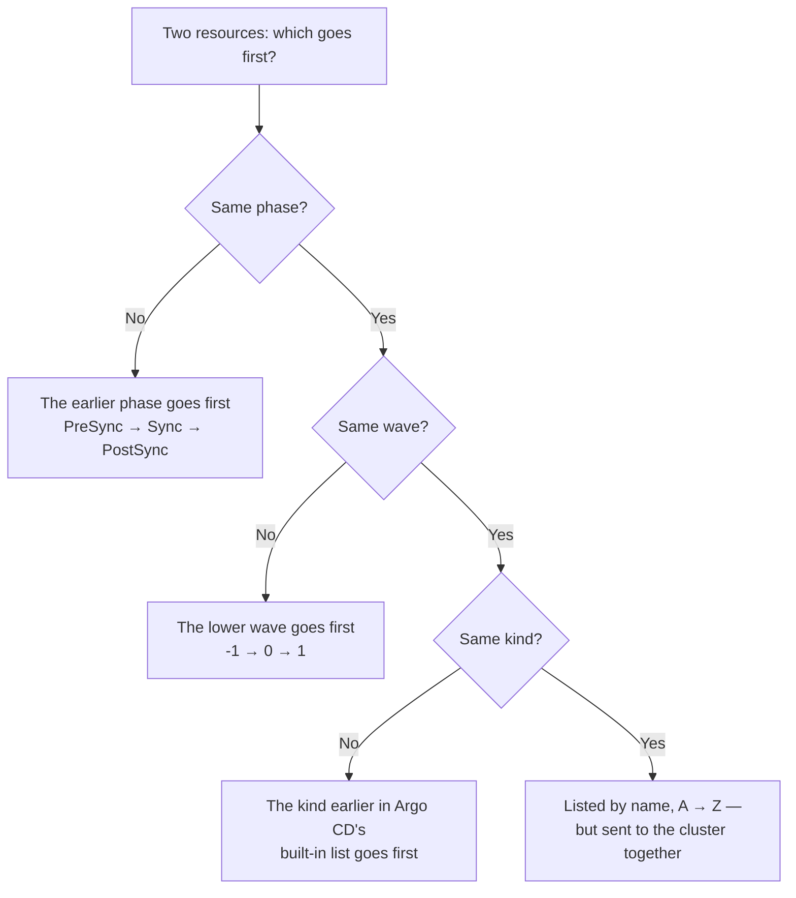
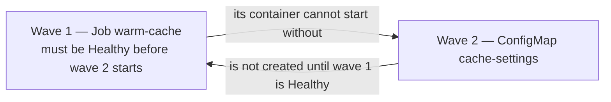

# Session 4 · Module 1.5 — The Running Order: Phases, Waves, Kinds, and Names

> **Day 1 · Session 4 · Module 1.5 (between Modules 1 and 2) · ~25 minutes · concept + hands-on**
> **Goal:** read Argo CD's ordering rule — **phase → wave → kind → name** — as a four-level sort, predict the order of a real sync from its YAML, and diagnose a sync that waits forever because of one wave number.
> **Argo CD version:** `v3.5.2`. **Where it runs:** the management cluster (`k3d-mgmt`), in a practice namespace called `sync-order`. Nothing here touches `storefront-dev`, which you deploy in Lab 3.

**By the end you can:**

1. Define *phase*, *hook*, *wave*, *kind order*, and *name order* in one plain sentence each.
2. Put any set of resources into the order Argo CD will apply them, and say which of the four keys decided each position.
3. Explain what Argo CD waits for between waves.
4. Diagnose a sync that never finishes from its message, its Pods, and its events — and fix it through Git.

---

## 1. Why this matters: ninety seconds of crashing Pods

It is 09:02 on a Monday. The storefront team ships version 2, which needs a new database table.

Their Git repository contains two things for this release:

- a **Job** that creates the table — a *database migration*, and
- the updated **Deployment** that runs the new code.

Both reach the cluster at the same moment. The new Pods start first and crash with `table "orders_v2" does not exist`. Ninety seconds later the migration finishes, the Pods restart, and everything recovers.

Nobody wrote a bug. The only problem was **order**.

Kubernetes has no built-in idea of "do this first." When you run `kubectl apply`, it hands every object to the cluster in one pass and waits for none of them to become ready.

Argo CD adds a **running order** that you can control. [Module 2](02-sync-ordering-and-drift.md) describes it in one line:

> **phase → wave → kind → name**

That line is dense. This module unpacks it one word at a time, then has you watch it in a real sync — and break it.

---

## 2. The mental model: boarding a plane

You already know an ordering system with four levels: boarding a plane.

| Boarding a plane | Argo CD sync | Key |
|---|---|---|
| **Pre-boarding** happens before anyone else gets on, and the plane waits until it is done. The **safety check** happens after everyone is seated. | **Phases.** `PreSync` runs first and must succeed. Normal resources are applied in the `Sync` phase. `PostSync` runs after everything is Healthy. | **1. phase** |
| Your ticket says **Group 1, Group 2, …** A lower group boards first. The gate agent waits until a group is on board before calling the next one. | **Waves.** A number on each resource. Lower numbers go first. Argo CD waits for each wave to be Healthy before starting the next. | **2. wave** |
| Within one group, the airline uses a **fixed rule** — for example, window seats before aisle seats. | **Kind order.** Within one wave, Argo CD applies object types in a built-in order: namespaces and settings before the workloads that use them. | **3. kind** |
| Passengers who are otherwise identical are listed **alphabetically** — but they walk down the jet bridge **together**. | **Name order.** The last tie-breaker for the list. Resources of the same kind in the same wave are sent to the cluster at the same time. | **4. name** |

The precise version is a spreadsheet sort. Picture every resource as a row with four columns, sorted by **Phase, then Wave, then Kind, then Name**:

- Argo CD compares **phase** first.
- Only when two resources are in the *same* phase does it look at **wave**.
- Only when they are in the *same* wave does it look at **kind**.
- Only when they are the *same* kind does it look at **name**.

> **Read each arrow in "phase → wave → kind → name" as "then, only to break a tie."**

---

## 3. Vocabulary, one sentence each

**Refresher — annotation.** An annotation is a short `key: value` note in an object's `metadata`. Kubernetes stores it but does not act on it; tools such as Argo CD read it. You met one in Session 2: `argocd.argoproj.io/tracking-id`. Every ordering setting in this module is an annotation.

| Term | Plain-language meaning | How you set or see it |
|---|---|---|
| **Sync** (sync operation) | One run of "make the cluster match Git." | The **SYNC** button, or `argocd app sync <app>` |
| **Resource** | One Kubernetes object from Git — a ConfigMap, a Deployment, a Job. | One YAML document |
| **Phase** | One of the big stages of a sync. Every normal resource belongs to the **`Sync`** phase. | Set by a hook annotation; no hook annotation means `Sync` |
| **Hook** | A resource — usually a Job — that Argo CD **runs at a chosen moment** of the sync, such as "before everything else." | `argocd.argoproj.io/hook: PreSync` |
| **Wave** | A numbered group inside a phase. Lower numbers go first. **No annotation means wave `0`.** Negative numbers are allowed. | `argocd.argoproj.io/sync-wave: "-1"` — the number goes in quotes |
| **Kind** | The type of object: the `kind:` line. | `kind: ConfigMap` |
| **Name** | The object's name. | `metadata.name` |
| **Healthy** | Argo CD's judgment that a resource is working ([Session 2 · Module 3](../session-02/03-sync-vs-health.md)). Kinds with nothing to "start" — such as ConfigMap and ServiceAccount — count as ready immediately. | The green heart in the UI |

### The phases

You will use `PreSync`, `Sync`, and `PostSync` today. Recognize the others when you see them.

| Phase (hook value) | When it runs | Today? |
|---|---|---|
| `PreSync` | Before any normal resource is applied. It must succeed, or the sync stops. | ✅ this module, and Lab 3 |
| `Sync` | Alongside the normal resources, after every `PreSync` hook has succeeded. | Rarely used |
| `PostSync` | After every `Sync`-phase resource has been applied **and** is Healthy. | ✅ this module |
| `SyncFail` | Only when a sync fails — for example, to send an alert or clean up. | Recognize |
| `PreDelete` / `PostDelete` | When the whole Application is deleted — before, or after, its resources are removed. | Recognize |
| `Skip` | Tells Argo CD **not** to apply this manifest at all. | Recognize |

> **Helm hooks are translated, not run by Helm** (Module 1 promised this). `helm.sh/hook: pre-install` or `pre-upgrade` becomes a `PreSync` hook. `post-install` or `post-upgrade` becomes `PostSync`. `helm.sh/hook-weight` becomes the sync wave. One trap: if the manifests contain **any** `argocd.argoproj.io/hook` annotation, Argo CD ignores **all** Helm hooks. [Argo CD Helm hooks](https://argo-cd.readthedocs.io/en/release-3.5/user-guide/helm/#helm-hooks)

---

## 4. Decode the rule: phase → wave → kind → name

### Which of two resources goes first?



**🔍 Notice:** each question is asked **only** when every question above it was a tie. A wave number can never move a resource out of its phase, and kind order can never move a resource into a different wave.

### The built-in kind order

Why does kind order exist? Some objects are useless — or broken — without others. A Pod cannot start if the ServiceAccount it runs as, or the ConfigMap it reads, does not exist yet. So within a wave, Argo CD applies the things other things depend on first.

These are the kinds you meet in this course, in Argo CD's order:

| Position | Kind(s) | Why this position makes sense |
|---|---|---|
| First | `Namespace` | The room everything else goes into |
| Early | `ServiceAccount`, `Secret`, `ConfigMap` | The identity and settings a Pod needs when it starts |
| | `PersistentVolumeClaim` | Storage a Pod mounts |
| | `CustomResourceDefinition` | Teaches the cluster a new kind before anything uses it |
| | `Role`, `RoleBinding` | Permissions |
| Middle | `Service` | A stable network address |
| | `Deployment`, `StatefulSet` | Long-running workloads |
| Late | `Job`, `CronJob` | Tasks |
| | `Ingress` | The entrance for outside traffic |
| **Last** | **Any kind not on the list** — for example, a custom resource such as a cert-manager `Certificate` | Argo CD cannot know what it depends on |

<details>
<summary>The complete list (Argo CD v3.5.2)</summary>

`Namespace`, `NetworkPolicy`, `ResourceQuota`, `LimitRange`, `PodSecurityPolicy`, `PodDisruptionBudget`, `ServiceAccount`, `Secret`, `SecretList`, `ConfigMap`, `StorageClass`, `PersistentVolume`, `PersistentVolumeClaim`, `CustomResourceDefinition`, `ClusterRole`, `ClusterRoleList`, `ClusterRoleBinding`, `ClusterRoleBindingList`, `Role`, `RoleList`, `RoleBinding`, `RoleBindingList`, `Service`, `DaemonSet`, `Pod`, `ReplicationController`, `ReplicaSet`, `Deployment`, `HorizontalPodAutoscaler`, `StatefulSet`, `Job`, `CronJob`, `IngressClass`, `Ingress`, `APIService` — then every other kind.

*Source: the sync ordering code in Argo CD v3.5.2 (`gitops-engine/pkg/sync/sync_tasks.go`).*
</details>

### What "together" means for name order

Name is the final tie-breaker, and it keeps the list in a predictable order. But Argo CD sends resources of the **same kind in the same wave** to the cluster at the same moment. It does not wait for `about-page` to finish before sending `welcome-page`.

> **Name order is not a dependency tool.** If one resource must exist before another of the same kind, give it a lower wave.

### The two waits between waves

When Argo CD has applied a wave, it does not start the next one straight away. It waits for two things:

1. **Every resource in the wave is Healthy.** A Deployment needs its Pods running; a Job needs to complete; a ConfigMap is ready at once.
2. **About 2 more seconds.** This is Argo CD's default wave delay, which gives other controllers a moment to react.

The first wait is what makes waves useful. In Round 2 you will see it make a sync hang.

---

## 5. Round 1 — Predict the running order

**Purpose:** decode eight real resources, predict their order, then check your prediction against Argo CD's own record of the sync.

### Step A — Put the practice files in Git

Argo CD deploys from Git, so the practice files need to be in a repository. You will use your `hello-reconcile` clone from Lab 1. The new folder sits beside the `chart/` folder that the `hello-reconcile` Application deploys, so it does not change that application.

```bash
cd ~/hello-reconcile
git pull
cp -R ~/course/lab-files/session-04/sync-order-lab .
git add sync-order-lab
git commit -m "Add sync-order-lab practice app"
git push
```

When Git asks for credentials, use username `student` and the password from `~/course/credentials/gitea-student.txt` — the same login as Lab 1.

**Expected** (trimmed; your commit IDs will differ):

<!-- FILL:round1-commit -->

### Step B — Read the eight files the way Argo CD does

```bash
grep -H -E '^kind:|^  name:|hook:|sync-wave:' sync-order-lab/*.yaml
```

This prints, for every file, its kind, its name, and any hook or wave annotation. A file with no `hook:` line has no hook annotation. A file with no `sync-wave:` line has no wave annotation.

**Expected output:**

```text
sync-order-lab/01-smoke-test.yaml:kind: Job
sync-order-lab/01-smoke-test.yaml:  name: smoke-test
sync-order-lab/01-smoke-test.yaml:    argocd.argoproj.io/hook: PostSync
sync-order-lab/02-web-deployment.yaml:kind: Deployment
sync-order-lab/02-web-deployment.yaml:  name: web
sync-order-lab/03-welcome-page.yaml:kind: ConfigMap
sync-order-lab/03-welcome-page.yaml:  name: welcome-page
sync-order-lab/03-welcome-page.yaml:    argocd.argoproj.io/sync-wave: "1"
sync-order-lab/04-about-page.yaml:kind: ConfigMap
sync-order-lab/04-about-page.yaml:  name: about-page
sync-order-lab/04-about-page.yaml:    argocd.argoproj.io/sync-wave: "1"
sync-order-lab/05-web-service.yaml:kind: Service
sync-order-lab/05-web-service.yaml:  name: web
sync-order-lab/06-web-serviceaccount.yaml:kind: ServiceAccount
sync-order-lab/06-web-serviceaccount.yaml:  name: web
sync-order-lab/07-app-settings.yaml:kind: ConfigMap
sync-order-lab/07-app-settings.yaml:  name: app-settings
sync-order-lab/07-app-settings.yaml:    argocd.argoproj.io/sync-wave: "-1"
sync-order-lab/08-db-migrate.yaml:kind: Job
sync-order-lab/08-db-migrate.yaml:  name: db-migrate
sync-order-lab/08-db-migrate.yaml:    argocd.argoproj.io/hook: PreSync
```

**▶ Predict first — fill in your boarding pass.** Copy this table into your notes. Apply the two default rules: **no hook annotation means phase `Sync`**, and **no wave annotation means wave `0`**. Then number the rows 1–8 in the order Argo CD will apply them.

| File | Kind | Name | Phase? | Wave? | Your position (1–8) |
|---|---|---|---|---|---|
| `01-smoke-test.yaml` | Job | `smoke-test` | | | |
| `02-web-deployment.yaml` | Deployment | `web` | | | |
| `03-welcome-page.yaml` | ConfigMap | `welcome-page` | | | |
| `04-about-page.yaml` | ConfigMap | `about-page` | | | |
| `05-web-service.yaml` | Service | `web` | | | |
| `06-web-serviceaccount.yaml` | ServiceAccount | `web` | | | |
| `07-app-settings.yaml` | ConfigMap | `app-settings` | | | |
| `08-db-migrate.yaml` | Job | `db-migrate` | | | |

> **Hint:** the file numbers are a trap. Argo CD does not read files top to bottom.

### Step C — Create the practice Application

```bash
argocd app create sync-order-lab \
  --repo http://lab-gitea:3000/course/hello-reconcile.git \
  --path sync-order-lab \
  --revision main \
  --dest-server https://kubernetes.default.svc \
  --dest-namespace sync-order \
  --sync-option CreateNamespace=true
```

| Command part | Meaning |
|---|---|
| `sync-order-lab` | The Application's name. |
| `--repo`, `--path`, `--revision` | Read the `sync-order-lab` folder from the `main` branch of `hello-reconcile`. |
| `--dest-server https://kubernetes.default.svc` | Deploy to the cluster Argo CD itself runs on — the management cluster, like `hello-reconcile`. |
| `--dest-namespace sync-order` | Put the resources in a practice namespace. |
| `--sync-option CreateNamespace=true` | Create that namespace if it does not exist. |

The command sets no sync policy, so the Application uses **manual** sync: nothing happens until you start a sync.

**Expected output:**

```text
application 'sync-order-lab' created
```

Now look at what Argo CD plans to deploy:

```bash
argocd app get sync-order-lab
```

**Expected** (the bottom of the output):

```text
Sync Policy:        Manual
Sync Status:        OutOfSync from main (f87421e)
Health Status:      Missing

GROUP  KIND            NAMESPACE   NAME          STATUS     HEALTH   HOOK  MESSAGE
       ConfigMap       sync-order  about-page    OutOfSync  Missing
       ConfigMap       sync-order  app-settings  OutOfSync  Missing
       ConfigMap       sync-order  welcome-page  OutOfSync  Missing
       Service         sync-order  web           OutOfSync  Missing
       ServiceAccount  sync-order  web           OutOfSync  Missing
apps   Deployment      sync-order  web           OutOfSync  Missing
```

**🔍 Notice two things — and do not let them fool you:**

- **This list is sorted for reading, not in running order.** It is sorted by API group, then kind, then name. The Deployment is last only because its group, `apps`, sorts after the core group, which has no name.
- **The two Jobs are not listed.** Argo CD treats hooks as steps of a sync rather than as parts of the app it keeps in place. They appear once a sync runs them.

### Step D — Watch the sync

1. In the Argo CD UI, open **Applications → `sync-order-lab`**. Every resource shows a yellow **Missing** ghost: nothing exists yet.
2. In your terminal, start the sync. Keep the UI in view while it runs — it takes about 25 seconds.

```bash
argocd app sync sync-order-lab
```


*Figure SS-S4-05 — The first 10 seconds of the sync. **LAST SYNC** reads **Syncing** with the message `waiting for completion of hook batch/Job/db-migrate`. The ⚓ anchor marks a hook.*

<!-- CAPTURE-SPEC: SS-S4-05 — sync-order-lab tree during the PreSync hook. State: Round 1 Step D, within ~10 s of starting the sync. Highlight: LAST SYNC "Syncing" + waiting-for-hook message; db-migrate Job running; all other resources Missing. Argo CD v3.5.2. -->

**🔍 Notice in the first 10 seconds:** the migration Job is running, and **every other resource is still Missing** — even `app-settings`, whose wave is `-1`. That is "phase dominates" made visible. The `PreSync` gate stays closed until the hook succeeds.

**Expected in your terminal** (trimmed — the command prints a line each time a resource changes, then a summary):

<!-- FILL:round1-sync-stream -->

**🔍 Read the TIMESTAMP column from top to bottom:**

<!-- FILL:round1-timestamp-notes -->

### Step E — Check your boarding pass against Argo CD's record

In the UI, click **SYNC STATUS** in the top button bar. The panel shows the operation's details and, below them, a **RESULT** table listing the resources in the order Argo CD processed them. The **SYNC WAVE** column shows each row's wave, and ⚓ marks a hook.


*Figure SS-S4-06 — **SYNC STATUS → RESULT** after Round 1. Read it top to bottom: this is the running order.*

<!-- CAPTURE-SPEC: SS-S4-06 — SYNC STATUS sliding panel after the Round 1 sync, scrolled to RESULT. Highlight: SYNC WAVE column and the row order. Argo CD v3.5.2. -->

The same record is in your terminal:

```bash
argocd app get sync-order-lab
```

**Expected** (the resource table):

```text
GROUP  KIND            NAMESPACE   NAME          STATUS     HEALTH   HOOK      MESSAGE
       Namespace                   sync-order    Running    Synced             namespace/sync-order created
batch  Job             sync-order  db-migrate    Succeeded  Synced   PreSync   Reached expected number of succeeded pods
       ConfigMap       sync-order  app-settings  Synced                        configmap/app-settings created
       ServiceAccount  sync-order  web           Synced                        serviceaccount/web created
       Service         sync-order  web           Synced     Healthy            service/web created
apps   Deployment      sync-order  web           Synced     Healthy            deployment.apps/web created
       ConfigMap       sync-order  about-page    Synced                        configmap/about-page created
       ConfigMap       sync-order  welcome-page  Synced                        configmap/welcome-page created
batch  Job             sync-order  smoke-test    Succeeded  Synced   PostSync  Reached expected number of succeeded pods
```

**The first row, `Namespace sync-order`, is not from your files.** `CreateNamespace=true` makes Argo CD create the namespace as its own first step. The ConfigMap and ServiceAccount rows have an empty HEALTH column: those kinds have no health check, so they count as ready at once.

<details>
<summary>Show the answer, with the key that decided each position</summary>

| Position | Resource | Phase | Wave | Decided by |
|---|---|---|---|---|
| 1 | Job `db-migrate` | PreSync | 0 | **Phase.** `PreSync` beats everything — even a wave `-1` resource, and even though `Job` is late in the kind list. |
| 2 | ConfigMap `app-settings` | Sync | -1 | **Wave.** `-1` is the lowest wave in the `Sync` phase. |
| 3 | ServiceAccount `web` | Sync | 0 | **Kind.** Same phase, wave, and name as the next two rows; `ServiceAccount` is earliest in the kind list. |
| 4 | Service `web` | Sync | 0 | **Kind.** `Service` comes after `ServiceAccount` and before `Deployment`. |
| 5 | Deployment `web` | Sync | 0 | **Kind.** |
| 6 | ConfigMap `about-page` | Sync | 1 | **Wave**, then **name.** A ConfigMap normally beats a Deployment on kind, but wave is checked first, and `1` is after `0`. Name lists `about-page` above `welcome-page`. |
| 7 | ConfigMap `welcome-page` | Sync | 1 | **Name** — listed second, but sent at the same moment as `about-page`. |
| 8 | Job `smoke-test` | PostSync | 0 | **Phase.** `PostSync` runs only after every `Sync`-phase resource is Healthy. |

</details>

**▶ Explain it — one sentence each:**

1. `smoke-test` is file `01`. Why did it run last?
2. `app-settings` would come before the `web` Deployment even without its wave, because `ConfigMap` is earlier than `Deployment` in the kind list. So what does its `-1` wave add?
3. If you sync again, `about-page` and `welcome-page` can swap rows in the RESULT table. Why is that not a contradiction?

<details>
<summary>Show the explanations</summary>

1. **Phase is checked before anything else, and its hook annotation puts it in `PostSync`.** File names play no part in the order.
2. **A gate.** In wave `-1`, `app-settings` is applied and checked before Argo CD sends *any* wave `0` resource. If applying it fails, wave `0` never starts. Without the wave, it would be sent in the same wave as the Deployment, a moment earlier.
3. **Name only sorts the list.** Same-kind resources in the same wave are sent at the same time, and each result is recorded when that resource finishes. Whichever of the two finishes first is listed first.

</details>

---

## 6. Round 2 — The sync that never finishes

**Purpose:** see the wait between waves turn into a trap, diagnose it from evidence, and fix it through Git.

### The teammate's change

A teammate adds a cache warm-up Job. Their pull request says:

> "`warm-cache` reads its settings from the `cache-settings` ConfigMap. I put the Job in **wave 1** so it runs after `web` is up, and I put `cache-settings` in **wave 2** so it lands last and doesn't disturb anything."

### Step A — Add the change to Git

```bash
cd ~/hello-reconcile
cp ~/course/lab-files/session-04/teammate-change/*.yaml sync-order-lab/
git add sync-order-lab
git commit -m "Add cache warm-up (teammate change)"
git push
```

**Expected** (trimmed): the last line ends in `main -> main`.

Read the two new files:

```bash
grep -H -E '^kind:|^  name:|sync-wave:|name: cache-settings' sync-order-lab/09-warm-cache.yaml sync-order-lab/10-cache-settings.yaml
```

**Expected output:**

<!-- FILL:round2-grep -->

The line ending in `name: cache-settings` inside `09-warm-cache.yaml` comes from the Job's `configMapRef`: its container loads its environment variables from `cache-settings`.

> **Refresher — a container cannot start without the ConfigMap it loads.** Kubernetes creates the Pod, sees the ConfigMap is missing, reports an error, and keeps retrying. The Pod waits; it does not fail.

Tell Argo CD to look at Git now, instead of waiting for its 60-second check:

```bash
argocd app get sync-order-lab --refresh
```

**Expected** (trimmed — two new rows at the bottom):

```text
Sync Status:        OutOfSync from main (0415923)
Health Status:      Healthy
...
       ConfigMap       sync-order  cache-settings  OutOfSync  Missing
batch  Job             sync-order  warm-cache      OutOfSync  Missing
```

### Step B — Predict

**▶ Predict first.** Use the four keys. Which wave runs `warm-cache`? Which wave creates `cache-settings`? What must be true before Argo CD starts wave 2? Then choose:

| | Prediction |
|---|---|
| **A** | The sync succeeds. |
| **B** | The sync fails quickly, with an error about a missing ConfigMap. |
| **C** | The sync never finishes on its own. |
| **D** | The sync succeeds, but `warm-cache` shows as failed. |

Write one sentence explaining your choice before you continue.

### Step C — Run it

```bash
argocd app sync sync-order-lab --timeout 40
```

`--timeout 40` makes **the command** stop waiting after 40 seconds. It does **not** stop the sync.

**Expected** (trimmed; it takes 40 seconds):

<!-- FILL:round2-sync-timeout -->

**🔍 Notice:**

- `db-migrate` ran **again**, first. Hooks run on every sync — which is why a real migration Job must be safe to run twice.
- The operation **Phase** is `Running`, not `Failed`.
- `warm-cache` is `Progressing`, `cache-settings` is still `Missing`, and the `PostSync` hook `smoke-test` has no status: it has not run.
- The last line is **the CLI** giving up. Argo CD is still waiting.


*Figure SS-S4-07 — The stuck sync in the UI. **LAST SYNC** still reads **Syncing** — `waiting for healthy state of batch/Job/warm-cache` — however long you wait.*

<!-- CAPTURE-SPEC: SS-S4-07 — sync-order-lab tree while the Round 2 sync is stuck. Highlight: LAST SYNC Syncing + "waiting for healthy state of batch/Job/warm-cache"; warm-cache Progressing; cache-settings Missing. Argo CD v3.5.2. -->

### Step D — Collect the evidence

Ask three questions, one layer at a time.

**1. What is Argo CD waiting for?**

```bash
argocd app get sync-order-lab --show-operation | grep -E '^(Phase|Message):'
```

**Expected output:**

<!-- FILL:round2-evidence-1 -->

**2. Why is `warm-cache` not Healthy?**

```bash
kubectl --context k3d-mgmt -n sync-order get pods
```

**Expected** (Pod name suffixes and ages will differ):

<!-- FILL:round2-evidence-2 -->

**3. What does Kubernetes say about that Pod?**

```bash
kubectl --context k3d-mgmt -n sync-order get events --field-selector involvedObject.kind=Pod | grep warm-cache
```

**Expected** (ages will differ):

<!-- FILL:round2-evidence-3 -->

The same story is in the UI. Click **SYNC STATUS**: **PHASE** is `Running`, **MESSAGE** names `warm-cache`, and the RESULT table shows `cache-settings` still `OutOfSync`.


*Figure SS-S4-08 — **SYNC STATUS** while stuck. The operation is still `Running`; its message tells you exactly which resource the current wave is waiting on.*

<!-- CAPTURE-SPEC: SS-S4-08 — SYNC STATUS panel while the Round 2 sync is stuck. Highlight: PHASE Running; MESSAGE "waiting for healthy state of batch/Job/warm-cache". Argo CD v3.5.2. -->

**▶ Diagnose — answer before you open the explanation:**

1. What is Argo CD waiting for?
2. What is *that* waiting for?
3. Why will neither ever happen on its own?
4. Would this app have worked if the teammate had added **no** wave annotations at all?

<details>
<summary>Show the diagnosis</summary>

**The answer to Step B is C: the sync never finishes on its own.**



1. **The health of `warm-cache`.** Wave 1 is not finished until the Job completes.
2. **`cache-settings`.** The Job's container cannot start without the ConfigMap it loads — so the Pod shows `CreateContainerConfigError`.
3. **Each one waits for the other.** `cache-settings` is in wave 2, and Argo CD does not start wave 2 until wave 1 is Healthy. This circular wait is a **deadlock**. Nothing has *failed* — the Pod keeps retrying, and the operation keeps waiting — so nothing ends it. Argo CD's default sync timeout is "none," and this course's installation keeps that default.
4. **Yes.** With no wave annotations, both resources are in wave `0`. Kind order puts `ConfigMap` before `Job`, so `cache-settings` would have been created first. **The wave annotations overrode a safe default.** "Wave is checked before kind" had real consequences.

</details>

### Step E — Fix it through Git

**1. Stop the stuck sync.** The running sync keeps using the commit it started with, and Argo CD will not start another sync of this Application while it runs. So a fix in Git cannot help until you stop it:

```bash
argocd app terminate-op sync-order-lab
```

**Expected output:**

```text
Application 'sync-order-lab' operation terminating
```

Terminating the operation deletes nothing. The `warm-cache` Job and its waiting Pod stay where they are.

**2. Move the ConfigMap before the Job.** Open `sync-order-lab/10-cache-settings.yaml` in your editor, and change its wave from `"2"` to `"0"`:

```yaml
    argocd.argoproj.io/sync-wave: "0"
```

Confirm both waves:

```bash
grep -H 'sync-wave' sync-order-lab/09-warm-cache.yaml sync-order-lab/10-cache-settings.yaml
```

**Expected output:**

```text
sync-order-lab/09-warm-cache.yaml:    argocd.argoproj.io/sync-wave: "1"
sync-order-lab/10-cache-settings.yaml:    argocd.argoproj.io/sync-wave: "0"
```

**3. Commit, push, refresh, and sync:**

```bash
git commit -am "Move cache-settings before warm-cache"
git push
argocd app get sync-order-lab --refresh | grep 'Sync Status'
argocd app sync sync-order-lab
```

**Expected** (trimmed; about 30 seconds — your commit ID and times will differ):

<!-- FILL:round2-fix-sync -->

**4. Confirm the Job did its work:**

```bash
kubectl --context k3d-mgmt -n sync-order logs job/warm-cache
```

**Expected output:**

```text
warming cache for web
cache warm
```

**🔍 Notice:** you did not delete or restart the stuck Job. Once `cache-settings` existed, Kubernetes' own retry started the container, the Job completed, wave 1 became Healthy, and the `PostSync` hook `smoke-test` finally ran.

<details>
<summary>Would these other edits have fixed it too? Decide before you look.</summary>

| Edit | Fixes it? | Why |
|---|---|---|
| Delete the `sync-wave` line from `10-cache-settings.yaml` | **Yes** | No annotation means wave `0`, which is before wave `1`. |
| Set `cache-settings` to wave `"1"`, the same as the Job | **Yes** | Same wave, so kind decides. Argo CD applies a wave's ConfigMaps before its Jobs. |
| Set `warm-cache` to wave `"3"` | **Yes** | `cache-settings` in wave 2 now comes first. The Job just runs later. |
| Delete `10-cache-settings.yaml` | **No** | The Job's container can then never start. |

The general rule: **add a wave only for a real dependency, and put the thing that is needed in a lower wave than the thing that needs it.**

</details>

---

## 7. Quick Checks

**S4-QC1.5a — Phase or wave?** A `PostSync` Job has wave `"-10"`. A normal Deployment has wave `"5"`. Which does Argo CD run first?

<details>
<summary>Show answer</summary>

**The Deployment.** Phase is checked before wave. Every `Sync`-phase resource — whatever its wave — runs before any `PostSync` hook. A wave only orders resources *inside* one phase.
</details>

**S4-QC1.5b — Does name make it wait?** Two Deployments, `api` and `worker`, are both in wave `0`. `worker` crashes at startup if `api` is not running yet. Does name order make Argo CD start `api` first and wait for it?

<details>
<summary>Show answer</summary>

**No.** Same kind and same wave means both are sent to the cluster together. Name only sorts the list. To make `worker` wait for a Healthy `api`, put `worker` in wave `1`.
</details>

**S4-QC1.5c — The custom resource.** An `Ingress` and a cert-manager `Certificate` (a custom resource) are both in wave `0`. Which does Argo CD apply first?

<details>
<summary>Show answer</summary>

**The `Ingress`.** `Ingress` is on Argo CD's built-in kind list; any kind not on the list — including custom resources — comes last within its wave.
</details>

**S4-QC1.5d — A Helm chart's hook.** A chart's Job carries `helm.sh/hook: pre-upgrade` and `helm.sh/hook-weight: "-5"`, and no Argo CD hook annotations exist anywhere in the manifests. When does Argo CD run it?

<details>
<summary>Show answer</summary>

**As a `PreSync` hook in wave `-5`.** Argo CD translates `pre-install`/`pre-upgrade` to `PreSync`, and `hook-weight` to the sync wave. It runs before every normal resource and before any `PreSync` hook in a higher wave.
</details>

---

## 8. Common misconceptions

- **"Argo CD applies my files in order."** It sorts every resource by phase, wave, kind, and name. File names and positions play no part.
- **"The lowest wave number always goes first."** Only inside one phase. A `PostSync` hook in wave `-10` still runs after every `Sync`-phase resource.
- **"Name order makes one resource wait for another."** Resources of the same kind in the same wave are sent together. Use a wave when something must wait.
- **"More waves make a deployment safer."** Every wave annotation overrides the built-in kind order. Round 2's deadlock came from two helpful-looking numbers.
- **"A stuck sync will fail on its own eventually."** A waiting resource has not failed, and by default a sync has no timeout. It waits until a person steps in.
- **"`argocd app sync --timeout` cancels the sync."** It only stops the command from waiting. `argocd app terminate-op` stops the sync.

---

## 9. Clean up

Delete the practice Application and its namespace:

```bash
argocd app delete sync-order-lab --yes
kubectl --context k3d-mgmt delete namespace sync-order
```

**Expected output:**

<!-- FILL:cleanup -->

The `sync-order-lab` folder can stay in your `hello-reconcile` repository; it does not affect Lab 3. A checkpoint reset with `reset-lab.sh` also removes the Application, the namespace, and the folder.

---

## 10. Troubleshooting

| Symptom | Likely cause | Fix |
|---|---|---|
| `git push` is rejected with `fetch first` | `main` in Gitea has a commit your clone does not have | Run `git pull`, then `git push` again. |
| `Could not resolve host: lab-gitea` | You are not in the lab terminal | Use the lab terminal where `lab-gitea` resolves. |
| `argocd app create` reports that the Application exists with a different spec | You created it before with different flags | Run `argocd app delete sync-order-lab --yes`, then repeat Step C. |
| The Round 1 sync seems frozen for about 10 seconds at the start | The `PreSync` migration Job waits 10 seconds on purpose | Wait. Watch **LAST SYNC** in the UI. |
| Starting a sync fails because another operation is already in progress | Round 2's stuck sync is still running | Run `argocd app terminate-op sync-order-lab`, then sync again. |
| After your fix, the message still says `waiting for healthy state of batch/Job/warm-cache` | The sync used the old commit: the push failed, or you synced before Argo CD saw the new commit | Terminate the operation. Check that `git log origin/main -1` shows your fix. Run `argocd app get sync-order-lab --refresh`, then sync. |
| `warm-cache` stays in `CreateContainerConfigError` after the fix | `cache-settings` still has not been created | Run `kubectl --context k3d-mgmt -n sync-order get configmap cache-settings`. If it is missing, check the wave edit was committed and pushed. |

---

## 11. Key takeaways

- **Read "phase → wave → kind → name" as a sort with tie-breakers.** Each key matters only when every key before it is equal.
- **No hook annotation means phase `Sync`; no wave annotation means wave `0`;** negative waves run first.
- **Argo CD waits for each wave to be Healthy, plus about 2 seconds, before starting the next.** That wait makes waves useful — and can make a sync hang.
- **Kind order is a built-in safety net, and a wave annotation overrides it.** Add waves only for real dependencies, with the thing that is needed in the lower wave.
- **A stuck sync tells you what it is waiting for.** Read its message, then the Pods and events. Fix Git, terminate the stuck operation, and sync again.

**→ Next:** [02 — Sync ordering and drift](02-sync-ordering-and-drift.md). Its opening line — "phase → wave → kind → name" — should now read like a sentence.
