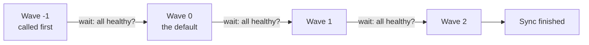
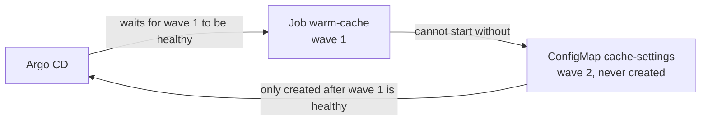

# Session 4 · Module 1.5 — Why Is My Deployment Waiting?

> **~15–20 minutes · one mistake · one-line fix**
>
> **Course environment:** Argo CD `v3.5.2`, management cluster `k3d-mgmt`.
>
> **Goal:** explain why Argo CD is waiting, then fix the dependency order in Git.

## 1. Why this matters

Your application can have correct YAML and still fail to start. A task might need configuration that has not arrived, or new application code might need a database migration to finish first.

**Deploying the right resources is only half the job. Their prerequisites must be ready too.**

In this exercise there are only two resources:

| Resource | Its job |
| --- | --- |
| ConfigMap `cache-settings` | Holds a setting called `CACHE_TARGET`. |
| Job `warm-cache` | Reads that setting and runs a short task. |

The task simulates warming a cache by printing messages and pausing for three seconds. There is no database, web server, or real cache to configure.


**The dependency:** the Job needs the ConfigMap. Kubernetes cannot start its container without that required setting.

## 2. Sync waves in plain words

### The picture to keep: boarding a plane by group number

When a plane boards, the gate agent does not open the door to everyone at once. They call **Group 1**, wait until those passengers are on board and seated, and only then call **Group 2**.

A **sync wave** is a boarding group for Kubernetes resources. During a sync, Argo CD is the gate agent:

1. It gives every resource a group number: its **wave**.
2. It calls the **lowest** wave first and sends those resources to the cluster.
3. It **waits until every resource in that wave is healthy** — everyone in the group is seated.
4. Only then does it call the next wave.



### How you give a resource a wave

You add one annotation (a note in the resource's `metadata`):

```yaml
metadata:
  annotations:
    argocd.argoproj.io/sync-wave: "1"
```

Four facts are all you need:

| Fact | In boarding terms |
| --- | --- |
| A resource with **no** wave annotation is in wave `0`. | A passenger with no group printed on the ticket boards with Group 0. |
| **Lower numbers go first.** Negative numbers are allowed, so `"-1"` goes before `"0"`. | Group -1 is early boarding. |
| Write the number **in quotes** (`"1"`). Annotation values are text, and an unquoted number is rejected. | — |
| Argo CD waits for a wave to be **healthy** before calling the next one. A **Job** counts as healthy only when it has **finished successfully**. | The agent waits until the whole group is seated. A Job is "seated" only when its task is done. |

> **One catch:** the waiting happens **between** waves. If nothing comes after the last wave, nobody is waiting for it, so Argo CD can report the sync as finished while a Job in that last wave is still running. That is why step 6 waits for the Job before reading its output.

### The mistake this exercise shows

Boarding groups only help if they match what each passenger needs.

Picture a passenger in **Group 1** who cannot board without a boarding pass — and the boarding passes are handed out only to **Group 2**. The agent will not call Group 2 until Group 1 is seated. The passenger cannot sit down without a pass. Nobody moves.

That is the exact bug in this exercise: the Job is the passenger, the ConfigMap is the boarding pass.

Both resources here are ordinary `Sync`-phase resources. There are no hooks. You only need to compare their wave numbers. [Argo CD sync waves](https://argo-cd.readthedocs.io/en/stable/user-guide/sync-waves/)

> **Keep the controls separate:** auto-sync determines whether Git changes trigger deployment automatically. Waves control the order once deployment starts. This exercise uses manual sync so you can see each step.

## 3. Prepare once

The setup helper and its two manifests are distributed with the Session 4 course files, under `~/course/lab-files/session-04/sync-waves-simple/`.

If the helper folder is missing on an existing setup, run this **from the root of your updated `argo-new` course repository checkout** first:

```bash
mkdir -p ~/course/lab-files/session-04
cp -R courseware/environment/lab-files/session-04/sync-waves-simple ~/course/lab-files/session-04/
```

Use your configured lab terminal, with Git credentials, a logged-in Argo CD CLI, and the existing `~/hello-reconcile` checkout. Load the environment:

```bash
source ~/argo-lab-env.sh
cd ~/course/lab-files/session-04/sync-waves-simple
bash practice.sh prepare
source run.env
```

**What the helper does:** clones a fresh working copy, creates a new practice branch with just these two manifests in the Application's source folder, pushes it, and creates a uniquely named manual-sync Application and namespace destination. It does not alter your existing checkout or `main` branch. Git may request the same credentials as earlier labs.

`run.env` stores your practice names: `$APP` is the Application, `$NS` its namespace, and `$WORKTREE` your new Git checkout. Keep using this terminal.

If preparation fails, stop at that error. To retry from a fresh run, use `bash practice.sh cleanup`, then prepare again. The helper reads the Mac/VM-accessible Git URL from your existing checkout; Argo CD uses the lab's internal `lab-gitea` URL.

## 4. Predict, then watch it get stuck

Open the two files:

```bash
cd "$WORKTREE"
cat "$APP/job.yaml"
cat "$APP/settings.yaml"
```

Find the Job's `configMapRef` naming `cache-settings`, then compare the waves:

| Resource | Wave |
| --- | ---: |
| Job `warm-cache` | 1 |
| ConfigMap `cache-settings` | 2 |

**Predict:** the Job boards with Group 1, but its boarding pass (the ConfigMap) is handed out with Group 2. Can the Job finish? Write down what you think Argo CD will be waiting for.

Start the sync:

```bash
argocd app sync "$APP" --timeout 40
```

**Expected:** the command eventually times out. The Argo CD operation is still running; the CLI timeout only stops waiting for it.

You will inspect the operation and the waiting Pod from the terminal in the next step.

## 5. Follow the evidence

**What is Argo CD waiting for?**

```bash
argocd app get "$APP" --show-operation
```

Look for these two lines *(your times differ)*:

```text
Phase:              Running
Message:            waiting for healthy state of batch/Job/warm-cache
```

The gate agent (Argo CD) is standing at the door, waiting for Group 1 to be seated. The `cache-settings` row below it still says `Missing`: Group 2 was never called.

**Why can't the Job finish?**

```bash
kubectl --context k3d-mgmt -n "$NS" describe pods -l job-name=warm-cache
```

Look under **Events** for a message such as:

```text
Error: configmap "cache-settings" not found
```

The container may show `CreateContainerConfigError`. If you see an image-pull or other error instead, resolve that before interpreting the result as the intended missing-configuration problem.


**What happened?** Follow the two waits:

1. **Argo CD waits for the Job.** It will not call wave `2` until everything in wave `1` is healthy, and a Job is healthy only when it finishes.
2. **The Job waits for the ConfigMap.** Kubernetes cannot start the Job's container without `cache-settings`, and that ConfigMap is in wave `2`.

Each is waiting for the other. This is a **circular wait**, also called a **deadlock**: the passenger waits for a pass that is only handed out after the passenger sits down.



## 6. Fix one number in Git

Stop the old operation so you can sync the corrected revision:

```bash
argocd app terminate-op "$APP"
```

Open **`settings.yaml` inside the `$APP` folder in `$WORKTREE`**. Change only the ConfigMap's wave from `"2"` to `"0"`:

```yaml
argocd.argoproj.io/sync-wave: "0"
```

Leave the Job in wave `1`. Commit and deploy the fix:

```bash
git add "$APP/settings.yaml"
git commit -m "Create settings before the Job needs them"
git push
argocd app get "$APP" --refresh
argocd app sync "$APP" --timeout 120
```

If the previous operation is still terminating, wait briefly and retry the sync.

**Expected:** the sync now finishes in a few seconds with `Phase: Succeeded`. The ConfigMap boards with wave `0`; then the Job, in wave `1`, finds its boarding pass waiting.

The Job is the **last** wave, so the sync can report success a moment *before* the Job finishes (the catch from section 2). Wait for the Job, then read its output:

```bash
kubectl --context k3d-mgmt -n "$NS" wait --for=condition=complete job/warm-cache --timeout=60s
kubectl --context k3d-mgmt -n "$NS" logs job/warm-cache
```

Expected:

```text
job.batch/warm-cache condition met
warming cache for web
cache warm
```

**Success:** the Job completes and the sync succeeds. Creating the missing ConfigMap allows Kubernetes to retry starting the waiting container. You did not need to delete the Job.

| | Before the fix | After the fix |
| --- | --- | --- |
| ConfigMap `cache-settings` (the boarding pass) | wave `2` — handed out after the Job | wave `0` — handed out first |
| Job `warm-cache` (the passenger) | wave `1` — waits forever | wave `1` — boards and finishes |
| Sync | stuck `Running` | `Succeeded` |

## 7. Say the lesson in one sentence

> **Put prerequisites before the resources that need them. When a sync waits, find what is waiting for what.**

Check your understanding:

- Why didn't restarting the sync with the same Git configuration solve it? **The dependency order was still wrong.**
- What changed when you moved the ConfigMap to wave `0`? **It could be created before Argo CD waited for the Job in wave `1`.**
- A resource has no `sync-wave` annotation at all. Which wave is it in? **Wave `0`.**
- Why did the fixed sync report `Succeeded` before the Job's log said `cache warm`? **Argo CD waits only *between* waves, and the Job was in the last wave, so nothing was waiting for it.**

### Where phases, kinds, and names fit — the rest of the boarding process

Waves are the part you control most often. Argo CD sorts by three other things too, and the airport picture covers all of them:

| Argo CD sorts by… | Airport version | Example in this course |
| --- | --- | --- |
| **1. Phase** | *Pre-boarding* happens before any group is called; *boarding* is the numbered groups; *after doors close* happens last | `PreSync` hook (a database migration Job) → normal `Sync` resources → `PostSync` hook (a smoke test) |
| **2. Wave** | The group number | ConfigMap in wave `-1`, Deployment in wave `0` |
| **3. Kind** | Within one group, a fixed order — like boarding window seats before aisle seats | Within one wave, a ConfigMap is sent before a Service, and a Service before a Deployment |
| **4. Name** | Within the same seat type, alphabetical order | Deployment `api` before Deployment `web` |

Read the rule as **phase → wave → kind → name**, where each arrow means "*only* if everything before it is a tie". Phase always wins: a `PreSync` hook runs before even a wave `-1` resource.

You have now practised the part that causes real incidents — the wave boundary, where Argo CD waits.

## Clean up

```bash
bash "$PACKAGE_DIR/practice.sh" cleanup
```

This removes this run's Application and namespace. The practice Git branch and checkout remain as your record. Preparing again creates fresh names, so old resources cannot hide the mistake.

**Next:** [Module 2 — Sync ordering and drift](02-sync-ordering-and-drift.md).
