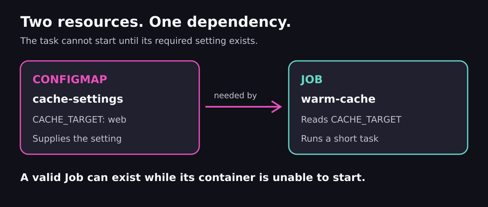
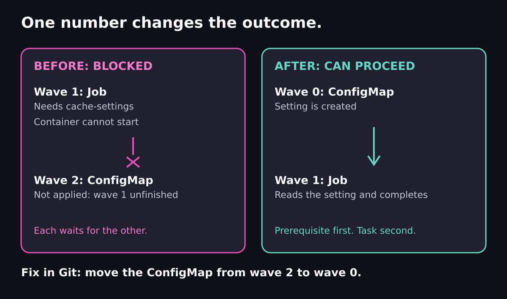

# Session 4 · Module 1.5 — Why Is My Deployment Waiting?

> **~15–20 minutes · one mistake · one-line fix**
>
> **Course environment:** Argo CD `v3.5.2`, management cluster `k3d-mgmt`.
>
> **Goal:** explain why Argo CD is waiting, then fix the dependency order in Git.

## 1. Why this matters

Your application can have correct YAML and still fail to start. A task might need configuration that has not arrived, or new application code might need a database migration to finish first.

**Deploying the right resources is only half the job. Their prerequisites must be ready too.**

In this exercise there are only two resources:

| Resource | Its job |
| --- | --- |
| ConfigMap `cache-settings` | Holds a setting called `CACHE_TARGET`. |
| Job `warm-cache` | Reads that setting and runs a short task. |

The task simulates warming a cache by printing messages and pausing for three seconds. There is no database, web server, or real cache to configure.



**The dependency:** the Job needs the ConfigMap. Kubernetes cannot start its container without that required setting.

## 2. One rule: lower waves go first

Argo CD lets you assign a **wave number** to a resource:

```yaml
metadata:
  annotations:
    argocd.argoproj.io/sync-wave: "1"
```

A wave is a numbered group within a sync phase. Lower waves are processed first; an unfinished earlier wave can block later ones. A Job must complete before Argo CD can move past its wave.

Both resources here are ordinary `Sync`-phase resources. There are no hooks. You only need to compare their wave numbers. [Argo CD sync waves](https://argo-cd.readthedocs.io/en/stable/user-guide/sync-waves/)

> **Keep the controls separate:** auto-sync determines whether Git changes trigger deployment automatically. Waves control the order once deployment starts. This exercise uses manual sync so you can see each step.

## 3. Prepare once

The setup helper and its two manifests are distributed with the Session 4 course files, under `~/course/lab-files/session-04/sync-waves-simple/`.

If the helper folder is missing on an existing setup, run this **from the root of your updated `argo-new` course repository checkout** first:

```bash
mkdir -p ~/course/lab-files/session-04
cp -R courseware/environment/lab-files/session-04/sync-waves-simple ~/course/lab-files/session-04/
```

Use your configured lab terminal, with Git credentials, a logged-in Argo CD CLI, and the existing `~/hello-reconcile` checkout. Load the environment:

```bash
source ~/argo-lab-env.sh
cd ~/course/lab-files/session-04/sync-waves-simple
bash practice.sh prepare
source run.env
```

**What the helper does:** clones a fresh working copy, creates a new practice branch with just these two manifests in the Application's source folder, pushes it, and creates a uniquely named manual-sync Application and namespace destination. It does not alter your existing checkout or `main` branch. Git may request the same credentials as earlier labs.

`run.env` stores your practice names: `$APP` is the Application, `$NS` its namespace, and `$WORKTREE` your new Git checkout. Keep using this terminal.

If preparation fails, stop at that error. To retry from a fresh run, use `bash practice.sh cleanup`, then prepare again. The helper reads the Mac/VM-accessible Git URL from your existing checkout; Argo CD uses the lab's internal `lab-gitea` URL.

## 4. Predict, then watch it get stuck

Open the two files:

```bash
cd "$WORKTREE"
cat "$APP/job.yaml"
cat "$APP/settings.yaml"
```

Find the Job's `configMapRef` naming `cache-settings`, then compare the waves:

| Resource | Wave |
| --- | ---: |
| Job `warm-cache` | 1 |
| ConfigMap `cache-settings` | 2 |

**Predict:** the Job goes first, but its configuration comes later. Can the Job finish?

Start the sync:

```bash
argocd app sync "$APP" --timeout 40
```

**Expected:** the command eventually times out. The Argo CD operation is still running; the CLI timeout only stops waiting for it.

You will inspect the operation and the waiting Pod from the terminal in the next step.

## 5. Follow the evidence

**What is Argo CD waiting for?**

```bash
argocd app get "$APP" --show-operation
```

Look for a running operation waiting for `warm-cache` to become healthy.

**Why can't the Job finish?**

```bash
kubectl --context k3d-mgmt -n "$NS" describe pods -l job-name=warm-cache
```

Look under **Events** for a message such as:

```text
Error: configmap "cache-settings" not found
```

The container may show `CreateContainerConfigError`. If you see an image-pull or other error instead, resolve that before interpreting the result as the intended missing-configuration problem.



**What happened?** The Job needs the ConfigMap. Argo CD waits for the Job before reaching the ConfigMap's wave. Each blocks the other—a circular wait, also called a deadlock.

## 6. Fix one number in Git

Stop the old operation so you can sync the corrected revision:

```bash
argocd app terminate-op "$APP"
```

Open **`settings.yaml` inside the `$APP` folder in `$WORKTREE`**. Change only the ConfigMap's wave from `"2"` to `"0"`:

```yaml
argocd.argoproj.io/sync-wave: "0"
```

Leave the Job in wave `1`. Commit and deploy the fix:

```bash
git add "$APP/settings.yaml"
git commit -m "Create settings before the Job needs them"
git push
argocd app get "$APP" --refresh
argocd app sync "$APP" --timeout 120
```

If the previous operation is still terminating, wait briefly and retry the sync.

Check the task's output:

```bash
kubectl --context k3d-mgmt -n "$NS" logs job/warm-cache
```

Expected:

```text
warming cache for web
cache warm
```

**Success:** the Job completes and the sync succeeds. Creating the missing ConfigMap allows Kubernetes to retry starting the waiting container. You did not need to delete the Job.

## 7. Say the lesson in one sentence

> **Put prerequisites before the resources that need them. When a sync waits, find what is waiting for what.**

Check your understanding:

- Why didn't restarting the sync with the same Git configuration solve it? **The dependency order was still wrong.**
- What changed when you moved the ConfigMap to wave `0`? **It could be created before Argo CD waited for the Job in wave `1`.**

**Where phases fit:** `PreSync` hooks run before the main deployment; normal resources use `Sync`; `PostSync` hooks run after successful deployment and health checks. Waves order resources inside those stages. The full rule is **phase → wave → kind → name**. You have now practiced the wave boundary that makes ordering useful.

## Clean up

```bash
bash "$PACKAGE_DIR/practice.sh" cleanup
```

This removes this run's Application and namespace. The practice Git branch and checkout remain as your record. Preparing again creates fresh names, so old resources cannot hide the mistake.

**Next:** [Module 2 — Sync ordering and drift](02-sync-ordering-and-drift.md).
