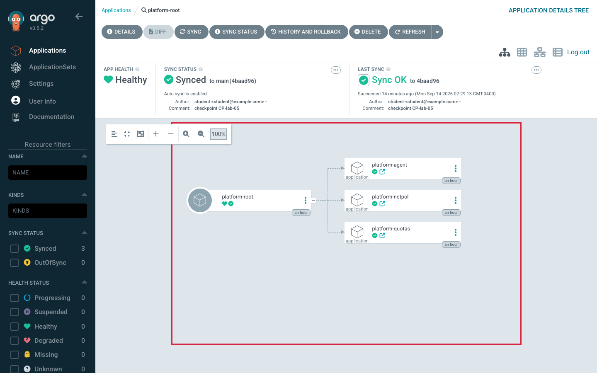

# ApplicationSets and App-of-Apps

> **Day 2 · Session 5 · Concept guide · ~60 minutes**
> **Argo CD version this course targets: `v3.5.2`** (Helm chart `10.8.4`; the repo-server renders charts with **Helm v4.2.1**).
> **What you need open:** nothing is required — this is a read-and-think session. There is one optional, read-only CLI (command-line interface) exercise at the end (Section 7) that renders an ApplicationSet's output **without creating anything**. **Lab 4** is where you actually build the storefront ApplicationSet, trace an App-of-Apps root, break it, and recover; this session gives you the mental model that makes Lab 4 make sense.

> **Timing, accounted honestly (for you and your instructor).** The course allots this session **60 minutes**, and the table below covers *every* section, reading time included — not only the walkthrough. Walked at full depth the blocks total about **75 minutes**, so five of them are marked as *self-read* or *compressible*. Taking all five moves lands the session at roughly **62 minutes**; the last minute or two comes out of Quick Check discussion. Nothing is removed from the file either way — compressed material stays here to read.
>
> | Block | Full depth | If time is short |
> |---|---:|---|
> | Section 1 — Why this matters | 3 min | |
> | Section 2 — Mental model (factory and family tree) | 4 min | never cut: everything else hangs off it |
> | Section 3 — Vocabulary (8 terms) | 3 min | **self-read** before the session |
> | Section 4 — V-19 fan-out and V-20 ownership tree | 6 min | |
> | Sections 5.1–5.2 — Two controllers, five generators | 14 min | never cut |
> | Sections 5.3–5.4 — Template, hard-coded `project`, `missingkey=error` | 8 min | never cut |
> | Sections 5.5–5.6 — The three controls, preview → count → apply | 8 min | never cut |
> | Section 5.7 — Progressive sync box | 3 min | **compress** to its two headline facts (1 min) |
> | Sections 5.8–5.9 — App-of-Apps and deleting a root | 8 min | |
> | Sections 5.10–5.11 — Multiple roots, tracing root → repo → child | 3 min | **compress** to 1 min; Lab 4 drills the trace |
> | Section 4 — V-21 decision table | 3 min | |
> | Section 6 — Quick Checks (four) | 6 min | **two live, two self-check** |
> | Screenshot gallery (SS-S5-01 to SS-S5-03) | 3 min | **self-read** |
> | Sections 8–9 — Misconceptions, takeaways, transition | 3 min | |
> | **Total** | **75 min** | **≈62 min** |
>
> Section 7 (Try It Yourself) is optional and sits **outside** this budget.

**Where this sits in the course.** Day 1 ended with one working path: a change in Git, reconciled by the **application controller** (the Argo CD component that compares desired state to live state and applies the difference), landing on a workload cluster. Session 4 taught how Helm renders, how a sync is ordered, and how a change is promoted. Everything so far has been about **one Application at a time**.

Day 2 is about **scale**. In production you rarely have one Application — you have the same app across a dozen clusters, or a whole platform of components that must come up in a known order. This session teaches the two patterns Argo CD gives you for that, **ApplicationSets** and **App-of-Apps**, and — equally importantly — how to reason about the new failure modes each one introduces. By the end you will be able to predict how many Applications a generator will produce, explain why a missing value is more dangerous than an error, choose the right pattern from the outline's decision table, and describe exactly what deleting a root Application does.

**One promise up front, because it removes most of the fear:** there is **no new deployment mechanism today.** Both patterns are new ways of *writing Applications* — not a new deployment mechanism. Once an Application exists, the same Day-1 controller reconciles it in exactly the same way. Hold onto that; we will return to it repeatedly.

---

## 1. Why this matters

It is a Wednesday. A platform engineer needs to bump the container image tag for the `storefront` app, which runs in every environment. They open the one file that defines all of them — an **ApplicationSet** — and change a single line: the branch the app tracks.

They commit. They get coffee.

By the time they are back, **forty Applications have changed**. Not one. Forty. Every environment the ApplicationSet generates picked up the edit at once, and the controller — which has no idea the engineer was only "trying a quick change" — began syncing all of them. Two environments were mid-incident and should have been frozen. One was production.

Nothing here malfunctioned. The ApplicationSet did precisely what an ApplicationSet is *for*: it took one template and one data source and applied a change uniformly across everything it owns. That is the whole value of the pattern — **leverage**. One edit moves forty things. It is also the whole danger of the pattern — **blast radius**. One edit moves forty things.

This session is about holding both of those truths at once. You will learn:

- how an ApplicationSet turns a **template** plus a **data source** into many Applications (and how to count them *before* you edit);
- why the most dangerous ApplicationSet bug is not an error message but a **successful render of the wrong thing**;
- the three named settings that decide whether the "factory" may create, update, or delete its output;
- how to **preview** generated output before any of it is real;
- how **App-of-Apps** — a deliberately written parent-and-children hierarchy — differs from an ApplicationSet, and why deleting its root either removes *everything* or *nothing*;
- and, from the outline's own decision table, how to choose between the two.

The engineer in the story was not careless. They were missing one habit — **preview, then count, then apply** — and one mental model. Let us build the model first.

---

## 2. Plain-language mental model: a factory and a family tree

Two patterns, two pictures. Get these two images right and the rest of the session is detail.

**An ApplicationSet is a factory.** You give it a *template* (the shape of one Application, with blanks in it) and a *data source* (a list of values to fill the blanks). It stamps out one nearly-identical Application per item in that list. Add an item to the list, and a new Application appears with no new writing. Change the template, and every stamped copy changes together. A factory is defined by its inputs; you do not hand-write each product, you *derive* them.

**App-of-Apps is a family tree.** Someone sat down and deliberately wrote out a hierarchy: this **root** Application, whose job is to create these specific **child** Applications, in roughly this order. There is no "list to fill in" — the list *is* the decision. A family tree is defined by intent; each member is *decided*, written down by name, and you can read the whole tree top to bottom and say what is supposed to exist.

That single contrast gives you the choosing rule, and it is the entire decision table in one line:

> **Use a factory when the list is _derived_. Use a family tree when the list is _decided_.**

"Deploy the same agent to every cluster Argo CD already knows about" — the list is *derived* from the clusters, so: factory (ApplicationSet). "Bring up the platform's namespaces, then quotas, then network policies, then the agent, in that order" — the list is a *decision* a human made, so: family tree (App-of-Apps).

Two more framings to carry through the session, because they keep you from the most common wrong takeaway ("ApplicationSets are the advanced pattern and App-of-Apps is the beginner one"):

- **ApplicationSet gives you _leverage_.** One change moves forty things. That is power and risk in the same gesture.
- **App-of-Apps gives you _legibility_.** A human can read the tree and say, out loud, exactly what should exist and in what order.

Most real platform teams want **both** — and that is exactly what the last row of the decision table warns about: you may combine them, but *only with explicit ownership and deletion boundaries*, so that two things never think they own the same resource. We will earn that warning by the end.

---

## 3. Vocabulary, grounded before we use it

Each term gets a plain-language definition first, then its role. These eight are the words you need **before** the walkthrough; Lab 4 uses them freely.

Three more terms — the **merge** generator, **dry-run / preview**, and **progressive sync** — are defined in one line at the exact moment they first matter (Sections 5.2, 5.6, and 5.7), because each one gets its full treatment there and a definition here would only be read twice.

- **ApplicationSet** (often abbreviated **AppSet** — you will see the short form in diagrams, in Lab 4, and in the capstone). A Kubernetes **CRD (Custom Resource Definition** — a way of teaching Kubernetes a new kind of object) that Argo CD installs. An ApplicationSet object describes a *template* for an Application plus one or more *generators*, and the ApplicationSet controller turns that into many real Application objects. It is the "factory."

- **ApplicationSet controller.** A separate Argo CD component — the pod named `argocd-applicationset-controller` in the `argocd` namespace — whose *only* job is to create, update, and delete **Application objects**. It never talks to a workload cluster, never renders a Helm chart, never applies a Deployment. (Contrast: the **application controller** from Day 1 is the one that reconciles each Application onto a cluster. Two different controllers, two different jobs.)

- **generator.** The part of an ApplicationSet that produces the *list* the factory stamps from. Each generator answers one question — "which environments? which clusters? which files?" — and emits a set of key/value parameters, one entry per item. The five this course teaches: **list**, **cluster**, **git**, **matrix**, **merge**.

- **template (in an ApplicationSet), and Go template.** The **template** is the shape of one Application, with `{{ ... }}` placeholders where a generator's values get substituted; one template, rendered once per generator entry, yields many Applications. **Go template** is the templating language Argo CD uses to fill those placeholders (the same language family Helm uses), switched on per-ApplicationSet with `goTemplate: true`. It is what turns `name: "storefront-{{ .env }}"` into `storefront-dev`, `storefront-staging`, and so on.

- **`missingkey=error`.** An opt-in Go-template strictness setting, written as `goTemplateOptions: ["missingkey=error"]`. **By default, a placeholder whose key is missing from the generator renders as an empty string** and no error is raised. With this option on, a missing key raises a template **error** instead — the ApplicationSet refuses to generate rather than generate something wrong. It is **not** the default, for backwards compatibility. Section 5.4 shows why it matters so much.

- **`applicationsSync` policy, and `preserveResourcesOnDeletion`** — the factory's two brakes, sitting on **two different layers**. `spec.syncPolicy.applicationsSync` (`create-only`, `create-update`, or `create-delete`) decides what the factory may do to the **Application objects** it already made. `spec.syncPolicy.preserveResourcesOnDeletion: true` decides something else entirely: when a generated Application *is* deleted, it leaves that Application's **child workload resources running** instead of cleaning them up. Section 5.5 is the full trio plus this fourth switch; keep the two layers apart in your head.

- **App-of-Apps, root Application, and child Application.** **App-of-Apps** is a pattern (not a CRD) in which one ordinary Application — the **root** — has, as its rendered content, *other Application manifests*. Syncing the root creates those **child** Applications, and each child in turn manages real workloads. That is the "family tree," and ownership flows downward: root owns children, children own workloads.

- **finalizer, and cascading deletion.** A **finalizer** is a small annotation on an Application — `resources-finalizer.argocd.argoproj.io` — that tells Kubernetes "before you actually remove this object, let Argo CD clean up what it manages first." **With** the finalizer, deleting the object triggers **cascading deletion**: the delete *propagates* to everything the object owns — children, and their workloads — instead of stopping at the object. **Without** it, deleting the object removes only the object and leaves everything it managed **orphaned but still running**. One quiet annotation, two opposite outcomes.

---

## 4. Visuals

Three pictures carry this session. Read each one, and try to answer its **Predict first** question in your head before the debrief under it.

### V-19 · Generator fan-out — one edit, multiplied

**Predict first:** an ApplicationSet uses a **matrix** generator combining 2 clusters with 3 environment files, and its template names each app `storefront-{{ .env }}-{{ .name }}`. How many Applications does it generate — and if you change one line in the template, how many Applications change?

Here is the fan-out. Notice the **hard horizontal line**: everything above it is new today; everything *below* it is exactly Day 1.

```text
           ONE TEMPLATE                        ONE DATA SOURCE (generator)
   ┌──────────────────────────┐        ┌───────────────────────────────────────┐
   │ name: storefront-{{.env}} │        │ matrix:                               │
   │       -{{.name}}          │   ×    │   clusters (2): workload-a, workload-b │
   │ project: storefront       │        │   git files (3): dev, staging, prod    │
   │ valueFiles:               │        │   → 2 × 3 = 6 combinations             │
   │   envs/{{.env}}/values    │        └───────────────────────────────────────┘
   └──────────────────────────┘
                    │  ApplicationSet controller stamps one Application per combination
                    ▼
   ┌──────────┬──────────┬──────────┬──────────┬──────────┬──────────┐
   │storefront│storefront│storefront│storefront│storefront│storefront│   ← 6 Application
   │-dev-     │-dev-     │-staging- │-staging- │-prod-    │-prod-    │     OBJECTS
   │workload-a│workload-b│workload-a│workload-b│workload-a│workload-b│
   └────┬─────┴────┬─────┴────┬─────┴────┬─────┴────┬─────┴────┬─────┘
════════╪══════════╪══════════╪══════════╪══════════╪══════════╪═══════ everything BELOW
        ▼          ▼          ▼          ▼          ▼          ▼        this line is DAY 1
   the SAME application-controller reconciles each Application onto its cluster,
   exactly as it did for one Application in Lab 1. No new deployment mechanism.
```

**What to notice:**

1. **Answer to the prediction: 6 Applications, and one template line changes all 6.** Blast radius is arithmetic, not a feeling: `(items in the generator) × (one template edit) = that many simultaneous changes`. If the generator yielded 40 clusters, editing one line would be a 40-cluster change — and the editing experience looks identical to editing one, because nothing about the edit signals "careful, this is big." That is why *counting* the generated Applications before you edit (Section 5.6) is a safety practice, not a formality.
2. **Everything below the line is Day 1.** The ApplicationSet controller's job ends the instant the Application objects exist. From there, each Application is reconciled by the same application controller, with the same sync/health axes, the same drift behavior, the same everything from Session 2 and Lab 1. **There is no new deployment path to learn today.**

### V-20 · App-of-Apps ownership tree, with the cascade path

**Predict first:** you delete the **root** Application. What happens to its children and their workloads — and does the answer depend on anything other than "you clicked delete"?

Here is the course's real App-of-Apps hierarchy, drawn twice — once **with** the finalizer, once **without** — because the deletion outcome flips entirely on that one annotation.

```text
                         WITH finalizer                    WITHOUT finalizer
                    (resources-finalizer.argocd...)      (no finalizer present)

  ROOT  ───────────►  platform-root                        platform-root
  (project: platform) │  (path: apps, → argocd ns)         │
                      │                                     │
       ┌──────────────┼──────────────┐        ┌─────────────┼──────────────┐
       ▼              ▼              ▼         ▼             ▼              ▼
  platform-quotas platform-netpol platform-  platform-  platform-      platform-
  (→ storefront-  (→ storefront-  agent      quotas     netpol         agent
   dev)            dev)           (→ platform-
                                   system)
       │              │              │         │             │              │
       ▼              ▼              ▼         ▼             ▼              ▼
  ResourceQuota  NetworkPolicy   Deployment   (still     (still         (still
   on workload    on workload     on workload  running)   running)       running)
   cluster         cluster         cluster
       ╚══════════════╩══════════════╝              ▲             ▲              ▲
   DELETE root  ⇒  cascade removes children          └── DELETE root removes ONLY
   AND their workloads, tearing down in reverse           the root object; every child
   (children/high-waves first, root object last).         is ORPHANED but keeps running.
```

**What to notice:**

1. **Answer to the prediction: it depends entirely on the finalizer.** With `resources-finalizer.argocd.argoproj.io` on the root, deleting the root **cascades** — the delete follows the ownership edges downward (root → the three child Application objects → their workloads), so the children and their workloads are removed too. Without it, deleting the root removes only the root object, and every child keeps running with no parent. **Two opposite disasters, one quiet annotation apart.**
2. **Cascade tears down in reverse of build-up.** Just as a sync builds low sync-waves first, a cascading delete removes managed resources before the object that owns them is finally gone (the default *foreground* propagation waits for the children first). You do not need the exact ordering memorized; you need to know that "delete the root" is never a small, local action.

### V-21 · Choosing the Right Pattern (the outline's decision table, verbatim)

This is the outline's own table, reproduced exactly. It is the frame for this whole session and the spine of Lab 4 — everything above is how to *re-derive* it from the factory/family-tree metaphor.

| Need | Prefer |
|---|---|
| Generate similar Applications from cluster or Git data | ApplicationSet |
| Bootstrap a known hierarchy of platform components | App-of-Apps |
| Manage many clusters or environments without duplication | ApplicationSet |
| Preserve a deliberate parent-child bootstrap structure | App-of-Apps |
| Combine both patterns | Only with explicit ownership and deletion boundaries |

**What to notice:**

1. **Every row is "derived or decided?" in disguise.** Rows 1 and 3 are *derived* lists (from cluster or Git data, across many targets) → factory. Rows 2 and 4 are *decided* hierarchies (a known set, a deliberate structure) → family tree. If you remember only the metaphor, you can rebuild this table.
2. **The last row is a condition, not a recommendation.** It does not say "combining is best"; it says combining is allowed *only* with explicit ownership and deletion boundaries. In practice that means: decide, per resource, which single thing owns it, and decide where the finalizer lives — so a delete never surprises you (V-20) and two owners never fight over one namespace (Section 5.10).

---

## 5. Worked walkthrough

We will trace both patterns end to end, using the **real example files** on your VM. Every ApplicationSet below lives in `platform-config/examples/`, and every App-of-Apps file lives in `platform-config/root/` and `platform-config/apps/` (staged for Lab 4). None of the examples is applied by the environment — they exist to be *read* and *previewed*.

### 5.1 The one sentence that removes today's fear: ApplicationSets do not deploy anything

Say it plainly, because it is the biggest cognitive-load reduction available on Day 2:

> **The ApplicationSet controller creates, updates, and deletes _Application objects_. That is all.**

It never contacts a workload cluster. It never renders a chart. It never applies a Deployment. The instant a generated Application exists, the **application controller** from Day 1 takes over and reconciles it exactly as it reconciled the single `hello-reconcile` app in Lab 1 — same sync status, same health status, same drift and self-heal behavior.

One Day-1 lesson is worth retrieving right here, because the fan-out in V-19 is the moment it matters most: **`OutOfSync` does not mean broken.** When a generator produces six Applications at once, or when one template edit moves all six, you will see six Applications turn `OutOfSync` simultaneously — a wall of yellow that looks alarming and is not. `OutOfSync` means only "live state differs from the desired state in Git," which is the *expected* and correct reading between a commit and the sync that follows it. Read the count, not the color.

So there are really only two questions you will ever ask when an ApplicationSet-generated app is wrong, and they belong to two different components:

- **Is the _Application_ wrong?** → that is the Day-1 application controller's domain (rendering, sync, health).
- **Is the _thing that wrote the Application_ wrong?** → that is the ApplicationSet controller and its generator.

Keeping those two questions separate is the entire tracing drill of Lab 4. Everything "below the line" in V-19 is old news.

### 5.2 Generators, taught by the question each one answers

A generator's job is to produce the *list*. The cleanest way to learn the five is by the question each answers, not by its fields.

**`list` — "here are the environments; I am telling you."** The most explicit generator: you write the items out by hand. From `examples/appset-list.yaml`:

```yaml
generators:
  - list:
      elements:
        - env: dev
        - env: staging
template:
  metadata:
    name: "example-{{ .env }}"     # → example-dev, example-staging
```

Two elements in, two Applications out. Reach for `list` when the set is small and you *decide* it directly (which, note, is the factory doing a very family-tree-ish thing — the boundary is soft, and that is fine).

**`cluster` — "make one per cluster Argo CD already knows about."** This generator reads the clusters registered with Argo CD (the same cluster Secrets you registered in Lab 2) and emits one entry per cluster that matches a label selector. From `examples/appset-cluster.yaml`:

```yaml
generators:
  - clusters:
      selector:
        matchLabels:
          cluster-role: workload      # only workload clusters, never the management cluster
template:
  spec:
    destination:
      server: "{{ .server }}"         # each matched cluster's API server URL
```

In this course the workload cluster is labeled `cluster-role: workload` and `region: lab`. The selector `cluster-role: workload` is doing real safety work: it *excludes* the management cluster (`in-cluster`), so the storefront app can never be generated onto the cluster that runs Argo CD itself. Reach for `cluster` when the list is *derived from your fleet* — "every workload cluster, whatever they happen to be today."

**`git` — "make one per file (or directory) in this repo; adding an environment means adding a folder."** This generator scans a Git repository and emits one entry per matching file or directory. From `examples/appset-git-files.yaml`:

```yaml
generators:
  - git:
      repoURL: http://lab-gitea:3000/course/storefront-gitops.git
      revision: main
      files:
        - path: "envs/*/config.yaml"   # one entry per env's config.yaml
```

Each matched `config.yaml` becomes a set of parameters. The course's `envs/dev/config.yaml` contains:

```yaml
env: dev
namespace: storefront-dev
targetRevision: main
```

so the generator hands the template `.env`, `.namespace`, and `.targetRevision` for each environment. `envs/prod/config.yaml` sets `targetRevision: storefront-1.0.0` — an immutable Git **tag** — so production stays pinned while `dev` and `staging` track `main`. Reach for `git` when the list should *scale with a team*: adding an environment is a pull request that adds a folder, with no change to the ApplicationSet itself. This is the generator that best embodies GitOps.

**`matrix` — "every combination of two generators."** Named here with one example, because it is exactly the shape Lab 4 builds. Matrix takes two child generators and produces the *cross-product*: every item of the first paired with every item of the second. From `examples/appset-matrix.yaml`:

```yaml
generators:
  - matrix:
      generators:
        - clusters:                    # which clusters
            selector:
              matchLabels:
                cluster-role: workload
        - git:                         # which environments
            repoURL: http://lab-gitea:3000/course/storefront-gitops.git
            revision: main
            files:
              - path: "envs/*/config.yaml"
template:
  metadata:
    name: "example-{{ .env }}-{{ .name }}"   # env from git, name from cluster
```

With 1 workload cluster × 3 env files you get 3 Applications; with 2 clusters × 3 env files you would get 6 (that was V-19's arithmetic). Matrix is how you say "this app, on every environment, on every workload cluster" without hand-writing the combinations.

**`merge` — "combine generators and let one override another on a key."** Also one example only. Merge overlays the outputs of several generators, matching entries on a **merge key** so a later generator can override an earlier one for the same item. From `examples/appset-merge.yaml`:

```yaml
generators:
  - merge:
      mergeKeys: [env]
      generators:
        - list:
            elements:
              - {env: dev, replicas: "1"}
              - {env: staging, replicas: "2"}
        - list:                        # overrides staging's replicas to 3
            elements:
              - {env: staging, replicas: "3"}
```

The result: `dev` keeps `replicas: 1`; `staging` is overridden to `replicas: 3`. Reach for `merge` when you have a base list and a small set of per-item exceptions.

> **The list is longer than five — on purpose we stop here.** Current Argo CD also documents **SCM Provider** (**SCM** is source-code management — a Git hosting system such as GitHub or Gitea), **Pull Request**, **Cluster Decision Resource**, and **Plugin** generators. They exist; they are out of scope for this course. Knowing the five above (and that more exist) is enough to reason about any ApplicationSet you will meet in Lab 4 and the capstone.

Here is the whole set as a lookup:

| Generator | The question it answers | Data source |
|---|---|---|
| `list` | "Here are the items; I'm telling you." | Hand-written elements |
| `cluster` | "One per cluster Argo CD knows about." | Registered cluster Secrets (by label) |
| `git` | "One per file/folder in this repo." | Files or directories in Git |
| `matrix` | "Every combination of two generators." | Two child generators (cross-product) |
| `merge` | "Combine, and let one override another." | Several child generators (by merge key) |
| *SCM / Pull Request / Cluster Decision Resource / Plugin* | *(exist; out of scope for this course)* | *(various external systems)* |

### 5.3 The template, and why `project` must stay hard-coded

The template is one Application with `{{ ... }}` blanks. Turn Go templating on with `goTemplate: true`, and the generator's values fill the blanks. Nothing here is new versus a normal Application manifest except the placeholders.

There is exactly **one field you must never templatize**, and it is a security rule, not a style preference:

> ### 🔒 Required caveat — keep `project` hard-coded in every ApplicationSet
>
> An Application's **`spec.project`** names the **AppProject** (the tenant boundary from Session 6) that decides which repos, clusters, namespaces, and resource kinds that Application is allowed to touch. If you write `project: "{{ .project }}"` and let a generator supply it, then **whoever controls the generator's data source controls which security boundary the generated Applications land in.** A crafted entry could place an Application into a high-privilege project it was never meant to use — a straightforward privilege escalation.
>
> Every ApplicationSet in this course keeps `project` a **literal string** (`project: storefront` for the storefront apps, `project: platform` for platform apps). Look at every `examples/*.yaml`: the project is hard-coded. Do the same in Lab 4. Templatize names, destinations, and value files freely; never templatize `project`.

### 5.4 Failing safely: the dangerous bug is a successful render of the wrong thing

Here is the most counterintuitive — and most important — idea in the session.

With Go templating on and the **default** settings, a placeholder whose key is *missing* from the generator does **not** raise an error. It renders as an **empty string**. The ApplicationSet controller then cheerfully creates a real Application with an empty field — an app pointing at path `""`, or into namespace `""`, or at revision `""`. Nothing errors at generation time. The broken Application sits in the list looking ordinary, and the failure surfaces somewhere else entirely, minutes later, wearing a different disguise (a sync error, a wrong-namespace deploy, a missing chart).

The documented fix is to **opt into strictness**:

```yaml
spec:
  goTemplate: true
  goTemplateOptions: ["missingkey=error"]   # a missing key is now an ERROR, not ""
```

With this on, a missing key makes the ApplicationSet raise a template **error condition** and generate *nothing* for that entry — the existing Applications are left untouched, and you get a loud signal instead of a silent, wrong Application.

Notice what happened there: **the safer configuration produces _more_ failures, earlier — and that is precisely the point.** An error at generation time is cheap and local; a successfully-generated wrong Application is expensive and remote. Every `examples/*.yaml` in this course sets `goTemplateOptions: ["missingkey=error"]`. Be aware, though, that it is **not** the default — any older ApplicationSet in your own estate almost certainly does *not* have it, which means those are silently rendering empties whenever a key goes missing.

### 5.5 The three controls that bound what the factory may do to its output

Leverage needs a brake. Three named settings decide what the ApplicationSet controller is allowed to do to Applications it has already made. Learn them as a trio, because they answer three different questions:

| `applicationsSync` value | May **create**? | May **update**? | May **delete**? |
|---|:---:|:---:|:---:|
| `create-only` | ✅ | ❌ | ❌ |
| `create-update` | ✅ | ✅ | ❌ |
| `create-delete` | ✅ | ❌ | ✅ |

- **`create-only`** — the factory may make new Applications but may not modify or delete existing ones. Maximum protection; changes to the template will *not* propagate to already-generated apps.
- **`create-update`** — it may create and update, but **never delete**. This is the common safe default for production: template edits flow to existing apps, but removing an item from the generator does **not** auto-delete the corresponding Application. The cost is that you must clean up "orphaned" Applications *deliberately* — they do not disappear on their own.
- **`create-delete`** — it may create and delete, but not modify. Rare; used when you want removals to propagate but not in-place edits.

And a fourth setting, on a **different layer** — do not conflate it with the three above:

- **`preserveResourcesOnDeletion: true`** — when a generated **Application** *is* deleted, this leaves that Application's **child workload resources running** instead of cleaning them up. The three `applicationsSync` values control the **Application objects**; `preserveResourcesOnDeletion` controls the **workloads underneath**. Two layers, two switches.

You will set `create-update` and `preserveResourcesOnDeletion: true` in Lab 4, then remove an item from the generator and watch the corresponding app *not* vanish — proof that "safe" here means "deletion is now your deliberate decision, not the factory's reflex."

### 5.6 Preview before you apply — count the Applications first

The antidote to V-19's blast radius arrives within a minute of the fear: **dry-run / preview** — rendering the Applications an ApplicationSet *would* produce **without creating any of them**. Preview is read-only on purpose: Git stays the write interface. There are three ways to do it, in order of dependability for this course:

1. **`argocd appset generate <file>`** — the dependable, portable CLI command. It renders the Applications the ApplicationSet would produce and prints them; nothing is created. Add `-o yaml` (or `json`, or the default `wide`) to choose the format.
2. **`argocd appset create --dry-run <file>`** — evaluates the template server-side and returns the Applications that *would* be managed, again creating nothing.
3. **The web UI (user interface) Preview tab** — new on the 3.5 line and visually excellent, but **Alpha** (see SS-S5-01 and SS-S5-02 in the screenshot gallery at the end of this session). Treat it as a "you can also," not the method you rely on.

The habit to build — the one that survives contact with a real 40-cluster estate — is **preview → count → apply**. Before you change a generator or a template, render the output and *read the generated Application names out loud*. If you expected three and see thirty, you have caught a blast-radius mistake for free. This rhythm is the whole spine of Lab 4.

### 5.7 Progressive sync — a boxed, version-dependent feature you will *not* depend on

> ### ⚠️ OPTIONAL / VERSION-DEPENDENT — Progressive Syncs (Beta since v3.3.0). No hands-on dependency in this course.
>
> **Progressive sync** is an optional, version-dependent ApplicationSet feature that rolls a change out to generated Applications in labeled stages instead of all at once. Here is the longer version. By default, when you change an ApplicationSet, **all** its generated Applications update at once (the `AllAtOnce` strategy — the fan-out in V-19). **Progressive Syncs** is the opt-in feature that instead rolls the change out in labeled **stages**, waiting for each stage's Applications to become `Healthy` before starting the next. Its strategy type is `RollingSync`, and groups are selected by labels/`matchExpressions` on the generated Applications.
>
> It is **off by default** and must be explicitly enabled on the ApplicationSet controller (via `--enable-progressive-syncs`, the env var `ARGOCD_APPLICATIONSET_CONTROLLER_ENABLE_PROGRESSIVE_SYNCS=true`, or `applicationsetcontroller.enable.progressive.syncs: "true"` in `argocd-cmd-params-cm`). **This course does not enable it, and no lab or checkpoint depends on it.**
>
> Two facts answer the outline's "when *not* to depend on it," and both are genuinely surprising:
>
> 1. **`RollingSync` forces auto-sync _off_ on every generated Application.** The docs are explicit: "RollingSync will force all generated Applications to have autosync disabled," and it logs warnings for any generated app that had an automated `syncPolicy`. So turning on progressive sync silently changes the sync behavior of every app the ApplicationSet owns — a large, easy-to-miss side effect.
> 2. **A stage that stalls can be promoted to `Healthy` by a _timeout_, not by actually becoming healthy.** An Application that stays in a progressing/pending state for `applicationsetcontroller.default.application.progressing.timeout` seconds (default **300**) is automatically moved along so the rollout can continue. A stage gate that "gives up after five minutes and declares success" is a *rollout convenience*, not a safety guarantee — do not treat it as a health gate you can trust for production promotion. *(This timeout behavior is documented for the Argo CD line this course targets; if you ever plan to rely on progressive sync in production, re-read it against your own version's Progressive Syncs documentation first.)*
>
> One boundary, stated once so nobody over-reaches: progressive sync is Argo CD's *fleet-level* staged rollout. Per-application canary or blue/green with traffic shifting is **Argo Rollouts'** job, a different tool. Do not expect canaries here.

### 5.8 App-of-Apps: a deliberate family tree

Now the second pattern. An **App-of-Apps** is not a special CRD — it is an ordinary Application whose *rendered content is other Application manifests*. The course's real root, `platform-config/root/platform-root.yaml`, is exactly this:

```yaml
kind: Application
metadata:
  name: platform-root
spec:
  project: platform                      # hard-coded, like every project field
  source:
    repoURL: http://lab-gitea:3000/course/platform-config.git
    targetRevision: main
    path: apps                           # ← this directory holds child Application manifests
  destination:
    server: https://kubernetes.default.svc   # the MANAGEMENT cluster's argocd namespace
    namespace: argocd
  syncPolicy:
    automated: { prune: true, selfHeal: true }
```

Its `path: apps` points at a directory of child Application manifests — `platform-quotas.yaml`, `platform-netpol.yaml`, `platform-agent.yaml`. Syncing the root **creates those three child Applications** onto the management cluster. Each child, in turn, is a normal Application that deploys real workloads onto the **workload** cluster:

| Child Application | Source path | Deploys to |
|---|---|---|
| `platform-quotas` | `platform-components/quotas` | `storefront-dev` namespace, workload cluster |
| `platform-netpol` | `platform-components/network-policies` | `storefront-dev` namespace, workload cluster |
| `platform-agent` | `platform-components/agent` | `platform-system` namespace, workload cluster |

That is the family tree: `platform-root` → three named children → their workloads. Nobody *derived* this list from cluster data; a human *decided* it, wrote it down by name, and can read it back. That is precisely when you prefer App-of-Apps.

**Ordering.** Because App-of-Apps is used to *bootstrap* a platform, order often matters (namespaces before the things that live in them, CRDs before the resources that use them). App-of-Apps controls order the same way any sync does — with **sync-waves** (Session 4): put a lower wave annotation on what must come first. The root creates its children; sync-waves sequence them.

### 5.9 Deleting a root: everything, or nothing

This is the App-of-Apps counterpart to the three `applicationsSync` controls, and the misconception the course must break. Revisit V-20:

- **With the `resources-finalizer.argocd.argoproj.io` finalizer on the root**, deleting the root **cascades**: Argo CD removes the child Applications and their workloads before the root object itself is finally gone.
- **Without the finalizer**, deleting the root removes *only the root object*. All three children keep running, now **orphaned** — no parent, no one reconciling the tree, and a future re-apply of the root may collide with them.

Both outcomes are disasters, in opposite directions, and they are one annotation apart. This is why the decision table's last row insists on "explicit ownership and deletion boundaries": you must *decide, on purpose*, where the finalizer lives and therefore what a delete will do — never discover it during an incident.

### 5.10 Why multiple roots become hard to reason about

The outline warns that multiple roots "become difficult to reason about." Here is the concrete mechanism. Suppose two root Applications each generate a child that manages the *same* namespace or the *same* resource. Now two owners both believe they are responsible for it. Each faithfully enforces its own view; the resource **flaps** back and forth; and — the nasty part — **both roots report `Synced` and `Healthy`.** It is the GitOps equivalent of two `terraform apply` runs against one state file.

The rule that prevents it: **ownership must be a partition, not an overlap.** Every resource has exactly one owner in the tree. When you combine ApplicationSets and App-of-Apps (the decision table's last row), this is the boundary you must draw explicitly.

### 5.11 Tracing a failure: root → repo → child

Because ApplicationSets and App-of-Apps both *write Applications*, a generated app that is wrong is fixed by finding *the layer that wrote it*, not by editing the app directly. The trace is always the same chain, and it is the drill you will run in Lab 4:

```text
  a failing resource
        ▲
        │ 1. which CHILD Application manages it?           (argocd app get <child>)
        │ 2. what does that child's SPEC say is wrong?      (path? namespace? revision?)
        │ 3. who WROTE that spec — a person, a root, or     (ownerReferences / the tree)
        │    an ApplicationSet?
        │ 4. which FILE in Git produced it?                 (root's path/apps, or the AppSet)
        ▼
  fix the SOURCE in Git, let reconciliation carry it down
```

The tell that you fixed the wrong layer: **your edit reverts.** If you hand-edit a generated child Application and something above it (a root, or the ApplicationSet controller) puts it back, you have found the owner — now go fix *there*, in Git. "If your fix reverted, you fixed the wrong layer" is the whole lesson, and it is why "is the Application wrong, or is the thing that wrote it wrong?" (Section 5.1) is the first question you ask.

---

## 6. Quick Checks

Answer each in your head (or on paper) **before** opening the collapsed answer. These are prediction and reasoning questions, not vocabulary quizzes.

### S5-QC1 — Count the fan-out (and spot the false claim)

An ApplicationSet uses a **matrix** generator combining a **cluster** generator that matches **2** workload clusters (`workload-a`, `workload-b`) with a **git-files** generator that matches **3** environment configs (`dev`, `staging`, `prod`). The template names each app `storefront-{{ .env }}-{{ .name }}`. A teammate says: "That's fine — progressive sync will roll them out one cluster at a time automatically, so the blast radius is bounded."

Predict: **how many Applications are generated, what are their names, and is the teammate right?**

<details>
<summary>Show answer and rationale</summary>

**Six Applications**, one per combination (2 clusters × 3 env files):

- `storefront-dev-workload-a`, `storefront-dev-workload-b`
- `storefront-staging-workload-a`, `storefront-staging-workload-b`
- `storefront-prod-workload-a`, `storefront-prod-workload-b`

**The teammate is wrong.** Progressive sync is **off by default** — it must be explicitly enabled on the ApplicationSet controller, and this course never enables it. By default the strategy is `AllAtOnce`: a template edit changes **all six Applications simultaneously**. Nothing is automatically staged.

**Rationale:** blast radius is arithmetic — `(2 × 3) = 6` generated Applications, and one template line moves all six at once. The distractor is a real trap in the field: people assume a version-dependent feature is protecting them when it is not even turned on. Bound the blast radius with the tools that *are* on by default — **preview → count → apply**, `applicationsSync: create-update`, and `missingkey=error` — not with an assumption about progressive sync.
</details>

### S5-QC2 — Missing key, with and without `missingkey=error`

A git-files generator reads `envs/*/config.yaml`. One file is missing its `namespace:` line. The template contains `namespace: "{{ .namespace }}"`. Predict what happens **(a)** with the default settings, and **(b)** with `goTemplateOptions: ["missingkey=error"]` set.

<details>
<summary>Show answer and rationale</summary>

**(a) Default:** the missing key renders as an **empty string**. No error is raised. The ApplicationSet controller creates a real Application with `namespace: ""`. It sits in the list looking normal, and the failure surfaces later and elsewhere — the app tries to deploy into an empty/invalid namespace and errors at *sync* time, far from the actual cause.

**(b) With `missingkey=error`:** the missing key raises a **template error**. The ApplicationSet reports an error condition and does **not** generate an Application for that entry; the other (valid) Applications are untouched. You get a loud, local signal at generation time instead of a silent, wrong Application.

**Rationale:** this is the session's core counterintuitive point — **the safer setting produces more failures, earlier, on purpose.** An error at generation is cheap; a successfully-generated wrong Application is expensive. Remember that `missingkey=error` is opt-in and not the default, so estates that never set it are silently rendering empties.
</details>

### S5-QC3 — Apply the decision table to three scenarios

For each, choose **ApplicationSet** or **App-of-Apps**, and say why in "derived or decided?" terms:

1. Deploy the same monitoring agent to **every** workload cluster Argo CD is registered with, today and as new clusters are added.
2. Bootstrap a brand-new cluster with a **known, ordered** set of platform components: namespaces, then quotas, then network policies, then the agent.
3. In one repo, let teams add an environment by **adding a folder** under `envs/`.

<details>
<summary>Show answer and rationale</summary>

1. **ApplicationSet** (cluster generator). The list is **derived** from the registered fleet — "every workload cluster, whatever they are today." Adding a cluster should add an Application with no new writing. (Decision-table rows 1 and 3.)
2. **App-of-Apps.** The list is **decided** — a human wrote out a specific, ordered hierarchy of named components to bootstrap. Order and legibility matter more than leverage here. (Decision-table rows 2 and 4.)
3. **ApplicationSet** (git generator). The list is **derived** from Git — "one per folder." Adding an environment is a pull request that adds a directory, with no change to the ApplicationSet. (Decision-table rows 1 and 3.)

**Rationale:** every row of V-21 reduces to "derived → factory, decided → family tree." If you can answer "who or what decides the list?" you can answer the table.
</details>

### S5-QC4 — Delete a root with cascade: what disappears, and in what order?

`platform-root` (with the `resources-finalizer.argocd.argoproj.io` finalizer) owns `platform-quotas`, `platform-netpol`, and `platform-agent`, which manage a ResourceQuota, a NetworkPolicy, and an agent Deployment on the workload cluster. You delete `platform-root` **with cascade**. Predict what is removed and in roughly what order — and what would have happened **without** the finalizer.

<details>
<summary>Show answer and rationale</summary>

**With cascade (finalizer present): everything in the tree is removed.** Deletion propagates downward and tears down in reverse of build-up:

1. The delete propagates from the root to its managed resources — the three **child Application objects**.
2. Because the delete cascades, each child's **workload resources** (the ResourceQuota, the NetworkPolicy, the agent Deployment) are pruned from the workload cluster; higher sync-waves tear down first.
3. The child Application objects are removed, and finally the **root Application object** itself is removed last — the default *foreground* propagation waits for the children before finalizing the root.

**Without the finalizer:** deleting `platform-root` removes **only the root object**. All three children — and their workloads — keep running, now **orphaned**. Nothing is cleaned up; a later re-apply of the root can collide with the survivors.

**Rationale:** "delete the root" is never a small, local action, and its outcome flips entirely on one quiet annotation (V-20). Both outcomes are dangerous in opposite directions, which is exactly why deletion boundaries must be **decided on purpose**, not discovered during an incident. *(The precise cascade of each child's own workloads also depends on each child carrying its finalizer — the same rule, applied at every layer.)*
</details>

---

## 7. Try It Yourself (optional, ~5 minutes, creates nothing)

This renders a real example ApplicationSet's output **without creating a single Application**. It is the safest possible way to feel the "preview → count → apply" rhythm.

**Predict first:** `examples/appset-list.yaml` has a `list` generator with two elements (`env: dev`, `env: staging`) and names each app `example-{{ .env }}`. Before you run anything: how many Applications will it print, and what are their names?

Run it (you must be logged into the Argo CD CLI, as in Lab 2; clone the repo first if you have not already):

```bash
cd ~
git clone http://lab-gitea:3000/course/platform-config.git 2>/dev/null; cd platform-config
argocd appset generate examples/appset-list.yaml -o yaml
```

Representative output — **confirm against your VM's live environment** (Lab 4 verifies the exact shape):

```yaml
# Two Application objects are PRINTED, not created. Nothing is applied.
- apiVersion: argoproj.io/v1alpha1
  kind: Application
  metadata:
    name: example-dev
    namespace: argocd
  spec:
    project: storefront
    destination:
      namespace: storefront-dev
    # ...
- apiVersion: argoproj.io/v1alpha1
  kind: Application
  metadata:
    name: example-staging
    # ...
```

**What to make of it:**

- **Answer to the prediction: two Applications — `example-dev` and `example-staging`.** The count equals the number of generator elements, every time.
- **Nothing was created.** Check with `argocd app list` — there is no `example-dev` app on the cluster. `generate` renders; it does not apply. (The server-side equivalent, `argocd appset create --dry-run examples/appset-list.yaml`, behaves the same way.)
- **This is the whole safety habit in one command.** Change the generator, re-run `generate`, read the names, *then* decide whether to apply. In Lab 4 you will do this for the real storefront matrix before anything touches a cluster.

---

## 8. Common misconceptions

**"A root Application's `Healthy` means its children are healthy."** It does not. A parent Application's health does **not**, by default, roll up the health of child *Applications* it manages — child-Application health is not assessed as part of the parent's health by default. A root can show `Healthy` while a child it created is `Degraded`. Always check the children directly (`argocd app get <child>`, or click into each node), and never read a green root as proof the whole tree is well. You will see this for yourself in Lab 4, where a healthy root sits above a degraded child.

**"`create-update` is always safe, so I can stop worrying about deletion."** `create-update` only means the factory will not *auto-delete* Applications when you remove their generator entry. Those Applications then become **orphans** — still running, no longer generated — and someone must delete them **deliberately**. "Safe" here means "deletion is now a human decision," not "deletion is handled for you." Forgetting the orphans is its own incident.

**"The UI Preview tab is the stable way to preview."** It is not — the ApplicationSet web UI, including the Preview tab, is **Alpha since v3.5.0**, and its look, behavior, and underlying APIs may change or be removed. It is genuinely useful for eyeballing a diff, but the **portable, dependable** method is the CLI: `argocd appset generate <file>` (or `argocd appset create --dry-run <file>`). Build your habits and your Lab 4 muscle memory on the CLI; treat the UI Preview as a nice "you can also."

**"We set `applicationsSync: create-update`, so our App-of-Apps tree is protected from cascading deletion too."** It is not, and this is the likely error the moment a team runs **both** patterns side by side (the decision table's last row). The two protections are different mechanisms guarding different objects. `applicationsSync: create-update` is a setting on an **ApplicationSet**, and all it does is stop the *ApplicationSet controller* from deleting Applications **it generated** when their generator entry disappears. **Cascading deletion in an App-of-Apps tree is decided by the `resources-finalizer.argocd.argoproj.io` finalizer on the root Application** — a completely separate mechanism, in a different object, enforced by Kubernetes rather than by the ApplicationSet controller. An `applicationsSync` value cannot protect a tree it does not generate, and a finalizer cannot stop a generator from removing an Application. Ask the two questions separately, every time: *what may the factory do to its own output?* (`applicationsSync`) and *what happens to the family tree when the root is deleted?* (the finalizer).

**"ApplicationSets are the advanced pattern; App-of-Apps is the beginner one."** Neither is "more advanced." They solve different problems: **ApplicationSet = leverage** (a derived list, one edit moves many), **App-of-Apps = legibility** (a decided hierarchy you can read top to bottom). The wrong takeaway from this session is "always reach for ApplicationSets." The right one is "ask whether the list is derived or decided."

---

## 9. Key takeaways

- **An ApplicationSet is a factory; App-of-Apps is a family tree.** Use a factory when the list is **derived**, a family tree when the list is **decided.** That single rule regenerates the whole decision table.
- **ApplicationSets do not deploy anything.** The ApplicationSet controller writes *Application objects*; the same Day-1 application controller does the rest. Everything below the fan-out line is old news.
- **Blast radius is arithmetic.** One template line × N generator items = N simultaneous changes. Count your Applications before you edit — **preview → count → apply**.
- **The dangerous bug is a successful render of the wrong thing.** A missing key renders as empty by default; `goTemplate: true` + `goTemplateOptions: ["missingkey=error"]` turns that silence into a loud, local error. Safer means more failures, earlier — on purpose.
- **Three controls bound the factory:** `applicationsSync` `create-only` / `create-update` / `create-delete` govern the Application objects; `preserveResourcesOnDeletion` governs the workloads underneath. Keep the layers separate.
- **Deleting a root deletes everything or nothing.** The `resources-finalizer.argocd.argoproj.io` finalizer decides which, and it decides quietly. Ownership must be a partition, not an overlap.
- **Keep `project` hard-coded in every ApplicationSet.** A templated `project` is a privilege-escalation path.
- **Progressive sync is optional and version-dependent** (Beta since v3.3.0). It forces auto-sync off on generated apps and can promote a stalled stage to `Healthy` on a timeout — this course never depends on it.

---

## Screenshots referenced in this session

These three screens make the abstractions above clickable. Each block gives an image reference with alt text, a version-stamped caption, a numbered "what to notice," and a capture specification so the image can be produced consistently. Where an image has not yet been captured from the live course instance, the capture spec is authoritative — the guide still works from the numbered notes if the image does not render. **Two of these three show the ApplicationSet web UI, which is Alpha since v3.5.0 (its layout may change between releases).**

### SS-S5-01 · The ApplicationSets list (Alpha UI)


*Argo CD v3.5.2 — the `/applicationsets` list page. **The ApplicationSet UI is Alpha since v3.5.0**; expect layout changes across releases.*

<!-- CAPTURE-SPEC: SS-S5-01 — ApplicationSets list page (Alpha UI).
Source: live capture only, course Argo CD v3.5.2 at https://localhost:8443, checkpoint CP-lab-05 (reset-lab.sh CP-lab-05), logged in as admin.
Steps: (1) log in as admin; (2) navigate to the ApplicationSets list via the top-level nav or directly at /applicationsets.
Capture: full page, viewport 1440x900, light theme, 100% zoom, PNG. Highlight the `storefront` ApplicationSet row, its project (storefront), its health status, and the "generated Applications" count column.
Save to: courseware/assets/screenshots/day-2/s05-01-applicationsets-list.png -->

**What to notice:**

1. **This is the _factory_ list, not the Applications list.** The row named `storefront` is one ApplicationSet; the Applications it generated appear on the separate Applications list. They are different pages for different objects.
2. **The generated-count column is your blast-radius number at a glance.** It is the live equivalent of counting the fan-out in V-19 before an edit.
3. **The Alpha banner matters.** Because this UI is Alpha since v3.5.0, do not build a procedure that depends on a specific button here — the CLI `argocd appset generate` is the stable path.

### SS-S5-02 · An ApplicationSet's resource tree — the fan-out, live (Alpha UI)


*Argo CD v3.5.2 — the ApplicationSet detail page's resource tree: the ApplicationSet node and the child Applications it generated. **ApplicationSet UI is Alpha since v3.5.0.***

<!-- CAPTURE-SPEC: SS-S5-02 — ApplicationSet detail resource tree (Alpha UI).
Source: live capture only, course Argo CD v3.5.2, checkpoint CP-lab-05, logged in as admin.
Steps: (1) open the ApplicationSets list at /applicationsets; (2) click the `storefront` ApplicationSet; (3) view the resource tree at the center of the detail page.
Capture: full page, viewport 1440x900, light theme, PNG. Highlight the ApplicationSet root node and the edges to its three generated child Application nodes (storefront-dev-workload, storefront-staging-workload, storefront-prod-workload), and the per-node sync/health badges.
Save to: courseware/assets/screenshots/day-2/s05-02-applicationset-tree.png -->

**What to notice:**

1. **The root node is the ApplicationSet; each downstream node is a generated _Application_.** This is V-19 made concrete: one factory node fanning out to its stamped products.
2. **Each child carries its _own_ sync and health badges.** That is the "everything below the line is Day 1" boundary — from here on, each Application is reconciled by the ordinary application controller.
3. **Clicking a child jumps to that Application's own page**, where its resource tree, diff, and events look exactly like any Day-1 Application. Same tools, same axes.

### SS-S5-03 · The App-of-Apps root tree — a family tree, live



*Argo CD v3.5.2 — the `platform-root` Application's resource tree, showing its three child Applications. (This is a standard Application view, not the Alpha ApplicationSet UI.)*

<!-- CAPTURE-SPEC: SS-S5-03 — platform-root App-of-Apps resource tree.
Source: live capture only, course Argo CD v3.5.2, checkpoint CP-lab-05 (reset-lab.sh CP-lab-05), logged in as admin.
Steps: (1) open the Applications list at /applications; (2) click the `platform-root` Application; (3) view its resource tree.
Capture: full page, viewport 1440x900, light theme, PNG. Highlight the platform-root node and its edges to the three child Application nodes (platform-quotas, platform-netpol, platform-agent); show each node's Synced/Healthy badges.
Save to: courseware/assets/screenshots/day-2/s05-03-root-app-tree.png -->

**What to notice:**

1. **The root's managed resources are _other Applications_.** That is the whole App-of-Apps idea — a normal Application whose content is child Application manifests (`path: apps`).
2. **This is the tree from V-20.** Trace root → the three named children → their workloads, and picture what a cascading delete would follow down these same edges.
3. **The children were _decided_, not derived.** There is no generator here — a human wrote `platform-quotas`, `platform-netpol`, and `platform-agent` by name. That legibility is exactly why App-of-Apps is the right pattern for platform bootstrap.

---

## Transition — to Lab 4

You now have both mental models and the vocabulary; **Lab 4 (Build and Troubleshoot the Patterns)** makes them muscle memory. There you will complete the real `storefront` ApplicationSet skeleton — a **matrix** of the workload-cluster generator and the git-files generator — and run **preview → count → apply** before anything touches a cluster. You will set `applicationsSync: create-update` and `preserveResourcesOnDeletion: true`, then remove an item from the generator and watch an app *not* vanish. You will introduce a missing-key failure and see `missingkey=error` refuse it loudly. You will trace a broken child Application back through its root to the file in Git that produced it, using the root → repo → child chain from Section 5.11. And you will use V-21 as a rubric to compare implementing the same change with each pattern. Bring the "derived or decided?" question and the "preview before you apply" habit with you — they are the two things Lab 4 will not re-explain.
