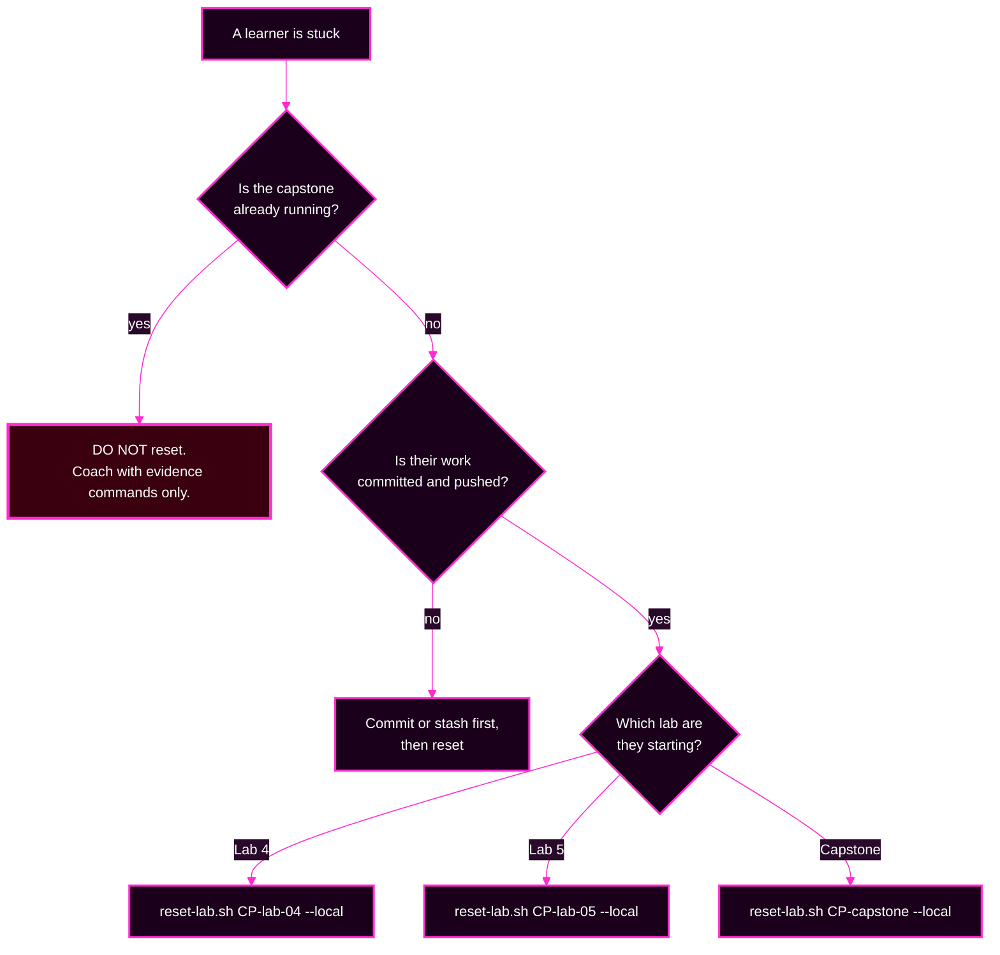

# Day 2 — Instructor Checklist for Resetting and Validating Every Lab

> **Instructor-facing.** Learners do not need this page. It covers pre-flight, per-lab reset and validation, and the signals that a room is stuck.
> **← Learner entry point:** [Day 2 map](README.md)

---

## Before the day starts

Run once per learner machine, or once on the shared image.

```bash
source ~/argo-lab-env.sh

# 1. tools present
for t in docker k3d kubectl argocd helm git; do
  printf '%-10s %s\n' "$t" "$(command -v "$t" || echo MISSING)"
done

# 2. both clusters answer
kubectl config get-contexts -o name        # expect k3d-mgmt and k3d-workload
kubectl --context k3d-mgmt get nodes
kubectl --context k3d-workload get nodes

# 3. Argo CD is up and reachable
kubectl --context k3d-mgmt -n argocd get pods
argocd login localhost:8443 --username admin \
  --password "$(cat ~/course/credentials/argocd-admin.txt)" --insecure
argocd account get-user-info               # expect Logged In: true, Username: admin

# 4. Gitea answers
git ls-remote http://lab-gitea:3000/course/storefront-gitops.git main

# 5. the learner clones exist
ls -d ~/platform-config ~/storefront-gitops
```

**All five must pass before anyone opens Session 5.** Items 1 and 3 are the two that fail most often — a terminal without `source ~/argo-lab-env.sh` looks identical to a broken install.

---

## The checkpoint ladder

Each lab starts from a named checkpoint. **`--verify-only` changes nothing. Without it, the script rebuilds the checkpoint and discards uncommitted work.**

| Before | Checkpoint | Verify | Restore |
|---|---|---|---|
| Session 5, Lab 4 | `CP-lab-04` | `reset-lab.sh CP-lab-04 --verify-only --local` | `reset-lab.sh CP-lab-04 --local` |
| Session 6, Lab 5 | `CP-lab-05` | `reset-lab.sh CP-lab-05 --verify-only --local` | `reset-lab.sh CP-lab-05 --local` |
| Session 7, capstone | `CP-capstone` | `reset-lab.sh CP-capstone --verify-only --local` | `reset-lab.sh CP-capstone --local` |

> **Drop `--local` on the standard learner VM image.** It is required only on a build-machine sandbox. Check which your delivery uses before the day starts, and tell the room one way or the other.

> **During the capstone, `reset-lab.sh` is off limits in every form**, including `--verify-only`. It compares against a stored answer key.

---

## Lab 4 — reset and validate

### Reset to the starting line

```bash
source ~/argo-lab-env.sh
reset-lab.sh CP-lab-04 --local
```

**Expect 14 PASS rows**, ending `PASS CP-lab-04 is in the expected state.`

Four of those rows assert an **absence** (`hello-reconcile`, `storefront-dev`, `team-a-guestbook`, `AppProject team-a`). A PASS there means correctly missing. Say this to the room — someone always reads it as a failure.

### Validate a finished Lab 4

```bash
# 1. three generated Applications, prod and only prod pinned
argocd app list -o wide | grep 'argocd/storefront-'

# 2. the App-of-Apps root owns three children
argocd app get platform-root

# 3. the protection policy is live
kubectl --context k3d-mgmt -n argocd get applicationset storefront \
  -o jsonpath='{.spec.syncPolicy}' ; echo

# 4. everything green
kubectl --context k3d-mgmt -n argocd get applications \
  -o custom-columns='NAME:.metadata.name,SYNC:.status.sync.status,HEALTH:.status.health.status'
```

**Passing state:** seven Applications, all `Synced`/`Healthy`; check 3 prints `{"applicationsSync":"create-update","preserveResourcesOnDeletion":true}`.

### Timing the room should expect

| Step | Measured |
|---|---|
| E1 apply to all three `Synced`/`Healthy` | ~15 seconds |
| E3 preview reflects a Git push | 20 to 60 seconds (repo-server cache) |
| E3 ApplicationSet condition appears | up to ~2 minutes (controller pass) |
| E5 child spec updates after a push | up to ~2 minutes (60-second Git poll) |
| E5 child recovers after the revert | ~100 seconds |

**Learners will think a change did not work because they checked too early.** Put these numbers on a slide.

### Where Lab 4 rooms get stuck

| Symptom | Cause | What to say |
|---|---|---|
| Preview prints only a header row | the `cluster-role: "TODO"` placeholder is still there | "Zero is a valid result. Count the rows." |
| Preview rows contain `TODO` | other TODOs unfilled | point at the column that is wrong; it names the field |
| A huge JSON blob on a failed generate | normal — it exits **20** and the message is buried | `... 2>&1 \| sed 's/\\n.*//'` |
| "My fix didn't work" in E5 | they checked before reconciliation ran | show them the timing table |
| A `kubectl edit` fix reverted | they edited the wrong layer | that reversion is the diagnostic signal |

---

## Lab 5 — reset and validate

### Reset to the starting line

```bash
source ~/argo-lab-env.sh
reset-lab.sh CP-lab-05 --local
```

**Expect all PASS**, including two absence rows: `AppProject team-a absent` and `Application team-a-guestbook absent`.

### Validate a finished Lab 5

```bash
# 1. the tenant app is healthy and the throwaways are gone
argocd app list -o name | grep team-a     # expect ONLY argocd/team-a-guestbook

# 2. least privilege holds
argocd admin settings rbac can team-a-dev sync   applications 'team-a/team-a-guestbook' --namespace argocd   # Yes
argocd admin settings rbac can team-a-dev delete applications 'team-a/team-a-guestbook' --namespace argocd   # No

# 3. the fence is committed
git -C ~/platform-config log --oneline -1
git -C ~/platform-config status --short   # expect clean

# 4. the project is correctly narrow
argocd proj get team-a
```

**Passing state:** one `team-a` Application, `Synced`/`Healthy`; `Yes` then `No`; a commit containing `projects/team-a.yaml` and the `values.yaml` edit.

### Two safety interlocks to enforce out loud

**1. `argocd app delete` does not prompt at v3.5.2.** Verified. Before E5, make the room run the `delete` check and confirm it prints `No`. If a learner's grant is over-broad, E5 will really delete their working Application.

**2. `argocd app sync` on a refused Application never returns** without `--timeout`. The operation ends instantly, but the CLI waits forever for a desired state that will never arrive. Tell them Ctrl+C is safe, and to re-run with `--timeout 30`.

### Where Lab 5 rooms get stuck

| Symptom | Cause | What to say |
|---|---|---|
| `rbac can` says `'sync' is not a valid resource name` | argument order | "The command is `can subject action resource object`. Resource and action swap places versus the file." |
| `rbac can` answers `No` when they expected `Yes` | missing `g,` binding, or object is `team-a` not `team-a/*` | check the binding first |
| `please provide exactly one of --policy-file or --namespace` | no source flag | one or the other, never both |
| The policy did not change after applying | they did not pass the file path | `apply-argocd-config.sh ~/platform-config/argocd/values.yaml` |
| `invalid session: account password has changed` | the apply re-stamped passwords | log in again; it is a red herring |
| E4 Part B does **not** fail | the team-a Role was widened | re-run `auth can-i … --as`; it must print `no` |

---

## Between Lab 5 and the capstone

```bash
reset-lab.sh CP-capstone --verify-only --local
```

**Expect 23 PASS rows**, including `AppProject team-a present` and `Argo CD RBAC role:team-a -> team-a-dev present`.

**A correctly completed Lab 5 satisfies `CP-capstone` without a reset** — verified. If a learner's Lab 5 went wrong, `reset-lab.sh CP-capstone --local` puts them on the starting line with a correct team-a fence.

**Before injecting faults, confirm the whole room is at `CP-capstone`.** A learner who starts the capstone from a broken Lab 5 will chase their own leftover mistake as if it were an injected fault.

---

## Capstone — inject, coach, reset

🔴 **The full solution lives in the private instructor repository**, [github.com/varoonsahgal/instructor-argo-new](https://github.com/varoonsahgal/instructor-argo-new) — not here:

- `courseware/instructor/day-2/capstone-restore-platform-SOLUTION.md` — the **live-verified** walkthrough: real output from a full incident run, the facilitation script, and a **required pre-flight workaround for F5**, which does not inject on its own.
- `courseware/day-2/capstone/INSTRUCTOR-SOLUTION.md` — the coaching guide keyed to the participant's eight modules: per fault, the hint sequence, the wrong turns to interrupt, and when to reveal.

Do not open either in front of the room.

### Inject, once everyone is confirmed at `CP-capstone`

```bash
source ~/argo-lab-env.sh
inject-capstone-faults.sh inject all     # order F1 F2 F3 F6 F4 F5 F7; takes a few minutes
inject-capstone-faults.sh verify all     # every fault must report PRESENT before you start the clock
```

### During the capstone

```bash
capstone-check.sh --instructor           # names the failing signal per unresolved area
```

**Never run `--instructor` on a projector or a learner's machine.** It hands them the triage. The learner-facing `capstone-check.sh` deliberately names no cause.

### Reset afterwards

```bash
inject-capstone-faults.sh revert all     # reverse order; safe and idempotent
capstone-check.sh                        # expect all six areas resolved, exit 0
```

If a learner's environment is unrecoverable (force-push, hand-removed finalizer):

```bash
reset-lab.sh CP-capstone --local         # rebuilds the checkpoint and DISCARDS the incident
inject-capstone-faults.sh inject all     # re-inject only if they are continuing
```

### The two things to say out loud before the clock starts

1. **`reset-lab.sh` is off limits in every form, including `--verify-only`.** It compares against a stored answer key.
2. **Two faults sit on `storefront-prod-workload`.** Do not say which — but expect "I fixed it and it is still red", and be ready with *"did the sync succeed? then what is the remaining symptom?"*

---

## Reset decision tree



---

## Platform notes for the room

**The course is designed to run inside the Ubuntu VM.** Every command goes in a VM terminal; every browser tab goes in Firefox inside the VM desktop. `localhost` means the VM, not the learner's laptop.

**If anyone is running natively on macOS**, everything in Day 2 works, and the guides avoid the constructs that differ. Two things to mention if it comes up:

- **macOS ships Bash 3.2.** No Day 2 step needs Bash 4 syntax.
- **`sed -i` differs** between BSD and GNU. No Day 2 step edits in place; the guides use `grep` to a new file instead.

**Say the context rule out loud on day two, once:** every `kubectl` command names `--context` explicitly, on purpose, so that a context mistake is visible rather than hidden. `k3d-mgmt` holds Argo CD's objects; `k3d-workload` holds the workloads. **A surprising result is a wrong-context result until proven otherwise.**

---

## Quick reference — what each lab leaves behind

| After | Applications | ApplicationSets | AppProjects | RBAC |
|---|---|---|---|---|
| `CP-lab-04` | none | none | `storefront`, `platform` | empty |
| Lab 4 complete (`CP-lab-05`) | 7 | `storefront` | `storefront`, `platform` | empty |
| Lab 5 complete (`CP-capstone`) | 8 | `storefront` | + `team-a` | `role:team-a` → `team-a-dev` |
