# Day 2 — Scale and Operate an Argo CD Platform

> **This is the canonical entry point for Day 2.** Every other Day 2 page links back here. Work the sessions and labs in the order below.
> **Argo CD version this course targets: `v3.5.2`** (Helm chart `10.8.4`; repo-server renders with **Helm v4.2.1**). Lab clusters run **k3s v1.35.8**.
> **Before you start:** all of Day 1, finishing at checkpoint `CP-lab-04`.

---

## TL;DR for the whole day

- **What this is.** Day 1 taught you one Application. Day 2 teaches you *many* Applications, the fences that keep them apart, and the method for diagnosing them when they break.
- **Why it matters.** Every new capability today also creates a new way to fail. Scale creates blast radius. Tenancy creates denials. Both create incidents.
- **What to remember.** Four sentences carry the whole day: *ApplicationSet is a factory. App-of-Apps is a family tree. Source problems come before render problems. Evidence comes before change.*
- **The most common mistake.** Reading a badge and acting on it. A badge tells you *that* something is wrong, never *why*.

---

## The day in one picture

```mermaid
%%{init: {'theme':'base','themeVariables':{'background':'#000000','primaryColor':'#1a001a','primaryTextColor':'#ffffff','primaryBorderColor':'#ff2bd1','lineColor':'#ff2bd1','secondaryColor':'#2a0a2a','fontSize':'14px'}}}%%
flowchart LR
    S5["Session 5<br/>Make many Applications"] --> L4["Lab 4<br/>Build and break both patterns"]
    L4 --> S6["Session 6<br/>Fence the Applications in"]
    S6 --> L5["Lab 5<br/>Try to walk through the fence"]
    L5 --> S7["Session 7<br/>Diagnose under pressure"]
    S7 --> CAP["Capstone<br/>Seven faults, 90 minutes"]
    classDef n fill:#1a001a,stroke:#ff2bd1,stroke-width:2px,color:#ffffff;
    classDef cap fill:#2a0a2a,stroke:#ff2bd1,stroke-width:3px,color:#ffffff;
    class S5,L4,S6,L5,S7 n;
    class CAP cap;
```



Each session builds a model. Each lab makes that model fail on purpose, where it is cheap. The capstone is the exam.

---

## Before your first command: where do you actually type?

This matters more than it sounds. Almost every confusing result in this course is a command run in the wrong place.

**The course is designed to run inside your Ubuntu VM.** The two Kubernetes clusters, the Gitea Git server, and Argo CD all run in Docker *inside that VM*. Open **MATE Terminal inside the Linux remote desktop** and run every command there. Open `https://localhost:8443` in **Firefox inside that same desktop**.

`localhost` means the VM, not your laptop. A browser on your Mac cannot reach `https://localhost:8443` unless you forward the port yourself, because the service is listening inside the VM.

| You are told to... | Run it here |
|---|---|
| `source ~/argo-lab-env.sh` | the VM terminal, once per new terminal |
| any `kubectl`, `argocd`, `git`, or `reset-lab.sh` command | the VM terminal |
| open the Argo CD UI | Firefox **inside** the VM desktop |
| open Gitea at `http://localhost:3000` | Firefox **inside** the VM desktop |

> **Instructors and self-hosted learners on macOS:** the course tooling also runs natively on a Mac with Docker Desktop, k3d, and the course `bootstrap` script. Everything in Day 2 was re-tested that way. Where a command behaves differently on macOS, this course labels it. See [Command portability: macOS and Ubuntu](#command-portability-macos-and-ubuntu) below.

---

## Two clusters, and why a wrong answer is usually a wrong cluster

You have two Kubernetes clusters and they hold different things. Naming the wrong one is the single most common way to get a confusing "No resources found."

| Context name | What runs there | What you look for there |
|---|---|---|
| `k3d-mgmt` | Argo CD itself | `Application`, `AppProject`, `ApplicationSet`, Argo CD pods and logs |
| `k3d-workload` | the deployed workloads | Deployments, Pods, Services, events, `Role`/`RoleBinding` |

**Always name the context explicitly**, exactly as the guides do:

```bash
kubectl --context k3d-mgmt -n argocd get applications
kubectl --context k3d-workload -n storefront-dev get pods
```

**Check which context is current before you trust a surprising result:**

```bash
kubectl config current-context
```

> **About `kmgmt` and `kwork`.** The course's own setup and reset scripts define two shell functions internally: `kmgmt` is exactly `kubectl --context k3d-mgmt`, and `kwork` is exactly `kubectl --context k3d-workload`. You may see them in script output or in instructor notes. **No learner-facing step in this course requires them**, and this course never assumes they are defined in your shell. Every command you are asked to run spells out `--context` in full, on purpose, so that a context mistake is visible rather than hidden inside an alias.

**A surprising result is a wrong-context result until you have proved otherwise.**

---

## Schedule, and what is required versus optional

Times are the *required* path. Optional reference modules sit outside the timebox and are marked as such.

| # | Guide | Required time | Optional reference |
|---|---|---|---|
| 1 | [Session 5 — ApplicationSets and App-of-Apps](session-05/README.md) | 60 min | [Generator catalogue and Progressive Syncs](session-05/90-reference-generators-and-progressive-syncs.md) |
| 2 | [Lab 4 — Build and troubleshoot the patterns](lab-04/README.md) | 75 min | stretch challenges in Module 4 |
| 3 | [Session 6 — Security, multi-tenancy, and governance](session-06/README.md) | 45 min | [SSO, secrets, and governance controls](session-06/90-reference-sso-secrets-and-governance.md) |
| 4 | [Lab 5 — Enforce platform guardrails](lab-05/README.md) | 45 min | stretch challenges in Module 4 |
| 5 | [Session 7 — Reliability and troubleshooting](session-07/README.md) | 75 min | [Platform operations after the capstone](session-07/90-reference-platform-operations.md) |
| 6 | [Capstone — Restore the platform](capstone/README.md) | 90 min | — |

**Required Day 2 total: 6 hours of guided time.** The optional reference modules add roughly 45 minutes if you read them all, and are designed to be read *after* the capstone or on your own time.

---

## The learner-facing navigation path

Work straight down this list. Do not skip a lab: each lab is where the next session's vocabulary gets its meaning.

1. [Session 5 · Module 1 — ApplicationSets: one template, many Applications](session-05/01-applicationsets-the-factory.md)
2. [Session 5 · Module 2 — Keeping the factory safe](session-05/02-safety-and-controls.md)
3. [Session 5 · Module 3 — App-of-Apps, and choosing between the patterns](session-05/03-app-of-apps-and-choosing.md)
4. [Lab 4 · Module 1 — Starting state and the preview habit](lab-04/01-environment-and-preview.md)
5. [Lab 4 · Module 2 — Build the factory, and break it once](lab-04/02-build-and-protect-the-factory.md)
6. [Lab 4 · Module 3 — Build the family tree, and break it once](lab-04/03-app-of-apps-and-trace-faults.md)
7. [Lab 4 · Module 4 — Compare the patterns, then the bridge incident](lab-04/04-showdown-and-wrap-up.md)
8. [Session 6 · Module 1 — The four authorization gates](session-06/01-the-four-gates.md)
9. [Session 6 · Module 2 — AppProjects and Argo CD RBAC, up close](session-06/02-appprojects-and-rbac.md)
10. [Session 6 · Module 3 — Reading a denial in the wild](session-06/03-reading-denials.md)
11. [Lab 5 · Module 1 — Starting state and the two mechanisms](lab-05/01-environment-and-mechanisms.md)
12. [Lab 5 · Module 2 — Build the fence, prove the happy path](lab-05/02-build-fence-and-happy-path.md)
13. [Lab 5 · Module 3 — Two denials, two systems](lab-05/03-bypass-attempts.md)
14. [Lab 5 · Module 4 — Deletion, finalizers, and wrap-up](lab-05/04-deletion-protection-and-wrap-up.md)
15. [Session 7 · Module 1 — The investigation stations](session-07/01-investigation-stations.md)
16. [Session 7 · Module 2 — One incident, walked end to end](session-07/02-worked-incident.md)
17. [Session 7 · Module 3 — Component-level diagnosis](session-07/03-component-diagnosis.md)
18. [Capstone](capstone/README.md)

---

## What Day 2 is preparing you for

The capstone hands you a platform with **seven faults at once**, some of which hide others. Every required part of Day 2 exists to prepare you for a specific kind of fault.

| Capstone failure type | Prepared by | The specific skill |
|---|---|---|
| Source or render failure | Session 5 · M2, Lab 4 · M2, Session 7 · M1–M2 | Read a `ComparisonError`; know that an empty render looks like a deletion order |
| ApplicationSet selector blast radius | Session 5 · M1–M2, Lab 4 · M2 | Preview, count, and name generated Applications before applying |
| Duplicate root/child ownership | Session 5 · M3, Lab 4 · M3–M4 | Find *who wrote* an Application; spot two owners of one resource |
| Kubernetes RBAC failure | Session 6 · M1–M3, Lab 5 · M3 | Tell an Argo CD refusal from a cluster refusal in one step |
| Stale management credentials | Session 6 · M1 (Gate 3), Session 7 · M3 | Recognise a scope-or-credential symptom that names no project |
| Workload readiness and noisy drift | Session 7 · M1, M3 | Separate sync status from health; read Pods and events on the right cluster |
| repo-server or controller failure masking others | Session 7 · M1, M3 | Ask which evidence a broken component makes untrustworthy |

A fuller version of this table, with the exact module sections, is in [Session 7 · Module 1](session-07/01-investigation-stations.md#7-the-capstone-prerequisite-map).

> 🛟 **The capstone does not assume you remember Day 1.** Several of those faults sit on top of Day 1 Lab 2 and Session 3 — cluster Secrets, the `argocd-manager` ServiceAccount, RoleBindings, 401 versus 403. The capstone's [Quick Rescue Guide](capstone/02-quick-rescue-guide.md) re-teaches every one of them, with diagrams, examples, hints and full answers. You do not need to re-read Day 1 before the capstone.

---

## Command portability: macOS and Ubuntu

Every command in Day 2 was written to behave identically on **Ubuntu (GNU tools)** and **macOS (BSD tools, Bash 3.2)**. Where a difference is unavoidable, the page gives both forms and says why.

These are the differences that actually bite in this course:

| Thing | Ubuntu (GNU) | macOS (BSD) | What Day 2 does about it |
|---|---|---|---|
| Default shell | Bash 5.x | Bash **3.2** (no `${var^^}`, no associative arrays), zsh by default | No Day 2 step needs Bash 4 syntax |
| `sed -i` | `sed -i 's/a/b/' f` | needs a suffix: `sed -i '' 's/a/b/' f` | Day 2 never asks you to edit in place. Edit in a text editor, or write to a new file |
| `date` | `date -d '1 hour ago'` | `date -v-1H` | No Day 2 step does date arithmetic |
| `grep -P` | available | **not available** | Day 2 uses only `grep -E` |
| `mktemp` | `mktemp -d` works bare | `mktemp -d` works bare | Both fine; Day 2 uses the bare form |
| `base64 -w0` | available | **not available** (`-w` is unknown) | Day 2 never decodes secrets by hand |
| `timeout` | available | **not installed** | No Day 2 step uses `timeout` |
| Docker | Docker Engine, socket owned by `docker` group | Docker Desktop, VM-backed | Both work; `k3d` behaves the same |
| Context names | `k3d-mgmt`, `k3d-workload` | identical | Same commands either way |

**Check your tools before Day 2 starts.** This block is portable and prints one line per tool:

```bash
for t in docker k3d kubectl argocd helm git; do
  printf '%-10s %s\n' "$t" "$(command -v "$t" || echo MISSING)"
done
kubectl config get-contexts -o name
```

You should see a path for all six tools, and both `k3d-mgmt` and `k3d-workload` in the context list. If `argocd` or `helm` is missing, you have not run `source ~/argo-lab-env.sh` in this terminal.

---

## Resetting and recovering

Every lab states its starting checkpoint. If a lab goes wrong, you do not have to unpick it by hand.

```bash
source ~/argo-lab-env.sh
reset-lab.sh CP-lab-04 --verify-only --local   # check, change nothing
reset-lab.sh CP-lab-04 --local                 # actually restore that checkpoint
```

`--verify-only` prints a PASS/FAIL table and touches nothing. Without it, the script rebuilds the checkpoint and **discards work you have not committed and pushed**.

| Checkpoint | Use it before |
|---|---|
| `CP-lab-04` | Session 5 and Lab 4 |
| `CP-lab-05` | Session 6 and Lab 5 |
| `CP-capstone` | Session 7 and the capstone |

> **During the capstone, `reset-lab.sh` is off limits in every form.** It compares against a stored answer key, and a real incident does not have one.

---

## For instructors

[Day 2 instructor checklist](INSTRUCTOR-CHECKLIST.md) — pre-flight checks, per-lab reset and validation commands, measured timings to expect, the two safety interlocks to enforce out loud, and where rooms typically get stuck. Learners do not need it.

---

## Final TL;DR

- **Start here, every time.** This page is the canonical Day 2 map; the session and lab READMEs below it are the authoritative pages for their own content.
- **Run everything in the VM terminal**, and name the Kubernetes context in every `kubectl` command.
- **Required Day 2 is six hours**; anything labelled *optional reference* is for after the capstone.
- **The most common mistake** is trusting a badge or a cached status. Ask what evidence it was computed from.

**→ Start:** [Session 5 — ApplicationSets and App-of-Apps](session-05/README.md)
