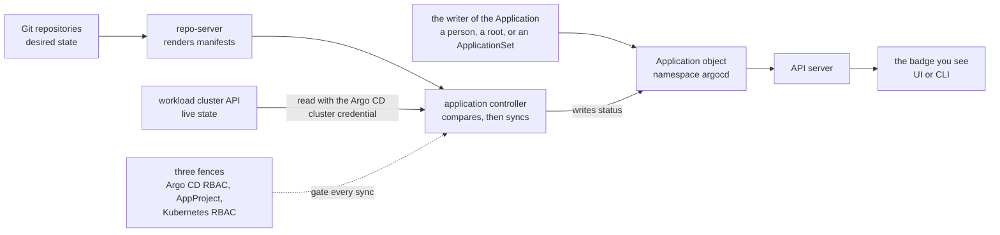

# Capstone — Restore an Argo CD Deployment Platform

> **Day 2 · Capstone · Diagnostic lab guide · 90 minutes**
> **Argo CD version this course targets: `v3.5.2`** (Helm chart `10.8.4`, Kubernetes `v1.35`; the repo-server renders charts with **Helm v4.2.1**).
> **Scaffolding level: G3 (diagnostic).** This guide explains the **method** in full: how to gather evidence, how to decide which layer a symptom belongs to, how to change something safely, and how to prove a repair worked. It deliberately gives **no fault-specific answers**. It will not tell you what is broken, where to start, or how to fix any particular thing. Finding that out is the exercise.
> **What you need open before you start:**
> - a MATE Terminal window on your VM (virtual machine) desktop (run `source ~/argo-lab-env.sh` in each new one);
> - a second VM terminal window on the same VM (useful for port-forwards and for watching status while you work);
> - Firefox inside that same desktop with the Argo CD web interface (`https://localhost:8443`), logged in as `admin` — because Firefox runs on the VM, `localhost` already means the VM and there is no tunnel to start;
> - a text editor for your incident log (`nano` on the VM works, and so does the desktop's text editor).
>
> **This capstone runs on your pre-provisioned course VM.** If you have not completed **Lab 0 — Prepare Your VM for Lab 1**, do that first: it builds the two clusters, Argo CD, Gitea, and reaches the starting checkpoint.
>
> **The clock.** The capstone runs 90 minutes in five phases (Section 7 has the timetable). The clock starts when your instructor announces that the incident has begun. Read Sections 1-6 during the first phase. The evidence toolbox in Section 6.3 is a reference you will keep returning to, so skim its headings now rather than reading every command. If your instructor gives you a few minutes before the incident starts (for example, at the end of the break after Guide 07), use them to read Sections 1 to 4.

---

## 1. Why this matters

Monday, 08:55. On Friday afternoon, several people merged several changes to the platform's repositories and then left for the weekend. Nobody watched the dashboards on Saturday or Sunday.

This morning the messages start arriving. The storefront team, the new team-a tenant, and the platform on-call channel each report that "Argo CD looks wrong." Each describes a different symptom. None of them agree on what is broken.

You are the platform engineer on call. Your lead gives you four instructions, and they are the rules of this capstone:

1. **Find out what is true before you touch anything.**
2. **Every change goes through Git or the platform's declarative configuration.** No hand edits on a live cluster.
3. **Write everything down:** what you saw, what you changed, and what happened next.
4. **When it is fixed, tell us what would have caught it sooner.**

An incident with one fault is a puzzle. An incident with several *connected* faults is a different kind of problem: one fault can hide another, change its symptoms, or make your instruments lie. People who chase the loudest red badge end up diagnosing the same thing three times. People who follow a method finish.

The goal is pressure without panic. The four rules are not an artificial handicap. They are what professional incident response looks like, and they are what stops a two-fault incident from becoming a five-fault incident.

---

## 2. Learning objectives

By the end of this capstone you will be able to:

1. **Identify the failure layer for every symptom without making uncontrolled changes.** You will produce a triage grid in which each symptom is backed by evidence and assigned to one of six layers *before* anything is changed (outline requirement **CM1**).
2. **Use Argo CD and Kubernetes evidence to determine root cause.** You will trace each fault to the specific object, file, or component that caused it, using the six-step troubleshooting method from Guide 07 (**CM2**).
3. **Repair the desired state or the platform configuration** through controlled, declarative changes only (**CM3**).
4. **Verify reconciliation, synchronization, and application health** with the same evidence you used to diagnose, and then with the course's verification tool (**CM4**).
5. **Explain the guardrail or monitoring change that would prevent recurrence** of each fault, in writing (**CM5**).

The capstone draws on every course outcome. The primary one is **O7** (diagnose repository, rendering, synchronization, health, and cluster-connectivity failures). Diagnosis also exercises **O1** (reconciliation) and **O2** (where each component fails); repair exercises **O3**-**O6** (topology, Application structures, Helm configuration, guardrails); the written reflection exercises **O8** (monitoring and recovery). Completing it is the evidence for the **Day 2 outcome**, in the outline's words: *"Participants finish Day 2 able to reason through ApplicationSets and App-of-Apps, enforce platform boundaries, and restore stable service during realistic Argo CD incidents."*

---

## 3. Prerequisites and what earlier guides established

**You should have completed** every guide and lab in the course, in order. The capstone introduces no new Argo CD feature. You have used every tool it needs at least once:

| Earlier file | What it gave you | How the capstone uses it |
|---|---|---|
| Guides 01 and 02 | Git as desired state; the reconciliation loop (render, compare, synchronize, assess health); sync status and health status as two separate questions; one job per Argo CD component | Reading every badge correctly; knowing which component produced which evidence |
| Lab 1 | The same status read in three places (UI, `argocd` CLI, `kubectl`); the `argocd.argoproj.io/tracking-id` annotation | Cross-checking evidence; tracing which Application manages a live resource |
| Guide 03 and Lab 2 | Repository and cluster Secrets; least-privilege registration of the workload cluster; `kubectl auth can-i`; "Successful is a measurement, not a guarantee" | Checking connectivity and permissions with evidence |
| Guide 04 and Lab 3 | Helm rendering with `helm template`; sync policies; drift and self-heal; waves and hooks; `git revert` versus roll-forward; automated sync does not re-attempt a sync that failed for the same commit | Reading render and sync evidence; choosing how to repair through Git |
| Guide 05 and Lab 4 | ApplicationSets as factories; preview, count, then apply; `applicationsSync`; App-of-Apps roots and children; "if your fix reverts, you fixed the wrong layer" | Checking what generated or owns each Application |
| Guide 06 and Lab 5 | The three authorization fences and the question "did the sync start?"; finalizers and cascading deletion | Reading denials; deleting safely |
| Guide 07 | The six-step troubleshooting method; evidence before change; source before platform; how each component fails; metrics, alerts, and customization trade-offs | The spine of every phase |

**Acronyms used in this guide, expanded once here:**

- **UI (user interface)** is the Argo CD web page. **CLI (command-line interface)** is the `argocd` command. **API (application programming interface)** server is the Argo CD component both of them talk to.
- **RBAC (Role-Based Access Control)** is any permission system that attaches permissions to roles and assigns roles to subjects. Argo CD and Kubernetes each have their own, so this guide always says which one.
- **CRD (Custom Resource Definition)** is how Kubernetes learns a new kind of object. `Application`, `AppProject`, and `ApplicationSet` are Argo CD's CRDs.
- **ApplicationSet (AppSet)** is the "factory" object from Guide 05 that generates and owns Applications.
- **SA (ServiceAccount)** is a non-human identity inside Kubernetes. Argo CD acts on the workload cluster as the ServiceAccount `argocd-manager` in namespace `argocd-access`.
- **SHA** is the identifier of a Git commit (a hash such as `3f2c1ab`).
- **CI (continuous integration)** is the pipeline that tests changes before they merge. It appears in the reflection phase.

**New terms this guide introduces** (each is used later only after this definition):

- **incident:** an unplanned interruption or degradation of a service that someone must restore.
- **triage:** sorting symptoms by what they are, where they come from, and how urgent they are, *before* treating any of them.
- **triage grid:** your table that maps each symptom to its evidence, method step, layer, and hypothesis (Phase P1).
- **root cause:** the specific condition that, once corrected, makes a symptom disappear and stay gone.
- **masking:** one fault hiding, or changing, the evidence for another fault (Section 4.3).
- **controlled change** and **uncontrolled change:** defined precisely in Section 6.1.
- **change log:** your table of every change you make, with the evidence before and after it (Phase P2).
- **sanity check:** a quick, observable test that one layer is healthy.
- **known-good inventory:** the exact set of objects a healthy platform should contain (Section 5.1).
- **blast radius** (recap from Guide 05): how much of the platform one change can affect.

> **Refresher: two clusters, always name the context (home: Lab 1).** Your VM runs two Kubernetes clusters. `k3d-mgmt` is the **management cluster**: Argo CD and every `Application`, `AppProject`, and `ApplicationSet` object live there, in namespace `argocd`. `k3d-workload` is the **workload cluster**: the storefront, team-a, and platform workloads run there in namespaces `storefront-dev`, `storefront-staging`, `storefront-prod`, `team-a`, and `platform-system`. Every `kubectl` command in this guide names its context with `--context`. A surprising result is a wrong-context result until proven otherwise.

> **Refresher: Git (home: Lab 1; revert versus reset from Guide 04).** A *commit* records a snapshot; *push* sends it to the Gitea server; `git log` lists who changed what and when. `git revert <sha>` undoes an earlier commit by adding a **new** commit, so history stays intact. Rewriting history (`git reset` on a shared branch, force-pushing) destroys the audit trail and is never used in this capstone.

---

## 4. Mental model recap

This section is short on purpose. Guide 07 taught the method; this recap puts the four pieces you need on one page.

### 4.1 The method: six steps and two rules

Here are the six steps, in Guide 07's exact wording. Every phase of the capstone refers to them by number.

1. **Validate the Git source and revision.**
2. **Validate repository access and manifest rendering.**
3. **Compare rendered state with live cluster state.**
4. **Inspect synchronization results, hooks, events, and Kubernetes health.**
5. **Inspect the responsible Argo CD component and its metrics.**
6. **Correct the declarative source and verify reconciliation.**

You walk the steps in the direction the data flows and stop at the first step that lies to you. Steps 1 to 5 are reading. Step 6 is the first place anything changes.

The two rules that go with the method:

- **Evidence before change.** Your first destructive action should be the fix, not a diagnostic guess.
- **Source before platform.** Trust the desired side (Git and rendering) before you suspect Argo CD's own components. You cannot trust a comparison until you trust both sides of it.

### 4.2 Six layers: where a fault can live

In the capstone, every symptom you record gets a **layer**: the part of the platform where you believe its cause lives. There are six. Their names match, word for word, the six areas that the course's verification tool `capstone-check.sh` reports on in Phase P3, so you can compare your own conclusions with its output at the end. Each layer also has a short code for table cells.

| Code | Layer (as `capstone-check.sh` names it) | What lives in this layer | Method steps that examine it | Where its evidence lives |
|---|---|---|---|---|
| `PLAT` | argo cd platform components | Argo CD's own pods: API server, repo-server, application controller, ApplicationSet controller, Redis, notifications controller | 5 | Pod status, events, logs, and resource use in namespace `argocd` |
| `CONN` | workload cluster connectivity | Argo CD's ability to reach, and authenticate to, the registered workload cluster | 3 (the live side of every comparison) | Settings → Clusters, `argocd cluster list`, application controller logs |
| `SRC` | application source rendering | Git content and history, repository access, and turning a chart plus values into manifests | 1, 2 | `git log`, `argocd repo list`, `argocd app manifests`, Application conditions |
| `GEN` | application generation and ownership | Which Applications exist, and who wrote each one: a person, an App-of-Apps root, or an ApplicationSet | 1 (for the Application objects themselves), 5 (the ApplicationSet controller) | The Applications inventory, ApplicationSet conditions and preview, root trees, tracking annotations |
| `POL` | deployment policy (permissions) | The three fences: Argo CD RBAC, AppProjects, and Kubernetes RBAC on the workload cluster | 4 | Sync operation results, `argocd proj get`, `kubectl auth can-i` |
| `RUN` | workload runtime health | The running workloads, and whether live state stays matched to Git (drift) | 3, 4 | Resource-tree health, workload Pods and events, `argocd app diff` |

This table is a sorting scheme. Its row order is not a repair order, and it says nothing about where today's faults are.

### 4.3 The chain behind every badge, and the masking question

Every status badge you see is the end of a chain. Guide 02 drew this chain as the component architecture. Here it is redrawn to answer one incident question: **what has to be working for this badge to be telling the truth?**



Read the diagram from right to left, starting at the badge:

1. The badge on your screen is read from the Application object by the API server.
2. The application controller wrote that status after comparing rendered manifests (from the repo-server, which read Git) with live state (read from the workload cluster using the cluster credential Argo CD holds).
3. Something wrote the Application object in the first place: a person, an App-of-Apps root, or an ApplicationSet. That writer can rewrite it at any time.
4. Every sync the controller attempts must pass the three fences.

**The masking question.** Some faults hide other faults. When a box in this chain is broken, every badge downstream of it becomes unreliable. It may show an alarming status, a stale status, or no useful status at all.

Think of a car whose dashboard fuse has blown. The fuel gauge, the temperature gauge, and the speedometer all read zero at once. That is three alarming readings with one cause. Until the fuse is replaced, you cannot tell whether you are *also* low on fuel.

So, once your triage grid holds several hypotheses, ask this of each one:

> **If this hypothesis is true, which of my other evidence becomes untrustworthy?**

A hypothesis whose truth would blind you to other layers is one to confirm and repair early. After each such repair, re-read the whole picture, because symptoms that were hidden may now appear. There is no fixed order that fits every incident. The answer comes from your own evidence, and this guide will not give it to you.

**Evidence order and repair order are different things.** The six steps tell you the order in which to *investigate* one symptom. The masking question tells you which *repair* to make first when you have several. You need both.

### 4.4 Four habits you already own

- **Sync and health are separate questions** (Guide 02). Sync status asks "does live state match Git?" Health asks "is it working?" A red badge is not the same as a hurting user. Rank symptoms by who is affected, not by how loud the badge is.
- **Did the sync start?** (Lab 5). A denial that happens before any sync operation runs came from Argo CD (its RBAC or an AppProject). A sync that starts and then fails with `forbidden` was refused by Kubernetes.
- **If your fix reverts, you fixed the wrong layer** (Lab 4). Something above the object you changed owns it. Trace up the ownership chain instead of repeating the fix.
- **Every status is a measurement with a timestamp** (Lab 2). `Successful`, `Synced`, and `Healthy` are readings taken a moment ago. Before you rely on one, check when it was taken.

---

## 5. Environment check and incident start

### 5.1 What your platform looked like before the incident

When Lab 5 ended, your platform was at checkpoint **`CP-capstone`**. Before starting the incident, your instructor confirmed that your VM was at that checkpoint with `reset-lab.sh CP-capstone --verify-only --local`, which printed a full PASS table. That is the same verifier step that opens every other lab. At that moment the platform contained:

- **Eight Applications, all `Synced` and `Healthy`:**
  - the three generated by the `storefront` ApplicationSet: `storefront-dev-workload`, `storefront-staging-workload`, and `storefront-prod-workload` (Lab 4);
  - the App-of-Apps root `platform-root` and its three children: `platform-quotas`, `platform-netpol`, and `platform-agent` (Lab 4);
  - `team-a-guestbook` (Lab 5).
- **One ApplicationSet:** `storefront`.
- **Three AppProjects you built or used:** `storefront`, `platform`, and `team-a`, plus the built-in `default`.
- **Two registered clusters:** `workload` and `in-cluster`.
- **One Argo CD RBAC grant:** `role:team-a`, bound to the local account `team-a-dev` (Lab 5).

This list is your **known-good inventory**. Figure SS-CAP-02, in Phase P3, shows exactly this healthy state. It is also your restoration target.

> **In every other lab, you run the verifier yourself at this point. Not today.** Once the incident has started, `reset-lab.sh --verify-only` compares your platform with a stored answer, and a real incident has no answer key. Section 6.1 lists it among the tools that are off limits.

### 5.2 How the incident starts

Your instructor starts the incident on your VM with the course's fault-injection tooling. You do not run that tooling, and you do not need to know how it works. Everything you need to find, you find from the platform itself.

The incident contains **seven faults**. They sit in more than one layer, and some of them are connected: one can hide or change the symptoms of another. That is all this guide will ever say about them.

Wait for your instructor's go-ahead. When it comes, the 90-minute clock starts.

### 5.3 Confirm your tools work

These checks prove that your **tools** work. They say nothing about whether the **platform** is healthy.

First load the course environment so the pinned `kubectl`, `helm`, `argocd`, and the course scripts are on your `PATH`. Do this in every new VM terminal you open during the capstone:

```bash
source ~/argo-lab-env.sh
```

1. **Log in to the `argocd` CLI** and confirm who you are:

   ```bash
   argocd login localhost:8443 --username admin --password "$(cat ~/course/credentials/argocd-admin.txt)" --insecure
   argocd account get-user-info
   ```

   **Expected output** *(representative; confirm against the live classroom environment):* a line reading `'admin:login' logged in successfully`, followed by a short summary that includes `Logged In: true` and `Username: admin`.

2. **Confirm both Kubernetes contexts are available:**

   ```bash
   kubectl config get-contexts -o name
   ```

   **Expected output:** two names, `k3d-mgmt` and `k3d-workload` (the order may differ).

3. **Turn on timestamps in your shell history.** Your shell already records every command you type. This makes it record *when* you typed it, which turns your history into a timeline you can use in your change log:

   ```bash
   export HISTTIMEFORMAT='%F %T  '
   ```

   From now on, `history | tail -20` shows your last twenty commands with their times.

### 5.4 Build your incident workspace

Your clones from earlier labs may be out of date, or may carry your own experiments. Make fresh clones of the four platform repositories in a dedicated folder.

The first line below turns on Git's **credential cache**: Git keeps your Gitea password in memory (never on disk) for two hours, so you type it only once. When Git asks, the username is `student` and the password is in `~/course/credentials/gitea-student.txt`.

```bash
git config --global credential.helper 'cache --timeout=7200'
mkdir -p ~/capstone && cd ~/capstone
for repo in storefront-gitops platform-config platform-components team-a-apps; do
  git clone -q "http://lab-gitea:3000/course/${repo}.git"
  git -C "${repo}" config user.name "Student"
  git -C "${repo}" config user.email "student@lab.local"
done
ls ~/capstone
```

**Expected output:** four directories: `platform-components`, `platform-config`, `storefront-gitops`, and `team-a-apps`.

Next, record the exact commit that each repository's `main` branch pointed at when the incident started. Checkpoint C1 compares against this file to prove that you changed nothing during triage.

```bash
cd ~/capstone
for repo in storefront-gitops platform-config platform-components team-a-apps; do
  printf '%-20s %s\n' "${repo}" "$(git -C "${repo}" rev-parse HEAD)"
done | tee ~/capstone/incident-start-shas.txt
```

**Expected output:** four lines, each a repository name followed by a 40-character commit SHA.

Finally, create your **incident log**: one Markdown file that will hold every table and answer you produce. The command writes empty headings and table headers; you fill them in as you go.

```bash
cat > ~/capstone/incident-log.md <<'EOF'
# Incident log: capstone

## Incident-start SHAs
(paste the contents of ~/capstone/incident-start-shas.txt here)

## P0: my first diagnostic action
- Command or screen:
- What I expect to learn (at least two possible results, and what each would mean):
- What I actually saw (fill in at the start of P1):

## P1: triage grid
| # | Symptom (as observed) | Where observed | Step (1-6) | Layer | Hypothesis | Planned controlled change |
|---|---|---|---|---|---|---|
| S1 | | | | | | |

## P1: layer coverage
| Layer | Evidence I checked | Verdict (looks healthy / looks broken / cannot tell yet, and why) |
|---|---|---|
| PLAT | | |
| CONN | | |
| SRC | | |
| GEN | | |
| POL | | |
| RUN | | |

## P2: change log
| # | Time | Change (commit SHA or exact command) | Path | Why (grid rows) | Evidence before | Predicted result | Evidence after |
|---|---|---|---|---|---|---|---|
| C1 | | | | | | | |

## P3: verification
(paste the capstone-check.sh output here)

## P4: reflection
EOF
ls -l ~/capstone/incident-log.md
```

Open it with `nano ~/capstone/incident-log.md` (save with `Ctrl+O`, then `Enter`; exit with `Ctrl+X`), or open it in the desktop's text editor.

### 5.5 The incident-start picture

In your browser, open the Argo CD UI at `https://localhost:8443`. You land on the **Applications** page. This is what the platform looked like at the moment the incident started.


*Figure SS-CAP-01 — Argo CD v3.5.2 Applications view at the moment the incident starts. This is the only picture of the broken platform in this guide. Everything else, you find yourself.*

**What to notice** (these are questions to ask of the picture, not answers):

1. **Two badges per tile.** Read each tile's sync badge and health badge separately. They answer different questions (Guide 02).
2. **Patterns across tiles.** Which tiles share a symptom, and what do those tiles have in common: a repository, a cluster, a project, a writer? A symptom shared by many Applications points at something they share (Guide 07).
3. **The inventory.** Compare the tiles with your known-good inventory in Section 5.1. Is every expected Application present? Is every present Application one you expect?
4. **What the picture cannot tell you.** A badge tells you *that* something is wrong, never *why*. Every tile is a question for the evidence toolbox in Section 6.3.

Your own screen may differ from the figure in detail. During an incident statuses keep moving, and this lab reconciles every 60 seconds. Trust your own screen over the figure.

<!-- CAPTURE-SPEC: SS-CAP-01 — Argo CD Applications list at incident start. State: checkpoint CP-capstone (reset-lab.sh CP-capstone) plus the instructor's `inject-capstone-faults.sh inject all`, captured after the faults settle, logged in as admin, route /applications. Highlight: none (participants must read the screen themselves; no highlight outline and no numbered callouts). Fidelity: full page. Argo CD v3.5.2. -->

---

## 6. Rules of engagement, evidence toolbox, and one worked row

This section replaces the guided walkthrough of earlier labs. It gives you the rules (6.1), the only ways you may change anything (6.2), every read-only tool you already know, organized by layer (6.3), and one fully worked triage row and change-log row on an incident that is **not** today's (6.4).

### 6.1 Rules of engagement

A change is **controlled** when all four of these are true:

1. **It is justified by evidence:** you can point at a row in your triage grid.
2. **It goes through one of the four change paths in Section 6.2.**
3. **You wrote down its predicted, observable result before you made it.**
4. **You recorded it in your change log,** with evidence before and after.

Anything else is an **uncontrolled change**. The following are uncontrolled, and they are off limits for the whole capstone:

| Off limits | Why, and where the course taught it |
|---|---|
| Editing, patching, scaling, or deleting live objects that Argo CD manages (`kubectl edit`, `kubectl patch`, `kubectl scale`, `kubectl delete`, or editing a live manifest in the UI) | Argo CD may revert you, and you destroy the evidence of what was there (Lab 3) |
| Restarting or deleting pods, or running `kubectl rollout restart`, to "see what happens" | A restart is an intervention, not a diagnosis. It erases logs and makes a healthy component look guilty (Guide 07) |
| Removing finalizers by hand | It skips the clean-up Argo CD is waiting to do, and can orphan or lose resources (Lab 5) |
| Force-pushing, running `git reset` on `main`, or rewriting history | Git is your audit trail. Undo with `git revert` (Guide 04) |
| Widening a guardrail (an AppProject, Argo CD RBAC, or Kubernetes RBAC) beyond the design you built in Labs 2 and 5, to make an error go away | That trades an outage for a security hole. Restoring a guardrail to its **designed** state is allowed; loosening it past that design is not (Guide 06) |
| Hiding evidence: turning off automated sync or self-heal to make a symptom stop, or adding an ignore rule that covers a whole resource, or a field with no named owner | Silence is not repair (Guide 07). In production, pausing automation can be a legitimate, logged mitigation; in this capstone it is not allowed |
| Running `reset-lab.sh` in any form, opening the course tooling's own scripts or state files, or using the course checkpoint tags (`cp-*`) in Git | These are the course's scaffolding and answer key, not part of the scenario. Without `--verify-only`, `reset-lab.sh` also erases the whole incident |
| Running `capstone-check.sh` before Phase P3 | It is the scoreboard, not an instrument. It reports *whether* an area is resolved, never *why* |

**What you may always do.** Every read-only command in Section 6.3 is allowed in every phase. **Refresh** and **hard refresh** are allowed too: they change neither Git nor the cluster (Guide 02). Note in your grid when you used a hard refresh, because it throws away Argo CD's cached rendering and can change what you see next.

**Deletions deserve their own rule.** Deleting an Application is a controlled change only if, before you run it, you write down what the deletion will remove: the Application object alone (`--cascade=false`), or the object **and** every resource it manages (the default, a cascading delete). A deletion can also arrive through Git: when a root Application prunes, removing a child's file from the root's path deletes that child. Treat such a commit as a delete, and make the same written cascade decision first (Lab 4, Lab 5).

**Credentials stay hidden.** Never print a token or password to the screen, commit one, or paste one into your incident log. When a credential must be used, inject it at apply time exactly as Lab 2 taught.

### 6.2 Controlled change paths

These are the only four ways to change anything during the capstone. Each is a path you have already used.

| Path | Use it for | How | Taught in | Record in your change log |
|---|---|---|---|---|
| **A. A Git commit to the repository that owns the field** | Anything Argo CD reconciles from Git: chart templates, Helm values, environment files, and Application manifests that a root Application syncs | Edit in your `~/capstone` clone, `git commit`, `git push`. Undo with `git revert <sha>` and a push | Labs 1, 3, 4 | The commit SHA |
| **B. Argo CD's own configuration** | Settings that live in Argo CD's Helm values file, `platform-config/argocd/values.yaml` | Edit, commit, and push the values file, then run the platform wrapper `apply-argocd-config.sh`, as in Lab 5 | Guide 03, Lab 5 | The commit SHA and the time the wrapper finished |
| **C. A declarative file applied with `kubectl`** | Objects the platform team applies, rather than objects Argo CD reconciles from Git: AppProjects, top-level Applications and ApplicationSets, repository and cluster Secrets rendered from templates, and workload-cluster RBAC | `kubectl --context <context> apply -f <file>`, where the file comes from a `~/capstone` clone (commit and push it first) or from `~/course/lab-files/`, with any credential injected at apply time and never committed | Labs 2, 4, 5 | The file path, and its commit SHA if it lives in Git |
| **D. A deliberate Argo CD operation** | A sync, or a delete of an Application with a written cascade decision | `argocd app sync <app>`; `argocd app delete <app> --cascade=<true or false>` | Labs 1, 3, 4, 5 | The exact command |

**Which path a repair needs depends on which object owns the field you are changing** (Lab 4). Find the owner first; the path follows from the owner. Some objects are reconciled from Git by Argo CD; others are applied by the platform team and change only when someone applies them. Section 6.3.4 shows how to tell which is which.

### 6.3 Evidence toolbox

Every command in this section is **read-only**: it reads Git, Argo CD, or Kubernetes and changes nothing. The toolbox starts with the whole picture (6.3.0), then gives one block per layer. Commands with angle brackets, such as `<app>`, need you to fill in a name.

The UI locations point back to figures from earlier labs, so you can see where each screen is. Those figures show earlier, unrelated states of the platform.

#### 6.3.0 The whole picture (start every pass here)

**Questions it answers:** Which Applications exist? What are both statuses of each? Which have conditions, and how did each Application's last operation end?

```bash
argocd app list
```

```bash
kubectl --context k3d-mgmt -n argocd get applications \
  -o custom-columns='NAME:.metadata.name,PROJECT:.spec.project,SYNC:.status.sync.status,HEALTH:.status.health.status,LAST-OP:.status.operationState.phase,CONDITIONS:.status.conditions[*].type'
```

```bash
argocd app get <app>
argocd app get <app> --show-operation
```

- The `kubectl` form reads the Application objects straight from the management cluster. It keeps working even when the `argocd` CLI or the UI is slow, which is the Lab 1 lesson about having three windows onto one story.
- `argocd app get <app>` is the densest single screen in Argo CD: the source, the target revision, both statuses, the conditions, and the resource list. `--show-operation` adds the details of the current or last sync operation.
- **UI:** the Applications page, with the filter panel on the left for sync status, health status, project, and cluster (Lab 1, [Figure SS-L1-02](../assets/screenshots/day-1/lab-01-02-applications-healthy.png)). Click a tile to open its tree ([Figure SS-L1-03](../assets/screenshots/day-1/lab-01-03-resource-tree.png)), its summary panel ([Figure SS-S2-02](../assets/screenshots/day-1/s02-02-app-details-summary.png)), and its conditions ([Figure SS-S7-01](../assets/screenshots/day-2/s07-01-repo-unreachable.png), from Guide 07's unrelated incident).

#### 6.3.1 `SRC` — Git source, history, and rendering (method steps 1 and 2)

**Questions it answers:** What changed recently, who changed it, and in which files? Does the revision an Application targets exist? Can Argo CD reach the repository and render it? Does the chart render outside Argo CD?

Recent history in every repository (run `git -C <repo> pull --ff-only` first if you have pushed anything since you cloned):

```bash
cd ~/capstone
for repo in storefront-gitops platform-config platform-components team-a-apps; do
  echo "=== ${repo} ==="
  git -C "${repo}" log -n 10 --date=relative --format='%h  %ad  %an  %s'
done
```

One commit in detail, first as a file list and then as the full change:

```bash
git -C ~/capstone/<repo> show --stat <sha>
git -C ~/capstone/<repo> show <sha>
```

Does a revision exist on the server (the Guide 07 step 1 check)?

```bash
git ls-remote http://lab-gitea:3000/course/<repo>.git <revision>
```

What does Argo CD itself see?

```bash
argocd repo list
argocd app manifests <app> --source git
argocd app manifests <app> --source live
```

A second opinion that does not depend on Argo CD: render the chart yourself with the VM's `helm`, which is the same Helm v4.2.1 that the repo-server uses (Guide 04). If a chart renders here but not in Argo CD, the difference lies in Argo CD's inputs or its ability to render. If it fails here too, the difference lies in the chart or its values.

```bash
cd ~/capstone/storefront-gitops
helm template storefront charts/storefront -f envs/<env>/values.yaml > /tmp/render-<env>.yaml && echo "render OK"
```

The command above renders your clone's `main` branch. An Application may target a different revision (its `Target` in `argocd app get`). To render that exact revision, check it out into a throwaway working tree, render from there, then remove it:

```bash
git -C ~/capstone/storefront-gitops worktree add /tmp/rev <revision>
helm template storefront /tmp/rev/charts/storefront -f /tmp/rev/envs/<env>/values.yaml > /tmp/render-rev.yaml && echo "render OK"
git -C ~/capstone/storefront-gitops worktree remove /tmp/rev
```

- **UI:** Settings → Repositories for connection status (Lab 2, [Figure SS-L2-02](../assets/screenshots/day-1/lab-02-02-repository-connected.png)); the Gitea commit history at `http://localhost:3000/course/<repo>/commits/branch/main` (Guide 01, [Figure SS-S1-02](../assets/screenshots/day-1/s01-02-gitea-commit-history.png)).

#### 6.3.2 `RUN` — comparison, sync results, and runtime health (method steps 3 and 4)

**Questions it answers:** Does live state differ from rendered state, and where? What happened during the last sync? Are the workloads actually running and serving?

```bash
argocd app diff <app>; echo "exit code: $?"
argocd app history <app>
```

Remember Guide 07's exit codes for `argocd app diff`: **0** means no difference, **1** means a real difference was found, and **2** means the comparison could not be completed.

The workload side, on the workload cluster:

```bash
kubectl --context k3d-workload -n <namespace> get all
kubectl --context k3d-workload -n <namespace> describe deploy <deployment-name>
kubectl --context k3d-workload -n <namespace> describe pod <pod-name>
kubectl --context k3d-workload -n <namespace> get events --sort-by=.lastTimestamp | tail -20
kubectl --context k3d-workload -n <namespace> logs deploy/<deployment-name> --tail=30
```

Pods in every workload namespace at once:

```bash
for ns in storefront-dev storefront-staging storefront-prod platform-system team-a; do
  echo "=== ${ns} ==="
  kubectl --context k3d-workload -n "${ns}" get pods
done
```

Does the application answer? Each storefront namespace has a Service named `storefront` on port 9898. For other namespaces, find the Service name with `get svc` first.

```bash
kubectl --context k3d-workload -n <namespace> port-forward svc/storefront 9898:9898 >/dev/null 2>&1 &
PF_PID=$!; sleep 2; curl -s localhost:9898; echo; kill "${PF_PID}"
```

> **Refresher: what `Healthy` means for a Deployment (home: Guide 04).** A Pod is **Ready** when its readiness probe (a periodic check Kubernetes makes against the container) passes. A Deployment's rollout completes when enough new Pods are Ready. If a rollout does not complete within the Deployment's progress deadline, Kubernetes marks it as failed, and Argo CD reports the Deployment, and therefore the Application, as `Degraded`. A `Progressing` status that never ends is a rollout that is still waiting.

> **Refresher: who owns a field (home: Guide 02, extended in Guide 07).** Every live field has one rightful writer: Git (through Argo CD), a Kubernetes controller, or a person. When a live value differs from Git, ask which writer the field belongs to before you decide whether it is drift.

- **UI:** a resource node's **Summary**, **Events**, and **Logs** tabs (Lab 1, [Figure SS-L1-09](../assets/screenshots/day-1/lab-01-09-pod-events.png)); the **Diff** view (Lab 1, [Figure SS-L1-06](../assets/screenshots/day-1/lab-01-06-app-diff.png)); **History and Rollback**, for reading only (Lab 1, [Figure SS-L1-10](../assets/screenshots/day-1/lab-01-10-history.png)). A rollback from that panel is a change, and it is blocked while automated sync is on (Guide 04).

#### 6.3.3 `CONN` — workload cluster connectivity

**Questions it answers:** Can Argo CD currently reach and authenticate to the workload cluster? Is the workload cluster itself up?

```bash
argocd cluster list
argocd cluster get workload
```

The cluster Secrets Argo CD holds. This prints names, types, and ages only, never the contents; do not print their data:

```bash
kubectl --context k3d-mgmt -n argocd get secrets -l argocd.argoproj.io/secret-type=cluster
```

Is the workload cluster's API up, as seen with **your** credentials?

```bash
kubectl --context k3d-workload get nodes
```

What does the application controller say about the workload cluster?

```bash
kubectl --context k3d-mgmt -n argocd logs statefulset/argocd-application-controller --tail=300 | grep -i "k3d-workload-server-0" | tail -20
```

> **Refresher: 401 versus 403, and two different credentials (home: Guide 03; applied in Lab 2).** A **401 Unauthorized** means "I do not accept your credential; I do not know who you are." A **403 Forbidden** means "I know who you are, and you may not do this." Your own `kubectl` reaches the workload cluster with your admin kubeconfig. Argo CD reaches it with the ServiceAccount token stored in its cluster Secret (Lab 2). Those are two different identities.

- **UI:** Settings → Clusters (Lab 2, [Figure SS-L2-03](../assets/screenshots/day-1/lab-02-03-cluster-registered.png)) and the cluster detail panel ([Figure SS-L2-04](../assets/screenshots/day-1/lab-02-04-cluster-detail.png)).

#### 6.3.4 `GEN` — generation and ownership

**Questions it answers:** Which Applications should exist, and which do? Who wrote each Application object? Does each live resource have exactly one owner?

The ApplicationSet, its conditions, and a preview of what its committed file generates. The preview renders the file against current Git and cluster data and creates nothing (Lab 4):

```bash
argocd appset list
kubectl --context k3d-mgmt -n argocd get applicationset storefront \
  -o jsonpath='{range .status.conditions[*]}{.type}={.status}: {.message}{"\n"}{end}'
argocd appset generate ~/capstone/platform-config/applicationsets/storefront.yaml -o wide
```

Who wrote each Application object:

```bash
kubectl --context k3d-mgmt -n argocd get applications \
  -o custom-columns='NAME:.metadata.name,GENERATED-BY:.metadata.ownerReferences[0].name,TRACKED-BY:.metadata.annotations.argocd\.argoproj\.io/tracking-id'
```

- `GENERATED-BY` shows the ApplicationSet that generated an Application (Kubernetes owner references).
- `TRACKED-BY` shows the `argocd.argoproj.io/tracking-id` annotation that Argo CD writes on every object it applies (Lab 1). Its first part names the Application that applied the object. For an Application object, that means the root that created it.
- An Application object with neither was applied directly by a person, through path C. Argo CD does not reconcile that object from Git.

A root's tree, and which Application manages a live resource on the workload cluster:

```bash
argocd app get platform-root -o tree
kubectl --context k3d-workload -n <namespace> get deploy \
  -o custom-columns='NAME:.metadata.name,TRACKED-BY:.metadata.annotations.argocd\.argoproj\.io/tracking-id'
```

Ownership is a measurement too. Read it twice, a few minutes apart. An owner that changes between readings is evidence in its own right.

- **UI:** the ApplicationSets view and ApplicationSet detail tree (Lab 4, [Figure SS-L4-05](../assets/screenshots/day-2/lab-04-05-appset-generated-tree.png); **the ApplicationSet UI is Alpha since v3.5.0**, so the CLI is the dependable path); a root Application's tree (Lab 4, [Figure SS-L4-08](../assets/screenshots/day-2/lab-04-08-root-child-tree.png)).

#### 6.3.5 `POL` — the three fences

**Questions it answers:** Did a sync start? If something refused, which fence refused it? Do the fences still match their designs?

```bash
argocd proj list
argocd proj get <project>
kubectl --context k3d-mgmt -n argocd get applications \
  -o custom-columns='NAME:.metadata.name,LAST-OP:.status.operationState.phase,MESSAGE:.status.operationState.message'
```

Fence 1, Argo CD RBAC. Mind the argument order from Lab 5: `can <subject> <action> <resource> <object>`:

```bash
argocd admin settings rbac can <subject> <action> <resource> <object>
```

Fence 3, Kubernetes RBAC on the workload cluster, asked as Argo CD's ServiceAccount (the Lab 2 least-privilege matrix):

```bash
for ns in storefront-dev storefront-staging storefront-prod platform-system team-a; do
  printf '%-20s ' "${ns}"
  kubectl --context k3d-workload auth can-i create deployments.apps -n "${ns}" \
    --as=system:serviceaccount:argocd-access:argocd-manager
done
kubectl --context k3d-workload auth can-i create clusterroles.rbac.authorization.k8s.io \
  --as=system:serviceaccount:argocd-access:argocd-manager
```

The live RBAC objects in a namespace, and the design file you applied in Lab 2, for comparison:

```bash
kubectl --context k3d-workload -n <namespace> get roles,rolebindings
less ~/course/lab-files/lab-02/workload-rbac.yaml
```

Read any denial message against Lab 5's three signatures:

| If the message contains | The fence that refused | Did a sync start? |
|---|---|---|
| `permission denied` | Fence 1: Argo CD RBAC | No |
| `is not permitted in project` | Fence 2: an AppProject | No |
| `forbidden` and `system:serviceaccount:...` | Fence 3: Kubernetes RBAC on the workload cluster | Yes, then it failed |

- **UI:** Settings → Projects and a project's detail page (Lab 5, [Figure SS-L5-02](../assets/screenshots/day-2/lab-05-02-project-team-a.png)); an Application's sync result panel (Lab 5, [Figure SS-L5-06](../assets/screenshots/day-2/lab-05-06-kubernetes-forbidden.png)).

#### 6.3.6 `PLAT` — Argo CD's own components (method step 5)

**Questions it answers:** Is each Argo CD component running and ready? Is any of them restarting, or complaining in its logs? The Argo CD UI does not show the health of Argo CD's own pods, so this layer is read with `kubectl`.

```bash
kubectl --context k3d-mgmt -n argocd get pods
kubectl --context k3d-mgmt -n argocd get deploy,statefulset
kubectl --context k3d-mgmt top pod -n argocd
kubectl --context k3d-mgmt -n argocd get events --sort-by=.lastTimestamp | tail -20
kubectl --context k3d-mgmt -n argocd describe pod <pod-name>
```

In `describe pod` output, read **State**, **Last State** (with its **Reason** and **Exit Code**), **Restart Count**, and the **Events** list at the bottom.

Each component's recent log:

```bash
kubectl --context k3d-mgmt -n argocd logs deploy/argocd-server --tail=50
kubectl --context k3d-mgmt -n argocd logs deploy/argocd-repo-server --tail=50
kubectl --context k3d-mgmt -n argocd logs statefulset/argocd-application-controller --tail=50
kubectl --context k3d-mgmt -n argocd logs deploy/argocd-applicationset-controller --tail=50
```

The log from a container's **previous** run. This is useful when a container has restarted and its current log is too new to show why:

```bash
kubectl --context k3d-mgmt -n argocd logs <pod-name> --previous --tail=50
```

A component's own metrics, read directly (Guide 07). The application controller serves them on port 8082 (`statefulset/argocd-application-controller`), the API server on 8083 (`deploy/argocd-server`), and the repo-server on 8084 (`deploy/argocd-repo-server`):

```bash
kubectl --context k3d-mgmt -n argocd port-forward <deploy-or-statefulset>/<component> <port>:<port> >/dev/null 2>&1 &
PF_PID=$!; sleep 2; curl -s localhost:<port>/metrics | grep -E '^argocd_' | head -30; kill "${PF_PID}"
```

### 6.4 A worked row: the method on an incident that is not today's

Before you build your own grid, here is one triage row and one change-log row, filled in for **Guide 07's worked incident**: the Git repository that became unreachable. Guide 07 chose that cause because it is **not** one of the capstone's faults, so this example spoils nothing. The change-log details are illustrative.

**One triage-grid row:**

| # | Symptom (as observed) | Where observed | Step (1-6) | Layer | Hypothesis | Planned controlled change |
|---|---|---|---|---|---|---|
| S1 | `storefront-dev-workload` and every other Application that sources from the same repository: sync `Unknown`, condition `ComparisonError`, message ends "no such host" | `argocd app get storefront-dev-workload`; the conditions panel in the UI | 2 | `SRC` | Argo CD cannot reach the Git host, so nothing renders. If true, the running workloads are fine (step 4 events quiet) and `argocd repo list` shows the repository failing | Restore the Git host's reachability through the owning team's configuration (path A in their repository). Verify with `argocd repo list`, then `argocd app get` |

How the row was built, cell by cell:

1. **Symptom** uses the tool's own words and lists **every** affected Application. The fact that the symptom is shared is itself evidence (Guide 07).
2. **Where observed** names the command or screen, so anyone can re-run it and see the same thing.
3. **Step** is the first station of the six-step method that lied.
4. **Layer** is where the *cause* lives, which is not always where the symptom showed up.
5. **Hypothesis** is testable. It states what else must be true if it is right ("workloads fine", "repository failing"), which is exactly how you check it.
6. **Planned controlled change** names the path from Section 6.2 and the evidence you will use to verify it.

**The matching change-log row:**

| # | Time | Change (commit SHA or exact command) | Path | Why (grid rows) | Evidence before | Predicted result | Evidence after |
|---|---|---|---|---|---|---|---|
| C1 | 09:31 | Network team's commit `a1b2c3d` restores the Git host's DNS record (reviewed and merged by that team) | A | S1 | `argocd repo list`: `Failed`, "no such host"; `argocd app diff` exit code 2 | Within one 60-second poll: repository `Successful`; `argocd app diff` exit code 0; Applications `Synced` and `Healthy` | 09:33: `argocd repo list` shows `Successful`; `argocd app get storefront-dev-workload` shows `Synced` and `Healthy` |

Notice that the "evidence after" column re-runs the **same** commands as the "evidence before" column. That is Guide 07's step 6: verify with the evidence you diagnosed with.

---

## 7. Exercises — the incident, phase by phase

The capstone is one continuous exercise in five phases. Each phase below has a goal, a starter state, what to produce, a success criterion, and hints. The hints are about the **method**, never about a specific fault.

| Phase | Minutes | Clock | What you produce |
|---|---|---|---|
| **P0** Incident brief and your first move | 10 | 0:00-0:10 | Workspace, incident-start SHAs, written first move |
| **P1** Triage, with no changes | 15 | 0:10-0:25 | Triage grid and layer coverage; Checkpoint C1 |
| **P2** Restore | 50 | 0:25-1:15 | Change log; each layer's sanity check passing |
| **P3** Verify | 5 | 1:15-1:20 | `capstone-check.sh` output; comparison with Figure SS-CAP-02 |
| **P4** Written reflection | 10 | 1:20-1:30 | One reflection block per fault |

---

### P0 — Incident brief and your first move (10 min · easy)

**Goal in plain language.** Get oriented. Read the rules, set up your workspace, and commit in writing to the first thing you will look at, and what you expect it to tell you.

**Starter state.** The incident has started. You are logged in to the UI. You have read Sections 1 to 4.

**Do this.**

1. Complete Sections 5.3, 5.4, and 5.5: tools, workspace, and a first look at the Applications page.
2. Skim Section 6: the rules (6.1), the four change paths (6.2), and the headings of the toolbox (6.3).
3. In `incident-log.md`, under "P0: my first diagnostic action", write:
   - **one** command or screen you will look at first; and
   - **what you expect to learn from it:** at least two different results it could show, and what each result would mean.
4. Do not run your first move yet. You run it as the first action of P1.

**Input and the shape of a good output.** The input is the Applications page on your own screen plus the toolbox. The output is a short entry of two or three lines. A strong first move **partitions** the problem: whatever it shows, it rules out a large part of the platform at once. For example, it separates "one Application" from "many", or "Argo CD" from "Kubernetes". A weak first move can only confirm a hunch.

**Success criterion.**

- `~/capstone` holds four clones and `incident-start-shas.txt`.
- `argocd account get-user-info` shows you logged in as `admin`.
- Your first-move entry names one command or screen and at least two possible results, each with what it would mean.

**Hints (use only if stuck; each is more specific than the last).**

- *Hint 1:* Look at the Applications page and ask whether the trouble is in one Application, in a group, or everywhere. What would each answer imply about shared dependencies (Guide 07)?
- *Hint 2:* Prefer a view that shows several kinds of information at once (source, revision, both statuses, conditions) over one that shows a single fact.

---

### P1 — Triage: build the grid, change nothing (15 min · medium)

**Goal in plain language.** Build a complete, evidence-backed picture of the incident. Record every symptom, where you saw it, which method step first showed it, which layer you believe it lives in, and a hypothesis. Change nothing.

**Starter state.** Workspace ready; first move written down.

**The rule for this phase.** Use only the read-only commands in Section 6.3, plus Refresh and hard refresh. No commits, no applies, no syncs, no deletes.

**Do this.**

1. **Run your first move.** Under "What I actually saw", write one line on what matched your prediction and what did not.
2. **Take the whole picture** (Section 6.3.0). Add a grid row for each Application that is not both `Synced` and `Healthy`, and for anything else in the toolbox that looks wrong: a cluster, a repository, an ApplicationSet, a component. One row may cover several Applications that share a symptom; list them all in the Symptom cell.
3. **Walk the six steps for each row** and stop at the first step that lies. Record that step and your layer.
4. **Fill in the layer coverage table.** For each of the six layers, write what evidence you checked and your verdict: *looks healthy*, *looks broken*, or *cannot tell yet* (and why).
5. **Apply the masking question** (Section 4.3) to every *cannot tell yet* and every hypothesis. Write down which rows depend on something you have not confirmed.
6. **Plan, do not act.** For each row, write the controlled change you would make: its path from Section 6.2, and the evidence you will use to verify it.

Your triage grid (the incident log already holds the header; add as many rows as you need):

| # | Symptom (as observed) | Where observed | Step (1-6) | Layer | Hypothesis | Planned controlled change |
|---|---|---|---|---|---|---|
| S1 | | | | | | |
| S2 | | | | | | |
| S3 | | | | | | |
| S4 | | | | | | |
| S5 | | | | | | |
| S6 | | | | | | |
| S7 | | | | | | |
| S8 | | | | | | |

Your layer coverage table:

| Layer | Evidence I checked | Verdict (looks healthy / looks broken / cannot tell yet, and why) |
|---|---|---|
| `PLAT` argo cd platform components | | |
| `CONN` workload cluster connectivity | | |
| `SRC` application source rendering | | |
| `GEN` application generation and ownership | | |
| `POL` deployment policy (permissions) | | |
| `RUN` workload runtime health | | |

**The shape of a correct result.** Every row cites a command someone else could re-run, or a named screen. All six layers have a verdict. Every hypothesis says something testable: what else would be true if it were right. Several rows may share a layer, and some layers may honestly read *cannot tell yet*. That is a sign of good triage, not of failure.

#### Checkpoint C1 — grid complete, no changes made

Before you start P2, confirm all five:

1. Every Application that is not both `Synced` and `Healthy` appears in at least one row.
2. Every row has evidence and a layer.
3. Every layer in the coverage table has a verdict.
4. You ran nothing outside Section 6.3, apart from Refresh or hard refresh.
5. Git is unchanged since the incident started. This command compares each repository's `main` on the server with the SHAs you recorded in P0:

   ```bash
   cd ~/capstone
   for repo in storefront-gitops platform-config platform-components team-a-apps; do
     printf '%-20s %s\n' "${repo}" "$(git -C "${repo}" ls-remote origin refs/heads/main | awk '{print $1}')"
   done | diff - incident-start-shas.txt && echo "C1 check: main is unchanged in every repository"
   ```

   **Expected output:** the single line `C1 check: main is unchanged in every repository`. Any other output means `main` moved in at least one repository.

If C1 fails because you already made a change, record it honestly in your change log (time, what, and why), then read the "You made an uncontrolled change" row in Section 8.

**Hints (method-level; each is more specific than the last).**

- *Hint 1:* Which layer has no evidence at all yet? Run the cheapest command for that layer in Section 6.3.
- *Hint 2:* Could any symptom be a shadow of another? Mark the rows whose evidence depends on a box in the Section 4.3 chain that you have not yet confirmed.
- *Hint 3:* For a symptom that fits two layers, ask what single piece of evidence would tell them apart, and go and get exactly that piece.

---

### P2 — Restore (50 min · hard)

**Goal in plain language.** Return every layer to its healthy signal, one controlled change at a time, and log each change with the evidence before and after it.

**Starter state.** Checkpoint C1 passed. Your triage grid and layer coverage are complete.

#### The repair loop

Repeat these eight steps for each hypothesis.

1. **Choose.** Apply the masking question across your whole grid. Pick the hypothesis whose truth would make the most other evidence untrustworthy. If none stands out, pick the one that hurts users most.
2. **Re-confirm.** Re-run that row's evidence. Evidence goes stale, and connected faults change each other's symptoms.
3. **Find the owner.** Identify the object, and the file, that owns the field you intend to change (Lab 4). The owner decides the change path.
4. **Predict.** Write the observable result you expect, and how soon. This lab reads Git every 60 seconds; Refresh makes Argo CD read it immediately.
5. **Change.** Make **one** controlled change, through **one** path from Section 6.2.
6. **Verify.** Re-run the evidence you used to diagnose, then the sanity check for that layer (below).
7. **Log.** Complete the change-log row, including when the result did not match your prediction. Once a repair is verified, start that fault's reflection block (Phase P4) with two lines: its layer and the evidence that proved it. Ten minutes is not enough to write seven blocks from nothing.
8. **Re-triage.** Re-read the whole picture (Section 6.3.0). Add rows for any symptom that newly appeared (mark it "revealed after C<n>"), and mark resolved rows as resolved.

When a result contradicts your prediction, stop and treat the surprise as new evidence. Do not stack a second change on top of a surprise.

**Pacing.** Fifty minutes for seven faults is roughly seven minutes each. If ten minutes pass on one hypothesis with no new evidence, climb the hint ladder below. If the third rung does not help, **park** the row (mark it "parked") and take another; connected faults often unstick each other. At 0:40, 0:55, and 1:10 on the clock, take 60 seconds to re-read the whole picture.

#### Your change log

The incident log already holds the header. Add a row for every change, in the style of the worked row in Section 6.4:

| # | Time | Change (commit SHA or exact command) | Path | Why (grid rows) | Evidence before | Predicted result | Evidence after |
|---|---|---|---|---|---|---|---|
| C1 | | | | | | | |
| C2 | | | | | | | |
| C3 | | | | | | | |
| C4 | | | | | | | |
| C5 | | | | | | | |
| C6 | | | | | | | |
| C7 | | | | | | | |
| C8 | | | | | | | |

#### Sanity checks: what healthy looks like, layer by layer

Each check below describes the **observable signal of a healthy layer** and gives a command to observe it. A check tells you whether a layer looks healthy **now**. It does not tell you whether that layer was ever broken, why, or how to fix it. The checks appear in the order `capstone-check.sh` prints its areas. That order is a reading convention, not a repair plan.

**`PLAT` — argo cd platform components.** Healthy looks like this:

- Every pod in namespace `argocd` on `k3d-mgmt` shows `STATUS` `Running` and a full `READY` count (for example `1/1`).
- Every Deployment and StatefulSet in `argocd` reports all of its replicas ready.
- The `RESTARTS` column is the same in two readings taken about two minutes apart.
- A Refresh of any Application completes promptly and updates its comparison.

```bash
kubectl --context k3d-mgmt -n argocd get pods
kubectl --context k3d-mgmt -n argocd get deploy,statefulset
```

**`CONN` — workload cluster connectivity.** Healthy looks like this:

- Settings → Clusters, and `argocd cluster list`, show the `workload` cluster with connection status `Successful` and no error message.
- `argocd cluster get workload` shows a connection state of `Successful` and a cache synchronization time within the last few minutes.
- Every Application that deploys to the workload cluster shows a real comparison result (`Synced` or `OutOfSync`, never `Unknown`), and its resource tree lists live objects.

```bash
argocd cluster list
argocd cluster get workload
```

**`SRC` — application source rendering.** Healthy looks like this:

- No Application carries a `ComparisonError` condition.
- `argocd app manifests <app> --source git` prints manifests for every Application.
- `argocd app diff` exits with `0` or `1` for every Application, never `2`.
- `argocd repo list` shows every listed repository as `Successful`.

```bash
for app in $(kubectl --context k3d-mgmt -n argocd get applications -o jsonpath='{.items[*].metadata.name}'); do
  argocd app diff "${app}" >/dev/null 2>&1
  echo "${app}  diff-exit=$?"
done
```

**`GEN` — application generation and ownership.** Healthy looks like this:

- The Applications list holds exactly the eight Applications of your known-good inventory (Section 5.1), and no others.
- `argocd appset generate` on the committed ApplicationSet file prints exactly the three generated names you expect, and the ApplicationSet's `ErrorOccurred` condition is `False`.
- Each Application object, and each live resource, has exactly one owner, and it is the same owner when you read it again a few minutes later.
- No Application reports a warning or error condition (the `CONDITIONS` column in Section 6.3.0 reads `<none>`).

```bash
argocd appset generate ~/capstone/platform-config/applicationsets/storefront.yaml -o wide
kubectl --context k3d-mgmt -n argocd get applications \
  -o custom-columns='NAME:.metadata.name,GENERATED-BY:.metadata.ownerReferences[0].name,TRACKED-BY:.metadata.annotations.argocd\.argoproj\.io/tracking-id'
```

**`POL` — deployment policy (permissions).** Healthy looks like this:

- Every Application's most recent operation ended in phase `Succeeded`.
- No operation message or condition contains any of Lab 5's three denial signatures: `permission denied`, `is not permitted in project`, or `forbidden`.
- The Lab 2 least-privilege matrix holds: as `system:serviceaccount:argocd-access:argocd-manager`, `kubectl auth can-i create deployments.apps` answers `yes` in each of the five workload namespaces, and `kubectl auth can-i create clusterroles.rbac.authorization.k8s.io` answers `no`.
- Every AppProject still matches its design: its sources, destinations, and allowed kinds (`argocd proj get <project>`).

```bash
kubectl --context k3d-mgmt -n argocd get applications \
  -o custom-columns='NAME:.metadata.name,LAST-OP:.status.operationState.phase,MESSAGE:.status.operationState.message'
```

Then run the `auth can-i` loop from Section 6.3.5.

**`RUN` — workload runtime health.** Healthy looks like this:

- All eight Applications show `Synced` and `Healthy`.
- They **stay** `Synced` and `Healthy` across at least two reconciliation cycles: about two minutes in this lab, because the reconciliation interval is set to 60 seconds. A status that flips back and forth is not restored.
- In every workload namespace, the Pods are `Running` and Ready, with restart counts that do not climb, and a request through a port-forward returns the application's normal response.
- Each Application's synced revision is a commit you can find in Git history and explain.

```bash
argocd app list
```

Then run the Pods loop and the port-forward check from Section 6.3.2.

#### The hint ladder

Use these for any stuck point, in order. Each rung is more specific than the last, and none of them is about a particular fault.

- **Rung 1: Which layer have you not ruled out?** Look at your layer coverage table. A layer marked *cannot tell yet*, or one you never checked, is a blind spot. Before you dig deeper into the layer you are stuck on, spend two minutes getting one piece of evidence from the blind spot.
- **Rung 2: What could be masking the symptoms you are chasing?** Trace the badge you are relying on back through the Section 4.3 chain. For every box it passes through, ask: "Have I confirmed this box is working?" If your evidence is stale, contradictory, or refuses to update, question the instrument that produced it (Guide 07, step 5). If a fix worked and then came back, look **up** the ownership chain (Lab 4).
- **Rung 3: Where does the evidence for that layer live?** Go to the matching block in Section 6.3 and read the evidence at its source: the commit that changed the field, the condition or operation message on the object, the ApplicationSet's own conditions, the cluster's connection status, or the component's pod status and logs. Then ask the owner question: "Which repository and file, or which applied object, owns the field I want to change?"

**The shape of a correct result.** Every change-log row names a path, states a prediction, and cites evidence before and after. Every grid row is marked resolved, parked, or unresolved. Each layer's sanity check shows its healthy signal, or your log says honestly which layers do not.

**Success criterion.** For each layer, the sanity-check signal is observable on your screen now. Every change in your log went through a path in Section 6.2. Nothing in Section 6.1's off-limits table applies to anything you did.

---

### P3 — Verify (5 min · easy)

**Goal in plain language.** Confirm, with evidence you did not produce yourself, which areas of the platform are restored.

**Starter state.** You have stopped making changes, either because every sanity check passes or because P2's time is up.

> **Predict first.** Before you run anything, write in your incident log which of the six areas you expect `capstone-check.sh` to report as resolved.

**Do this.**

1. Run the course's verification tool. It prints one line per area, in the six areas' names from Section 4.2:

   ```bash
   capstone-check.sh
   echo "exit code: $?"
   ```

   **Expected output when every area is restored** *(representative, taken from the tool's output format; confirm against the live classroom environment):*

   ```text
   ==> Capstone restoration status by area
     resolved   argo cd platform components
     resolved   workload cluster connectivity
     resolved   application source rendering
     resolved   application generation and ownership
     resolved   deployment policy (permissions)
     resolved   workload runtime health

     ok all areas resolved
   exit code: 0
   ```

   An area that is not restored prints `unresolved` in front of its name, followed by a short note in parentheses. The last line then counts the unresolved areas instead, and the exit code is `1`.

2. Compare the tool's output with your prediction. Paste both into your incident log. Where they differ, write one sentence on what you think explains the difference. That sentence goes into your reflection.

3. Take the whole picture one last time and compare it with the target:

   ```bash
   kubectl --context k3d-mgmt -n argocd get applications \
     -o custom-columns='NAME:.metadata.name,PROJECT:.spec.project,SYNC:.status.sync.status,HEALTH:.status.health.status,LAST-OP:.status.operationState.phase,CONDITIONS:.status.conditions[*].type'
   ```

   **A fully restored platform has this shape** *(representative; confirm against the live classroom environment):*

   ```text
   NAME                          PROJECT      SYNC     HEALTH    LAST-OP     CONDITIONS
   platform-agent                platform     Synced   Healthy   Succeeded   <none>
   platform-netpol               platform     Synced   Healthy   Succeeded   <none>
   platform-quotas               platform     Synced   Healthy   Succeeded   <none>
   platform-root                 platform     Synced   Healthy   Succeeded   <none>
   storefront-dev-workload       storefront   Synced   Healthy   Succeeded   <none>
   storefront-prod-workload      storefront   Synced   Healthy   Succeeded   <none>
   storefront-staging-workload   storefront   Synced   Healthy   Succeeded   <none>
   team-a-guestbook              team-a       Synced   Healthy   Succeeded   <none>
   ```

4. In the UI, open the **Applications** page and compare it with Figure SS-CAP-02.


*Figure SS-CAP-02 — Argo CD v3.5.2 Applications view of a fully restored platform. It is also exactly what the platform looked like before the incident started.*

**What to notice:**

1. **Eight tiles**, matching the known-good inventory in Section 5.1: no more and no fewer.
2. **Every tile shows both `Synced` and `Healthy`.**
3. **No tile carries a warning or error indicator.** On your own screen, this picture should hold across at least two reconciliation cycles (about two minutes).

<!-- CAPTURE-SPEC: SS-CAP-02 — Argo CD Applications list, fully restored. State: checkpoint CP-capstone-restored (reset-lab.sh CP-capstone-restored), all eight Applications settled, logged in as admin, route /applications. Highlight: the sync and health badges on all eight tiles (.applications-list). Fidelity: full page. Argo CD v3.5.2. -->

**Success criterion.** Your incident log holds your prediction, the tool's output, and one sentence explaining any difference between them.

**Hints.**

- *Hint 1:* If the tool reports an area unresolved that your sanity check called healthy, re-run that sanity check now. Statuses are measurements, and yours may be older than the tool's.
- *Hint 2:* If the tool will not run, see Section 8. Do not look inside it.

---

### P4 — Written reflection (10 min · medium)

**Goal in plain language.** Turn the incident into something that makes the next one shorter. For each fault, write what it was, how you proved it, what you changed, and what would have prevented it or caught it sooner. Your answers are Markdown in your incident log. There is no presentation.

**Starter state.** Your triage grid, change log, and P3 output, plus any reflection blocks you started during P2.

**Do this.** Group your grid rows into **faults**: one fault is one root cause, and it may explain several symptom rows. Name each fault with a letter in the order you found it (Fault A, Fault B, and so on) and a short name of your own. Then write one block per fault, seven in total. Write a block even for a fault you did not restore: give its layer, your evidence, and the change you would make.

```markdown
### Fault A: <your short name for it>

- **Symptom rows it explains:** S_, S_
- **Layer:** PLAT / CONN / SRC / GEN / POL / RUN
- **Method step where the first real evidence appeared (1-6):**
- **Root cause (one or two sentences):**
- **Evidence that proved it (the command or screen, and what it showed):**
- **Change made (change-log row, and which path in Section 6.2):**
- **How you verified it (the sanity-check signal you observed):**
- **What it masked, or what masked it (if anything):**
- **Guardrail that would have prevented it (name the setting, file, or policy, and who owns it):**
- **Monitoring signal that would have caught it sooner (name the metric, condition, or notification, and when it should fire):**
```

**A catalogue to choose from.** Here are guardrails and signals from across the course. Not every item applies to this incident, some faults need more than one, and you may propose something that is not on the list. A **guardrail** prevents a fault or blocks it before it lands. A **monitoring signal** detects it sooner.

| Guardrail | What it does | Where you met it |
|---|---|---|
| Render and preview in CI before merge | A CI job renders every environment with `helm template` and previews every ApplicationSet with `argocd appset generate`; the pull request fails on an error or an unexpected name | Guide 04, Lab 4 |
| Treat changes to Argo CD itself as releases | Review, a staged rollout, and written rollback criteria for Argo CD's own configuration and version changes | Guides 03 and 07 |
| `goTemplateOptions: ["missingkey=error"]` | ApplicationSet generation fails loudly on a missing value instead of rendering an empty one | Lab 4 |
| `applicationsSync` policy, per ApplicationSet or controller-wide | Limits whether the factory may create, update, or delete Applications | Lab 4, Lab 5 stretch |
| `preserveResourcesOnDeletion` | Removing a generated Application leaves its running workload in place | Lab 4 |
| A hard-coded `project` in templates, plus AppProject destinations | Generated Applications can only land where the fence allows | Labs 4 and 5 |
| AppProject source, destination, and kind restrictions | Refuses Applications that point at the wrong place or create the wrong kinds | Labs 2 and 5 |
| Argo CD RBAC least privilege, with an explicit `deny` | Limits who may sync or delete what | Lab 5 |
| Kubernetes RBAC for Argo CD's ServiceAccount, applied from a reviewed file | Limits what Argo CD may do on the workload cluster, and keeps that limit declarative | Lab 2 |
| Pinned, immutable revisions for higher environments; promotion by reviewed commit | Production moves only when someone deliberately moves it | Guide 04, Lab 4 |
| Sync windows | Blocks syncs during a change freeze | Lab 5 stretch |
| The `FailOnSharedResource=true` sync option (new here) | Makes a sync **fail** instead of applying a resource that another Application already manages | Argo CD sync options documentation |
| Deliberate finalizer and cascade decisions, with deletions reviewed | Makes every deletion's reach a written decision | Labs 4 and 5 |
| Field-scoped `ignoreDifferences` with a named owner | Silences one legitimate writer's field and nothing else | Guide 07 |
| Progressive sync, where appropriate (Beta) | Rolls generated Applications out in stages | Guide 05 |

| Monitoring signal | What it tells you | Where it comes from |
|---|---|---|
| Component readiness and restart counts | Whether an Argo CD component is running, and whether it keeps restarting | `kubectl get pods`; in production, the `kube_pod_container_status_restarts_total` metric from kube-state-metrics (a common add-on that turns Kubernetes object state into metrics) |
| `argocd_cluster_connection_status` | Whether Argo CD can currently reach each registered cluster | Application controller metrics, port 8082 |
| `argocd_app_info`, with its `sync_status` and `health_status` labels | Each Application's status. Alert on failure to converge (for example, `OutOfSync` with automated sync on for N minutes, or `Degraded` for N minutes), not on every brief `OutOfSync` | Application controller metrics |
| `argocd_app_sync_total` | Sync outcomes over time, including failed syncs | Application controller metrics |
| `argocd_app_reconcile` | Reconciliation duration; a trend drifting upward warns before anything turns red | Application controller metrics |
| `argocd_repo_pending_request_total` | Repo-server requests waiting on a repository lock | Repo-server metrics, port 8084 |
| `argocd_appset_info`, and ApplicationSet error conditions | Whether an ApplicationSet is failing to generate | ApplicationSet controller |
| Notification triggers `on-sync-failed`, `on-health-degraded`, `on-sync-status-unknown` | Pushes a message to a person when these happen | Argo CD notifications controller |

**Closing questions.** Answer each in two or three sentences, below your fault blocks:

1. Which symptom did you diagnose more than once, and what was hiding it?
2. Rank your faults by user impact. Now rank them by how loud they were in the UI. Compare the two lists.
3. Did any of your fixes revert? If so, what was above the object you changed?
4. Place each fault on the station of the six-step method where its first real evidence appeared.
5. **End where you started.** On Day 1, the very first thing you did was ask an Application two questions: *does it match Git?* and *is it working?* Go back through your faults and, for each, say which of those two questions it first failed — or whether it broke something one layer beneath them both, so that neither question could even be answered honestly. It is the same distinction you met on Day 1 morning, examined here at far greater depth: one idea, two days, increasing depth (insight **I-CAP-08**).

**The shape of a correct result.** Seven fault blocks, each with every field filled in (or an honest "not restored" and the change you would make), plus the four closing answers. Each guardrail names a concrete setting, file, or policy and its owner. Each signal names a concrete metric, condition, or notification and when it should fire.

**Success criterion.** A teammate who was not in the room could read any one block and know what broke, how you proved it, what you changed, and what the platform team should do next month.

**Hints.**

- *Hint 1:* "Better monitoring" is not an answer. Name the metric or condition, the threshold, and how long it must persist before it fires.
- *Hint 2:* For each guardrail, ask: "Would this have *blocked* the fault, or only *told* someone about it sooner?" If it only tells, it belongs in the monitoring line.

---

## 8. Troubleshooting

These rows cover the **mechanics** of the exercise: tools, sessions, and Git. None of them describes a fault.

| Likely failure | Likely cause | What to do |
|---|---|---|
| An `argocd` command hangs, times out, or errors while other commands work | The CLI talks to Argo CD's API server, which asks other components for some answers. If one of those is struggling, some commands slow down or fail. That is evidence to record, not a problem with your terminal. | Press `Ctrl+C`. Re-run with a timeout where the command supports one (`argocd app get <app> --timeout 30`). Read the same information straight from the Kubernetes objects: `kubectl --context k3d-mgmt -n argocd get application <app> -o yaml`. |
| `argocd` reports an invalid or expired session | Your CLI login has expired or been invalidated. | Re-run the login command in Section 5.3. |
| After `apply-argocd-config.sh` runs, the UI and CLI log you out | The wrapper re-applies Argo CD's admin password, which ends existing sessions. | Log in again, in the browser and with the Section 5.3 command. |
| `apply-argocd-config.sh` takes several minutes | It waits for Argo CD's components to finish rolling out (up to five minutes). | Let it finish; interrupting it leaves the release half-changed. |
| You pushed a fix and Argo CD still shows the old state | Argo CD reads Git every 60 seconds in this lab. Or the object you changed is not reconciled from Git at all: it is applied by the platform team (paths B and C in Section 6.2). | Click **Refresh** (or run `argocd app get <app> --refresh`) to read Git now. If the object is applied rather than reconciled, apply it through its path. |
| An Application still shows a failed sync after you repaired its cause | Automated sync does not re-attempt a sync that failed for the same commit and parameters (Guide 04, Lab 3). What you see is the last recorded result, not a fresh one. | Make a deliberate, logged sync (path D): `argocd app sync <app>`, then read the new result. |
| Your fix worked, then quietly came back | Something above the object you changed owns it and rewrote it (Lab 4). | Log what happened. Find the owner with Section 6.3.4 and make the change there. |
| A delete never finishes, and the Application sits in a deleting state | Its finalizer is waiting for Argo CD to delete the resources it manages. Anything that stops Argo CD from rendering, reaching, or acting on the destination keeps it waiting. | Do not remove the finalizer by hand. Record the command and the time, look for the blocking layer with the toolbox, and tell your instructor if it stays stuck. |
| `git push` is rejected with `fetch first` or `non-fast-forward` | `main` moved since your last pull (for example, you pushed from another clone). | Run `git -C ~/capstone/<repo> pull --rebase`, check the result, then push again. Never force-push. |
| Git keeps asking for a password | The credential cache expired after two hours, or was never set. | Re-run the `credential.helper` line from Section 5.4. The username is `student`; the password is in `~/course/credentials/gitea-student.txt`. |
| `kubectl top` says metrics are not available | metrics-server needs about a minute of samples after a pod starts. | Wait a minute and run it again. |
| A port-forward fails with `address already in use` | An earlier port-forward is still running. | Run `pkill -f "port-forward"` and try again, or use another local port (for example `9899:9898`). |
| `capstone-check.sh: command not found`, or it reports a missing tool | The course environment is not loaded in this VM terminal. | Run `source ~/argo-lab-env.sh`, then retry. If it still fails, tell your instructor. Do not go looking for the script's files. |
| **You made an uncontrolled change**, or you are not sure whether a change was controlled | It happens under pressure. What matters now is not making it worse. | 1. Stop changing things. 2. Write down exactly what you did, and when, in your change log, marked "uncontrolled". 3. If it was a Git commit, the controlled undo is `git revert <sha>` and a push: a new, logged commit. 4. For anything else, do **not** undo it with another hand edit, and do **not** run `reset-lab.sh`, which would erase the whole incident, not only your change. Tell your instructor what you did; they can put a single area back without resetting everything. 5. Carry on with the method. |
| You are running out of time | Seven connected faults in 50 minutes is ambitious by design. | Stop P2 on time, whatever state you are in. Run P3 honestly and spend all of P4 on the reflection. The minimum bar in Section 9 does not require every area to be resolved. |

---

## 9. Checkpoint / validation — what "restored" means

Your platform is **fully restored** when all of the following are observably true:

1. `capstone-check.sh` reports every area `resolved` and exits with code `0`.
2. The Applications inventory is exactly the known-good eight, all `Synced` and `Healthy`, with no conditions: the P3 inventory command matches the representative shape in P3.
3. It **stays** that way: the same command, re-run two minutes later, shows the same result.
4. Settings → Clusters shows the workload cluster connected (Figure SS-CAP-03).
5. Every change in your change log went through one of the four paths in Section 6.2, with evidence before and after, and nothing in Section 6.1's off-limits table applies.
6. You did not reach green by hiding evidence: automated sync and self-heal are on wherever they were on before the incident, no guardrail is wider than its design, and any ignore rule you added names a single field and its owner.

In the UI, open **Settings** (the gear icon in the left sidebar), then **Clusters**, and compare with Figure SS-CAP-03.


*Figure SS-CAP-03 — Argo CD v3.5.2 Settings → Clusters on a fully restored platform.*

**What to notice:**

1. The `workload` row shows connection status `Successful`.
2. Its server URL is `https://k3d-workload-server-0:6443`, the in-network address from Lab 2.
3. `Successful` is a measurement taken a moment ago (Lab 2). Check it again before you rely on it.

<!-- CAPTURE-SPEC: SS-CAP-03 — Argo CD Settings → Clusters, restored platform. State: checkpoint CP-capstone-restored (reset-lab.sh CP-capstone-restored), logged in as admin, route /settings/clusters. Highlight: the workload row with its Successful connection status and server URL https://k3d-workload-server-0:6443 (.argo-table-list__row). Fidelity: full page. Argo CD v3.5.2. -->

**Completion bars.**

- **Minimum bar:** your reflection names seven faults, each with a layer backed by evidence you could show someone; at least five of them have a verified repair in your change log; and all seven have a completed reflection block.
- **Full bar:** the minimum bar, plus all six criteria above.

Your instructor confirms your layer assignments in the debrief that follows the capstone.

> **Self-check without a solution file.** Every criterion above is a command's output, a status on your screen, or a row in your own log. If a criterion fails, the reason is itself worth a line in your reflection.

---

## 10. Key takeaways

- **The first move in an incident is not a fix; it is finding out what is true.** Triage with no changes is what makes every later change safe.
- **Some faults hide other faults.** Ask which hypothesis, if true, would make the rest of your evidence untrustworthy, and confirm that one early. After each such repair, look again: hidden symptoms surface.
- **A red badge is not the same as a hurting user.** Sync status and health status are two questions. Triage by who is affected, not by what is loudest.
- **If your fix reverted, you fixed the wrong layer.** Find the owner of the field, and change it there.
- **When the application evidence stops making sense, look at the thing doing the looking.** The Argo CD components and connections that produce every badge are evidence too.
- **An incident is not over when it is green. It is over when you can name the guardrail that would have caught it.**

---

## 11. Optional stretch challenge (clearly optional)

Do these only after P4, outside the 90-minute timebox. None of them is required. **Do not merge or apply anything to the live platform**: the capstone's end state is what `capstone-check.sh` verified.

1. **An alert rule, written as code.** Choose one fault you found. Write the alert that would have caught it, as a **PrometheusRule**: a CRD from the Prometheus Operator (a common add-on that manages the Prometheus monitoring system) that holds alert rules. The lab has no Prometheus, so you are writing it for review, not applying it. Use a metric from the P4 catalogue, and write the query in **PromQL (Prometheus Query Language)**. Choose the `for:` duration deliberately, so that the alert fires on a failure to converge rather than on a status that is often briefly red.

   ```yaml
   apiVersion: monitoring.coreos.com/v1
   kind: PrometheusRule
   metadata:
     name: argocd-platform-guardrails
     namespace: argocd
   spec:
     groups:
       - name: argocd.platform
         rules:
           - alert: <AlertName>
             expr: <a PromQL expression using an argocd_* metric>
             for: <how long the condition must hold>
             labels:
               severity: <warning or critical>
             annotations:
               summary: <one sentence a responder can act on>
               runbook: <the first command a responder should run>
   ```

   **Success:** a reviewer can tell what fires, when, and what the responder should look at first.

2. **A pre-merge check.** Write a short script that a CI job could run on every pull request to catch a class of problem before it merges. Start from this skeleton, run it from `~/capstone`, and finish the TODO:

   ```bash
   #!/usr/bin/env bash
   # pre-merge-check.sh: run from ~/capstone. Exits non-zero if any check fails.
   set -uo pipefail
   fail=0

   # Check 1: every environment's values render with the chart.
   for env in dev staging prod; do
     if ! helm template storefront storefront-gitops/charts/storefront \
          -f "storefront-gitops/envs/${env}/values.yaml" >/dev/null 2>&1; then
       echo "FAIL render: ${env}"
       fail=1
     fi
   done

   # Check 2: the ApplicationSet generates only the names you allow.
   # TODO: run `argocd appset generate platform-config/applicationsets/storefront.yaml -o wide`,
   #       extract the NAME column, compare it with an allow-list, and set fail=1 on any extra name.

   exit "${fail}"
   ```

   **Success:** the script exits `0` on the current `main`, and exits non-zero when you reproduce a problem in a **local, unpushed** branch.

3. **A policy, proven by a test.** Pick a guardrail from the P4 catalogue that would have **blocked** one fault. Write the change on a local branch of `~/capstone/platform-config` (do not push it), and prove it with an offline test: `argocd admin settings rbac can ... --policy-file` for an RBAC policy, or `argocd appset generate` for an ApplicationSet change. **Success:** a before-and-after test output showing that the guardrail refuses the kind of change that caused the fault.

---

## 12. Transition — closing the course

On the morning of Day 1, Lab 1 asked you to find one Application's status in three places and to predict what a single commit would do. Every fault you met today answers the same question you learned then: **was this a Git problem, a rendering problem, a comparison problem, a sync problem, a health problem, or a component problem?** Those six buckets are the six steps of the method, and they are the six stations of the reconciliation pipeline you drew on the first day. The course has been one idea, examined at increasing depth.

You have now done what the Day 2 outcome promised: reasoned through ApplicationSets and App-of-Apps, enforced platform boundaries, and restored stable service during a realistic Argo CD incident, with evidence, through Git, and with a written account of what would prevent it next time.

**What happens next.** Your instructor leads a debrief that walks through the incident. Bring your incident log. Your reflection page, the one that names a guardrail and a signal for each fault, is the artifact most worth keeping: it is the page you will want pinned in your team's channel a month from now. The log lives on the VM at `~/capstone/incident-log.md`, and the provider's VM may be reset or removed after the course, so preserve a copy before you leave. Open it in the VM desktop and copy its contents somewhere you keep — for example, open `file:///home/training/capstone/incident-log.md` in Firefox on the VM and copy the text, or ask your instructor for the provider's supported way to export a file from the VM.

This is the last guide in the course. Thank you for working through it with care.
