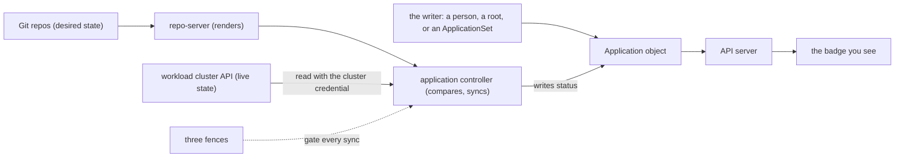

# Capstone · Module 1 — The Brief and the Mental Model

> **Day 2 · Capstone · Module 1 of 6 · read in P0**
> **Goal:** understand the incident, the objectives, and the method you will apply — the six steps, the six layers, and the masking chain.

---

## 1. Why this matters

Monday, 08:55. On Friday afternoon, several people merged several changes to the platform's repositories and left for the weekend. Nobody watched the dashboards. This morning the storefront team, the new team-a tenant, and the platform on-call channel each report that "Argo CD looks wrong" — each describing a *different* symptom, none agreeing on what is broken.

You are the platform engineer on call. Your lead's four instructions are the rules of this capstone:

1. **Find out what is true before you touch anything.**
2. **Every change goes through Git or the platform's declarative configuration.** No hand edits on a live cluster.
3. **Write everything down:** what you saw, what you changed, what happened next.
4. **When it is fixed, tell us what would have caught it sooner.**

An incident with one fault is a puzzle. An incident with several *connected* faults is a different problem: one fault can hide another, change its symptoms, or make your instruments lie. The four rules are not a handicap — they are what stops a two-fault incident from becoming a five-fault incident.

---

## 2. Learning objectives

1. **Identify the failure layer for every symptom without making uncontrolled changes** — a triage grid, each symptom backed by evidence and assigned a layer, *before* anything is changed (**CM1**).
2. **Use Argo CD and Kubernetes evidence to determine root cause** with the six-step method (**CM2**).
3. **Repair the desired state or platform configuration** through controlled, declarative changes only (**CM3**).
4. **Verify reconciliation, synchronization, and health** with the same evidence you diagnosed with, then the course's verification tool (**CM4**).
5. **Explain the guardrail or monitoring change that would prevent recurrence** of each fault, in writing (**CM5**).

The primary outcome is **O7** (diagnose repository, rendering, synchronization, health, and cluster-connectivity failures); it draws on all of O1–O8. Completing it is the evidence for the **Day 2 outcome**.

---

## 3. What earlier guides established (recap)

You have used every tool the capstone needs at least once: reading a badge three ways and the `tracking-id` annotation (Lab 1); repository/cluster Secrets, `kubectl auth can-i`, "Successful is a measurement, not a guarantee" (Lab 2); Helm rendering, drift, self-heal, waves/hooks, `git revert` (Labs 3–4); ApplicationSets, preview→count→apply, App-of-Apps ownership, "if your fix reverts, you fixed the wrong layer" (Labs 4); the three fences and "did the sync start?", finalizers and cascade (Labs 5–6); and the **six-step method** (Session 7) — the spine of every phase.

> **Two-cluster refresher:** `k3d-mgmt` runs Argo CD and every `Application`/`AppProject`/`ApplicationSet` (namespace `argocd`); `k3d-workload` runs the storefront/team-a/platform workloads. Every `kubectl` command names its `--context`. A surprising result is a wrong-context result until proven otherwise.
>
> **Git refresher:** undo with `git revert <sha>` (a new commit); never `git reset` on a shared branch or force-push — Git is your audit trail.

---

## 4. The method: six steps and two rules

The six steps, in Session 7's exact wording (every phase refers to them by number):

1. **Validate the Git source and revision.**
2. **Validate repository access and manifest rendering.**
3. **Compare rendered state with live cluster state.**
4. **Inspect synchronization results, hooks, events, and Kubernetes health.**
5. **Inspect the responsible Argo CD component and its metrics.**
6. **Correct the declarative source and verify reconciliation.**

Walk the steps in the direction the data flows, stop at the first step that lies. Steps 1–5 are reading; step 6 is the first change. The two rules: **evidence before change** (your first destructive action should be the fix) and **source before platform** (trust Git and rendering before you suspect Argo CD's own components).

### 4.2 Six layers: where a fault can live

Every symptom gets a **layer**. The names match, word for word, the six areas `capstone-check.sh` reports on in P3.

| Code | Layer | What lives here | Method steps | Where its evidence lives |
|---|---|---|---|---|
| `PLAT` | argo cd platform components | Argo CD's own pods | 5 | pod status/events/logs/`top` in `argocd` |
| `CONN` | workload cluster connectivity | reaching + authenticating to the workload cluster | 3 | Settings → Clusters, `argocd cluster list`, controller logs |
| `SRC` | application source rendering | Git content/history, repo access, chart→manifests | 1, 2 | `git log`, `argocd repo list`, `argocd app manifests`, conditions |
| `GEN` | application generation and ownership | which apps exist, and who wrote each | 1, 5 | inventory, ApplicationSet conditions/preview, root trees, tracking annotations |
| `POL` | deployment policy (permissions) | the three fences | 4 | sync operation results, `argocd proj get`, `kubectl auth can-i` |
| `RUN` | workload runtime health | running workloads + drift | 3, 4 | resource-tree health, Pods/events, `argocd app diff` |

This is a *sorting* scheme — its row order is not a repair order.

### 4.3 The chain behind every badge, and the masking question

Every badge is the end of a chain. Read it right-to-left:

1. The badge is read from the Application object by the API server.
2. The controller wrote that status after comparing rendered manifests (repo-server ← Git) with live state (read from the workload cluster).
3. Something *wrote* the Application object: a person, a root, or an ApplicationSet — and can rewrite it at any time.
4. Every sync must pass the three fences.

**The masking question.** When a box in this chain is broken, every badge *downstream* of it becomes unreliable. Like a car whose dashboard fuse blew — fuel, temperature, and speed all read zero at once, three alarming readings, one cause. So of each hypothesis ask:

> **If this hypothesis is true, which of my other evidence becomes untrustworthy?**

A hypothesis whose truth would blind you to other layers is one to confirm and repair **early**; after each such repair, re-read the whole picture, because hidden symptoms may now appear. **Evidence order and repair order are different things:** the six steps order how you *investigate* one symptom; the masking question orders which *repair* to make first when you have several.

### 4.4 Four habits you already own

- **Sync and health are separate questions.** A red badge is not the same as a hurting user. Rank symptoms by who is affected.
- **Did the sync start?** A denial before any sync operation came from Argo CD; a sync that started then failed with `forbidden` was refused by Kubernetes.
- **If your fix reverts, you fixed the wrong layer.** Trace *up* the ownership chain.
- **Every status is a measurement with a timestamp.** Check when a `Successful`/`Synced`/`Healthy` reading was taken before relying on it.

**→ Next:** [02 — Setup and rules of engagement](02-setup-and-rules.md)
