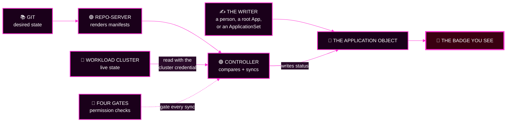
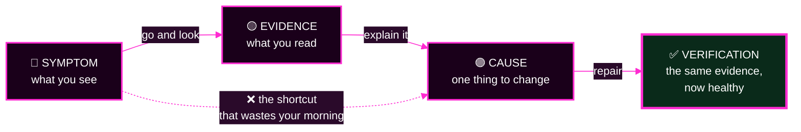
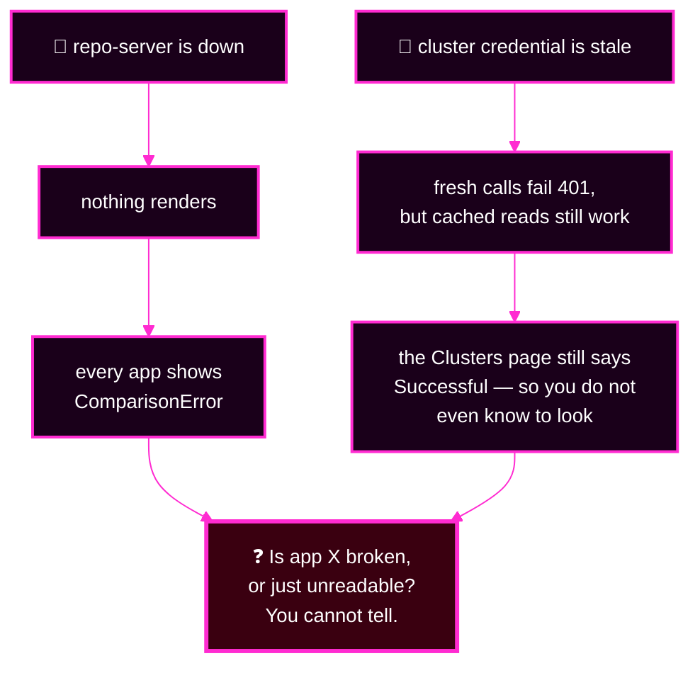

# Capstone · Module 1 — The Incident and the Mental Models

> **Day 2 · Capstone · Module 1 of 8 · ~10 minutes · read before the clock starts**
> **← Back to:** [Capstone](README.md) · [Day 2 map](../README.md)

---

## What are we trying to fix?

Nothing yet. **This module fixes your thinking**, not the platform.

Four ideas make the difference between finishing this incident and going in circles. They fit on one page.

---

## 📋 Page TL;DR

- **What this is.** The story, plus the four mental models you will use all morning.
- **Why it matters.** Under time pressure people react to badges. Badges are the *end* of a chain, not the start.
- **What to remember.** *A red symptom is not the same thing as a root cause.*
- **The most common mistake.** Treating seven symptoms as seven independent problems. Some of them are shadows of each other.

---

## 🎯 Goal of this module

**Be able to say, out loud, what a red badge actually proves — and what it does not.**

---

## Before you begin

- Nothing to install, nothing to run. Read it.
- Have the [Quick Rescue Guide](02-quick-rescue-guide.md) open in a second tab. You will jump between them.

---

## 1. The story: Monday, 08:55

On Friday afternoon several people merged changes to the platform's repositories and left for the weekend. Nobody watched the dashboards.

This morning, three separate reports arrive:

| Who | What they say |
|---|---|
| 🛒 The storefront team | *"Production looks weird and I think it's scaling on its own."* |
| 👥 The team-a tenant | *"Our app is fine but the dashboard is full of red."* |
| 📟 Platform on-call | *"There are Applications in here I have never seen before."* |

Three reports. **Three different symptoms. Not three different problems — and not one, either.**

You are the platform engineer on call. Your lead gives you four instructions, which are the rules of this capstone:

1. 🔍 Find out what is true before you touch anything.
2. 📝 Every change goes through Git or declarative configuration.
3. 🗒️ Write everything down.
4. 🛡️ When it is fixed, say what would have caught it sooner.

> 💡 **Why the rules are not a handicap.** An incident with one fault is a puzzle. An incident with several *connected* faults is a different animal: one fault changes another's symptoms, and an unlogged change becomes fault number eight.

### Mini TL;DR — section 1

- Several people changed several things, unobserved, over a weekend.
- Three teams report three different symptoms.
- The rules exist to stop a seven-fault incident becoming an eight-fault incident.

---

## 2. Mental model 1 — every badge is the end of a chain

A badge is not a fact about your application. It is the **final output of a pipeline**, and any box in that pipeline can poison it.

Read this diagram **right to left**: start at the badge, and ask what produced it.

**Four things had to happen before that badge appeared:**

1. Something **wrote** the Application object — a person, a root Application, or an ApplicationSet. It can rewrite it at any moment.
2. The **repo-server** fetched Git and rendered manifests.
3. The **controller** compared those manifests with live state read from the workload cluster.
4. Every sync had to pass **four permission gates**.

> 🔑 **A red symptom is not the same thing as a root cause.** A badge proves only that *the end of the chain* is unhappy.

### 🔍 What should I notice?

- If the badge says `Unknown`, the comparison never completed — so nothing downstream of it means anything.
- If the badge says `Synced`/`Degraded`, Git and live agree, and the *software* is unwell. That is a very different fault family from `OutOfSync`.
- If the badge keeps flipping, someone else is writing the same field. Find the writer.

### Mini TL;DR — section 2

- A badge is computed, not observed.
- Four things upstream of it can each make it lie.
- Reading a badge right-to-left is the whole skill.

### ✅ Key Takeaways — the badge chain

- **`Sync` and `Health` answer different questions.** *Does it match Git?* versus *is it working?*
- **Ask what produced the reading** before you act on the reading.
- **Every status is a measurement with a timestamp.** It may already be stale.

---

## 3. Mental model 2 — symptom, evidence, cause

These three words get used interchangeably in incidents. Keeping them apart is worth about twenty minutes of your morning.

| Word | Plain English | Example |
|---|---|---|
| 🔴 **Symptom** | what you can see from the outside | "`storefront-prod-workload` is `Degraded`" |
| 🟡 **Evidence** | something you deliberately went and read | `kubectl … get pods` shows `0/1 READY`, readiness probe returning 404 |
| 🟣 **Cause** | the one thing that, if changed, makes it all go away | the release the app is pinned to has a wrong readiness path |

> ⚠️ **Common mistake:** jumping straight from symptom to repair. It works about one time in four, and the other three times it adds a fault.

### Mini TL;DR — section 3

- Symptom = seen. Evidence = read on purpose. Cause = the one change.
- Verification re-reads **the same evidence** you diagnosed with.
- The dotted arrow is the trap.

---

## 4. Mental model 3 — masking, or why your instruments lie

Picture a car whose dashboard fuse has blown. Fuel, temperature and speed all read zero.

**Three alarming readings. One cause. And none of the three readings can be trusted while the fuse is out.**

That is masking, and this incident has it.

**Ask this of every hypothesis you form:**

> ❓ **The masking question: if this were true, which of my other evidence becomes untrustworthy?**

A hypothesis that would blind you to other areas is one to **confirm and repair early**. Then look again — hidden symptoms appear.

> 🔑 **Source before platform.** Trust Git and rendering before you suspect Argo CD's own pods… *unless* the pods are visibly unhealthy, in which case nothing else can be trusted at all.

### ⚠️ Common mistake

Fixing the noisiest fault first. The noisiest fault is often a *shadow* of a quiet one, and it comes straight back.

### ✅ Key Takeaways — masking

- **One broken box can produce many red badges.**
- **Investigation order and repair order are different things.** Investigate one symptom in stages; repair the masking fault first.
- **After every repair, re-read the whole picture.** The platform you are looking at is not the one you were looking at ten minutes ago.

---

## 5. Mental model 4 — the six areas a fault can live in

Every symptom gets sorted into exactly one **area**. These six names are not invented for this page: they are, word for word, the six lines `capstone-check.sh` prints in phase 4.

| Code | Area | Plain English | Where its evidence lives |
|---|---|---|---|
| 🟣 `PLAT` | argo cd platform components | *Argo CD's own pods are sick* | `kubectl -n argocd get pods` on **mgmt** |
| 🔗 `CONN` | workload cluster connectivity | *Argo CD cannot reach or authenticate to the workload cluster* | `argocd cluster list`, controller logs |
| 📚 `SRC` | application source rendering | *Git content, repo access, or chart rendering is wrong* | `git log`, `argocd app manifests`, conditions |
| 🏭 `GEN` | application generation and ownership | *the wrong Applications exist, or two owners fight* | inventory, ApplicationSet conditions, tracking IDs |
| 🚪 `POL` | deployment policy (permissions) | *something refused the change* | operation messages, `argocd proj get`, `auth can-i` |
| 🔵 `RUN` | workload runtime health | *the software itself is unwell, or drifting* | Pods, events, `argocd app diff` |

**This is a sorting scheme, not a repair order.** Row order means nothing.

> 💡 **Use it like a postbox.** Every symptom goes in exactly one slot. A symptom you cannot sort is a symptom you have not gathered enough evidence for.

### Mini TL;DR — section 5

- Six areas, six slots, and the checker uses the same six names.
- Sorting a symptom is not the same as solving it.
- "I cannot sort this yet" is a legitimate, useful answer in phase 2.

---

## 6. The investigation stations (Session 7, in one table)

When you investigate **one** symptom, you walk stations in order and stop at the first one that lies.

| Station | Question | Component it names |
|---|---|---|
| **0 · Scope** | how much is broken, and what do the broken ones share? | *(none — this picks your path)* |
| **1 · Source** | is the declared source right, and does it answer? | **Git** |
| **2 · Render** | did manifests actually come out? | **repo-server** |
| **3 · Compare** | what is genuinely different? | **application controller** |
| **4 · Apply + health** | did the write land, and is the workload up? | **controller + workload cluster API** |
| **5 · Component** | is the implicated component itself healthy? | whichever station pointed at it |
| **6 · Repair + verify** | did the fix converge? | **Git**, then the whole loop again |

**Stations 0–5 read. Station 6 is your first change.**

> 🔑 **One symptom at a time walks the stations. Several symptoms at once ask the masking question.**

### ✅ Key Takeaways — the method

- **Evidence before change.** Your first destructive action should be the fix.
- **Source before platform.** Both sides of a comparison must be trusted before the comparison means anything.
- **Each station names one component**, which is how you know whose logs to open.
- **A shared symptom means a shared dependency**, never several coincidences at once.

---

## ✅ Success condition for this module

You can answer these four out loud, without scrolling back:

1. **What does a red badge actually prove?** (That the end of a chain is unhappy — nothing more.)
2. **What is the masking question?** (*If this were true, which of my other evidence becomes untrustworthy?*)
3. **Name the six areas** a fault can live in.
4. **What is the difference** between a symptom, a piece of evidence, and a cause?

---

## 📋 Final TL;DR

- **The badge is the end of a chain.** Read it right to left.
- **Symptom ≠ evidence ≠ cause.** Do not skip the middle one.
- **Masking is real here.** Ask what a hypothesis would make untrustworthy.
- **Six areas to sort into; seven stations to walk.** Sorting is phase 2; walking is phase 3.

---

## ✅ Key Takeaways — module 1

- 🔴 **A red symptom is not the same thing as a root cause.**
- 🔍 **Evidence before change**, every single time.
- 📚 **Source before platform**, unless the platform is visibly on fire.
- 🧩 **A healthy parent does not automatically mean every child is healthy** — you will meet this one today.
- 🔁 **After each repair, re-read everything.** The picture moves.

**→ Next:** [Module 2 — 🛟 Quick Rescue Guide: the Day 1 knowledge you need](02-quick-rescue-guide.md)
