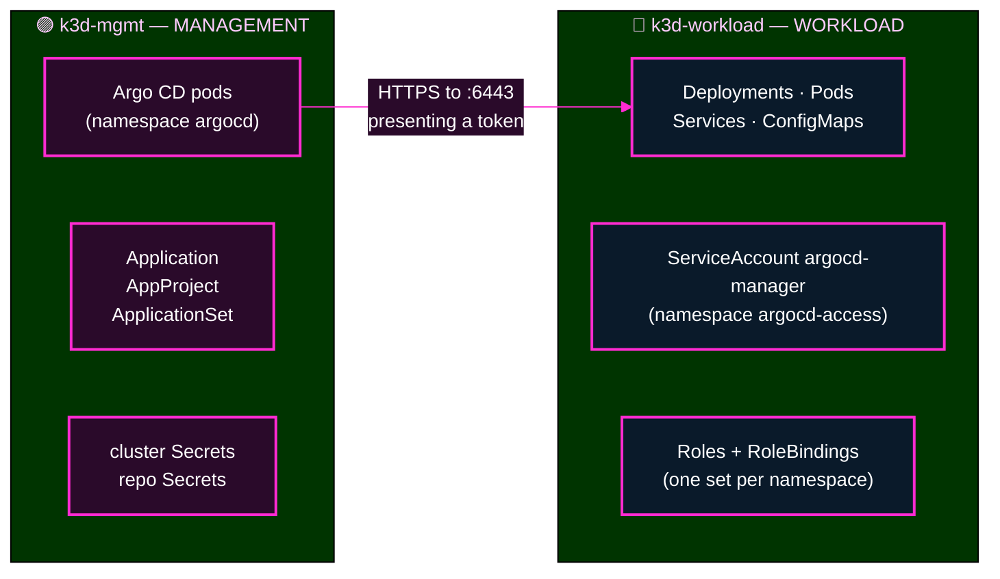
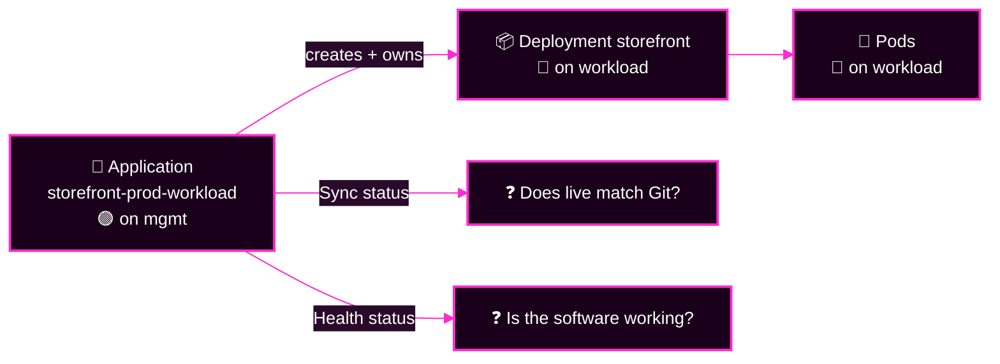
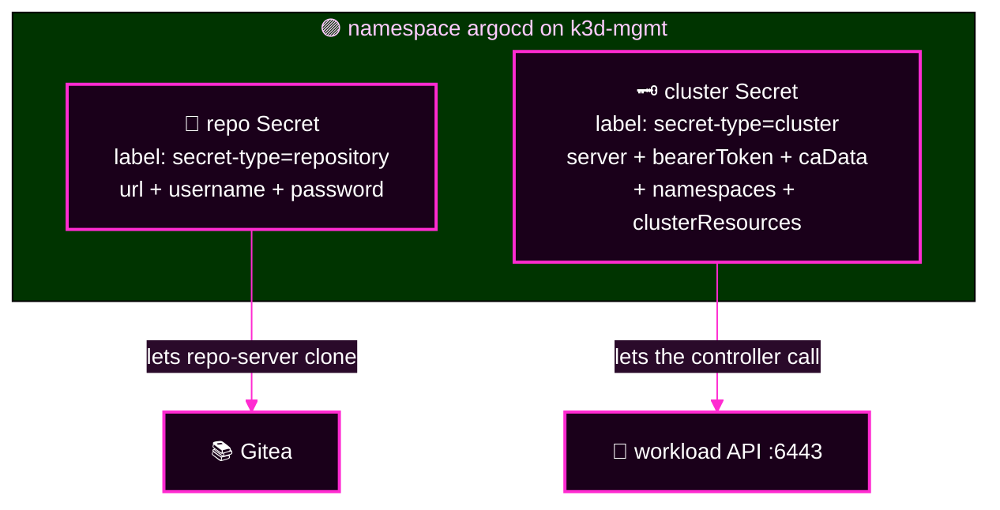
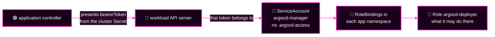
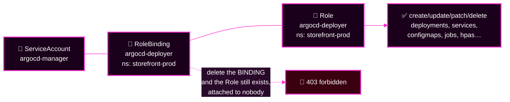
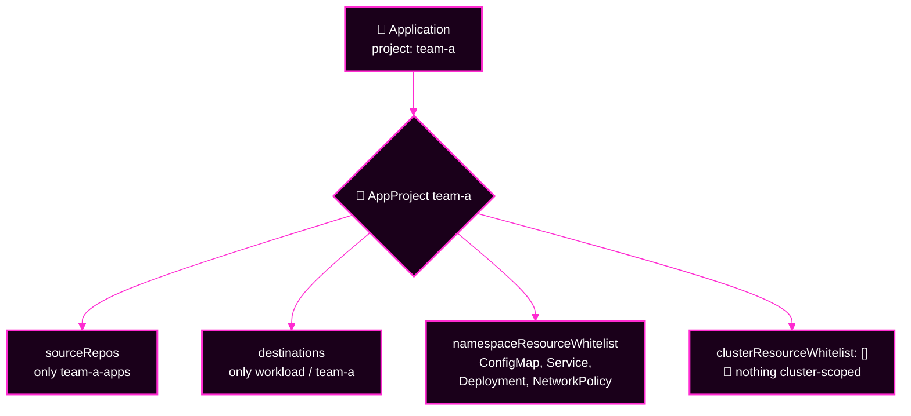
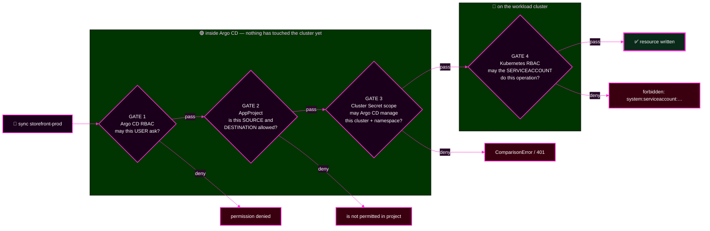
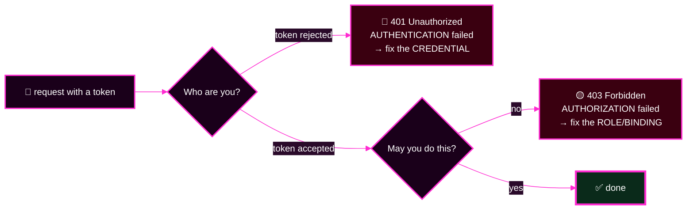
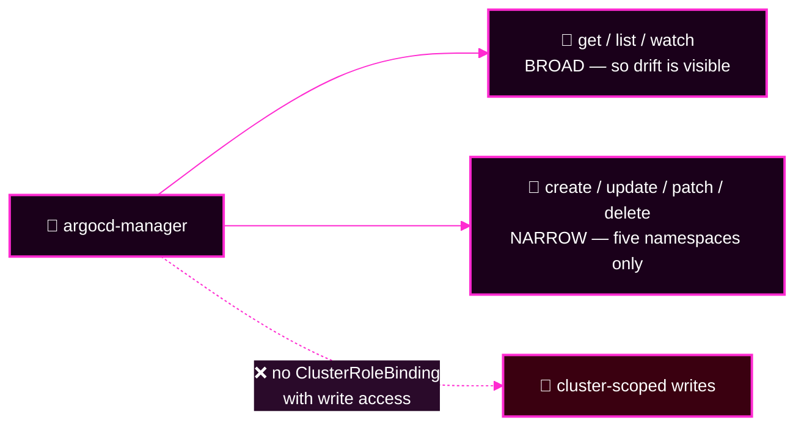
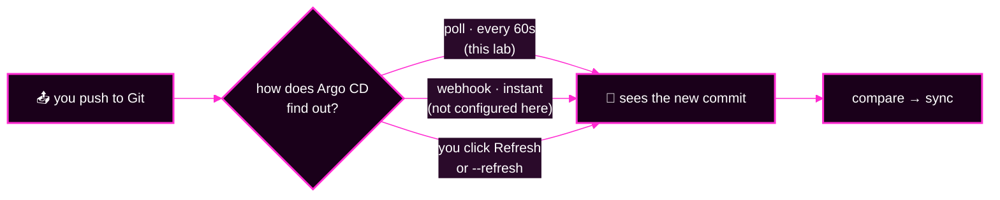

# Capstone · Module 2 — 🛟 Quick Rescue Guide: The Day 1 Knowledge You Need

> **Day 2 · Capstone · Module 2 of 8 · ~15 minutes to read · keep it open during the incident**
> **← Back to:** [Capstone](README.md) · [Day 2 map](../README.md)

---

## What are we trying to fix?

**A gap in your memory, before it costs you the incident.**

Several capstone faults sit on top of things you last touched on Day 1 — clusters, Secrets, ServiceAccounts, RoleBindings, AppProjects. If those words have gone fuzzy, this page brings them back in about fifteen minutes.

> 🔓 **This page gives you the answers.** You are not being graded on what you remember from Day 1. You are being graded on how you investigate today.

---

## 📋 Page TL;DR

- **What this is.** Eleven rescue cards, each one concept, each with a picture, a tiny example, hints, and a full answer.
- **Why it matters.** Four of the seven fault families need one of these concepts. Guessing costs ten minutes each time.
- **What to remember.** *Argo CD is the manager. Kubernetes is the building where the work happens.*
- **The most common mistake.** Running a `kubectl` command against the wrong cluster and believing the answer.

---

## 🎯 Goal of this module

**Be able to answer, in one sentence each: which cluster? which Secret? which permission system? and did it say 401 or 403?**

---

## Before you begin

- No commands are required here. Every command shown is **read-only** unless it is marked ⚠️.
- If you are mid-incident and just need one card, use the map below.

---

## 🗺️ The rescue map — jump straight to what you need

| Card | Concept | You need it when |
|---|---|---|
| [R1](#r1--two-clusters-management-and-workload) | Management vs workload cluster | any `kubectl` gives a surprising answer |
| [R2](#r2--an-application-is-not-the-workload) | Application vs the workloads it manages | "the app is Healthy but the Pods are not" |
| [R3](#r3--the-two-kinds-of-secret) | Repository Secrets and cluster-registration Secrets | a repo or a cluster stops working |
| [R4](#r4--the-argocd-manager-serviceaccount) | The `argocd-manager` ServiceAccount | anything about *who* Argo CD is on the workload cluster |
| [R5](#r5--roles-and-rolebindings) | Roles and RoleBindings (Kubernetes RBAC) | a sync starts and then fails `forbidden` |
| [R6](#r6--kubectl-auth-can-i) | `kubectl auth can-i` | you want to test a permission without changing anything |
| [R7](#r7--appprojects-the-fence-around-an-application) | AppProjects, `sourceRepos`, destinations, resource lists | a sync is refused **before** it starts |
| [R8](#r8--argo-cd-authorization-versus-kubernetes-authorization) | The four gates | you have a denial and do not know who said no |
| [R9](#r9--401-versus-403) | 401 versus 403 | the message contains a number |
| [R10](#r10--least-privilege-and-why-default-is-dangerous) | Least privilege, and the `default` AppProject | you are tempted to widen something to make red go away |
| [R11](#r11--how-argo-cd-notices-a-git-change) | Polling, webhooks, refresh | "I pushed the fix and nothing happened" |

---

## R1 — Two clusters: management and workload

**In one sentence.** You have two Kubernetes clusters: one runs Argo CD, the other runs the software Argo CD deploys.

**Analogy.** 🟣 **Argo CD is the manager. 🔵 Kubernetes is the building where the work happens.** The manager's office is in a different building from the factory floor.



**Tiny example.**

```bash
kubectl --context k3d-mgmt     -n argocd get applications   # the Argo CD objects
kubectl --context k3d-workload -n storefront-prod get pods  # the actual software
```

**❓ What should you predict?** You run `kubectl --context k3d-mgmt -n storefront-prod get pods`. What comes back?

<details><summary>💡 Hint 1</summary>

Which cluster do storefront namespaces live on?
</details>

<details><summary>💡 Hint 2</summary>

The management cluster has no `storefront-prod` namespace at all.
</details>

<details><summary>💡 Hint 3</summary>

Kubernetes does not say "wrong cluster". It answers the question you actually asked.
</details>

<details><summary>🔓 Full answer</summary>

You get **`No resources found in storefront-prod namespace.`** — or an error that the namespace does not exist. Nothing is broken. You asked the manager's office about the factory floor.

**Rule to keep:** a surprising `kubectl` result is a **wrong-context** result until you have proved otherwise. Check with `kubectl config current-context`, and always spell out `--context`.
</details>

### ✅ Key Takeaways — R1

- 🟣 `k3d-mgmt` holds **Argo CD's objects**: `Application`, `AppProject`, `ApplicationSet`, cluster and repo Secrets, and Argo CD's own pods.
- 🔵 `k3d-workload` holds **the software**: Deployments, Pods, Services, plus the ServiceAccount and RoleBindings Argo CD uses there.
- **Name the context in every command.** Always.

---

## R2 — An Application is not the workload

**In one sentence.** An Argo CD `Application` is a *record of intent*; the Deployments and Pods it creates are the *actual software*.

**Analogy.** The Application is the **work order**. The Pods are the **product**. A tidy work order does not prove the product came out right.



**Tiny example.** Two statuses, two questions:

```text
Sync Status:    Synced       <- live matches Git
Health Status:  Degraded     <- the software is not working
```

**❓ What should you predict?** An App-of-Apps root shows 🟢 `Healthy`. One of its children is 🔴 `Degraded`. Is the root wrong?

<details><summary>💡 Hint 1</summary>

What resource does the root actually manage? Not Pods.
</details>

<details><summary>💡 Hint 2</summary>

The root's job is to keep *child Application objects* matching Git. It succeeded at that.
</details>

<details><summary>💡 Hint 3</summary>

Argo CD does not, by default, roll a child's health up into its parent.
</details>

<details><summary>🔓 Full answer</summary>

The root is **correct**. It applied the child Application objects exactly as Git describes them, so it is `Synced` and `Healthy`. The *child's workload* is unwell, which is the child's status to report.

> 🔑 **A healthy parent does not automatically mean every child is healthy.** Always list the children.

```bash
argocd app get platform-root -o tree
```
</details>

### ✅ Key Takeaways — R2

- **Sync answers "does it match Git?". Health answers "is it working?"** They are independent.
- A parent Application's health describes **the children it wrote**, not the software those children deploy.
- When a parent is green, go one level down before relaxing.

---

## R3 — The two kinds of Secret

**In one sentence.** Argo CD keeps two kinds of labelled Secret on the management cluster: one that says **how to read a Git repository**, and one that says **how to reach and manage a cluster**.

**Analogy.** A **repository Secret** is a library card. A **cluster-registration Secret** is the key to another building, plus a note saying which rooms you may enter.



**Tiny example** — list them without ever printing their contents:

```bash
kubectl --context k3d-mgmt -n argocd get secrets -l argocd.argoproj.io/secret-type=repository
kubectl --context k3d-mgmt -n argocd get secrets -l argocd.argoproj.io/secret-type=cluster
```

**What the cluster Secret carries, field by field:**

| Field | Question it answers |
|---|---|
| `server` | which API endpoint? (`https://k3d-workload-server-0:6443`) |
| `config.bearerToken` | who should I be? |
| `config.tlsClientConfig.caData` | how do I know it is the real cluster? |
| `namespaces` | which namespaces may Argo CD manage? |
| `clusterResources: "false"` | may Argo CD write cluster-scoped objects? **No.** |

**❓ What should you predict?** Somebody rotates the ServiceAccount token on the workload cluster but does not update the cluster Secret. What does Argo CD report?

<details><summary>💡 Hint 1</summary>

The address is still right. The CA is still right. Only the token is old.
</details>

<details><summary>💡 Hint 2</summary>

An old token is not an unknown *person* — it is an unaccepted *credential*.
</details>

<details><summary>💡 Hint 3</summary>

Look for a number in the message, and read card [R9](#r9--401-versus-403).
</details>

<details><summary>🔓 Full answer</summary>

Argo CD's calls fail with **`401 Unauthorized`** — but **more quietly than you would expect.**

The controller already holds an authenticated watch on that cluster and answers comparisons from **cache**, so `argocd cluster list` can keep reporting `Successful` for a long time. The failure surfaces the first time Argo CD has to make a **fresh** call, usually a sync:

```text
failed to discover server resources for group version apps/v1: Unauthorized
```

> 🔑 **A cluster Secret tells Argo CD how to reach a cluster and what scope it may manage.** If it is stale, nothing on that cluster can be trusted — *including the page that says the cluster is fine.*

So check the **messages**, not just the connection status:

```bash
argocd app get <app> --show-operation | grep -E "Phase|Message"
kubectl --context k3d-mgmt -n argocd logs statefulset/argocd-application-controller --since=10m \
  | grep -i unauthorized | tail -3
```
</details>

### ✅ Key Takeaways — R3

- Both kinds of Secret live in `argocd` on 🟣 **mgmt**, and are found by their **label**.
- The cluster Secret carries *address*, *identity*, *trust*, and *scope*.
- **Never print a Secret's contents.** List names and labels; read the connection status instead.

---

## R4 — The `argocd-manager` ServiceAccount

**In one sentence.** On the 🔵 workload cluster, Argo CD acts as a ServiceAccount named `argocd-manager` in the namespace `argocd-access` — that is the identity Kubernetes checks.

**Analogy.** The manager does not walk into the factory as "the manager". They badge in as a specific, named contractor account, and the factory's door locks only know that account.



**Its full name, as Kubernetes writes it:**

```text
system:serviceaccount:argocd-access:argocd-manager
         ^ namespace ^      ^ name ^
```

**Tiny example:**

```bash
kubectl --context k3d-workload -n argocd-access get serviceaccount argocd-manager
```

**❓ What should you predict?** The ServiceAccount lives in `argocd-access`, but the app deploys into `storefront-prod`. Can it work?

<details><summary>💡 Hint 1</summary>

Where an identity *lives* and where it is *allowed to act* are two different things.
</details>

<details><summary>💡 Hint 2</summary>

A RoleBinding lives in the namespace where the permission applies, and names a subject that may live elsewhere.
</details>

<details><summary>💡 Hint 3</summary>

Look at the `subjects:` block of a RoleBinding in `storefront-prod`.
</details>

<details><summary>🔓 Full answer</summary>

**Yes.** A `RoleBinding` inside `storefront-prod` names the subject `argocd-manager` from namespace `argocd-access` and grants it that namespace's Role. The identity's *home* namespace is irrelevant to where it may act.

```bash
kubectl --context k3d-workload -n storefront-prod get rolebindings
kubectl --context k3d-workload -n storefront-prod get rolebinding argocd-deployer -o yaml
```
</details>

### ✅ Key Takeaways — R4

- One identity, `argocd-manager`, created **on the workload cluster** by `~/course/lab-files/lab-02/workload-rbac.yaml`.
- The management cluster only stores a **copy of its token**.
- The `--as=system:serviceaccount:argocd-access:argocd-manager` string is how you ask questions *as* Argo CD.

---

## R5 — Roles and RoleBindings

**In one sentence.** A **Role** is a list of permissions inside one namespace; a **RoleBinding** attaches that list to an identity.

**Analogy.** 📜 **A Role grants permission. 🔗 A RoleBinding connects that permission to an identity.** A permission nobody is bound to does nothing at all.



**Tiny example** — the shape of the binding, trimmed to what matters:

```yaml
kind: RoleBinding
metadata:
  name: argocd-deployer
  namespace: storefront-prod     # where the permission applies
roleRef:
  kind: Role
  name: argocd-deployer          # which permission list
subjects:
  - kind: ServiceAccount
    name: argocd-manager         # who gets it
    namespace: argocd-access     # …and where that identity lives
```

**❓ What should you predict?** Someone deletes the RoleBinding in `storefront-prod` but leaves the Role. What does a sync of that app do?

<details><summary>💡 Hint 1</summary>

Reading and writing are separate verbs. Which one did the binding carry?
</details>

<details><summary>💡 Hint 2</summary>

Argo CD will still happily *compare*, because read access comes from elsewhere. The failure appears only when it tries to write.
</details>

<details><summary>💡 Hint 3</summary>

The sync **starts**, then fails. Look at the message on the sync operation, not at the sync status badge.
</details>

<details><summary>🔓 Full answer</summary>

The sync **starts and then fails** with a message containing **`forbidden`** and the full ServiceAccount name, for example:

```text
deployments.apps is forbidden: User "system:serviceaccount:argocd-access:argocd-manager"
cannot create resource "deployments" in API group "apps" in the namespace "storefront-prod"
```

That is **Kubernetes** refusing, not Argo CD. The repair is to put the RoleBinding back — declaratively, from the reviewed file:

```bash
# ⚠️ changes state — this is a repair, not a diagnosis
kubectl --context k3d-workload apply -f ~/course/lab-files/lab-02/workload-rbac.yaml
```
</details>

### ✅ Key Takeaways — R5

- Role = what. RoleBinding = who. Both live in the namespace where the permission applies.
- Deleting a binding leaves a perfectly valid Role attached to nobody — and produces `forbidden`.
- The reviewed source of truth for this course's workload RBAC is `~/course/lab-files/lab-02/workload-rbac.yaml`.

---

## R6 — `kubectl auth can-i`

**In one sentence.** `kubectl auth can-i` asks Kubernetes a permission question and answers `yes` or `no` **without changing anything**.

**Analogy.** It is asking the security desk *"would you let this contractor into that room?"* instead of walking them to the door and finding out.

**Tiny example** — asked *as* Argo CD's identity:

```bash
kubectl --context k3d-workload auth can-i create deployments.apps \
  -n storefront-prod --as=system:serviceaccount:argocd-access:argocd-manager
```

**The whole permission matrix in one loop** (read-only, safe any time):

```bash
for ns in storefront-dev storefront-staging storefront-prod platform-system team-a; do
  printf '%-20s ' "${ns}"
  kubectl --context k3d-workload auth can-i create deployments.apps -n "${ns}" \
    --as=system:serviceaccount:argocd-access:argocd-manager
done
```

**❓ What should you predict?** What does that loop print on a healthy platform?

<details><summary>💡 Hint 1</summary>

Every one of the five namespaces has a Role that allows writing Deployments.
</details>

<details><summary>💡 Hint 2</summary>

`team-a` has a *reduced* Role — but the reduction is about NetworkPolicies, quotas and limit ranges, not Deployments.
</details>

<details><summary>💡 Hint 3</summary>

Five lines, one word each.
</details>

<details><summary>🔓 Full answer</summary>

```text
storefront-dev       yes
storefront-staging   yes
storefront-prod      yes
platform-system      yes
team-a               yes
```

And the cluster-scoped check must answer **`no`**, because least privilege forbids cluster-scoped writes:

```bash
kubectl --context k3d-workload auth can-i create clusterroles.rbac.authorization.k8s.io \
  --as=system:serviceaccount:argocd-access:argocd-manager       # expect: no
```

A `no` where you expected `yes` points at a **missing RoleBinding** in that namespace.
</details>

### ✅ Key Takeaways — R6

- **`kubectl auth can-i` lets you ask Kubernetes a permission question without actually changing anything.**
- Always add `--as=…` — otherwise you are asking about *yourself*, the cluster admin, and the answer is meaningless.
- One `no` in the matrix localises a permission fault to one namespace in seconds.

---

## R7 — AppProjects: the fence around an Application

**In one sentence.** An `AppProject` limits **where an Application may deploy from and to**, and **which kinds of resource** it may create.

**Analogy.** The AppProject is the **contract** the work order must fit inside. Argo CD checks the contract before anyone is dispatched.



**The four restrictions, in plain English:**

| Field | Plain English | Denial you would see |
|---|---|---|
| `sourceRepos` | which Git repositories may this app deploy from? | *application repo … is not permitted in project* |
| `destinations` | which cluster **and** namespace may it deploy to? | *application destination … is not permitted in project* |
| `namespaceResourceWhitelist` | which namespaced kinds may it create? | *resource :Secret is not permitted in project* |
| `clusterResourceWhitelist` | which cluster-scoped kinds may it create? (`[]` = none) | *resource rbac…:ClusterRole is not permitted in project* |

**Tiny example:**

```bash
argocd proj list
argocd proj get team-a
```

**❓ What should you predict?** An Application in project `team-a` is pointed at the `storefront-prod` namespace. Does anything reach the cluster?

<details><summary>💡 Hint 1</summary>

The project allows exactly one destination namespace, and it is not that one.
</details>

<details><summary>💡 Hint 2</summary>

This check happens inside Argo CD, before any call to Kubernetes is made.
</details>

<details><summary>💡 Hint 3</summary>

Look for the phrase *"is not permitted in project"*.
</details>

<details><summary>🔓 Full answer</summary>

**Nothing reaches the cluster.** Argo CD refuses the Application's spec itself, and **no sync ever starts**. You see a condition such as `InvalidSpecError` with *"application destination … is not permitted in project team-a"*.

> 🔑 **The AppProject checks whether the request is allowed. Kubernetes RBAC checks whether the actual operation is allowed.**

The tell is whether anything was attempted: **nothing touched → Argo CD refused. Attempted and rejected → Kubernetes refused.**
</details>

### ✅ Key Takeaways — R7

- An AppProject is a fence around **an Application**, not around a person.
- It restricts **source**, **destination**, and **resource kinds**, in that order of usefulness.
- Its denials name the **project**. Kubernetes' denials name the **ServiceAccount**.

---

## R8 — Argo CD authorization versus Kubernetes authorization

**In one sentence.** Four separate permission systems can refuse a change, and three of them live inside Argo CD.



**The routing question, and it takes one look:**

> ❓ **Did anything on the cluster actually get touched?**
> **Nothing touched** → gate 1, 2, or 3. Argo CD refused, internally.
> **Attempted, then rejected** → gate 4. Kubernetes pushed back.

| Message contains | Gate | Who fixes it | Did a sync start? |
|---|---|---|---|
| `permission denied` | 1 · Argo CD RBAC | platform team, in `policy.csv` | ❌ no |
| `is not permitted in project` | 2 · AppProject | platform team, in the AppProject | ❌ no |
| `Unauthorized` / `401` | 3 · cluster Secret | platform team, in the cluster Secret | ❌ no — the call was never accepted |
| `forbidden` + `system:serviceaccount:…` | 4 · Kubernetes RBAC | cluster owner, in a Role/RoleBinding | ✅ yes, then failed |

**❓ What should you predict?** A message says *"deployments.apps is forbidden: User system:serviceaccount:argocd-access:argocd-manager cannot create…"*. Which gate, and where do you go?

<details><summary>💡 Hint 1</summary>

Does the message name a *project* or an *identity*?
</details>

<details><summary>💡 Hint 2</summary>

An identity beginning `system:serviceaccount:` is a Kubernetes concept, not an Argo CD one.
</details>

<details><summary>💡 Hint 3</summary>

Something was attempted on the cluster and rejected there.
</details>

<details><summary>🔓 Full answer</summary>

**Gate 4 — Kubernetes RBAC**, on the 🔵 workload cluster, in the namespace named in the message. Go there and check the RoleBinding:

```bash
kubectl --context k3d-workload -n <namespace> get roles,rolebindings
kubectl --context k3d-workload auth can-i create deployments.apps -n <namespace> \
  --as=system:serviceaccount:argocd-access:argocd-manager
```

Nothing in Argo CD's configuration will fix this, because nothing in Argo CD refused it.
</details>

### ✅ Key Takeaways — R8

- Gates 1–3 are **Argo CD**. Gate 4 is **Kubernetes**. Different systems, different files, different owners.
- The **message**, not the badge, names the gate.
- One question routes you: *did anything get applied?*

---

## R9 — 401 versus 403

**In one sentence.** 🔴 **401 means the identity was not accepted. 403 means the identity was accepted but denied.**

**Analogy.** **401:** the badge reader does not recognise your card. **403:** it recognises you perfectly, and this door is still not yours.



| | 🔴 401 Unauthorized | 🟡 403 Forbidden |
|---|---|---|
| Plain English | *"I do not accept this credential."* | *"I know who you are. No."* |
| What failed | authentication | authorization |
| Typical cause here | the cluster Secret's token is stale or rotated | a Role or RoleBinding is missing |
| How wide is the blast? | **every** app on that cluster — but often invisibly, from cache | usually **one** namespace |
| Where it actually shows up | `Unauthorized` in a **sync message** or controller log | `forbidden` in a sync message **or** in a `ComparisonError` |
| Where you fix it | the cluster Secret on 🟣 mgmt | Role/RoleBinding on 🔵 workload |

**❓ What should you predict?** A sync message says `Unauthorized`. A different Application's condition says `forbidden`, naming a ServiceAccount and a namespace. Which do you repair first?

<details><summary>💡 Hint 1</summary>

Ask the masking question about each one.
</details>

<details><summary>💡 Hint 2</summary>

While a credential is rejected, can you trust *any* reading about that cluster?
</details>

<details><summary>💡 Hint 3</summary>

One of these two faults makes the other one's evidence unreadable.
</details>

<details><summary>🔓 Full answer</summary>

Repair the **401 first**. **401 hides 403:** until Argo CD can authenticate at all, it cannot discover what it is *not authorized* to do, so what you can see of the 403 may be only part of it.

Fix the credential, let the cache rebuild, **then look again**. Expect the picture to get worse for a minute — Applications that looked fine on stale cache flip to `Unknown`/`Missing`. **That is the repair working**, not damage you caused.
</details>

### ✅ Key Takeaways — R9

- **401 = credential. 403 = permission.** One word each.
- 401 is usually **wide** (whole cluster). 403 is usually **narrow** (one namespace).
- A 401 masks other faults. Repair it early, then re-read everything.

---

## R10 — Least privilege, and why `default` is dangerous

**In one sentence.** Argo CD needs to **read** widely to notice drift, but should be able to **write** only in a few named namespaces.

**Analogy.** The manager may walk every corridor with a clipboard 👀, but may only unlock four doors 🔑.



> 🔑 **Least privilege means narrow write access. Argo CD still needs broad read access to observe the cluster.** Take the read away and it stops noticing drift — which looks like health, and is not.

**Why the `default` AppProject is dangerous.** A brand-new Argo CD ships a project called `default` with `'*'` in every field: any repository, any cluster, any namespace, any resource kind. An Application that lands in `default` has **no fence at all**. That is exactly how a test app reaches production.

**❓ What should you predict?** You are stuck on a `forbidden` error at 01:10 into the incident. Someone suggests giving `argocd-manager` `cluster-admin` "just to get green". What is wrong with that?

<details><summary>💡 Hint 1</summary>

Would it make the badge green? Probably. Is the badge the goal?
</details>

<details><summary>💡 Hint 2</summary>

Which of the capstone's four rules does it break?
</details>

<details><summary>💡 Hint 3</summary>

Think about what you would have to write in your reflection afterwards.
</details>

<details><summary>🔓 Full answer</summary>

It trades an outage for a **security hole**, permanently, to save ten minutes. It is explicitly off limits in this capstone.

**Restoring** a guardrail to its designed state is a repair. **Widening** it past that design is not a repair — it is a second incident with a delayed fuse.

The designed state for this course lives in `~/course/lab-files/lab-02/workload-rbac.yaml`. Re-apply that, do not invent something wider.
</details>

### ✅ Key Takeaways — R10

- Broad **read**, narrow **write**. Removing read access hides drift.
- The `default` AppProject is `'*'` everywhere — never leave a real Application in it.
- Restoring a guardrail is allowed. Widening one is not.

---

## R11 — How Argo CD notices a Git change

**In one sentence.** In this lab Argo CD **polls** Git about every 60 seconds; a webhook would tell it instantly, and **Refresh** makes it look right now.

**Analogy.** Polling is checking the letterbox every minute. A webhook is the postman ringing the bell.



**Tiny example:**

```bash
argocd app get <app> --refresh        # look again now, using cached rendering
argocd app get <app> --hard-refresh   # look again now, and re-render from scratch
```

**❓ What should you predict?** You push a fix, wait ten seconds, and the Application still shows the old state. Broken?

<details><summary>💡 Hint 1</summary>

How long is the poll interval in this lab?
</details>

<details><summary>💡 Hint 2</summary>

Which objects does Argo CD reconcile *from Git*, and which does the platform team **apply** by hand?
</details>

<details><summary>💡 Hint 3</summary>

An `ApplicationSet` object and a top-level `Application` object are applied with `kubectl`. Committing them changes nothing until somebody applies them.
</details>

<details><summary>🔓 Full answer</summary>

Two possibilities, and you can tell them apart:

1. **You were early.** Wait up to 60 seconds, or click **Refresh**. This is the common case.
2. **That object is not reconciled from Git at all.** ApplicationSets, top-level Applications, AppProjects, cluster and repo Secrets, and Argo CD's own Helm values are **applied** by the platform team. A commit alone changes nothing — the apply step is the change.

> ⚠️ **This distinction causes more confusion in this capstone than any other single thing.** Before you conclude "my fix did not work", ask: *does anything reconcile this object from Git?*
</details>

### ✅ Key Takeaways — R11

- Git poll is ~60s in this lab; **Refresh** short-circuits the wait.
- A **hard** refresh also discards cached rendering — note it in your log when you use it.
- **Some objects are reconciled from Git; others are applied.** Know which before you blame the tool.

---

## 🧰 The most useful diagnostic commands, in one place

All read-only. All safe. Copy them into your notes.

| Question | Command | Runs against |
|---|---|---|
| What is the whole picture? | `argocd app list` | 🟣 mgmt |
| Everything about one app on one screen? | `argocd app get <app>` | 🟣 mgmt |
| What did the last sync actually do? | `argocd app get <app> --show-operation` | 🟣 mgmt |
| What differs from Git? | `argocd app diff <app>` | 🟣 mgmt |
| Did the repo-server render anything? | `argocd app manifests <app> --source git` | 🟣 mgmt |
| Are Argo CD's own pods healthy? | `kubectl --context k3d-mgmt -n argocd get pods` | 🟣 mgmt |
| Is the workload cluster connected? | `argocd cluster list` | 🟣 mgmt |
| Which projects exist and how narrow are they? | `argocd proj get <project>` | 🟣 mgmt |
| Who generated this Application? | `kubectl --context k3d-mgmt -n argocd get applications -o custom-columns='NAME:.metadata.name,BY:.metadata.ownerReferences[0].name'` | 🟣 mgmt |
| Are the Pods actually running? | `kubectl --context k3d-workload -n <ns> get pods` | 🔵 workload |
| Why is that Pod unhappy? | `kubectl --context k3d-workload -n <ns> describe pod <pod>` | 🔵 workload |
| May Argo CD write here? | `kubectl --context k3d-workload auth can-i create deployments.apps -n <ns> --as=system:serviceaccount:argocd-access:argocd-manager` | 🔵 workload |
| What changed in Git? | `git -C ~/capstone/<repo> log -n 10 --oneline` | 📚 your clone |

---

## ⚠️ Which commands only look, and which ones change things

This table is the difference between an investigation and a second incident.

| 👀 Only looks — safe at any time | ⚠️ Changes state — needs a plan, a prediction, and a log entry |
|---|---|
| `argocd app get / list / diff / manifests / history` | `argocd app sync <app>` |
| `argocd cluster list / get`, `argocd proj get`, `argocd repo list` | `argocd app delete <app>` 🔴 |
| `argocd appset generate <file>` (previews, applies nothing) | `kubectl apply -f <file>` |
| `kubectl get / describe / logs / top / auth can-i` | `kubectl edit / patch / scale / delete` 🔴 |
| `git log / show / diff / ls-remote` | `git push` |
| **Refresh** and **hard refresh** in the UI | `apply-argocd-config.sh` |

> 🔴 **Deletes are the sharpest tool in the room.** In this capstone a delete is only "controlled" if you first wrote down what it will remove — the Application object alone (`--cascade=false`), or the object **and** every workload it manages (the default).

> 🔑 **If the desired state looks like deletion, stop before syncing.** An empty or near-empty render is indistinguishable from an instruction to remove everything.

---

## ✅ Success condition for this module

You can answer these five without opening a card again:

1. **Which cluster** holds Applications, and which holds Pods?
2. **Which Secret** lets Argo CD read Git, and which lets it reach a cluster?
3. **Role or RoleBinding** — which one names the identity?
4. **401 or 403** — which one means "fix the credential"?
5. **Did anything get applied?** — which gate does each answer point at?

---

## 📋 Final TL;DR

- 🟣 **mgmt = Argo CD's objects. 🔵 workload = the software.** Name the context every time.
- **Two Secrets:** one to read Git, one to reach a cluster.
- **Role = what, RoleBinding = who**, and `auth can-i` asks without touching anything.
- **Four gates:** three inside Argo CD, one in Kubernetes. The message names the gate.
- **401 = credential, 403 = permission.** 401 is wide; 403 is narrow.

---

## ✅ Key Takeaways — module 2

- **Argo CD is the manager. Kubernetes is the building where the work happens.**
- **The AppProject checks whether the request is allowed. Kubernetes RBAC checks whether the actual operation is allowed.**
- **A Role grants permission. A RoleBinding connects that permission to an identity.**
- **`kubectl auth can-i` lets you ask Kubernetes a permission question without actually changing anything.**
- **Least privilege means narrow write access. Argo CD still needs broad read access to observe the cluster.**
- **A cluster Secret tells Argo CD how to reach a cluster and what scope it may manage.**

**→ Next:** [Module 3 — Setup and rules of engagement](03-setup-and-rules.md)

*Optional background, not required: [Day 1 · Lab 2](../../day-1/lab-02/README.md) and [Day 1 · Session 3](../../day-1/session-03/README.md). Everything you need for the capstone is on this page.*
