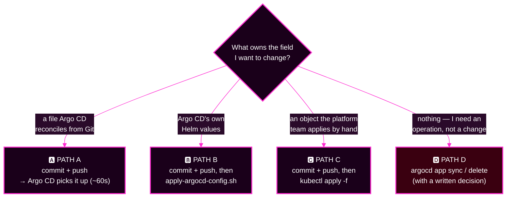

# Capstone · Module 3 — Setup and Rules of Engagement

> **Day 2 · Capstone · Module 3 of 8 · ~10 minutes · do this before the clock starts**
> **Run every command in your VM terminal**, after `source ~/argo-lab-env.sh`.
> **← Back to:** [Capstone](README.md) · [Day 2 map](../README.md)

---

## What are we trying to fix?

**Your workspace, before the incident starts.**

Four clones, one log file, and a clear idea of what you are and are not allowed to do. Ten minutes now saves you from a change you cannot explain later.

---

## 📋 Page TL;DR

- **What this is.** Tools check → four clones → an incident log → the rules → the four ways you may change anything.
- **Why it matters.** A change you did not plan and did not log becomes fault number eight.
- **What to remember.** *Every change goes through Git or declarative configuration.*
- **The most common mistake.** `kubectl edit` on a live object "just to see". Argo CD reverts it and your evidence is gone.

---

## 🎯 Goal of this module

**Leave this page with a working toolkit, a written record of the platform's starting point, and no doubt about what is off limits.**

---

## Before you begin

- The platform must be at checkpoint `CP-capstone` — that is what finishing Lab 5 leaves behind.
- You need the Gitea password (`~/course/credentials/gitea-student.txt`) and the Argo CD admin password (`~/course/credentials/argocd-admin.txt`).
- Do not run anything from module 4 yet. Setup first.

---

## 1. Confirm your tools work

> 🔍 **These prove your tools work. They say nothing about whether the platform is healthy.**

```bash
source ~/argo-lab-env.sh
argocd login localhost:8443 --username admin \
  --password "$(cat ~/course/credentials/argocd-admin.txt)" --insecure
argocd account get-user-info          # expect: Logged In: true, Username: admin
kubectl config get-contexts -o name   # expect: k3d-mgmt and k3d-workload
export HISTTIMEFORMAT='%F %T  '       # your shell history becomes a timeline
```

### Mini TL;DR — section 1

- Log in, confirm both contexts, timestamp your history.
- A green login says nothing about the platform.

---

## 2. Build your incident workspace

**Four clones, in one place.** The first line caches your Gitea password for two hours (username `student`):

```bash
git config --global credential.helper 'cache --timeout=7200'
mkdir -p ~/capstone && cd ~/capstone
for repo in storefront-gitops platform-config platform-components team-a-apps; do
  git clone -q "http://lab-gitea:3000/course/${repo}.git"
  git -C "${repo}" config user.name  "Student"
  git -C "${repo}" config user.email "student@lab.local"
done
```

**Record where every repository stood when the incident started.** You will compare against this at the end of phase 2:

```bash
cd ~/capstone
for repo in storefront-gitops platform-config platform-components team-a-apps; do
  printf '%-20s %s\n' "${repo}" "$(git -C "${repo}" rev-parse HEAD)"
done | tee ~/capstone/incident-start-shas.txt
```

### Mini TL;DR — section 2

- Four clones under `~/capstone`, all yours to edit.
- `incident-start-shas.txt` is your "before" photograph of Git.

---

## 3. Create your incident log

One Markdown file holds every table you produce today. Copy this whole block:

```bash
cat > ~/capstone/incident-log.md <<'EOF'
# Incident log — capstone

## Incident-start SHAs
(paste ~/capstone/incident-start-shas.txt here)

## Phase 1: my first move
- Command or screen:
- What I expect to learn (at least 2 possible results, and what each would mean):
- What I actually saw:

## Phase 2: triage grid
| # | Symptom (as observed) | Where I saw it | Station | Area | Hypothesis | Planned change |
|---|---|---|---|---|---|---|
| S1 | | | | | | |

## Phase 2: area coverage
| Area | Evidence I checked | Verdict (healthy / broken / cannot tell yet) |
|---|---|---|
| PLAT argo cd platform components | | |
| CONN workload cluster connectivity | | |
| SRC  application source rendering | | |
| GEN  application generation and ownership | | |
| POL  deployment policy (permissions) | | |
| RUN  workload runtime health | | |

## Phase 3: change log
| # | Time | What I changed (SHA or command) | Path | Why (grid rows) | Evidence before | Predicted | Evidence after |
|---|---|---|---|---|---|---|---|
| C1 | | | | | | | |

## Phase 4: verification
(paste capstone-check.sh output here)

## Phase 5: reflection
EOF
nano ~/capstone/incident-log.md
```

> 💡 **Write in it while you work, not afterwards.** Nobody reconstructs an accurate timeline at 01:25.

---

## 4. The incident-start picture

Open `https://localhost:8443` and look at the **Applications** page. That is the platform at the moment the incident began.

**A healthy platform looks like this — eight tiles, two green badges each:**

```text
┌──────────────────────────────┐  ┌──────────────────────────────┐
│ storefront-dev-workload      │  │ platform-root                │
│ 🟢 Synced      🟢 Healthy    │  │ 🟢 Synced      🟢 Healthy    │
└──────────────────────────────┘  └──────────────────────────────┘
        …eight of these, no warning icons, no yellow, no red…
```

**Yours will not.** Read what is actually on your screen.

### 🔍 What should I notice?

1. **Read each tile's two badges separately.** `Synced` and `Healthy` answer different questions.
2. **Look for patterns across tiles.** Do the broken ones share a repository? a cluster? a project? a writer?
3. **Count the tiles.** Eight is correct. More means something generated Applications nobody asked for. Fewer means something is missing.
4. **Compare with the known-good inventory** in the [capstone README](README.md#the-healthy-platform--your-restoration-target).

> 🔑 **A shared symptom points at a shared dependency**, not at several coincidences.

> ⚠️ **Common mistake:** opening the reddest tile first. The reddest tile is often a shadow. Count and group before you click.

### Mini TL;DR — section 4

- The Applications page is your station 0.
- Read badges separately, look for shared dependencies, count the tiles.
- Do not click into anything yet.

---

## 5. Rules of engagement

A change is **controlled** when all four are true:

1. ✅ a row in your triage grid justifies it;
2. ✅ it goes through one of the four change paths (section 6);
3. ✅ you wrote down the observable result you expect **first**;
4. ✅ it is in your change log, with evidence before and after.

Anything else is **uncontrolled**.

### 🔴 Off limits

| Off limits | Why |
|---|---|
| `kubectl edit / patch / scale / delete` on live objects Argo CD manages, or UI live-manifest edits | Argo CD may revert you, and you have destroyed the evidence |
| Restarting or deleting pods "to see what happens" | A restart is an intervention, not a diagnosis |
| Removing finalizers by hand | Skips Argo CD's clean-up and can orphan resources |
| Force-pushing, `git reset` on `main`, rewriting history | Git is your audit trail. Undo with `git revert` |
| **Widening** a guardrail (AppProject, Argo CD RBAC, Kubernetes RBAC) beyond its designed state | Trades an outage for a security hole. *Restoring* a guardrail is allowed; loosening past it is not |
| Turning off auto-sync or self-heal to stop a symptom | Silence is not repair |
| Running `reset-lab.sh` in **any** form, including `--verify-only` | It compares against a stored answer key, and without the flag it erases the whole incident |
| Running `capstone-check.sh` before phase 4 | It is the scoreboard, not an instrument |
| Opening the course tooling's scripts or `cp-*` tags | That is the answer key |

### 🟢 Always allowed

- Every read-only command in [module 4](04-evidence-toolbox.md).
- **Refresh** and **hard refresh** — note in your grid when you hard-refresh, because it discards cached rendering.
- Reading Git history, in your clones or in the Gitea web UI.

### ⚠️ Deletes need a written decision first

A delete is controlled only if you first wrote down **what it removes**:

| Form | What goes |
|---|---|
| `argocd app delete <app> --cascade=false` | the Application object **only**; the running workload stays |
| `argocd app delete <app>` (the default) | the Application object **and every resource it manages** 🔴 |

A delete can also arrive **through Git** — a root that no longer lists a child will prune it. Make the same written decision before you push.

> 🔒 **Credentials stay hidden.** Never print, commit, or paste a token or password. Inject them at apply time.

### ✅ Key Takeaways — the rules

- Controlled = justified, one of four paths, predicted, logged.
- Restoring a guardrail is repair. Widening one is a new incident.
- Silence is not repair: never fix a symptom by switching off the thing that reports it.

---

## 6. The four change paths — the only ways to change anything



| Path | Use it for | How | What to log |
|---|---|---|---|
| **A · Git commit** | anything Argo CD reconciles from Git: charts, values, env files, Application files a root syncs | edit in `~/capstone/<repo>`, `git commit`, `git push`; undo with `git revert <sha>` + push | the commit SHA |
| **B · Argo CD's own config** | settings in `platform-config/argocd/values.yaml` | commit + push, then `apply-argocd-config.sh` | SHA + the time the wrapper finished |
| **C · A declarative file applied with `kubectl`** | AppProjects, top-level Applications, ApplicationSets, repo and cluster Secrets, workload RBAC | commit + push first, then `kubectl --context <ctx> apply -f <file>` | file path + SHA |
| **D · A deliberate Argo CD operation** | a sync, or a delete with a written cascade decision | `argocd app sync <app>` / `argocd app delete <app> --cascade=<true\|false>` | the exact command |

### 🔍 What should I notice? — which objects reconcile, and which are applied

This single distinction explains most "my fix did nothing" moments:

| Object | Reconciled from Git by Argo CD? | So a fix needs… |
|---|---|---|
| Chart, values, env files | ✅ yes | path A |
| Child Applications under a root (`platform-config/apps/*.yaml`) | ✅ yes — the root syncs them | path A |
| **ApplicationSet** (`applicationsets/storefront.yaml`) | ❌ no | path C (**commit *and* apply**) |
| **Top-level Applications** (e.g. `root/platform-root.yaml`) | ❌ no | path C |
| **AppProjects** | ❌ no | path C |
| **Cluster and repository Secrets** | ❌ no | path C |
| **Argo CD's Helm values** | ❌ no | path B |

> ⚠️ **Common mistake:** reverting a commit that changed an ApplicationSet and expecting the platform to follow. Nothing reconciles that object from Git. **The commit records the intent; the apply makes it real.**

### ✅ Key Takeaways — change paths

- **Find the owner first; the path follows.**
- Some objects are reconciled; others are applied. Check before you conclude a fix failed.
- Path D is an *operation*, not a configuration change — and a delete is its sharpest form.

---

## ✅ Success condition for this module

- `~/capstone` holds **four clones** plus `incident-start-shas.txt`.
- `~/capstone/incident-log.md` exists and is open in an editor.
- `argocd account get-user-info` shows you as `admin`.
- You can name, without looking: the four rules, and the four change paths.

---

## 📋 Final TL;DR

- Four clones, one log, one photograph of Git's starting point.
- Controlled change = justified + one of four paths + predicted + logged.
- **Restoring** a guardrail is fine; **widening** one is not.
- Reconciled-from-Git versus applied-by-hand is the distinction that will trip you up.

---

## ✅ Key Takeaways — module 3

- 📝 **Every change goes through Git or declarative configuration.** No hand edits on a live cluster.
- 🗒️ **An unlogged change is an unexplainable change**, and later it looks like a fault.
- 🔴 **Deletes need a written cascade decision before you press enter.**
- 🔎 **`reset-lab.sh` and `capstone-check.sh` are not instruments.** One is the answer key, one is the scoreboard.

**→ Next:** [Module 4 — The evidence toolbox](04-evidence-toolbox.md)
