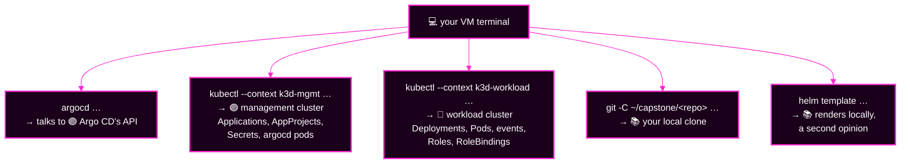

# Capstone · Module 4 — The Evidence Toolbox

> **Day 2 · Capstone · Module 4 of 8 · reference — skim now, return all morning**
> **Run every command in your VM terminal**, after `source ~/argo-lab-env.sh`.
> **← Back to:** [Capstone](README.md) · [Day 2 map](../README.md)

---

## What are we trying to fix?

**Nothing — that is the point.**

Every command on this page **only looks**. You can run any of them, at any time, in any order, without making the incident worse.

---

## 📋 Page TL;DR

- **What this is.** Every safe command, grouped by the six areas, each with the question it answers.
- **Why it matters.** Under pressure people reach for the tool they remember, not the tool that answers their question.
- **What to remember.** *Start every pass at §0 — the whole picture — and only then zoom in.*
- **The most common mistake.** Running a workload command against the management cluster and believing the empty answer.

---

## 🎯 Goal of this module

**Know, for any question you have, exactly which command answers it and which cluster it runs against.**

---

## Before you begin

- `source ~/argo-lab-env.sh` in this terminal.
- Angle brackets like `<app>` mean you substitute a real name.
- If a command hangs, `Ctrl+C` is safe. Retry with `--timeout 30`.

---

## 🗺️ Where does this command run?



> 🔑 **A surprising result is a wrong-context result until proven otherwise.** Check with `kubectl config current-context`.

---

## §0 — The whole picture (start every pass here)

**The question:** *how much is broken, and what do the broken ones share?*

```bash
argocd app list

kubectl --context k3d-mgmt -n argocd get applications \
  -o custom-columns='NAME:.metadata.name,PROJECT:.spec.project,SYNC:.status.sync.status,HEALTH:.status.health.status,LAST-OP:.status.operationState.phase,CONDITIONS:.status.conditions[*].type'
```

The `kubectl` form reads the Application objects **straight from the cluster**, so it keeps working when the CLI or UI is slow.

Then zoom into one app:

```bash
argocd app get <app>                    # source, revision, both statuses, conditions, resources
argocd app get <app> --show-operation   # …plus what the last sync actually did
```

**UI:** the Applications page; click a tile for its tree, summary and conditions.

### 🔍 What should I notice?

- `CONDITIONS` reading `<none>` on a healthy app — its **absence** is information.
- Apps that share a `PROJECT`, a repository, or a destination cluster failing together.
- `SYNC: Unknown` — the comparison never finished, so nothing about that app is trustworthy yet.

### Mini TL;DR — §0

- One command gives you scope; one gives you depth.
- Group before you dive.

---

## 📚 §SRC — Git, history, and rendering *(stations 1–2)*

**The question:** *is the source right, and did manifests come out of it?*

**What changed, across all four repositories:**

```bash
cd ~/capstone
for repo in storefront-gitops platform-config platform-components team-a-apps; do
  echo "=== ${repo} ==="
  git -C "${repo}" log -n 10 --date=relative --format='%h  %ad  %an  %s'
done
```

**One commit in detail, and what Argo CD itself sees:**

```bash
git -C ~/capstone/<repo> show --stat <sha>       # which files
git -C ~/capstone/<repo> show <sha>              # the actual change
git ls-remote http://lab-gitea:3000/course/<repo>.git <revision>   # does that revision exist?
argocd repo list                                 # can Argo CD read the repositories?
argocd app manifests <app> --source git          # what rendering produced
argocd app manifests <app> --source live         # what is actually on the cluster
```

**A second opinion that does not depend on Argo CD** — render the chart yourself with the same Helm the repo-server uses:

```bash
cd ~/capstone/storefront-gitops
helm template storefront charts/storefront -f envs/<env>/values.yaml > /tmp/render-<env>.yaml \
  && echo "render OK"
```

> 💡 **Read that result carefully.** If it renders here but not in Argo CD, the difference is in Argo CD's **inputs**. If it fails here too, the difference is in the **chart or values**.

**To render the exact revision an app is pinned to** (not your clone's `main`):

```bash
git -C ~/capstone/storefront-gitops worktree add /tmp/rev <revision>
helm template storefront /tmp/rev/charts/storefront -f /tmp/rev/envs/<env>/values.yaml > /tmp/render-rev.yaml
git -C ~/capstone/storefront-gitops worktree remove /tmp/rev
```

**UI:** Settings → Repositories; Gitea history at `http://localhost:3000/course/<repo>/commits/branch/main`.

### ✅ Key Takeaways — SRC

- `git log` across **all four** repos is a 20-second command that often names the cause.
- `helm template` is your independent witness.
- **If the desired state looks like deletion, stop before syncing.**

---

## 🔗 §CONN — workload cluster connectivity

**The question:** *can Argo CD reach and authenticate to the workload cluster?*

```bash
argocd cluster list                     # STATUS per registered cluster
argocd cluster get workload             # connection state + last cache sync
kubectl --context k3d-mgmt -n argocd get secrets -l argocd.argoproj.io/secret-type=cluster
kubectl --context k3d-workload get nodes   # is the workload API up, using YOUR credential?
kubectl --context k3d-mgmt -n argocd logs statefulset/argocd-application-controller --tail=300 \
  | grep -i "k3d-workload-server-0" | tail -20
```

> ⚠️ **Two different identities.** Your `kubectl` uses **your admin kubeconfig**. Argo CD uses the **ServiceAccount token in its cluster Secret**. Your `kubectl` working proves the cluster is up — it proves nothing about Argo CD's credential. See [rescue card R3](02-quick-rescue-guide.md#r3--the-two-kinds-of-secret).

> 🔴 **`argocd cluster list` can report `Successful` while the credential is dead.** The controller holds an already-authenticated watch and answers from cache, so a stale token stays hidden until something forces a **fresh** call. To catch that, read the **messages**, not the status:
>
> ```bash
> kubectl --context k3d-mgmt -n argocd logs statefulset/argocd-application-controller --since=10m \
>   | grep -i unauthorized | tail -3
> ```

**UI:** Settings → Clusters, and the cluster's detail panel.

### ✅ Key Takeaways — CONN

- **401 means the identity was not accepted. 403 means the identity was accepted but denied.**
- **A connection status is a measurement with a timestamp.** `Successful` can describe an old connection that still works while new ones fail.
- The word `Unauthorized` in a **sync message or controller log** is stronger evidence than any connection badge.
- Never print a Secret's contents.

---

## 🏭 §GEN — generation and ownership

**The question:** *which Applications exist, and who wrote each one?*

```bash
argocd appset list

kubectl --context k3d-mgmt -n argocd get applicationset storefront \
  -o jsonpath='{range .status.conditions[*]}{.type}={.status}: {.message}{"\n"}{end}'

argocd appset generate ~/capstone/platform-config/applicationsets/storefront.yaml -o wide

kubectl --context k3d-mgmt -n argocd get applications \
  -o custom-columns='NAME:.metadata.name,GENERATED-BY:.metadata.ownerReferences[0].name,TRACKED-BY:.metadata.annotations.argocd\.argoproj\.io/tracking-id'

argocd app get platform-root -o tree
```

**How to read the ownership columns:**

| Column | What it means |
|---|---|
| `GENERATED-BY` | the **ApplicationSet** that generated this Application |
| `TRACKED-BY` | the tracking annotation Argo CD writes on everything it applies; its first part names the Application (or root) that applied it |
| **both empty** | a person applied this object directly. **Nothing reconciles it from Git.** |

> 💡 **`argocd appset generate` is a preview.** It reads a file and prints what *would* be generated. It applies nothing. Safe at any time.

> 🔍 **Ownership is a measurement too.** Read it twice, a few minutes apart. An owner that changes between readings is evidence of two writers fighting.

### ✅ Key Takeaways — GEN

- Count the Applications first; **eight** is correct.
- Every object should have exactly **one** owner, stable across readings.
- **A healthy parent does not automatically mean every child is healthy.**

---

## 🚪 §POL — permissions and the four gates

**The question:** *did something refuse this change, and which of the four gates was it?*

```bash
argocd proj list
argocd proj get <project>

kubectl --context k3d-mgmt -n argocd get applications \
  -o custom-columns='NAME:.metadata.name,LAST-OP:.status.operationState.phase,MESSAGE:.status.operationState.message'

argocd admin settings rbac can <subject> <action> <resource> <object>   # order: subject action resource object

for ns in storefront-dev storefront-staging storefront-prod platform-system team-a; do
  printf '%-20s ' "${ns}"
  kubectl --context k3d-workload auth can-i create deployments.apps -n "${ns}" \
    --as=system:serviceaccount:argocd-access:argocd-manager
done

kubectl --context k3d-workload auth can-i create clusterroles.rbac.authorization.k8s.io \
  --as=system:serviceaccount:argocd-access:argocd-manager      # expect: no

kubectl --context k3d-workload -n <ns> get roles,rolebindings
```

**Read any denial against these four signatures:**

| The message contains | Gate | Did a sync start? | Fix lives in |
|---|---|---|---|
| `permission denied` | 1 · Argo CD RBAC | ❌ no | `policy.csv` (🟣 mgmt) |
| `is not permitted in project` | 2 · AppProject | ❌ no | the AppProject (🟣 mgmt) |
| `401`, cluster unreachable | 3 · cluster Secret | ❌ no | the cluster Secret (🟣 mgmt) |
| `forbidden` + `system:serviceaccount:…` | 4 · Kubernetes RBAC | ✅ yes, then failed | Role/RoleBinding (🔵 workload) |

**UI:** Settings → Projects; an Application's sync result panel.

### ✅ Key Takeaways — POL

- **The message names the gate.** The badge never does.
- One question routes you: *did anything on the cluster get touched?*
- `auth can-i` narrows a permission fault to one namespace in seconds.

---

## 🔵 §RUN — comparison, sync results, runtime health *(stations 3–4)*

**The question:** *what genuinely differs, and is the software actually working?*

```bash
argocd app diff <app>; echo "exit code: $?"   # 0 = no diff, 1 = real diff, 2 = could not complete
argocd app history <app>
```

On the **workload** cluster:

```bash
kubectl --context k3d-workload -n <ns> get all
kubectl --context k3d-workload -n <ns> describe deploy <deploy>
kubectl --context k3d-workload -n <ns> get events --sort-by=.lastTimestamp | tail -20
kubectl --context k3d-workload -n <ns> logs deploy/<deploy> --tail=30

for ns in storefront-dev storefront-staging storefront-prod platform-system team-a; do
  echo "=== ${ns} ==="; kubectl --context k3d-workload -n "${ns}" get pods
done
```

**Does the app actually answer?** (storefront namespaces expose a `storefront` Service on 9898)

```bash
kubectl --context k3d-workload -n <ns> port-forward svc/storefront 9898:9898 >/dev/null 2>&1 &
PF_PID=$!; sleep 2; curl -s localhost:9898; echo; kill "${PF_PID}"
```

> 💡 **Refresher.** A Deployment is `Healthy` when enough new Pods pass their **readiness probe** within the progress deadline. A `Progressing` status that never ends is a rollout still waiting for readiness that will never come.

> 🔍 **Every live field has one rightful writer** — Git via Argo CD, a controller such as an HPA, or a person. Ask *which* before you call a difference "drift".

**UI:** a resource node's Summary / Events / Logs tabs; the Diff view; History & Rollback (reading only).

### ✅ Key Takeaways — RUN

- `diff` exit code `2` is not "no difference" — it is "I could not complete the comparison".
- Read Pods on the 🔵 **workload** cluster. Nothing about Pods lives on mgmt.
- A field that flips back and forth has **two** writers. Find the second one.

---

## 🟣 §PLAT — Argo CD's own components *(station 5)*

**The question:** *are the pods that produce all my evidence actually healthy?*

> ⚠️ **The Argo CD UI does not show the health of Argo CD's own pods.** This area is invisible unless you go and look.

```bash
kubectl --context k3d-mgmt -n argocd get pods
kubectl --context k3d-mgmt -n argocd get deploy,statefulset
kubectl --context k3d-mgmt top pod -n argocd
kubectl --context k3d-mgmt -n argocd get events --sort-by=.lastTimestamp | tail -20
kubectl --context k3d-mgmt -n argocd describe pod <pod>
kubectl --context k3d-mgmt -n argocd logs deploy/argocd-repo-server --tail=50
kubectl --context k3d-mgmt -n argocd logs deploy/argocd-server --tail=50
kubectl --context k3d-mgmt -n argocd logs statefulset/argocd-application-controller --tail=50
kubectl --context k3d-mgmt -n argocd logs <pod> --previous --tail=50   # a crashed container's last run
```

**In `describe pod`, read these four fields, in this order:**

| Field | What it tells you |
|---|---|
| `State` | what it is doing now (`Running`, `Waiting: CrashLoopBackOff`) |
| `Last State` → `Reason` | why the previous run ended (`OOMKilled`, `Error`) |
| `Exit Code` | `137` = killed, often out of memory |
| `Restart Count` | read it **twice**, two minutes apart — climbing is the signal |

### ✅ Key Takeaways — PLAT

- **When the evidence stops making sense, look at the thing doing the looking.**
- `Restart Count` means nothing as a single reading; it means everything as two.
- A broken repo-server makes every `ComparisonError` meaningless as a signal about that app.

---

## §Worked — one fully built triage row

This is an incident that is **not** in your capstone (so it spoils nothing): Git became unreachable.

| # | Symptom | Where I saw it | Station | Area | Hypothesis | Planned change |
|---|---|---|---|---|---|---|
| S1 | Many apps sharing one repository: sync `Unknown`, `ComparisonError`, message contains "no such host" | `argocd app get …`; conditions panel | 2 | `SRC` | Argo CD cannot reach the Git host, so nothing renders. **If true**, workloads are fine (no events on the workload cluster) and `argocd repo list` shows that repo failing | restore the host's reachability with the owning team (path A). Verify with `argocd repo list`, then `argocd app get` |

**Why each column is filled the way it is:**

| Column | The rule |
|---|---|
| Symptom | uses **the tool's own words**, and names **every** affected app — a shared symptom is itself evidence |
| Where I saw it | a command you can **re-run**, or a named screen |
| Station | the **first** station that lied |
| Area | where the **cause** lives — not always where the symptom showed |
| Hypothesis | **testable**: it says what else must be true if it is right |
| Planned change | names the **path** and the **verification** |

> 🔑 **The matching change-log row re-runs the same commands for "evidence before" and "evidence after".** That is station 6: verify with the evidence you diagnosed with.

---

## ✅ Success condition for this module

You can answer these three without scrolling: *which command shows me every app's two statuses at once?*, *which cluster do I ask about Pods?*, *which command asks a permission question without changing anything?*

---

## 📋 Final TL;DR

- **§0 first, every pass.** Scope before depth.
- Six areas, six blocks of commands, each with the question it answers.
- `argocd` and `kubectl --context k3d-mgmt` ask 🟣 management. Pods and RBAC live on 🔵 workload.
- Everything on this page is read-only. Nothing here can make the incident worse.

---

## ✅ Key Takeaways — module 4

- 🔍 **Start wide, then narrow.** `argocd app list` before `argocd app get`.
- 🧭 **Name the context in every `kubectl`.** A surprising answer is usually the wrong cluster.
- 🧪 **`helm template` and `argocd appset generate` are second opinions** that do not depend on Argo CD being healthy.
- 👀 **The pods that produce your evidence are evidence too.**

**→ Next:** [Module 5 — The seven fault families and their hints](05-fault-families-and-hints.md)
