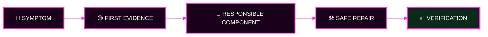
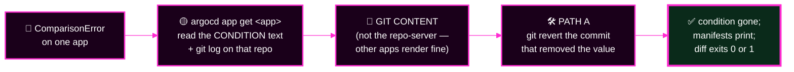
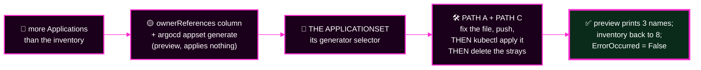
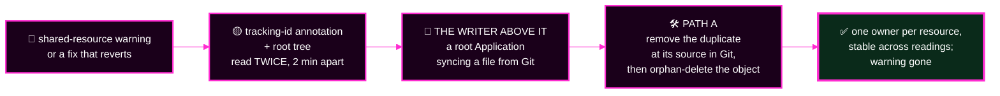
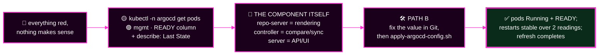
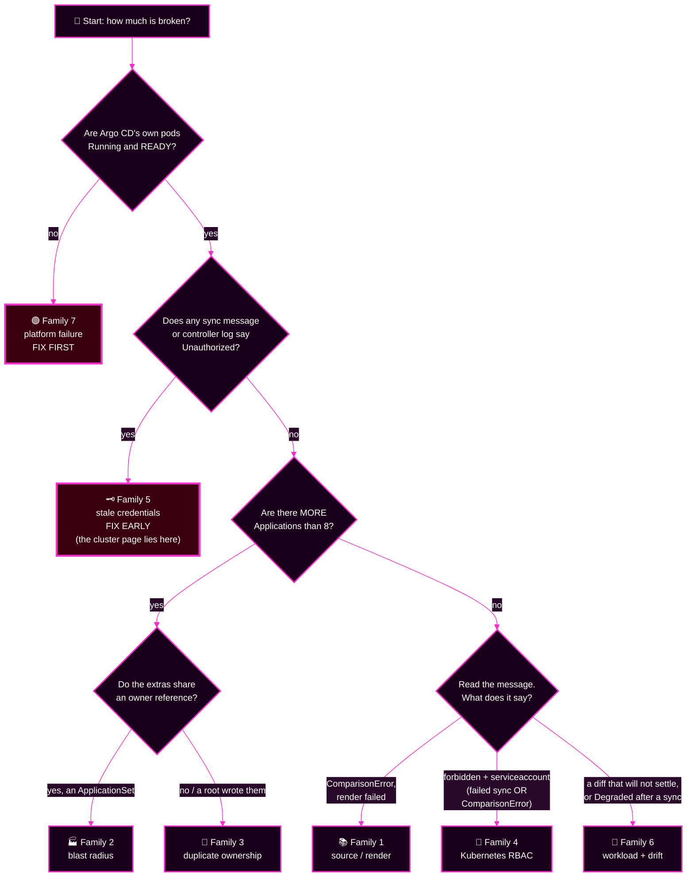

# Capstone · Module 5 — The Seven Fault Families and Their Hints

> **Day 2 · Capstone · Module 5 of 8 · reference — use it when you are stuck**
> **← Back to:** [Capstone](README.md) · [Day 2 map](../README.md)

---

## What are we trying to fix?

**The gap between "I can see something is wrong" and "I know which component owns it."**

Your incident contains seven faults. Each one belongs to a **family**. This page describes the families — what each looks like, what evidence settles it, and what a safe repair looks like.

---

## 📋 Page TL;DR

- **What this is.** Seven fault families, each with a symptom→verification chain, a hint ladder, and a reveal block.
- **Why it matters.** Recognising the *family* in thirty seconds is most of the battle. The specific file is then quick to find.
- **What to remember.** *Symptom → first evidence → responsible component → safe repair → verification.* Same five steps, every time.
- **The most common mistake.** Repairing the symptom's location instead of the cause's location.

---

## 🎯 Goal of this module

**Given any symptom on your screen, name its family and its first evidence command within one minute.**

---

## Before you begin

- Read [module 2](02-quick-rescue-guide.md) first if any of these words are fuzzy: cluster Secret, RoleBinding, AppProject, 401.
- Use the hints **in order**. Rung 3 nearly gives it away, which is deliberate.

> 🔓 **How much help is on this page, on purpose.**
> **Hints 1–3** point you at the right evidence, without naming your specific fault.
> **The 🔓 reveal block** explains the mechanism in full and gives the repair recipe for the family.
> **What stays yours:** *which* file, *which* commit, *which* namespace, and *which* value. The commands in the reveal will show you — you still have to go and look.

---

## 🗺️ The fault-family map

| # | Family | It feels like | Area | Background you need |
|---|---|---|---|---|
| [1](#family-1--source-and-render-failure) | 📚 Source / render failure | "one app went red and its manifests vanished" | `SRC` | Git, rendering, desired vs live state |
| [2](#family-2--applicationset-blast-radius) | 🏭 ApplicationSet blast radius | "there are Applications I never created" | `GEN` | ApplicationSet generators, selectors, previews |
| [3](#family-3--duplicate-ownership) | 👥 Duplicate root/child ownership | "something keeps rewriting this" | `GEN` | Applications, App-of-Apps, ownership, tracking IDs |
| [4](#family-4--kubernetes-rbac-failure) | 🚪 Kubernetes RBAC failure | "`forbidden`, naming a ServiceAccount and one namespace" | `POL` | ServiceAccounts, Roles, RoleBindings, `auth can-i` |
| [5](#family-5--stale-cluster-credentials) | 🗝️ Stale cluster credentials | "a sync says `Unauthorized`, yet the cluster page says `Successful`" | `CONN` | cluster Secret, authentication, 401 |
| [6](#family-6--workload-readiness-and-noisy-drift) | 🔵 Workload readiness + noisy drift | "a diff that will not settle — and syncing it makes things worse" | `RUN` | sync vs health, Deployments, readiness, HPA |
| [7](#family-7--argo-cd-platform-failure) | 🟣 Argo CD platform failure | "everything is red and nothing makes sense" | `PLAT` | Argo CD components, rendering, logs, restarts |

> 🔑 **Families 5 and 7 mask the others.** If either is present, fix it first and then re-read everything.

---

## The shape every family shares



**Five boxes. Every family below is the same five boxes, filled in.**

---

## Family 1 — Source and render failure

> 📚 **Area `SRC`**

**In one sentence.** Git contains something the chart cannot render, so no manifests come out.

**Required background:** Git history, Helm rendering, desired versus live state. *(Rescue cards [R2](02-quick-rescue-guide.md#r2--an-application-is-not-the-workload), [R11](02-quick-rescue-guide.md#r11--how-argo-cd-notices-a-git-change).)*

### What it looks like

- One Application (or a few sharing a repository) shows a `ComparisonError` condition.
- The message quotes a rendering failure, often naming a value.
- `argocd app diff` exits `2` — *could not complete*, which is **not** "no difference".
- The workload itself may still be running happily. Nothing was applied, so nothing broke.



### ⚠️ Dangerous action

> 🔴 **If the desired state looks like deletion, stop before syncing.** A render that produces nothing, or produces far fewer objects than usual, is indistinguishable from an instruction to delete everything. **Never sync your way out of an empty render.**

<details><summary>💡 Hint 1 — where to look</summary>

One app is affected, not all. So the renderer is fine and the **input** is not. Read the app's condition message word for word — Helm usually names the missing value.
</details>

<details><summary>💡 Hint 2 — which command</summary>

```bash
argocd app get <app>                     # read the CONDITION block
argocd app manifests <app> --source git  # does anything come out at all?
git -C ~/capstone/storefront-gitops log -n 10 --format='%h %an %s'
```
</details>

<details><summary>💡 Hint 3 — nearly the answer</summary>

Render it yourself, outside Argo CD, and compare with what the repo-server says:

```bash
cd ~/capstone/storefront-gitops
helm template storefront charts/storefront -f envs/<env>/values.yaml
```

If this fails the same way, the fault is in the **chart or the values file**, and `git log` on that path will show you who changed it and when. `git show <sha>` shows exactly what the commit did.
</details>

<details><summary>🔓 Full answer — the mechanism and the repair</summary>

**Mechanism.** The storefront chart deliberately calls Helm's `required` on `image.tag`, so an environment that has no tag **fails to render** instead of silently deploying `latest`. Remove or blank that value in an environment's `values.yaml` and that environment alone stops rendering. Argo CD reports `ComparisonError`, because it cannot build a desired state to compare against.

**Repair (path A).** Find the commit, revert it, push:

```bash
cd ~/capstone/storefront-gitops
git pull --ff-only
git log -n 10 --format='%h %an %s' -- envs/            # find the offending commit
git show <sha>                                          # confirm what it changed
git revert <sha>                                        # a new commit, never a reset
git push
```

**Why not just edit the value by hand?** You may — a commit that restores the value is equally valid. `git revert` is preferred because it names the commit it undoes, which makes your change log self-explanatory.

**Why not sync?** Syncing cannot help: there is no rendered output to sync.

**✅ Verification.**

```bash
argocd app get <app> --refresh     # CONDITION block should be gone
argocd app diff <app>; echo $?     # expect 0 or 1, never 2
argocd app manifests <app> --source git | head
```
</details>

### ✅ Key Takeaways — family 1

- **One app broken = its own input. Many apps broken = something shared.**
- `diff` exit `2` means *cannot compare*, not *no difference*.
- **If the desired state looks like deletion, stop before syncing.**

---

## Family 2 — ApplicationSet blast radius

> 🏭 **Area `GEN`**

**In one sentence.** A generator's selector matches more than it was meant to, so Applications appear that nobody asked for.

**Required background:** ApplicationSet generators, selectors, generated Applications, previewing before applying. *(Rescue card [R11](02-quick-rescue-guide.md#r11--how-argo-cd-notices-a-git-change) for reconciled-vs-applied.)*

### What it looks like

- The Application count is **higher than eight**.
- The extra Applications follow the naming pattern of a real one, with a different suffix.
- They are often red, and their errors are about destinations or projects — because they were never meant to exist.



### ⚠️ Common mistake

> **Deleting the stray Applications and stopping there.** The factory that produced them is still running, and it will produce them again within a couple of minutes. **Fix the factory first, then clean up its output.**

<details><summary>💡 Hint 1 — where to look</summary>

Ask *who wrote these objects*. An Application generated by an ApplicationSet carries an owner reference naming it.
</details>

<details><summary>💡 Hint 2 — which command</summary>

```bash
kubectl --context k3d-mgmt -n argocd get applications \
  -o custom-columns='NAME:.metadata.name,BY:.metadata.ownerReferences[0].name'

argocd appset generate ~/capstone/platform-config/applicationsets/storefront.yaml -o wide
```

The second one is a **preview**. It applies nothing, and the row count is the answer.
</details>

<details><summary>💡 Hint 3 — nearly the answer</summary>

Compare the ApplicationSet **file in Git** with the **live object**, because one can be changed without the other:

```bash
git -C ~/capstone/platform-config log -n 10 --format='%h %an %s' -- applicationsets/
git -C ~/capstone/platform-config show <sha>

kubectl --context k3d-mgmt -n argocd get applicationset storefront -o yaml | grep -A6 selector
```

A generator selector that matches *everything* generates for every cluster, including the management cluster itself.
</details>

<details><summary>🔓 Full answer — the mechanism and the repair</summary>

**Mechanism.** The `storefront` ApplicationSet uses a matrix of a **cluster generator** and a Git generator. The cluster generator has a label selector that is supposed to match only clusters labelled as workload clusters. **An empty selector matches every registered cluster** — so the factory generates one Application per environment *per cluster*, and the management cluster gets a set too.

**The repair has three parts, and missing any one of them leaves the fault half-fixed:**

```bash
# 1. put the selector back, in Git (path A)
cd ~/capstone/platform-config
git pull --ff-only
git log -n 10 -- applicationsets/ ; git show <sha>
git revert <sha>
git push

# 2. apply the object — NOTHING reconciles an ApplicationSet from Git (path C)
kubectl --context k3d-mgmt apply -f applicationsets/storefront.yaml

# 3. preview before you trust it (read-only)
argocd appset generate applicationsets/storefront.yaml -o wide     # expect 3 rows

# 4. remove what the factory already produced (path D, with a written decision)
argocd app delete storefront-<env>-in-cluster --cascade=false
```

**Why `--cascade=false` here?** The strays never deployed anything — their destination was refused — so there is nothing of theirs to remove. `--cascade=false` deletes the Application object only and cannot touch a workload. **Write that reasoning in your log before you run it.**

**Why do the strays not disappear on their own?** The ApplicationSet's sync policy is `create-update`, which deliberately means *the controller never deletes what it generated*. That is a safety feature; the cleanup is yours to do on purpose.

**✅ Verification.**

```bash
argocd appset generate applicationsets/storefront.yaml -o wide       # exactly 3 rows
kubectl --context k3d-mgmt -n argocd get applicationset storefront \
  -o jsonpath='{range .status.conditions[*]}{.type}={.status}{"\n"}{end}'   # ErrorOccurred=False
argocd app list                                                      # back to 8
```
</details>

### ✅ Key Takeaways — family 2

- **Preview, count, and name before you apply.** `argocd appset generate` is free.
- **Committing an ApplicationSet does not change it.** Applying it does.
- A `create-update` policy never deletes; cleanup is deliberate.

---

## Family 3 — Duplicate ownership

> 👥 **Area `GEN`** — a second root, and a child that duplicates another child

**In one sentence.** Two Argo CD Applications claim the same live resource, so they take turns rewriting it.

**Required background:** Applications, App-of-Apps, ownership, tracking annotations. *(Rescue card [R2](02-quick-rescue-guide.md#r2--an-application-is-not-the-workload).)*

### What it looks like

- An Application you do not recognise, often with a name very close to a real one.
- A `SharedResourceWarning` condition, or a resource that flips between apps.
- A fix that works, then quietly comes back a minute later.



### ⚠️ Dangerous action

> 🔴 **Do not delete a duplicate with cascade.** The duplicate shares a **live workload** with the legitimate Application. A cascading delete removes that workload — a real outage, caused by your repair. Use `--cascade=false` so only the Application object goes.

<details><summary>💡 Hint 1 — where to look</summary>

**If your fix reverts, you fixed the wrong layer.** Something above the object owns it. Climb the ownership chain.
</details>

<details><summary>💡 Hint 2 — which command</summary>

```bash
argocd app get platform-root -o tree

kubectl --context k3d-mgmt -n argocd get applications \
  -o custom-columns='NAME:.metadata.name,BY:.metadata.ownerReferences[0].name,TRACKED:.metadata.annotations.argocd\.argoproj\.io/tracking-id'
```

An Application with **no** owner reference was applied by a person. An Application that appears inside a root's tree was written **by that root, from a file in Git**.
</details>

<details><summary>💡 Hint 3 — nearly the answer</summary>

If a root wrote it, the child exists because a **file** exists in the repository path that root syncs:

```bash
git -C ~/capstone/platform-config log -n 10 --format='%h %an %s'
git -C ~/capstone/platform-config show <sha> --stat
ls ~/capstone/platform-config/apps/
```

Compare the two Applications' `spec.source` and `spec.destination`. If they are identical, they are fighting over the same live objects.
</details>

<details><summary>🔓 Full answer — the mechanism and the repair</summary>

**Mechanism.** The App-of-Apps root syncs a directory of Application files from Git. Add a file there and a new child Application appears — including one that points at **the same source and the same destination** as an existing child. Both Applications then own the same live Deployment. Each reconciliation, whichever runs last rewrites the tracking annotation, and Argo CD raises a shared-resource warning.

**Repair — order matters (path A, then path D):**

```bash
# 1. remove the duplicate at its SOURCE first, so nothing recreates it
cd ~/capstone/platform-config
git pull --ff-only
git log -n 10 --format='%h %an %s'; git show <sha> --stat
git revert <sha>
git push
argocd app get platform-root --refresh

# 2. only then remove the objects that already exist — WITHOUT cascade
argocd app delete <the-duplicate-child> --cascade=false
argocd app delete <the-extra-root>      --cascade=false
```

**Why this order?** Delete the child first and the root that still lists it simply recreates it — with self-heal on, within a minute. **Remove the reason, then remove the object.**

**Why `--cascade=false` twice?** The legitimate Application still owns the live workload and keeps it running. `--cascade=false` removes only the Argo CD object.

**✅ Verification.**

```bash
argocd app list                                  # exactly 8
argocd app get platform-root -o tree             # only the expected children
kubectl --context k3d-mgmt -n argocd get applications \
  -o custom-columns='NAME:.metadata.name,TRACKED:.metadata.annotations.argocd\.argoproj\.io/tracking-id'
# read it twice, two minutes apart — the owner must not change
```
</details>

### ✅ Key Takeaways — family 3

- **If your fix reverts, you fixed the wrong layer.** Go up.
- **Remove the reason before the object**, or the reason recreates it.
- **A healthy parent does not automatically mean every child is healthy** — and a *duplicate* child may look healthy while doing damage.

---

## Family 4 — Kubernetes RBAC failure

> 🚪 **Area `POL`**

**In one sentence.** Argo CD is allowed to ask, but the workload cluster refuses — and it can refuse a *read* just as easily as a write.

**Required background:** ServiceAccounts, Roles, RoleBindings, Kubernetes RBAC, `kubectl auth can-i`. *(Rescue cards [R4](02-quick-rescue-guide.md#r4--the-argocd-manager-serviceaccount), [R5](02-quick-rescue-guide.md#r5--roles-and-rolebindings), [R6](02-quick-rescue-guide.md#r6--kubectl-auth-can-i), [R8](02-quick-rescue-guide.md#r8--argo-cd-authorization-versus-kubernetes-authorization).)*

### What it looks like

- The message contains **`forbidden`** and `system:serviceaccount:argocd-access:argocd-manager`.
- It names **one namespace**. Other namespaces are fine.
- It may arrive as a **failed sync** *or* as a **`ComparisonError`** reading `Failed to load live state: … cannot get resource …`.

> 🔍 **What should I notice? — a permission fault does not have to look like a sync failure.**
> The Role in these namespaces carries the **read** verbs (`get`, `list`, `watch`) as well as the write ones. Remove the binding and Argo CD cannot even *look*, so the symptom surfaces at comparison time, before any sync is attempted.
>
> That is why several Applications can show it at once: **different resource kinds, different Applications, one namespace.** The shared namespace is the clue, not the shared kind.

```mermaid
%%{init: {'theme':'base','themeVariables':{'background':'#000000','primaryColor':'#1a001a','primaryTextColor':'#ffffff','primaryBorderColor':'#ff2bd1','lineColor':'#ff2bd1','secondaryColor':'#2a0a2a','fontSize':'14px'}}}%%
flowchart LR
    S["🔴 forbidden + serviceaccount<br/>(failed sync OR<br/>ComparisonError)"] --> E["🟡 kubectl auth can-i … --as=…<br/>across all five namespaces,<br/>for GET as well as CREATE"]
    E --> C["🧩 GATE 4 — KUBERNETES RBAC<br/>🔵 on the workload cluster"]
    C --> R["🛠️ PATH C<br/>re-apply the reviewed<br/>RBAC file"]
    R --> V["✅ can-i says yes;<br/>sync succeeds;<br/>app Synced/Healthy"]
    classDef n fill:#1a001a,stroke:#ff2bd1,stroke-width:2px,color:#ffffff;
    classDef ok fill:#0a2a1a,stroke:#ff2bd1,stroke-width:3px,color:#ffffff;
    class S,E,C,R n;
    class V ok;
```



### ⚠️ Dangerous action

> 🔴 **Do not grant `cluster-admin` to make it green.** Restoring the designed permission is a repair. Widening past the design trades an outage for a security hole, and it is off limits here.

<details><summary>💡 Hint 1 — where to look</summary>

Whose words are in the message? A message naming `system:serviceaccount:…` came from **Kubernetes**, not from Argo CD — so nothing in Argo CD's configuration can fix it.

Then ask what the affected Applications share. If it is a **namespace** rather than a repository or a project, you are looking at that namespace's permissions.
</details>

<details><summary>💡 Hint 2 — which command</summary>

```bash
argocd app get <app> --show-operation      # the sync message, if a sync ran
argocd app get <app>                       # the CONDITION block, if it failed at comparison

AS=system:serviceaccount:argocd-access:argocd-manager
for ns in storefront-dev storefront-staging storefront-prod platform-system team-a; do
  printf '%-20s get:%s  create:%s\n' "${ns}" \
    "$(kubectl --context k3d-workload auth can-i get services -n "${ns}" --as=$AS)" \
    "$(kubectl --context k3d-workload auth can-i create deployments.apps -n "${ns}" --as=$AS)"
done
```

One `no` among the `yes`es localises it instantly. **Ask about `get` as well as `create`** — a lost binding takes both.
</details>

<details><summary>💡 Hint 3 — nearly the answer</summary>

In the namespace that answered `no`, look at what exists and what does not:

```bash
kubectl --context k3d-workload -n <namespace> get roles,rolebindings
```

Compare with a namespace that answered `yes`. **A Role with no RoleBinding grants nothing** — check whether the *binding* is what is missing, not the Role.
</details>

<details><summary>🔓 Full answer — the mechanism and the repair</summary>

**Mechanism.** Argo CD authenticates to the workload cluster as `system:serviceaccount:argocd-access:argocd-manager`. Its permissions in each application namespace come from a `Role` plus a `RoleBinding`. Delete the RoleBinding and the Role survives, attached to nobody.

**The Role carries the read verbs too**, so Argo CD loses `get`/`list`/`watch` in that namespace along with the writes. The usual result is therefore *not* a failed sync but a `ComparisonError`:

```text
Failed to load live state: failed to get managed objects: unexpected error getting managed object:
services "storefront" is forbidden: User "system:serviceaccount:argocd-access:argocd-manager"
cannot get resource "services" in API group "" in the namespace "storefront-prod"
```

Every Application that manages anything in that namespace reports its own version of this, naming whichever resource kind it manages. **Several Applications, several resource kinds, one namespace.**

**Repair (path C).** Re-apply the reviewed least-privilege file — do not hand-write a new Role:

```bash
# ⚠️ this changes state: it is the repair, predicted and logged first
kubectl --context k3d-workload apply -f ~/course/lab-files/lab-02/workload-rbac.yaml
```

That file is idempotent: it re-creates what is missing and leaves what is correct alone.

**Then check whether anything still needs a push.** Applications that failed only at comparison recover on their own within a reconciliation cycle. One that failed *mid-sync* will not retry for the same commit, so ask for that one deliberately (path D):

```bash
argocd app sync <app> --timeout 60
```

> ⚠️ **Read the diff before you sync.** If that Application is also carrying a bad release (family 6), a deliberate sync is what finally deploys it. Run `argocd app diff <app>` first, every time.

**✅ Verification.**

```bash
AS=system:serviceaccount:argocd-access:argocd-manager
kubectl --context k3d-workload auth can-i get    services         -n <namespace> --as=$AS  # yes
kubectl --context k3d-workload auth can-i create deployments.apps -n <namespace> --as=$AS  # yes
argocd app get <app>                                             # no CONDITION block
kubectl --context k3d-workload auth can-i create clusterroles.rbac.authorization.k8s.io \
  --as=system:serviceaccount:argocd-access:argocd-manager        # still no — least privilege intact
```

That last check matters: **a repair that also widened the fence is not a repair.**
</details>

### ✅ Key Takeaways — family 4

- **403 means the identity was accepted but denied.** The fix is a permission, never a credential.
- **A Role grants permission. A RoleBinding connects that permission to an identity.**
- Re-apply the reviewed file. Never invent a wider one under time pressure.

---

## Family 5 — Stale cluster credentials

> 🗝️ **Area `CONN`**

**In one sentence.** The token stored on the management cluster is no longer accepted by the workload cluster.

**Required background:** cluster-registration Secret, authentication, 401 errors. *(Rescue cards [R3](02-quick-rescue-guide.md#r3--the-two-kinds-of-secret), [R9](02-quick-rescue-guide.md#r9--401-versus-403).)*

### What it looks like

> 🔴 **This is the hardest fault in the incident to notice, and the reason is worth reading twice.**

- **`argocd cluster list` keeps saying `Successful`.** So does the Clusters page. Argo CD's controller holds an already-authenticated watch on the cluster and serves comparisons from **cache**, so nothing looks wrong at the place you would naturally check.
- The evidence appears the first moment Argo CD has to make a **fresh** call — typically a sync. The message contains the word **`Unauthorized`**:
  `failed to discover server resources for group version apps/v1: Unauthorized`
- **Your own `kubectl` works perfectly** — you are a different identity entirely.
- **The loudest clue comes after you fix it:** the cache rebuilds, and Applications that looked fine suddenly turn `Unknown`/`Missing`, revealing what was hiding behind it.

> 🔑 **`Successful` is a measurement with a timestamp, not a guarantee.** Here it is telling the truth about an old, still-open connection.

```mermaid
%%{init: {'theme':'base','themeVariables':{'background':'#000000','primaryColor':'#1a001a','primaryTextColor':'#ffffff','primaryBorderColor':'#ff2bd1','lineColor':'#ff2bd1','secondaryColor':'#2a0a2a','fontSize':'14px'}}}%%
flowchart LR
    S["🔴 Unauthorized in a SYNC message<br/>(cluster list still says Successful!)"] --> E["🟡 app get --show-operation<br/>+ controller log grep -i unauthorized"]
    E --> C["🧩 THE CLUSTER SECRET<br/>🟣 on the management cluster"]
    C --> R["🛠️ PATH C<br/>re-register: copy the CURRENT<br/>token + CA into the Secret"]
    R --> V["✅ fresh attemptedAt;<br/>no Unauthorized in new messages;<br/>hidden faults now appear"]
    classDef n fill:#1a001a,stroke:#ff2bd1,stroke-width:2px,color:#ffffff;
    classDef ok fill:#0a2a1a,stroke:#ff2bd1,stroke-width:3px,color:#ffffff;
    class S,E,C,R n;
    class V ok;
```



### ⚠️ What this fault hides

> 🟡 **This one is a mask.** While the credential is rejected, Argo CD cannot read live state at all — so *every* other verdict about that cluster is unreliable. **Repair it early, then re-read the whole picture.** Expect new symptoms to appear; they were always there.

<details><summary>💡 Hint 1 — where to look</summary>

Read the **exact word** in the failure message. `Unauthorized` and `forbidden` are different systems saying different things.

And do not trust the Clusters page here: it reports the last connection it measured, which may be an old one that still works.
</details>

<details><summary>💡 Hint 2 — which command</summary>

```bash
argocd app get <app> --show-operation | grep -E "Phase|Message"
kubectl --context k3d-mgmt -n argocd logs statefulset/argocd-application-controller --since=10m \
  | grep -i unauthorized | tail -3
kubectl --context k3d-workload get nodes     # the cluster itself is fine — different identity!
```

`argocd cluster list` will **not** help you find this one. The sync message and the controller log will.
</details>

<details><summary>💡 Hint 3 — nearly the answer</summary>

**401, not 403.** The credential itself is not being accepted, so no Role or RoleBinding will help. The management cluster stores a **copy** of a token that lives on the workload cluster — and a copy goes stale when the original is replaced.

Look at the two halves without printing either:

```bash
kubectl --context k3d-mgmt -n argocd get secret cluster-workload
kubectl --context k3d-workload -n argocd-access get secret argocd-manager-token
```

Compare their **ages**. A token Secret much younger than the cluster Secret tells the whole story.
</details>

<details><summary>🔓 Full answer — the mechanism and the repair</summary>

**Mechanism.** Argo CD authenticates to the workload cluster with a bearer token stored in the `cluster-workload` Secret on 🟣 mgmt. That token is a **copy** of the one Kubernetes minted for the `argocd-manager` ServiceAccount on 🔵 workload. Delete and recreate that ServiceAccount token Secret and Kubernetes mints a **new** token; the old copy is instantly worthless. Every call Argo CD makes then returns `401 Unauthorized`.

**Repair (path C) — copy the current credential into the cluster Secret.** This re-runs Lab 2's registration, without ever printing a secret to your screen:

```bash
cd ~/capstone/platform-config
cat clusters/workload.secret.template.yaml        # placeholders only — safe to read

TOKEN="$(kubectl --context k3d-workload -n argocd-access get secret argocd-manager-token \
          -o go-template='{{ index .data "token" | base64decode }}')"
CA="$(kubectl --context k3d-workload -n argocd-access get secret argocd-manager-token \
      -o jsonpath='{.data.ca\.crt}')"

# ⚠️ this changes state: it is the repair
sed -e "s|<TOKEN>|${TOKEN}|" -e "s|<CA_DATA>|${CA}|" clusters/workload.secret.template.yaml \
  | kubectl --context k3d-mgmt apply -f -

unset TOKEN CA
```

**Why the template?** It already carries the correct `server`, the five managed `namespaces`, and `clusterResources: "false"`. Re-rendering it restores the *scope* as well as the credential. Writing a Secret by hand risks quietly widening the scope.

**If the token Secret on the workload cluster is itself missing or empty**, re-create it first and wait a few seconds for Kubernetes to populate it:

```bash
kubectl --context k3d-workload apply -f - <<'YAML'
apiVersion: v1
kind: Secret
metadata:
  name: argocd-manager-token
  namespace: argocd-access
  annotations:
    kubernetes.io/service-account.name: argocd-manager
type: kubernetes.io/service-account-token
YAML
```

**✅ Verification.** Remember that `Successful` was already being reported while the credential was stale, so it is **not** on its own a proof of repair:

```bash
argocd cluster get workload                       # a FRESH attemptedAt timestamp, not just Successful
argocd app get <app> --show-operation             # no new message containing Unauthorized
kubectl --context k3d-mgmt -n argocd logs statefulset/argocd-application-controller --since=5m \
  | grep -i unauthorized | tail                   # expect nothing new
```

> 🔁 **Now re-read everything, and expect the picture to get worse before it gets better.** Re-registering rebuilds Argo CD's cluster cache with a fresh list call. Applications that looked healthy on stale cache can flip to `Unknown`/`Missing` within a minute. **That is the repair working**, not a new fault you caused — mark those rows "revealed after" your change number.
</details>

### ✅ Key Takeaways — family 5

- **401 means the identity was not accepted. 403 means the identity was accepted but denied.**
- Your `kubectl` working proves the cluster is up. It proves nothing about Argo CD's credential.
- **A connection page can report `Successful` while the credential is dead.** It is describing the last connection it measured.
- **`Unauthorized` in a sync message beats any status badge** as evidence about a credential.
- **401 hides 403.** Until Argo CD can authenticate, it cannot discover what it is not authorized to do.

---

## Family 6 — Workload readiness and noisy drift

> 🔵 **Area `RUN`**

**In one sentence.** The software itself is unwell, and a second writer is changing a field, so the noise hides the real problem.

**Required background:** sync status versus health status, Deployments, Pods, readiness probes, HPA. *(Rescue card [R2](02-quick-rescue-guide.md#r2--an-application-is-not-the-workload).)*

### What it looks like

**Before anyone syncs it** — which is how you will most likely meet it:

- The app is `OutOfSync`, often with a sync error, and it **stays** that way.
- `argocd app diff` shows two things at once: a changed **probe path**, and a **new HorizontalPodAutoscaler** that no other environment has.
- The workload is still **running the old, good release**. Nobody is hurting yet.

**After someone syncs it** — which is the trap:

- Pods go `Running` but `0/1 READY`, with low restart counts: the container is alive, it just never passes readiness.
- The app turns 🔴 `Degraded`, and now users *are* hurting.
- The replica count starts flapping, because the new HPA and Git disagree about `spec.replicas`.

> 🔴 **This is the one fault a sync makes worse.** A pending bad release is a *warning*; deploying it is an *outage*. **Read the diff before you sign it.**

```mermaid
%%{init: {'theme':'base','themeVariables':{'background':'#000000','primaryColor':'#1a001a','primaryTextColor':'#ffffff','primaryBorderColor':'#ff2bd1','lineColor':'#ff2bd1','secondaryColor':'#2a0a2a','fontSize':'14px'}}}%%
flowchart LR
    S["🔴 OutOfSync that will not settle;<br/>diff shows a probe path<br/>+ a brand-new HPA"] --> E["🟡 argocd app diff FIRST<br/>then which revision<br/>is this app pinned to?"]
    E --> C["🧩 THE RELEASE ITSELF<br/>(and a second writer<br/>on spec.replicas)"]
    C --> R["🛠️ PATH A<br/>move the pin back to<br/>the known-good release"]
    R --> V["✅ Pods 1/1 READY;<br/>diff quiet across 2 cycles;<br/>the app answers"]
    classDef n fill:#1a001a,stroke:#ff2bd1,stroke-width:2px,color:#ffffff;
    classDef ok fill:#0a2a1a,stroke:#ff2bd1,stroke-width:3px,color:#ffffff;
    class S,E,C,R n;
    class V ok;
```



### 🔍 What should I notice?

**Two symptoms, one release.** A readiness failure and a replica-count fight look like two faults. Check whether both arrived with the **same change** before you chase them separately.

### ⚠️ Common mistake

> **Adding an `ignoreDifferences` rule to silence the replica noise.** That hides the conflict instead of resolving it, and a whole-resource ignore rule would hide the *real* fault sitting underneath. **Silence is not repair.**

<details><summary>💡 Hint 1 — where to look</summary>

`Synced` and `Healthy` are different questions. This app may be answering "yes" to the first and "no" to the second — which means Git is being applied faithfully and **what Git says is wrong**.
</details>

<details><summary>💡 Hint 2 — which command</summary>

```bash
kubectl --context k3d-workload -n <ns> get pods
kubectl --context k3d-workload -n <ns> describe pod <pod>     # read the Events at the bottom
kubectl --context k3d-workload -n <ns> get events --sort-by=.lastTimestamp | tail -20
argocd app get <app>                                         # which revision is this app pinned to?
```

A readiness probe returning 404 tells you the **path** is wrong, not the image.
</details>

<details><summary>💡 Hint 3 — nearly the answer</summary>

Ask **what revision** the app is deployed from, and whether that revision is a branch or a pinned tag:

```bash
argocd app get <app> | grep -iE 'revision|target'
git -C ~/capstone/storefront-gitops log -n 10 --format='%h %an %s' -- envs/
git -C ~/capstone/storefront-gitops tag
```

If the revision is a **tag**, the bad content may not be on `main` at all — which is why reading `main` shows you nothing wrong. Render the tag itself:

```bash
git -C ~/capstone/storefront-gitops worktree add /tmp/rev <the-tag>
grep -nE 'readinessPath|hpa|minReplicas' /tmp/rev/charts/storefront/values.yaml
git -C ~/capstone/storefront-gitops worktree remove /tmp/rev
```
</details>

<details><summary>🔓 Full answer — the mechanism and the repair</summary>

**Mechanism — two effects, one bad release.**

1. **The readiness path is wrong.** The container starts and stays up, but its readiness probe asks for a path that returns 404, so the Pod never becomes ready. The Deployment passes its **progress deadline** (60 seconds in this chart) without ever becoming available, Kubernetes marks the rollout as failed, and Argo CD reports `Degraded`.
2. **Two writers on `spec.replicas`.** The same release enables an HPA whose `minReplicas` is **higher** than the chart's rendered `replicaCount`. The HPA scales the live Deployment up; Argo CD sees live ≠ Git and reports `OutOfSync`; self-heal writes Git's number back; the HPA scales up again. That is the flapping diff — **noise generated by a genuine ownership conflict, not by Argo CD misbehaving.**

**Why the noise is dangerous.** It is loud, constant, and *not the outage*. Users are affected by the readiness failure, not by a replica count oscillating between two safe values.

**Repair (path A).** The environment is pinned to a release. Move the pin back to the last known-good release:

```bash
cd ~/capstone/storefront-gitops
git pull --ff-only
git log -n 10 --format='%h %an %s' -- envs/     # find the promotion commit
git show <sha>                                   # confirm: it moved targetRevision
git revert <sha>
git push
```

**Why revert the promotion rather than patch the chart?** The bad content lives inside a released, immutable tag. Editing `main` would not change what that tag contains. **Promotion is the thing that changed; promotion is the thing to undo.**

**✅ Verification.**

```bash
argocd app get <app> --refresh                                   # Synced / Healthy
kubectl --context k3d-workload -n <ns> get pods                  # 1/1 READY
argocd app diff <app>; echo $?                                   # quiet, and stays quiet
# wait ~2 minutes and run the diff again — a flapping field is only proved gone by two readings
```

Then confirm the service actually answers:

```bash
kubectl --context k3d-workload -n <ns> port-forward svc/storefront 9898:9898 >/dev/null 2>&1 &
PF_PID=$!; sleep 2; curl -s localhost:9898; echo; kill "${PF_PID}"
```
</details>

### ✅ Key Takeaways — family 6

- **Sync answers "does it match Git?". Health answers "is it working?"** Both can be true at once in the worst way.
- **A field that flips has two writers.** Name the second one before you silence it.
- **Rank by who is hurting**, not by what is loudest.

---

## Family 7 — Argo CD platform failure

> 🟣 **Area `PLAT`**

**In one sentence.** One of Argo CD's own pods is unhealthy, so every badge it produces is unreliable.

**Required background:** Argo CD components, rendering, logs, restarts. *(Rescue card [R1](02-quick-rescue-guide.md#r1--two-clusters-management-and-workload).)*

### What it looks like

- **Many or all** Applications red at once, often with `ComparisonError` or `Unknown`.
- Refreshes are slow, time out, or change nothing.
- The Argo CD **UI shows you none of this**, because it does not report on its own pods.



### ⚠️ What this fault hides

> 🔴 **This is the biggest mask in the incident.** While the renderer is down, *nothing* renders, so every `ComparisonError` on every Application is meaningless as a signal about that Application. **Fix this first, then re-read everything — several "faults" will simply vanish, and new ones will appear.**

### ⚠️ Dangerous action

> **Do not delete or restart the pod to "clear it".** The pod is crashing for a configured reason; a restart destroys the evidence and the crash returns. `describe` it and read `Last State` instead.

<details><summary>💡 Hint 1 — where to look</summary>

Which component does the failing behaviour name? **Rendering → repo-server. Comparing and syncing → application controller. The UI and CLI → server.**
</details>

<details><summary>💡 Hint 2 — which command</summary>

```bash
kubectl --context k3d-mgmt -n argocd get pods            # READY and RESTARTS columns
kubectl --context k3d-mgmt -n argocd describe pod <pod>  # State, Last State, Exit Code, Events
kubectl --context k3d-mgmt -n argocd logs <pod> --previous --tail=50
```
</details>

<details><summary>💡 Hint 3 — nearly the answer</summary>

In `describe`, read **`Last State` → `Reason`** and **`Exit Code`**. `OOMKilled` and exit code `137` mean the container was killed for exceeding its **memory limit** — a *configured* number, not a mystery.

Argo CD's own configuration in this course is Helm values in `platform-config/argocd/values.yaml`, applied by a wrapper. So:

```bash
git -C ~/capstone/platform-config log -n 10 --format='%h %an %s' -- argocd/
git -C ~/capstone/platform-config show <sha>
```
</details>

<details><summary>🔓 Full answer — the mechanism and the repair</summary>

**Mechanism.** Argo CD is installed from a Helm chart whose values live in `platform-config/argocd/values.yaml`. Lower a component's memory **limit** below what the process needs to start, and Kubernetes kills the container during start-up: `OOMKilled`, exit code `137`, then `CrashLoopBackOff`. With the repo-server down, no Application can be rendered, so **every** app reports a comparison failure.

**Repair (path B) — the two-step path, because nothing reconciles Argo CD from Git:**

```bash
# 1. put the value back in Git
cd ~/capstone/platform-config
git pull --ff-only
git log -n 10 --format='%h %an %s' -- argocd/
git show <sha>
git revert <sha>
git push

# 2. apply it — this is what actually changes the cluster
apply-argocd-config.sh
```

`apply-argocd-config.sh` reads `platform-config` `main` from Gitea, so **it deploys what you pushed, not what is in your working copy**. It takes a few minutes and waits for rollouts. Let it finish.

> 💡 **Expect to be logged out.** The wrapper re-stamps the admin password, which ends your sessions. Log in again in the browser and with `argocd login`. That is not a fault.

**Why not `kubectl edit` the Deployment?** Because the next apply of Argo CD's values would overwrite it, your change would be invisible to the next engineer, and it breaks the capstone's second rule.

**✅ Verification.**

```bash
kubectl --context k3d-mgmt -n argocd get pods            # all Running, all fully READY
kubectl --context k3d-mgmt -n argocd get deploy,statefulset
# wait 2 minutes, run it again: RESTARTS must not have climbed
argocd app get <any-app> --hard-refresh                  # a refresh completes promptly
```

> 🔁 **Now re-read the whole picture.** Faults that were masked will surface, and several red badges will clear on their own.
</details>

### ✅ Key Takeaways — family 7

- **When the evidence stops making sense, look at the thing doing the looking.**
- The Argo CD UI is blind to Argo CD's own pods. Use `kubectl` on 🟣 mgmt.
- **Source before platform** — but a visibly crashing component outranks everything.

---

## 🧭 Which family am I looking at? — the 60-second decision tree



---

## ✅ Success condition for this module

Given any red badge on your screen, you can say in one sentence: **which family, which first command, and which cluster that command runs against.**

---

## 📋 Final TL;DR

- **Seven families. Five boxes each:** symptom → first evidence → component → repair → verification.
- **Families 7 and 5 mask the rest.** Fix them first, then re-read.
- **Width tells you a lot:** one app = its own input; one namespace = permission; everything = platform. **But a credential fault hides behind a green connection status** — find that one by the word `Unauthorized`, not by width.
- **Hints 1–3 are free. The reveal is there when you need it.** Using it is not failing.

---

## ✅ Key Takeaways — module 5

- 🔴 **A red symptom is not the same thing as a root cause.**
- 🧩 **Fix the reason before the object**, or the reason will recreate the object.
- ⚠️ **Deletes and guardrail widening are the two ways a repair becomes an incident.**
- ✅ **Verify with the evidence you diagnosed with**, and read a flapping field twice.

**→ Next:** [Module 6 — Phases 1–2: Look and Sort](06-triage.md)
