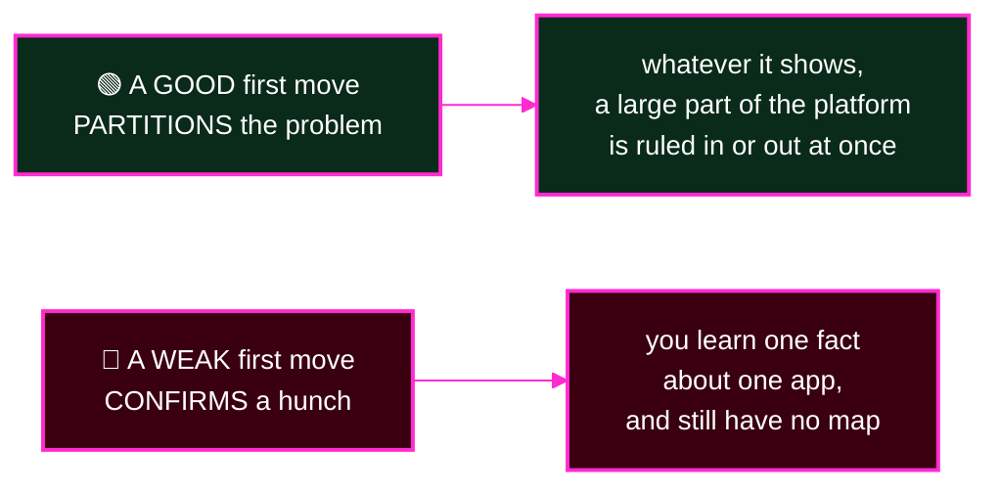
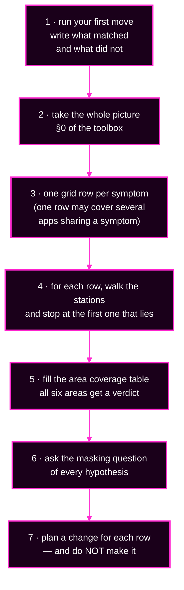

# Capstone · Module 6 — Phases 1–2: Look and Sort

> **Day 2 · Capstone · Module 6 of 8 · work this at 0:00–0:25 · change nothing**
> **Run every command in your VM terminal**, after `source ~/argo-lab-env.sh`.
> **← Back to:** [Capstone](README.md) · [Day 2 map](../README.md)

---

## What are we trying to fix?

**Right now, nothing.** You are building the map that makes the next fifty minutes safe.

By the end of this module you will have a written grid: every symptom, where you saw it, which area it belongs to, and what you believe is causing it — **with no change made to anything.**

---

## 📋 Page TL;DR

- **What this is.** Two read-only phases: **Look** (10 min) and **Sort** (15 min).
- **Why it matters.** People who skip this diagnose the same fault three times. People who do it finish.
- **What to remember.** *Evidence before change.* Your first destructive action should be the fix itself.
- **The most common mistake.** Fixing the first thing you find, at minute four, before you know what else is broken.

---

## 🎯 Goal of this module

**Produce a complete triage grid and an area-coverage table, and pass checkpoint C1 with Git untouched.**

---

## Before you begin

- [Module 3](03-setup-and-rules.md) is done: four clones, `incident-start-shas.txt`, `incident-log.md`.
- [Module 4](04-evidence-toolbox.md) is open in a tab. **Only commands from that module are allowed in this phase.**
- The clock has started.

---

## The five phases, and where you are

| Phase | Minutes | Clock | What you produce |
|---|---|---|---|
| **1 · LOOK** 👀 | 10 | 0:00–0:10 | workspace ready; your first move, written down before you run it |
| **2 · SORT** 🗂️ | 15 | 0:10–0:25 | triage grid + area coverage; checkpoint C1 |
| 3 · FIX 🛠️ | 50 | 0:25–1:15 | change log; each area's sanity check passing |
| 4 · PROVE ✅ | 5 | 1:15–1:20 | `capstone-check.sh` output |
| 5 · LEARN 📝 | 10 | 1:20–1:30 | one reflection block per fault |

*(If your instructor uses the older phase codes, these are P0–P4 in order.)*

---

## Phase 1 · LOOK — your first move (10 min · easy)

**Goal.** Get oriented, and commit **in writing** to the first thing you will look at and what you expect it to tell you.

### Do this

1. Finish [module 3](03-setup-and-rules.md) if you have not: tools, clones, log.
2. Skim [module 4](04-evidence-toolbox.md) — just the headings.
3. In `incident-log.md`, under **"Phase 1: my first move"**, write **one** command or screen you will look at first, plus **at least two different results it could give and what each would mean**.
4. 🔴 **Do not run it yet.** You run it as the first action of phase 2.

### What makes a first move good



**Examples of partitioning questions:** *Is this one Application, a group, or everything?* · *Is this Argo CD or Kubernetes?* · *Do the broken ones share a repository, a cluster, a project, or a writer?*

<details><summary>💡 Hint 1</summary>

Ask whether the trouble is in one Application, a group, or everywhere. What would each of those imply about shared dependencies?
</details>

<details><summary>💡 Hint 2</summary>

Prefer a view that shows several kinds of information at once — source, revision, both statuses, conditions — over one that shows a single fact.
</details>

### ✅ Success criterion — phase 1

- `~/capstone` holds four clones and `incident-start-shas.txt`.
- `argocd account get-user-info` shows you as `admin`.
- Your first-move entry names **one** command or screen and **≥2** possible results with meanings.

### Mini TL;DR — phase 1

- Ten minutes, no diagnosis yet.
- Write the prediction **before** you look. That is what makes the result informative.

---

## Phase 2 · SORT — build the grid, change nothing (15 min · medium)

**Goal.** A complete, evidence-backed picture of what is wrong — and still nothing changed.

> 🔴 **The rule for this phase:** read-only commands from [module 4](04-evidence-toolbox.md), plus Refresh and hard refresh. **No commits, no applies, no syncs, no deletes.**

### Do this, in order



### Your triage grid

| # | Symptom (in the tool's own words) | Where I saw it | Station | Area | Hypothesis (what else must be true?) | Planned change (path + verification) |
|---|---|---|---|---|---|---|
| S1 | | | | | | |
| S2 | | | | | | |
| … | | | | | | |

**One row may cover several Applications** if they share a symptom — list them all. A shared symptom is itself evidence.

### Your area coverage table

Every area gets a verdict, even if the verdict is "cannot tell yet".

| Area | Evidence I checked | Verdict: healthy / broken / cannot tell yet (and why) |
|---|---|---|
| 🟣 `PLAT` argo cd platform components | | |
| 🔗 `CONN` workload cluster connectivity | | |
| 📚 `SRC` application source rendering | | |
| 🏭 `GEN` application generation and ownership | | |
| 🚪 `POL` deployment policy (permissions) | | |
| 🔵 `RUN` workload runtime health | | |

> 💡 **"Cannot tell yet" is a real answer, and often the most useful one.** It usually means something is masking that area — which is exactly what you need to know before choosing what to repair first.

### 🔍 What should I notice?

- **Count the Applications.** More than eight, or fewer, is a fact worth a row on its own.
- **Group before you dive.** Which broken apps share a repository, a project, a destination cluster, or a writer?
- **Which areas have no evidence at all?** That is a blind spot, not a clean bill of health.
- **Is anything `Unknown`?** `Unknown` means the comparison never completed — so treat every other reading about that app as suspect.

### ⚠️ Common mistake

> **Writing "app X is broken" as a symptom.** That is a badge, not a symptom. Write what the tool actually said: the condition type, the message, the exit code, the phase. **The exact words are what identify the family.**

### The shape of a correct result

- Every row cites a **re-runnable command** or a named screen.
- All six areas have a verdict.
- Every hypothesis is **testable** — it says what else would be true if it were right.
- Several rows may share an area, and some areas may honestly read *cannot tell yet*. That is good triage, not failure.

### Mini TL;DR — phase 2

- Grid first, coverage second, masking question third.
- Plan every change; make none.
- Exact words beat paraphrase, every time.

---

### ✅ Key Takeaways — triage

- **One row per symptom, one area per row.** Symptoms that share a dependency share a row.
- **All six areas get a verdict**, and "cannot tell yet" is usually the most informative one.
- **Plan every change; make none.** The plan is what makes phase 3 fast.

---

## 🏁 Checkpoint C1 — grid complete, nothing changed

Confirm all five before you move to phase 3:

1. ✅ Every Application that is not both `Synced` and `Healthy` appears in at least one row.
2. ✅ Every row has evidence and an area.
3. ✅ Every area in the coverage table has a verdict.
4. ✅ You ran nothing outside [module 4](04-evidence-toolbox.md), apart from Refresh.
5. ✅ **Git is untouched since the incident started:**

```bash
cd ~/capstone
for repo in storefront-gitops platform-config platform-components team-a-apps; do
  printf '%-20s %s\n' "${repo}" "$(git -C "${repo}" ls-remote origin refs/heads/main | awk '{print $1}')"
done | diff - incident-start-shas.txt && echo "C1 check: main is unchanged in every repository"
```

**Expected:** exactly one line — `C1 check: main is unchanged in every repository`.

Anything else means `main` moved somewhere. If that was you, write it in your change log honestly (time, what, why, marked *uncontrolled*) and read the "You made an uncontrolled change" row in [module 8](08-troubleshooting-and-close.md).

---

## 💡 Hints for this phase (about method, never about a specific fault)

<details><summary>💡 Hint 1 — I do not know what to look at next</summary>

Which area has **no evidence yet**? Run the cheapest command for it from [module 4](04-evidence-toolbox.md). Two minutes on an unchecked area beats ten more minutes on the one you are stuck in.
</details>

<details><summary>💡 Hint 2 — two of my symptoms might be the same fault</summary>

Ask the masking question of each: *if this were true, which of my other evidence becomes untrustworthy?* Mark every row whose evidence depends on something you have not confirmed.
</details>

<details><summary>💡 Hint 3 — this symptom fits two areas</summary>

Ask: **what single piece of evidence would tell those two apart?** Then go and get exactly that, and nothing else. (Example: *did anything get applied to the cluster?* separates an Argo CD refusal from a Kubernetes refusal in one step.)
</details>

<details><summary>💡 Hint 4 — I recognise the shape but not the cause</summary>

Open [module 5](05-fault-families-and-hints.md) and run its 60-second decision tree. Naming the family gives you the first evidence command for free.
</details>

---

## ✅ Success condition for this module

**Checkpoint C1 passes, with a grid you could hand to a colleague who was not in the room.**

---

## 📋 Final TL;DR

- **Phase 1 is a written prediction.** Phase 2 is evidence, sorted.
- **Read-only, both phases.** No commits, applies, syncs, or deletes.
- **All six areas get a verdict**, including "cannot tell yet".
- **C1 proves Git is untouched** — that is what makes phase 3's changes attributable.

---

## ✅ Key Takeaways — module 6

- 🔍 **Evidence before change.** The first move in an incident is not a fix; it is finding out what is true.
- 🗂️ **Sort every symptom into exactly one area.** A symptom you cannot sort needs more evidence, not more speed.
- 🧠 **Ask the masking question early**, because it decides your *repair* order, which is not your *investigation* order.
- ✍️ **Quote the tool's exact words.** They name the family; your paraphrase does not.

**→ Next:** [Module 7 — Phases 3–5: Fix, Prove, Learn](07-restore-verify-reflect.md)
