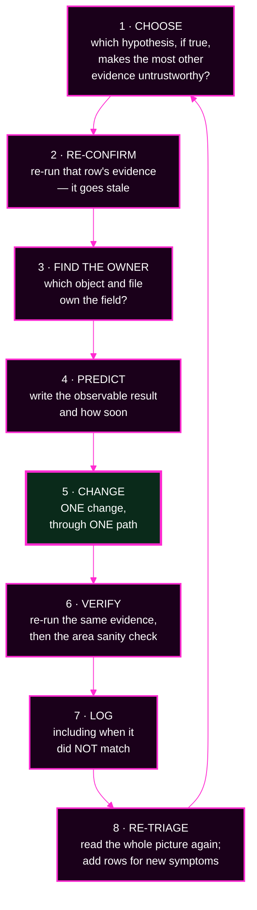
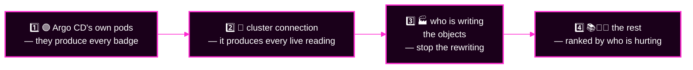
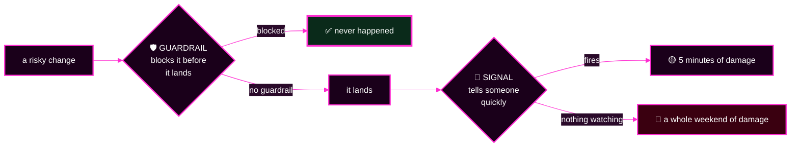

# Capstone · Module 7 — Phases 3–5: Fix, Prove, Learn

> **Day 2 · Capstone · Module 7 of 8 · work this at 0:25–1:30**
> **Run every command in your VM terminal**, after `source ~/argo-lab-env.sh`.
> **← Back to:** [Capstone](README.md) · [Day 2 map](../README.md)

---

## What are we trying to fix?

**Everything — one controlled change at a time.**

You have a grid. Now you turn it into repairs, prove they worked with evidence you did not produce yourself, and turn the incident into something that will not happen twice.

---

## 📋 Page TL;DR

- **What this is.** The repair loop (50 min), the verification run (5 min), and the written reflection (10 min).
- **Why it matters.** A repair that is not verified is a hope, and a repair that is not written down cannot be learned from.
- **What to remember.** *One change, one prediction, one verification, one log row.* Then look at the whole picture again.
- **The most common mistake.** Stacking a second change on top of a surprise. When a result contradicts your prediction, stop and treat the surprise as new evidence.

---

## 🎯 Goal of this module

**Return all six areas to health through controlled changes, prove it with `capstone-check.sh`, and name a guardrail and a signal for every fault.**

---

## Before you begin

- Checkpoint C1 passed: grid and coverage complete, Git untouched.
- [Module 5](05-fault-families-and-hints.md) open — its reveal blocks are your safety net.
- Your change log table ready in `incident-log.md`.

---

## Phase 3 · FIX — the repair loop (50 min · hard)

### The loop, eight steps, repeated per hypothesis



> 🔴 **When a result contradicts your prediction, stop.** Treat the surprise as new evidence and go back to step 2. **Never stack a second change on a surprise** — that is how two faults become five.

### Which repair first? The masking order



**Why this order?** Each earlier box produces the evidence the later ones depend on. Repair out of order and you will "fix" things that were never broken.

> 💡 **If nothing stands out, pick the one that hurts users most.** A red badge nobody is feeling ranks below a service that is down.

### ⏱️ Pacing, and when to stop digging

- **~7 minutes per fault.** Seven faults in fifty minutes is deliberately ambitious.
- **10 minutes on one hypothesis with no new evidence** → climb the hint ladder in [module 5](05-fault-families-and-hints.md).
- **Rung 3 did not help** → **park the row** and take another. Connected faults often unstick each other.
- **Re-read the whole picture at 0:40, 0:55, and 1:10.** Set a timer.

### ✅ Sanity checks — what healthy looks like, area by area

> A sanity check tells you whether an area looks healthy **now**. It does not tell you whether it was ever broken, why, or how to fix it.

**🟣 `PLAT` — Argo CD's own components**

```bash
kubectl --context k3d-mgmt -n argocd get pods
kubectl --context k3d-mgmt -n argocd get deploy,statefulset
```
Every pod `Running` and fully `READY`; every Deployment and StatefulSet reporting all replicas ready; `RESTARTS` **the same in two readings two minutes apart**; a refresh completes promptly.

**🔗 `CONN` — workload cluster connectivity**

```bash
argocd cluster get workload                       # want a FRESH attemptedAt, not just Successful
kubectl --context k3d-mgmt -n argocd logs statefulset/argocd-application-controller --since=5m \
  | grep -i unauthorized | tail
```
A **recent** connection attempt succeeded, and **no new message anywhere contains `Unauthorized`**.

> 🔴 **`Successful` on its own proves nothing here.** Argo CD can report a healthy connection from an old, still-open session while every fresh call is rejected. Check the timestamp and the messages.

**📚 `SRC` — source and rendering**

```bash
for app in $(kubectl --context k3d-mgmt -n argocd get applications -o jsonpath='{.items[*].metadata.name}'); do
  argocd app diff "${app}" >/dev/null 2>&1; echo "${app}  diff-exit=$?"
done
argocd repo list
```
No app carries a `ComparisonError`; every `diff` exits `0` or `1`, **never `2`**; every repository shows `Successful`.

**🏭 `GEN` — generation and ownership**

```bash
argocd app list
argocd appset generate ~/capstone/platform-config/applicationsets/storefront.yaml -o wide
kubectl --context k3d-mgmt -n argocd get applications \
  -o custom-columns='NAME:.metadata.name,BY:.metadata.ownerReferences[0].name,TRACKED:.metadata.annotations.argocd\.argoproj\.io/tracking-id'
```
Exactly the **eight** known-good Applications and no others; the preview prints exactly **three** rows; `ErrorOccurred` is `False`; every object has **one** owner, stable across two readings; no app reports a condition.

**🚪 `POL` — permissions**

```bash
kubectl --context k3d-mgmt -n argocd get applications \
  -o custom-columns='NAME:.metadata.name,LAST-OP:.status.operationState.phase,MESSAGE:.status.operationState.message'
for ns in storefront-dev storefront-staging storefront-prod platform-system team-a; do
  printf '%-20s ' "${ns}"
  kubectl --context k3d-workload auth can-i create deployments.apps -n "${ns}" \
    --as=system:serviceaccount:argocd-access:argocd-manager
done
kubectl --context k3d-workload auth can-i create clusterroles.rbac.authorization.k8s.io \
  --as=system:serviceaccount:argocd-access:argocd-manager
```
Every app's most recent operation ended `Succeeded`; no message contains `permission denied`, `is not permitted in project`, or `forbidden`; **five `yes` and one `no`** — the `no` proves you did not widen anything.

**🔵 `RUN` — workload runtime health**

```bash
argocd app list
for ns in storefront-dev storefront-staging storefront-prod platform-system team-a; do
  echo "=== ${ns} ==="; kubectl --context k3d-workload -n "${ns}" get pods
done
```
All eight apps `Synced`/`Healthy` and **still so across two reconciliation cycles (~2 minutes)**; Pods `Running` and Ready with restart counts that are not climbing; a port-forward returns the normal response.

### ✅ Success criterion — phase 3

For each area, the sanity-check signal is observable **now**; every change went through one of the four paths; nothing off-limits applies.

### Mini TL;DR — phase 3

- Choose by masking, re-confirm, find the owner, predict, change **once**, verify, log, re-triage.
- Fix the maskers first: components, then connection, then writers, then the rest.
- Park a stuck row rather than forcing it.

### ✅ Key Takeaways — the repair loop

- **One change at a time**, or you will not know which one worked.
- **A surprise is evidence**, not an obstacle to push through.
- **Re-read the whole picture after every repair.** The platform moves under you.

---

## Phase 4 · PROVE — run the checker (5 min · easy)

> **▶ Predict first.** Before running it, write down which of the six areas you expect to come back `resolved`.

```bash
capstone-check.sh
echo "exit code: $?"
```

**Expected when everything is restored:**

```text
==> Capstone restoration status by area
  resolved   argo cd platform components
  resolved   workload cluster connectivity
  resolved   application source rendering
  resolved   application generation and ownership
  resolved   deployment policy (permissions)
  resolved   workload runtime health

  ok all areas resolved
exit code: 0
```

An unresolved area prints `unresolved`, the exit code is `1`, and the tool ends with a short **`Next:`** note telling you *where* to look again:

```text
  Next: an unresolved area is a question, not an answer.
        Re-read that area's block in capstone module 4 (the evidence toolbox)
        and re-run its read-only commands. Statuses are measurements: check
        again after a reconciliation cycle (~60s) before you change anything.
```

**The participant output never names a cause.** It tells you which area to return to, never what is wrong with it.

### ⚠️ Green can be false — two checks the tool cannot do for you

`capstone-check.sh` reports whether each area *looks* green. A stale cluster cache looks green: Argo CD is comparing against a picture of the cluster taken some time ago, so a blind comparison passes while the workload is still wrong.

**Check 1 — no resource Argo CD manages should have status `Unknown`:**

```bash
for a in $(kubectl --context k3d-mgmt -n argocd get applications -o jsonpath='{.items[*].metadata.name}'); do
  n=$(kubectl --context k3d-mgmt -n argocd get application "$a" \
        -o jsonpath='{range .status.resources[*]}{.status}{"\n"}{end}' | grep -c '^Unknown$')
  [ "$n" != "0" ] && echo "$a: $n resource(s) with status Unknown"
done
```

**Expect no output.** A transient reading can appear and clear — re-read before acting on it.

**Check 2 — the workload itself matches Git, not just the badge:**

```bash
kubectl --context k3d-workload -n storefront-prod get deploy storefront \
  -o jsonpath='replicas={.spec.replicas} ready={.status.readyReplicas}{"\n"}'
kubectl --context k3d-workload -n storefront-prod get hpa
```

Read the replica count **twice, two minutes apart**. A number that moves between readings means something is still writing that field.

> 💡 **If the tool and your own checks disagree, write the disagreement down** — that sentence is one of the most valuable things in your reflection. A green verifier is a measurement too: ask what it measured, and when.

**Then take the whole picture one last time:**

```bash
kubectl --context k3d-mgmt -n argocd get applications \
  -o custom-columns='NAME:.metadata.name,PROJECT:.spec.project,SYNC:.status.sync.status,HEALTH:.status.health.status,LAST-OP:.status.operationState.phase,CONDITIONS:.status.conditions[*].type'
```

**A fully restored platform prints exactly eight rows, every one `Synced` / `Healthy` / `Succeeded` / `<none>`:**

```text
NAME                          PROJECT      SYNC     HEALTH    LAST-OP     CONDITIONS
platform-agent                platform     Synced   Healthy   Succeeded   <none>
platform-netpol               platform     Synced   Healthy   Succeeded   <none>
platform-quotas               platform     Synced   Healthy   Succeeded   <none>
platform-root                 platform     Synced   Healthy   Succeeded   <none>
storefront-dev-workload       storefront   Synced   Healthy   Succeeded   <none>
storefront-prod-workload      storefront   Synced   Healthy   Succeeded   <none>
storefront-staging-workload   storefront   Synced   Healthy   Succeeded   <none>
team-a-guestbook              team-a       Synced   Healthy   Succeeded   <none>
```

> ✅ **In the UI**, the same state is eight tiles with two green badges each and no warning icons — and **Settings → Clusters** shows `workload` as `Successful` at `https://k3d-workload-server-0:6443`.

### 🔍 What should I notice?

- **`CONDITIONS: <none>`** on every row. A lingering condition is a fault you have not finished.
- **`LAST-OP: Succeeded`**, not `Failed`. A green sync badge with a failed last operation means the failure is older than the current commit — worth a line in your reflection.
- **Run it twice, two minutes apart.** Green that does not hold is not green.

Paste both outputs into your log, compare with your prediction, and **write one sentence explaining any difference.** That sentence belongs in your reflection.

<details><summary>💡 If the checker disagrees with your sanity check</summary>

Re-run the sanity check. Statuses are measurements with timestamps, and reconciliation happens every 60 seconds. If they still disagree, the checker is reading something your check did not — read its area name carefully and go back to that area's toolbox block.
</details>

<details><summary>💡 If the checker will not run at all</summary>

`capstone-check.sh: command not found` almost always means `source ~/argo-lab-env.sh` has not run in this terminal. Do that and retry. **Do not look inside the script** — see [module 8](08-troubleshooting-and-close.md).
</details>

### Mini TL;DR — phase 4

- Predict, run, compare, paste, explain the difference.
- Eight rows, all green, conditions `<none>`, and it holds on a second reading.

---

## Phase 5 · LEARN — the written reflection (10 min · medium)

Group your grid rows into **faults** — one fault = one root cause, however many symptom rows it explains. Name them Fault A, B, C…, and write **one block per fault, seven in total** — including any you did not repair.

```markdown
### Fault A: <short name>
- **Symptom rows it explains:** S_, S_
- **Area:** PLAT / CONN / SRC / GEN / POL / RUN
- **Station where the first real evidence appeared (0-6):**
- **Root cause (1-2 sentences):**
- **Evidence that proved it (command or screen, and what it showed):**
- **Change made (change-log row, and which path):**
- **How I verified it (the sanity-check signal I observed):**
- **What it masked, or what masked it:**
- **Guardrail that would have PREVENTED it (setting/file/policy, and owner):**
- **Signal that would have CAUGHT it sooner (what is observable, and when it fires):**
```

> 💡 **Start each block the moment a repair is verified**, two lines at a time. Ten minutes is not enough to write seven blocks from nothing.

### The difference between a guardrail and a signal



**Ask of every proposal: would this have *blocked* the fault, or only *told* someone sooner?** If it only tells, it belongs on the signal line.

### A catalogue to choose from

**🛡️ Guardrails** (they block): render and preview every environment in CI before merge · treat Argo CD's own configuration as a release · `goTemplateOptions: ["missingkey=error"]` · an ApplicationSet `applicationsSync` policy · `preserveResourcesOnDeletion` · hard-coded `project` plus AppProject destinations · AppProject source, destination and kind restrictions · Argo CD RBAC least privilege with explicit denies · workload-cluster RBAC applied only from a reviewed file · pinned immutable revisions for higher environments · a required review on promotion commits · `FailOnSharedResource=true` · deliberate finalizer and cascade decisions · field-scoped `ignoreDifferences` with a named owner.

**📡 Signals** (they detect): component readiness and restart counts · cluster connection status · an Application that fails to converge for N minutes (**not** every brief `OutOfSync`) · repeated sync failures on the same revision · an ApplicationSet error condition · a count of Applications that differs from the expected inventory · an Application carrying any condition at all · a Deployment that stays `Progressing` past its deadline.

> ⚠️ **"Better monitoring" is not an answer.** Name what is observable, the threshold, and **how long it must persist** before anyone is woken up.

### Closing questions (2–3 sentences each)

1. Which symptom did you diagnose **more than once**, and what was hiding it?
2. Rank your faults by **user impact**, then by **how loud they looked**. Compare the two lists.
3. Did any fix **revert**? What was above the object you changed?
4. Place each fault on the **station** where its first real evidence appeared.
5. **End where you started.** For each fault, say which of Day 1's two questions it first failed — *does it match Git?* or *is it working?* — or whether it broke something underneath both, so neither could be answered honestly.

### ✅ Success criterion — phase 5

Seven fault blocks, every field filled (or an honest "not restored" plus the change you would make), and the five closing answers. **A teammate who was not in the room could read any one block and know what broke, how you proved it, what you changed, and what to do about it next month.**

### Mini TL;DR — phase 5

- One block per fault, seven blocks, started during phase 3.
- Guardrails block; signals tell. Every fault gets one of each.
- Name a threshold and a duration, never "better monitoring".

---

### ✅ Key Takeaways — the reflection

- **One fault = one root cause**, however many symptom rows it explains.
- **A guardrail blocks; a signal tells you sooner.** Every fault deserves one of each.
- **Name the threshold and the duration**, or you have not written a signal.
- **Write it as you go.** Ten minutes is for finishing the blocks, not starting them.

---

## ✅ Success condition for this module

`capstone-check.sh` exits `0`, the eight-row table is green and holds on a second reading, and your log contains a change row for every repair and a reflection block for every fault.

---

## 📋 Final TL;DR

- **Phase 3:** choose by masking, change once, verify with the same evidence, log, re-triage.
- **Phase 4:** predict, then run the checker; green must hold across two readings.
- **Phase 5:** seven blocks, each naming one guardrail and one signal.
- **Green is not the finish line.** The reflection is.

---

## ✅ Key Takeaways — module 7

- 🛠️ **One change, one prediction, one verification, one log row.**
- 🔁 **Re-read the whole picture after every repair** — masked faults appear, and some red badges clear themselves.
- ✅ **Verify with the evidence you diagnosed with**, and read anything flapping twice.
- 🧾 **An incident is not over when it is green. It is over when you can name the guardrail that would have caught it.**

**→ Next:** [Module 8 — When something goes wrong](08-troubleshooting-and-close.md)
