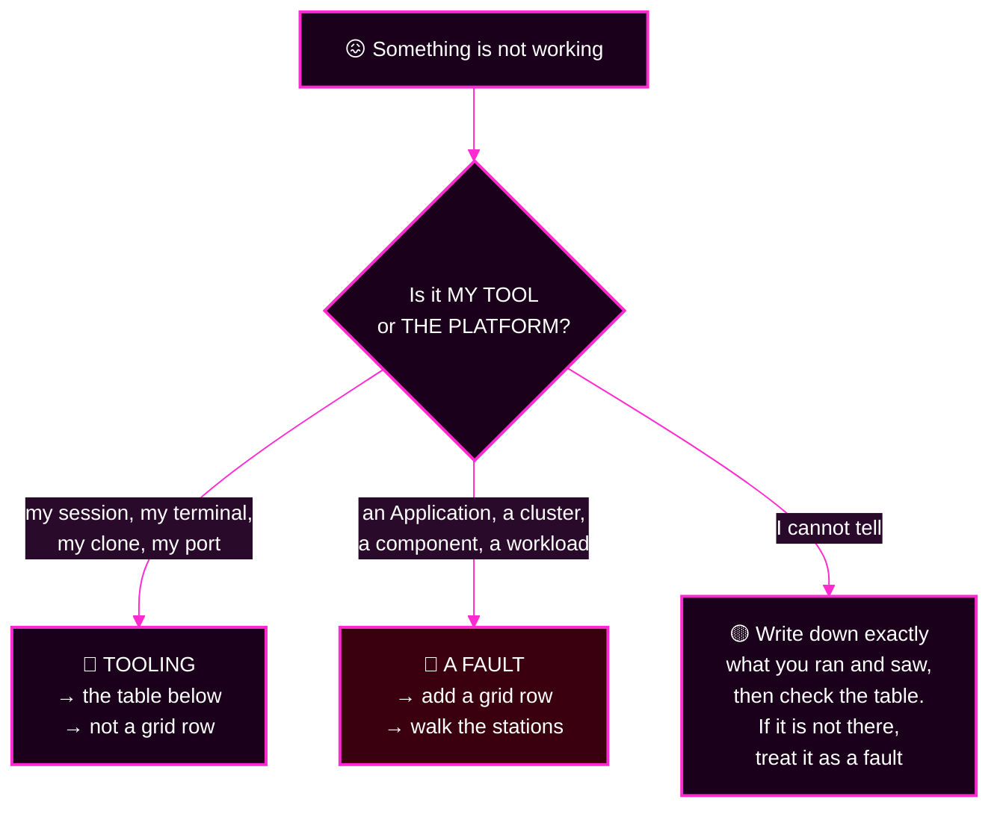

# Capstone · Module 8 — When Something Goes Wrong, and How This Ends

> **Day 2 · Capstone · Module 8 of 8 · reference + close**
> **← Back to:** [Capstone](README.md) · [Day 2 map](../README.md)

---

## What are we trying to fix?

**The tooling, not the platform.**

Everything on this page is a **mechanics** problem — a session, a cache, a port, a typo. **None of these is one of the seven faults.** Recognising that quickly is worth several minutes each time.

---

## 📋 Page TL;DR

- **What this is.** A troubleshooting table, the completion bars, the takeaways, and the close of the course.
- **Why it matters.** Chasing a tooling hiccup as if it were a fault is the most common way to lose ten minutes.
- **What to remember.** *If the tool misbehaves, record it and move on. If the platform misbehaves, that is a fault.*
- **The most common mistake.** Concluding "my fix did not work" before the 60-second Git poll has run.

---

## 🎯 Goal of this module

**Get unstuck in under two minutes, and know exactly what "restored" means.**

---

## Before you begin

- If the platform is behaving oddly, check this page **before** adding a grid row.
- If you made a change you cannot explain, go straight to the last row of the table.

---

## 0. Is this a fault, or is this the tooling?

Ask one question before you add a grid row.

> 💡 **A slow or hanging Argo CD command is the one case that is both.** Record it as evidence *and* work around it — a struggling component is exactly what area `PLAT` is for.

---

## 1. Troubleshooting — mechanics only

| What you see | What is actually happening | What to do |
|---|---|---|
| An `argocd` command hangs or errors while others work | The CLI asks components for answers; a struggling component slows some calls. **Evidence to record**, not a terminal problem | `Ctrl+C`, retry with `--timeout 30`, or read the object directly: `kubectl --context k3d-mgmt -n argocd get application <app> -o yaml` |
| `invalid session` / expired login | Your session ended | Re-run the `argocd login` command from [module 3](03-setup-and-rules.md) |
| After `apply-argocd-config.sh`, the UI **and** CLI log you out | The wrapper re-stamped the admin password, ending every session | Log in again, browser and CLI. Not a fault |
| `apply-argocd-config.sh` takes several minutes | It waits for components to roll out (up to 5 minutes) | ⚠️ **Let it finish.** Interrupting leaves the release half-changed |
| You pushed a fix and Argo CD shows the old state | Git is polled every 60 seconds — **or** that object is applied (paths B/C), not reconciled from Git | Click **Refresh** (`argocd app get <app> --refresh`). If it is an applied object, apply it ([module 3 §6](03-setup-and-rules.md#6-the-four-change-paths--the-only-ways-to-change-anything)) |
| An app still shows a failed sync after you fixed the cause | Auto-sync does not re-attempt a sync that already failed **for the same commit** | Make a deliberate, logged sync (path D): `argocd app sync <app> --timeout 60` |
| Your fix worked, then quietly came back | Something **above** the object owns it and rewrote it | Log it. Find the owner (toolbox §GEN) and change it there. *If your fix reverts, you fixed the wrong layer* |
| A delete never finishes; the app sits in `Deleting` | Its finalizer is waiting for Argo CD to remove managed resources, and something is blocking rendering or reaching the cluster | 🔴 **Do not remove the finalizer by hand.** Record it, find the blocking area, ask your instructor if stuck |
| `git push` rejected, `non-fast-forward` | `main` moved | `git -C ~/capstone/<repo> pull --rebase`, check the result, push. **Never force-push** |
| Git keeps asking for a password | The credential cache expired | Re-run the `credential.helper` line from [module 3](03-setup-and-rules.md); user `student`, password in `~/course/credentials/gitea-student.txt` |
| `kubectl top` says metrics are unavailable | metrics-server needs about a minute of samples | Wait a minute, retry |
| A port-forward fails, `address already in use` | An earlier one is still running | `pkill -f "port-forward"`, or use another local port (`9899:9898`) |
| `capstone-check.sh: command not found` | The course environment is not loaded in this terminal | `source ~/argo-lab-env.sh`, retry. **Do not look inside the script** |
| **You made an uncontrolled change** (or are not sure) | It happens under pressure | 1. **Stop changing things.** 2. Write down exactly what and when, marked *uncontrolled*. 3. If it was a Git commit, undo it with `git revert <sha>` + push — a new, logged commit. 4. For anything else, do **not** hand-undo and do **not** run `reset-lab.sh`; tell your instructor. 5. Carry on with the method |
| Running out of time | Seven connected faults in fifty minutes is ambitious by design | Stop phase 3 on time. Run phase 4 honestly. Spend **all** of phase 5 on the reflection — the minimum bar does not require every area resolved |

### Mini TL;DR — section 1

- Tooling hiccups have tells: sessions, caches, ports, timeouts.
- **A slow or hanging component is evidence** — record it rather than dismissing it.
- 🔴 Never remove a finalizer, force-push, or run `reset-lab.sh`.

---

## 2. What "restored" means

Your platform is **fully restored** when every one of these is observably true:

| ✅ | Criterion | How you know |
|---|---|---|
| ☐ | The checker is green | `capstone-check.sh` reports every area `resolved` and exits `0` |
| ☐ | The inventory is exactly right | eight Applications, all `Synced`/`Healthy`, `CONDITIONS` reading `<none>` |
| ☐ | It **holds** | the same command two minutes later shows the same result |
| ☐ | The cluster is connected | Settings → Clusters shows `workload` `Successful` at `https://k3d-workload-server-0:6443` |
| ☐ | Every change was controlled | four paths, evidence before and after, nothing off-limits |
| ☐ | You did not reach green by hiding evidence | auto-sync and self-heal are on wherever they were before; no guardrail is wider than its design; any ignore rule names a single field and its owner |

### Completion bars

| Bar | What it takes |
|---|---|
| **Minimum** | your reflection names seven faults, each with an evidence-backed area; at least **five** have a verified repair in your change log; all seven have a completed reflection block |
| **Full** | the minimum bar, plus all six criteria above |

> 💡 **Self-check without a solution file.** Every criterion is a command's output, a status on your screen, or a row in your own log. If one fails, the reason is worth a line in your reflection.

### ⚠️ Common mistake

> **Declaring victory on a single green reading.** Reconciliation runs every 60 seconds, and a fault that flaps will be green about half the time you look. **Green that does not hold is not green.**

---

## 3. Optional stretch — after phase 5, outside the timebox

🔴 **Do not apply any of these to the live platform.** They are written and reviewed, not deployed.

1. **A detection rule, written down.** For one fault you found, write exactly what would have to be observed, for how long, before a human is woken — and what the responder should run first. *Success:* a colleague can tell what fires, when, and what to do about it.
2. **A pre-merge check.** Write the script a CI job would run on every pull request: render every environment with `helm template`, then preview the ApplicationSet with `argocd appset generate … -o wide`, extract the name column, compare it with an allow-list, and fail on any extra. *Success:* it exits `0` on today's `main`, and non-zero when you reproduce a problem on a **local, unpushed** branch.
3. **A policy, proven by a test.** Pick a guardrail that would have **blocked** one of your faults. Write it on a local branch of `~/capstone/platform-config` (**do not push**) and prove it offline — `argocd admin settings rbac can … --policy-file` for RBAC, or `argocd appset generate` for an ApplicationSet change. *Success:* a before/after output showing the guardrail refusing the change that caused the fault.

---

## 4. ✅ Key Takeaways — the whole capstone

- 🔍 **The first move in an incident is not a fix; it is finding out what is true.** Triage that changes nothing is what makes every later change safe.
- 🔴 **A red symptom is not the same thing as a root cause.**
- 🎭 **Some faults hide others.** Ask which hypothesis, if true, would make the rest of your evidence untrustworthy — confirm that one early, then look again.
- 👥 **A red badge is not the same as a hurting user.** Triage by who is affected, not by what is loudest.
- 🔁 **If your fix reverted, you fixed the wrong layer.** Find the owner of the field and change it there.
- 👀 **When the evidence stops making sense, look at the thing doing the looking.**
- 🗝️ **401 means the identity was not accepted. 403 means the identity was accepted but denied.**
- 🌳 **A healthy parent does not automatically mean every child is healthy.**
- 🛑 **If the desired state looks like deletion, stop before syncing.**
- 🛡️ **An incident is not over when it is green. It is over when you can name the guardrail that would have caught it.**

---

## 5. Closing the course

On Day 1, Lab 1 asked you to find one Application's status in three places and predict what a single commit would do.

Every fault you met today answers that same question at greater depth: **was this Git, rendering, comparison, sync, health, permissions, or a component?** Those are the stations of the reconciliation pipeline you drew on the first morning. The course has been one idea, examined until it held weight.

You have done what Day 2 promised: reasoned through ApplicationSets and App-of-Apps, enforced platform boundaries, and restored stable service during a realistic incident — with evidence, through Git, and with a written account of what would prevent it happening again.

### What happens next

- Your instructor leads a debrief. **Bring your incident log.**
- The most valuable artefact you produced is the **reflection** — the page that names a guardrail and a signal for each fault.
- Your log lives at `~/capstone/incident-log.md`, and **the VM may be reset after the course.** Copy it somewhere safe before you leave.

---

## ✅ Success condition for this module

You got unstuck in under two minutes, **or** you correctly decided that what you are seeing is a fault and added a grid row for it.

---

## 📋 Final TL;DR

- Tooling problems are not faults; this page names the common ones.
- "Restored" is six observable criteria, not one green screen.
- **Green must hold across two readings.**
- Save your incident log before you close the VM.

This is the last guide in the course. Thank you for working through it with care. 🎉

**← Back to:** [Capstone](README.md) · [Day 2 map](../README.md)
