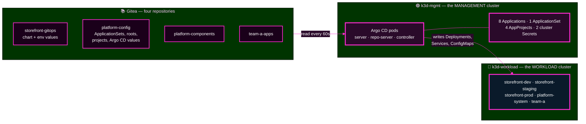
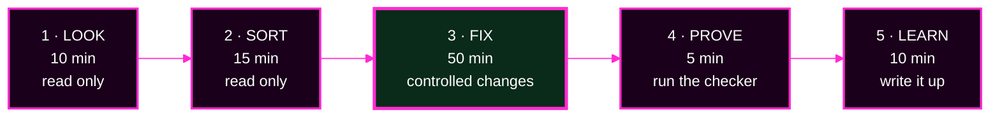

# Capstone — Restore the Platform

> **Day 2 · Capstone · 90 minutes · diagnostic lab**
> **Argo CD `v3.5.2` · Helm chart `10.8.4` · Kubernetes `v1.35` · repo-server renders with Helm `v4.2.1`**
> **← Back to:** [Day 2 map](../README.md)
> **Run every command in your VM terminal**, after `source ~/argo-lab-env.sh`.

---

## What are we trying to fix?

A deployment platform that was healthy on Friday is broken on Monday.

Eight Applications should be green. Several are not. Nobody knows why, and the people reporting it each describe a different symptom.

**Your job:** find out what is true, repair it through Git and declarative configuration, and prove it worked.

---

## 📋 Page TL;DR

- **What this is.** One 90-minute incident with **seven faults** hiding inside it. Some faults hide others.
- **Why it matters.** Real outages are never one clean bug. They are several, tangled, with instruments that lie.
- **What to remember.** *Evidence before change.* And: *a red symptom is not the same thing as a root cause.*
- **The most common mistake.** Chasing the loudest red badge. People who do that diagnose the same fault three times and finish nothing.
- **You will not be graded on remembering Day 1.** Module 2 re-teaches everything you need, with answers.

---

## 🎯 The goal, in one sentence

**Return all eight Applications to `Synced` and `Healthy`, using only controlled changes, and be able to say what broke, how you proved it, and what would have caught it sooner.**

---

## Before you begin

Tick all six. They take two minutes and they prevent an hour of confusion.

| ✅ | Check | How |
|---|---|---|
| ☐ | Two VM terminals open | `source ~/argo-lab-env.sh` in **each** one |
| ☐ | Argo CD UI open | `https://localhost:8443` in Firefox **inside the VM**, logged in as `admin` |
| ☐ | CLI logged in | `argocd account get-user-info` → `Logged In: true` |
| ☐ | Both clusters answer | `kubectl config get-contexts -o name` → `k3d-mgmt` **and** `k3d-workload` |
| ☐ | A text editor open | for your incident log |
| ☐ | You finished Lab 5 | the platform must start at checkpoint `CP-capstone` |

> 🔴 **Do not start until your instructor says the incident has begun.** The 90-minute clock starts then.

---

## 🧠 The mental model: what you are looking after

This is the whole platform on one page. Keep it open.

**Three places, three jobs.** Git **stores** the intent. 🟣 Management **decides and pushes**. 🔵 Workload **runs the software**.

> 💡 **A fault can live in any of the three.** Most of this capstone is deciding *which one* before you touch anything.

---

## The healthy platform — your restoration target

This is what "fixed" looks like. Write it down; you will compare against it all morning.

| What | How many | Names |
|---|---|---|
| Applications, all 🟢 `Synced`/`Healthy` | **8** | `storefront-dev-workload`, `storefront-staging-workload`, `storefront-prod-workload`, `platform-root`, `platform-quotas`, `platform-netpol`, `platform-agent`, `team-a-guestbook` |
| ApplicationSets | **1** | `storefront` |
| AppProjects | **4** | `storefront`, `platform`, `team-a`, `default` |
| Registered clusters | **2** | `workload`, `in-cluster` |
| Argo CD RBAC grants | **1** | `role:team-a` → `team-a-dev` |

**Anything that is not on this list should not exist. Anything missing from it should.**

---

## How the capstone runs: five phases

**Phases 1 and 2 change nothing at all.** That is not caution for its own sake — it is what makes every change in phase 3 safe.

---

## The eight modules

Read modules 1–5 before the clock starts or in phase 1. Work modules 6–7 as the clock runs. Module 8 is your safety net.

| # | Module | What it gives you | When |
|---|---|---|---|
| 1 | [The incident and the mental models](01-the-incident.md) | the story, the badge chain, symptom vs cause, masking | read first |
| 2 | [🛟 Quick Rescue Guide — the Day 1 knowledge you need](02-quick-rescue-guide.md) | two clusters, Secrets, RBAC, gates, 401 vs 403 — **with answers** | read first, keep open |
| 3 | [Setup and rules of engagement](03-setup-and-rules.md) | workspace, incident log, what you may and may not do | before the clock |
| 4 | [The evidence toolbox](04-evidence-toolbox.md) | every safe command, grouped, with where it runs | reference |
| 5 | [The seven fault families and their hints](05-fault-families-and-hints.md) | per-fault chains, hint ladders, reveal blocks | reference |
| 6 | [Phases 1–2 — Look and Sort](06-triage.md) | your first move, the triage grid, checkpoint | 0:00–0:25 |
| 7 | [Phases 3–5 — Fix, Prove, Learn](07-restore-verify-reflect.md) | the repair loop, verification, reflection | 0:25–1:30 |
| 8 | [When something goes wrong](08-troubleshooting-and-close.md) | mechanics troubleshooting, completion bars, close | when stuck |

---

## The four rules

1. 🔍 **Find out what is true before you touch anything.**
2. 📝 **Every change goes through Git or declarative configuration.** No hand edits on a live cluster.
3. 🗒️ **Write everything down:** what you saw, what you changed, what happened next.
4. 🛡️ **When it is fixed, say what would have caught it sooner.**

---

## ✅ Success condition

You are done when **all five** are true:

1. `capstone-check.sh` prints `resolved` for all six areas and exits `0`.
2. Exactly the eight Applications above exist, all 🟢 `Synced`/`Healthy`.
3. They **stay** that way — the same reading two minutes later is identical.
4. Every change you made is in your change log, with evidence before and after.
5. You did not reach green by hiding evidence (auto-sync still on, no guardrail widened).

---

## 📋 Final TL;DR

- **Seven faults, three places** (Git, management cluster, workload cluster), **90 minutes**.
- **Two phases of pure reading come first.** Everything else depends on them.
- **Module 2 is your safety net** — it re-teaches Day 1 with answers, so nothing here depends on your memory.
- **Green is not the finish line.** Naming the guardrail is.

---

## ✅ Key Takeaways

- **A red symptom is not the same thing as a root cause.** The badge tells you *that*, never *why*.
- **Evidence before change.** Your first destructive action should be the fix itself.
- **Source before platform.** Suspect Git and rendering before you suspect Argo CD's own pods.
- **Some faults hide others.** Repair the hiding one early, then look again — new symptoms will appear.
- **You are allowed to not know.** Open the rescue guide, climb the hints, keep moving.

**→ Start:** [Module 1 — The incident and the mental models](01-the-incident.md)
