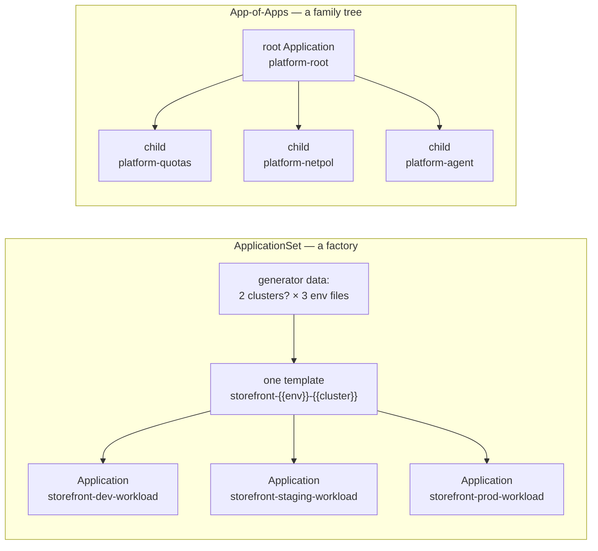
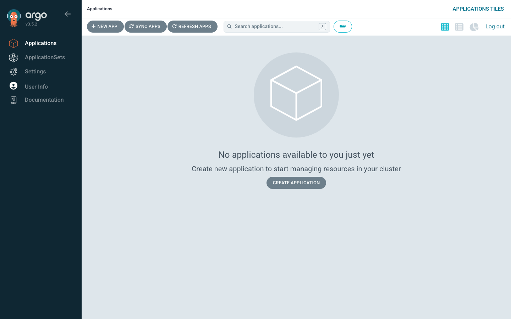
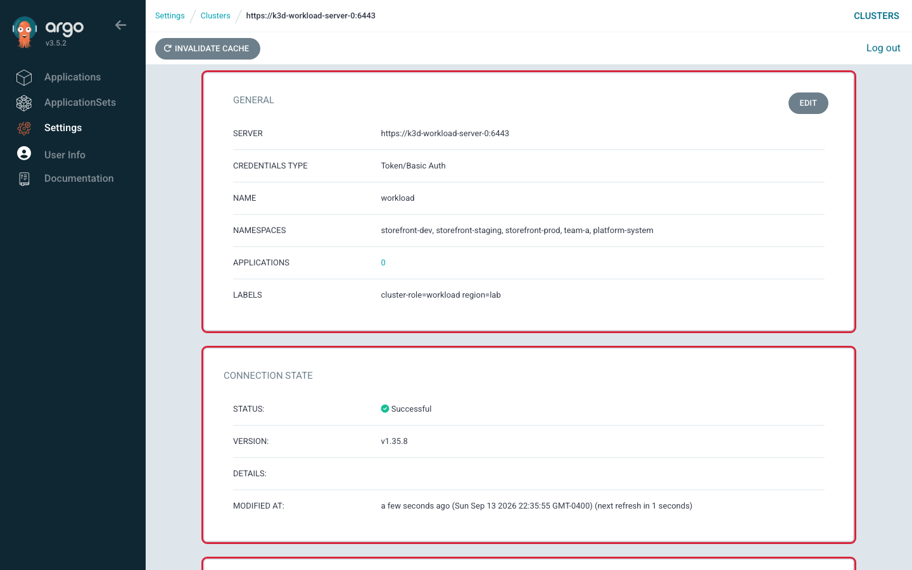

# Lab 4 — Build and Troubleshoot the Patterns

> **Day 2 · Lab 4 · Hands-on lab guide · ~75 minutes**
> **Argo CD version this course targets: `v3.5.2`** (Helm chart `10.8.4`, Kubernetes `v1.35`; the repo-server renders charts with **Helm v4.2.1**).
> **Scaffolding level: G2 (reduced).** Every *new* idea in this lab — how an ApplicationSet generates and owns Applications, the `applicationsSync` protection policy, tracing a failure to the layer that owns it — is explained in full **before** you use it. What is *no longer* re-explained is the Day 1 mechanics you already own: logging in, finding an Application, reading a diff, running `argocd` and `kubectl --context …`. From here on you will often write a command or a manifest change **yourself** before the guide confirms one correct shape.
> **What you need open before you start:**
> - a MATE Terminal window on the VM (virtual machine) desktop (run `source ~/argo-lab-env.sh` in each new one),
> - Firefox inside that same desktop with the Argo CD web interface (`https://localhost:8443`), logged in as `admin` — because Firefox runs on the VM, `localhost` already means the VM and there is no tunnel to start,
> - the `argocd` command line, already logged in as `admin` (confirm with `argocd account get-user-info`),
> - a VM terminal window where you can `git` against your own clones of the `platform-config` and `storefront-gitops` repositories.
>
> **This lab runs on your pre-provisioned course VM.** If you have not completed **Lab 0 — Prepare Your VM for Lab 1**, do that first: it builds the two clusters, Argo CD, Gitea, and reaches the starting checkpoint.

---

## 1. Why this matters

On Day 1 you took **one** application from a Git commit to a running workload and recovered it from two kinds of failure. That skill does not automatically scale. The moment you have three environments — or thirty clusters — hand-writing one `Application` object per target stops being safe: every copy is a place to make a typo, and every typo is a separate incident.

Day 2's two patterns exist to solve exactly that, and each brings its own new failure mode:

- An **ApplicationSet** is a factory: you describe *the shape* of an Application once, feed it data (which clusters, which environments), and it stamps out one Application per combination. The new danger is **blast radius** — one wrong line in the template moves *every* generated Application at once, and one removed label can quietly delete a fleet.
- An **App-of-Apps** is a family tree: one *root* Application owns several *child* Applications, so a single object bootstraps a whole stack. The new danger is **misread ownership** — a root that reports `Healthy` while a child underneath it is broken, and "fixes" applied to the wrong layer that silently revert.

This lab is where you build both patterns against the real storefront application and then deliberately break them — not to watch them fail, but to practise the one skill the Day 2 Capstone grades hardest: **finding the layer that owns a failure before you touch anything.** You will preview before you apply, predict counts and names before you sync, and trace every fault back to the file that caused it.

---

## 2. Learning objectives

By the end of this lab you will be able to:

1. **Generate Helm Applications for multiple target environments** by completing a real ApplicationSet — a *matrix* of a cluster generator and a Git-files generator — and proving with a preview that it produces exactly the Applications you intended (outline bullet **L4.1**).
2. **Use labels and cluster data to control placement** by reading the selector against live cluster labels and previewing how a selector change would move the blast radius, before anything is applied (**L4.2**).
3. **Apply a protection policy that limits unintended Application deletion** with `applicationsSync: create-update` and `preserveResourcesOnDeletion`, then remove a generator input and prove a generated Application *survives* (**L4.3**).
4. **Inspect a root and child Application hierarchy**, tracing each child back to the repository and path it deploys from (**L4.4**).
5. **Introduce a template error and a child-application error and trace each to the owning layer**, telling them apart by *where the evidence appears*, and recover both through Git (**L4.5**).
6. **Compare the operational impact of the same change under each pattern**, scored on operations rather than taste (**L4.6**).

These map to course outcomes **O4** (build and troubleshoot Application, ApplicationSet, and App-of-Apps structures), **O5** (Helm and environment configuration), **O6** (guardrails), and **O7** (diagnosis).

---

## 3. Prerequisites and what earlier guides established

**You should have completed:**

- **All of Day 1 (Labs 1–3).** You can read the two status axes, trace a change through the reconciliation loop, and recover a broken application through Git. You are fluent with `argocd app …`, `kubectl --context …`, and reading a diff.
- **Guide 05 — ApplicationSets and App-of-Apps** (`05-applicationsets-and-app-of-apps.md`). This lab turns that concept guide into muscle memory. Recall its central claims, because you will lean on all of them:
  - **There is no new deployment mechanism today — only a new way of *writing* Applications.** The **application-controller** reconciles a *generated* Application exactly as it reconciles a hand-written one. The **ApplicationSet controller** only creates, updates, or deletes the `Application` objects themselves.
  - **Blast radius is arithmetic:** one template line × N generator items = N simultaneous changes. The habit that keeps it safe is **preview → count → apply**.
  - **The dangerous ApplicationSet bug is a *successful render of the wrong thing*.** `goTemplate: true` plus `goTemplateOptions: ["missingkey=error"]` turns a silent empty value into a loud, local error at generation time.
  - **Three controls bound the factory:** `applicationsSync` (`create-only` / `create-update` / `create-delete`) governs the *Application objects*; `preserveResourcesOnDeletion` governs the *workloads underneath* them.

**Acronyms and terms this lab uses, expanded once here:**

- **ApplicationSet (AppSet):** a Kubernetes Custom Resource (a CRD — Custom Resource Definition — that Argo CD installed) that *generates and owns* many `Application` objects from data.
- **Generator:** the part of an ApplicationSet that produces the data. This lab uses a **cluster** generator (one entry per registered cluster that matches a label selector) and a **Git-files** generator (one entry per file matching a path glob in a Git repo), combined by a **matrix** generator (every cluster crossed with every file).
- **Go template:** the templating language (`{{ .field }}`) Argo CD uses to turn generator data into a finished Application. `missingkey=error` is a strictness option for it.
- **App-of-Apps:** a pattern where one **root** Application's job is to deploy a folder of **child** Application manifests. Deleting the root with *cascade* deletes the children too.
- **RBAC (Role-Based Access Control):** who is allowed to do what. Not the focus of this lab, but the reason `project` stays hard-coded (Section 8).
- **CLI (Command-Line Interface)** and **UI (User Interface):** the `argocd`/`kubectl` commands and the web console at `https://localhost:8443`.

> **Refresher — labels and label selectors (home: Guide 05).** A **label** is a `key: value` tag on a Kubernetes object. A **selector** picks objects by matching labels. In this lab the *cluster* Secrets carry labels (for example `cluster-role: workload`), and the ApplicationSet's cluster generator uses a `matchLabels` selector to decide *which clusters* it generates for. Change the label, or change the selector, and you change the fleet — that is the whole point of Exercise 2.

> **Refresher — two clusters, always name the context (home: Lab 1).** Your VM runs two clusters. `k3d-mgmt` is the **management cluster** where Argo CD and every `Application`/`ApplicationSet` object live (namespace `argocd`). `k3d-workload` is the **separate workload cluster** where the storefront runs. Every `kubectl` command in this lab names its context with `--context k3d-mgmt` or `--context k3d-workload`. A surprising result is a wrong-context result until proven otherwise.

---

## 4. Mental model recap (short — Guide 05 taught this)

Hold two pictures in your head for the whole lab. They are different shapes on purpose.

**The ApplicationSet is a factory.** You write one template and hand the factory a list of inputs. It stamps out one `Application` per input and keeps them matching the template. You never write the individual Applications; you write the *thing that writes them*. So when a generated Application is wrong, the question is never only "what is wrong with this Application?" but "**what is wrong with the factory that produced it?**"

**The App-of-Apps is a family tree.** One root Application points at a folder of child Application manifests and deploys them. The root's *health* answers "did I successfully apply the child objects?" — **not** "are the children themselves healthy?" Those are two different questions one level apart, which is exactly the trap in Exercise 5B.

**The same controller reconciles both.** A generated Application and a child Application are ordinary `Application` objects. The application-controller renders and syncs them identically to Day 1's hand-written `storefront-dev`. Nothing about *running* the app changed today — only *who wrote the Application object* changed. That single fact localises every failure: **is the Application wrong, or is the thing that wrote the Application wrong?**



---

## 5. Environment check — confirm you are starting from "healthy"

Your starting state is checkpoint **`CP-lab-04`**: Day 1's hand-made storefront Applications and `hello-reconcile` have been removed on purpose (the Day 2 reset discards Day 1 participant work — the `cp-lab-04` Git tag preserves the answers). The `storefront` and `platform` AppProjects exist, the workload cluster is registered and labelled, and the ApplicationSet skeleton plus the App-of-Apps files are staged in Git, waiting for you.

### 5.1 Run the verifier (it changes nothing)

In a MATE Terminal window on the VM desktop, first run `source ~/argo-lab-env.sh` (do this in every new VM terminal so the pinned `kubectl`, `helm`, `argocd`, and the course scripts are on your `PATH`). Then run:

```bash
reset-lab.sh CP-lab-04 --verify-only --local
```

The `--verify-only` flag prints a PASS/FAIL table **without changing anything**.

**Expected output** *(representative — confirm against the live classroom environment):*

```text
==> Verification for CP-lab-04
  PASS  Application hello-reconcile absent
  PASS  Application storefront-dev absent
  PASS  AppProject storefront present
  PASS  AppProject platform present
  PASS  Secret in-cluster present
  PASS  Secret repo-storefront-gitops present
  PASS  Secret cluster-workload present
  PASS  Secret course-repo-creds present
  PASS  workload namespace storefront-prod present
  PASS  workload SA argocd-manager present
  PASS  workload RoleBinding argocd-deployer (storefront-prod) present

PASS CP-lab-04 is in the expected state.
```

If any row says **FAIL**, run `reset-lab.sh CP-lab-04 --local` (without `--verify-only`) to restore the checkpoint. **Warning:** a full reset discards any lab work you have not committed and pushed.

### 5.2 Confirm the starting picture in the UI

Open the Argo CD UI. The Applications list should be **empty of any `storefront` Application** — no `storefront-dev`, no generated apps yet. That absence *is* the correct starting state; you are about to create them with a factory.



*Figure SS-L4-01 — Argo CD v3.5.2 Applications view at checkpoint `CP-lab-04`. There are no `storefront-*` Applications and no `platform-root` yet — a clean slate for the patterns you build in this lab.*

**What to notice:**
1. No tile whose name starts with `storefront-`. If you see one, you are not on `CP-lab-04`; re-run the verifier.
2. No `platform-root` tile yet either — you apply that in Exercise 4.
3. The AppProjects `storefront` and `platform` already exist (Settings → Projects), even though no Applications use them yet.

<!-- CAPTURE-SPEC: SS-L4-01 — Argo CD Applications list, environment check. State: checkpoint CP-lab-04 (reset-lab.sh CP-lab-04), logged in as admin, route /applications. Highlight: an empty/clean Applications list with no storefront-* or platform-root tiles. Fidelity: full page. Argo CD v3.5.2. -->

---

## 6. Guided preview workflow — the rhythm for the whole lab

Before the first Exercise, install the habit that makes everything else safe: **preview → count → apply.** Never let an ApplicationSet create anything you have not first *previewed and counted*.

### 6.1 The data the factory selects on: cluster labels

The ApplicationSet you complete in Exercise 1 chooses clusters by label. Look at what labels the registered clusters actually carry:

```bash
kubectl --context k3d-mgmt -n argocd get secret \
  -l argocd.argoproj.io/secret-type=cluster \
  -o custom-columns='NAME:.metadata.name,ROLE:.metadata.labels.cluster-role,REGION:.metadata.labels.region'
```

**Expected output** *(representative — confirm live):*

```text
NAME               ROLE         REGION
cluster-workload   workload     lab
in-cluster         management   <none>
```

Two clusters are registered. The **workload** cluster (where the storefront belongs) is labelled `cluster-role=workload`. The **management** cluster (where Argo CD itself runs) is labelled `cluster-role=management`. A cluster generator with a `matchLabels: {cluster-role: workload}` selector therefore matches **exactly one** cluster — the workload one — and deliberately excludes the management cluster. That is how you keep application workloads off the control plane.

You can also see the same labels in the UI under **Settings → Clusters → `workload`**.



*Figure SS-L4-02 — Argo CD v3.5.2 cluster detail for `workload`, showing the labels `cluster-role: workload` and `region: lab`. These label values are the data the ApplicationSet's cluster generator selects on.*

**What to notice:**
1. `cluster-role: workload` — the exact value your selector must match.
2. `region: lab` — a second label you will experiment with in Exercise 2.
3. The management cluster's `cluster-role: management` value is what a `workload` selector *excludes*.

<!-- CAPTURE-SPEC: SS-L4-02 — Argo CD cluster detail, labels panel. State: CP-lab-04, route Settings → Clusters → workload. Highlight: labels cluster-role=workload and region=lab. Fidelity: panel. Argo CD v3.5.2. -->

### 6.2 Preview is a command, not a leap of faith

The dependable, portable way to preview an ApplicationSet is the CLI:

```bash
argocd appset generate <path-to-appset-file> -o wide
```

`argocd appset generate` renders the Applications the ApplicationSet *would* produce and prints them. **It creates nothing.** It reads the Git-files generator's repository and the live cluster labels server-side, so its output is the real fan-out — the same list the controller would create if you applied the file. You will run this before every apply in this lab. Add `-o yaml` to inspect a full generated Application, or `-o wide` for a one-line-per-app table.

There is also a server-side equivalent, `argocd appset create --dry-run -o yaml <file>`, and an **Alpha** Preview tab in the web UI. Treat those as "you can also"; the CLI `argocd appset generate` is the **required** path in this lab because it is stable and scriptable.

> **The rhythm, stated once:** for every ApplicationSet change you make today — completing it, broadening a selector, breaking a key — you will **(1) preview** with `argocd appset generate`, **(2) count and name** what it would produce, then **(3) apply** only if the count and names match your prediction. If preview surprises you, you caught a mistake for free.

---

## 7. Exercises

Work these in order; each builds on the last. Predict before you preview, and preview before you apply — every time.

### Exercise 1 — Complete the storefront factory (L4.1) · ~15 min · Core

**Goal in plain language.** The file `applicationsets/storefront.yaml` in your `platform-config` clone is a **skeleton with five TODOs**. Fill them in so the ApplicationSet generates one Application per environment on the workload cluster, preview to confirm it produces exactly the three you expect, then apply it.

**Starter state.** The skeleton is already staged at `CP-lab-04`. Open it and read the comments — every TODO says which Lab-4 field it is and what it must become. It already fixes the two things you must *not* change: `goTemplate: true` with `goTemplateOptions: ["missingkey=error"]` (strict rendering) and `project: storefront` hard-coded (Section 8 explains why the project is never templated).

**The data your template can reference.** The matrix crosses two generators, and each contributes template variables:

- The **Git-files generator** reads `envs/*/config.yaml` in the `storefront-gitops` repo. Open one to see the keys it exposes:

  ```bash
  cat ~/storefront-gitops/envs/dev/config.yaml
  ```

  ```text
  env: dev
  namespace: storefront-dev
  targetRevision: main
  ```

  So `.env`, `.namespace`, and `.targetRevision` are available per environment. Note that `envs/prod/config.yaml` sets `targetRevision: storefront-1.0.0` — a **pinned Git tag**, not a branch — so production only moves through a deliberate promotion.
- The **cluster generator** contributes the matched cluster's `.name` (here, `workload`) and `.server` (the workload API URL).

**What a correct result looks like (the shape, not the answer).** A preview must print **exactly three** Applications and nothing else:

| Generated name | Namespace | `targetRevision` (TARGET column) |
|---|---|---|
| `storefront-dev-workload` | `storefront-dev` | `main` |
| `storefront-staging-workload` | `storefront-staging` | `main` |
| `storefront-prod-workload` | `storefront-prod` | `storefront-1.0.0` |

If you see two, or six, or a name containing `<no value>` or the literal text `TODO`, a TODO is still wrong — do not apply.

> **Predict before you preview (write it down).** Before running anything: **How many** Applications will this generator produce? **What exactly** will they be called? The count is easy; the *names* are where template bugs first become visible, so commit to the names in writing.

**Run the preview** against your edited local file:

```bash
cd ~/platform-config
argocd appset generate applicationsets/storefront.yaml -o wide
```

**Expected output** *(trimmed to the important columns; confirmed against the live v3.5.2 environment):*

```text
NAME                                CLUSTER                             NAMESPACE           TARGET
argocd/storefront-dev-workload      https://k3d-workload-server-0:6443  storefront-dev      main
argocd/storefront-prod-workload     https://k3d-workload-server-0:6443  storefront-prod     storefront-1.0.0
argocd/storefront-staging-workload  https://k3d-workload-server-0:6443  storefront-staging  main
```

Read the `TARGET` column carefully: dev and staging track `main`, and **only prod** is pinned to `storefront-1.0.0`. If your preview instead shows *staging* on `storefront-1.0.0`, that is a real bug to fix — a TODO wired to a fixed value instead of the per-environment `.targetRevision` — **not** the expected result. Compare each row against the table above before you apply.

**Commit, then apply.** Record the change (audit trail) and create the factory on the management cluster:

```bash
git add applicationsets/storefront.yaml && git commit -m "Lab 4 E1: complete storefront ApplicationSet" && git push
kubectl --context k3d-mgmt apply -f applicationsets/storefront.yaml
```

The ApplicationSet now appears in the UI under the **ApplicationSets** view, and three generated Applications appear in the Applications list.


*Figure SS-L4-04 — Argo CD v3.5.2 ApplicationSets view with the `storefront` row present after apply. **The ApplicationSet UI is Alpha since v3.5.0** — its layout and controls may change between releases, which is why the CLI is the path you rely on.*

<!-- CAPTURE-SPEC: SS-L4-04 — ApplicationSets list. State: after E1 kubectl apply of storefront AppSet, route /applicationsets. Highlight: the storefront row. Fidelity: full page. Argo CD v3.5.2 (Alpha UI). -->


*Figure SS-L4-05 — Argo CD v3.5.2 ApplicationSet detail for `storefront`, showing the three generated Applications it owns. **ApplicationSet UI is Alpha since v3.5.0.***

<!-- CAPTURE-SPEC: SS-L4-05 — ApplicationSet detail tree. State: after E1 apply, route /applicationsets/storefront. Highlight: three generated child Application nodes storefront-{dev,staging,prod}-workload. Fidelity: full page. Argo CD v3.5.2 (Alpha UI). -->


*Figure SS-L4-06 — Argo CD v3.5.2 Applications list filtered to `storefront-*-workload`. The three generated Applications reconcile through the ordinary application-controller, exactly like a hand-written Application.*

<!-- CAPTURE-SPEC: SS-L4-06 — Applications list filtered. State: after E1 apply + first sync, route /applications, filter storefront. Highlight: storefront-dev-workload, storefront-staging-workload, storefront-prod-workload all Synced/Healthy. Fidelity: full page. Argo CD v3.5.2. -->

**Success criterion (check yourself — no solution file needed).**
- `argocd appset generate applicationsets/storefront.yaml -o wide` prints **exactly the three rows** in the table above, with prod (and only prod) on `storefront-1.0.0`.
- After apply, `argocd app list` shows `storefront-dev-workload`, `storefront-staging-workload`, and `storefront-prod-workload` reaching `Synced` / `Healthy` *(representative — confirm live)*.
- No generated name contains `<no value>` or `TODO`.

**Hints (use only if stuck; each is more specific than the last).**
- *Hint 1:* You have five TODOs. Four pull values from generator data you already listed (`.env`, `.namespace`, `.targetRevision`, the cluster's `.name` and `.server`); one is a fixed selector value you read straight off the workload cluster's label in Section 6.1.
- *Hint 2:* The name field combines an environment variable and a cluster variable so that dev/staging/prod on the `workload` cluster become `storefront-dev-workload`, and so on. The `valueFiles` entry is a path **relative to the chart directory** `charts/storefront`, so it must climb up two levels before it reaches `envs/<env>/values.yaml`.
- *Hint 3:* If preview errors with "map has no entry for key …", you referenced a variable name that the generator does not expose — check spelling against the `config.yaml` keys and the cluster generator's `name`/`server`. That error is `missingkey=error` doing its job.

---

### Exercise 2 — Move the blast radius with labels, and preview it (L4.2) · ~8 min · Core

**Goal in plain language.** Placement is decided entirely by the selector and the cluster labels. Prove it: broaden the selector so it *would* also match the management cluster, **preview** the effect, count the difference — then throw the change away without applying it. This is the blast-radius drill in miniature.

**Starter state.** The completed, applied ApplicationSet from Exercise 1.

**Do this.** In your local `applicationsets/storefront.yaml`, edit the cluster generator's selector so it no longer restricts to `cluster-role: workload` — for example, relax `matchLabels` so both clusters match (an empty selector matches every registered cluster). **Do not commit or apply.** Preview the edited file:

```bash
argocd appset generate applicationsets/storefront.yaml -o wide
```

> **Predict first.** The matrix is *clusters × environments*. With one cluster you got 3 Applications. With two clusters matching, how many rows will preview print, and what will the new names look like?

**What a correct result looks like.** Preview now prints **six** rows: the original three plus three more targeting the *management* cluster (names ending in `-in-cluster`, since the management cluster's name parameter is `in-cluster`). Six Applications from a one-line selector change is the entire lesson — a label edit is a fleet edit.

The UI Preview tab shows the same difference as a diff, if you want to see it visually:


*Figure SS-L4-03 — Argo CD v3.5.2 ApplicationSet Preview tab (DIFF sub-tab), showing the extra Applications a broadened selector *would* create. **ApplicationSet UI, including Preview, is Alpha since v3.5.0** — Preview edits are never saved, and the CLI `argocd appset generate` is the dependable equivalent.*

<!-- CAPTURE-SPEC: SS-L4-03 — ApplicationSet Preview tab, DIFF sub-tab. State: E2, storefront AppSet open in UI, selector edited in Preview to match all clusters (NOT saved), route /applicationsets/storefront Preview. Highlight: the three proposed additional Applications targeting the management cluster. Fidelity: full page. Argo CD v3.5.2 (Alpha UI). -->

**Discard the experiment** so the rest of the lab starts clean:

```bash
git checkout -- applicationsets/storefront.yaml
```

**Success criterion.**
- You can state, from the preview alone, the exact number of Applications the broadened selector would create (**six**) and why (2 clusters × 3 environments).
- After `git checkout`, a fresh preview prints the original **three** rows again.

**Hints.**
- *Hint 1:* The count is the matrix product. Count matched clusters first, then multiply by matched files.
- *Hint 2:* If preview still shows three after broadening, your selector still excludes the management cluster — confirm the management cluster's label value against Section 6.1, and remember an *empty* `matchLabels` matches everything.

---

### Exercise 3 — Protect against unintended deletion (L4.3) · ~8 min · Core

**Goal in plain language.** A factory that can delete is a factory that can delete *by accident*. Add the ApplicationSet-level protection policy, then remove a generator input and prove the corresponding Application **survives** instead of being auto-deleted. Then state what an operator must now do about the leftover.

**Why this, right now.** Recall the most alarming ApplicationSet failure from Guide 05: a selector that stops matching (someone removed a cluster label) produces **zero** parameters, therefore zero Applications — and if the policy permits deletion, every previously generated Application is now "extra" and gets removed. A label edit becomes a fleet-wide deletion, with every component behaving "correctly." The protection policy is the guardrail that makes that impossible.

**Starter state.** The applied ApplicationSet from Exercise 1 (selector back to `workload`).

**Do this.**
1. In `applicationsets/storefront.yaml`, add a `spec.syncPolicy` with **two** settings: `applicationsSync: create-update` (the factory may create and update Applications, but **never delete** them) and `preserveResourcesOnDeletion: true` (if an Application *is* ever removed, leave its running workload alone). Commit, push, and apply.
2. Now remove **prod** from the generator's input — for example, move or rename `envs/prod/config.yaml` in your `storefront-gitops` clone so the Git-files glob no longer matches it — commit and push.

> **Predict first.** Under `create-update`, when the prod input disappears, what happens to `storefront-prod-workload`? Does it get deleted, or does it stay?

**What a correct result looks like.** After the prod input is gone, `argocd appset generate` prints only **two** rows (dev and staging), but `argocd app list` still shows **three** Applications — `storefront-prod-workload` is still there. The factory *stopped generating* prod but was **not allowed to delete** it. That surviving Application is now an **orphan**: still running, no longer generated.

You can confirm the policy is in force on the ApplicationSet's manifest:


*Figure SS-L4-10 — Argo CD v3.5.2 ApplicationSet `storefront` manifest, showing `applicationsSync: create-update` and `preserveResourcesOnDeletion: true`. **ApplicationSet UI is Alpha since v3.5.0.***

<!-- CAPTURE-SPEC: SS-L4-10 — ApplicationSet manifest tab. State: after E3 apply of the syncPolicy, route /applicationsets/storefront → Manifest/Summary. Highlight: applicationsSync: create-update and preserveResourcesOnDeletion: true. Fidelity: panel. Argo CD v3.5.2 (Alpha UI). -->

**Success criterion.**
- `argocd appset generate` prints two rows after the prod input is removed, while `argocd app list` still lists `storefront-prod-workload`.
- In one or two sentences, you can state what an operator must now do about the orphan: because `create-update` will never auto-delete, retiring prod is a **deliberate** human action (`argocd app delete storefront-prod-workload`, or restore the input if the removal was a mistake). "Safe" here means "deletion is now a decision, not a reflex."

**Restore prod** before the next exercise (put `envs/prod/config.yaml` back, commit, push) so the factory generates all three again.

**Hints.**
- *Hint 1:* `applicationsSync` and `preserveResourcesOnDeletion` both live under `spec.syncPolicy` on the *ApplicationSet*, not on the generated Applications, and not on the `template.spec.syncPolicy` block that already exists.
- *Hint 2:* If prod actually *disappeared* from `argocd app list`, your policy did not take effect — confirm you applied the edited ApplicationSet (`kubectl --context k3d-mgmt apply -f applicationsets/storefront.yaml`) *before* removing the prod input.

---

### Exercise 4 — Inspect the App-of-Apps hierarchy (L4.4) · ~10 min · Core

**Goal in plain language.** Apply the App-of-Apps **root** and watch it bring three **child** Applications into being. Then trace each child back to the repository and path it deploys from — reading ownership top-down.

**Starter state.** `root/platform-root.yaml` and `apps/*.yaml` are staged at `CP-lab-04`, in the `platform` project. Nothing is applied yet.

> **Predict first.** Before you apply anything, write down two things: **how many** child Applications `platform-root` will create, and **what determines that number.** The count is not set anywhere in the root manifest — it is decided by the files under the root's `source.path` (`apps/`), one child per Application manifest in that folder (insight **I-L4-02**). This is the family tree from Section 4: the root does not *list* its children, it *points at a folder* and adopts whatever is inside.

**Do this.** Apply the root Application to the management cluster:

```bash
cd ~/platform-config
kubectl --context k3d-mgmt apply -f root/platform-root.yaml
```

The root's `source.path` is `apps/`, so it renders the three child Application manifests there and creates them. Watch the tree form:

```bash
argocd app get platform-root
```

**Expected shape** *(representative — confirm live):* `platform-root` is `Synced` / `Healthy`, and its resources include three `Application` objects — `platform-quotas`, `platform-netpol`, `platform-agent`.


*Figure SS-L4-08 — Argo CD v3.5.2 `platform-root` tree: one root Application owning `platform-quotas`, `platform-netpol`, and `platform-agent`. This is the family tree from Section 4, made real.*

**What to notice:**
1. The root's tree contains *Application* objects, not Deployments — the root deploys **children**, and each child deploys the actual workload.
2. Each child has its own sync/health status, independent of the root's.
3. Deleting `platform-root` **with cascade** would delete all three children (and their workloads) — that is the ownership edge you must respect.

<!-- CAPTURE-SPEC: SS-L4-08 — platform-root resource tree. State: after E4 apply of root/platform-root.yaml, route /applications/platform-root. Highlight: root node → three child Application nodes (platform-quotas, platform-netpol, platform-agent). Fidelity: full page. Argo CD v3.5.2. -->

**Trace each child to its source.** For each child, read where its manifests come from:

```bash
for c in platform-quotas platform-netpol platform-agent; do
  echo "== $c =="
  argocd app get "$c" -o json | grep -E '"repoURL"|"path"|"namespace"'
done
```

**What a correct result looks like.** All three children source from the `platform-components` repository, each from a different path (`quotas`, `network-policies`, `agent`), deploying to the workload cluster. You can now name, for any child, the exact repo and path a fix would live in — the skill Exercise 5B depends on.

**Success criterion.**
- `argocd app get platform-root` shows the root `Synced` / `Healthy` with three child Applications in its tree.
- You can write, for each child, its **owning repo + path** without opening the UI.

**Hints.**
- *Hint 1:* The root's `path` is a *folder*; every `Application` manifest in that folder becomes a child. Read `apps/platform-quotas.yaml` to see a child's own `source`.
- *Hint 2:* If no children appear, the root may be `OutOfSync` and unsynced — check `argocd app get platform-root` for a sync error, and confirm the `platform` project permits the `argoproj.io/Application` kind in `argocd`.

---

### Exercise 5 — Break it, then trace each fault to the owning layer (L4.5) · ~14 min · Core (diagnosis)

This is the lab's centrepiece. You will introduce **two** faults — one in the factory, one under the family tree — and for each, find *the layer that owns the fault* before changing anything. The rule you are drilling: **if a fix reverts, you fixed the wrong layer.**

Fill in this trace table as you go (it is your worksheet, not an answer key):

| Part | Symptom (what you saw / where) | Owning object | Owning repo + file | Fix you made |
|---|---|---|---|---|
| A | | | | |
| B | | | | |

#### Part A — a missing template key (the factory refuses to generate)

**Do this.** In your `storefront-gitops` clone, remove the `namespace:` line from `envs/staging/config.yaml`, commit, and push. The template still references `.namespace`, and the ApplicationSet is strict (`missingkey=error`).

> **Predict first.** With `missingkey=error` set, what does the ApplicationSet do when staging's `namespace` key is missing — generate a broken staging Application, or refuse to generate and report an error? And what happens to the **already-generated** dev and prod Applications?

**What a correct result looks like.** The ApplicationSet reports an **error condition** (`ErrorOccurred`) with a message like "map has no entry for key namespace" and generates **zero** Applications *for that reconcile*. Crucially, the existing `storefront-dev-workload` and `storefront-prod-workload` Applications are **untouched** — the factory failed *safe*. A silent empty string was converted into a loud, local error at the exact layer that owns the template.

Confirm at the AppSet layer:

```bash
kubectl --context k3d-mgmt -n argocd get applicationset storefront \
  -o jsonpath='{.status.conditions}' | tr ',' '\n' | grep -iE 'error|message'
```


*Figure SS-L4-07 — Argo CD v3.5.2 `storefront` ApplicationSet with an `ErrorOccurred` condition citing the missing `namespace` key. The error lives on the **ApplicationSet**, not on any generated Application. **ApplicationSet UI is Alpha since v3.5.0.***

<!-- CAPTURE-SPEC: SS-L4-07 — ApplicationSet error condition. State: after E5A push removing namespace from envs/staging/config.yaml, route /applicationsets/storefront Summary/Conditions. Highlight: ErrorOccurred condition with "map has no entry for key namespace" message; existing generated Applications unchanged. Fidelity: panel. Argo CD v3.5.2 (Alpha UI). -->

**Optional (~3 min) — feel why strict is safer by turning it off.** You have just watched the strict factory *refuse*. Now see what a **non-strict** factory does with the very same missing key — without committing or applying anything, so it is completely safe. While staging's `namespace` is still removed, temporarily delete (or comment out) the `goTemplateOptions: ["missingkey=error"]` line in your local `applicationsets/storefront.yaml`, then preview:

```bash
cd ~/platform-config
argocd appset generate applicationsets/storefront.yaml -o wide
```

This time there is **no error**. The ApplicationSet cheerfully renders a `storefront-staging-workload` Application whose namespace field is **empty** (it shows as `<no value>` in the full `-o yaml`), and in a list it looks completely normal — it would fail later, somewhere else, wearing a different disguise. Now restore strictness and re-preview to watch the loud refusal return:

```bash
git checkout -- applicationsets/storefront.yaml
argocd appset generate applicationsets/storefront.yaml -o wide
```

One line changed, two behaviours. The safer configuration **failed more, failed sooner, and failed louder — and that is exactly why it is safer** (insight **I-L4-04**). Ask yourself which of the two you would rather be handed at 4 p.m. on a Friday.

**Trace it and fix it.** Symptom appears on the *ApplicationSet* → owner is the *template + generator input* → the file is `envs/staging/config.yaml` in `storefront-gitops`. Restore the `namespace:` line, commit, and push. The error clears and all three Applications generate again.

#### Part B — a broken child path (the child breaks, the root looks fine)

**Do this.** In your `platform-config` clone, break the `platform-quotas` child so it points at a path that does not exist — edit `apps/platform-quotas.yaml` and change its `source.path` from `quotas` to something wrong (for example `quotas-typo`), commit, and push.

> **Predict first.** After this pushes, what will `platform-root`'s status be — `Healthy` or `Degraded`? And `platform-quotas`'s status? These are two different questions one level apart.

**What a correct result looks like.** `platform-quotas` shows a **ComparisonError** (the repo-server cannot render a path that does not exist). But `platform-root` may still report **`Synced` / `Healthy`** — because the root's job was only to *apply the child Application object*, and it did that successfully. The root's health does **not** roll up the child's health. This is the App-of-Apps trap: a green root over a broken child.


*Figure SS-L4-09 — Argo CD v3.5.2: `platform-root` still looks fine while its child `platform-quotas` carries a `ComparisonError`. Root health answers "did I apply the child object?", not "is the child healthy?".*

**What to notice:**
1. The child's error is a **ComparisonError** — a *rendering* failure at the repo-server, the same class you met in Lab 3.
2. The root's status did not change to reflect it. You must look *at the child*, not only at the root, to see the fault.
3. Editing the child Application object directly (for example `kubectl edit`) would be reverted — the root owns that spec via the file in `apps/`.

<!-- CAPTURE-SPEC: SS-L4-09 — child broken, root fine. State: after E5B push breaking platform-quotas source.path, route /applications/platform-root then /applications/platform-quotas. Highlight: platform-quotas ComparisonError vs platform-root Synced/Healthy. Fidelity: full page. Argo CD v3.5.2. -->

**Trace it and fix it.** Symptom appears on the *child* `platform-quotas` → but the child's spec is **owned by the root**, written from `apps/platform-quotas.yaml` in `platform-config` → so the fix goes in that file, not in the live child object. Restore `source.path` to `quotas`, commit, and push. Confirm the child returns to `Synced` / `Healthy`.

**Success criterion.**
- Your trace table's four columns are filled for **both** parts, and for each you can name the owning object *and* the file that fixes it.
- After both fixes, `argocd appset generate applicationsets/storefront.yaml` prints three rows with no error condition on the ApplicationSet, and `platform-quotas` is back to `Synced` / `Healthy`.
- You can state the rule in your own words: **fix the layer that owns the field, not the layer where the symptom appeared.**

**Hints.**
- *Hint 1 (Part A):* An ApplicationSet's own health lives on the `ApplicationSet` object's `status.conditions`, not on the Applications list. Read it there.
- *Hint 2 (Part B):* Do not trust the root's colour. Open the child directly and read *its* condition; ask "who wrote this child's `path`?"
- *Hint 3:* For either part, if your fix seems not to take, confirm you pushed a **new** commit — Argo CD reconciles Git, and a change you did not push does not exist as far as the controller is concerned.

---

### Exercise 6 — Pattern Showdown: retire an environment (L4.6) · ~10 min · Synthesis

**Goal in plain language.** Take one concrete operational task — **"retire the staging environment"** — and work out, on paper, how it plays out under **each** pattern. There is no winner; the point is to *derive* the decision table from operations, not to pick a favourite.

**The scenario.** Staging is being decommissioned. Compare doing it two ways: (1) as an entry in the **storefront ApplicationSet** (remove staging's `config.yaml` from the Git-files input), versus (2) as a hypothetical **App-of-Apps** where each environment is a hand-written child Application (delete `apps/storefront-staging.yaml`).

**Fill in this grid yourself** (this is the V-21 decision rubric applied to one change):

| Operational question | ApplicationSet (remove the input) | App-of-Apps (delete the child) |
|---|---|---|
| **Files touched** to make the change | | |
| **Who reviews it**, and can they tell what it will do? | | |
| **Blast radius** — what else could this change move? | | |
| **Deletion behavior** — what happens to staging's Application and its workload? | | |
| **Preview capability** — can you see the effect before applying? | | |
| **Cost of one typo** — one mistyped character in this change: what is the worst it does under each pattern? | | |

**What a correct result looks like.** A filled grid where the *trade-offs* are explicit — for example, that the ApplicationSet change is one line but its deletion behavior depends entirely on `applicationsSync` (and is exactly what Exercise 3 protected against), while the App-of-Apps change is a visible file deletion whose cascade behavior depends on the child's finalizer. Your grid should let you answer the outline's question — *when would you prefer each?* — with reasons, not taste.

**Success criterion.**
- Every cell is filled with a concrete answer tied to something you did in Exercises 1–5.
- You can state one situation where you would prefer the ApplicationSet and one where you would prefer the App-of-Apps, and defend each on operations.

**Hints.**
- *Hint 1:* The "deletion behavior" row is where Exercise 3 pays off — recall what `create-update` does when an input disappears.
- *Hint 2:* The "preview" row is where the lab's rhythm pays off — one pattern has `argocd appset generate`; think about what the equivalent is for a hand-deleted child.
- *Hint 3:* The "cost of one typo" row forces two ideas together — blast radius (how many targets one edit moves) *and* deletion semantics (what a wrong or vanished input does to a live workload). A typo in a factory input is multiplied by the generator; a typo in a hand-written child is not, but the two patterns delete very differently.

---

## 8. Troubleshooting

| Symptom | Likely cause | Fix |
|---|---|---|
| `argocd appset generate` errors: *"map has no entry for key …"* | `missingkey=error` caught a template variable that the generator does not expose (a typo, or a key missing from a `config.yaml`). This is the strict setting **working**. | Correct the variable name against the `config.yaml` keys and the cluster generator's `name`/`server`, or restore the missing key in the input file. |
| A generated Application appears with a field like `<no value>` and looks normal in the list | The ApplicationSet is **not** strict — `goTemplateOptions: ["missingkey=error"]` is missing, so a missing key rendered as empty. | Add `goTemplate: true` and `goTemplateOptions: ["missingkey=error"]`. The skeleton already sets these; do not remove them. |
| You "fixed" a generated or child Application with `kubectl edit`, and it reverted within a minute | You edited the *wrong layer*. Something above owns that field — the ApplicationSet (for generated apps) or the root's file in `apps/` (for children). | **If your fix reverts, you fixed the wrong layer.** Change the owning file in Git and push. |
| `platform-root` is `Healthy` but a workload is clearly broken | Root health answers "did I apply the child *object*?", not "is the child healthy?" | Open the **child** Application directly and read *its* status. Never diagnose an App-of-Apps from the root alone. |
| You removed a generator input and the Application **vanished** | The ApplicationSet's `applicationsSync` permits deletion (default is `sync`, which can delete). | Set `applicationsSync: create-update` **before** changing inputs. Then removal orphans the Application instead of deleting it, and you retire it deliberately. |
| Preview shows more Applications than you expected | The selector matches more clusters than intended, or a Git-files glob matches more files than intended — a blast-radius surprise you caught for free. | Do **not** apply. Narrow the selector/glob until preview matches your prediction, then apply. |
| Generated names contain the literal text `TODO` | A skeleton TODO is unfilled. | Finish every TODO in `applicationsets/storefront.yaml`; re-preview until no `TODO` appears. |

> **Why `project` is hard-coded and never templated.** You may be tempted to template `project` from generator data so each environment could pick its own project. Do **not**. The AppProject is the tenant security boundary; if a generator input can choose the project, anyone who can edit that input can move an Application into a more-privileged project — a privilege-escalation path. Keep `project: storefront` fixed. Governance-level protection is Lab 5's subject.

---

## 9. Checkpoint / validation

You have met this lab's objectives when **all** of the following are true, and each is self-checkable without the solution file.

### 9.1 The three generated Applications are healthy

```bash
argocd app list -o wide | grep storefront-
```

**A passing result looks like this shape** *(representative — confirm live):*

```text
argocd/storefront-dev-workload      Synced  Healthy  ...  main
argocd/storefront-staging-workload  Synced  Healthy  ...  main
argocd/storefront-prod-workload     Synced  Healthy  ...  storefront-1.0.0
```

All three are `Synced` / `Healthy`, and **prod (and only prod)** is on the pinned tag `storefront-1.0.0`.

### 9.2 The root tree is traced

`argocd app get platform-root` shows the root `Synced` / `Healthy` owning `platform-quotas`, `platform-netpol`, and `platform-agent`, and you can name each child's owning repo and path.

### 9.3 The E5 trace table is complete

Both rows of the Exercise 5 trace table are filled, and for each fault you can name the **owning object** and the **file that fixes it** — and explain why editing the live object instead would have reverted.

> **You have now used five of the six troubleshooting-method steps.** Without naming them, you validated the Git source, validated rendering, compared rendered state with live state, inspected sync results and events — and, new in this lab, **inspected the responsible component itself** (you asked whether the ApplicationSet controller did its job, and read its conditions). That last one is step 5 of the method Session 7 will formalise. Lab 1 rehearsed steps 1–4 on a change you *made*; Lab 3 rehearsed them on a failure you had to *find*; this lab added step 5.

---

## 10. Key takeaways

- **Preview before you apply.** `argocd appset generate` costs three seconds; an unplanned rollout costs an afternoon. Preview → count → apply is the whole spine of operating ApplicationSets.
- **Predict the count *and* the names.** The count catches "wrong number of apps"; the names catch template bugs, because names come from the template.
- **Zero is a valid generator output — and where deletion is allowed, zero means delete them all.** `applicationsSync: create-update` is what turns a fleet-wide auto-delete into a deliberate human decision.
- **The dangerous bug is a successful render of the wrong thing.** `missingkey=error` converts a silent empty value into a loud, local error at the layer that owns the template. The safer setting fails more, sooner, on purpose.
- **A green root can sit over a broken child.** Root health answers "did I apply the child object?", not "is the child working?" Diagnose the child directly.
- **Fix the layer that owns the field, not the layer where the symptom appeared.** If your fix reverts, you fixed the wrong layer — trace up until you find who owns it.
- **`project` is never templated.** The tenant boundary must not be selectable by generator data.

---

## 11. Optional stretch challenges (outside the 75-minute timebox)

Clearly optional. Do these only if you finished early.

1. **Make the root reflect child failure (custom health).** By default, the health of an `argoproj.io/Application` resource is not assessed, which is *why* a broken child did not turn the root red in Exercise 5B. Add a custom Lua health check via `resource.customizations` (applied with `apply-argocd-config.sh`) so the root's tree reflects a child's failure. Re-run Exercise 5B and observe the difference. Write two sentences on the trade-off: a root that rolls up child health is easier to alert on, but hides *which* layer owns a fault — the very distinction this lab trained.

2. **Add a merge generator.** Extend the storefront ApplicationSet with a **merge** generator so a per-environment override (say, a different `replicaCount` for prod) is layered onto the matrix output. Preview first — confirm the merged parameter appears only where you intended before applying.

3. **Experimental / unverified — the name collision.** *(Marked experimental: the exact observed behavior is not confirmed against a primary source for `v3.5.2`; treat this as an investigation, not a guaranteed result.)* Construct a template whose two generator entries render the **same** `metadata.name`. The reasoning from the controller model says you get **one** Application whose spec is rewritten by whichever entry reconciled last — a spec that "flaps" with nothing changing in Git — rather than a collision error. Preview and apply in a scratch namespace, watch the Application over a few minutes, and record what *actually* happens. The lesson holds regardless: **the absence of an error is not the presence of correctness.**

---

## 12. Transition — what's next

You built both Day 2 patterns, protected one against accidental deletion, and traced two faults to the layers that owned them. Notice what protected you each time: a *guardrail* — `missingkey=error`, `applicationsSync: create-update`, a hard-coded `project`. Every one of those answered the question "what is this factory *allowed* to do?"

That question is where Day 2 goes next. **Session 6 — Security, Multi-Tenancy, and Governance** (`06-security-multitenancy-governance.md`) makes the boundaries explicit: AppProjects as fences around sources and destinations, Argo CD RBAC versus Kubernetes RBAC, and who is permitted to cause a deletion at all. Then **Lab 5 — Enforce Platform Guardrails** (`lab-05-enforce-platform-guardrails.md`) has you fence in a team and *feel* each denial land in the layer you predicted — including the governance side of the same deletion protection you applied here as a blast-radius control.

> **Note on reset:** your instructor may run `reset-lab.sh CP-lab-05 --local` between this lab and Lab 5. That checkpoint carries your completed, protected `storefront` ApplicationSet and the healthy `platform-root` tree forward, so nothing you built here is lost.
