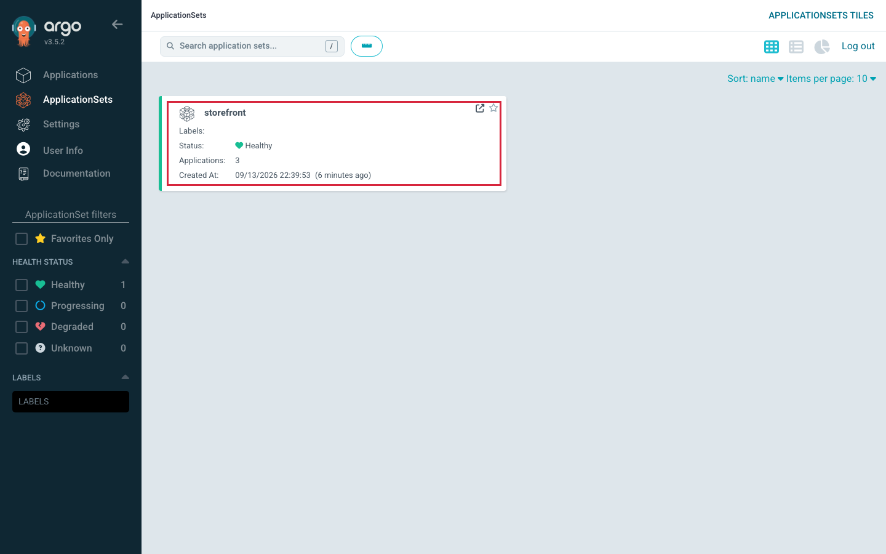
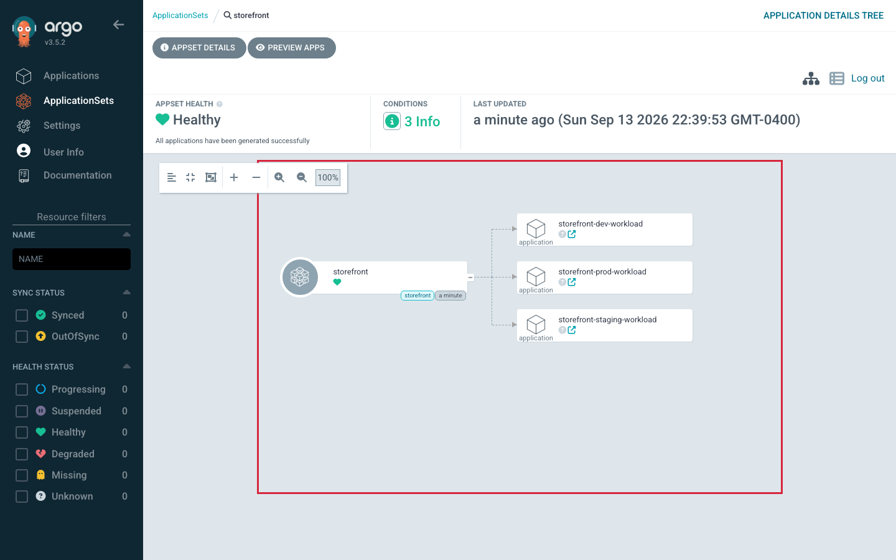
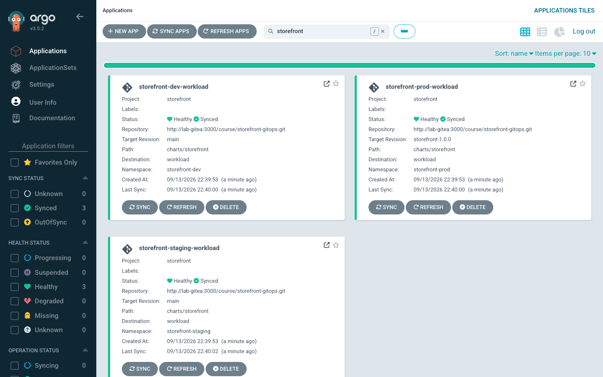
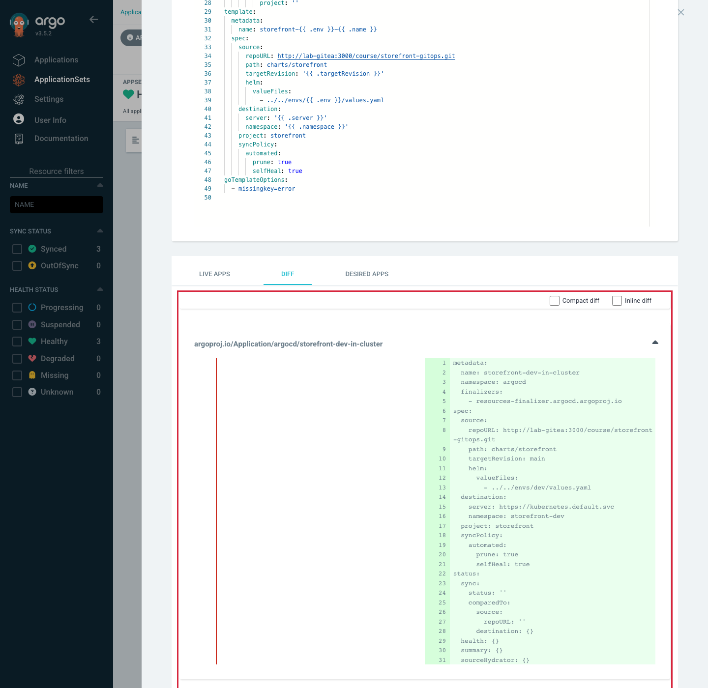
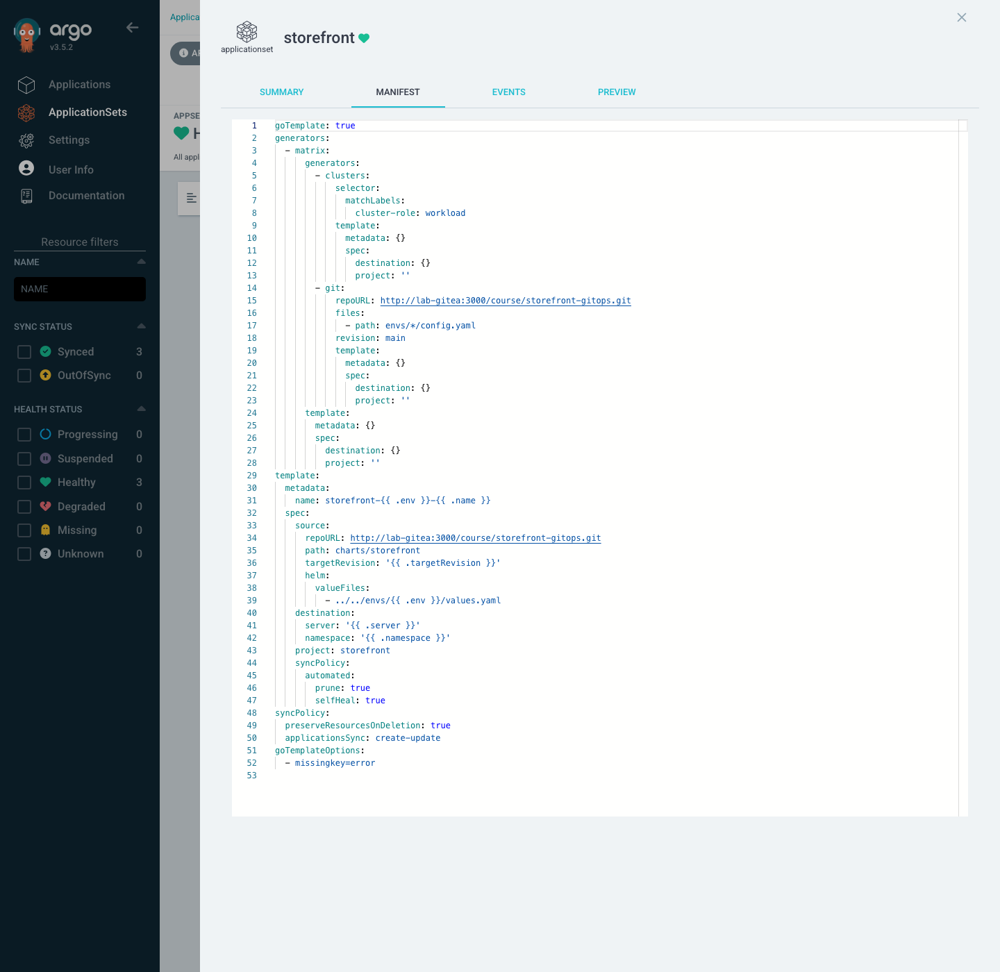

# Lab 4 · Module 2 — Build and Protect the Factory

> **Day 2 · Lab 4 · Module 2 of 4 · ~31 minutes**
> **Goal:** complete the storefront ApplicationSet (**E1**), move the blast radius with labels (**E2**), and protect against unintended deletion (**E3**).

> **🗺️ Where this module fits.** You build the factory (E1), see how easily one small change could multiply what it produces (E2), and then put a safety rule on it so it can never delete apps by accident (E3). By the end, three storefront environments exist that you never wrote by hand.

Predict before you preview, and preview before you apply — every time.

---

## Exercise 1 — Complete the storefront factory (L4.1) · ~15 min · Core

> **🧭 What this exercise is for**
> - **In plain words:** you fill in the blanks of an ApplicationSet so that it generates **one Application per environment** (dev, staging, prod) on the workload cluster. On Day 1 you wrote those Applications by hand; now a single file writes them.
> - **Think of it like:** a mail-merge. The **template** is the letter with blanks like `{{ .env }}`. The **generators** are the address list. This one is a **matrix**: it combines two lists — matching clusters × environment files — like a times table. 1 cluster × 3 environments = 3 Applications.
> - **Connects to:** [Session 5 · Module 1](../session-05/01-applicationsets-the-factory.md) (the factory, the `git` and `cluster` generators, `matrix`) and [Session 5 · Module 2](../session-05/02-safety-and-controls.md) (why `project` is never a blank, and why `missingkey=error` is on).
> - **Big picture:** a generated Application is an ordinary Application. Once it exists, it syncs and reports health exactly like Day 1's apps did.

**Goal:** `applicationsets/storefront.yaml` in your `platform-config` clone is a **skeleton with five TODOs**. Fill them so the ApplicationSet generates one Application per environment on the workload cluster, preview to confirm it produces exactly three, then apply.

**Starter state.** The skeleton is staged at `CP-lab-04`. It already fixes what you must *not* change: `goTemplate: true` with `goTemplateOptions: ["missingkey=error"]` (strict), and `project: storefront` hard-coded (never templated).

**The data your template can reference:**
- The **Git-files generator** reads `envs/*/config.yaml` in `storefront-gitops`:
  ```bash
  cat ~/storefront-gitops/envs/dev/config.yaml
  # env: dev  /  namespace: storefront-dev  /  targetRevision: main
  ```
  So `.env`, `.namespace`, `.targetRevision` are available. `envs/prod/config.yaml` sets `targetRevision: storefront-1.0.0` — a **pinned tag**.
- The **cluster generator** contributes the matched cluster's `.name` (`workload`) and `.server`.

**What a correct result looks like** — a preview printing **exactly three** Applications:

| Generated name | Namespace | TARGET |
|---|---|---|
| `storefront-dev-workload` | `storefront-dev` | `main` |
| `storefront-staging-workload` | `storefront-staging` | `main` |
| `storefront-prod-workload` | `storefront-prod` | `storefront-1.0.0` |

If the preview prints **only the header row** (zero Applications), prints two or six rows, shows `TODO` in any column, or ends in an error, a TODO is still wrong — do not apply. A preview of the untouched skeleton prints only the header row, with no error. Zero is a valid result, not a failure message, so you have to count.

> **▶ Predict before you preview (write it down):** how many Applications, and what *exactly* are they called? The names are where template bugs first become visible.

**Run the preview:**

```bash
cd ~/platform-config
argocd appset generate applicationsets/storefront.yaml -o wide
```

**Expected output** *(confirmed against live v3.5.2; the middle columns are trimmed to `...`)*:

```text
NAME                                CLUSTER                             NAMESPACE           PROJECT     ...  TARGET
argocd/storefront-dev-workload      https://k3d-workload-server-0:6443  storefront-dev      storefront  ...  main
argocd/storefront-prod-workload     https://k3d-workload-server-0:6443  storefront-prod     storefront  ...  storefront-1.0.0
argocd/storefront-staging-workload  https://k3d-workload-server-0:6443  storefront-staging  storefront  ...  main
```

The real table is wider. It also has `STATUS`, `HEALTH`, `SYNCPOLICY`, `CONDITIONS`, `REPO`, and `PATH` columns. `STATUS` and `HEALTH` are **blank**, because a preview creates nothing, so there is nothing to measure yet.

Read the `TARGET` column: dev and staging track `main`, **only prod** is pinned. If *staging* shows `storefront-1.0.0`, a TODO is wired to a fixed value instead of `.targetRevision` — a real bug, not the expected result.

**Commit, then apply:**

```bash
git add applicationsets/storefront.yaml && git commit -m "Lab 4 E1: complete storefront ApplicationSet" && git push
kubectl --context k3d-mgmt apply -f applicationsets/storefront.yaml
```

All three reached `Synced`/`Healthy` within about 15 seconds in testing (first `OutOfSync`/`Missing`, then `Progressing`).

**▶ Look in the UI:** click **ApplicationSets** in the left menu, then the `storefront` tile to open its tree. Then click **Applications** and type `storefront` in the search box.



*Figure SS-L4-04 — The **ApplicationSets** page: one `storefront` tile, `Healthy`, `Applications: 3`. **ApplicationSet UI is Alpha since v3.5.0** — rely on the CLI.*



*Figure SS-L4-05 — The `storefront` tile opened: one ApplicationSet node owning three `application` nodes. This Alpha tree shows a grey `?` on each generated app instead of its health. Read their real status in the next figure or with `argocd app list`. **Alpha UI.***



*Figure SS-L4-06 — **Applications**, searched for `storefront`: the three generated apps, each `Healthy` and `Synced`. Only prod has target revision `storefront-1.0.0`. They reconcile through the same application-controller as Day 1's apps.*

<!-- CAPTURE-SPEC: SS-L4-04/05/06 — ApplicationSets list, AppSet tree, filtered Applications list. State: after E1 apply+sync. Argo CD v3.5.2 (Alpha UI for 04/05). -->

**Success criterion:** preview prints exactly the three rows (prod, and only prod, on `storefront-1.0.0`); after apply, `argocd app list` shows all three reaching `Synced`/`Healthy`; no name contains `<no value>` or `TODO`.

**Hints:**
- *Hint 1:* Five TODOs — four pull from generator data (`.env`, `.namespace`, `.targetRevision`, cluster `.name`/`.server`); one is the fixed selector value from Module 1.
- *Hint 2:* The name combines an env variable and a cluster variable; `valueFiles` is relative to `charts/storefront`, so climb up two levels to `envs/<env>/values.yaml`.
- *Hint 3:* "map has no entry for key …" means you referenced a variable the generator does not expose — that error is `missingkey=error` doing its job.

### ✅ What you should take away from E1

- **One ApplicationSet file produced three Applications** — one per row of its combined lists (1 cluster × 3 environment files).
- **Each blank is filled from generator data:** environment details come from `config.yaml` files in Git; the cluster details come from the registered cluster Secret.
- **`project: storefront` is written out, never a blank**, so nothing in the data can move an app into a different set of rules.
- **Generated apps behave like Day 1 apps.** They sync and report health through the same controller.

---

## Exercise 2 — Move the blast radius with labels, and preview it (L4.2) · ~8 min · Core

> **🧭 What this exercise is for**
> - **In plain words:** **blast radius** means "how many things one change can affect." You loosen the cluster selector so it matches *both* clusters, then preview to see how many Applications that *would* create. You do not apply it.
> - **Think of it like:** changing a mailing list from "this street" to "the whole city". The letter did not change at all — but the number of copies did.
> - **Connects to:** [Session 5 · Module 1](../session-05/01-applicationsets-the-factory.md) — "blast radius is arithmetic."
> - **Big picture:** in a real estate of 40 clusters, a one-line label change could touch all of them. The preview lets you see that number *before* it happens.

**Goal:** prove placement is decided by the selector and cluster labels. Broaden the selector so it *would* also match the management cluster, **preview**, count the difference — then throw the change away without applying.

**Do this.** In your local `applicationsets/storefront.yaml`, relax the cluster generator's `matchLabels` so both clusters match (an empty selector matches every registered cluster). **Do not commit or apply.** Preview:

```bash
argocd appset generate applicationsets/storefront.yaml -o wide
```

> **▶ Predict first.** The matrix is *clusters × environments*. With one cluster you got 3. With two clusters matching, how many rows, and what new names?

**What a correct result looks like.** Preview now prints **six** rows — the original three plus three targeting the *management* cluster (names ending `-in-cluster`, destination `https://kubernetes.default.svc`). The list is sorted by name, so the new rows print **first**. Six Applications from a one-line selector change is the whole lesson: a label edit is a fleet edit.

**▶ Optional — the same preview in the UI (Alpha).** Open **ApplicationSets** → `storefront` → **AppSet Details** → **PREVIEW** tab. Click **EDIT**; the box is now titled "APPLICATIONSET MANIFEST (edits are not saved)". Delete the `cluster-role: workload` line, click **PREVIEW**, and scroll down to the **DIFF** sub-tab. Click **CANCEL** when you are done. Nothing is saved to the cluster.



*Figure SS-L4-03 — The Preview tab after deleting the selector line in the editor (not saved) and clicking **PREVIEW**. The **DIFF** sub-tab lists only the Applications that would change. Here that means three new blocks; the first, `storefront-dev-in-cluster`, is shown. Its left side is empty (it does not exist today) and its destination is the management cluster, `https://kubernetes.default.svc`. The three existing apps are not listed, because they would not change. **Alpha UI** — the CLI is the dependable equivalent.*

<!-- CAPTURE-SPEC: SS-L4-03 — ApplicationSet Preview DIFF. State: E2, selector broadened in Preview (NOT saved). Argo CD v3.5.2 (Alpha UI). -->

**Discard the experiment:**

```bash
git checkout -- applicationsets/storefront.yaml
```

**Success criterion:** you can state from preview alone the exact number the broadened selector would create (**six**) and why (2 × 3); after `git checkout`, a fresh preview prints the original three.

**Hints:**
- *Hint 1:* The count is the matrix product — count matched clusters, multiply by matched files.
- *Hint 2:* If preview still shows three, your selector still excludes the management cluster — an *empty* `matchLabels` matches everything.

### ✅ What you should take away from E2

- **Count = matched clusters × matched environment files.** One more matching cluster doubled the output.
- **A label or selector change is a fleet change**, even though the edit looks tiny.
- **Preview caught it for free.** You saw six rows, threw the edit away, and nothing was ever created.

---

## Exercise 3 — Protect against unintended deletion (L4.3) · ~8 min · Core

> **🧭 What this exercise is for**
> - **In plain words:** by default, if an input disappears from the factory's list, the factory **deletes** the Application it made from that input. You add a rule that says "you may create and update Applications, but never delete them." Then you remove prod's input and check that prod survives.
> - **Think of it like:** a builder who may build new houses and repaint old ones, but is not allowed to demolish any. If a house is taken off the plan, it stays standing until a person decides to knock it down.
> - **Connects to:** [Session 5 · Module 2](../session-05/02-safety-and-controls.md) — `applicationsSync` (what the factory may do to Applications) and `preserveResourcesOnDeletion` (what happens to the running workload if an Application *is* deleted).
> - **Big picture:** a factory that can delete is one typo away from removing a whole fleet. This rule turns "the factory deleted it" into "a person decided to delete it."

**Goal:** add the ApplicationSet-level protection policy, remove a generator input, and prove the corresponding Application **survives** instead of being auto-deleted.

**Why now.** A selector that stops matching produces **zero** parameters → zero Applications — and if the policy permits deletion, every previously generated Application is now "extra" and gets removed. A label edit becomes a fleet-wide deletion, every component behaving "correctly." The protection policy makes that impossible.

**Do this.**
1. Add a `spec.syncPolicy` with **two** settings: `applicationsSync: create-update` (may create/update, **never delete**) and `preserveResourcesOnDeletion: true` (if an app *is* removed, leave its workload). Commit, push, apply.
2. Remove **prod** from the generator's input — move/rename `envs/prod/config.yaml` in your `storefront-gitops` clone so the glob no longer matches — commit and push.

> **▶ Predict first.** Under `create-update`, when the prod input disappears, does `storefront-prod-workload` get deleted, or stay?

**What a correct result looks like.** `argocd appset generate` now prints only **two** rows (dev, staging), but `argocd app list` still shows **three** — `storefront-prod-workload` survives. The factory *stopped generating* prod but was **not allowed to delete** it. That app is now an **orphan**: still running, no longer generated.

> **⏱ Wait before you judge.** `argocd appset generate` reads Git the moment you run it. The ApplicationSet controller does not. It re-reads the Git files on its own schedule, **up to about 3 minutes** after your push (about 2 minutes in testing). Until that pass, prod would still be listed even *without* the protection policy. So wait 3 minutes after the push, then run `argocd app list` again before you conclude that prod survived.

**▶ Optional — see the policy in the UI:** **ApplicationSets** → `storefront` → **AppSet Details** → **MANIFEST** tab.



*Figure SS-L4-10 — The ApplicationSet's **MANIFEST** tab (it shows the `spec` only). Lines 48–50 are the spec-level `syncPolicy`: `preserveResourcesOnDeletion: true` and `applicationsSync: create-update`. It sits beside `template`, not inside it; the `syncPolicy` at lines 44–47 is the generated apps' own `automated` policy. **Alpha UI.***

<!-- CAPTURE-SPEC: SS-L4-10 — ApplicationSet manifest, syncPolicy. State: after E3 apply. Highlight: applicationsSync create-update, preserveResourcesOnDeletion true. Argo CD v3.5.2 (Alpha UI). -->

**Success criterion:** after removing the prod input, `appset generate` prints two rows while `argocd app list` still lists `storefront-prod-workload`; and you can state in a sentence what an operator must now do about the orphan — retiring prod is a **deliberate** action (`argocd app delete storefront-prod-workload`, or restore the input). "Safe" means "deletion is now a decision, not a reflex."

**Restore prod** before the next module (put `envs/prod/config.yaml` back, commit, push).

**Hints:**
- *Hint 1:* Both settings live under `spec.syncPolicy` on the *ApplicationSet*, not on the generated apps or the `template.spec.syncPolicy` block.
- *Hint 2:* If prod actually disappeared, the policy was not in effect when the controller noticed the missing input. For example, you removed the input *before* applying the edited ApplicationSet, or the policy sits under `template.spec`. Check what is live with `kubectl --context k3d-mgmt -n argocd get applicationset storefront -o jsonpath='{.spec.syncPolicy}'`. Then put the input back (commit, push); the factory regenerates prod on its next pass.

### ✅ What you should take away from E3

- **Removing an input stops the factory from generating that app — it does not have to delete it.** With `create-update`, the app stays.
- **An app that stays but is no longer generated is an *orphan*.** Someone must decide what to do with it.
- **Two different switches, two different layers:** `applicationsSync` protects the **Application objects**; `preserveResourcesOnDeletion` protects the **running workload** underneath. It does that by removing the `resources-finalizer` (the clean-up marker from Session 5) from each generated Application, so deleting one of them leaves its workload running. You can see it: `kubectl --context k3d-mgmt -n argocd get applications -o custom-columns='NAME:.metadata.name,FINALIZERS:.metadata.finalizers'` shows `<none>` after the policy is applied.

---

## ✅ Key takeaways from this module

- **An ApplicationSet writes Applications from a template plus data.** The number of apps is the number of data combinations.
- **Always preview → count → apply.** The count catches "too many"; the names catch template mistakes.
- **A small selector change can multiply your blast radius.** The edit looks the same size whether it touches one cluster or forty.
- **Protect the fleet before you change inputs:** `applicationsSync: create-update` makes deletion a person's decision, not the factory's reflex.

**→ Next:** [03 — App-of-Apps and tracing faults](03-app-of-apps-and-trace-faults.md)
