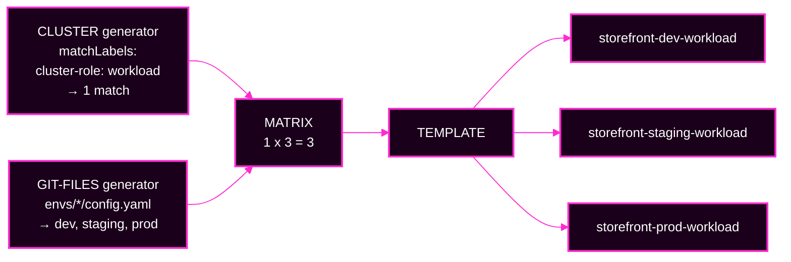

# Lab 4 · Module 2 — Build the Factory, and Break It Once

> **Day 2 · Lab 4 · Module 2 of 4 · 25 minutes**
> **Run every command in your VM terminal**, after `source ~/argo-lab-env.sh`.
> **← Back to:** [Day 2 map](../README.md) · [Lab 4](README.md)

---

## Module TL;DR

- **What this is.** You complete a real ApplicationSet (E1), see how one line changes the blast radius (E2), then break it on purpose and protect it (E3).
- **Why it matters.** Three of the capstone's seven faults live in this material.
- **What to remember.** *Preview, count, apply.* And: **a failure during generation is cheap; a successful render of the wrong thing is expensive.**
- **The most common mistake.** Trusting exit code `0`. A loose template succeeds while producing something you never intended.

---

# Exercise 1 — Build the factory · 15 min

## Why

On Day 1 you wrote each Application by hand. Now a single file will write three of them, consistently, and keep them consistent.

## Starting state

- You are at checkpoint `CP-lab-04`, verified in Module 1.
- `applicationsets/storefront.yaml` in `~/platform-config` is a **skeleton with five TODOs**.
- **No Applications exist yet.** The preview prints a header row and nothing else.

**Where you work:** `~/platform-config`, in your VM terminal.
**Active context for any `kubectl`:** `k3d-mgmt`.

## Mental model

A **mail merge**. The **template** is the letter with blanks like `{{ .env }}`. The **generators** are the address list.

This one is a **matrix**: it combines two lists — matching clusters × environment files — like a times table.

**1 cluster × 3 environments = 3 Applications.**

## Visual



## The data you can reference

**The Git-files generator** reads `envs/*/config.yaml` in `storefront-gitops`. Look at one:

```bash
cat ~/storefront-gitops/envs/dev/config.yaml
```

```text
env: dev
namespace: storefront-dev
targetRevision: main
```

So `.env`, `.namespace`, and `.targetRevision` are available to your template.

**Check prod** — it is deliberately different:

```bash
cat ~/storefront-gitops/envs/prod/config.yaml
```

Production is pinned to `targetRevision: storefront-1.0.0`, an immutable **tag**, not a moving branch.

**The cluster generator** contributes the matched cluster's `.name` (which is `workload`) and its `.server`.

## What the skeleton already fixes for you

Two things are set and **must not change**:

- `goTemplate: true` with `goTemplateOptions: ["missingkey=error"]` — strict templating.
- `project: storefront` — hard-coded, never templated, because it is a security boundary.

## Predict

**Write this down before you touch anything:**

1. How many Applications will the finished factory produce?
2. What is each one called, exactly?
3. Which one, and only which one, will have a target revision that is not `main`?

**The names are where template bugs first become visible.** Predicting them is not busywork.

## Do

Open `~/platform-config/applicationsets/storefront.yaml` and fill in the five TODOs so that the ApplicationSet generates one Application per environment on the workload cluster.

Then preview:

```bash
cd ~/platform-config
argocd appset generate applicationsets/storefront.yaml -o wide
```

## Observe — what a correct result looks like

**Expected output** — verified against live v3.5.2, middle columns trimmed here to `...`:

```text
NAME                                CLUSTER                             NAMESPACE           PROJECT     ...  TARGET
argocd/storefront-dev-workload      https://k3d-workload-server-0:6443  storefront-dev      storefront  ...  main
argocd/storefront-prod-workload     https://k3d-workload-server-0:6443  storefront-prod     storefront  ...  storefront-1.0.0
argocd/storefront-staging-workload  https://k3d-workload-server-0:6443  storefront-staging  storefront  ...  main
```

The real table is wider. It also has `STATUS`, `HEALTH`, `SYNCPOLICY`, `CONDITIONS`, `REPO`, and `PATH` columns. **`STATUS` and `HEALTH` are blank**, because a preview creates nothing, so there is nothing to measure yet.

**Read the `TARGET` column carefully.** Dev and staging track `main`. **Only prod** is pinned to `storefront-1.0.0`.

> **If *staging* shows `storefront-1.0.0`,** a TODO is wired to a fixed value instead of to `.targetRevision`. That is a real bug, not an acceptable variation.

## Diagnose — if the preview is not three correct rows

| What you see | What it means |
|---|---|
| only the header row | the cluster selector matches nothing — the `TODO` placeholder is still there |
| rows containing the text `TODO` | the selector works, but other TODOs are unfilled |
| two or six rows | your selector or your file glob is not matching what you expected |
| a fatal error mentioning `map has no entry for key` | you referenced a variable the generator does not supply |

### Staged hints

<details>
<summary><b>Hint 1 — what to inspect</b></summary>

There are five TODOs. Four of them pull a value from generator data. One is a fixed value you already read in Module 1.

Go back and look at what Module 1's cluster-label command printed. One of those values goes straight into the selector.
</details>

<details>
<summary><b>Hint 2 — which command or object to examine</b></summary>

Compare two things side by side:

```bash
cat ~/storefront-gitops/envs/dev/config.yaml
sed -n '1,60p' ~/platform-config/applicationsets/storefront.yaml
```

Every key in `config.yaml` is available to the template as `{{ .key }}`. The cluster generator additionally supplies `{{ .name }}` and `{{ .server }}`.
</details>

<details>
<summary><b>Hint 3 — how to interpret what you get back</b></summary>

Run the preview and read the **column** that is wrong, because the column names the field:

- `NAME` wrong or contains `TODO` → the `metadata.name` expression
- `NAMESPACE` wrong → `destination.namespace`
- `CLUSTER` wrong → `destination.server`
- `TARGET` wrong → `source.targetRevision`
- **no rows at all** → the cluster selector, which is upstream of everything else

Fix the selector first. Nothing downstream can be right while the generator produces zero rows.
</details>

<details>
<summary><b>Final hint — the direction of the fix</b></summary>

The Application name combines a value from the environment data with a value from the cluster data, joined by hyphens, prefixed with `storefront-`.

The Helm `valueFiles` path is relative to the chart path `charts/storefront`, so it has to climb **up two levels** before it descends into `envs/<env>/`.

Everything else is a direct one-for-one substitution of a key you can see in `config.yaml`.
</details>

## Verify

**When the preview shows exactly three correct rows**, commit and apply:

```bash
cd ~/platform-config
git add applicationsets/storefront.yaml
git commit -m "Lab 4 E1: complete storefront ApplicationSet"
git push origin main
kubectl --context k3d-mgmt apply -f applicationsets/storefront.yaml
```

Wait about 20 seconds, then confirm:

```bash
argocd app list -o wide | grep 'argocd/storefront-'
```

**Expected:** three Applications, all reaching `Synced` and `Healthy`. In testing they settled within about 15 seconds, passing through `OutOfSync`/`Missing` and then `Progressing` on the way.

> **Why the `argocd/` prefix in that `grep`?** A plain `grep storefront-` also matches `platform-netpol` and `platform-quotas`, whose namespace column is `storefront-dev`. The prefix keeps you honest.

**▶ Look in the user interface:** click **ApplicationSets** in the left menu, then the `storefront` tile. Then click **Applications** and type `storefront` in the search box.


*Figure SS-L4-04 — The **ApplicationSets** page: one `storefront` tile, `Healthy`, with `Applications: 3`.*


*Figure SS-L4-05 — The `storefront` tile opened: one ApplicationSet node owning three `application` nodes. This view shows a grey `?` on each generated app instead of its health. Read the real status in the next figure, or with `argocd app list`.*


*Figure SS-L4-06 — **Applications**, filtered to `storefront`: the three generated apps, each `Healthy` and `Synced`. Only prod shows target revision `storefront-1.0.0`.*

> **A note on the ApplicationSet screens.** The ApplicationSet user interface is **Alpha** in v3.5.x. It is useful for a quick look, but **the CLI is the dependable path** and is what this lab grades on.

<!-- CAPTURE-SPEC: SS-L4-04/05/06 — ApplicationSets list, AppSet tree, filtered Applications list. State: after E1 apply. Argo CD v3.5.2 (Alpha UI for 04/05). -->

## Cleanup

**Nothing to clean up.** These three Applications are the foundation for the rest of the lab, and they carry forward into Lab 5 and the capstone.

## ✅ Key Takeaways — E1

- **One file produced three Applications** — one per combination of the two lists.
- **Every blank is filled from generator data**; environment details come from Git, cluster details from the registered cluster Secret.
- **`project: storefront` is written out, never templated**, so no data change can move an app into a different set of rules.
- **Generated Applications behave exactly like Day 1's**, through the same controller.

---

# Exercise 2 — Move the blast radius · 5 min

## Why

**Blast radius** means "how many things one change can affect." You are about to see a one-line edit double the output of the factory — and catch it for free.

## Starting state

E1 is complete and applied. Three Applications are `Synced` and `Healthy`.

## Mental model

**Changing a mailing list from "this street" to "the whole city."** The letter did not change at all. The number of copies did.

## Predict

The matrix is *clusters × environments*. With one cluster you got three.

**Write down:** if the selector matched **both** registered clusters, how many rows, and what would the new ones be called?

## Do

In your **local** `applicationsets/storefront.yaml`, relax the cluster generator's `matchLabels` so that both clusters match. An empty selector matches every registered cluster.

**Do not commit. Do not apply.**

```bash
argocd appset generate applicationsets/storefront.yaml -o wide
```

## Observe — what a correct result looks like

**The preview now prints six rows** — verified on the course environment:

```text
NAME                                  CLUSTER                             NAMESPACE           TARGET
argocd/storefront-dev-workload        https://k3d-workload-server-0:6443  storefront-dev      main
argocd/storefront-prod-workload       https://k3d-workload-server-0:6443  storefront-prod     storefront-1.0.0
argocd/storefront-staging-workload    https://k3d-workload-server-0:6443  storefront-staging  main
argocd/storefront-dev-in-cluster      https://kubernetes.default.svc      storefront-dev      main
argocd/storefront-prod-in-cluster     https://kubernetes.default.svc      storefront-prod     storefront-1.0.0
argocd/storefront-staging-in-cluster  https://kubernetes.default.svc      storefront-staging  main
```

**🔍 Read the ordering, because it is not alphabetical.** The rows are grouped by cluster in generator order, so the three original `-workload` rows come **first** and the three new `-in-cluster` rows come **last**. Scroll down to find what changed.

**🔍 Read the `CLUSTER` column on the new rows.** They target `https://kubernetes.default.svc` — **the management cluster**, where Argo CD itself runs. That is exactly the mistake the label was preventing.

**Six Applications from a one-line selector change is the whole lesson: a label edit is a fleet edit.**

## Diagnose

| What you see | What it means |
|---|---|
| still three rows | your selector still excludes the management cluster |
| six rows | correct — and three of them are aimed at the control plane |
| an error | you removed more than the label, and broke the YAML structure |

### Staged hints

<details>
<summary><b>Hint 1 — what to inspect</b></summary>

The count is the matrix product. Count the matched clusters, then multiply by the number of matched environment files.

You are changing only the first of those two numbers.
</details>

<details>
<summary><b>Hint 2 — which command or object to examine</b></summary>

Re-run Module 1's label command to see exactly how many clusters there are to match:

```bash
kubectl --context k3d-mgmt -n argocd get secret \
  -l argocd.argoproj.io/secret-type=cluster \
  -o custom-columns='NAME:.metadata.name,ROLE:.metadata.labels.cluster-role'
```
</details>

<details>
<summary><b>Hint 3 — how to interpret what you get back</b></summary>

If the preview still shows three, your `matchLabels` still contains a condition that only one cluster satisfies.

An **empty** `matchLabels` matches everything. Removing the *value* but leaving the *key* is not the same thing as removing the condition.
</details>

<details>
<summary><b>Final hint — the direction of the fix</b></summary>

You want the selector to impose no condition at all. That means the `matchLabels` map ends up empty, while the surrounding YAML structure stays valid.
</details>

## Verify, then throw it away

**This edit must never be applied.** Discard it:

```bash
git checkout -- applicationsets/storefront.yaml
argocd appset generate applicationsets/storefront.yaml -o wide
```

**The preview should be back to exactly three rows.** Confirm that before moving on.

**▶ Optional — the same preview in the user interface (Alpha).** **ApplicationSets** → `storefront` → **AppSet Details** → **PREVIEW** tab. Click **EDIT**, delete the `cluster-role: workload` line, click **PREVIEW**, then open the **DIFF** sub-tab. Click **CANCEL** when done. Nothing is saved.


*Figure SS-L4-03 — The Preview tab's **DIFF** sub-tab lists only the Applications that **would change**. The first, `storefront-dev-in-cluster`, has an empty left side because it does not exist today, and its destination is the management cluster. The three existing apps are not listed, because they would not change.*

<!-- CAPTURE-SPEC: SS-L4-03 — ApplicationSet Preview DIFF. State: E2, selector broadened in Preview, NOT saved. Argo CD v3.5.2 (Alpha UI). -->

## Cleanup

The `git checkout` above **is** the cleanup. Confirm the preview shows three rows before continuing.

## ✅ Key Takeaways — E2

- **Count = matched clusters × matched environment files.** One more matching cluster doubled the output.
- **A label change is a fleet change**, even though the edit looks tiny.
- **The new rows targeted the management cluster** — the exact mistake the label prevents.
- **Preview caught it for free.** You saw six rows, discarded the edit, and nothing was ever created.

---

# Exercise 3 — Break the factory once, then protect it · 5 min

## Why

You have seen a factory work. Now find out what it does when the data is wrong — because that is what you will meet in the capstone.

## Starting state

E1 applied, E2 discarded. Three Applications `Synced` and `Healthy`. The preview shows three rows.

**Where you work:** `~/storefront-gitops` for the break, then `~/platform-config` for the protection.

## Predict

The template references `{{ .namespace }}`. The ApplicationSet is **strict** (`missingkey=error`).

**Write down two answers:**

1. If one environment's data loses its `namespace:` line, does the factory generate a broken Application for that environment, or refuse?
2. What happens to the already-generated dev and prod Applications?

## Do

```bash
cd ~/storefront-gitops
# remove the namespace line from staging's generator data
grep -v '^namespace:' envs/staging/config.yaml > /tmp/staging.tmp && mv /tmp/staging.tmp envs/staging/config.yaml
cat envs/staging/config.yaml
git add envs/staging/config.yaml
git commit -m "Lab 4 E3: drop staging namespace"
git push origin main
```

> **Why not `sed -i`?** Because `sed -i` needs a backup suffix on macOS and refuses it on Ubuntu. The `grep` form above behaves identically on both.

## Observe

**Wait about a minute, then preview:**

```bash
cd ~/platform-config
argocd appset generate applicationsets/storefront.yaml -o wide 2>&1 | sed 's/\\n.*//'
```

> **⏱ It does not fail instantly.** `argocd appset generate` asks the Argo CD server, and the repo-server caches Git content briefly. In testing, the error appeared **between 20 and 60 seconds** after the push. If the preview still shows three healthy rows, wait and run it again. That delay is not a bug, and it is worth remembering: **a preview can be reading a slightly stale copy of Git.**

**Expected, once the cache turns over:**

```text
{"level":"fatal","msg":"rpc error: code = Unknown desc = unable to generate Applications of
ApplicationSet: error generating applications: failed to execute go template {{ .namespace }}:
... map has no entry for key \"namespace\""
```

**The phrase that matters is `map has no entry for key "namespace"`.** That is `missingkey=error` doing its job.

**The command exits with code `20`.** Check it yourself:

```bash
argocd appset generate applicationsets/storefront.yaml -o wide >/dev/null 2>&1
echo "exit code: $?"
```

**▶ Now check what happened to the live Applications:**

```bash
kubectl --context k3d-mgmt -n argocd get applications \
  -o custom-columns='NAME:.metadata.name,SYNC:.status.sync.status,HEALTH:.status.health.status'
```

**Expected:** all three storefront Applications are still `Synced` and `Healthy`, completely unchanged.

**▶ And check the ApplicationSet's own conditions:**

```bash
kubectl --context k3d-mgmt -n argocd get applicationset storefront \
  -o jsonpath='{.status.conditions}' | tr ',' '\n' | grep -iE 'reason|type'
```

**Expected** — verified on the course environment, appearing within about 2 minutes of the push:

```text
"reason":"RenderTemplateParamsError"
"type":"ErrorOccurred"}
"reason":"ErrorOccurred"
"type":"ParametersGenerated"}
"reason":"ErrorOccurred"
"type":"ResourcesUpToDate"}
```

## Diagnose — where is the evidence, and where is the fix?

**▶ Answer these before reading on:**

- Which **object** carries the error?
- Which **file**, in which repository, actually caused it?
- Why did the three existing Applications not change?

<details>
<summary>Show the answer</summary>

**The error lives on the `ApplicationSet` object**, in its `status.conditions`. It is **not** on any Application. The Applications list looks entirely healthy, which is exactly why you have to know where to look.

**The cause is `envs/staging/config.yaml` in `storefront-gitops`** — generator *data*, in a different repository from the ApplicationSet itself.

**The existing Applications did not change because the factory failed safe.** Strict templating made the whole generation pass fail, so the controller changed no Application at all. It did not partially apply, and it did not produce a half-empty staging app.
</details>

### Staged hints

<details>
<summary><b>Hint 1 — what to inspect</b></summary>

The Applications all look healthy. So the evidence is not on an Application.

What other object is involved in this lab that has a status of its own?
</details>

<details>
<summary><b>Hint 2 — which command or object to examine</b></summary>

An ApplicationSet has its own conditions, just like an Application does:

```bash
kubectl --context k3d-mgmt -n argocd get applicationset storefront -o yaml | sed -n '/status:/,$p'
```
</details>

<details>
<summary><b>Hint 3 — how to interpret what you get back</b></summary>

`RenderTemplateParamsError` means the **template** could not be filled in. That points at either the template expression or the **data feeding it**.

The message names the missing key. Ask: which file was supposed to supply that key?
</details>

<details>
<summary><b>Final hint — the direction of the fix</b></summary>

The template is correct. The **data** is incomplete.

The fix goes in the repository that owns the environment data, not in `platform-config`, and not on any live object. Undo the commit that removed the line.
</details>

## Explain why

> **A failure during generation is cheap and local. A successful render of the wrong thing is expensive and remote.**

**▶ Optional, 2 minutes — feel the difference.** While staging's `namespace` is still missing, temporarily delete the `goTemplateOptions` line from your **local** `applicationsets/storefront.yaml` and preview again. Do not commit, do not apply.

**What you will see** — verified on the course environment:

```text
NAME                                CLUSTER                             NAMESPACE        TARGET
argocd/storefront-dev-workload      https://k3d-workload-server-0:6443  storefront-dev   main
argocd/storefront-prod-workload     https://k3d-workload-server-0:6443  storefront-prod  storefront-1.0.0
argocd/storefront-staging-workload  https://k3d-workload-server-0:6443  <no value>       main
```

**No error. Exit code `0`.** The namespace is the literal text `<no value>`.

**A pipeline that only checks "did the command fail?" would pass this.** Restore strictness:

```bash
git checkout -- applicationsets/storefront.yaml
```

**One line changed, two behaviours. The safer configuration failed more, sooner, and louder — and that is exactly why it is safer.**

## Verify the repair

```bash
cd ~/storefront-gitops
git revert --no-edit HEAD
git push origin main
cat envs/staging/config.yaml
```

Wait about a minute, then confirm the preview is healthy again:

```bash
cd ~/platform-config
argocd appset generate applicationsets/storefront.yaml -o wide
```

**Expected:** three rows, no error.

> **⏱ The condition on the ApplicationSet lags behind the preview.** The preview reads Git roughly now; the controller re-checks this ApplicationSet on its own schedule, up to about 3 minutes. `ErrorOccurred` stays `True` until its next pass.
>
> **Both readings are honest. The condition is simply older.** Do not "fix it again." Wait, then re-run the conditions command and watch it clear.

## Now protect it

A factory that can delete is one typo away from removing a fleet. Add the protection policy.

**▶ Do this now.** Add a `spec.syncPolicy` block to `applicationsets/storefront.yaml`, as a **sibling of `generators` and `template`** — not inside `template`:

```yaml
spec:
  goTemplate: true
  goTemplateOptions: ["missingkey=error"]
  syncPolicy:
    applicationsSync: create-update       # may create and update, NEVER delete
    preserveResourcesOnDeletion: true     # if an app is removed, leave its workload
  generators:
    ...
```

Apply it and commit it:

```bash
cd ~/platform-config
kubectl --context k3d-mgmt apply -f applicationsets/storefront.yaml
git add applicationsets/storefront.yaml
git commit -m "Lab 4 E3: protect the factory"
git push origin main
```

**▶ Verify it took effect — this is visible immediately:**

```bash
kubectl --context k3d-mgmt -n argocd get applications \
  -o custom-columns='NAME:.metadata.name,FINALIZERS:.metadata.finalizers'
```

**Expected** — verified on the course environment:

```text
NAME                          FINALIZERS
storefront-dev-workload       <none>
storefront-prod-workload      <none>
storefront-staging-workload   <none>
```

**🔍 Before the policy, those three showed `[resources-finalizer.argocd.argoproj.io]`.** The ApplicationSet controller adds that finalizer by default, and it is what makes a deletion cascade to the workload. `preserveResourcesOnDeletion: true` tells the controller to leave it off.

**Two switches, two layers:**

- **`applicationsSync`** protects the **Application objects**.
- **`preserveResourcesOnDeletion`** protects the **running workloads** underneath.

> **▶ Optional deepening (4 minutes, mostly waiting).** Remove prod from the generator's input and prove the Application survives:
>
> ```bash
> cd ~/storefront-gitops
> git mv envs/prod/config.yaml envs/prod/config.yaml.disabled
> git commit -m "temporarily remove prod input" && git push origin main
> ```
>
> Wait about a minute, then compare what the factory *would* generate against what actually exists:
>
> ```bash
> cd ~/platform-config
> argocd appset generate applicationsets/storefront.yaml -o yaml | grep -c 'kind: Application'   # 2
> kubectl --context k3d-mgmt -n argocd get applications -o name | grep -c storefront-            # 3
> ```
>
> **Verified result: the preview says 2, the live count stays 3.** `storefront-prod-workload` survives. The factory **stopped generating** it but was **not allowed to delete** it. That Application is now an **orphan** — still running, no longer generated — and retiring it is a deliberate human decision.
>
> **Restore it before continuing:**
>
> ```bash
> cd ~/storefront-gitops
> git mv envs/prod/config.yaml.disabled envs/prod/config.yaml
> git commit -m "restore prod input" && git push origin main
> ```
>
> Wait about a minute and confirm the preview is back to 3.

## Cleanup

Confirm your end state before moving on:

```bash
cd ~/platform-config
argocd appset generate applicationsets/storefront.yaml -o yaml | grep -c 'kind: Application'
argocd app list -o wide | grep 'argocd/storefront-'
```

**Expected:** `3`, and three Applications `Synced`/`Healthy`. The protection policy stays in place for the rest of the lab.

## ✅ Key Takeaways — E3

- **Strict templating refuses to generate rather than generating something wrong**, and it changes no existing Application while doing it.
- **The evidence was on the ApplicationSet; the cause was in a data file in a different repository.**
- **A failed generate exits `20` and buries its message.** Exit code `0` with `<no value>` is the dangerous outcome.
- **`applicationsSync` guards Application objects; `preserveResourcesOnDeletion` guards workloads.** You can see which is live by reading the finalizers.

---

## ✅ Key Takeaways from this module

- **An ApplicationSet writes Applications from a template plus data.** The number of apps is the number of data combinations.
- **Always preview → count → apply.** The count catches "too many"; the names catch template bugs.
- **A small selector change multiplies your blast radius**, and the edit looks the same size either way.
- **Safer configuration means more failures, sooner, on purpose.**
- **Protect the fleet before you change inputs**, so deletion becomes a person's decision.

---

## Final module TL;DR

- **What this is.** A real factory, built, stressed, broken, and protected.
- **Why it matters.** Blast radius and source/render failures are two of the capstone's seven faults.
- **What to remember.** Preview, count, apply. And: cheap local failure beats expensive remote success.
- **The most common mistake.** Looking for the error on the Applications, when it lives on the ApplicationSet.

**→ Next:** [03 — Build the family tree, and break it once](03-app-of-apps-and-trace-faults.md)
