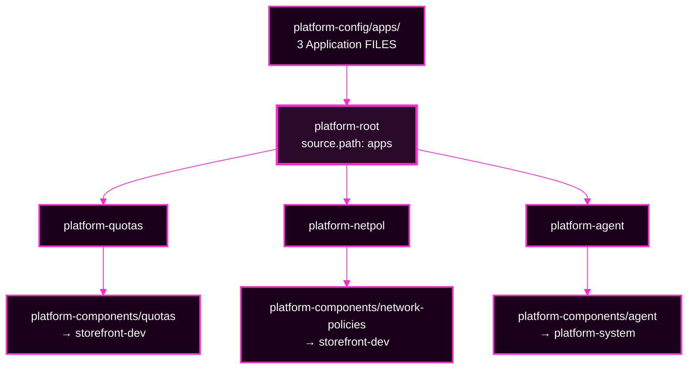

# Lab 4 · Module 3 — Build the Family Tree, and Break It Once

> **Day 2 · Lab 4 · Module 3 of 4 · 25 minutes**
> **Run every command in your VM terminal**, after `source ~/argo-lab-env.sh`.
> **← Back to:** [Day 2 map](../README.md) · [Lab 4](README.md)

---

## Module TL;DR

- **What this is.** You apply an App-of-Apps root and trace its children (E4), then break one child and watch the root stay green above it (E5).
- **Why it matters.** "A healthy parent does not necessarily mean every child workload is healthy" is a capstone trap, and this is where you feel it.
- **What to remember.** *Find who wrote the broken setting, and fix it there.* **If your fix reverts, you fixed the wrong layer.**
- **The most common mistake.** Diagnosing an App-of-Apps from the root's own page, which hides the fault completely.

---

# Exercise 4 — Build the family tree · 10 min

## Why

The factory derives its list from data. This pattern does the opposite: a person wrote down, by name, exactly which children exist. You need to be able to read that tree and find any child's owning file.

## Starting state

- E1–E3 are complete. Three storefront Applications are `Synced` and `Healthy`.
- `root/platform-root.yaml` and `apps/*.yaml` are staged in `~/platform-config`, in the `platform` project.
- **Nothing from this exercise is applied yet.**

**Where you work:** `~/platform-config`.
**Active context:** `k3d-mgmt` for the Applications, `k3d-workload` for the workloads they deploy.

## Mental model

**A manager with a folder of task sheets.** The manager's only job is to hand out every sheet in the folder. Each worker then does their own task.

The root creates **child Applications**. Each child deploys the real workload.

## Visual



**Notice there are two repositories in play.** `platform-config` holds the files that *define* each child. `platform-components` holds what each child *deploys*. Knowing which is which is the whole point of the tracing exercise.

## Predict

**Write this down before you apply anything:**

1. How many child Applications will `platform-root` create?
2. **What determines that number?** It is not written anywhere in the root manifest.

<details>
<summary>Show the answer after you have written yours</summary>

**Three**, because there are three Application manifests in `apps/`.

The count is decided entirely by **the files under the root's `source.path`** — one child per Application manifest. The root does not *list* its children; it **points at a folder** and adopts whatever is inside.

Add a file, get a child. That is both the convenience and the danger.
</details>

## Do

```bash
cd ~/platform-config
ls apps/
kubectl --context k3d-mgmt apply -f root/platform-root.yaml
```

Wait about 25 seconds, then:

```bash
argocd app get platform-root
```

## Observe

**Expected output** — verified on the course environment:

```text
Name:               argocd/platform-root
Project:            platform
Server:             https://kubernetes.default.svc
Namespace:          argocd
Source:
- Repo:             http://lab-gitea:3000/course/platform-config.git
  Target:           main
  Path:             apps
Sync Policy:        Automated (Prune)
Sync Status:        Synced to main (2948726)
Health Status:      Healthy

GROUP        KIND         NAMESPACE  NAME             STATUS  HEALTH  HOOK  MESSAGE
argoproj.io  Application  argocd     platform-agent   Synced
argoproj.io  Application  argocd     platform-netpol  Synced
argoproj.io  Application  argocd     platform-quotas  Synced
```

**🔍 Notice three things:**

1. **The root's tree contains `Application` objects, not Deployments.** The root deploys *children*; each child deploys the actual workload.
2. **The root has both a `STATUS` and a `HEALTH`. Each child row has a sync status but no health value.** Argo CD does not judge an Application's health from inside another Application. Remember that for E5.
3. **Each child has its own sync and health**, independent of the root.


*Figure SS-L4-08 — `platform-root`, `Healthy` and `Synced`, owning `platform-agent`, `platform-netpol`, and `platform-quotas`. Look closely: the root node shows a health indicator and a sync check, while each child node shows **only** a sync check.*

<!-- CAPTURE-SPEC: SS-L4-08 — platform-root tree. State: after E4 apply. Highlight: root and three child Application nodes. Argo CD v3.5.2. -->

## Trace each child to its source

**▶ Do this now** — this reads only each child's `spec`, which is what its file in `apps/` wrote:

```bash
for c in platform-quotas platform-netpol platform-agent; do
  echo "$c: $(kubectl --context k3d-mgmt -n argocd get application "$c" \
    -o jsonpath='{.spec.source.repoURL} path={.spec.source.path} server={.spec.destination.server} ns={.spec.destination.namespace}')"
done
```

**Expected output** — verified on the course environment:

```text
platform-quotas: http://lab-gitea:3000/course/platform-components.git path=quotas server=https://k3d-workload-server-0:6443 ns=storefront-dev
platform-netpol: http://lab-gitea:3000/course/platform-components.git path=network-policies server=https://k3d-workload-server-0:6443 ns=storefront-dev
platform-agent: http://lab-gitea:3000/course/platform-components.git path=agent server=https://k3d-workload-server-0:6443 ns=platform-system
```

**🔍 All three source from `platform-components`, each from a different path, and all deploy to the workload cluster.** You can now name, for any child, the exact repository and path where a fix to its *content* would live — and separately, the file in `platform-config/apps/` where a fix to its *spec* would live.

> **A detail that looks wrong but is not.** If you open `platform-quotas` or `platform-netpol` in the user interface, you will see objects in `storefront-dev`, `storefront-staging`, **and** `storefront-prod`. The destination namespace is only a **default**. Those manifests name their own namespaces, which overrides it.

## Diagnose — if the tree does not appear

### Staged hints

<details>
<summary><b>Hint 1 — what to inspect</b></summary>

The root is an ordinary Application. Ask it about itself before you assume anything about children.

If the root is not `Synced`, no children can exist yet.
</details>

<details>
<summary><b>Hint 2 — which command or object to examine</b></summary>

```bash
argocd app get platform-root
kubectl --context k3d-mgmt -n argocd get application platform-root \
  -o jsonpath='{range .status.conditions[*]}{.type}: {.message}{"\n"}{end}'
```
</details>

<details>
<summary><b>Hint 3 — how to interpret what you get back</b></summary>

A condition mentioning a **project** means the `platform` AppProject is refusing something — most likely the `argoproj.io/Application` kind in the `argocd` namespace on the management cluster.

A condition mentioning a **path** means the root's `source.path` does not exist in `platform-config`.

No condition at all, and `OutOfSync`: it simply has not synced yet.
</details>

<details>
<summary><b>Final hint — the direction of the fix</b></summary>

The root's `path` is a **folder**, and every `Application` manifest inside that folder becomes a child.

Confirm the folder is the one you think it is, that it is on the branch the root targets, and that the project permits creating Applications at the root's destination.
</details>

## Verify

```bash
kubectl --context k3d-mgmt -n argocd get applications \
  -o custom-columns='NAME:.metadata.name,SYNC:.status.sync.status,HEALTH:.status.health.status'
```

**Expected:** seven Applications — `platform-root` and its three children, plus the three storefront apps — all `Synced` and `Healthy`.

## Cleanup

**Nothing to clean up.** The tree carries forward into E5, Lab 5, and the capstone.

## ✅ Key Takeaways — E4

- **The root creates Applications, not workloads.** Its tree shows Application objects; each child deploys the real resources.
- **The number of children is the number of Application files in the root's folder.** Add a file, get a child.
- **There are two places to look for any child:** the file in `platform-config/apps/` that *defines* it, and the path in `platform-components` that it *deploys*.
- **Child nodes in the root's tree show no health value.** That is not a rendering quirk; it is the behaviour E5 depends on.

---

# Exercise 5 — Break the tree once, and trace it · 15 min

## Why

This is the capstone skill in miniature: **the place where you see a symptom is often not the place where the fix belongs.**

## Starting state

E4 complete. Seven Applications, all `Synced` and `Healthy`.

**Where you work:** `~/platform-config`.

## Mental model

**A typo in a printed letter.** You do not fix it with correction fluid on one copy — the next print run brings the typo straight back. You fix the original.

## Predict

You are about to change `platform-quotas`'s source path to a folder that does not exist.

**Write down two separate answers:**

1. After this lands, will **`platform-root`** be `Healthy` or `Degraded`?
2. After this lands, will **`platform-quotas`** be `Healthy` or `Degraded`?

**Those are two different questions, one level apart.** Commit to both before continuing.

## Do

```bash
cd ~/platform-config
# point the child at a folder that does not exist
grep -n 'path:' apps/platform-quotas.yaml
```

Edit `apps/platform-quotas.yaml` and change its `source.path` from `quotas` to `quotas-typo`. Then:

```bash
git add apps/platform-quotas.yaml
git commit -m "Lab 4 E5: break the platform-quotas child path"
git push origin main
```

## Observe

> **⏱ This takes time to appear, and that is realistic.** The root must first notice your commit. This course has Argo CD poll Git every 60 seconds. In testing, the child's spec updated **about 2 minutes** after the push; other runs have been as fast as a few seconds. Poll rather than assuming nothing happened.

**▶ Watch it land:**

```bash
kubectl --context k3d-mgmt -n argocd get application platform-quotas \
  -o custom-columns='NAME:.metadata.name,PATH:.spec.source.path,SYNC:.status.sync.status,HEALTH:.status.health.status'
```

Re-run that every 30 seconds until `PATH` reads `quotas-typo`.

**Expected once it lands** — verified on the course environment:

```text
NAME              PATH          SYNC      HEALTH
platform-quotas   quotas-typo   Unknown   Healthy
```

**▶ Now compare the root against the child:**

```bash
kubectl --context k3d-mgmt -n argocd get applications platform-root platform-quotas \
  -o custom-columns='NAME:.metadata.name,SYNC:.status.sync.status,HEALTH:.status.health.status'
```

**Expected — verified:**

```text
NAME              SYNC      HEALTH
platform-root     Synced    Healthy
platform-quotas   Unknown   Healthy
```

**▶ And read the child's condition:**

```bash
kubectl --context k3d-mgmt -n argocd get application platform-quotas \
  -o jsonpath='{range .status.conditions[*]}{.type}: {.message}{"\n"}{end}'
```

**Expected — verified:**

```text
ComparisonError: Failed to load target state: failed to generate manifest for source 1 of 1:
rpc error: code = Unknown desc = quotas-typo: app path does not exist
```

## The part that should bother you

**▶ Now open the root's own page, and look at its tree:**

```bash
argocd app get platform-root
```

**The root's tree shows `platform-quotas` with a green `Synced` check.**

> **⚠️ The root's own page hides the fault completely.** From the root's point of view, the child *object* matches Git exactly — because the typo is in Git too. The root did its job perfectly. You only see the fault by opening the **child**.


*Figure SS-L4-09 — `platform-root` is `Healthy` and `Synced` while `platform-quotas` is `Unknown`, with path `quotas-typo`. The `ComparisonError` text lives on the child's own page, under **APP CONDITIONS**.*

<!-- CAPTURE-SPEC: SS-L4-09 — child broken, root fine. State: after E5 push. Highlight: platform-quotas ComparisonError vs platform-root Synced/Healthy. Argo CD v3.5.2. -->

## Diagnose

**▶ Answer these three before reading on:**

1. What **kind** of failure is `ComparisonError` — a permission problem, a rendering problem, or a workload problem?
2. **Who wrote** the child's `path` field?
3. If you fixed the live child object directly with `kubectl edit`, what would happen?

<details>
<summary>Show the answer</summary>

**1. A rendering problem.** `ComparisonError` means Argo CD could not produce the desired state at all — the same class of failure as Lab 3's, and the same class as the capstone's source fault. The child is not *unhealthy*; Argo CD cannot *evaluate* it. Note the health still reads `Healthy`: that is its **last known** value, not a fresh measurement.

**2. The root wrote it**, from the file `apps/platform-quotas.yaml` in `platform-config`.

**3. Your edit would revert.** The root has `selfHeal: true`, so it would put the value from Git straight back. In testing, the root restored the typo **within about a second**.

That reversion is not an obstacle. It is the **diagnostic signal** that tells you which layer owns the field.
</details>

### Staged hints

<details>
<summary><b>Hint 1 — what to inspect</b></summary>

Do not trust the root's colour.

Two Applications are involved, and only one of them is telling you the truth about this fault. Open the one that is actually broken.
</details>

<details>
<summary><b>Hint 2 — which command or object to examine</b></summary>

Read the child's conditions directly, rather than looking at the root's tree:

```bash
kubectl --context k3d-mgmt -n argocd get application platform-quotas \
  -o jsonpath='{range .status.conditions[*]}{.type}: {.message}{"\n"}{end}'
```
</details>

<details>
<summary><b>Hint 3 — how to interpret what you get back</b></summary>

`app path does not exist` names a **path** in a repository. So the field at fault is `spec.source.path` on the child.

Now ask the ownership question: **who writes that field?** Not you — you never created `platform-quotas` by hand. Something created it.

Find what that something reads.
</details>

<details>
<summary><b>Final hint — the direction of the fix</b></summary>

The child's spec comes from a file in the **root's** folder, in `platform-config`, not from `platform-components` and not from the live object.

Fix it there, commit, and push. Then let reconciliation carry it down, rather than touching the child at all.
</details>

## Explain why

**Fill in this trace, in your own words:**

| | Your answer |
|---|---|
| Symptom, and where you saw it | |
| Owning object | |
| Owning repository and file | |
| The fix you made | |
| Why editing the live object would not have worked | |

> **The rule, in one line: fix the layer that owns the field, not the layer where the symptom appeared.**
>
> **And the tell: if your fix reverts, you fixed the wrong layer.**

## Verify the repair

```bash
cd ~/platform-config
git revert --no-edit HEAD
git push origin main
```

Then poll until it recovers:

```bash
kubectl --context k3d-mgmt -n argocd get application platform-quotas \
  -o custom-columns='PATH:.spec.source.path,SYNC:.status.sync.status,HEALTH:.status.health.status'
```

**Expected** — verified on the course environment, in about 100 seconds:

```text
PATH     SYNC     HEALTH
quotas   Synced   Healthy
```

**The `ComparisonError` condition clears on its own** once the comparison succeeds. Confirm:

```bash
kubectl --context k3d-mgmt -n argocd get application platform-quotas \
  -o jsonpath='{range .status.conditions[*]}{.type}{"\n"}{end}'
```

**Expected: no output.** No conditions is the healthy state.

## Cleanup

Confirm your end state before moving on:

```bash
kubectl --context k3d-mgmt -n argocd get applications \
  -o custom-columns='NAME:.metadata.name,SYNC:.status.sync.status,HEALTH:.status.health.status'
```

**Expected:** all seven Applications `Synced` and `Healthy`.

**If something is still broken**, check that you pushed a **new** commit — `git log --oneline -3` — and that you reverted in the right clone.

## ✅ Key Takeaways — E5

- **A green root can sit above a broken child**, and the root's own page will not show you the fault.
- **`ComparisonError` is a rendering failure**, not a permission or workload failure.
- **A `Healthy` reading can be stale.** The child's health stayed `Healthy` because nothing could re-evaluate it.
- **Find who wrote the broken setting, and fix it there, in Git.**
- **If your fix reverts, you fixed the wrong layer** — and the reversion is useful information, not an obstacle.

---

## ✅ Key Takeaways from this module

- **An App-of-Apps root creates child Applications from a folder of files;** each child deploys the real workload.
- **Always open the child to judge the child.** Root health answers "did I apply the child object?"
- **Two repositories, two roles:** one defines the children, one holds what they deploy.
- **Ownership decides where a fix goes**, and a reverting fix proves you chose wrong.

---

## Final module TL;DR

- **What this is.** The family tree built, traced, broken, and repaired through Git.
- **Why it matters.** The capstone deliberately puts a fault behind a green parent.
- **What to remember.** *A healthy parent does not necessarily mean every child workload is healthy.*
- **The most common mistake.** Diagnosing from the root's page, which shows the child as perfectly fine.

**→ Next:** [04 — Compare the patterns, then the bridge incident](04-showdown-and-wrap-up.md)
