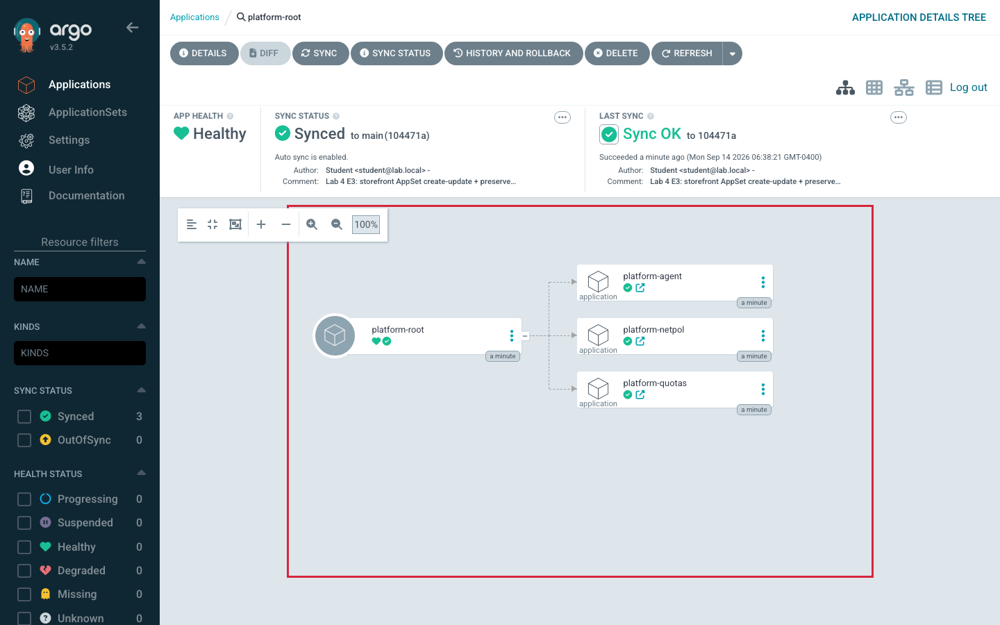
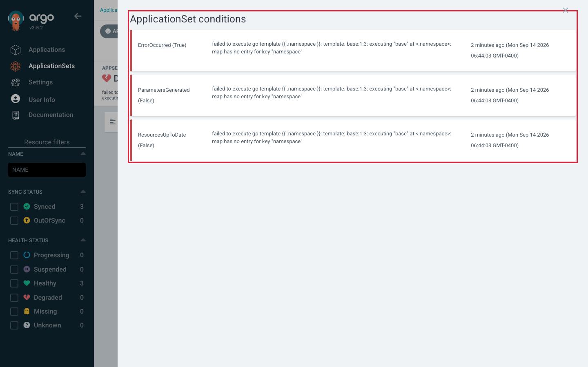
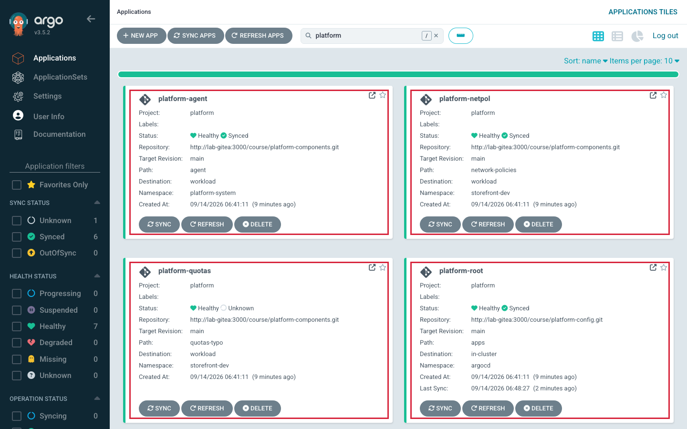

# Lab 4 · Module 3 — App-of-Apps and Tracing Faults

> **Day 2 · Lab 4 · Module 3 of 4 · ~24 minutes**
> **Goal:** apply the App-of-Apps root and read ownership top-down (**E4**); then break the factory and the tree, and trace each fault to the layer that owns it (**E5**).

> **🗺️ Where this module fits.** Module 2 built a factory. This module adds the second pattern — a parent Application that creates child Applications (E4) — and then breaks one thing in each pattern (E5). The skill is the same both times: find **who wrote** the broken thing, and fix it there.

---

## Exercise 4 — Inspect the App-of-Apps hierarchy (L4.4) · ~10 min · Core

> **🧭 What this exercise is for**
> - **In plain words:** an **App-of-Apps** is an ordinary Application whose Git folder contains *other Application files*. When you sync this parent (the **root**), it creates those **child** Applications. Each child then deploys its own real workload.
> - **Think of it like:** a family tree, or a manager with a folder of task sheets. The manager's only job is to hand out each sheet in the folder. Each worker then does their own task.
> - **Connects to:** [Session 5 · Module 3](../session-05/03-app-of-apps-and-choosing.md) — the family tree, and tracing root → repo → child.
> - **Big picture:** unlike the factory, nobody *generated* this list. A person decided exactly which children exist and wrote each one by name. That makes the tree easy to read — and means each child's settings live in a file you can find.

**Goal:** apply the App-of-Apps **root** and watch it bring three **child** Applications into being; then trace each child back to the repo and path it deploys from.

**Starter state.** `root/platform-root.yaml` and `apps/*.yaml` are staged, in the `platform` project. Nothing applied yet.

> **▶ Predict first.** How many child Applications will `platform-root` create, and **what determines that number**? The count is not in the root manifest — it is decided by the files under the root's `source.path` (`apps/`), one child per Application manifest. The root does not *list* its children; it *points at a folder* and adopts whatever is inside.

**Do this — apply the root:**

```bash
cd ~/platform-config
kubectl --context k3d-mgmt apply -f root/platform-root.yaml
argocd app get platform-root
```

**Expected shape:** `platform-root` is `Synced`/`Healthy`, and its resources include three `Application` objects — `platform-quotas`, `platform-netpol`, `platform-agent`.



*Figure SS-L4-08 — `platform-root` owning `platform-quotas`, `platform-netpol`, `platform-agent` — the family tree made real.*

**🔍 Notice:** the root's tree contains *Application* objects, not Deployments — the root deploys **children**, and each child deploys the actual workload. Each child has its own sync/health, independent of the root. Deleting `platform-root` **with cascade** would delete all three children (and their workloads).

<!-- CAPTURE-SPEC: SS-L4-08 — platform-root tree. State: after E4 apply. Highlight: root → three child Application nodes. Argo CD v3.5.2. -->

**▶ Trace each child to its source:**

```bash
for c in platform-quotas platform-netpol platform-agent; do
  echo "== $c =="
  argocd app get "$c" -o json | grep -E '"repoURL"|"path"|"namespace"'
done
```

**What a correct result looks like:** all three children source from the `platform-components` repository, each from a different path (`quotas`, `network-policies`, `agent`), deploying to the workload cluster. You can now name, for any child, the exact repo and path a fix would live in.

**Success criterion:** `argocd app get platform-root` shows the root `Synced`/`Healthy` with three children; you can write each child's **owning repo + path** without opening the UI.

**Hints:**
- *Hint 1:* The root's `path` is a *folder*; every `Application` manifest in it becomes a child. Read `apps/platform-quotas.yaml` for a child's own `source`.
- *Hint 2:* If no children appear, the root may be `OutOfSync`/unsynced — check `argocd app get platform-root`, and confirm the `platform` project permits the `argoproj.io/Application` kind in `argocd`.

### ✅ What you should take away from E4

- **The root creates Applications, not workloads.** Its tree shows three Application objects; each child deploys the real resources.
- **The number of children = the number of Application files in the root's folder.** Add a file, get a child.
- **There are two places to look for any child:** the file in `platform-config/apps/` that *defines* the child, and the path in `platform-components` that the child *deploys*.

---

## Exercise 5 — Break it, then trace each fault to the owning layer (L4.5) · ~14 min · Core (diagnosis)

> **🧭 What this exercise is for**
> - **In plain words:** you break one thing in the factory (Part A) and one thing under the family tree (Part B). For each, you find **which object and which file** really own the broken setting before you change anything.
> - **Think of it like:** a typo in a printed letter. You do not fix it with correction fluid on one copy — the next print run brings the typo back. You fix the original.
> - **Connects to:** [Session 5 · Module 2](../session-05/02-safety-and-controls.md) (`missingkey=error` — failing loud) and [Session 5 · Module 3](../session-05/03-app-of-apps-and-choosing.md) (root health does not include child health; "if your fix reverted, you fixed the wrong layer"). Part B's error is the same **rendering failure** you met in Lab 3.
> - **Big picture:** this is the Capstone skill. The place where you *see* a symptom is often not the place where the fix belongs.

The lab's centrepiece: two faults — one in the factory, one under the family tree. For each, find *the layer that owns it* before changing anything. **If a fix reverts, you fixed the wrong layer.**

Fill this trace table as you go:

| Part | Symptom (what/where) | Owning object | Owning repo + file | Fix you made |
|---|---|---|---|---|
| A | | | | |
| B | | | | |

### Part A — a missing template key (the factory refuses to generate)

**Do this.** In `storefront-gitops`, remove the `namespace:` line from `envs/staging/config.yaml`, commit, push. The template still references `.namespace`, and the ApplicationSet is strict.

> **▶ Predict first.** With `missingkey=error` set, does the ApplicationSet generate a broken staging app, or refuse and report an error? And what happens to the already-generated dev and prod apps?

**What a correct result looks like.** The ApplicationSet reports an **error condition** (`ErrorOccurred`) — "map has no entry for key namespace" — and generates **zero** Applications *for that reconcile*. The existing `storefront-dev-workload` and `storefront-prod-workload` are **untouched** — the factory failed *safe*.

```bash
kubectl --context k3d-mgmt -n argocd get applicationset storefront \
  -o jsonpath='{.status.conditions}' | tr ',' '\n' | grep -iE 'error|message'
```



*Figure SS-L4-07 — the error lives on the **ApplicationSet**, not on any generated Application. **Alpha UI.***

<!-- CAPTURE-SPEC: SS-L4-07 — ApplicationSet error condition. State: after E5A push. Highlight: ErrorOccurred + missing-key message; generated apps unchanged. Argo CD v3.5.2 (Alpha UI). -->

**▶ Optional (~3 min) — feel why strict is safer by turning it off.** While staging's `namespace` is still removed, temporarily delete the `goTemplateOptions: ["missingkey=error"]` line in your local `applicationsets/storefront.yaml`, then preview (no commit, no apply):

```bash
argocd appset generate applicationsets/storefront.yaml -o wide
```

This time there is **no error** — the ApplicationSet cheerfully renders a `storefront-staging-workload` whose namespace is **empty** (`<no value>` in `-o yaml`) and looks normal in a list; it would fail later, elsewhere, in disguise. Restore strictness and re-preview to watch the loud refusal return:

```bash
git checkout -- applicationsets/storefront.yaml
argocd appset generate applicationsets/storefront.yaml -o wide
```

**🔍** One line changed, two behaviours. The safer configuration **failed more, sooner, louder — and that is why it is safer.** Which would you rather be handed at 4 p.m. on a Friday?

**Trace it and fix it.** Symptom on the *ApplicationSet* → owner is the *template + generator input* → file `envs/staging/config.yaml` in `storefront-gitops`. Restore the `namespace:` line, commit, push. The error clears and all three generate again.

> **✅ Part A in one line:** the data for one environment was missing a value, so the strict factory **refused to generate** instead of producing a half-empty app. The evidence was on the **ApplicationSet**, and the fix went in the **data file** (`envs/staging/config.yaml`), not in any Application.

### Part B — a broken child path (the child breaks, the root looks fine)

**Do this.** In `platform-config`, break the `platform-quotas` child: edit `apps/platform-quotas.yaml` and change its `source.path` from `quotas` to something wrong (e.g. `quotas-typo`), commit, push.

> **▶ Predict first.** After this pushes, will `platform-root` be `Healthy` or `Degraded`? And `platform-quotas`? Two different questions one level apart.

**What a correct result looks like.** `platform-quotas` shows a **ComparisonError** (the repo-server cannot render a nonexistent path). But `platform-root` may still report **`Synced`/`Healthy`** — the root's job was only to *apply the child Application object*, and it did. **Root health does not roll up child health.** A green root over a broken child.



*Figure SS-L4-09 — root health answers "did I apply the child object?", not "is the child healthy?".*

**🔍 Notice:** the child's error is a **ComparisonError** — a *rendering* failure at the repo-server (same class as Lab 3). The root's status did not change. Editing the child object directly (`kubectl edit`) would revert — the root owns that spec via the file in `apps/`.

<!-- CAPTURE-SPEC: SS-L4-09 — child broken, root fine. State: after E5B push. Highlight: platform-quotas ComparisonError vs platform-root Synced/Healthy. Argo CD v3.5.2. -->

> **💡 Why the root stays green, in plain words.** The root is like a manager who reports "I handed out every task sheet." That is true — the child Application exists. It says nothing about whether the worker could actually do the task. To know that, you ask the worker: open the child.

**Trace it and fix it.** Symptom on the *child* → but the child's spec is **owned by the root**, written from `apps/platform-quotas.yaml` in `platform-config` → the fix goes in that file, not the live child. Restore `source.path` to `quotas`, commit, push. Confirm the child returns to `Synced`/`Healthy`.

> **✅ Part B in one line:** the child pointed at a folder that does not exist, so the child could not render. The root stayed green because it only creates children. The fix went in the **root's file for that child** (`apps/platform-quotas.yaml`), not in the live child.

**Success criterion:** both parts of the trace table are filled, and for each you can name the owning object *and* the file that fixes it; after both fixes, `appset generate` prints three rows with no error condition, and `platform-quotas` is `Synced`/`Healthy`. Rule in your words: **fix the layer that owns the field, not the layer where the symptom appeared.**

**Hints:**
- *Hint 1 (A):* An ApplicationSet's health lives on the `ApplicationSet` object's `status.conditions`, not the Applications list.
- *Hint 2 (B):* Do not trust the root's colour. Open the child and read *its* condition; ask "who wrote this child's `path`?"
- *Hint 3:* If a fix seems not to take, confirm you pushed a **new** commit.

---

## ✅ Key takeaways from this module

- **An App-of-Apps root creates child Applications from a folder of files;** each child deploys the real workload.
- **A green root can sit above a broken child.** Always open the child to check it.
- **Strict templates fail loudly and safely.** A missing value stops generation instead of creating a wrong app.
- **Find who wrote the broken setting, and fix it there, in Git.** If your fix is undone, you fixed the wrong layer.

**→ Next:** [04 — Pattern showdown and wrap-up](04-showdown-and-wrap-up.md)
