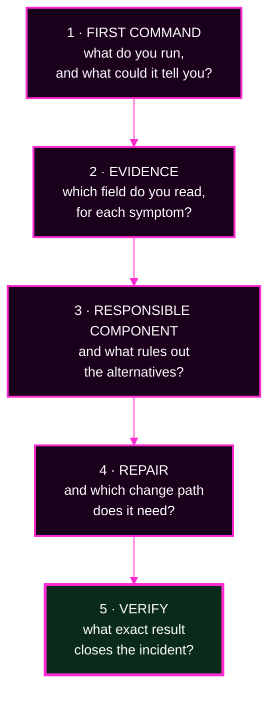

# Lab 4 · Module 4 — Compare the Patterns, Then the Bridge Incident

> **Day 2 · Lab 4 · Module 4 of 4 · 15 minutes**
> **Run every command in your VM terminal**, after `source ~/argo-lab-env.sh`.
> **← Back to:** [Day 2 map](../README.md) · [Lab 4](README.md)

---

## Module TL;DR

- **What this is.** One task worked through both patterns (E6), then a five-decision incident under capstone rules (E7).
- **Why it matters.** E6 makes the choice defensible in a design review. E7 is the closest thing to the capstone you will do before the capstone.
- **What to remember.** *ApplicationSet gives you leverage; App-of-Apps gives you legibility.* And: **evidence comes before change.**
- **The most common mistake.** In E7, naming a component before gathering the evidence that would distinguish it from the alternatives.

---

# Exercise 6 — Pattern showdown: retire an environment · 5 min

## Why

Real platforms use both patterns. Knowing the trade-offs lets you defend a choice in a design review, or explain one in an incident review.

## Starting state

Seven Applications, all `Synced` and `Healthy`. **This exercise runs no commands and changes nothing.**

## Mental model

**Comparing a rubber stamp with a handwritten note.** A stamp makes many identical copies fast, and repeats any mistake just as fast. A handwritten note is slower, but you can read exactly what it says.

## The task

**Staging is being decommissioned.** Work out, on paper, how that plays out under each pattern:

1. As an entry in the **storefront ApplicationSet** — you remove staging's `config.yaml` from the Git-files input.
2. As a hypothetical **App-of-Apps** where each environment is a hand-written child — you delete `apps/storefront-staging.yaml`.

## Predict — fill this in yourself

| Operational question | ApplicationSet: remove the input | App-of-Apps: delete the child |
|---|---|---|
| **Files touched** | | |
| **Who reviews it**, and can they tell what it will do? | | |
| **Blast radius** — what else could this move? | | |
| **Deletion behaviour** — what happens to staging's Application and its workload? | | |
| **Preview** — can you see the effect before applying? | | |
| **Cost of one typo** — worst case from one mistyped character? | | |

**Every cell should reference something you actually did in E1 to E5.** If a cell is a guess, go back and check.

### Staged hints

<details>
<summary><b>Hint 1 — what to inspect</b></summary>

Do not reason about this abstractly. Every row has an answer you produced in E1 to E5.

Go back to what you actually ran. The deletion row, in particular, is E3.
</details>

<details>
<summary><b>Hint 2 — which command or object to examine</b></summary>

For the ApplicationSet column, the preview command is still the tool:

```bash
cd ~/platform-config
argocd appset generate applicationsets/storefront.yaml -o wide
```

For the App-of-Apps column, the equivalent is reading the folder and the root's sync policy:

```bash
ls ~/platform-config/apps/
grep -A3 syncPolicy ~/platform-config/root/platform-root.yaml
```
</details>

<details>
<summary><b>Hint 3 — how to interpret what you get back</b></summary>

The **deletion** row is the one people get wrong, because each pattern has **two** separate controls:

- For the factory: `applicationsSync` decides the **Application**, and `preserveResourcesOnDeletion` decides the **workload**.
- For the tree: the root's `prune` decides the **child Application**, and the child's own finalizer decides the **workload**.

Answer each half separately.
</details>

<details>
<summary><b>Final hint — the direction</b></summary>

The **preview** row is the sharpest asymmetry, and it is the one to lead with in a design review: one pattern has a command that shows you the future, and the other does not.

The **cost of one typo** row is where blast radius and deletion semantics meet. A typo in factory data is multiplied by the generator. A typo in a hand-written child is not — but the two delete very differently.
</details>

<details>
<summary>Show a worked version once yours is complete</summary>

| Question | ApplicationSet | App-of-Apps |
|---|---|---|
| **Files touched** | one data file, in `storefront-gitops` | one Application file, in `platform-config` |
| **Who reviews it** | a reviewer sees a deleted data file, and must **know the generator** to predict the effect | a reviewer sees a named Application being deleted — obvious on its face |
| **Blast radius** | bounded by the generator: it removes one row. But a mistyped **glob** could remove many | exactly one child, always |
| **Deletion behaviour** | decided by `applicationsSync`. With `create-update` (E3), the Application **survives as an orphan**. Its workload is separately governed by `preserveResourcesOnDeletion` | decided by the root's `prune`, and then by the child's own finalizer. E4 showed the course's children carry none |
| **Preview** | yes — `argocd appset generate`, which you ran repeatedly | **no equivalent.** You reason about it by reading the file and the root's sync policy |
| **Cost of one typo** | multiplied by the generator. E2 showed one selector line doubling the fleet | limited to the one child you mistyped |

**Neither pattern wins.** The factory is cheaper per environment and riskier per keystroke. The tree is more work per environment and more predictable per keystroke.
</details>

## Explain why

**Write one sentence for each, defended on operations rather than taste:**

- One situation where you would clearly prefer the **ApplicationSet**.
- One situation where you would clearly prefer the **App-of-Apps**.

> **The one question that decides it: is this list *derived* or *decided*?**

## ✅ Key Takeaways — E6

- **Neither pattern is better.** Each is cheaper for some jobs and riskier for others.
- **The factory gives you leverage** — one change, many apps, and a preview command — **and it multiplies mistakes.**
- **The family tree gives you legibility** — every child is a file a person can read — **and it needs more hand-written files.**
- **Deletion works differently in each**, and in both cases it is decided by configuration you chose in advance.

---

# Exercise 7 — The bridge incident · 10 min

## Why

The capstone gives you seven faults and no labels. This exercise gives you one fault and no labels, under the same rules, so that the capstone is not the first time you work this way.

## The rules, exactly as the capstone applies them

1. **Find out what is true before you touch anything.**
2. **Evidence comes before change.** Your first destructive action should be the fix.
3. **Write down what you expect to learn before you run a command.**

## Starting state

You are on call. It is Tuesday morning. **You have run no commands yet.**

## The report

> **From the storefront team, 09:12:**
> *"Something is wrong with our environments. We're seeing a `storefront-dev` Application we don't recognise — it's pointing at the management cluster. And `platform-quotas` has gone `Unknown`. Nobody on our team deployed anything since Friday."*

## The five decisions

Answer each one **in writing, in order, before opening the next**. Do not skip ahead — the ordering is the exercise.




---

### Decision 1 — What is the first command you would run, and why?

**Write down:** the exact command, **and** at least two different results you might get, and what each would tell you.

<details>
<summary>Show the discussion</summary>

**A strong first move is to scope the incident**, not to investigate either symptom:

```bash
argocd app list -o wide
```

**Why this first?** The report contains **two** symptoms. Before investigating either, you need to know whether they are one problem or two. That takes one read-only command.

**What different results would tell you:**

- **An unexpected `-in-cluster` Application appears, and `platform-quotas` is `Unknown`** → two symptoms that may or may not be related. You now have the full inventory to compare against your known-good state.
- **Many Applications are affected, sharing one repository** → a shared-dependency failure, and both reported symptoms may be downstream of it.
- **Only the two reported Applications are affected** → two independent faults, to be worked separately.

**What makes a weak first move:** running `kubectl logs` on anything. You have not yet established which component is implicated, so you would be reading logs at random.
</details>

---

### Decision 2 — What evidence do you need, for each symptom?

**Write down:** for the unexpected Application, and for `platform-quotas`, the specific evidence that would identify the responsible layer. Name the command and the field you would read.

<details>
<summary>Show the discussion</summary>

**For the unexpected `storefront-dev-in-cluster`:** the question is **who created it**, because you know no person did.

```bash
kubectl --context k3d-mgmt -n argocd get application storefront-dev-in-cluster \
  -o jsonpath='{.metadata.ownerReferences}' ; echo
kubectl --context k3d-mgmt -n argocd get applicationset storefront \
  -o jsonpath='{.spec.generators}' ; echo
```

An `ownerReference` naming an ApplicationSet says a **factory** wrote it. Then the generator's selector tells you **why** it produced an extra row.

> **The two patterns record ownership in two different places, and you need both.** Verified on this course environment:
>
> | Written by | Where the ownership is recorded | What it looks like |
> |---|---|---|
> | an **ApplicationSet** | `metadata.ownerReferences` | `{"kind":"ApplicationSet","name":"storefront",...}` |
> | an **App-of-Apps root** | the `argocd.argoproj.io/tracking-id` annotation | `platform-root:argoproj.io/Application:argocd/platform-quotas` |
>
> **An App-of-Apps child has *no* `ownerReferences` at all.** So a single empty result does not mean "nobody wrote it" — it means "not a factory." Check the annotation next:
>
> ```bash
> kubectl --context k3d-mgmt -n argocd get application <name> \
>   -o jsonpath='{.metadata.annotations.argocd\.argoproj\.io/tracking-id}' ; echo
> ```
>
> The value's first field is the name of the Application that wrote it.

**For `platform-quotas`:** the question is **what kind of failure** `Unknown` represents.

```bash
kubectl --context k3d-mgmt -n argocd get application platform-quotas \
  -o jsonpath='{range .status.conditions[*]}{.type}: {.message}{"\n"}{end}'
```

A `ComparisonError` naming a path is a **rendering** failure. A message naming a project is an **authorization** failure. A message naming a ServiceAccount is a **cluster permission** failure. They look identical as badges and are completely different problems.

**The habit being tested:** you named the field you would read, not just the command. "Run `argocd app get`" is not evidence; reading its `CONDITION` block is.
</details>

---

### Decision 3 — Which component is responsible for each symptom?

**Write down:** for each symptom, the responsible component **and** the one piece of evidence that rules out the alternatives.

<details>
<summary>Show the discussion</summary>

**For the unexpected Application: the ApplicationSet controller**, acting correctly on a changed selector.

The evidence that rules out alternatives is the **`ownerReference`**. It proves no person created this Application and no root created it. A factory did.

**This is the E2 lesson arriving as an incident.** Somebody widened the cluster selector. Every component then behaved correctly: the generator matched two clusters instead of one, the matrix produced six rows instead of three, and the controller created what it was told to create.

**For `platform-quotas`: the repo-server**, which could not render the child's source.

The evidence that rules out alternatives is the **`ComparisonError` message naming a path**. If it named a project you would be looking at an AppProject; if it named a ServiceAccount you would be looking at the workload cluster's RBAC.

**And the ownership question from E5:** the child's `path` was written by `platform-root`, from a file in `platform-config/apps/`.

**Are the two symptoms related?** Nothing so far connects them. Two unrelated faults in one report is normal, and assuming they must share a cause is a classic way to lose an hour.
</details>

---

### Decision 4 — What is the repair for each, and which path do you use?

**Write down:** the repair, and whether it is a Git commit, a `kubectl apply` of a declarative file, or a deliberate Argo CD operation.

<details>
<summary>Show the discussion</summary>

**For the selector:** restore the selector to `cluster-role: workload` in `platform-config/applicationsets/storefront.yaml`, then commit, push, **and apply**.

**Both halves matter, and this is the subtle part.** Nothing in this environment reconciles the ApplicationSet object itself from Git — the platform team applies it with `kubectl`. Pushing the commit alone would leave the **live** generator untouched and the extra Applications in place.

**Then a separate decision:** the three extra `-in-cluster` Applications. Under `create-update` (which you set in E3), the factory **will not delete them**. They are orphans, and removing them is a deliberate act:

```bash
argocd app delete storefront-dev-in-cluster --cascade=false
```

**Write down what a cascade decision means before you run it.** `--cascade=false` removes the Application object and leaves anything it deployed. The default removes the managed resources too.

**For the child path:** fix `source.path` in `platform-config/apps/platform-quotas.yaml`, then commit and push. **No apply is needed**, because `platform-root` reconciles that folder from Git automatically.

**Two faults, two different change paths, for a reason you can state:** one object is reconciled from Git, the other is applied by hand. Knowing which is which is what [Session 7](../../day-2/session-07/01-investigation-stations.md) calls finding the owner before choosing the path.
</details>

---

### Decision 5 — How do you verify each repair?

**Write down:** the exact command, and the exact result that would let you close the incident.

<details>
<summary>Show the discussion</summary>

**Verify with the same evidence you diagnosed with.** That is the rule, and it is not a slogan — it is what stops you closing an incident on a stale badge.

**For the selector:**

```bash
cd ~/platform-config
argocd appset generate applicationsets/storefront.yaml -o yaml | grep -c 'kind: Application'
kubectl --context k3d-mgmt -n argocd get applications -o name | grep -c storefront-
```

**Closing condition: both print `3`.** The preview proves the factory is fixed; the live count proves the orphans are gone. **You need both**, because E3 showed those two numbers can legitimately disagree.

**For the child:**

```bash
kubectl --context k3d-mgmt -n argocd get application platform-quotas \
  -o custom-columns='PATH:.spec.source.path,SYNC:.status.sync.status,HEALTH:.status.health.status'
kubectl --context k3d-mgmt -n argocd get application platform-quotas \
  -o jsonpath='{range .status.conditions[*]}{.type}{"\n"}{end}'
```

**Closing condition:** `quotas`, `Synced`, `Healthy`, and **no conditions at all**.

**Allow time.** E5 measured about 100 seconds from push to recovery. A badge that has not caught up yet is not a failed repair.
</details>

---

## ✅ Key Takeaways — E7

- **Scope before you investigate.** Two symptoms may be one problem or two, and one command tells you which.
- **Name the field, not just the command.** Evidence is what you read, not what you run.
- **An `ownerReference` answers "who wrote this?"** — the question both Day 2 patterns make you ask.
- **The repair path depends on who owns the object.** Some things reconcile from Git; some are applied by hand.
- **Verify with the same evidence you diagnosed with**, and allow reconciliation time before concluding.

---

## Troubleshooting reference for the whole lab

| Symptom | Likely cause | What to do |
|---|---|---|
| `appset generate` fails with `map has no entry for key` | strict templating caught a variable the generator does not supply — **working as designed** | correct the variable name, or restore the missing key in the data file |
| Preview succeeds but a column reads `<no value>` | the ApplicationSet is **not** strict | restore `goTemplateOptions: ["missingkey=error"]` |
| Preview prints only the header row, no error | the cluster selector matches no cluster | check the selector against the labels from Module 1 |
| Preview rows contain the text `TODO` | the selector works; other TODOs are unfilled | finish every TODO and re-preview |
| Preview shows more apps than you expected | a selector or glob matches more than intended | **do not apply.** Narrow it until the preview matches your prediction |
| You fixed a generated or child app with `kubectl edit` and it reverted | you edited the wrong layer | change the owning file in Git and push |
| `platform-root` is `Healthy` but something is broken | root health answers "did I apply the child object?" | open the **child** and read its own conditions |
| You removed a generator input and the Application vanished | the protection policy was not in effect when the controller noticed | confirm with `kubectl --context k3d-mgmt -n argocd get applicationset storefront -o jsonpath='{.spec.syncPolicy}'` |
| A change does not seem to take effect | reconciliation has not run yet | allow up to about 3 minutes, then re-check. Confirm you pushed a **new** commit |

---

## Lab 4 checkpoint

You have finished Lab 4 when **all** of these are true.

**1 — The three generated Applications are healthy.**

```bash
argocd app list -o wide | grep 'argocd/storefront-'
```

**Expected:** three Applications, `Synced` and `Healthy`, with **prod and only prod** on `storefront-1.0.0`.

**2 — The root tree exists and you can trace it.**

```bash
argocd app get platform-root
```

**Expected:** `Synced`/`Healthy`, owning three children. You can name each child's owning repository and path without opening the user interface.

**3 — The protection policy is live.**

```bash
kubectl --context k3d-mgmt -n argocd get applicationset storefront -o jsonpath='{.spec.syncPolicy}' ; echo
```

**Expected:** `{"applicationsSync":"create-update","preserveResourcesOnDeletion":true}`

**4 — Everything is green.**

```bash
kubectl --context k3d-mgmt -n argocd get applications \
  -o custom-columns='NAME:.metadata.name,SYNC:.status.sync.status,HEALTH:.status.health.status'
```

**Expected:** seven Applications, all `Synced` and `Healthy`.

**5 — You can state the E5 trace** — the owning object and the file that fixes it — and explain why editing the live object would have reverted.

> **If any check fails**, `reset-lab.sh CP-lab-05 --local` restores this exact end state. That checkpoint carries your completed, protected ApplicationSet and a healthy `platform-root` tree forward into Lab 5.

---

## ✅ Key Takeaways from the whole of Lab 4

- **Preview before you apply.** `argocd appset generate` costs seconds; an unplanned rollout costs an afternoon.
- **Predict the count *and* the names.** The count catches "wrong number"; the names catch template bugs.
- **Zero is a valid generator output**, and where deletion is permitted, zero means "delete them all."
- **The dangerous bug is a successful render of the wrong thing.** Strict templating turns a silent empty value into a loud local error.
- **A healthy parent does not necessarily mean every child workload is healthy.**
- **Fix the layer that owns the field.** If your fix reverts, you fixed the wrong layer.
- **`project` is never templated** — a tenant boundary must not be selectable by data.
- **ApplicationSet gives you leverage; App-of-Apps gives you legibility.**

---

## Optional stretch challenges — outside the timebox

**1 — Make the root reflect child failure.** By default Argo CD does not assess the health of an `Application` nested inside another Application, which is why the broken child did not turn the root red. Add a custom Lua health check for that kind through `resource.customizations`, applied with `apply-argocd-config.sh <your-file>`. Then re-run E5 and compare. Write two sentences on the trade-off: a root that rolls up child health is easier to alert on, but hides *which* layer owns a fault. **Clean up:** revert the commit and re-run `apply-argocd-config.sh` with no argument.

**2 — The name collision.** Write a *separate* ApplicationSet — call it `collision-test`, with no automated sync policy so nothing can deploy — whose template name ignores the environment, so all three rows render the **same** `metadata.name`. **Predict, then preview:** does `argocd appset generate` warn you? **Predict, then apply:** one Application repeatedly rewritten, three, or none? Read the new ApplicationSet's conditions. Write two sentences on *where* each check happens — the preview or the controller. **Clean up:** `kubectl --context k3d-mgmt -n argocd delete applicationset collision-test`.

**3 — Add a merge generator.** Extend the ApplicationSet with a **merge** generator so a per-environment override, such as a prod-only `replicaCount`, layers onto the matrix. **Preview only — do not apply.** Strict templating still applies, so a key that only prod has will fail for dev and staging if the template references it directly. Find a way to add the setting only where the key exists.

---

## Final module TL;DR

- **What this is.** The pattern comparison, and a five-decision incident under capstone rules.
- **Why it matters.** E7 is the last rehearsal before the real thing.
- **What to remember.** Scope first, name the field you will read, and verify with the evidence you diagnosed with.
- **The most common mistake.** Assuming two symptoms in one report must share a cause.

---

## Transition — what is next

You built both patterns, protected one against accidental deletion, and traced two faults to their owning layers.

**Notice what protected you each time: a guardrail.** Strict templating, `create-update`, a hard-coded `project`. Every one of them answered the question *"what is this factory allowed to do?"*

More Applications means more risk, so the next step is rules about **who may do what**. **[Session 6](../session-06/README.md)** makes those boundaries explicit — four authorization gates, four owners, four error signatures. Then **[Lab 5](../lab-05/README.md)** has you build a fence around a new tenant and feel each denial land in the layer you predicted.

**→ Next:** [Session 6 — Security, Multi-Tenancy, and Governance](../session-06/README.md)
