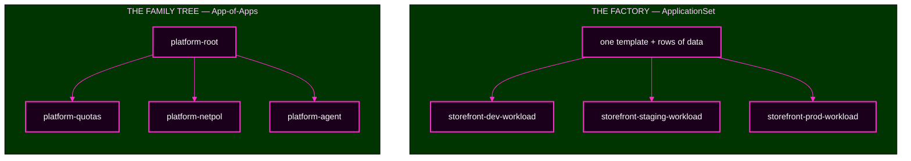

# Lab 4 — Build and Troubleshoot the Patterns

> **Day 2 · Lab 4 · Hands-on · 75 minutes**
> **Argo CD version this course targets: `v3.5.2`** (Helm chart `10.8.4`, Kubernetes `v1.35`; repo-server renders with **Helm v4.2.1**).
> **Starting checkpoint: `CP-lab-04`.**
> **Before this:** [Session 5](../session-05/README.md) and all of Day 1.
> **← Back to:** [Day 2 map](../README.md)

---

## Lab TL;DR

- **What this is.** You build both Day 2 patterns for real, break each one on purpose, and trace each fault to the layer that owns it.
- **Why it matters.** The capstone grades one skill hardest: **finding the layer that owns a failure before you touch anything.**
- **What to remember.** *Preview, count, apply.* And: **if your fix reverts, you fixed the wrong layer.**
- **The most common mistake.** Fixing the Application you can see instead of the file that wrote it.

---

## Why this lab exists

On Day 1 you took **one** Application from commit to running workload. That does not scale.

Hand-writing one Application per target means every copy is a place to make a typo, and every typo is a separate incident. Day 2's two patterns solve that — and each one introduces a new way to fail.

| Pattern | What it gives you | The new danger |
|---|---|---|
| **ApplicationSet** — a factory | leverage: one change, many Applications | **blast radius** — one wrong line moves every generated app |
| **App-of-Apps** — a family tree | legibility: every child is a file you can read | **misread ownership** — a green root above a broken child, and fixes that silently revert |

You will build both, break both, and fix both. Then you will run a short incident that rehearses the capstone.

---

## What you will do

| # | Exercise | You will | Module |
|---|---|---|---|
| **E1** | Build the factory | complete a real ApplicationSet and prove with a preview that it produces exactly three Applications | 2 |
| **E2** | Move the blast radius | widen one selector, preview the result, and throw it away without applying | 2 |
| **E3** | Break the factory once | remove a required value and watch strict templating refuse, loudly and safely | 2 |
| **E4** | Build the family tree | apply an App-of-Apps root and trace each child to its repository and path | 3 |
| **E5** | Break the tree once | break one child and watch the root stay green above it | 3 |
| **E6** | Compare the patterns | work one real task through both patterns and defend a choice | 4 |
| **E7** | The bridge incident | five decisions under capstone rules | 4 |

---

## Two mental models, side by side



**Everything below the top box in both halves is an ordinary Application**, reconciled by the same controller you used on Day 1. Only **who wrote the Application** changed.

So every failure in this lab reduces to one question: **is the Application wrong, or is the thing that wrote it wrong?**

---

## Before you start: where you are running

Every command in this lab runs in your **VM terminal**, after:

```bash
source ~/argo-lab-env.sh
```

You will use **two Kubernetes contexts**, and naming the wrong one is the most common source of confusing output:

| Context | Holds | You look here for |
|---|---|---|
| `k3d-mgmt` | Argo CD | Applications, ApplicationSets, AppProjects |
| `k3d-workload` | the deployed workloads | Deployments, Pods, Services |

**Every `kubectl` command in this lab spells out `--context` in full.** Keep it that way. If a result surprises you, check `kubectl config current-context` before believing it.

**Two Git clones** are involved, and they own different things:

| Clone | Owns |
|---|---|
| `~/platform-config` | the ApplicationSet, the App-of-Apps root, the child Application files, the AppProjects |
| `~/storefront-gitops` | the storefront chart, and the per-environment values and config files |

**You will also open the Argo CD user interface** at `https://localhost:8443`, in Firefox **inside the VM desktop**, logged in as `admin`.

---

## The four modules

| Module | You will | Exercises | Time |
|---|---|---|---|
| [01 — Starting state and the preview habit](01-environment-and-preview.md) | confirm the clean slate; install preview → count → apply | — | 10 min |
| [02 — Build the factory, and break it once](02-build-and-protect-the-factory.md) | complete the ApplicationSet; move the blast radius; break it with a missing key | **E1, E2, E3** | 25 min |
| [03 — Build the family tree, and break it once](03-app-of-apps-and-trace-faults.md) | apply the root; trace the children; break one child | **E4, E5** | 25 min |
| [04 — Compare the patterns, then the bridge incident](04-showdown-and-wrap-up.md) | compare on one task; run a five-decision incident | **E6, E7** | 15 min |

**Each module page is the authoritative version of its content.** This page is a map.

---

## How hints work in this lab

Every exercise has **staged hints**. Open them one at a time, in order, and try the suggestion before opening the next.

| Hint | Tells you |
|---|---|
| **Hint 1** | what to inspect |
| **Hint 2** | which command or object to examine |
| **Hint 3** | how to read what you got back |
| **Final hint** | the likely direction of the fix |

**The final hint is never the finished answer.** Working out the last step is the exercise.

---

## Recovering from anything

Everything in this lab is recoverable. Nothing you can do here is permanent.

| Situation | What to do |
|---|---|
| A Git commit broke something | `git revert --no-edit HEAD && git push` in that clone |
| A local edit went wrong, not yet committed | `git checkout -- <file>` in that clone |
| An Application is in a state you cannot explain | `argocd app get <name>` and read the `CONDITION` block before changing anything |
| The whole lab is tangled | `reset-lab.sh CP-lab-04 --local` and start the module again |

> **`reset-lab.sh` without `--verify-only` discards any work you have not committed and pushed.** That is what makes it a clean restart.

---

## Final TL;DR

- **Build both patterns, break both, fix both** — 75 minutes, seven exercises.
- **Preview, count, apply** before every factory change.
- **Find who wrote the broken thing**, and fix it there, in Git.
- **The most common mistake** is editing the layer where the symptom appeared.

**→ Start:** [01 — Starting state and the preview habit](01-environment-and-preview.md)
