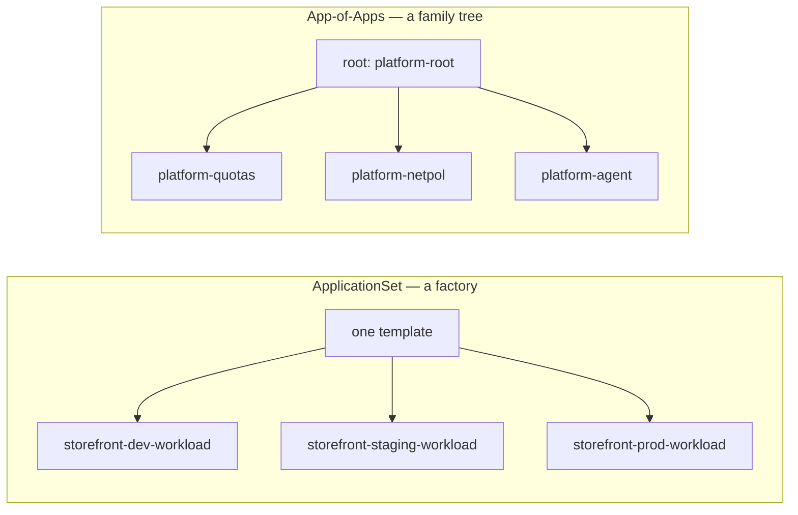

# Lab 4 — Build and Troubleshoot the Patterns (modular arc)

> **Day 2 · Lab 4 · Hands-on · ~75 minutes · Scaffolding G2 (reduced)**
> **Argo CD version this course targets: `v3.5.2`** (Helm chart `10.8.4`, Kubernetes `v1.35`; repo-server renders with **Helm v4.2.1**).
> **Before this:** [Session 5](../session-05/README.md) and all of Day 1. Every *new* idea is explained before you use it; Day-1 mechanics are not re-explained — you will often write a command yourself first.
> **Open:** the Argo CD UI (`https://localhost:8443`, `admin`), a terminal with `argocd`/`kubectl` (`source ~/argo-lab-env.sh`), and your clones of `platform-config` and `storefront-gitops`.

---

## Why this matters

On Day 1 you took **one** application from commit to running workload. That does not scale: hand-writing one `Application` per target means every copy is a place to make a typo, and every typo is a separate incident. Day 2's two patterns solve that, each with a new failure mode:

- An **ApplicationSet** is a factory — describe the shape once, feed it data, it stamps out one Application per combination. New danger: **blast radius** — one wrong template line moves *every* generated Application; one removed label can quietly delete a fleet.
- An **App-of-Apps** is a family tree — one *root* owns several *child* Applications. New danger: **misread ownership** — a root that reports `Healthy` over a broken child, and "fixes" applied to the wrong layer that silently revert.

This lab builds both, then deliberately breaks them, to practise the one skill the Capstone grades hardest: **finding the layer that owns a failure before you touch anything.**

---

## Learning objectives

1. Generate Helm Applications for multiple environments by completing a real ApplicationSet (a *matrix* of cluster + Git-files generators), proving with a preview it produces exactly what you intended (**L4.1**).
2. Use labels and cluster data to control placement, previewing how a selector change moves the blast radius (**L4.2**).
3. Apply a protection policy (`applicationsSync: create-update` + `preserveResourcesOnDeletion`) and prove a generated Application *survives* a removed input (**L4.3**).
4. Inspect a root/child hierarchy, tracing each child to its repo and path (**L4.4**).
5. Introduce a template error and a child-application error, trace each to the owning layer, recover through Git (**L4.5**).
6. Compare the same change under each pattern, scored on operations (**L4.6**).

Maps to outcomes **O4, O5, O6, O7**.

---

## Mental model recap (short — Session 5 taught this)

- **The ApplicationSet is a factory** — you write the *thing that writes* the Applications. When a generated app is wrong, ask "what is wrong with the factory that produced it?"
- **The App-of-Apps is a family tree** — the root's *health* answers "did I apply the child objects?", **not** "are the children healthy?" (the Exercise 5B trap).
- **The same controller reconciles both** — a generated app and a child app are ordinary `Application` objects. Only *who wrote the object* changed. So every failure localizes to: **is the Application wrong, or is the thing that wrote it wrong?**

---

## The big picture in plain words

**Where this lab sits in the course.** On Day 1 you wrote each Application by hand: one file, one app. Day 2 asks what happens when you have many. This lab is **not** a new way to deploy — every Application you meet here is reconciled exactly like Day 1's. What changes is **who writes the Application files**: a factory (an ApplicationSet) or a parent Application (App-of-Apps).

**Two analogies to hold onto (both from Session 5):**

- **An ApplicationSet is a factory with a mail-merge.** You write one letter with blanks (the template) and give it a list (the generators). It prints one finished Application per row of the list. Change the letter and every copy changes. Change the list and copies appear or disappear.
- **An App-of-Apps is a family tree.** A human wrote down, by name, which children the root has. The root's job is only to create those children; each child then deploys its own workload.

| In the analogy… | In this lab… | Module |
|---|---|---|
| Checking the list and doing a print preview before printing 300 letters | Cluster labels, and `argocd appset generate` | 1 |
| Filling in the blanks in the letter so it prints exactly three copies | Completing the storefront ApplicationSet | 2 · E1 |
| Changing the mailing list from "one street" to "the whole city" | Widening the cluster selector | 2 · E2 |
| Allowing the factory to build and repaint, but never demolish | `applicationsSync: create-update` | 2 · E3 |
| Reading the family tree from the top down | Tracing `platform-root` to its children | 3 · E4 |
| A letter with a blank name, and a manager who says "tasks handed out" while one task failed | A missing template key, and a green root over a broken child | 3 · E5 |
| Deciding which tool to use for a job | Comparing the two patterns on one task | 4 · E6 |

**How this lab connects to the sessions and to Day 1**

| You learned it in… | You use it in… |
|---|---|
| [Session 5 · Module 1 — the factory and its generators](../session-05/01-applicationsets-the-factory.md) | Modules 1 and 2 |
| [Session 5 · Module 2 — failing loud, bounding the blast radius, preview → count → apply](../session-05/02-safety-and-controls.md) | Module 2 (E2, E3) and Module 3 · E5 Part A |
| [Session 5 · Module 3 — App-of-Apps and choosing a pattern](../session-05/03-app-of-apps-and-choosing.md) | Module 3 and Module 4 · E6 |
| Lab 2 — cluster Secrets with labels, and AppProjects | Module 1 (the labels the factory selects on) and the `project` field in every Application |
| Lab 3 — `ComparisonError` means a rendering failure; fix the owning repo | Module 3 · E5 Part B |

---

## The four modules

| Module | You will... | Exercises | ~Time |
|---|---|---|---|
| [01 — Environment and the preview rhythm](01-environment-and-preview.md) | Confirm the clean slate; install preview→count→apply | — | ~10 min |
| [02 — Build and protect the factory](02-build-and-protect-the-factory.md) | Complete the ApplicationSet; move the blast radius; protect against deletion | **E1, E2, E3** | ~31 min |
| [03 — App-of-Apps and tracing faults](03-app-of-apps-and-trace-faults.md) | Inspect the root/child tree; break it two ways and trace each | **E4, E5** | ~24 min |
| [04 — Pattern showdown and wrap-up](04-showdown-and-wrap-up.md) | Compare patterns on one task; checkpoint and stretch | **E6** | ~10 min |

Each module has short **🧭 What this is for** notes at the start of every section and **✅ Key takeaways** at the end.

**→ Start:** [01 — Environment and the preview rhythm](01-environment-and-preview.md)
