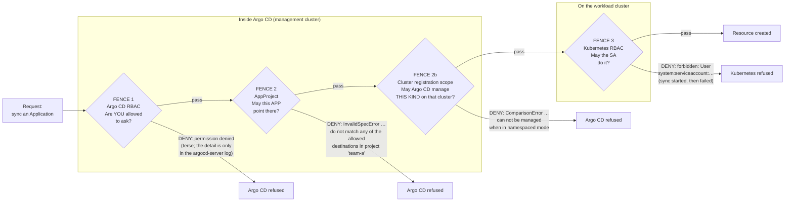
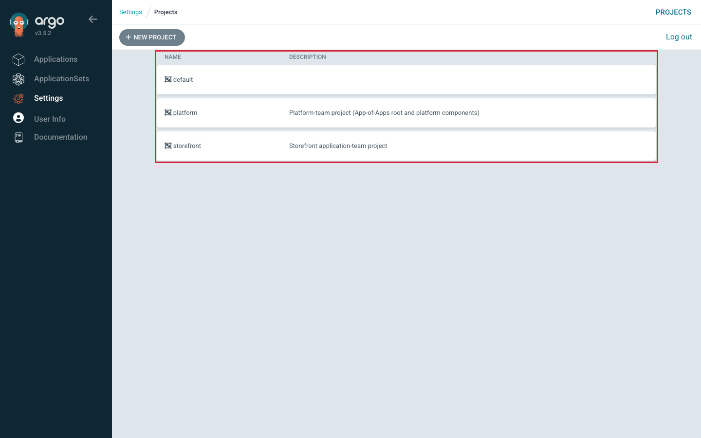

# Lab 5 — Enforce Platform Guardrails

> **Day 2 · Lab 5 · Hands-on lab guide · ~50 minutes on the required path**
> **Argo CD version this course targets: `v3.5.2`** (Helm chart `10.8.4`, Kubernetes `v1.35`; the repo-server renders charts with **Helm v4.2.1**).
> **Scaffolding level: G2 (reduced).** Every *new* idea in this lab — how an AppProject fences an Application, how an Argo CD RBAC policy line is written, how to tell an Argo CD denial from a Kubernetes denial — is explained in full **before** you use it. What is *no longer* re-explained is the mechanics you already own from Day 1 and Lab 4: logging in, finding an Application, reading a diff, running `argocd app …` and `kubectl --context …`. From here on you will often **write a manifest or a policy line yourself** before the guide confirms one correct shape.
>
> **Time budget (measured, not estimated):**
>
> | Part | Time |
> |---|---|
> | Sections 1–6: reading, mental model, environment check, guided walkthrough | ~5 min |
> | Exercise 1 — build the fence and grant the account | 8 min |
> | Exercise 2 — prove the happy path | 5 min |
> | Exercise 3 — two refused attempts | 6 min |
> | Exercise 4 — Argo CD denial vs Kubernetes denial (the centerpiece) | 12 min |
> | Exercise 5 — protect against unintended deletion | 5 min |
> | Section 9 checkpoint + Section 10 takeaways | ~5 min |
> | **Required path total** | **~46 min** |
> | Section 11 stretch challenges (optional, outside the clock) | +10–25 min |
>
> Budget closer to **50 minutes** if this is your first time writing an AppProject from a specification. Each time you apply Argo CD configuration you are logged out and log in again, which costs about a minute per apply; the guide tells you exactly where that happens.
>
> **What you need open before you start:**
> - your SSH (Secure Shell) session to the VM (virtual machine), from the student setup guide,
> - a browser with the Argo CD tunnel running (`https://localhost:8443`), logged in as `admin`,
> - the `argocd` command line, already logged in as `admin` (confirm with `argocd account get-user-info`),
> - a terminal where you can `git` against your own clone of the `platform-config` repository (it lives at `~/platform-config`; the commands below run from your home directory, `~`).

---

## 1. Why this matters

A guardrail you have never tried to break is not a guardrail — it is a hope.

When you add a restriction to a platform, nothing lights up green to tell you it works. Configuring an AppProject to forbid a destination produces *no* feedback at all until the day someone points an Application at the wrong place. The only evidence a fence exists is **an attempt that was refused**, and the only evidence it is a *good* fence is that the refusal **said something useful** — it named the rule and the offending value, so the person who hit it can fix their own mistake without paging you.

So this lab is built around that idea. You will fence in a brand-new tenant — **team-a** — and then genuinely try to walk through the fence four different ways. Each attempt is refused by a *different* guard, with *different* error text, logged in a *different* place, fixed by a *different* team. The whole skill of the lab is reading past the red badge to the **layer that actually said no**.

You will also discover that one of the four refusals does **not** come from the guard you expect. That is not a flaw in the exercise; it is the most useful thing in this lab. Real platforms are defended in depth, several guards can refuse the same request, and only one of them gets to speak first.

That skill is exactly what the Day 2 Capstone grades hardest: when an Application is stuck, "permission denied" is not a diagnosis. "*Which* permission system denied it" is.

By the end you will be able to:

- build a restrictive AppProject and prove each restriction by trying to violate it;
- tell, from an error message alone, whether **Argo CD** refused the request or **Kubernetes** refused it — the outline's explicit "compare an Argo CD authorization failure with a Kubernetes authorization failure";
- grant a tenant the *least* privilege that still lets it work, and unit-test that grant **before** shipping it;
- and protect Applications from unintended deletion as a governance boundary, not only a blast-radius control.

---

## 2. Learning objectives

By the end of this lab you will be able to:

1. **Create a restricted AppProject** for team-a from a specification — one source repository, one destination, no cluster-scoped resources, and a deliberately short list of allowed namespaced kinds — and write the Argo CD RBAC policy that lets a team account use it (outline bullet **L5.1**).
2. **Permit an approved source, namespace, and workload cluster** by creating a real Application that reaches `Synced`/`Healthy` *because* it lands inside every fence (**L5.2**).
3. **Block an unauthorized destination and a cluster-scoped resource**, predicting and then observing exactly which guard refuses each one — including when two guards could have refused and only one did (**L5.3**).
4. **Compare an Argo CD authorization failure with a Kubernetes authorization failure** — trigger both minutes apart, then say for each: who denied it, where it was logged, which configuration fixes it, and who owns that configuration (**L5.4**).
5. **Protect generated Applications from unintended deletion** at the governance layer — an Argo CD RBAC denial on `delete`, plus the cascade behavior that makes deletion dangerous in the first place (**L5.5**).

These map to course outcomes **O6** (apply synchronization, promotion, RBAC, and AppProject guardrails) and **O7** (diagnose failures — here, authorization failures specifically).

---

## 3. Prerequisites and what earlier guides established

**You should have completed:**

- **All of Day 1 (Labs 1–3) and Lab 4.** You can read the two status axes (`Synced`/`OutOfSync` and `Healthy`/`Degraded`), write and apply an `Application`, trace a change through Git, and run `argocd app …` and `kubectl --context …` without a script. This lab does **not** re-teach any of that.
- **Guide 06 — Security, Multi-Tenancy, and Governance** (`06-security-multitenancy-governance.md`). This lab turns that concept guide into muscle memory. You will lean on its central claim the entire time:

  > **There are three independent fences a request passes through, and they fail differently. If the sync never started, it was Argo CD (fence 1 or 2). If the sync started and then failed, it was Kubernetes (fence 3).**

  Section 4 below adds one honest refinement to that claim, which Exercise 3 then makes you prove.

**Acronyms and terms this lab uses, expanded once here:**

- **RBAC (Role-Based Access Control):** any permission system that attaches permissions to *roles*, then assigns roles to *subjects* (people, groups, accounts). Both Argo CD and Kubernetes use RBAC — which is exactly why they get confused, so this guide always says **which** RBAC it means.
- **AppProject:** a Kubernetes Custom Resource (a **CRD** — Custom Resource Definition — that Argo CD installed) that fences *what an Application may point at*: which source repositories, which cluster/namespace destinations, and which resource kinds. It is **fence 2**.
- **`policy.csv` / policy line:** Argo CD's own RBAC rules, written as CSV (Comma-Separated Values) text in a ConfigMap named `argocd-rbac-cm`. A *permission* line has the shape `p, <subject>, <resource>, <action>, <object>, <allow|deny>`. A *group binding* line has the shape `g, <subject>, <role>`. This is **fence 1**.
- **namespaced-mode cluster registration (home: Lab 2):** when you registered the workload cluster in Lab 2, the cluster Secret carried `namespaces: …` and `clusterResources: "false"`. That pair tells Argo CD: "on this cluster you may manage objects **only** in these namespaces, and you may **never** manage cluster-scoped objects." It is a property of the *cluster connection*, not of any project, and this guide calls it **fence 2b** because it sits between the AppProject and the workload cluster.
- **ServiceAccount (SA):** a non-human identity inside Kubernetes that a program uses to authenticate to a cluster. Argo CD acts on the workload cluster as **one** ServiceAccount — `argocd-manager` in the `argocd-access` namespace — for *every* Application. Kubernetes RBAC (**fence 3**) governs what that ServiceAccount may do.
- **local account:** an account defined inside Argo CD itself (no external identity provider). In this lab the local account **`team-a-dev`** stands in for "a member of an SSO (Single Sign-On) group." It can log in, but has **no permissions at all** until you grant them in Exercise 1.
- **NetworkPolicy (NP):** a namespaced Kubernetes object that restricts pod-to-pod network traffic. It matters here because the team-a AppProject *allows* it but the workload cluster's Kubernetes RBAC *forbids* it for team-a's ServiceAccount — that gap is the heart of Exercise 4.
- **finalizer / cascade:** a `resources-finalizer.argocd.argoproj.io` finalizer on an Application tells Argo CD "before you delete this Application object, delete the Kubernetes resources it created too." That is *cascading deletion*. Exercise 5 shows you that cascading deletion can happen **with or without** that finalizer, depending on how the delete is requested.
- **JWT (JSON Web Token):** a signed, self-contained credential string. Mentioned only in the optional stretch (project-role tokens for automation).

> **Refresher — two clusters, always name the context (home: Lab 1).** Your VM runs two clusters. `k3d-mgmt` is the **management cluster** where Argo CD and every `Application`/`AppProject` object lives (namespace `argocd`). `k3d-workload` is the **separate workload cluster** where team-a's app will run. Every `kubectl` command in this lab names its context with `--context k3d-mgmt` or `--context k3d-workload`. A surprising result is a wrong-context result until proven otherwise.

> **Refresher — Kubernetes RBAC verbs and `kubectl auth can-i` (home: Lab 2; full in Guide 06).** Kubernetes decides "may this subject take this verb on this resource in this namespace?" You can ask the cluster that question directly, without changing anything, with `kubectl auth can-i <verb> <resource> -n <namespace> --as=<user>`. The `--as` flag *impersonates* another identity for the check — you will use it to ask, as the workload ServiceAccount, "may I create a NetworkPolicy here?" The answer is a plain `yes` or `no`.

---

## 4. Mental model recap (short — Guide 06 taught this)

Hold one picture in your head for the whole lab: a single request — "sync this Application" — walking toward the cluster, past a line of guards. Each guard is a *different* system asking a *different* question, and each refuses with a *different* error signature.

Guide 06 taught three fences. This lab adds one refinement you built yourself in Lab 2 and have not yet seen speak: the **cluster registration scope** (fence 2b).



Four things to carry from this diagram, because the exercises are built on them:

1. **Fences 1, 2 and 2b live inside Argo CD.** They refuse without ever touching the workload cluster.
2. **Fence 3 lives on the workload cluster.** It refuses *after* the sync has begun applying manifests, so you see a sync that started and then failed with a `forbidden` message naming a ServiceAccount.
3. **The fast question is "did the sync start?" — the *reliable* tell is "did anything get applied?"** Argo CD will happily record a sync operation for a request that fence 2 or 2b refuses; it ends in `Phase: Error` with `Duration: 0s` and **no resource result rows**. A fence-3 failure has result rows, at least one of them `SyncFailed`. When the fast question is ambiguous, count the result rows.
4. **Several guards can refuse the same request; only the first one speaks.** That is why "which fence would refuse this?" is a weaker question than "which fence *did* refuse this, and how can I tell?"

---

## 5. Environment check — confirm you are starting from "healthy"

Your starting state is checkpoint **`CP-lab-05`**: Lab 4's `storefront` ApplicationSet (three generated Applications, `Synced`/`Healthy`) and the `platform-root` App-of-Apps with its three children are all running. Two AppProjects exist — `storefront` and `platform`. Crucially, **team-a does not exist yet**: no `team-a` project, and the `team-a-dev` account can log in but has zero permissions. You are about to build team-a's entire fence from scratch.

### 5.1 Run the verifier (it changes nothing)

In your SSH session:

```bash
reset-lab.sh CP-lab-05 --verify-only
```

The `--verify-only` flag prints a PASS/FAIL table **without changing anything**.

**Expected output:**

```text
==> Verification for CP-lab-05
  PASS  Application platform-root Synced/Healthy
  PASS  Application platform-quotas Synced/Healthy
  PASS  Application platform-netpol Synced/Healthy
  PASS  Application platform-agent Synced/Healthy
  PASS  Application storefront-dev-workload Synced/Healthy
  PASS  Application storefront-staging-workload Synced/Healthy
  PASS  Application storefront-prod-workload Synced/Healthy
  PASS  Application hello-reconcile absent
  PASS  Application storefront-dev absent
  PASS  ApplicationSet storefront present
  PASS  AppProject storefront present
  PASS  AppProject platform present
  PASS  Secret in-cluster present
  PASS  Secret repo-storefront-gitops present
  PASS  Secret cluster-workload present
  PASS  Secret course-repo-creds present
  PASS  workload namespace storefront-prod present
  PASS  workload SA argocd-manager present
  PASS  workload RoleBinding argocd-deployer (storefront-prod) present

PASS CP-lab-05 is in the expected state.
```

If any row says **FAIL**, run `reset-lab.sh CP-lab-05` (without `--verify-only`) to restore the checkpoint. **Warning:** a full reset discards any lab work you have not committed and pushed.

Notice what the verifier does **not** list: there is no `AppProject team-a` and no `team-a-dev` RBAC. That absence is the correct starting state — you will create both.

### 5.2 Confirm the starting picture in the UI

In the Argo CD UI, open **Settings → Projects**. You should see exactly two projects — `storefront` and `platform` — plus the built-in `default`. There is **no** `team-a`.



**What to notice:**
1. Three project rows: `default`, `platform`, `storefront`. No `team-a` yet.
2. The `default` project still exists and is permissive — you are not touching it in this lab.
3. This empty-of-team-a state is what you are about to change in Exercise 1.

<!-- CAPTURE-SPEC: SS-L5-01 — Argo CD Settings → Projects list, environment check. State: checkpoint CP-lab-05 (reset-lab.sh CP-lab-05), logged in as admin, route /settings/projects. Highlight: rows for default, platform, storefront; NO team-a row. Fidelity: full page. Argo CD v3.5.2. Captured live 2026-09-11. -->

---

## 6. Guided walkthrough — how a fence and a policy are written and applied

This is a short walkthrough (G2). It shows you the **two mechanisms** you will use in the exercises, demonstrated on the *existing* platform configuration so nothing here changes state. In the exercises you apply the same two mechanisms to team-a yourself.

### 6.1 Where the two Argo CD fences are configured

Both fences you can control live in the `platform-config` repository, and both are applied by the platform tooling — not typed directly into the cluster. That is the point of GitOps governance: the fence is itself reviewed, versioned, and reversible. (Exercise 1 makes you finish that sentence honestly, by committing your fence rather than leaving it only on the cluster.)

**Fence 2 — the AppProject — is a YAML file per project.** Look at how an existing project is shaped. From your home directory:

```bash
cat platform-config/projects/storefront.yaml
```

You will see the fields that matter for this lab: `sourceRepos` (which Git repositories an Application may deploy *from*), `destinations` (which `server` + `namespace` pairs it may deploy *to*), `clusterResourceWhitelist` (which **cluster-scoped** kinds it may create), and `namespaceResourceWhitelist` (which **namespaced** kinds it may create). An empty `clusterResourceWhitelist: []` means "**no** cluster-scoped resources at all." A `namespaceResourceWhitelist` that lists some kinds and omits others means "only the listed kinds are allowed."

> **Refresher — cluster-scoped vs namespaced kinds.** A **namespaced** resource lives inside one namespace (a `Deployment`, a `Service`, a `NetworkPolicy`). A **cluster-scoped** resource has no namespace and affects the whole cluster (a `ClusterRole`, a `Namespace`, a `CustomResourceDefinition`). `clusterResourceWhitelist` governs the second group; `namespaceResourceWhitelist` governs the first.

**Fence 1 — Argo CD RBAC — is a block of policy lines** inside the Argo CD Helm values. Look at where it lives:

```bash
grep -n -A6 "rbac:" platform-config/argocd/values.yaml
```

**Expected output:**

```text
136:  rbac:
137-    # No permissions by default. Anonymous users see nothing. Lab 5 adds a
138-    # role:team-a policy (applied via the CP-capstone values overlay in resets).
139-    policy.default: ""
140-    policy.csv: ""
```

The `-n` flag prints the line numbers, and the file ends at line 140, which is why you see five lines rather than seven. `policy.csv` is empty today, which is why `team-a-dev` can log in but see nothing. You will fill it in Exercise 1.

### 6.2 How a values change becomes live Argo CD configuration

Editing `values.yaml` does nothing on its own. The platform tooling applies it with one wrapper script that stands in for "the pipeline that manages Argo CD declaratively". **Always pass the path to the values file you edited**, so the script applies *your* clone and not the pristine seed copy the course ships:

```bash
apply-argocd-config.sh ~/platform-config/argocd/values.yaml
```

That script runs `helm upgrade --install` with the course values plus your file, which rewrites the `argocd-rbac-cm` ConfigMap (among others). After it finishes, your policy lines are live. You do **not** edit `argocd-rbac-cm` by hand — you edit the values file and re-apply.

> **Expect to be logged out — every single time.** Applying the configuration re-stamps the Argo CD account passwords, and that revokes **every** session token that was issued earlier, including yours. The very next `argocd` command you run will fail with:
>
> ```text
> {"level":"fatal","msg":"rpc error: code = Unauthenticated desc = invalid session: account password has changed since token issued","time":"..."}
> ```
>
> In a lab about authorization errors, that is a cruel red herring — so treat it as part of the apply step, not as a failure. Log in again immediately afterwards, and refresh the browser tab (the UI will bounce you to the login page too):
>
> ```bash
> argocd login localhost:8443 --username admin \
>   --password "$(cat ~/course/credentials/argocd-admin.txt)" --insecure
> ```
>
> The `$(cat …)` form reads the password from the file without printing it on your screen.

### 6.3 The two tools that read a fence's verdict

You do not have to *guess* what a fence will decide. Two read-only commands ask each fence directly.

**Argo CD RBAC (fence 1)** — ask whether a subject may take an action, with `argocd admin settings rbac can`. It answers `Yes` or `No`. It has two modes, and it requires **exactly one** of them:

| Flag | What it reads | Use it when |
|---|---|---|
| `--policy-file <path>` | a CSV file on disk — **nothing on the cluster** | you are testing a policy *before* shipping it |
| `--namespace argocd` | the live `argocd-rbac-cm` ConfigMap in that namespace | you are checking what is in force *right now* |

Leaving both out is fatal: `please provide exactly one of --policy-file or --namespace`. Passing both is also refused.

Try the offline mode now on a throwaway file, which changes nothing anywhere:

```bash
cat > /tmp/rbac-demo.csv <<'EOF'
p, role:demo, applications, sync, demo/*, allow
g, demo-user, role:demo
EOF

argocd admin settings rbac can demo-user sync applications 'demo/demo-app' --policy-file /tmp/rbac-demo.csv
```

**Expected output:**

```text
Yes
```

This offline test is what "policy as code" actually means: you can unit-test a permission model before any user is exposed to it.

> **Watch the argument order — it is a genuine trap.** In a `policy.csv` *line*, the order is `p, subject, resource, action, object`. In the `rbac can` *command*, the order is `can <subject> <action> <resource> <object>`. Resource and action swap places. Read each carefully.

> **What `--namespace argocd` does *not* do.** It reads the ConfigMap through **your kubeconfig**, as a cluster administrator. It is not "asking the question as `team-a-dev`" and it does not need a logged-in Argo CD session. It answers "what would the policy decide?", not "what did the server just decide?"

**Kubernetes RBAC (fence 3)** — ask whether the workload ServiceAccount may create a kind, with `kubectl auth can-i … --as`:

```bash
kubectl --context k3d-workload auth can-i create deployments.apps -n team-a \
  --as=system:serviceaccount:argocd-access:argocd-manager
```

**Expected output:**

```text
yes
```

That `yes` is fence 3 telling you the workload ServiceAccount is allowed to create Deployments in `team-a`. Hold onto that command — in Exercise 4 you will ask it the *same* question about a NetworkPolicy and get a very different answer.

---

## 7. Exercises

Work these in order; each builds on the last. Three of them (E3, E4, E5) follow the same shape — the **Guardrail-Bypass-Attempt**: *predict which guard will refuse, try the blocked action, confirm it was refused, then explain which layer said no and why.* The learning is in the error text, not in the success.

> **The rhythm, stated once:** for every attempt — **(1) predict** which fence refuses and what the message will say, **(2) try** it, **(3) read** the actual message and confirm which fence it names. A prediction you wrote down and then contradicted is worth more than three you got right.

---

### Exercise 1 — Build team-a's fence and grant its account (8 min · foundational)

**Goal.** Create the `team-a` AppProject from the specification below, write the Argo CD RBAC policy that lets the `team-a-dev` account use it — with the **least** privilege that still works — and commit both to Git so the fence is reviewable. You write both files; the guide gives you the spec and the *shape*, not the finished answer.

**Starter state.** `platform-config` is at `CP-lab-05`, cloned at `~/platform-config`. There is no `projects/team-a.yaml` and `configs.rbac.policy.csv` is empty. The tenant repository `team-a-apps` already exists in Gitea with a `guestbook/` app and two `attempts/` manifests you will use later.

**Part A — the AppProject.** Create `platform-config/projects/team-a.yaml`. Start from this skeleton and fill it in from the spec table — the field *names* and nesting are yours to get right:

```yaml
apiVersion: argoproj.io/v1alpha1
kind: AppProject
metadata:
  name: team-a
  namespace: argocd
spec:
  description: team-a tenant project
  # TODO(E1a): fill in from the spec table below:
  #   sourceRepos, destinations, clusterResourceWhitelist, namespaceResourceWhitelist
```

| Fence field | What team-a is allowed | How to get the value |
|---|---|---|
| `sourceRepos` | **only** the team-a tenant repo | `http://lab-gitea:3000/course/team-a-apps.git` |
| `destinations` | **only** the `workload` cluster, namespace `team-a` | get the cluster's `server` URL from `argocd cluster list` — copy the URL **only**, not the ` (5 namespaces)` suffix the SERVER column prints after it |
| `clusterResourceWhitelist` | **nothing** cluster-scoped | an empty list |
| `namespaceResourceWhitelist` | `ConfigMap`, `Service`, `Deployment`, and `NetworkPolicy` — and **nothing else** (so `ResourceQuota` and `LimitRange` are denied by omission) | the four kinds above, each as a `group` + `kind` pair |

Apply it and confirm the project exists:

```bash
kubectl --context k3d-mgmt apply -f platform-config/projects/team-a.yaml
argocd proj get team-a
```

**Part B — the RBAC grant.** Team-a needs to **see** and **sync** its own Applications — nothing more. It must *not* be able to delete, override, or touch any other project. Edit `platform-config/argocd/values.yaml` so `policy.csv` is a block scalar, then add your lines:

```yaml
  rbac:
    policy.default: ""
    policy.csv: |
      # TODO(E1b): grant role:team-a the least privilege it needs on team-a/*,
      # then bind the team-a-dev account to that role.
      # Permission line shape:  p, <role>, applications, <action>, <project>/<app-glob>, allow
      # Group binding shape:     g, <subject>, <role>
```

Before you apply, **unit-test the policy**. Paste your two-or-three candidate lines into a scratch file and ask fence 1 offline:

```bash
# Write your candidate lines into /tmp/my-policy.csv first, then:
argocd admin settings rbac can team-a-dev sync   applications 'team-a/team-a-guestbook' --policy-file /tmp/my-policy.csv   # expect: Yes
argocd admin settings rbac can team-a-dev delete applications 'team-a/team-a-guestbook' --policy-file /tmp/my-policy.csv   # expect: No
```

Only when the offline test matches your intent, paste the lines into `values.yaml` and apply for real — then log in again, because the apply revoked your session (Section 6.2):

```bash
apply-argocd-config.sh ~/platform-config/argocd/values.yaml

argocd login localhost:8443 --username admin \
  --password "$(cat ~/course/credentials/argocd-admin.txt)" --insecure
```

Now ask the **live** policy the same two questions, this time with `--namespace argocd`:

```bash
argocd admin settings rbac can team-a-dev sync   applications 'team-a/team-a-guestbook' --namespace argocd   # expect: Yes
argocd admin settings rbac can team-a-dev delete applications 'team-a/team-a-guestbook' --namespace argocd   # expect: No
```

**Part C — commit the fence.** A guardrail that exists only on the cluster is not governance; it is an undocumented change nobody reviewed, and the next `reset-lab.sh` discards it. Commit both files:

```bash
git -C ~/platform-config add projects/team-a.yaml argocd/values.yaml
git -C ~/platform-config commit -m "team-a: restricted AppProject and least-privilege RBAC grant"
git -C ~/platform-config push origin main
```

If Git asks for credentials, they are the Gitea student credentials in `~/course/credentials/gitea-student.txt` — the same ones you used in Lab 3. A later `reset-lab.sh` force-moves `main` back to a checkpoint tag, so this commit is your record of the change, not a permanent alteration of the course repository.

**Output shape of a correct result.**

- `argocd proj get team-a` prints one source repository, one destination row, `Allowed Cluster Resources: <none>` and `Denied Namespaced Resources: <none>`. Note what it does **not** print: your four allowed namespaced kinds are not in this summary at all.
- To see the allow-list you wrote, use `argocd proj get team-a -o yaml`, or the UI project page (below). In the YAML, `namespaceResourceWhitelist` lists your four `group`/`kind` pairs — and there is **no `clusterResourceWhitelist` key at all**, because an empty list is dropped when the object is stored. Empty, absent, and "deny every cluster-scoped kind" are the same thing here; the UI still reports it explicitly as "The cluster resource allow list is empty."
- Both `rbac can … --namespace argocd` checks answer as marked above: `Yes` for `sync`, `No` for `delete`.


**What to notice:**
1. **SOURCE REPOSITORIES** lists exactly one repository, `team-a-apps.git`.
2. **DESTINATIONS** lists exactly one row, and its **Name** column is blank — you named the cluster by its `server` URL rather than by the registered name `workload`, and Argo CD stores exactly what you wrote. Both forms are valid; only one of them is what this project says.
3. **CLUSTER RESOURCE ALLOW LIST** reads "The cluster resource allow list is empty" — that is your `[]`, still being reported after the key itself was dropped from the stored object.
4. The **NAMESPACE RESOURCE ALLOW LIST** has four kinds and no more. `ResourceQuota` and `LimitRange` are absent, which is how they are denied.

<!-- CAPTURE-SPEC: SS-L5-02 — Argo CD project detail for team-a. State: after E1 apply of projects/team-a.yaml, route /settings/projects/team-a, viewport 1440x1900 (the allow-lists are below the fold at 900px). Highlight: SOURCE REPOSITORIES, DESTINATIONS, CLUSTER RESOURCE ALLOW LIST + NAMESPACE RESOURCE ALLOW LIST panels. Fidelity: full page. Argo CD v3.5.2. Captured live 2026-09-11. -->

**Difficulty:** medium. **Time:** 8 min.

**Hints (use only if stuck; each is more specific than the last).**
- *Hint 1:* `clusterResourceWhitelist: []` on one line is the whole "no cluster-scoped resources" rule. For `namespaceResourceWhitelist`, each entry is a `- group: …` / `kind: …` pair. A core kind like `ConfigMap` uses `group: ""`; for the others, ask the cluster rather than guessing — `kubectl --context k3d-workload api-resources | grep -i networkpolic` prints the API group in its own column. `platform-config/projects/platform.yaml` also shows a worked `group`/`kind` pair.
- *Hint 2:* "Least privilege" here is **two** actions: `get` and `sync`. Do **not** add `delete`, `override`, `create`, or `*`. The account also needs the `g,` binding line, or the permission lines apply to a role nobody holds.
- *Hint 3:* If `sync` prints `No`, check the `g,` binding line and the object field — `team-a` alone does not match `team-a/team-a-guestbook`; it must be `team-a/*`. If `delete` prints `Yes`, you granted too much (probably `*` as the action, or `*` as the object — an object of `*` answers `Yes` and also hands the role every other project).

---

### Exercise 2 — Prove the happy path: deploy team-a's app (5 min · easy application)

**Goal.** Create an Application that lands **inside every fence** and therefore reaches `Synced`/`Healthy`. This is the positive control: before you prove the fences *block* things, prove they *let the right thing through*.

**Starter state.** The `team-a` project and `role:team-a` grant from Exercise 1 are live, and you are logged in to the CLI as `admin`. The `team-a-apps` repo has a `guestbook/` directory (a small `podinfo` Deployment and Service targeting namespace `team-a`). The `applications/` directory does not exist in your clone at this checkpoint, so create it first:

```bash
mkdir -p ~/platform-config/applications
```

**What to write.** An `Application` (you have written these since Lab 2) with:

| Field | Value |
|---|---|
| `metadata.name` | `team-a-guestbook` |
| `metadata.namespace` | `argocd` |
| `spec.project` | `team-a` |
| `spec.source` | repo `team-a-apps.git`, `path: guestbook`, `targetRevision: main` |
| `spec.destination` | the `workload` cluster, `namespace: team-a` |
| `spec.syncPolicy` | **leave it out entirely** — sync by hand |

Leaving `syncPolicy` out is deliberate. Every sync in this lab should be something *you* asked for at a moment you chose, so that "did the sync start?" has a meaningful answer. It also keeps the throwaway copies you make in Exercises 3 and 4 from syncing themselves before you have predicted anything.

Apply it against the management cluster, then sync and watch:

```bash
kubectl --context k3d-mgmt apply -f platform-config/applications/team-a-guestbook.yaml
argocd app sync team-a-guestbook
argocd app get team-a-guestbook
```

**Output shape of a correct result.** `argocd app get team-a-guestbook` reports `Sync Status: Synced` and `Health Status: Healthy`, with the guestbook `Deployment` and `Service` listed in namespace `team-a`, each with a `Synced` result row. Because this Application obeys every guard — approved repo, approved destination, namespaced kinds only, kinds the ServiceAccount can create — nothing refuses it.

> **One cosmetic oddity, so it does not distract you.** `argocd app get` prints a `URL:` line that begins `https://argocd.example.com/…`. That is the Helm chart's placeholder `global.domain` value, not your VM. Your UI is still the tunnel at `https://localhost:8443`.

**Difficulty:** easy. **Time:** 5 min.

**Hints.**
- *Hint 1:* If Argo CD rejects the Application with a condition mentioning your project, the `source`, `destination`, or a kind does not match the fence you built in E1 — read the condition; it names which one.
- *Hint 2:* If it stays `OutOfSync`/`Missing`, you have probably not synced it yet, or `path` does not point at `guestbook`. Confirm with `argocd app get team-a-guestbook` and read the `source` block.
- *Hint 3:* If the very first command after Exercise 1 fails with `invalid session: account password has changed since token issued`, that is the expected side effect of applying Argo CD configuration. Log in again (Section 6.2) and re-run.

---

### Exercise 3 — Bypass attempt: a wrong destination and a cluster-scoped kind (6 min · diagnosis)

**Goal.** Trigger **two** refusals, predict the guard behind each, and discover that one of them is refused by a guard you may not have predicted — then prove *which* one spoke from the message alone.

**Starter state.** Everything from E1–E2 is live and healthy.

**Part A — an unauthorized destination.** **Predict first (write it down):** if you create an Application in project `team-a` whose destination namespace is `storefront-prod` (which the team-a fence does *not* permit), which guard refuses it, and does anything reach the workload cluster?

Create a throwaway Application — same `team-a` project, but point its destination at `storefront-prod` instead of `team-a`. Apply it and read the condition:

```bash
kubectl --context k3d-mgmt apply -f /tmp/team-a-wrong-dest.yaml
argocd app get team-a-wrong-dest
```

**Output shape of a correct result (Part A).** The Application exists with `Sync Status: Unknown` and `Health Status: Unknown`, and carries one condition:

```text
CONDITION         MESSAGE
InvalidSpecError  application destination server 'https://k3d-workload-server-0:6443' and namespace 'storefront-prod'
                  do not match any of the allowed destinations in project 'team-a'
```

Note the exact shape, because you will look for it again in the capstone: condition type **`InvalidSpecError`**, the phrase **`do not match any of the allowed destinations in project 'team-a'`**, and **single** quotes around the values. This condition appears without you syncing anything. If you *do* press Sync, an operation is recorded and ends immediately with `Phase: Error`, `Duration: 0s` and the same message — with **no resource result rows** and nothing changed on the cluster.


**What to notice:**
1. The condition type is `InvalidSpecError` — Argo CD judged the Application's *specification* invalid for its project, before doing any work.
2. The message names both halves of the destination, server **and** namespace, and the project that refused them. This is a good fence: the person who made the mistake can fix it without asking anyone.
3. The sync status is `Unknown`, not `OutOfSync` — Argo CD never compared anything, because it never accepted the target.

<!-- CAPTURE-SPEC: SS-L5-03 — Argo CD Application conditions, destination rejected. State: E3 part A, throwaway Application in project team-a targeting namespace storefront-prod, route /applications/team-a-wrong-dest, open the conditions dialog from the DETAILS panel. Highlight: the InvalidSpecError row. Fidelity: dialog. Argo CD v3.5.2. Captured live 2026-09-11. -->

**Part B — a cluster-scoped resource, and a race between two guards.** The `team-a-apps` repo ships a deliberate attempt manifest at `attempts/cluster-scoped/clusterrole.yaml` — a **`ClusterRole`**, which is cluster-scoped.

**Predict first, and this time predict something harder.** *Two* guards you have built could refuse this request:

- **Fence 2**, the team-a AppProject, whose `clusterResourceWhitelist` is empty (you wrote that in E1); and
- **Fence 2b**, the workload cluster's registration, which you created in Lab 2 with `clusterResources: "false"` and a `namespaces:` list.

Write down which one you think speaks **first**, and what evidence in the message would prove it.

Point a throwaway Application (still project `team-a`, destination namespace `team-a`) at `path: attempts/cluster-scoped`, apply, sync, and read the result:

```bash
kubectl --context k3d-mgmt apply -f /tmp/team-a-clusterrole.yaml
argocd app sync team-a-clusterrole ; argocd app get team-a-clusterrole
```

**Output shape of a correct result (Part B).** The sync operation ends instantly:

```text
Operation:          Sync
Phase:              Error
Duration:           0s
Message:            ComparisonError: Failed to load live state: cluster level ClusterRole "team-a-escalation"
                    can not be managed when in namespaced mode
```

Nothing was created: `kubectl --context k3d-workload get clusterrole team-a-escalation` returns `NotFound`.

**Read the message for the layer, not the outcome.** The phrase `can not be managed when in namespaced mode` is about the **cluster connection**, not about your project — the words "project" and "team-a" do not appear anywhere in it. That is **fence 2b** speaking. Argo CD refused while trying to *load live state* for the comparison, which happens before it ever builds the list of sync tasks that the AppProject's resource allow-lists are checked against.

The order Argo CD reaches its own checks, which the two parts of this exercise together demonstrate, is:

1. **Is the spec valid for this project?** (Part A: repository and destination — this is where `InvalidSpecError` comes from.)
2. **Can I read live state for these kinds on that cluster?** (Part B: the namespaced-mode scope — `ComparisonError`.)
3. **Is every resource kind in the sync permitted by the project?** (Only reached when 1 and 2 pass.)

So your empty `clusterResourceWhitelist` is real, and it would refuse this `ClusterRole` — it simply never gets asked, because a narrower guard is standing in front of it. Defense in depth means the outer guard usually gets the microphone.


**What to notice:**
1. `PHASE: Error` with `DURATION: 0s` and identical start/finish times — the operation was recorded and abandoned in the same instant.
2. The message says `can not be managed when in namespaced mode`, which names the *cluster registration*, not the project.
3. There are **no resource result rows** in the panel. Compare that with the screenshot in Exercise 4 Part B, where a failed apply produces a row per resource.

<!-- CAPTURE-SPEC: SS-L5-04 — Argo CD sync result, cluster-scoped kind refused by the namespaced-mode cluster scope. State: E3 part B, throwaway Application in project team-a with path attempts/cluster-scoped, after a sync attempt, route /applications/team-a-clusterrole, open the sync result panel. Highlight: PHASE Error and the ComparisonError MESSAGE row. Fidelity: dialog. Argo CD v3.5.2. Captured live 2026-09-11. -->

**Difficulty:** medium. **Time:** 6 min.

**Hints.**
- *Hint 1:* You do not need to hand-write two full Application manifests. Copy your E2 `team-a-guestbook.yaml` twice, and in each copy change **`metadata.name`** (to `team-a-wrong-dest` and `team-a-clusterrole`) **and** the one field that part needs — the destination namespace in A, the `path` in B. If you do not change the name, you are editing your working Application rather than creating a throwaway. Make sure neither copy has a `syncPolicy:` block; a copy that syncs itself destroys the prediction and can leave an operation running that blocks your next command.
- *Hint 2:* Read the *condition* or the *sync result*, not only the badge — `argocd app get <name>` prints both sections; the useful sentence is there.
- *Hint 3:* Leave the two throwaways in place for now; you will clean up all three at the end of Exercise 4.

---

### Exercise 4 — The centerpiece: Argo CD denial vs Kubernetes denial (12 min · hardest)

**Goal.** Trigger **two denials from two different systems**, minutes apart, and complete a comparison table. This is the outline's explicit bullet — *compare an Argo CD authorization failure with a Kubernetes authorization failure* — and it is the whole reason this lab exists.

**Starter state.** E1–E2 live. You will act partly as `admin` and partly as `team-a-dev`, in both the CLI and the browser. The guide marks each switch.

**Part A — an Argo CD RBAC denial (fence 1).**

*Switch identity — CLI.* Log in to the `argocd` CLI **as `team-a-dev`** (a different, far less privileged identity):

```bash
argocd login localhost:8443 --username team-a-dev --insecure
```

> At the `Password:` prompt, type the value from `~/course/credentials/team-a-dev.txt`. Do not echo a credential into a shared terminal or paste it into this guide.

**Predict first:** `team-a-dev` was granted `get` and `sync` on `team-a/*` only. What happens when this identity tries to sync a *storefront* Application — `storefront-prod-workload`? Which fence refuses, does a sync start, and **how much** will the message tell you?

```bash
argocd app sync storefront-prod-workload
```

**Output shape of a correct result (Part A).** A fatal client error, and a strikingly unhelpful one:

```text
{"level":"fatal","msg":"rpc error: code = PermissionDenied desc = permission denied","time":"..."}
```

That is the whole message. No resource, no action, no object, no subject. Argo CD is deliberately terse here: **you asked about an object you are not allowed to see**, so the answer cannot describe it without leaking its existence. (In Exercise 5 you will see the *detailed* form of the same denial, for an object you *are* allowed to see. That contrast is the rule.)

**Where is it logged, then?** On the server. *Switch identity — CLI back to `admin`* and read it:

```bash
argocd login localhost:8443 --username admin \
  --password "$(cat ~/course/credentials/argocd-admin.txt)" --insecure

kubectl --context k3d-mgmt -n argocd logs deploy/argocd-server | grep "permission denied"
```

**Expected output** (one line per denial; yours will carry your own timestamps):

```text
level=warning msg="user tried to get application which they do not have access to: rpc error: code = PermissionDenied desc = permission denied: applications, get, storefront/storefront-prod-workload, sub: team-a-dev, iat: 2026-09-11T17:38:14Z" application=storefront-prod-workload namespace=argocd project=storefront security=2 user=team-a-dev
```

Read that line closely. It names `applications, **get**, storefront/storefront-prod-workload` — not `sync`. The CLI's first move is to fetch the Application; that `get` is refused, so the `sync` permission is never even evaluated. The `security=2` field is Argo CD's own severity marker for authorization events, which is what a SIEM (Security Information and Event Management system) would alert on.

*Switch identity — browser.* In the Argo CD UI, use **Log out** (top right), log back in as `team-a-dev`, and open the URL for `storefront-prod-workload`.


**What to notice:**
1. There is **no Sync button to press**. The denial does not arrive after an action — the page cannot load the Application at all.
2. The page reads `Failed to load data, please try again.` and the toast reads `Unable to load data: permission denied`. The UI is as terse as the CLI, and for the same reason.
3. The left-hand navigation still works, and `team-a-dev` can still open its *own* Application. This is least privilege, not "no access".

<!-- CAPTURE-SPEC: SS-L5-05 — Argo CD application page as team-a-dev, refused. State: E4 part A, UI logged in AS team-a-dev, route /applications/argocd/storefront-prod-workload. Highlight: the "Failed to load data" message and the "Unable to load data: permission denied" toast. Fidelity: full page. Argo CD v3.5.2. Auth: team-a-dev. Captured live 2026-09-11. -->

**Part B — a Kubernetes RBAC denial (fence 3).** You are back to `admin` in the CLI. The `team-a-apps` repo ships `attempts/network-policy/netpol.yaml` — a **NetworkPolicy** in namespace `team-a`. The team-a AppProject **allows** `NetworkPolicy` (it is in the namespaced allow-list you wrote), the cluster registration allows it (it is namespaced, in a permitted namespace), and Argo CD RBAC allows `admin` to sync. Every Argo CD guard passes — **and the sync will still fail.** The workload cluster's least-privilege Role for team-a (`argocd-deployer-team`) was never granted verbs on NetworkPolicies.

Ask fence 3 directly, first, before syncing anything:

```bash
kubectl --context k3d-workload auth can-i create networkpolicies.networking.k8s.io -n team-a \
  --as=system:serviceaccount:argocd-access:argocd-manager
```

**Expected output:**

```text
no
```

**Predict first:** given that `no`, what will the sync do — refuse up front like Exercise 3, or start and then fail? And which name will appear in the message?

Now make a throwaway Application (project `team-a`, destination namespace `team-a`, `path: attempts/network-policy`, name `team-a-netpol`, no `syncPolicy`) and sync it as `admin`:

```bash
kubectl --context k3d-mgmt apply -f /tmp/team-a-netpol.yaml
argocd app sync team-a-netpol ; argocd app get team-a-netpol
```

**Output shape of a correct result (Part B).** The operation reaches `Phase: Failed` — not `Error` — and the message is a verbatim Kubernetes API rejection:

```text
one or more objects failed to apply, reason: networkpolicies.networking.k8s.io is forbidden:
User "system:serviceaccount:argocd-access:argocd-manager" cannot create resource "networkpolicies"
in API group "networking.k8s.io" in the namespace "team-a"
```

There is also a **resource result row** for the NetworkPolicy with `STATUS: SyncFailed`. That row is the structural tell from Section 4: Argo CD got far enough to try.


**What to notice:**
1. The sync **started** and produced per-resource results — a `SyncFailed` row, not an empty panel.
2. The word is `forbidden`, and the subject is a **ServiceAccount** (`system:serviceaccount:argocd-access:argocd-manager`), not a person and not an Argo CD account.
3. The message names an API group, a resource, and a namespace — the exact vocabulary of a Kubernetes `Role`. Nothing in it mentions Argo CD, because Argo CD is only the messenger here.

<!-- CAPTURE-SPEC: SS-L5-06 — Argo CD sync result, Kubernetes forbidden. State: E4 part B, admin syncs team-a-netpol (path attempts/network-policy), route /applications/team-a-netpol, open the sync result panel. Highlight: PHASE Failed, the forbidden MESSAGE, and the SyncFailed resource row. Fidelity: dialog. Argo CD v3.5.2. Captured live 2026-09-12. -->

**Now complete the comparison.** Fill every cell from your own run:

| Attempt | Who denied it? | Where is it logged? | Which config fixes it? | Who owns that config? |
|---|---|---|---|---|
| A: `team-a-dev` syncs `storefront-prod-workload` | ? | ? | ? | ? |
| B: NetworkPolicy in `team-a` | ? | ? | ? | ? |

Finally, the question that makes it stick: **for each denial, which team do you page?**

**Clean up before moving on.** Remove all three throwaways, leaving the resources they never managed to create alone:

```bash
argocd app delete team-a-wrong-dest --cascade=false
argocd app delete team-a-clusterrole --cascade=false
argocd app delete team-a-netpol      --cascade=false
```

At v3.5.2 these do not ask for confirmation — they delete immediately. Check the name twice before pressing Enter, and never point this command at `team-a-guestbook`.

**Difficulty:** hard. **Time:** 12 min.

**Hints.**
- *Hint 1:* The one-question test: **did the sync do anything?** Part A never reaches the cluster (Argo CD refused *you*). Part B reaches it and is rejected there (Kubernetes refused the *ServiceAccount*). Put that answer in the "who denied it" column.
- *Hint 2:* "Where is it logged" is different for each: Part A is in the `argocd-server` log on the management cluster (you read it above); Part B is in the Application's own sync result, and on the workload cluster's API server audit trail. Only one of the two is visible to the person who pressed the button.
- *Hint 3:* "Which config fixes it" is also different: Part A is `policy.csv` in the Argo CD values (owned by the platform team who run Argo CD); Part B is a Kubernetes `Role`/`RoleBinding` on the workload cluster (owned by whoever administers that cluster). They can be *different people* — which is the answer to "who do you page".
- *Hint 4:* If Part B does **not** fail — if the NetworkPolicy actually applies — then the team-a `Role` was widened. Re-run the `kubectl auth can-i … --as` check, which should print `no`, and confirm you are syncing the `attempts/network-policy` path into namespace `team-a`.

---

### Exercise 5 — Protect Applications from unintended deletion (5 min · governance)

**Goal.** Prove that the team role cannot delete an Application even though it can sync one, and understand *why* an accidental Application delete is dangerous — which turns out to depend less on the object than on how the delete is requested.

**Starter state.** E1–E2 live, the three throwaways are gone, and `team-a-guestbook` is `Synced`/`Healthy`. `team-a-dev` has `get` and `sync` only. Your browser is still logged in as `team-a-dev` from Exercise 4.

**Part A — attempt the delete for real.** First confirm what the live policy says, as `admin` in the CLI:

```bash
argocd admin settings rbac can team-a-dev delete applications 'team-a/team-a-guestbook' --namespace argocd
```

**Do not continue until this prints `No`.** It is your safety interlock: if your E1 grant were over-broad, the next command would actually delete a working Application.

*Switch identity — CLI.* Now try it as the tenant:

```bash
argocd login localhost:8443 --username team-a-dev --insecure
argocd app delete team-a-guestbook
```

**Output shape of a correct result (Part A).** A fatal error that, this time, tells you everything:

```text
{"level":"fatal","msg":"rpc error: code = PermissionDenied desc = permission denied: applications, delete, team-a/team-a-guestbook, sub: team-a-dev, iat: 2026-09-12T04:51:02Z","time":"..."}
```

Compare it with Exercise 4 Part A, which said only `permission denied`. **The rule:** when the subject may `get` the object, Argo CD names the rule it applied — resource, action, object, subject (`sub`) and the token's issued-at time (`iat`). When the subject may *not* `get` the object, the answer is stripped to two words, because describing the denial would confirm the object exists. Both are the same fence; the difference is what you are allowed to know.

**Part B — see the cascade choice, and where the real danger lives.** *Switch identity — browser:* still as `team-a-dev`, open `team-a-guestbook`, press **DELETE**, and read the dialog before confirming.

![Argo CD v3.5.2 Delete application dialog for team-a-guestbook, opened as team-a-dev. The dialog warns that deleting in foreground or background mode will delete all of the application's managed resources, asks the user to type the application name to confirm, and offers three propagation policy radio buttons: Foreground (selected), Background, and Non-cascading. A red toast reads "Unable to delete application: permission denied: applications, delete, team-a/team-a-guestbook, sub: team-a-dev, iat: 2026-09-12T04:52:04Z".](../assets/screenshots/day-2/lab-05-07-delete-denied.png)

**What to notice:**
1. The dialog itself warns that **Foreground** or **Background** deletion "will delete all the application's managed resources" and suggests asking someone to review the change first. The third option, **Non-cascading**, removes only the Application object and orphans the workloads.
2. The confirmation is a typed Application name, not a single click. That is friction by design.
3. Confirming as `team-a-dev` produces the same detailed denial you saw in the CLI. The fence holds in both interfaces, because both go through the same API server.

<!-- CAPTURE-SPEC: SS-L5-07 — Argo CD delete dialog and denial, as team-a-dev. State: E5 part B, UI logged in AS team-a-dev, route /applications/argocd/team-a-guestbook, press DELETE, type the app name, press OK. Highlight: the propagation policy radios (Foreground/Background/Non-cascading) and the permission-denied toast. Fidelity: dialog + toast. Argo CD v3.5.2. Auth: team-a-dev. Captured live 2026-09-12. -->

Now check the object itself. *Switch identity — CLI back to `admin`*, then list every Application with its finalizers:

```bash
argocd login localhost:8443 --username admin \
  --password "$(cat ~/course/credentials/argocd-admin.txt)" --insecure

kubectl --context k3d-mgmt -n argocd get applications \
  -o custom-columns='NAME:.metadata.name,FINALIZERS:.metadata.finalizers'
```

**Expected output:**

```text
NAME                          FINALIZERS
platform-agent                <none>
platform-netpol               <none>
platform-quotas               <none>
platform-root                 <none>
storefront-dev-workload       <none>
storefront-prod-workload      <none>
storefront-staging-workload   <none>
team-a-guestbook              <none>
```

**Every one of them says `<none>`.** That is the surprise worth ten minutes of reading: not a single Application in this platform carries the `resources-finalizer.argocd.argoproj.io` finalizer. The three `storefront-*` Applications cannot have it, because in Lab 4 you set `preserveResourcesOnDeletion: true` on the ApplicationSet, which is exactly an instruction not to add it. The hand-written ones do not have it because nobody wrote it.

And yet the UI dialog you read a moment ago still offers to delete all managed resources. Both facts are true, and together they give you the real rule:

| How the delete is requested | Finalizer on the object | What happens to the workloads |
|---|---|---|
| `kubectl delete application <name>` | present | **deleted** (the finalizer runs the cascade) |
| `kubectl delete application <name>` | absent | **survive**, orphaned on the workload cluster |
| `argocd app delete <name>` (CLI default) or the UI dialog's Foreground/Background | absent | **deleted anyway** — the server adds the propagation behaviour to the request |

**Write two or three sentences** answering: *why is "there is no finalizer on it" a dangerous thing to rely on?* Your answer should connect the delete **path** to the outcome, not the object's fields. This is the reasoning the capstone expects from you when an Application and its workloads disappear together.

**Difficulty:** medium. **Time:** 5 min.

**Hints.**
- *Hint 1:* The safety interlock in Part A exists because `argocd app delete` at v3.5.2 does not prompt. If the `rbac can … --namespace argocd` check prints `Yes`, stop and fix your E1 policy before going further.
- *Hint 2:* If the CLI delete produces the *terse* `permission denied` instead of the detailed line, check which account you are logged in as and which Application you named — the terse form means the account cannot even `get` that object.
- *Hint 3:* If you want to see the finalizer in action, note that adding one is a one-line `kubectl patch` on a *throwaway* Application — never on `team-a-guestbook`, and never on a `storefront-*` Application. Kubernetes will also warn that unqualified finalizer names are discouraged.

---

## 8. Troubleshooting

Before you change anything in this table, notice what you are practising: you read the evidence — the condition, the sync result, the log line, the `can-i` answer — *before* touching a configuration. Guide 07 will give that habit a name ("evidence before change") and make it a rule; you have been rehearsing it since Lab 1.

| Likely failure | Likely cause | Fix |
|---|---|---|
| Any `argocd` command fails with `invalid session: account password has changed since token issued` | You applied Argo CD configuration, which re-stamps account passwords and revokes every existing token. This is expected, not a fault. | Log in again: `argocd login localhost:8443 --username admin --password "$(cat ~/course/credentials/argocd-admin.txt)" --insecure`, and refresh the browser tab. |
| `apply-argocd-config.sh` succeeds but the policy is unchanged | The script was run without your values file, so it applied the pristine seed copy instead of your clone. | Re-run it as `apply-argocd-config.sh ~/platform-config/argocd/values.yaml`, then verify with `kubectl --context k3d-mgmt -n argocd get cm argocd-rbac-cm -o jsonpath='{.data.policy\.csv}'`. |
| `argocd admin settings rbac can …` exits with `please provide exactly one of --policy-file or --namespace` | The command has no default source. | Add `--policy-file <path>` to test a file, or `--namespace argocd` to test the live ConfigMap. Never both. |
| `team-a-dev` logs in but the Applications list is empty and every action fails | The RBAC grant from E1 was not applied, or `policy.csv` is still empty. `team-a-dev` has **no** permissions until you grant them. | Confirm `argocd admin settings rbac can team-a-dev get applications 'team-a/*' --namespace argocd` prints `Yes`; if `No`, re-check your `policy.csv` lines and re-apply with the values path. |
| An Application shows `InvalidSpecError … do not match any of the allowed destinations` and you did **not** expect it | Fence 2 (the AppProject) — the `source` or `destination` is outside team-a's allow-lists. Nothing was applied. | Read which value the message names, then either fix the Application to stay inside the fence or, if the need is legitimate, widen the project deliberately and commit that change. |
| A sync ends `Phase: Error`, `Duration: 0s` with `can not be managed when in namespaced mode` | Fence 2b — the cluster registration forbids cluster-scoped kinds on this cluster, and it is reached before the project's resource allow-lists. | This is the intended outcome in E3 Part B. Outside the lab, the fix is a deliberate change to the cluster Secret (`clusterResources`/`namespaces`) — a much larger decision than a project edit. |
| A sync **starts**, produces a `SyncFailed` result row and fails with `forbidden` | Fence 3 (Kubernetes RBAC), **not** the AppProject — the AppProject *allows* NetworkPolicy, but the workload ServiceAccount has no verbs on it in `team-a`. | This is fixed on the **workload** cluster (a `Role`/`RoleBinding`), never in Argo CD. Confirm with `kubectl --context k3d-workload auth can-i create networkpolicies.networking.k8s.io -n team-a --as=system:serviceaccount:argocd-access:argocd-manager`. |
| `argocd app sync …` returns `another operation is already in progress` | A previous sync is still running or retrying — usually because a copied Application kept an automated `syncPolicy`. | Stop it with `argocd app terminate-op <app>`, then remove the `syncPolicy:` block from the throwaway and re-apply. |
| `rbac can` gives the "wrong" answer | The command's argument order is `can <subject> <action> <resource> <object>` — resource and action are swapped relative to a `policy.csv` line. | Re-run with the correct order; double-check the object is `<project>/<app>`. |
| `git push` is rejected or asks repeatedly for credentials | The clone needs the Gitea student credentials. | Use the username and password in `~/course/credentials/gitea-student.txt` (the same ones from Lab 3). The commit is still safely on your local branch if the push fails. |

---

## 9. Checkpoint / validation — did every denial land in the layer you predicted?

You have built one fence and tried to walk through it four ways. The checkpoint is not "did anything turn green" — it is **"did each refusal come from the layer I predicted, with a message that named the rule?"** Fill in the last three columns from your own run:

| Attempt | Predicted layer | Expected message contains | Resource result rows? | Observed message | Match? |
|---|---|---|---|---|---|
| E3-A wrong destination | Fence 2 · AppProject (spec check) | `InvalidSpecError … do not match any of the allowed destinations in project 'team-a'` | none | | |
| E3-B cluster-scoped ClusterRole | Fence 2b · cluster registration scope | `ComparisonError … can not be managed when in namespaced mode` | none | | |
| E4-A `team-a-dev` syncs storefront | Fence 1 · Argo CD RBAC | `permission denied` (terse); the `argocd-server` log adds `applications, get, storefront/…, sub: team-a-dev` | none | | |
| E4-B NetworkPolicy in `team-a` | Fence 3 · Kubernetes RBAC | `forbidden … system:serviceaccount:argocd-access:argocd-manager` | one, `SyncFailed` | | |
| E5 `team-a-dev` deletes its own app | Fence 1 · Argo CD RBAC | `permission denied: applications, delete, team-a/team-a-guestbook, sub: team-a-dev` | not applicable | | |

The "resource result rows?" column is the one that separates fence 2/2b from fence 3 when both show a failed operation. An Argo CD-side refusal produces an empty result list; a Kubernetes-side refusal produces a row per resource, at least one of them `SyncFailed`.

You have passed this lab when:

1. `team-a-guestbook` is `Synced`/`Healthy` (the happy path works — the fence is not only a wall), and the three throwaway Applications are gone.
2. All five attempts above were refused, and each **Observed** message names the **Predicted** layer — or, where it does not, you can say in one sentence which guard spoke instead and why it got there first.
3. `argocd admin settings rbac can team-a-dev sync applications 'team-a/team-a-guestbook' --namespace argocd` prints `Yes`, and the same command with `delete` prints `No`.
4. `git -C ~/platform-config log --oneline -1` shows your own commit containing `projects/team-a.yaml` and the `argocd/values.yaml` edit.

> **Self-check without a solution file:** every criterion above is a `Yes`/`No`, a status, a commit, or a message string you can read yourself. If a denial landed in a *different* layer than you predicted, that mismatch is the most valuable thing you will learn today — go back and re-read the message, asking "which system's vocabulary is this written in?"

---

## 10. Key takeaways

- **A guardrail you have never tried to break is a guardrail you do not have.** The proof a fence works is a refused attempt, and the proof it is a *good* fence is a refusal that names the rule.
- **Four guards, three systems, four error signatures.** Argo CD RBAC ("are you allowed to ask?"), the AppProject ("may this app point there?"), the cluster registration scope ("may Argo CD manage this kind on that cluster at all?"), and Kubernetes RBAC ("may the ServiceAccount do it?"). Three live in Argo CD; one lives on the workload cluster.
- **Several guards can refuse the same request, and only the first one speaks.** A correct prediction confirmed by the wrong message is still a wrong diagnosis — always name the layer from the *vocabulary* of the message (`project` vs `namespaced mode` vs `system:serviceaccount:`).
- **Count the result rows.** An Argo CD-side refusal records an operation with `Duration: 0s` and no resource results; a Kubernetes-side refusal has a `SyncFailed` row per resource. That single observation tells you which team to page.
- **How much a denial tells you depends on what you may see.** Argo CD names the exact rule when you can `get` the object and says only `permission denied` when you cannot; the full detail always exists in the `argocd-server` log with `security=2`.
- **`argocd admin settings rbac can … --policy-file` is a unit test for your permission model**, and `--namespace argocd` is the production check. Write the test before your users find the bug — that is what "policy as code" means in practice.
- **Deletion danger lives in the delete *path*, not only in the object.** No Application in this platform carries the cascade finalizer, and a UI or CLI delete would still take the workloads down, because the client asks for the cascade. Least privilege on the `delete` action is therefore the boundary that actually holds.

---

## 11. Optional stretch challenge (clearly optional)

Do any of these only if you have time; none is required to pass, and none is needed for the capstone.

1. **Add an explicit `deny` and prove deny precedence.** A future engineer might one day widen `role:team-a` with an over-broad `allow`. An explicit `deny` protects production regardless, because in Argo CD RBAC **a `deny` always beats an `allow`**, whatever the order of the lines. Add one line of the shape `p, role:team-a, applications, delete, <project>/*, deny` to your `policy.csv` — you choose the scope that protects the storefront Applications. Prove it two ways: offline, by putting **both** a broad `allow` and your `deny` in a scratch file and asking `rbac can … delete … --policy-file` (it should still answer `No`), then for real with `apply-argocd-config.sh ~/platform-config/argocd/values.yaml`, a fresh `argocd login`, and `rbac can … --namespace argocd`. Commit the line when you are satisfied.
2. **Lock the ApplicationSet controller (blast-radius governance).** Set `applicationsetcontroller.policy: create-update` in the Argo CD values and re-apply with your values path. This is a *controller-wide* lock: unlike Lab 4's per-ApplicationSet `applicationsSync`, once the controller policy is set, per-ApplicationSet overrides are disabled by default. **Predict first:** after this, can a single ApplicationSet still opt into `create-delete`? Confirm, then revert with a reset.
3. **Add a deny sync window on the `storefront` project.** Attach a `syncWindows` entry that *denies* syncs on a schedule, leaving `manualSync` off — for example `argocd proj windows add storefront --kind deny --schedule "* * * * *" --duration 1h --applications "*"`. The project page grows a window row, the Application shows `SyncWindow: Sync Denied`, and a sync attempt is refused with `cannot sync: blocked by sync window`. The detail worth noticing: with `manualSync` off, even an **admin** manual sync is refused, not only automated sync. This is the auditable "change freeze as configuration" from Guide 06. Remove the window when you are done.
4. **Issue a project-role JWT for automation.** Define a role inside the `team-a` project scoped to `sync` only (`argocd proj role create team-a ci-sync`, then `argocd proj role add-policy team-a ci-sync --action sync --permission allow --object 'team-a/*'`), and mint a token with `argocd proj role create-token team-a ci-sync`. Then run `argocd proj role get team-a ci-sync` and read the policies it holds: role creation alone adds a `projects, get` line, and your `--action sync` adds the `applications, sync, team-a/*` line. This is the safe alternative to the broad admin token in Guide 06's opening story — a credential that can do exactly one project's syncs and nothing else. Inspecting the role shows the scoping **without ever printing the token**; do not print or commit the token value.

---

## 12. Transition — from fences to failures

You have now built and *felt* every boundary a platform team owns: what a tenant may deploy, from where, to where, which kinds, and who may cause a deletion. You can read an authorization denial down to the exact guard that produced it — including the case where the guard you expected never got to speak.

That reading skill is about to become the core of the whole course. **Session 7 — Reliability, Troubleshooting, and Lifecycle Operations** (`07-reliability-troubleshooting-lifecycle.md`) formalizes the repeatable troubleshooting method you have been building since Lab 1 — validate the source, validate rendering, compare live state, inspect the sync, inspect the component — and names the discipline you used in every exercise here: **evidence before change**. It then adds high availability, observability, backup, and upgrades.

Then the **Capstone** hands you a platform with *several* connected failures at once, and one of them is an authorization denial exactly like the ones you triggered here — except this time, nobody tells you which guard it is. The habits you built today — *did anything actually get applied?* and *whose vocabulary is this message written in?* — are how you will find it.
