# Lab 5 · Module 2 — Build the Fence, Prove the Happy Path

> **Day 2 · Lab 5 · Module 2 of 4 · 12 minutes**
> **Run every command in your VM terminal**, after `source ~/argo-lab-env.sh`.
> **← Back to:** [Day 2 map](../README.md) · [Lab 5](README.md)

---

## Module TL;DR

- **What this is.** You create team-a's restricted AppProject and a least-privilege RBAC grant (E1), then deploy an app that lands inside every gate (E2).
- **Why it matters.** Before proving that a fence *blocks* things, you must prove it *lets the right thing through*. Otherwise you cannot tell a working fence from a broken platform.
- **What to remember.** *Least privilege is expressed by the lines you do not write.*
- **The most common mistake.** Granting `delete` or a wildcard "to be safe", which quietly removes the boundary E5 depends on.

---

# Exercise 1 — Build the fence and grant its account · 8 min

## Why

team-a is a new tenant. Before they deploy anything, the platform team decides what they are allowed to do — and writes it down somewhere reviewable.

## Starting state

`CP-lab-05`, verified. No `team-a` project. `policy.csv` is empty.

**Where you work:** `~/platform-config`.
**Identity:** `admin`.

## Mental model

**Two different documents, for two different questions.**

The **AppProject** says what *this tenant's applications* may point at. The **policy** says what *this tenant's people* may ask for. Neither one implies the other.

## Visual

```mermaid
%%{init: {'theme':'base','themeVariables':{'background':'#000000','primaryColor':'#1a001a','primaryTextColor':'#ffffff','primaryBorderColor':'#ff2bd1','lineColor':'#ff2bd1','secondaryColor':'#2a0a2a','fontSize':'14px'}}}%%
flowchart TD
    subgraph P["Part A — the AppProject (gate 2)"]
      direction TB
      A1["sourceRepos: team-a-apps only"]
      A2["destinations: workload cluster, ns team-a only"]
      A3["clusterResourceWhitelist: [] → nothing cluster-scoped"]
      A4["namespaceResourceWhitelist: 4 kinds only"]
    end
    subgraph R["Part B — the policy (gate 1)"]
      direction TB
      B1["p: role:team-a may GET team-a/*"]
      B2["p: role:team-a may SYNC team-a/*"]
      B3["g: team-a-dev holds role:team-a"]
      B4["NO delete line — that is the boundary"]
    end
    classDef n fill:#1a001a,stroke:#ff2bd1,stroke-width:2px,color:#ffffff;
    classDef key fill:#2a0a2a,stroke:#ff2bd1,stroke-width:3px,color:#ffffff;
    class A1,A2,A3,A4,B1,B2,B3 n;
    class B4 key;
```



---

## Part A — the AppProject

**Create `~/platform-config/projects/team-a.yaml`** from this skeleton. The field names and nesting are yours to work out.

```yaml
apiVersion: argoproj.io/v1alpha1
kind: AppProject
metadata:
  name: team-a
  namespace: argocd
spec:
  description: team-a tenant project
  # TODO(E1a): sourceRepos, destinations, clusterResourceWhitelist, namespaceResourceWhitelist
```

**The specification you are implementing:**

| Field | team-a is allowed | How to get the value |
|---|---|---|
| `sourceRepos` | **only** the team-a repository | `http://lab-gitea:3000/course/team-a-apps.git` |
| `destinations` | **only** the `workload` cluster, namespace `team-a` | the cluster's `server` URL from `argocd cluster list` — the **URL only**, not the ` (5 namespaces)` suffix |
| `clusterResourceWhitelist` | **nothing** cluster-scoped | an empty list |
| `namespaceResourceWhitelist` | `ConfigMap`, `Service`, `Deployment`, `NetworkPolicy` — **and nothing else** | four `group` and `kind` pairs |

> **Note what is deliberately missing from that list: `ResourceQuota` and `LimitRange`.** They are denied **by omission**, which is how a positive allow-list works.

**Apply and read it back:**

```bash
kubectl --context k3d-mgmt apply -f ~/platform-config/projects/team-a.yaml
argocd proj get team-a
```

## Observe — what a correct result looks like

**Expected output** — verified on the course environment:

```text
Name:                        team-a
Description:                 team-a tenant project
Destinations:                https://k3d-workload-server-0:6443,team-a
Repositories:                http://lab-gitea:3000/course/team-a-apps.git
Allowed Cluster Resources:   <none>
Denied Namespaced Resources: <none>
```

**🔍 Two things about that output confuse people, so read them carefully.**

**First: your four namespaced kinds are not shown.** `argocd proj get` does not print the namespaced allow-list at all. To see it:

```bash
kubectl --context k3d-mgmt -n argocd get appproject team-a \
  -o jsonpath='{.spec.namespaceResourceWhitelist}' ; echo
```

**Second: `Allowed Cluster Resources: <none>` is the summary of your empty list.** The stored object keeps the field exactly as you wrote it — verified:

```bash
kubectl --context k3d-mgmt -n argocd get appproject team-a -o yaml | grep -A1 clusterResourceWhitelist
```

```text
  clusterResourceWhitelist: []
```

**`[]` and `<none>` say the same thing: deny every cluster-scoped kind.**


*Figure SS-L5-02 — **SOURCE REPOSITORIES** lists exactly one repository. **DESTINATIONS** has one row, with a blank **Name** column because you named the cluster by its `server` URL — both forms are valid. **CLUSTER RESOURCE ALLOW LIST** reads "The cluster resource allow list is empty." **NAMESPACE RESOURCE ALLOW LIST** has four kinds and no more.*

<!-- CAPTURE-SPEC: SS-L5-02 — Project detail for team-a. State: after E1 apply. Argo CD v3.5.2. -->

### Staged hints — Part A

<details>
<summary><b>Hint 1 — what to inspect</b></summary>

You have already read a working example of every field you need:

```bash
cat ~/platform-config/projects/storefront.yaml
```

Your file has the same shape, with narrower values and one fewer destination.
</details>

<details>
<summary><b>Hint 2 — which command or object to examine</b></summary>

For the destination server URL:

```bash
argocd cluster list
```

Take the URL **only**. The ` (5 namespaces)` text is display information, not part of the value.

For the correct `group` of a kind you are unsure about:

```bash
kubectl --context k3d-workload api-resources | grep -i networkpolic
```
</details>

<details>
<summary><b>Hint 3 — how to interpret what you get back</b></summary>

If `argocd proj get team-a` shows a destination you did not expect, or `Allowed Cluster Resources` is anything other than `<none>`, re-read your YAML before going further.

Note that `ConfigMap` and `Service` are in the **core** API group, which is written as an empty string: `group: ""`.
</details>

<details>
<summary><b>Final hint — the direction</b></summary>

`clusterResourceWhitelist: []` is the entire "no cluster-scoped kinds" rule — one line.

`namespaceResourceWhitelist` is a list of four entries, each with a `group` and a `kind`. Two of them use the core group.
</details>

---

## Part B — the RBAC grant

team-a needs to **see** and **sync** its own applications. Nothing more.

**Edit `~/platform-config/argocd/values.yaml`** so `policy.csv` is a block scalar:

```yaml
  rbac:
    policy.default: ""
    policy.csv: |
      # TODO(E1b): grant role:team-a least privilege on team-a/*, then bind team-a-dev.
      # Permission line:  p, <role>, applications, <action>, <project>/<app-glob>, allow
      # Group binding:    g, <subject>, <role>
```

## Predict

**Before you apply anything, write down:** which actions does "least privilege" mean here, and which one must you deliberately *not* grant?

## Do — test it offline first

**Put your candidate lines in a scratch file and test them before they touch anything:**

```bash
cat > /tmp/my-policy.csv <<'EOF'
# your candidate lines here
EOF
argocd admin settings rbac can team-a-dev sync   applications 'team-a/team-a-guestbook' --policy-file /tmp/my-policy.csv
argocd admin settings rbac can team-a-dev delete applications 'team-a/team-a-guestbook' --policy-file /tmp/my-policy.csv
```

**Expected: `Yes`, then `No`.**

**Only when the offline test matches your intent**, paste the lines into `values.yaml` and apply:

```bash
apply-argocd-config.sh ~/platform-config/argocd/values.yaml
```

Read the wrapper's output. It should report `account passwords unchanged: reusing the live hashes`, meaning your session is still valid.

## Verify against the live policy

```bash
argocd admin settings rbac can team-a-dev sync   applications 'team-a/team-a-guestbook' --namespace argocd
argocd admin settings rbac can team-a-dev delete applications 'team-a/team-a-guestbook' --namespace argocd
```

**Expected: `Yes`, then `No`** — verified on the course environment.

> **That second `No` is a safety interlock for Exercise 5.** If it says `Yes`, your grant is too broad. **Fix it now**, because E5 runs a real delete command against a working Application.

### Staged hints — Part B

<details>
<summary><b>Hint 1 — what to inspect</b></summary>

Two kinds of line are needed. One grants permissions to a **role**; the other says which **account** holds that role.

Granting permissions to a role nobody holds achieves nothing, and is the most common mistake here.
</details>

<details>
<summary><b>Hint 2 — which command or object to examine</b></summary>

Session 6 Module 2 shows a complete worked policy for a different tenant. The shape transfers exactly:

```csv
p, role:<tenant>, applications, get,  <project>/*, allow
p, role:<tenant>, applications, sync, <project>/*, allow
g, <account>, role:<tenant>
```
</details>

<details>
<summary><b>Hint 3 — how to interpret what you get back</b></summary>

- **`sync` prints `No`:** check the `g,` binding exists, and check the object pattern. It must be `team-a/*`, not `team-a`.
- **`delete` prints `Yes`:** you granted too much — most likely `*` as the action, or `*` as the object.
- **An error about a resource name:** you swapped the action and the resource. The command order is `can <subject> <action> <resource> <object>`.
</details>

<details>
<summary><b>Final hint — the direction</b></summary>

"Least privilege" here is exactly **two** actions: `get` and `sync`. Do not add `delete`, `override`, `create`, or `*`.

**You express the denial by not writing the line.** There is no `deny` needed.
</details>

## Commit the fence

**A guardrail that exists only on the cluster is not governance** — the next `reset-lab.sh` discards it:

```bash
git -C ~/platform-config add projects/team-a.yaml argocd/values.yaml
git -C ~/platform-config commit -m "team-a: restricted AppProject and least-privilege RBAC grant"
git -C ~/platform-config push origin main
```

*(Credentials are in `~/course/credentials/gitea-student.txt`. If Git says `Author identity unknown`, set `git config user.email "student@lab.local"` and `git config user.name "Student"` in this clone, then commit again.)*

## Cleanup

```bash
rm -f /tmp/my-policy.csv
```

The project and the grant **stay**. They are the foundation for the rest of the lab.

## ✅ Key Takeaways — E1

- **An AppProject is a positive list.** Four fields, and everything unnamed is refused.
- **`[]` and `<none>` both mean "deny every cluster-scoped kind."**
- **Least privilege is expressed by the lines you do not write.** There is no `delete` line, and that *is* the boundary.
- **Test the policy as a file before applying it**, then confirm against the live policy.
- **Commit the fence**, or it is not governance.

---

# Exercise 2 — Prove the happy path · 4 min

## Why

**Before proving a fence blocks things, prove it lets the right thing through.** Otherwise you cannot tell a working guardrail from a broken platform — and in E3 and E4 you would not know whether a refusal was the fence working or something else failing.

## Starting state

The `team-a` project and the grant are live. The `team-a-apps` repository has a `guestbook/` directory containing a small Deployment and Service targeting namespace `team-a`.

**Identity:** `admin`.

## Predict

This Application will be inside **every** gate: an approved repository, an approved destination, namespaced kinds only, and kinds the ServiceAccount can create.

**Write down:** which gate, if any, do you expect to refuse it?

## Do

```bash
mkdir -p ~/platform-config/applications
```

**Write `~/platform-config/applications/team-a-guestbook.yaml`** as an Application with:

| Field | Value |
|---|---|
| `metadata.name` | `team-a-guestbook` |
| `metadata.namespace` | `argocd` |
| `spec.project` | `team-a` |
| `spec.source` | repository `team-a-apps.git`, `path: guestbook`, `targetRevision: main` |
| `spec.destination` | the `workload` cluster, `namespace: team-a` |
| `spec.syncPolicy` | **leave it out entirely** |

> **Leaving `syncPolicy` out is deliberate.** Every sync in this lab should be one *you* asked for, so that "did anything get applied?" has a meaningful answer — and so the throwaway apps in E3 and E4 do not sync themselves.

```bash
kubectl --context k3d-mgmt apply -f ~/platform-config/applications/team-a-guestbook.yaml
argocd app sync team-a-guestbook
```

## Observe

**Expected** — verified on the course environment:

```text
Phase:              Succeeded
Message:            successfully synced (all tasks run)

GROUP  KIND        NAMESPACE  NAME       STATUS  HEALTH       HOOK  MESSAGE
       Service     team-a     guestbook  Synced  Healthy            service/guestbook created
apps   Deployment  team-a     guestbook  Synced  Progressing        deployment.apps/guestbook created
```

**🔍 `Progressing` is not a failure.** The Pod is still starting. Run `argocd app get team-a-guestbook` again after a few seconds and health reads `Healthy`.

**Nothing refused this Application, because it obeys every gate.** That is the result you wanted.

> **One line worth noticing.** `argocd app get` prints a `URL:` line, such as `https://localhost:8443/applications/team-a-guestbook`. It is the one-click path from a terminal finding to the same object in the user interface. You will use it constantly in the capstone.

## Verify

```bash
argocd app get team-a-guestbook
kubectl --context k3d-workload -n team-a get deploy,svc
```

**Expected:** `Synced`/`Healthy`, with the `guestbook` Deployment and Service present in the `team-a` namespace on the **workload** cluster.

### Staged hints

<details>
<summary><b>Hint 1 — what to inspect</b></summary>

If Argo CD rejects the Application with a condition, the condition **names which of your E1 values it disagreed with**. Read it before changing anything.
</details>

<details>
<summary><b>Hint 2 — which command or object to examine</b></summary>

```bash
kubectl --context k3d-mgmt -n argocd get application team-a-guestbook \
  -o jsonpath='{range .status.conditions[*]}{.type}: {.message}{"\n"}{end}'
```
</details>

<details>
<summary><b>Hint 3 — how to interpret what you get back</b></summary>

- A condition mentioning **destinations** → your `spec.destination` is outside what E1 permitted.
- A condition mentioning the **repository** → your `spec.source.repoURL` is not in `sourceRepos`.
- **`OutOfSync`/`Missing` with no condition** → nothing is wrong; you simply have not synced yet.
</details>

<details>
<summary><b>Final hint — the direction</b></summary>

The Application's four identifying fields must match the E1 fence exactly: the repository, the cluster server, the namespace, and the kinds in `guestbook/`.

If the condition names a value, compare that exact value against your `team-a.yaml`.
</details>

## Cleanup

**Nothing to clean up.** `team-a-guestbook` stays for E5.

## ✅ Key Takeaways — E2

- **A fence that blocks everything is not a working fence.** Prove the happy path first.
- **Nothing refused this app** because it satisfied all four gates.
- **`Progressing` is a transient state**, not a failure.
- **No `syncPolicy` means every sync is deliberate**, which keeps "did anything get applied?" answerable.

---

## ✅ Key Takeaways from this module

- **Two documents, two questions:** the AppProject constrains *applications*; the policy constrains *people*.
- **Neither implies the other.** A user with permission can still be refused by the project, and vice versa.
- **Test a policy offline, then verify against the live one.**
- **Commit the fence**, or the next reset discards it.

---

## Final module TL;DR

- **What this is.** A real tenant fence, built and proven to work.
- **Why it matters.** Everything in Module 3 depends on knowing the fence works.
- **What to remember.** Least privilege is the lines you do not write.
- **The most common mistake.** Granting more than needed, which removes the boundary E5 tests.

**→ Next:** [03 — Two denials, two systems](03-bypass-attempts.md)
