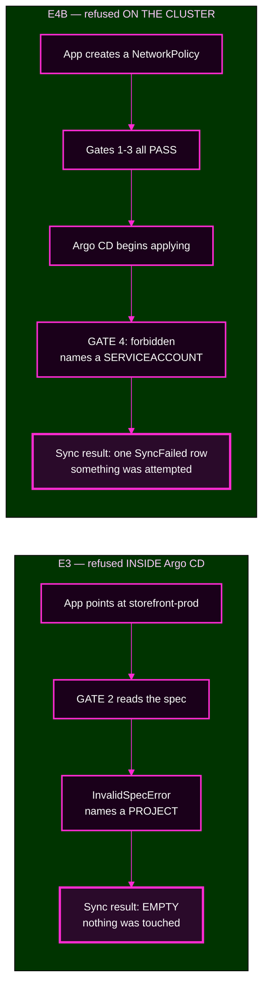

# Lab 5 · Module 3 — Two Denials, Two Systems

> **Day 2 · Lab 5 · Module 3 of 4 · 18 minutes**
> **Run every command in your VM terminal**, after `source ~/argo-lab-env.sh`.
> **← Back to:** [Day 2 map](../README.md) · [Lab 5](README.md)

---

## Module TL;DR

- **What this is.** You trigger two refusals minutes apart — one from Argo CD, one from Kubernetes — and complete a comparison that names the owner of each.
- **Why it matters.** This is the exact skill the capstone's authorization fault tests, and the two failures look identical as badges.
- **What to remember.** *Did anything on the cluster actually get touched?* Nothing → Argo CD. Started and rejected → Kubernetes.
- **The most common mistake.** Reading the badge instead of the message, then editing the wrong configuration.

---

## The rhythm for every attempt

**Predict** which gate refuses and what the message will say → **try** it → **read** the actual message and confirm which gate it names.

**Predicting first is not a formality.** The exercise is noticing when you were wrong.

## The two denials you are about to produce



*The two highlighted boxes are the only mechanical difference you can rely on. Everything above them can look identical.*


---

# Exercise 3 — An AppProject denial · 6 min

## Why

Gate 2 is the boundary that separates one tenant from another. You need to recognise its refusal instantly, and know that it is fixed in Argo CD, not on the cluster.

## Starting state

E1 and E2 are complete. `team-a-guestbook` is `Synced`/`Healthy`.

**Identity:** `admin`.

## Predict

You are about to create an Application in project `team-a` whose destination namespace is `storefront-prod` — which team-a's project does **not** permit.

**Write down three answers:**

1. Which gate refuses it?
2. Does anything reach the workload cluster?
3. Does a sync operation even run?

## Do

Make a throwaway by copying your E2 Application and changing two things — its **name** and its **destination namespace**:

```bash
sed -e 's/name: team-a-guestbook/name: team-a-wrong-dest/' \
    -e 's/namespace: team-a$/namespace: storefront-prod/' \
    ~/platform-config/applications/team-a-guestbook.yaml > /tmp/team-a-wrong-dest.yaml

grep -nE 'name:|namespace:' /tmp/team-a-wrong-dest.yaml
kubectl --context k3d-mgmt apply -f /tmp/team-a-wrong-dest.yaml
argocd app get team-a-wrong-dest
```

> **Check the `grep` output before applying.** `metadata.namespace` must still be `argocd` — that is where Application objects live. Only the **destination** namespace changes to `storefront-prod`.

## Observe

**Expected** — verified on the course environment. The condition row is one long line, so scroll right in your terminal:

```text
Sync Status:        Unknown
Health Status:      Unknown

CONDITION         MESSAGE
InvalidSpecError  application destination server 'https://k3d-workload-server-0:6443' and
                  namespace 'storefront-prod' do not match any of the allowed destinations
                  in project 'team-a'
```

**🔍 Note the exact shape**, because you will match on it for the rest of the course:

- condition type **`InvalidSpecError`**
- the phrase **"do not match any of the allowed destinations in project"**
- the project named in **single quotes**
- **no sync was needed.** The refusal happened on the spec alone.

## Diagnose

**▶ Prove that nothing reached the cluster:**

```bash
kubectl --context k3d-mgmt -n argocd get application team-a-wrong-dest \
  -o jsonpath='{.status.operationState.syncResult.resources}' ; echo
```

**Expected: nothing at all.** There is no sync result, because there was no sync.

**▶ Optional — press Sync anyway and watch what an Argo CD-side refusal looks like as an operation:**

```bash
argocd app sync team-a-wrong-dest --timeout 30
```

**Expected** — verified:

```text
Phase:              Error
Duration:           0s
Message:            InvalidSpecError: application destination server '...' and namespace
                    'storefront-prod' do not match any of the allowed destinations in project 'team-a'
{"level":"fatal","msg":"timed out (30s) waiting for app \"team-a-wrong-dest\" match desired state"}
```

> **⚠️ Always add `--timeout 30` when syncing a refused app from the CLI.** Without it, `argocd app sync` **never returns**. The operation ends instantly, but the CLI keeps waiting for the app to reach its desired state — which a refused app never will. Press **Ctrl+C** if you are already stuck.
>
> **The last line is the CLI giving up on its wait, not a second error.** The refusal is the `Message:` line.

**`Phase: Error`, `Duration: 0s`, and an empty sync result. This is gate 2.**


<!-- CAPTURE-SPEC: SS-L5-03 — conditions, destination rejected. State: E3. Highlight: InvalidSpecError row. Argo CD v3.5.2. -->

### Staged hints

<details>
<summary><b>Hint 1 — what to inspect</b></summary>

The badge tells you something is wrong. It cannot tell you which system objected.

The Application carries a **condition**. Read that, not the badge.
</details>

<details>
<summary><b>Hint 2 — which command or object to examine</b></summary>

```bash
kubectl --context k3d-mgmt -n argocd get application team-a-wrong-dest \
  -o jsonpath='{range .status.conditions[*]}{.type}: {.message}{"\n"}{end}'
```
</details>

<details>
<summary><b>Hint 3 — how to interpret what you get back</b></summary>

Ask what **vocabulary** the message uses.

Does it name a **project**? Then it is the AppProject — gate 2.
Does it name a **ServiceAccount**? Then it is Kubernetes — gate 4.
Does it talk about **managing** a scope or **namespaced mode**? Then it is the cluster registration — gate 3.
</details>

<details>
<summary><b>Final hint — the direction of the fix</b></summary>

The message names a project and the exact value it rejected.

Outside a lab, you would either correct the Application to point somewhere permitted, or **deliberately** widen the project and commit that change for review. The fix is in Argo CD, never on the workload cluster.
</details>

## Verify

Leave the throwaway in place. You clean up at the end of E4.

## ✅ Key Takeaways — E3

- **Gate 2 refuses on the spec alone**, with no sync and nothing applied.
- **The signature is `InvalidSpecError` plus "do not match any of the allowed destinations in project".**
- **An empty sync result is the mechanical proof** that nothing was touched.
- **Syncing a refused app from the CLI hangs without `--timeout`.**

---

# Exercise 4 — A Kubernetes RBAC denial, and the comparison · 12 min

## Why

This is the centrepiece of the lab. Two refusals that look the same and are fixed by **different teams**.

## Starting state

E3's throwaway exists. `team-a-guestbook` is healthy.

---

## Part A — an Argo CD RBAC denial (gate 1)

**Switch identity to the tenant account:**

```bash
argocd login localhost:8443 --username team-a-dev --insecure
```

*(The password is in `~/course/credentials/team-a-dev.txt`. Do not echo it.)*

**▶ Predict:** `team-a-dev` has `get` and `sync` on `team-a/*` only. What happens when it tries to sync a **storefront** application? Which gate, does a sync start, and **how much will the message tell you**?

```bash
argocd app sync storefront-prod-workload
```

**Expected** — verified, and strikingly unhelpful:

```text
{"level":"fatal","msg":"rpc error: code = PermissionDenied desc = permission denied"}
```

**That is the entire message.** No resource, no action, no object, no subject.

<details>
<summary>Why is it so terse?</summary>

**Because you asked about an object you are not allowed to see.** Describing the denial in any detail would confirm that `storefront-prod-workload` exists.

**Compare this with E5**, where the same gate produces a fully detailed message — because there, you *are* allowed to see the object.

**Same gate. The difference is what you are permitted to know.**
</details>

**▶ Confirm least privilege is not "no access":**

```bash
argocd app list -o name
```

**Expected:** only team-a's own Applications are listed. The account can see its own work and nothing else.

### Where the detail actually lives

**Switch back to `admin`** and read the server log:

```bash
argocd login localhost:8443 --username admin \
  --password "$(cat ~/course/credentials/argocd-admin.txt)" --insecure
kubectl --context k3d-mgmt -n argocd logs deploy/argocd-server | grep "permission denied" | tail -2
```

**Expected** — verified, two lines per denial:

```text
level=warning msg="user tried to get application which they do not have access to: rpc error:
code = PermissionDenied desc = permission denied: applications, get,
storefront/storefront-prod-workload, sub: team-a-dev, iat: ..." security=2 user=team-a-dev

level=warning msg="finished call" grpc.code=PermissionDenied grpc.method=Get ...
```

**🔍 Three things in there matter:**

1. **The blocked action is `get`, not `sync`.** The CLI's first move is to fetch the Application. That `get` is refused, so `sync` is never even evaluated.
2. **`security=2`** is Argo CD's severity marker, intended for a security monitoring system to collect.
3. **`grpc.method=Get`** independently confirms which call was blocked.


*Figure SS-L5-05 — The same denial in the user interface, viewed as `team-a-dev`. There is **no Sync button**, because the page cannot load the Application at all. Navigation still works, and `team-a-dev` can open its own app — least privilege, not "no access."*

<!-- CAPTURE-SPEC: SS-L5-05 — app page as team-a-dev, refused. State: E4A. Argo CD v3.5.2. Auth: team-a-dev. -->

---

## Part B — a Kubernetes RBAC denial (gate 4)

**Identity: `admin`.**

The `team-a-apps` repository ships `attempts/network-policy/netpol.yaml`, a **NetworkPolicy** in `team-a`.

**Here is the asymmetry that makes this interesting:**

- The **AppProject allows** the `NetworkPolicy` kind — you put it in the allow-list in E1.
- The **cluster registration allows** it — it is namespaced, in a permitted namespace.
- **Argo CD RBAC allows** `admin` to sync anything.

**Every Argo CD gate passes. And the sync will still fail.**

**▶ Ask gate 4 directly, before you trigger anything:**

```bash
kubectl --context k3d-workload auth can-i create networkpolicies.networking.k8s.io -n team-a \
  --as=system:serviceaccount:argocd-access:argocd-manager
```

**Expected:** `no` — verified.

**▶ Predict:** given that `no`, will the sync **refuse up front** like E3, or **start and then fail**? And which name will appear in the message?

**Do it:**

```bash
sed -e 's/name: team-a-guestbook/name: team-a-netpol/' \
    -e 's|path: guestbook|path: attempts/network-policy|' \
    ~/platform-config/applications/team-a-guestbook.yaml > /tmp/team-a-netpol.yaml

kubectl --context k3d-mgmt apply -f /tmp/team-a-netpol.yaml
argocd app sync team-a-netpol --timeout 60 ; argocd app get team-a-netpol
```

## Observe

**Expected** — verified on the course environment:

```text
Phase:              Failed
Duration:           0s
Message:            one or more objects failed to apply, reason:
                    networkpolicies.networking.k8s.io is forbidden:
                    User "system:serviceaccount:argocd-access:argocd-manager"
                    cannot create resource "networkpolicies" in API group
                    "networking.k8s.io" in the namespace "team-a"

GROUP              KIND           NAMESPACE  NAME                 STATUS     MESSAGE
networking.k8s.io  NetworkPolicy  team-a     team-a-default-deny  OutOfSync  networkpolicies... is forbidden: ...
```

**🔍 Compare this with E3, line by line:**

| | E3 (gate 2) | E4 Part B (gate 4) |
|---|---|---|
| `Phase:` | `Error` | **`Failed`** |
| The word to look for | `InvalidSpecError` | **`forbidden`** |
| Who is named | a **project** | a **ServiceAccount** |
| Does Argo CD appear in the message? | yes, it names the project | **no** — Argo CD is only the messenger |

**▶ Now the mechanical proof. Run the same command you ran in E3:**

```bash
kubectl --context k3d-mgmt -n argocd get application team-a-netpol \
  -o jsonpath='{.status.operationState.syncResult.resources}' | head -c 300 ; echo
```

**Expected** — verified:

```text
[{"group":"networking.k8s.io","hookPhase":"Failed","kind":"NetworkPolicy","message":"networkpolicies.
networking.k8s.io is forbidden: User \"system:serviceaccount:argocd-access:argocd-manager\" cannot
create resource ...","name":"team-a-default-deny","namespace":"team-a","status":"SyncFailed",...
```

**`"status":"SyncFailed"`. In E3 this command printed nothing at all.**

> **That is the settler.** Argo CD got far enough to **try**, and the cluster pushed back. Resource result rows exist only when something was actually attempted.


<!-- CAPTURE-SPEC: SS-L5-06 — sync result, Kubernetes forbidden. State: E4B. Argo CD v3.5.2. -->

---

## Diagnose — complete the comparison

**▶ Fill this in from your own run:**

| Attempt | Who denied it? | Where is it logged? | Which config fixes it? | Who owns that config? |
|---|---|---|---|---|
| **A:** `team-a-dev` syncs `storefront-prod-workload` | | | | |
| **B:** NetworkPolicy in `team-a` | | | | |

**And the question that makes it stick: for each denial, which team do you page?**

<details>
<summary>Show the worked comparison once yours is complete</summary>

| Attempt | Who denied it? | Where logged? | Which config fixes it? | Who owns it? |
|---|---|---|---|---|
| **A** | **Argo CD RBAC (gate 1)** — Argo CD refused *the person* | the `argocd-server` log, tagged `security=2`. **Not visible to the caller at all** | `policy.csv` in the Argo CD values | the **platform team** |
| **B** | **Kubernetes RBAC (gate 4)** — the cluster refused *the ServiceAccount* | the Application's sync result, and the workload cluster's audit trail | a `Role` and `RoleBinding` in the `team-a` namespace | whoever **administers the workload cluster** |

**Which team do you page?** For A, the platform team who own Argo CD's policy. For B, the cluster administrators. **Frequently different people**, which is exactly why naming the gate correctly matters more than noticing that something is red.
</details>

### Staged hints

<details>
<summary><b>Hint 1 — what to inspect</b></summary>

The single most useful question is: **did the sync do anything?**

One of these attempts never reached the cluster. The other reached it and was rejected there.
</details>

<details>
<summary><b>Hint 2 — which command or object to examine</b></summary>

```bash
kubectl --context k3d-mgmt -n argocd get application <name> \
  -o jsonpath='{.status.operationState.syncResult.resources}' ; echo
```

Run it for `team-a-wrong-dest` and for `team-a-netpol`, and compare.
</details>

<details>
<summary><b>Hint 3 — how to interpret what you get back</b></summary>

**Empty** means Argo CD refused before touching anything — gates 1, 2, or 3.

**A list containing `"status":"SyncFailed"`** means Argo CD tried and Kubernetes refused — gate 4.

Then read the **vocabulary** of the message to pick which of the Argo CD gates it was.
</details>

<details>
<summary><b>Final hint — the direction of the fix</b></summary>

For **A**, the fix is a line in `policy.csv`, applied through the Argo CD values — and it should be a deliberate decision, not a reflex.

For **B**, the fix is **not in Argo CD at all**. It is a `Role` and `RoleBinding` on the workload cluster, granting the `argocd-manager` ServiceAccount the missing verbs on that resource in that namespace.

**If Part B does not fail for you**, the team-a Role has been widened. Re-run the `auth can-i` check; it should print `no`.
</details>

---

## Optional deepening — when two gates could refuse, which speaks first? · 4 min

**This is optional. Skip it if you are short of time.**

The `team-a-apps` repository also ships `attempts/cluster-scoped/clusterrole.yaml`, a **ClusterRole**.

**▶ Predict harder:** *two* gates could refuse this. **Gate 2**, because your `clusterResourceWhitelist` is empty. And **gate 3**, because the cluster registration sets `clusterResources: "false"`. **Which one speaks first?**

```bash
sed -e 's/name: team-a-guestbook/name: team-a-clusterrole/' \
    -e 's|path: guestbook|path: attempts/cluster-scoped|' \
    ~/platform-config/applications/team-a-guestbook.yaml > /tmp/team-a-clusterrole.yaml

kubectl --context k3d-mgmt apply -f /tmp/team-a-clusterrole.yaml
argocd app sync team-a-clusterrole --timeout 60 ; argocd app get team-a-clusterrole
```

**Expected** — verified:

```text
Phase:              Error
Duration:           0s
Message:            ComparisonError: Failed to load live state: cluster level ClusterRole
                    "team-a-escalation" can not be managed when in namespaced mode
```

Nothing was created — confirm it:

```bash
kubectl --context k3d-workload get clusterrole team-a-escalation
```

```text
Error from server (NotFound): clusterroles.rbac.authorization.k8s.io "team-a-escalation" not found
```

<details>
<summary>Which gate spoke, and why that one?</summary>

**Gate 3 — the cluster registration scope.**

Read the message for the **layer**, not the outcome. The phrase `can not be managed when in namespaced mode` is about the **cluster connection**. The words "project" and "team-a" do not appear anywhere in it.

**Why did gate 3 speak before gate 2?** Argo CD refused while *loading live state* for the comparison, and that happens **before** it checks the project's resource allow-lists. The order it reaches its checks is:

1. Is the spec valid for this project? → E3's `InvalidSpecError`
2. Can I read live state for these kinds on that cluster? → **this**, gate 3
3. Is every kind in the sync permitted by the project? → only reached when 1 and 2 pass

**So your empty `clusterResourceWhitelist` is real — it simply never got asked.** A narrower guard stands in front of it.

> **Defence in depth means the outer gate usually gets the microphone.** That is why you name the gate from the message's vocabulary, never from the one you predicted.
</details>

---

## Cleanup

**Remove the throwaways.** They never created anything, so `--cascade=false` leaves nothing behind:

```bash
argocd app delete team-a-wrong-dest --cascade=false
argocd app delete team-a-netpol      --cascade=false
argocd app delete team-a-clusterrole --cascade=false   # only if you did the optional part
rm -f /tmp/team-a-wrong-dest.yaml /tmp/team-a-netpol.yaml /tmp/team-a-clusterrole.yaml
```

> **⚠️ At v3.5.2 these commands do not ask for confirmation — verified.** Check each name twice, and **never point this at `team-a-guestbook`.**

**Verify the cleanup:**

```bash
argocd app list -o name | grep team-a
```

**Expected:** `argocd/team-a-guestbook` and nothing else.

## ✅ Key Takeaways — E4

- **Two refusals, two systems, two teams.** The badge is the same; everything else differs.
- **Gate 1's message detail depends on what you are allowed to see.** The full record is always in the `argocd-server` log.
- **The mechanical settler is the sync result:** empty means Argo CD refused; `SyncFailed` rows mean Kubernetes did.
- **Name the gate from the message's vocabulary**, not from your prediction.
- **Several gates can refuse one request, and only the first one speaks.**

---

## ✅ Key Takeaways from this module

- **`InvalidSpecError` + a project name = gate 2.** Nothing applied.
- **`forbidden` + a ServiceAccount = gate 4.** Something was attempted and rejected.
- **`permission denied` + a subject = gate 1.** Terse when you cannot see the object.
- **`namespaced mode` + no project name = gate 3.** The connection's scope.
- **"Which team do you page?" is answered by the message's vocabulary.**

---

## Final module TL;DR

- **What this is.** Two denials from two systems, compared on who, where, what, and who owns it.
- **Why it matters.** The capstone's authorization fault arrives with no label.
- **What to remember.** *Did anything on the cluster actually get touched?*
- **The most common mistake.** Confirming your prediction instead of reading the evidence.

**→ Next:** [04 — Deletion, finalizers, and wrap-up](04-deletion-protection-and-wrap-up.md)
